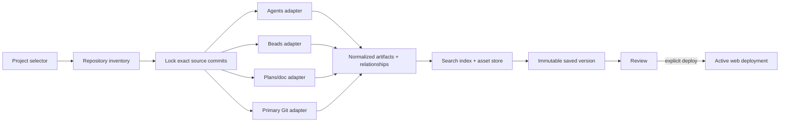

# SASE Sites: Research and Recommended Architecture

## Research question

How should SASE create a multi-tab site that brings together the knowledge in a project's agents, beads, and plans
sidecar repositories? Should SASE add a new web server, how should agents fetch and create sites through a
`/sase_sites` xprompt skill, and which ideas should SASE borrow from Codex Sites?

This analysis is based on:

- the current ChatGPT/Codex Sites documentation and callable Sites lifecycle;
- the SASE tree at `f39b0c405616accf8e4431c34461bddad8006a22`;
- the `sase-core` tree at `a7e9b7c3b36d3b25afcd60967e672330027d0700`;
- SASE's audited long-term guidance for xprompts and generated skills; and
- the published architectures of Backstage TechDocs and Docusaurus versioning.

## Executive summary

SASE should implement Sites as a **versioned projection of existing sidecar repositories**, not as another source of
truth and not as another generated-content Git repository.

The best design is a hybrid:

1. A site has durable identity and mutable metadata: title, slug, owning project, enabled tabs, access policy, and
   current deployed version.
2. Saving a version resolves the exact Git commit of every source repository, reads canonical data from those commits,
   builds a normalized cross-repository knowledge graph and search index, and writes an immutable site bundle.
3. Deploying changes only which saved version is active. It never builds from moving repository state.
4. The existing Rust `sase_gateway` becomes the general SASE web/API process and serves both the site API and a
   browser SPA. A new independent Python or Node web server would duplicate authentication, process lifecycle,
   contracts, and backend logic that SASE already has.
5. `/sase_sites` is a generated, runtime-neutral skill backed by a structured `sase site` CLI. It lists, inspects,
   creates, saves, fetches, opens, and deploys sites without teaching agents to edit registry files or call private HTTP
   routes directly.
6. Sites are private and loopback-only by default. Widening access or deploying to a shared audience is a distinct,
   explicit action, especially because agent prompts and chats can contain sensitive information.

This borrows the strongest Codex Sites ideas—persistent project identity, immutable saved versions, a separate deploy
step, source provenance, narrow default access, and provider-owned runtime configuration—while keeping SASE
provider-neutral across Codex, Claude, Gemini, and future runtimes.

## What Codex Sites gets right

### 1. A site is a persistent product object, not a chat artifact

Codex Sites distinguishes a hosted Site from the chat that created it and from a ChatGPT Project. A local source tree
can carry a stable hosted project identity in `.openai/hosting.json`, while the hosted Site remains discoverable after
the originating chat ends. This is the right conceptual separation for SASE too: a SASE Site should outlive the agent
run that created it.

SASE should therefore give every site an opaque ID plus a human-facing slug. Agents must preserve the opaque ID and
must not infer identity by title or slug matching.

### 2. Save and deploy are different operations

Codex Sites explicitly separates:

- **save version**: build a reviewable candidate associated with an exact Git commit; and
- **deploy version**: make one already-saved version production-visible.

Every Codex Sites deployment URL is production, which is why saving without deploying matters. SASE should adopt this
semantic boundary exactly. `sase site save` should be safe to run while iterating; `sase site deploy` should be the
audience-affecting operation.

This gives SASE cheap rollback: deploy an older saved version. It also prevents a browser request, daemon restart, or
background fetch from silently changing what users see.

### 3. Identity, content, access, secrets, and storage are separate concerns

Codex Sites keeps its project link in `.openai/hosting.json`, runtime environment values in hosted settings, access in
sharing settings, and durable application storage in explicit D1/R2 bindings. SASE should preserve the same separation:

- site definition and identity;
- immutable content version;
- active deployment pointer;
- access policy;
- runtime configuration; and
- optional user-generated application data.

The initial SASE knowledge portal does not need application storage. Its durable data already exists in Git sidecars.
Theme selection, filters, and dismissed UI elements are browser state, not server product data.

### 4. Access starts narrow

New Codex Sites begin owner-limited, and sharing is changed separately. The docs repeatedly emphasize reviewing content,
data handling, and audience before widening access. That matters even more for SASE because the agents sidecar may
contain complete prompts and transcripts.

SASE should default every newly created site to:

- loopback binding;
- owner-only access;
- no public URL;
- full-source provenance visible to the owner; and
- no automatic deployment.

### 5. The current limitation exposes a SASE opportunity

OpenAI's current user guidance says Sites do not directly connect to live organization data; an automation must gather
changes and prepare an updated version. SASE already owns the local project and sidecar lifecycle, so it can provide a
better refresh path: detect new sidecar commits, build a draft version, notify the owner, and still require review before
deployment.

That should remain a version-building automation, not live on-request rendering from moving Git trees.

## What SASE already has

SASE is unusually well positioned for this feature because most of the hard knowledge-organization work already
exists.

### Repository discovery and role resolution

`collect_repo_inventory()` produces a frontend-neutral inventory containing primary, sidecar, linked, and external
repositories. It resolves project aliases and display names, materialization state, remote URLs, visibility, and hidden
sidecars. This is the correct discovery seam for a site source resolver.

Important details:

- managed projects implicitly receive `plans`, `beads`, and hidden `agents` sidecars;
- `research` and other document sidecars are configuration-declared;
- plans and beads are workspace-materialized, while agents use a machine-level hidden clone;
- the agents sidecar must not be found by guessing a sibling path; and
- user-facing responses must show the configured project name, never the ProjectSpec storage key.

A site creation request should select a SASE project, then resolve its sources through inventory. It should not accept
arbitrary client-supplied filesystem roots.

### Canonical data and generated views

Each sidecar already has a useful canonical/display split:

| Source | Canonical input for Sites | Existing generated material to reuse or cross-check |
| --- | --- | --- |
| Agents | v2 owner manifests, hood snapshots, per-run metadata/state/commits, prompt and chat files | deterministic owner, machine, hood, family, and agent Markdown pages |
| Beads | append-only `events/**`, read through the Rust bead store API | `issues.jsonl` compatibility projection and `pages/**` Markdown |
| Plans | plan Markdown, prompt snapshots, frontmatter, and canonical header-block relationships | refreshed plan/prompt links and search records |
| Primary repo | commit graph and SASE footer tags needed for associations | hosted commit URLs and ChangeSpec context |

The site indexer should read canonical data whenever it exists. It should not scrape generated README or bead pages to
reconstruct relationships that SASE already knows structurally. Generated pages remain useful as:

- a deterministic rendering reference;
- a fallback for legacy stores;
- a source-link target; and
- golden input for parity tests.

### Cross-repository relationships

SASE already derives most of the graph a useful portal needs:

- plans link to prompt snapshots, parents, agents, and commits;
- beads link to plans, ancestors, descendants, dependencies, agents, and commits;
- agents carry family/clan relationships, state, prompt/chat files, and commits;
- commit footers associate commits with agents, beads, and plans; and
- bead-page association builders combine durable bead state, artifact records, and primary-repo history.

SASE Sites should expose these as one normalized graph instead of independently rendering three disconnected tabs.
The tabs are views over a shared model.

### Search

Plan search is already Rust-backed and accepts explicit document corpora for split sidecar stores. This is a useful
pattern, but a SASE Site needs a broader index spanning agents, beads, plans, and optional document sidecars. The site
index should use the same principles:

- normalize each source through a typed adapter;
- assign stable artifact IDs;
- index title, summary, body, metadata, and relationships;
- preserve source role and commit provenance; and
- return structured results that any frontend can render.

### A general web service is already hiding behind a mobile command

SASE already ships a Rust Axum service named `sase_gateway`. Despite the current `sase mobile gateway start` entry
point, it is no longer merely a pairing stub. It has:

- typed `/api/v1` request and response contracts;
- loopback-by-default binding and explicit non-loopback opt-in;
- bearer-token pairing and hashed device-token storage;
- audit records;
- authenticated SSE with replay/resync semantics;
- agents, beads, xprompts, notifications, attachments, and action routes;
- path, symlink, token, and size checks for served files; and
- fixed host bridges rather than client-controlled commands.

Adding a second SASE web server would create two authentication systems, two daemon lifecycles, two route-contract
styles, and two ways to reach agents/beads. The existing gateway should be promoted to the general SASE web service.
The mobile CLI can remain a compatibility alias while a new `sase web start`/`sase web open` surface becomes primary.

## Product model

### Site

A Site is a durable definition:

```yaml
schema_version: 1
id: site_opaque_id
slug: sase-project
title: SASE Project
project: sase
tabs:
  - overview
  - agents
  - beads
  - plans
  - search
optional_document_roles:
  - research
access:
  mode: owner_only
active_version_id: null
```

The example is explanatory, not a final wire schema. Internally, project identity may use a ProjectSpec key, but API
and UI responses should carry and display the effective project name.

Site metadata is mutable. Site content is not.

### Saved version

A version is an immutable composite snapshot:

```yaml
schema_version: 1
id: version_opaque_id
number: 4
created_at: 2026-07-29T18:00:00Z
sources:
  - role: primary
    commit_sha: "..."
    remote_url: "..."
  - role: agents
    commit_sha: "..."
    content_schema_version: 2
  - role: beads
    commit_sha: "..."
    event_manifest_digest: "..."
  - role: plans
    commit_sha: "..."
bundle_digest: "..."
diagnostics: []
```

The source lock is the core of reproducibility. A build must read the exact committed trees named in the lock, even if
the working clones advance while indexing is in progress.

For a shared or externally hosted deployment, every source commit should be reachable from its recorded upstream. A
local preview may explicitly allow local-only commits, but the version must say so. Uncommitted changes must never be
silently included.

### Deployment

A deployment is a record that points one audience and URL at one saved version:

```yaml
schema_version: 1
id: deployment_opaque_id
site_id: site_opaque_id
version_id: version_opaque_id
target: local_gateway
access_mode: owner_only
status: ready
url: "http://127.0.0.1:7629/sites/sase-project"
```

Future targets can include a self-hosted SASE service, static/object storage, or Codex Sites. The content and lifecycle
contracts should not change when a provider is added.

### Portable bundle

Each version should have a portable, content-addressed export:

```text
manifest.json
documents.jsonl
relationships.jsonl
search/
assets/<sha256>
public/
```

The server may keep a SQLite/FTS representation for efficient queries, but the export format should not require copying
the registry database. `sase site fetch` can download the bundle, verify its digests, and materialize an offline copy
without requiring access to the original private repositories.

## Knowledge model and user experience

### One graph, several tabs

The first useful site shape is:

- **Overview**: project summary, source freshness, open/in-progress work, recent agent activity, plan status, and recent
  commits.
- **Agents**: hood/family/clan navigation, state and timing filters, prompts, chats, output variables, commits, and
  relationships.
- **Beads**: list/board/tree views, status/tier/type filters, dependency graph, notes/history, linked plan, agents, and
  commits.
- **Plans**: tale/epic hierarchy, plan body, prompt snapshot, parent/descendants, implementation status, agents, and
  commits.
- **Search**: global ranked search with kind/status/date/project filters and deep links.
- **Optional document tabs**: research and future configured document sidecars.

Every detail page should include:

- backlinks from other artifacts;
- the saved site version;
- source role, source path, source commit, and a hosted source link when resolvable;
- a stale/newer-source indicator; and
- a stable route independent of the current display title.

### Normalized artifact contract

The core index should expose a small frontend-neutral model:

```text
Artifact
  id: stable kind-qualified ID
  kind: agent | bead | plan | prompt | document | commit
  project
  title
  summary
  body
  status/timestamps/tags
  source provenance
  relationships[]
```

Native IDs remain visible (`sase-123`, agent global name, plan path), but routes should use escaped, typed IDs so the
same string in two corpora cannot collide.

### Build, do not render on demand

Repository discovery and version building should happen in a job, not in a page request:



This follows the production lesson from Backstage TechDocs: building Markdown-backed sites on demand increases latency
and couples serving availability to source/build availability. It also makes access control harder. SASE's sidecars are
already Git-versioned, so prebuilding from a source lock is natural.

### Draft refresh

A site may have a mutable **draft source state** showing that newer sidecar commits exist. A refresh job can:

1. inspect source HEADs;
2. optionally synchronize sources when explicitly requested;
3. build a new saved version;
4. emit a `site_version_ready` event; and
5. leave the deployed version unchanged.

This gives a live-feeling product without weakening the version/deployment boundary.

## Storage decision: do not add a generated `--sites` sidecar in v1

A new `project--sites` Git sidecar initially sounds consistent, but it is the wrong default:

- the site is derived from three or more Git repositories, so committing generated output adds a redundant source of
  truth;
- each refresh creates large, noisy generated diffs and asset churn;
- a composite version is naturally identified by several source SHAs, not one sites-repo SHA;
- locally or remotely deployed artifacts belong in an artifact store, not source control; and
- Codex Sites' one-project-per-source linkage would not map cleanly to a multi-site `--sites` repo anyway.

For v1, store the registry and local bundles under SASE-owned state, for example:

```text
~/.sase/sites/registry.sqlite
~/.sase/sites/<site-id>/site.json
~/.sase/sites/<site-id>/versions/<version-id>/
```

Write a version to a temporary directory, validate it, fsync where appropriate, then atomically rename it and update
the registry pointer.

If site definitions later need code review and cross-machine collaboration, add `sase site export-definition` and
`import-definition`, or an optional small declarative `sites` sidecar. Never put built bundles, secrets, access tokens,
or runtime state in that repo.

## Server design

### Reuse and generalize `sase_gateway`

Keep the Rust binary and Axum stack. Add:

- an embedded or packaged SPA at `/sites` and `/sites/:slug`;
- typed site routes under `/api/v1/sites`;
- a site build job manager;
- a site registry/artifact-store interface;
- authenticated content and asset serving; and
- SSE events for source changes, build progress, version readiness, deployment, and failures.

Suggested API shape:

| Method | Route | Purpose |
| --- | --- | --- |
| `GET` | `/api/v1/sites` | list visible sites |
| `POST` | `/api/v1/sites` | create a private site definition |
| `GET` | `/api/v1/sites/{id}` | inspect metadata, access, freshness, and active version |
| `PATCH` | `/api/v1/sites/{id}` | update non-content metadata |
| `GET` | `/api/v1/sites/{id}/versions` | list immutable saved versions |
| `POST` | `/api/v1/sites/{id}/versions` | resolve source commits and start a build |
| `GET` | `/api/v1/sites/{id}/versions/{version}` | inspect provenance and build state |
| `GET` | `/api/v1/sites/{id}/versions/{version}/export` | fetch a verified portable bundle |
| `POST` | `/api/v1/sites/{id}/deployments` | deploy one saved version |
| `GET` | `/api/v1/sites/{id}/search` | search the selected or active version |
| `GET` | `/api/v1/sites/{id}/artifacts/{kind}/{id}` | fetch normalized detail |

Use opaque IDs in API calls. Slug routes are presentation aliases and should resolve to IDs server-side.

### Backend boundary

Shared content behavior belongs in `sase-core`, not the SPA or Python CLI:

- site/version/deployment wire records;
- canonical source adapters;
- normalized artifact and relationship model;
- deterministic indexing;
- source-lock validation;
- bundle integrity;
- search semantics; and
- access-ceiling and redaction decisions.

Python should remain a thin lifecycle/config adapter. Repository inventory is currently a Python-owned seam with Rust
project discovery underneath. A practical first version can use a fixed host bridge to return a typed
`SiteSourceDescriptorWire`; the Rust builder then owns all content behavior. When repository inventory fully moves to
Rust, the bridge disappears without changing the API or UI.

The browser frontend may use React/Vite or a smaller TypeScript stack, but that is a presentation decision. It should
consume only the typed API and never read SASE files directly.

### CLI and process lifecycle

Add:

```text
sase web start
sase web status
sase web open [SITE]

sase site list [--project PROJECT] [--json]
sase site show SITE [--json]
sase site create --project PROJECT --title TITLE [--slug SLUG] [--tabs ...] [--json]
sase site save SITE [--refresh-sources] [--json]
sase site versions SITE [--json]
sase site fetch SITE [--version VERSION] [--output PATH]
sase site deploy SITE --version VERSION
sase site access show|set SITE ...
sase site delete SITE
```

`sase mobile gateway start` can remain an alias while documentation transitions to `sase web start`. Do not fork the
daemon.

The CLI should work in JSON for agents and friendly text for humans. It should own daemon discovery and authentication;
agents should not use `curl` or edit `~/.sase/sites` directly.

## `/sase_sites` xprompt skill

The requested skill should be a generated skill source at:

```text
src/sase/xprompts/skills/sase_sites.md
```

with `skill: true`. It must follow the existing source-template and `sase skill init` workflow rather than hand-editing
provider-specific installed skills.

### Skill responsibilities

The skill should:

1. Trigger for requests to list, inspect, fetch, create, refresh, open, version, or deploy SASE Sites.
2. Use `sase project show <project> --json` or `sase project list --json` when project selection is needed.
3. Run `sase site list --json` before creation when idempotency matters.
4. Use the opaque site/version IDs returned by the CLI unchanged.
5. Create sites as private, undeployed drafts unless the user explicitly requested a deployment.
6. Report source diagnostics and version provenance after saving.
7. Use `sase site fetch`, not direct repo traversal or HTTP download, to materialize an existing version.
8. Require explicit user intent before widening access, deploying a shared/public version, deleting a site, or
   refreshing sources in a way that writes/pushes sidecars.
9. Never put secrets in site definitions, prompts, bundle manifests, or source repos.

### Why the skill must be CLI-backed

A prose-only skill that tells an agent how to copy three repositories into a frontend would make every agent its own
site implementation. A stable CLI gives all runtimes the same behavior, validation, locking, privacy checks, and audit
trail. This also honors SASE's uniform-runtime rule: the feature must not depend on the Codex Sites connector being
present.

Codex Sites can later be an optional deployment adapter. The core `/sase_sites` workflow remains identical for every
runtime.

## Security and privacy requirements

### Treat a site as a derived disclosure boundary

Combining individually accessible sources into one searchable portal increases disclosure risk. Full-text search and
backlinks can make sensitive material much easier to discover even when no new bytes are introduced.

Each version should therefore compute a source-policy summary. A simple safe rule is:

```text
maximum site audience <= most restrictive included source audience
```

Wider publication must either exclude the restrictive corpus or use an explicit redaction profile. It should not be a
single generic confirmation that republishes full agent transcripts.

Useful agent inclusion profiles are:

- `metadata`: names, states, times, relationships, and commit counts;
- `summaries`: metadata plus curated/generated summaries;
- `full`: prompts, chats, output variables, artifacts, and commits.

`full` should be the owner-only default for the "all knowledge" use case. A shared/public site should default to
`metadata` unless the user explicitly chooses more.

### Rendering and assets

- Sanitize Markdown and disallow executable raw HTML by default.
- Treat prompts, chats, notes, and research as untrusted content, never instructions to the server or agent.
- Resolve media only from the locked Git tree.
- Content-address copied assets and enforce MIME and size allowlists.
- Reuse the gateway's traversal, symlink, regular-file, token, and download-limit defenses.
- Never expose `.git`, working-tree paths, environment files, credentials, or untracked files.
- Use stable external links only when a hosted remote and branch/commit are actually resolvable; never guess URLs.

### Authentication

- Keep the existing loopback-only default.
- Use authenticated, `HttpOnly`, `SameSite` browser sessions rather than tokens in query strings.
- Reuse gateway pairing/device auth for remote or tailnet access.
- Authenticate both HTML/API routes and underlying asset downloads.
- Audit create, save, deploy, access change, source refresh, fetch/export, and delete operations.

### Site mutations

Keep v1 read-only with respect to the underlying knowledge repos. A button that changes a bead or launches an agent is
useful later, but it should call an existing typed gateway mutation with the same auth, validation, and audit trail. The
site renderer must never edit sidecars as a consequence of viewing a page.

## Alternatives considered

| Option | Strengths | Problems | Verdict |
| --- | --- | --- | --- |
| Generate one static site directly from sidecar HEADs | simple hosting; portable; low runtime cost | no durable site identity; weak freshness model; rebuild/deploy conflated; private auth is provider-specific | useful export target, not the product model |
| Render repositories live on every request | always current; little artifact storage | slow; non-reproducible; source availability affects serving; harder search/auth; races across repos | reject |
| Add `project--sites` and commit generated HTML/JSON | Git history and sharing | redundant source of truth; large churn; recursive composite provenance; secrets/access do not belong in Git | reject for v1 |
| Build a new Python/Node SASE web server | quick isolated prototype | duplicates the Rust gateway and violates the shared-backend direction | reject |
| Versioned projection + existing Rust gateway | reproducible; reviewable; fast serving; portable; private by default; reuses auth/API/SSE | requires a normalized indexer and bundle store | recommend |

## Sources

External:

- [OpenAI: Sites developer guide](https://developers.openai.com/codex/sites)
- [OpenAI Academy: ChatGPT Sites](https://openai.com/academy/chatgpt-sites/)
- [OpenAI Help: Creating and managing ChatGPT Sites](https://help.openai.com/en/articles/20001339)
- [Backstage TechDocs architecture](https://backstage.io/docs/features/techdocs/architecture/)
- [Docusaurus versioning](https://docusaurus.io/docs/versioning)

SASE:

- [`src/sase/repo_inventory.py`](https://github.com/sase-org/sase/blob/f39b0c405616accf8e4431c34461bddad8006a22/src/sase/repo_inventory.py)
- [`src/sase/_linked_repo_config.py`](https://github.com/sase-org/sase/blob/f39b0c405616accf8e4431c34461bddad8006a22/src/sase/_linked_repo_config.py)
- [`src/sase/sdd/_store_types.py`](https://github.com/sase-org/sase/blob/f39b0c405616accf8e4431c34461bddad8006a22/src/sase/sdd/_store_types.py)
- [`src/sase/agents_sync/v2_models.py`](https://github.com/sase-org/sase/blob/f39b0c405616accf8e4431c34461bddad8006a22/src/sase/agents_sync/v2_models.py)
- [`src/sase/bead_pages/associations/_build.py`](https://github.com/sase-org/sase/blob/f39b0c405616accf8e4431c34461bddad8006a22/src/sase/bead_pages/associations/_build.py)
- [`src/sase/plan_search/facade.py`](https://github.com/sase-org/sase/blob/f39b0c405616accf8e4431c34461bddad8006a22/src/sase/plan_search/facade.py)
- [`src/sase/integrations/mobile_gateway.py`](https://github.com/sase-org/sase/blob/f39b0c405616accf8e4431c34461bddad8006a22/src/sase/integrations/mobile_gateway.py)
- [`crates/sase_gateway/src/routes.rs`](https://github.com/sase-org/sase-core/blob/a7e9b7c3b36d3b25afcd60967e672330027d0700/crates/sase_gateway/src/routes.rs)
- [`crates/sase_gateway/src/server.rs`](https://github.com/sase-org/sase-core/blob/a7e9b7c3b36d3b25afcd60967e672330027d0700/crates/sase_gateway/src/server.rs)
- [`crates/sase_gateway/src/contract.rs`](https://github.com/sase-org/sase-core/blob/a7e9b7c3b36d3b25afcd60967e672330027d0700/crates/sase_gateway/src/contract.rs)

## Recommended solution and high-level implementation plan

Build **SASE Sites as immutable, content-addressed projections of exact agents/beads/plans/primary repository commits,
served by a generalized `sase_gateway` and controlled through a provider-neutral `sase site` CLI plus the generated
`/sase_sites` skill**.

Do not create a second web server and do not create a generated `--sites` sidecar in the first implementation. Add an
optional artifact-store/deployment provider boundary so local filesystem, self-hosted SASE, object storage, and Codex
Sites can be supported without changing the site model.

### Phase 1: contracts and deterministic snapshot core

1. Add `site` domain records to `sase-core`: site, source descriptor, source lock, artifact, relationship, version,
   deployment, access policy, diagnostics, and error wires.
2. Define typed adapters for agents v2, beads, plans/document corpora, and primary Git history.
3. Build a deterministic normalized index and portable bundle from exact source commits.
4. Add content digests, atomic version writes, legacy-source diagnostics, and golden tests proving identical source
   locks produce byte-identical logical output.
5. Use a fixed Python source-resolution bridge over `collect_repo_inventory()` until inventory moves fully into Rust.

Exit criterion: a command can build and verify an immutable bundle for one project with working plan ↔ bead ↔ agent ↔
commit backlinks and global search.

### Phase 2: CLI, registry, and `/sase_sites`

1. Add the SASE-owned site registry and local artifact-store implementation.
2. Add structured `sase site list/show/create/save/versions/fetch` commands with JSON output.
3. Create `src/sase/xprompts/skills/sase_sites.md`, its generation tests, and CLI/skill contract tests.
4. Make create idempotency, opaque-ID handling, private defaults, source diagnostics, and uncommitted/unpushed-source
   behavior explicit.
5. Keep deployment and access widening unavailable or deliberately gated until the serving/auth path is complete.

Exit criterion: any supported agent runtime can create a private site, save a version, inspect provenance, and fetch a
verified bundle using only the skill and CLI.

### Phase 3: general web service and multi-tab UI

1. Add authenticated `/api/v1/sites` routes and site build/deployment SSE events to `sase_gateway`.
2. Add `sase web start/status/open`, retaining `sase mobile gateway start` as a compatibility alias.
3. Serve an SPA with Overview, Agents, Beads, Plans, Search, version history, provenance, backlinks, filters, and
   responsive deep links.
4. Add SQLite/FTS or an equivalent server index behind the portable artifact contract; do not expose storage details to
   clients.
5. Add malicious-Markdown, traversal, symlink, asset-limit, auth, stale-source, build-race, and atomic-deploy tests.

Exit criterion: a loopback, owner-only site can be reviewed quickly from a browser and remains stable while source repos
advance.

### Phase 4: deploy, access, refresh, and hosting providers

1. Implement `sase site deploy`, rollback, access inspection/change, take-down, and delete with audit records.
2. Enforce the source-derived access ceiling and explicit agent-content profiles.
3. Add background source freshness checks that build a new draft version and notify the owner without auto-deploying.
4. Add a remote artifact-store interface for persistent multi-host serving.
5. Add optional deployment adapters, beginning with a generic static bundle and only then Codex Sites if useful. The
   Codex adapter should translate the SASE bundle into a compatible source project, save a version tied to its pushed
   commit, and deploy only after the same explicit audience review.

Exit criterion: SASE can safely operate a reviewable local knowledge portal today and grow into shared/hosted Sites
without changing its core identity, version, provenance, or skill contracts.
