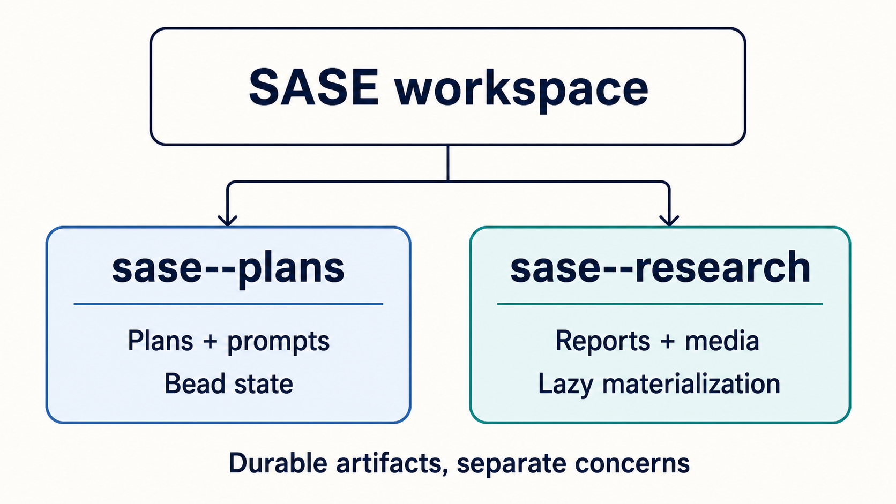

# Split Plans/Research Companion Layout — Phase 7 Smoke Test

**Date:** 2026-07-11  
**Result:** Pass

The workspace exposes plans and research as sibling companion repositories under `sase/repos/`, keeping durable SDD
artifacts near the source checkout without mixing their lifecycles:

- `sase--plans` owns monthly plans, prompt snapshots, and bead state.
- `sase--research` owns monthly research reports and generated media, and is materialized when research is needed.

## Smoke-test observations

Both companions are independent Git roots, both use month-based directories such as `202607/`, and this report and its
infographic can be written together in the research companion. The split gives each artifact class a clear home while
preserving a predictable workspace-local path for humans and agents.

**Conclusion:** The companion layout is present and usable; plans remain durable and continuously available, while
research and media stay separately scoped and can be materialized on demand.
