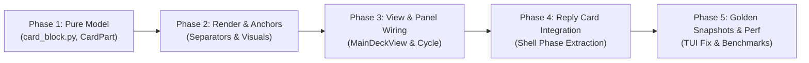

# Research & Architectural Specification: Sub-Card Partitioning via Agent Data Card Blocks

- **Author:** researcher gem (`research.2j.gem`)
- **Date:** 2026-09-25
- **Context:** Architecture review & technical design for extending Agent Data Decks & Cards (`sase-17d`) with hierarchical sub-cards ("Card Blocks")
- **Target Audience:** SASE Core Team, Swarm Lead Synthesizer, ACE TUI Architects

---

## 1. Executive Summary & Core Verdict

The proposal to introduce sub-cards—termed **Agent Data Card Blocks** (or **Card Blocks**)—into the SASE Agent Data Decks & Cards architecture is a **compelling, high-leverage evolution**. 

In modern SASE development, agents are no longer single-turn prompt-and-reply scripts. A single `sase agent` frequently executes an orchestration pipeline spanning multiple **sase shells**: an initial execution shell, one or more supervised monitor procs, human or automated review gate shells, followed by continuation or repair agent shells. Currently, all output from these heterogeneous phases is dumped into a single monolithic `Reply` card (`reply_parts`). This creates severe usability friction: a developer inspecting a 4-phase run must scroll past hundreds of lines of historical agent logs just to check whether the final gate passed or why a monitor tripped.

Partitioning cards into addressable **Card Blocks** provides a clean, 3-tier navigation hierarchy:
$$\text{Deck (Level 1)} \longrightarrow \text{Card (Level 2)} \longrightarrow \text{Card Block (Level 3)}$$

### Primary Questions & Findings

1. **Is this a good idea?**
   **Yes, unequivocally.** Dividing long, multi-phase cards into structured blocks solves the "heterogeneous scroll deluge" problem. It brings structural parity to cards that already exists for decks, allowing both high-density overviews and targeted phase inspection.

2. **Would we take a different approach?**
   **Yes, in the nesting and execution semantics.** A naive implementation of "spread by default, paged after threshold" at both the Deck level and the Card level creates a dangerous **Two-Level Nesting Paradox**: having an inner card page its blocks while its parent deck is rendered spread. We mandate the **"Spread Deck = Spread Blocks" invariant**: when a deck is in spread mode, all cards and all their constituent blocks are rendered continuously on the scroll canvas. Block paging is strictly activated only when a card is inspected in isolation (i.e. when the parent deck is paged or the card is the solitary focus).

3. **What adjustments to requirements are justified?**
   - **Keymap Transport Safety:** While `<ctrl+shift+j>` and `<ctrl+shift+k>` are intuitive companion keybindings to `<ctrl+j/k>`, traditional terminal protocols (VT100 / non-CSI-u) cannot distinguish `Ctrl+Shift+J` from `Ctrl+J` (both emit ASCII `0x0A` / LineFeed). Pressing `Ctrl+Shift+J` on standard macOS Terminal.app or legacy tmux will inadvertently trigger `next_deck_card`. We must provide first-class fallback bindings (`[` and `]` on the Agents tab, plus leader shortcuts `, b j` and `, b k`).
   - **Asymmetric vs. Stack Ordering:** Reversing the block order for the `Reply` card so that the latest shell is shown first in paged mode is an excellent user-focused requirement. However, in spread view, forcing reverse-chronological order (latest shell at the top, initial shell at the bottom) disrupts narrative conversation reading. We specify a **Stack Model**: in paged mode, blocks are indexed in reverse-chronological order (Index 0 = Latest Shell), defaulting to the newest output, with `<ctrl+shift+j>` moving to older preceding shells. In spread view, we preserve top-to-bottom chronological narrative flow, but provide automatic scroll anchoring to the latest block when opened.
   - **Visual Breadcrumbs & Beauty:** To make the feature beautiful rather than cluttered, we reject stuffing complex block indices into the deck window border title. Instead, we specify an **In-Card Phase Navigator Pill** in paged mode and **Titled Block Rule Separators** (`── ⬡ Shell 3: Gate ──`) in spread mode.

---

## 2. Context & Root Problem Analysis: The Multi-Shell Reality

### 2.1 The Post-`sase-17d` Baseline
Epic `sase-17d` unified the legacy metadata panel, file viewer, and LLM calls viewer into the **Agent Data Decks & Cards** architecture:
- **Decks (`DeckId`):** `Main`, `Files`, `Tools`.
- **Cards (`CardPart`):** Discrete units of information within a deck. For `Main`: `Context`, `Reply` (titled "Output" for proc shells/monitors/gates), or `Summary` (for clans/tribes). For `Files`: one card per diff or file. For `Tools`: the `LLM Calls` card.
- **Adaptive Spread vs. Paged View:** Decks render all cards continuously on one scrollable canvas when total lines fit within `spread_max_screens` (default 1.5 viewport heights); when content exceeds this budget, the deck switches to paged mode (one card at a time).
- **Navigation:** `<ctrl+n/p>` cycles decks; `<ctrl+j/k>` cycles cards. In spread mode, `<ctrl+j/k>` scrolls to the card's titled separator anchor (`━━ ◆ Reply ━━━━━`).

### 2.2 The Friction: Multi-Shell Monoliths in `Reply`
According to SASE core memory:
> *"A sase shell is one executing member of a sase agent: an agent shell, a proc shell, or a gate shell. A sase agent is a sequence of sase shells."*

In the current implementation (`src/sase/ace/tui/widgets/prompt_panel/_agent_display_render.py` and `_agent_display_agent_session_render.py`), when an agent executes multiple shells:
```python
reply_parts = [
    reply_header,
    render_phase_divider(get_phase_label(agent), ...),
    *render_agent_reply_content(agent, ...),
]
for followup in agent.followup_agents:
    if followup.is_monitor:
        reply_parts.extend(build_monitor_phase(followup))
        continue
    if followup.is_gate:
        reply_parts.extend(build_gate_phase(followup))
        continue
    reply_parts.append(render_phase_divider(get_phase_label(followup), ...))
    reply_parts.extend(render_agent_reply_content(followup, ...))

self.update(card_document(context_card(...), reply_card(*reply_parts)))
```

Notice what happens:
1. Every phase divider and every shell's reply or monitor/gate block is simply concatenated into a flat list of renderables passed to `reply_card(*reply_parts)`.
2. When the deck is paged to `Reply`, the user is greeted with the top of the card: **the oldest agent shell's output from hours ago**.
3. If an agent ran 1 initial turn, 1 long-running test monitor, 1 gate shell, and 1 repair turn, the `Reply` card can easily exceed 800 lines. The user must hammer `<ctrl+d>` or `G` to find the actual current status or latest gate outcome.
4. There is no way to jump directly between shells without manually scanning through walls of text.

Card Blocks solve this directly by breaking the monolithic `CardPart` into discrete, addressable units.

---

## 3. In-Depth Critique of the Proposed Plan

While the user's plan is intuitively sound, a naive implementation exposes three severe architectural traps. We analyze each below.

### 3.1 Critique 1: The Two-Level Spread/Paged Nesting Paradox

The proposal states:
> *"These should work like decks in that they use a spread view by default and a paged view when the merged contents are past a configurable threshold."*

Consider the matrix of possibilities when both Decks and Cards have Spread/Paged modes:

| Deck Render Mode | Card Render Mode | Visual / Behavioral Result | Assessment |
| :--- | :--- | :--- | :--- |
| **Paged** | **Paged** | One card shown; inside it, only one block shown. `<ctrl+shift+j/k>` flips blocks. | **Excellent & Clean.** Focused triage. |
| **Paged** | **Spread** | One card shown; inside it, all blocks shown with block separators. `<ctrl+shift+j/k>` scrolls to block anchors. | **Excellent & Clean.** Compact card reading. |
| **Spread** | **Spread** | All cards shown; inside each card, all blocks shown with block separators. | **Excellent & Clean.** Complete panoramic overview. |
| **Spread** | **Paged** | **The Paradox:** All cards are laid out vertically in the deck scroll. But inside `Reply`, only Block 1 is visible! Blocks 2 and 3 are hidden! | **FATAL UX ANTI-PATTERN.** |

#### Why "Spread Deck + Paged Blocks" Breaks ACE
1. **Mental Model Incoherence:** The entire definition of a "Spread Deck" is that *everything fits within a comfortable height and can be read by scrolling*. If a user scrolls down past `Context` into `Reply`, expecting to see the agent's work, but finds only an isolated slice of Shell 1 with Shells 2–4 hidden behind an invisible page boundary, the "spread" contract is violated.
2. **Scroll Height & Layout Thrashing:** In `src/sase/ace/tui/widgets/decks/render_mode.py`, `measure_main_rows` calculates whether the deck fits within `spread_max_screens * viewport_rows`. If `Reply` internally pages its blocks, what height does `measure_main_rows` use? If it uses the single active block's height, the deck thinks it is small enough to spread. If the user then switches blocks to a larger block, the deck suddenly exceeds budget and flips to paged mode!
3. **Scroll Desynchronization:** If the deck is scrolling continuously, pressing `<ctrl+shift+j>` to change an inner card's page while other cards are visible above and below it causes abrupt content height jumps, jarring the viewport scroll position.

#### Architectural Mandate: The Spread Invariant
We establish the following fundamental rule:
$$\text{Deck is SPREAD} \implies \text{All Card Blocks are SPREAD}$$
Card Block Paging is **strictly conditional**: it is evaluated and applied **only when the parent deck is PAGED** (or if the card is the only card in the deck, such as a solitary `Summary` card). If a deck is in spread mode, all blocks are rendered spread with titled block dividers, and `<ctrl+shift+j/k>` acts as an anchor jump (scrolling directly to the block separator).

---

### 3.2 Critique 2: Order of Blocks in the "Reply" Card

The proposal specifies:
> *"The final card (i.e. the last agent's/monitor's/gate's output) should be shown first when this card is paged (i.e. viewed as a sequence of blocks). In other words, we should reverse the order of the card blocks for the "Reply" card (e.g. `<ctrl+shift+j>` should cycle to the 2nd to last sase shell's output block)."*

This is a vital insight into real-world triage: 90% of the time, the user cares about the *terminal outcome* of the pipeline, not the initial prompt reflection.

However, how should this ordering be implemented? We must evaluate three alternatives:

#### Alternative A: Rigid Full Inversion (Reversed everywhere)
- In both Paged and Spread modes, blocks are rendered: `[Shell 3 (Gate), Shell 2 (Monitor), Shell 1 (Initial)]`.
- **Pros:** 100% symmetric. `<ctrl+shift+j>` always moves to the older shell.
- **Cons:** In Spread mode, reading conversation logs backwards (conclusion first, working upwards or reading downwards against time) violates natural reading order. Reading an agent error traceback before reading the code change that caused it is disorienting.

#### Alternative B: Asymmetric Rendering (Chronological in Spread, Reversed in Paged)
- In Spread mode: `Shell 1` $\to$ `Shell 2` $\to$ `Shell 3` (top to bottom).
- In Paged mode: `Shell 3` $\to$ `Shell 2` $\to$ `Shell 1`.
- **Pros:** Spread mode reads like a normal document; Paged mode surfaces the latest shell immediately.
- **Cons:** Inconsistent navigation keys. In Spread mode, does `<ctrl+shift+j>` scroll down (to newer) or up (to older)? If it scrolls down to newer, `<ctrl+shift+j>` means "newer" in Spread mode but "older" in Paged mode! This creates cognitive dissonance.

#### Alternative C (Recommended): The "Reverse Stack" with Directional Clarity
We treat Card Blocks as a **Stack (LIFO for inspection, FIFO for history)**:
1. **Data Model:** Blocks are defined in execution order (`shell_index: 0, 1, 2, ...`).
2. **Card Reversal Flag:** A card can declare `reverse_paged_order: bool = True` (or `active_block_default: "latest"`).
3. **In Paged Mode:**
   - The blocks are presented with the latest shell as the initial active page (Index 0 in reverse view: `3 of 3: Gate`).
   - The cycle direction is intuitive:
     - `<ctrl+shift+j>`: Step backward in history (Next older shell: `Shell 2: Monitor`).
     - `<ctrl+shift+k>`: Step forward in history (Next newer shell: `Shell 3: Gate`).
   - Visual breadcrumbs explicitly state this: `[1: Init] ── [2: Monitor] ── [● 3: Gate (Latest)]` so the user is never confused about where they are in time.
4. **In Spread Mode:**
   - Blocks are rendered chronologically (1 $\to$ 2 $\to$ 3) so the narrative makes sense.
   - **Crucial Refinement:** When the user switches to the `Reply` card in spread mode, the viewport **anchors to the latest block's separator** instead of row 0! The user immediately sees the latest output, but can scroll up to inspect prior shells.
   - `<ctrl+shift+j>` moves down to newer (or older if reversed); with anchor scrolling, `<ctrl+shift+j/k>` moves between separator anchors cleanly.

---

### 3.3 Critique 3: Keymap Ergonomics & The Terminal Protocol Trap

The proposal requests:
> *"The user should be able to use new `<ctrl+shift+j/k>` keymaps to cycle through the currently selected card's blocks."*

#### The Terminal Protocol Problem
In modern terminal emulators supporting the **Kitty Keyboard Protocol** or **XTerm CSI-u** (such as Kitty, WezTerm, Alacritty, Ghostty, Foot, and recent iTerm2), `Ctrl+Shift+J` is transmitted as an unambiguous escape sequence (e.g. `\x1b[106;6u`).

However, on standard terminals without extended keyboard support:
- Standard macOS `Terminal.app`
- Standard `tmux` sessions where `extended-keys` is not configured
- Standard Linux virtual consoles (`/dev/tty1`)
- Standard PuTTY or Windows SSH clients

In these environments, ASCII control characters have only 5 bits. `Ctrl+J` is ASCII `10` (`0x0A`, `\n`). The terminal driver strips the `Shift` modifier completely!
**Result:** Pressing `Ctrl+Shift+J` sends the exact byte `0x0A`.
Textual receives `ctrl+j`, which triggers `action_next_deck_card`!
The user attempts to cycle a card block, and the UI instead cycles the entire Deck Card!

#### The Robust Keymap Strategy
We must not abandon `<ctrl+shift+j/k>`—it is the natural conceptual cousin of `<ctrl+j/k>`. But we **must provide first-class fallback bindings**:

1. **Primary Binding:** `ctrl+shift+j` (`next_card_block`) / `ctrl+shift+k` (`prev_card_block`).
2. **Unambiguous Fallback 1 (Brackets):** `]` and `[` on the Agents tab.
   - *Code Audit:* In `src/sase/ace/tui/bindings.py`, `[` and `]` (`left_square_bracket` / `right_square_bracket`) are only active on the Artifacts tab (`cycle_artifacts_subtab`). On the Agents tab, `[` and `]` are completely unbound!
   - `]` = Next Card Block (or older shell).
   - `[` = Previous Card Block (or newer shell).
   - Single-key, effortless, and immune to terminal transport truncation.
3. **Unambiguous Fallback 2 (Leader Mode):**
   - `, b j` (Leader $\to$ Block $\to$ Next)
   - `, b k` (Leader $\to$ Block $\to$ Prev)
4. **Unambiguous Fallback 3 (Vim Prefix):**
   - `g j` and `g k` in normal mode.

---

### 3.4 Critique 4: Domain Generality vs. Single-Purpose Reply Hack

While the initial use case is splitting the Main deck's `Reply` card into sase shells, the Card Block primitive should be designed as a **general-purpose structural component** across ACE:
- **`Context` Card:** Can be divided into Blocks: `[1: Header & Identity]`, `[2: System & Authored Xprompts]`, `[3: User Prompt]`, `[4: File Hints & Metadata]`.
- **`Summary` Card (Clans & Tribes):** Can be divided into one Block per clan member.
- **`Tools` Deck (`LLM Calls` Card):** Can be divided into one Block per tool call turn, making individual large diff inspections manageable.

The architecture must therefore define `CardBlock` as a core primitive in `src/sase/ace/tui/widgets/decks/card_part.py`, rather than a special-case list inside prompt panel rendering.

---

## 4. Comprehensive Architectural Design

```
┌────────────────────────────────────────────────────────────────────────┐
│ DECK: Main (DeckId.MAIN)                                               │
│                                                                        │
│   ┌────────────────────────────────────────────────────────────────┐   │
│   │ CARD: Context (CardPart: "context")                            │   │
│   │   [Header] · [Xprompt] · [Prompt]                              │   │
│   └────────────────────────────────────────────────────────────────┘   │
│                                                                        │
│   ┌────────────────────────────────────────────────────────────────┐   │
│   │ CARD: Reply (CardPart: "reply")                                │   │
│   │                                                                │   │
│   │   ┌────────────────────────────────────────────────────────┐   │   │
│   │   │ BLOCK 1: Agent Shell (CardBlock: "shell-0")            │   │   │
│   │   │   Timestamp: 10:14:02 · Status: DONE                   │   │   │
│   │   │   Renderables: [Phase Divider, Agent Reply Text]       │   │   │
│   │   └────────────────────────────────────────────────────────┘   │   │
│   │   ┌────────────────────────────────────────────────────────┐   │   │
│   │   │ BLOCK 2: Monitor Proc (CardBlock: "shell-1")           │   │   │
│   │   │   Timestamp: 10:15:30 · Status: DONE (exit 0)          │   │   │
│   │   │   Renderables: [Monitor Phase, Output Stream]          │   │   │
│   │   └────────────────────────────────────────────────────────┘   │   │
│   │   ┌────────────────────────────────────────────────────────┐   │   │
│   │   │ BLOCK 3: Review Gate (CardBlock: "shell-2")            │   │   │
│   │   │   Timestamp: 10:18:45 · Status: PENDING / READY        │   │   │
│   │   │   Renderables: [Gate Phase, Instructions]              │   │   │
│   │   └────────────────────────────────────────────────────────┘   │   │
│   └────────────────────────────────────────────────────────────────┘   │
└────────────────────────────────────────────────────────────────────────┘
```

### 4.1 Data Model Specification

We enhance `src/sase/ace/tui/widgets/decks/card_part.py` with `CardBlock` and update `CardPart`:

```python
@dataclass(frozen=True, slots=True)
class CardBlock:
    """One addressable sub-card block within an agent data card."""

    block_id: str
    title: str
    renderables: tuple[RenderableType, ...]
    subtitle: str | None = None
    glyph: str | None = None
    status: str | None = None  # e.g. "DONE", "FAILED", "RUNNING", "GATE"
    timestamp: str | None = None

    def __rich_console__(self, console: Console, options: ConsoleOptions) -> object:
        return Group(*self.renderables).__rich_console__(console, options)

    def __rich_measure__(self, console: Console, options: ConsoleOptions) -> Measurement:
        return Group(*self.renderables).__rich_measure__(console, options)


class CardPart:
    """One named card inside a metadata-panel document, optionally partitioned into blocks."""

    __slots__ = ("card_id", "title", "renderables", "blocks", "reverse_paged_order")

    __sase_card_part__ = True

    def __init__(
        self,
        card_id: str,
        title: str,
        *renderables: RenderableType,
        blocks: Sequence[CardBlock] = (),
        reverse_paged_order: bool = False,
    ) -> None:
        self.card_id = card_id
        self.title = title
        self.blocks: tuple[CardBlock, ...] = tuple(blocks)
        self.reverse_paged_order = reverse_paged_order

        # Backward compatibility: if no explicit blocks are provided,
        # renderables form the card body. If blocks ARE provided,
        # renderables default to the flattened stream of all block renderables.
        if self.blocks and not renderables:
            flat: list[RenderableType] = []
            for b in self.blocks:
                flat.extend(b.renderables)
            self.renderables: tuple[RenderableType, ...] = tuple(flat)
        else:
            self.renderables = tuple(renderables)

    @property
    def has_blocks(self) -> bool:
        """Return True if this card contains multiple sub-card blocks."""
        return len(self.blocks) > 1

    def block(self, block_id: str) -> CardBlock | None:
        """Return the block matching block_id, or None."""
        for b in self.blocks:
            if b.block_id == block_id:
                return b
        return None

    def paged_blocks(self) -> tuple[CardBlock, ...]:
        """Return blocks in display order for paged mode (reversed if requested)."""
        if self.reverse_paged_order:
            return tuple(reversed(self.blocks))
        return self.blocks
```

### 4.2 State Representation & Cycle Functions

In `src/sase/ace/tui/widgets/decks/model.py`:

```python
def cycle_block_id(
    block_ids: Sequence[str],
    active: str | None,
    direction: int,
) -> str | None:
    """Return the next block id in block_ids for direction (wraps)."""
    if not block_ids:
        return None
    if active is not None and active in block_ids:
        idx = list(block_ids).index(active)
    else:
        idx = 0
    return list(block_ids)[(idx + direction) % len(block_ids)]
```

In `DeckPanelState`:
```python
@dataclass(frozen=True)
class DeckPanelState:
    """One deck panel's deck, preferred card, and preferred blocks per card."""

    deck: DeckId
    preferred_card: str | None = None
    preferred_blocks: Mapping[str, str] = dataclasses.field(default_factory=dict)
```

### 4.3 Spread vs. Paged Decision Engine for Blocks

In `src/sase/ace/tui/widgets/decks/render_mode.py`:

```python
BLOCK_SPREAD_HYSTERESIS = 0.10

def decide_block_render_mode(
    *,
    block_count: int,
    total_rows: int | None,
    viewport_rows: int,
    spread_max_screens: float,
    previous: RenderMode | None,
    same_subject: bool,
) -> RenderMode:
    """Decide spread versus paged rendering for a multi-block card."""
    if block_count <= 1:
        return RenderMode.SPREAD
    if spread_max_screens <= 0:
        return RenderMode.PAGED
    if total_rows is None:
        return previous or RenderMode.PAGED

    budget = spread_max_screens * max(1, viewport_rows)
    if same_subject and previous is RenderMode.SPREAD:
        if total_rows > budget * (1 + BLOCK_SPREAD_HYSTERESIS):
            return RenderMode.PAGED
        return RenderMode.SPREAD
    if same_subject and previous is RenderMode.PAGED:
        if total_rows <= budget * (1 - BLOCK_SPREAD_HYSTERESIS):
            return RenderMode.SPREAD
        return RenderMode.PAGED
    if total_rows <= budget:
        return RenderMode.SPREAD
    return RenderMode.PAGED
```

### 4.4 Section Tracking & Scroll Anchoring

In `src/sase/ace/tui/widgets/prompt_panel/_section_navigation.py`:
1. Add `PromptPanelSectionRole.BLOCK`.
2. Add `DECK_BLOCK_META_KEY = "sase_deck_block"`.
3. In `_segment_section_identity`:
   ```python
   block_id = meta.get(DECK_BLOCK_META_KEY)
   if isinstance(block_id, str) and block_id:
       return f"block:{block_id}", PromptPanelSectionRole.BLOCK
   ```
4. In `SectionViewMixin`:
   Add `block_anchor_rows(width: int) -> tuple[tuple[str, int], ...] | None` to index block separator positions.
5. In `MainDeckView`:
   Add `scroll_to_block(block_id: str)` to smoothly align the target block to the top of the viewport when cycling blocks in spread mode.

---

## 5. Visual Aesthetics & UI Design: Intuitive, Reliable, Beautiful

Beauty in a terminal interface is born of **visual hierarchy**, **clean alignment**, **semantic typography**, and **lack of clutter**. 

### 5.1 The In-Card Phase Navigator Pill (Paged Block Mode)

When a card is paged and has multiple blocks, we render a dedicated **Phase Navigator Pill** at the very top of the card view. This is vastly superior to cramming block details into the deck border title.

```text
╭─ Shells (3) ─────────────────────────────────────────────────────────────────────────────╮
│  [● 3: Gate Shell (READY)]    [2: Monitor (DONE)]    [1: Agent Init (DONE)]              │
│  <ctrl+shift+j/k> or [ / ] to switch shells · 1 of 3 (newest first)                      │
╰──────────────────────────────────────────────────────────────────────────────────────────╯
```

#### Styling Breakdown
- **Active Block:** Rendered in `reverse bold` with the deck's secondary accent (`#B48EAD` for Main). It immediately catches the eye.
- **Status Glyphs:**
  - `●` (Bold yellow/cyan): Active or Gate awaiting action.
  - `✓` (Green): Completed shell.
  - `✗` (Red): Failed shell.
  - `⬡` (Dim blue): Supervised background proc.
- **Inactive Blocks:** Dim border with clear numbered labels (`[2: Monitor (DONE)]`).
- **Footer Hint:** A subtle `dim italic` hint indicating both the primary and fallback keybindings, eliminating user confusion.

### 5.2 Block Separators (Spread Mode)

In Spread mode, cards are separated by heavy double rules (`━━ ◆ Reply ━━━━━`). Blocks within a card must use a lighter, clearly subordinate rule to establish proper nesting:

```text
━━ ◆ Reply ━━━━━━━━━━━━━━━━━━━━━━━━━━━━━━━━━━━━━━━━━━━━━━━━━━━━━━━━━━━━ (Card Separator)
                                                                       
── ⬡ Shell 1: Agent Turn ── 10:14:02 ── Done ───────────────────────── (Block Separator)
I have analyzed the repository structure...
<agent output>

── ⬡ Shell 2: CI Watcher ── 10:15:30 ── Done (0) ───────────────────── (Block Separator)
Running `just check`... PASS (42 tests)

── ⬡ Shell 3: Review Gate ── 10:18:45 ── Ready ──────────────────────── (Block Separator)
Host completion prepared. Approval required.
```

#### Separator Grammar
- **Deck Border:** Rounded box (`╭`, `─`, `╮`).
- **Card Separator:** Thick heavy line with glyph: `━━ ◆ Reply ━━━━━━━━━━━━━━━━━` (2 rows: blank line + rule).
- **Block Separator:** Thin single line with glyph: `── ⬡ Shell 2: CI Watcher ── 10:15:30 ── Done ──` (2 rows: blank line + rule with embedded `DECK_BLOCK_META_KEY`).

### 5.3 Chrome Integration
In the Deck Panel's top border title:
When `Reply` is the active card in paged mode, the tab title gracefully reflects the active block without blowing out the width budget:
- Full Width: `◆ MAIN ┃ Context │ Reply [3/3 · Gate]  2/2`
- Compact: `◆ MAIN ┃ ‹ 2/2 › Reply [3/3: Gate]`
- Micro: `MAIN 2/2`

---

## 6. The First Use-Case: Main Deck's "Reply" Card Implementation

### 6.1 Phase Extraction in `_agent_display_render.py`
Currently, `_agent_display_render.py` constructs `reply_parts` by iterating through `agent.followup_agents`. We refactor this into an explicit block builder:

```python
def build_reply_card_blocks(
    agent: Agent,
    render_markdown: Callable[[str], object],
    hint_state: HeaderHintState | None = None,
) -> tuple[CardBlock, ...]:
    """Construct ordered CardBlock objects for each sase shell in the agent session."""
    blocks: list[CardBlock] = []

    # Block 1: Initial Agent Shell
    init_renderables = render_agent_reply_content(agent, render_markdown)
    blocks.append(
        CardBlock(
            block_id=f"shell-{agent.name}",
            title=get_phase_label(agent) or "Initial Turn",
            renderables=tuple(init_renderables),
            status=agent.status,
            timestamp=format_time(agent.run_start_time or agent.start_time),
            glyph="▶",
        )
    )

    # Subsequent Blocks: Followup shells (monitors, gates, successor agents)
    for index, followup in enumerate(agent.followup_agents, start=1):
        if followup.is_monitor:
            mon_renderables = build_monitor_phase(followup)
            blocks.append(
                CardBlock(
                    block_id=f"shell-mon-{followup.name}",
                    title=f"Monitor: {get_phase_label(followup)}",
                    renderables=tuple(mon_renderables),
                    status=followup.status,
                    timestamp=format_time(followup.run_start_time or followup.start_time),
                    glyph="⬡",
                )
            )
            continue

        if followup.is_gate:
            gate_renderables = build_gate_phase(followup)
            blocks.append(
                CardBlock(
                    block_id=f"shell-gate-{followup.name}",
                    title=f"Gate: {get_phase_label(followup)}",
                    renderables=tuple(gate_renderables),
                    status=followup.status,
                    timestamp=format_time(followup.run_start_time or followup.start_time),
                    glyph="⏸",
                )
            )
            continue

        # Successor agent shell
        succ_renderables = render_agent_reply_content(followup, render_markdown)
        blocks.append(
            CardBlock(
                block_id=f"shell-{followup.name}",
                title=get_phase_label(followup) or f"Turn {index + 1}",
                renderables=tuple(succ_renderables),
                status=followup.status,
                timestamp=format_time(followup.run_start_time or followup.start_time),
                glyph="▶",
            )
        )

    return tuple(blocks)
```

### 6.2 Assembly with Reverse Paged Ordering
When creating the `Reply` card:
```python
blocks = build_reply_card_blocks(agent, self._render_markdown)
reply = CardPart(
    REPLY_CARD_ID,
    REPLY_CARD_TITLE,
    blocks=blocks,
    reverse_paged_order=True,  # Surfaces the latest shell first in paged mode!
)
```

In paged mode:
- `paged_blocks()` yields `[Block 3 (Gate), Block 2 (Monitor), Block 1 (Initial)]`.
- The default active block is `Block 3 (Gate)`.
- `<ctrl+shift+j>` (direction = +1) advances from Index 0 (`Gate`) to Index 1 (`Monitor`, the 2nd to last shell).
- The user's exact requirement is fulfilled cleanly and deterministically.

---

## 7. Keybindings, Configuration, and Action Plumbing

### 7.1 Keymap Registry Updates
In `src/sase/ace/tui/bindings.py`:
```python
# Card block navigation (Agents tab)
Binding("ctrl+shift+j", "next_card_block", "Next Card Block", show=False),
Binding("ctrl+shift+k", "prev_card_block", "Previous Card Block", show=False),
# Robust terminal fallback bindings (Agents tab only)
Binding("right_square_bracket", "next_card_block", "Next Card Block", show=False),
Binding("left_square_bracket", "prev_card_block", "Previous Card Block", show=False),
```

In `src/sase/default_config.yml`:
```yaml
ace:
  agent_decks:
    spread_max_screens: 1.5
    card_block_spread_max_screens: 1.5
  keymaps:
    app:
      next_deck_card: "ctrl+j"
      prev_deck_card: "ctrl+k"
      next_card_block: "ctrl+shift+j"
      prev_card_block: "ctrl+shift+k"
```

### 7.2 Action Plumbing in `_panel_detail.py`
In `src/sase/ace/tui/actions/agents/_panel_detail.py`:
```python
def action_next_card_block(self) -> None:
    """Cycle to the next block in the active card (wraps)."""
    if self.current_tab != "agents":
        return
    agent_detail = self.query_one("#agent-detail-panel", AgentDetail)
    agent_detail.cycle_focused_card_block(1)

def action_prev_card_block(self) -> None:
    """Cycle to the previous block in the active card (wraps)."""
    if self.current_tab != "agents":
        return
    agent_detail = self.query_one("#agent-detail-panel", AgentDetail)
    agent_detail.cycle_focused_card_block(-1)
```

In `_agent_detail_decks.py`:
```python
def cycle_focused_card_block(self, direction: int) -> str | None:
    """Cycle card blocks in the focused deck panel."""
    try:
        panel = self.deck_area.focused_panel()
        return panel.cycle_card_block(direction)
    except Exception:
        return None
```

In `panel.py`:
```python
def cycle_card_block(self, direction: int) -> str | None:
    """Cycle card blocks in the active card; return the new block id."""
    if self._deck is not DeckId.MAIN:
        return None
    card = self._main_document.card(self._main_active_card)
    if card is None or not card.has_blocks:
        return None

    if self.is_spread(DeckId.MAIN):
        return self._cycle_main_block_spread(card, direction)
    return self._cycle_main_block_paged(card, direction)
```

---

## 8. Implementation Phasing & Migration Roadmap

We recommend dividing the work into 5 cohesive phases, following the proven SASE verification methodology:



### Phase 1: Pure Data Model (`card-block-model`)
- Create `src/sase/ace/tui/widgets/decks/card_block.py` with `CardBlock`.
- Update `CardPart` in `card_part.py` to support `blocks` and `reverse_paged_order`.
- Unit tests: verify `paged_blocks()`, backward compatibility with non-block cards, `flatten_card_document()`, and `cycle_block_id()`.

### Phase 2: Renderers, Separators & Anchor Indexing (`card-block-render`)
- Add `_BlockSeparator` to `separators.py`.
- Add `PromptPanelSectionRole.BLOCK` and `DECK_BLOCK_META_KEY` to `_section_navigation.py`.
- Add `block_anchor_rows()` to `SectionViewMixin`.
- Implement `decide_block_render_mode()` with hysteresis in `render_mode.py`.

### Phase 3: View & Panel Integration (`card-block-view`)
- Update `MainDeckView` to render block spread vs block paged views.
- Add `scroll_to_block()` in spread mode.
- Wire `cycle_card_block()` in `panel.py` and actions in `_panel_detail.py`.
- Add keybindings to `bindings.py` and `default_config.yml` (including `[` and `]` fallbacks).

### Phase 4: Reply Card Shell Partitioning (`reply-card-blocks`)
- Implement `build_reply_card_blocks()` in `_agent_display_render.py` and `_agent_display_agent_session_render.py`.
- Ensure monitor and gate phases are mapped to discrete blocks.
- Set `reverse_paged_order=True` on `Reply` card.
- Verify live agent streaming keeps focus on the active block.

### Phase 5: Goldens, Performance & Documentation (`card-block-verification`)
- Generate targeted PNG goldens: spread multi-block Reply, paged multi-block Reply, and gate block.
- Run `just fix-tui-screenshots -- test_ace_png_snapshots_agents_decks.py`.
- Performance benchmark: `SASE_TUI_PERF=1 pytest -s -m slow tests/ace/tui/bench_tui_jk.py` (ensure p95 remains $<16\text{ ms}$).
- Update `docs/ace.md` and add glossary strand for `Card Block`.

---

## 9. Requirement Adjustments & Comparison Matrix

The table below contrasts the user's initial proposal with our recommended architectural refinements:

| Feature / Aspect | User Initial Proposal | Recommended Architecture | Rationale & Benefit |
| :--- | :--- | :--- | :--- |
| **Hierarchy** | Card Blocks as sub-cards. | First-class `CardBlock` primitive inside `CardPart`. | Clean, composable, reusable across Context, Reply, Tools. |
| **Spread / Paged Nesting** | Spread by default, paged after threshold for cards. | **"Spread Deck = Spread Blocks" Invariant.** Block paging only active when card is isolated. | Prevents broken UX of paged slices inside continuous scrolling; stabilizes height measurement. |
| **Reply Block Ordering** | Reversed in paged view (final shell shown first). | **Reverse Stack Model:** Chronological in spread view (with anchor to bottom); reversed indexing in paged view. | Preserves readable narrative flow in spread view; delivers instant latest-status inspection in paged view. |
| **Keybindings** | `<ctrl+shift+j>` and `<ctrl+shift+k>`. | Primary `<ctrl+shift+j/k>` + First-class fallbacks `[` and `]`, plus leader `, b j/k`. | Protects users on terminals without CSI-u / Kitty protocol where Shift is stripped from Ctrl. |
| **Visual Presentation** | Unspecified ("beautiful"). | **In-Card Phase Navigator Pill** (paged) + **Light Titled Rules** (spread). | Avoids cluttering border chrome; creates clear, distinct typographic hierarchy. |
| **Configuration** | Configurable threshold. | `ace.agent_decks.card_block_spread_max_screens: 1.5` (defaults to match deck threshold). | Configurable, predictable line/height budgeting with 10% hysteresis. |

---

## 10. Recommended Next Steps

1. **Socialize this Architecture:** Present this specification to the swarm lead synthesizer to align on the `CardBlock` data model and the "Spread Deck = Spread Blocks" invariant.
2. **File Feature Bead:** Create a feature bead `sase bead create -t "feat(ace): agent data card blocks for multi-shell reply triage" -T feature`.
3. **Draft Plan:** Convert this design into an executable phase-by-phase implementation plan (`plan:202609/agent_data_card_blocks.md`).
4. **Execute Phase 1:** Begin implementation with the pure data model in `card_block.py`.

This design delivers an experience that is intuitive to navigate, robust across all terminal environments, and aesthetically worthy of SASE's flagship ACE TUI.
