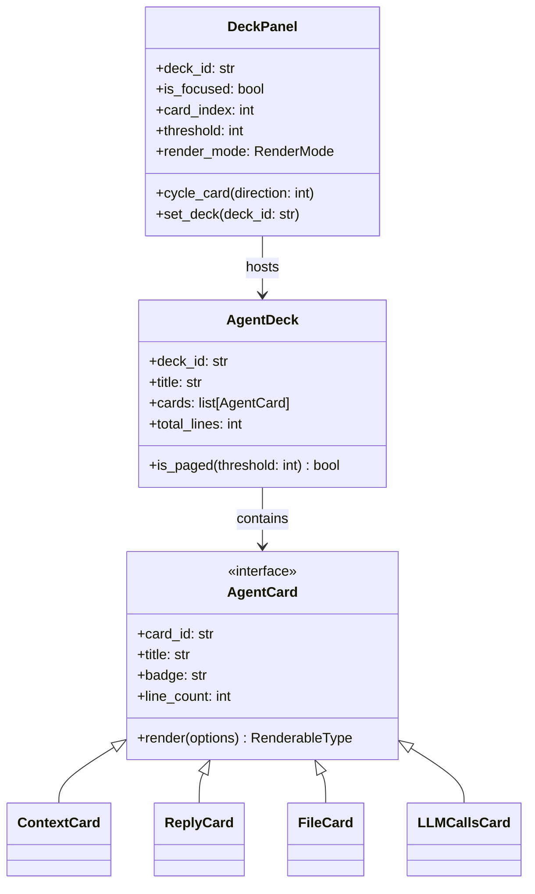
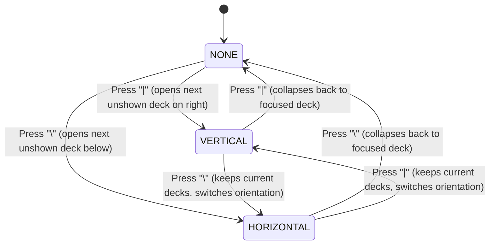

# Research & Architectural Critique: Unifying Agent Metadata, Files, and Tools via Agent Data Decks and Cards

- **Author:** researcher gem (`research.2d.gem`)
- **Date:** 2026-09-23
- **Context:** Architecture review & redesign for the SASE TUI ("ACE") Agents Tab
- **Target Audience:** SASE Core Team, Lead Synthesizer, TUI/ACE Architects

---

## 1. Executive Summary & Assessment

The proposal to unify the **agent metadata panel** and the **files/LLM calls panel** on the "Agents" tab into a single generic **Deck Panel** hosting **Agent Data Cards** is an **outstanding architectural evolution**.

Today, the Agents tab detail view suffers from structural fragmentation:
1. **The Metadata Panel** (`AgentPromptPanel`) is a monolithic scroll view that forces together heterogeneous concerns: sticky identity chrome, queue telemetry, family/clan rosters, output variables, SASE context (beads, plans, memory, glossary, deltas, artifacts), slow tool call summaries, xprompts, prompt text, and final replies/streaming tokens.
2. **The Secondary Panel** alternates awkwardly between two completely distinct widgets (`AgentFilePanel` and `AgentLLMCallsPanel`).
3. **Panel Layout & Proportions** are configured through a modal picker (`AgentViewModal`, triggered by `p`) that toggles rigid vertical percentages (70/30, 50/50, 30/70) instead of direct, tactile keyboard splits.
4. **File Viewing** forces a 1-file-per-page constraint even when an agent modifies three 4-line files, requiring repetitive `<ctrl+n/p>` flipping to inspect trivial diffs.
5. **Zooming** requires an entirely separate, heavyweight modal screen (`ZoomPanelModal`, triggered by `Z`), duplicating roughly 2,500 lines of widget code, freezing live background state, and severing normal navigation.

The **Agent Data Decks and Cards** ("decks/cards") abstraction resolves all five problems:
- **Uniformity:** Replaces three bespoke widgets with one reusable `DeckPanel` container.
- **Composability:** Groups related presentation units into cohesive named `Deck` collections (`Main`, `Files`, `Tools`).
- **Adaptive Density:** Employs an intelligent content-size threshold to show all cards together on one scrollable page when compact, automatically paginating only when content exceeds the threshold.
- **Direct-Manipulation Splits:** Implements tactile vim/tmux-like splits (`\` for horizontal, `|` for vertical) with single-key toggles and orientation rotation.
- **Radical Code Simplification:** Directly obsoletes the modal `p` picker and the modal `Z` zoom screen by providing collapsible node list navigation (`<ctrl+s>`).

### Key Independent Findings & Recommended Adjustments
While the core proposal is sound, our independent investigation identified **four critical friction points** and required adjustments:

1. **Focus Toggle vs. Vim Page-Down Conflict (`<ctrl+f>`):**
   In SASE's current keymap registry, `<ctrl+f>` is bound to `scroll_prompt_down` (full-page down in standard Vim navigation). Stealing `<ctrl+f>` unconditionally breaks page-down scrolling. We recommend either remapping full-page scrolling to `PageDown` / relying on `<ctrl+d>` (half-page), or introducing `<Tab>` / `<ctrl+w>` as seamless alternate window-cycling bindings.
2. **Terminal Emulator Transport Trap (`<ctrl+shift+n/p>`):**
   Standard terminal emulators (e.g., GNOME Terminal, Windows Terminal, browser-based terminals) frequently intercept `ctrl+shift+n` (New Window) or discard the Shift modifier on control characters, sending the exact same ASCII byte (`0x0E`) as `ctrl+n`. If unmitigated, pressing `<ctrl+shift+n>` will cycle *decks* instead of *cards*. We must provide robust, standard fallback keybindings: `[` and `]` (matching `ZoomPanelModal`'s existing panel keys).
3. **Threshold Metric & Streaming Hysteresis:**
   The threshold must be defined in **logical line count** (e.g. `ace.deck_cards_threshold: 80` lines) rather than rendered cell geometry to avoid expensive Textual reflow thrashing. Furthermore, during live agent token streaming, crossing the threshold must avoid abrupt visual jumps by maintaining focus on the actively streaming Reply card.
4. **Collapsed Node Panel Representation (`<ctrl+s>`):**
   Completely hiding the agent list (`display: none` / 0 width) causes a total loss of tree context and disables `j/k` agent navigation. We strongly recommend a **Micro-Rail (width: 4 cells)** displaying status glyphs and selection indicators, preserving full navigation while returning 56 horizontal columns to the deck panels.

---

## 2. Current Architecture vs. The Decks/Cards Model

### 2.1 The Existing Agents Tab Implementation
The current layout in `src/sase/ace/tui/_app_layout.py` structures the Agents tab as:
```text
┌────────────────────────────────────────────────────────────────────────┐
│ TopBar / TabBar / Indicators                                          │
├─────────────────────────┬──────────────────────────────────────────────┤
│ #agent-list-container   │ #agent-detail-container                      │
│ (width: 60)             │ (width: 1fr)                                 │
│                         │   ┌────────────────────────────────────────┐ │
│ AgentList               │   │ #agent-header-panel (sticky identity)  │ │
│ (Agent / Clan rows)     │   ├────────────────────────────────────────┤ │
│                         │   │ #agent-prompt-scroll (VerticalScroll)  │ │
│                         │   │   AgentPromptPanel                     │ │
│                         │   ├────────────────────────────────────────┤ │
│                         │   │ #agent-file-scroll / #llm-calls-scroll │ │
│                         │   │   AgentFilePanel / AgentLLMCallsPanel  │ │
│                         │   └────────────────────────────────────────┘ │
└─────────────────────────┴──────────────────────────────────────────────┘
```

The coordination logic in `src/sase/ace/tui/widgets/_agent_detail_panels.py` maintains:
- `DetailPanelMode`: `AUTO` (files), `LLM_CALLS`, `INFO` (metadata only).
- `DetailLayoutMode`: `METADATA_ONLY`, `METADATA_LARGER` (70/30), `EQUAL` (50/50), `SECONDARY_LARGER` (30/70), `SECONDARY_ONLY`.
- These modes are toggled via the `AgentViewModal` triggered by `p` (`choose_agent_view`).
- When the user presses `Z` (`zoom_panel`), SASE opens `ZoomPanelModal` (`src/sase/ace/tui/modals/zoom_panel_modal.py`), which constructs clone instances `ZoomFilePanel` and `ZoomLLMCallsPanel` over the full screen.

### 2.2 The Proposed Unification: Decks, Cards, and Deck Panels
The unified architecture replaces the specialized scrolls and panel-mode state machine with a clean two-tier composite pattern:



### 2.3 Deck & Card Specifications

#### Deck 1: "Main"
The primary inspection deck for the selected agent.
- **Card 1: "Context" (Default Card)**
  - **Scope:** All input parameters, environmental facts, instructions, and context gathered prior to or during the agent's work.
  - **Contents:**
    1. Header metadata: agent identity, status, model, timing, workspace, runner queue ahead count.
    2. Clan/Family roster & lane neighbors summary (if container or family member).
    3. Output & workflow variables.
    4. `SASE CONTEXT` section: bead attachments, associated plans, memory reads, glossary reads, skill uses, touched files, artifact reads, deltas, and opened workspaces.
    5. `SLOW TOOLS` section: aggregated slow tool calls.
    6. `AGENT XPROMPT`: authored and humanized xprompt directives.
    7. `AGENT PROMPT`: initial system prompt and instruction body.
    8. Error message & stack trace (if runner failed, ensuring failure details remain immediately visible).
- **Card 2: "Reply"**
  - **Scope:** The complete output and execution history produced by the agent.
  - **Contents:**
    1. `AGENT REPLY` / `AGENT CHAT` heading.
    2. Streaming live reply tokens & timestamped reply chunks.
    3. Multi-attempt history (when `attempt_view_mode == "merged"` or pinned to an attempt).
    4. Follow-up agent execution phases (e.g., chained monitors, gates, subagent steps).
    5. Final response text or structured step output.

#### Deck 2: "Files"
The code and file-modification deck.
- **Cards:** Dynamic, 1 card per file or diff slot.
  - Slot types: Live diff (active agent), Workspace working tree diff, File changes (per-file patch), Static file reads (opened files, sidecar files, linked delta files, commit diffs).
  - Card Title: File path or relative label (e.g. `src/sase/foo.py`).
  - Card Badge: Change stats (e.g. `+14, -3`).
- **Dynamic Paging Behavior:**
  - If the agent touched 3 small files totaling 45 lines, and threshold is 80 lines: all 3 file cards render sequentially in a single scrollable view.
  - If the files total 250 lines: each file card becomes an isolated page. The deck header displays `[Card 1/3: src/sase/foo.py]` and `<ctrl+shift+n/p>` (or `[` / `]`) flips between files.

#### Deck 3: "Tools"
The tool inspection deck.
- **Card 1: "LLM Calls" (Current)**
  - Hosts normalized provider tool-call artifacts (`tool_calls.jsonl`).
  - Displays the interactive timeline with duration, status, and argument/response inspection.
  - Retains detail-level toggling (`h`/`l`/`H`/`L` for compact vs. full detail).
- **Card 2: "Named Tools" (Future Extension)**
  - Planned integration for `sase tool` command runs and host tool control plane history.

---

## 3. Deep Critique of the Proposed Plan

### 3.1 Is this a good idea?
**Yes, it is an exceptional idea.**
- **Cognitive Cohesion:** Users no longer have to mentally juggle whether an item is a "panel", a "sub-panel", a "detail view", or a "zoom view". Everything is either a **Deck** or a **Card** inside a **Deck Panel**.
- **Ergonomic Elevation:** Moving from modal selection (`p`) to direct keyboard shortcuts (`\`, `|`, `<ctrl+n/p>`, `<ctrl+shift+n/p>`) aligns with standard developer power tools (Vim, tmux, Neovim).
- **Adaptive Screen Real Estate:** Showing multiple small files together solves a longstanding annoyance in SASE where verifying small multi-file changes required tedious cycling.

### 3.2 Required Adjustments & Critiques

#### Critique 1: The `<ctrl+f>` Focus Toggle Conflict
- **The Issue:** SASE defaults to Vim navigation bindings. In `src/sase/default_config.yml:587` and `src/sase/ace/tui/bindings.py:71`:
  ```python
  Binding("ctrl+f", "scroll_prompt_down", "Scroll Prompt Down", show=False)
  ```
  Vim users instinctively press `<ctrl+f>` to page down through long prompts or logs. Reassigning `<ctrl+f>` to `toggle_deck_focus` will cause immediate muscle-memory collisions.
- **The Solution:**
  1. Allow `<ctrl+f>` to toggle deck focus as requested, but also register **`<Tab>`** and **`<ctrl+w><ctrl+w>`** as alternative focus toggles. In the Agents tab, when focus is in a detail deck, `<Tab>` has no input fields to navigate and is the universal focus cycler in modern TUIs.
  2. Remap prompt page-down documentation to highlight `<ctrl+d>` (half-page down) and `<pagedown>`.

#### Critique 2: Terminal Transmission Failure on `<ctrl+shift+n/p>`
- **The Issue:**
  Many terminal emulators do not support or enable the extended keyboard protocol (Kitty / CSI u). Under standard XTerm protocols:
  - `Ctrl + Shift + N` emits ASCII `0x0E` — the exact same byte as `Ctrl + N`!
  - In terminals such as GNOME Terminal or browser web-consoles, `Ctrl + Shift + N` is caught by the host OS to spawn a new incognito/private terminal window.
  - If a user in GNOME Terminal presses `<ctrl+shift+n>`, either a new OS window opens, or the TUI receives `ctrl+n` and unexpectedly changes the *deck* instead of the *card*!
- **The Solution:**
  Add universal, conflict-free secondary keybindings:
  - **`]` / `[`** (Next Card / Prev Card): Matches Vim tag/bracket navigation and is already the exact keybinding used in `ZoomPanelModal` (`next_panel` / `prev_panel`).
  - Configure `ace.keymaps`:
    ```yaml
    cycle_card_forward: "ctrl+shift+n,right_square_bracket"
    cycle_card_backward: "ctrl+shift+p,left_square_bracket"
    ```

#### Critique 3: Threshold Measurement & Streaming Hysteresis
- **The Issue:**
  How is "size of the panel would not be forced to go over some threshold" calculated?
  - *Option A: Viewport Height Ratio (Dynamic Screen Height).* If threshold = viewport height, almost every real prompt (which easily exceeds 40 lines) will trigger paging, making continuous mode almost never appear. Furthermore, resizing the terminal window would cause decks to jump between continuous and paged modes erratically.
  - *Option B: Logical Line Count (Recommended).* Measure the cumulative raw line count of all cards in the deck:
    $$\text{Total Lines} = \sum_{c \in \text{Cards}} \text{card.line\_count}$$
  - *Streaming Jump Hazard:* When an agent is running, `ReplyCard` starts at 0 lines (both Context and Reply fit on one page). As the agent streams tokens, `ReplyCard` expands past the threshold. If the deck abruptly paginates mid-stream, the user's view will suddenly jump, cutting off either Context or Reply.
- **The Solution:**
  1. Define a new config field: `ace.deck_cards_threshold: 80` (default: 80 lines; `0` forces always-paged, `-1` forces always-continuous).
  2. Implement **Hysteresis / Active Focus Preservation:** If a deck is in continuous mode and crosses the threshold due to streaming output, keep the active scroll pinned to the streaming card (Reply) and smoothly transition the header indicator to `[Card 2/2: Reply (paged)]` without throwing the user back to Card 1.

#### Critique 4: Collapsed Node Panel Representation (`<ctrl+s>`)
The user requested: *"Support for collapsing the node panel will be useful/necessary for vertical deck splits... Think hard about the best way to represent a collapsed node panel."*

We evaluated four possible designs for the collapsed agent list container:

| Design Option | Width | Pros | Cons | Verdict |
| :--- | :--- | :--- | :--- | :--- |
| **A. Complete Hide** | `width: 0` (`display: none`) | Maximum horizontal space (100% width for decks). | Complete loss of agent context. Cannot navigate `j/k` across agents. | Unfavorable |
| **B. Micro-Rail** | `width: 4` cells | Frees 56 cells; retains active agent indicator, status glyphs, and unread dots; `j/k` navigation still works! | Takes 4 columns. | **Recommended Default** |
| **C. Top Status Breadcrumb** | `width: 0` + top bar chip | 100% width for decks; single-line breadcrumb shows current agent status. | Does not show sibling nodes in family/clan. | Viable for narrow screens |
| **D. Auto-Responsive Hybrid** | Dynamic (4 or 0 based on width) | Best of both worlds: Micro-rail on $\ge 100$ cols; full hide on $< 100$ cols. | Slightly higher layout logic. | **Optimal Solution** |

**Recommended Collapsed Representation: The Micro-Rail (Width 4)**
When collapsed via `<ctrl+s>`:
- The container `#agent-list-container` transitions from `width: 60` to `width: 4`.
- The header displays a subtle collapse glyph: `«` with `^S` hint.
- Each row in the rail displays a 2-character glyph cluster:
  - Column 1: Selection marker (`▎` for selected row, space otherwise).
  - Column 2: Status indicator (`✓` green done, `✗` red failed, `⟳` cyan running, `⏸` yellow gate).
  - Column 3: Role tag (`p` plan, `c` code, `e` epic, `m` monitor, `g` gate, `j` job).
  - Column 4: Unread / Mark dot (`●` purple for marked, `!` unread).
- **Massive UX Benefit:** The user can keep the list collapsed permanently during heavy diff inspection and STILL press `j` and `k` to step through agents, watching the deck update live!

---

## 4. Keymap Design & Split State Machine

### 4.1 Summary of Agents Tab Keymap Changes

| Keybinding | Action Name | Description | Conflict / Migration |
| :--- | :--- | :--- | :--- |
| `<ctrl+n>` | `cycle_deck_forward` | Cycle focused deck panel to next deck (`Main` $\to$ `Files` $\to$ `Tools`) | Replaces old `next_agent_file`. File cycling moves to card cycling. |
| `<ctrl+p>` | `cycle_deck_backward` | Cycle focused deck panel to previous deck (`Tools` $\to$ `Files` $\to$ `Main`) | Replaces old `prev_agent_file`. File cycling moves to card cycling. |
| `<ctrl+shift+n>` / `]` | `cycle_card_forward` | Cycle active card forward within focused deck (when paged) | Added. `]` provided as universal terminal fallback. |
| `<ctrl+shift+p>` / `[` | `cycle_card_backward` | Cycle active card backward within focused deck (when paged) | Added. `[` provided as universal terminal fallback. |
| `\` | `toggle_deck_split_horizontal` | Add/toggle horizontal split (deck panel below) | New split action. Toggles between 1 panel and 2 stacked panels. |
| `\|` | `toggle_deck_split_vertical` | Add/toggle vertical split (deck panel to the right) | New split action. Toggles between 1 panel and 2 side-by-side panels. |
| `<ctrl+s>` | `toggle_node_panel_collapsed` | Collapse or expand the left agent node list | New toggle action. Reclaims 56 columns for deck panels. |
| `<ctrl+f>` / `<Tab>` | `toggle_deck_focus` | Switch focus between Deck Panel 1 and Deck Panel 2 | Supersedes `scroll_prompt_down`. `<Tab>` registered as alias. |
| `p` | *(Removed)* | Retired `choose_agent_view` modal picker | Obsoleted by direct split and deck cycling keys. |
| `Z` | *(Removed / Replaced)* | Retired `zoom_panel` modal screen | Obsoleted by `<ctrl+s>` node list collapse. |

### 4.2 Split State Machine (`\` and `|`)

The detail area supports up to **two active Deck Panels** (`Panel 0` and `Panel 1`).
The layout state is modeled as:
```python
class DeckSplitMode(StrEnum):
    NONE = "none"            # 1 Deck Panel (full size)
    VERTICAL = "vertical"    # 2 Deck Panels side-by-side (columns)
    HORIZONTAL = "horizontal"# 2 Deck Panels stacked (rows)
```

The transition rules requested by the user are modeled deterministically as follows:



#### Detailed Transition Logic:
1. **When in `NONE` (Single Deck Panel):**
   - Panel 0 is showing Deck $A$ (e.g. `Main`).
   - Pressing `|` (Vertical Split):
     - Transition to `VERTICAL`.
     - Panel 0 stays on the left showing Deck $A$.
     - Panel 1 opens on the right showing Deck $B$ (the next unshown deck in circular order `Main` $\to$ `Files` $\to$ `Tools`). Focus moves to Panel 1 (or stays on Panel 0).
   - Pressing `\` (Horizontal Split):
     - Transition to `HORIZONTAL`.
     - Panel 0 stays on top showing Deck $A$.
     - Panel 1 opens below showing Deck $B$.
2. **When in `VERTICAL` (Side-by-side Split):**
   - Pressing `|`:
     - Split is toggled off! Transition back to `NONE`.
     - The **currently focused deck panel** is preserved and expanded to fill the entire detail area. The unfocused deck panel is hidden.
   - Pressing `\`:
     - Layout orientation rotates! Transition to `HORIZONTAL`.
     - Both currently visible decks (e.g., `Main` and `Files`) remain visible, but change from side-by-side columns to stacked top/bottom rows.
3. **When in `HORIZONTAL` (Stacked Split):**
   - Pressing `\`:
     - Split is toggled off! Transition back to `NONE`.
     - The **currently focused deck panel** is preserved and expanded to full size.
   - Pressing `|`:
     - Layout orientation rotates! Transition to `VERTICAL`.
     - Both currently visible decks remain visible, switching to side-by-side columns.

---

## 5. Memory Web Glossary Strands

As required, three new glossary memory web strands should be added under `sase/memory/glossary/`. Below are the complete authored drafts conforming to SASE memory conventions.

### 5.1 `sase/memory/glossary/agent-data-deck.md`
```markdown
---
keyword: Agent Data Deck
aliases:
  - deck
  - agent deck
---

An agent data deck (or deck) is a named, coherent collection of agent data cards
presented on the Agents tab. Decks organize related inspection surfaces into unified
functional domains: the "Main" deck (containing Context and Reply cards), the "Files"
deck (containing per-file diff and source cards), and the "Tools" deck (containing tool-
call and runner records). Decks are hosted inside deck panels and can be cycled using
the `<ctrl+n>` and `<ctrl+p>` keymaps.
```

### 5.2 `sase/memory/glossary/agent-data-card.md`
```markdown
---
keyword: Agent Data Card
aliases:
  - card
  - agent card
---

An agent data card (or card) is an atomic presentation unit within an agent data deck.
Each card represents a distinct facet of agent state, such as prompt context, agent
replies, an individual file diff, or tool call telemetry. Cards declare their own
content and logical size: when a deck's combined card size falls within the configured
threshold, all cards render sequentially on one scrollable page; when the threshold is
exceeded, cards are paginated and cycled individually using `<ctrl+shift+n/p>` or `[` / `]`.
```

### 5.3 `sase/memory/glossary/deck-panel.md`
```markdown
---
keyword: Deck Panel
aliases:
  - deck panel
---

A deck panel is the primary viewport container widget on the Agents tab that hosts and
renders an active agent data deck. The Agents tab supports either a single deck panel or
two concurrent deck panels arranged in a horizontal split (`\`, stacked) or vertical
split (`|`, side-by-side). Focus between split deck panels is toggled using `<ctrl+f>` or
`<Tab>`.
```

---

## 6. Detailed Technical Implementation Blueprint

### 6.1 Configuration Additions (`src/sase/default_config.yml`)

Add the threshold and keybindings to `default_config.yml`:

```yaml
ace:
  # Maximum total line count across all cards in a deck before the deck panel
  # switches from continuous single-page rendering to individual card pagination.
  # Set to 0 to always paginate; set to -1 to always render continuously.
  deck_cards_threshold: 80

  keymaps:
    app:
      # Deck & Card Navigation (Agents tab)
      cycle_deck_forward: "ctrl+n"
      cycle_deck_backward: "ctrl+p"
      cycle_card_forward: "ctrl+shift+n,right_square_bracket"
      cycle_card_backward: "ctrl+shift+p,left_square_bracket"
      toggle_deck_split_vertical: "pipe"
      toggle_deck_split_horizontal: "backslash"
      toggle_deck_focus: "ctrl+f,tab"
      toggle_node_panel_collapsed: "ctrl+s"
```

Update `src/sase/config/sase.schema.json` with property definitions and integer bounds for `deck_cards_threshold`.

### 6.2 Widget Hierarchy & Styling (`styles.tcss`)

Refactor `#agent-detail-container` in `src/sase/ace/tui/widgets/agent_detail.py`:

```python
class AgentDetail(Static):
    def compose(self) -> ComposeResult:
        yield AgentHeaderPanel(id="agent-header-panel", classes="hidden")
        with Container(id="agent-decks-container"):
            yield DeckPanel(panel_index=0, id="deck-panel-0")
            yield DeckPanel(panel_index=1, id="deck-panel-1", classes="hidden")
```

The CSS rules in `src/sase/ace/tui/styles.tcss`:
```css
#agent-decks-container {
    width: 100%;
    height: 1fr;
    layout: vertical; /* Default single panel */
}

/* Vertical Split (Side-by-Side) */
#agent-decks-container.-split-vertical {
    layout: horizontal;
}
#agent-decks-container.-split-vertical DeckPanel {
    width: 1fr;
    height: 100%;
    border-right: vline $secondary;
}

/* Horizontal Split (Stacked) */
#agent-decks-container.-split-horizontal {
    layout: vertical;
}
#agent-decks-container.-split-horizontal DeckPanel {
    width: 100%;
    height: 1fr;
    border-bottom: hline $secondary;
}

/* Focused Deck Panel Accent */
DeckPanel.-focused-panel {
    border-title-color: #87D7FF;
    border-subtitle-color: #AF87FF;
}

/* Collapsed Node Panel Rail */
#agent-list-container.-collapsed {
    width: 4;
    min-width: 4;
    max-width: 4;
}
#agent-list-container.-collapsed .node-row-full-text {
    display: none;
}
#agent-list-container.-collapsed .node-row-compact-icons {
    display: block;
}
```

### 6.3 Card & Deck Data Model

Create `src/sase/ace/tui/decks/models.py`:

```python
from __future__ import annotations
from dataclasses import dataclass
from typing import Protocol
from rich.console import RenderableType

class AgentCard(Protocol):
    card_id: str
    title: str
    badge: str | None

    def line_count(self) -> int: ...
    def render(self) -> RenderableType: ...

class AgentDeck:
    def __init__(self, deck_id: str, title: str, cards: list[AgentCard]) -> None:
        self.deck_id = deck_id
        self.title = title
        self.cards = cards
        self.active_card_index: int = 0

    @property
    def total_lines(self) -> int:
        return sum(card.line_count() for card in self.cards)

    def is_paged(self, threshold: int) -> bool:
        if threshold < 0:
            return False
        if threshold == 0:
            return len(self.cards) > 1
        return self.total_lines > threshold and len(self.cards) > 1

    def active_card(self) -> AgentCard | None:
        if not self.cards:
            return None
        return self.cards[self.active_card_index % len(self.cards)]

    def cycle_card(self, direction: int = 1) -> None:
        if len(self.cards) <= 1:
            return
        self.active_card_index = (self.active_card_index + direction) % len(self.cards)
```

### 6.4 DeckPanel Rendering Engine

Inside `DeckPanel`:
1. **Title / Header Bar:**
   - Displays Deck Name (`Main`, `Files`, `Tools`).
   - If Continuous: `[Continuous: 2 cards (54 lines)]`.
   - If Paged: `[Card 1/2: Context (38 lines) · ^⇧N next]`.
   - Focus chip (`● ACTIVE` if focused).
2. **Body Rendering:**
   - If not paged:
     ```python
     renderables = []
     for card in deck.cards:
         renderables.append(self._render_card_header(card))
         renderables.append(card.render())
     self.update(Group(*renderables))
     ```
   - If paged:
     ```python
     active = deck.active_card()
     self.update(active.render() if active else Text("No content", style="dim"))
     ```

---

## 7. Migration & Deprecation Strategy

### 7.1 Retiring `AgentViewModal` (`p`)
- Remove `src/sase/ace/tui/actions/agents/_agent_view_picker.py` and `src/sase/ace/tui/modals/agent_view_modal.py`.
- Delete the `choose_agent_view` action binding from `AppKeymaps` and `default_config.yml`.
- The key `p` becomes available for future project or patch workflows on the Agents tab.

### 7.2 Retiring `ZoomPanelModal` (`Z`)
- The `<ctrl+s>` node list collapse feature makes `ZoomPanelModal` completely obsolete.
- By pressing `<ctrl+s>`, the user collapses the left 60-column list down to 4 columns. If in a single-deck view, that single deck now occupies $96\%+$ of the terminal width with full interactivity, live streaming updates, and keyboard control intact.
- Delete the 8 zoom modal files in `src/sase/ace/tui/modals/zoom_panel_*.py`.
- Delete tests in `tests/ace/tui/test_agents_zoom_panel_*.py` and migrate relevant file-paging and tool-detail assertions to test `DeckPanel`.
- Net codebase reduction: **~2,500 lines of complex modal and synchronization code deleted**.

---

## 8. Prioritized Roadmap & Action Items

We recommend executing this transition across four sequential, self-contained milestones:

1. **Phase 1: Domain Models & DeckPanel Widget Foundations**
   - Author glossary web strands (`agent-data-deck.md`, `agent-data-card.md`, `deck-panel.md`).
   - Implement `AgentCard`, `AgentDeck`, and `DeckPanel` in `src/sase/ace/tui/decks/`.
   - Split existing `AgentPromptPanel` logic into `ContextCard` and `ReplyCard`.
   - Wrap `AgentFilePanel` files into `FileCard` instances and `AgentLLMCallsPanel` into `LLMCallsCard`.
   - Add `ace.deck_cards_threshold` config field (default 80).
2. **Phase 2: Split Controls & Navigation**
   - Implement `<ctrl+n>` / `<ctrl+p>` (deck cycling).
   - Implement `<ctrl+shift+n>` / `<ctrl+shift+p>` with `[` / `]` aliases (card cycling).
   - Implement `\` and `|` layout state machine inside `AgentDetail`.
   - Implement `<ctrl+f>` / `<Tab>` deck focus toggling.
3. **Phase 3: Collapsible Node Panel (`<ctrl+s>`) & Micro-Rail**
   - Add `toggle_node_panel_collapsed` action to `AgentList`.
   - Style the 4-cell micro-rail representation in `styles.tcss`.
   - Verify `j/k` navigation operates seamlessly while collapsed.
4. **Phase 4: Deprecations, Golden Snapshots & Cleanup**
   - Deprecate and remove `AgentViewModal` (`p`) and `ZoomPanelModal` (`Z`).
   - Update help modal keybinding tables and onboarding tooltips.
   - Run TUI screenshot rebase recipes and verify no regressions.
