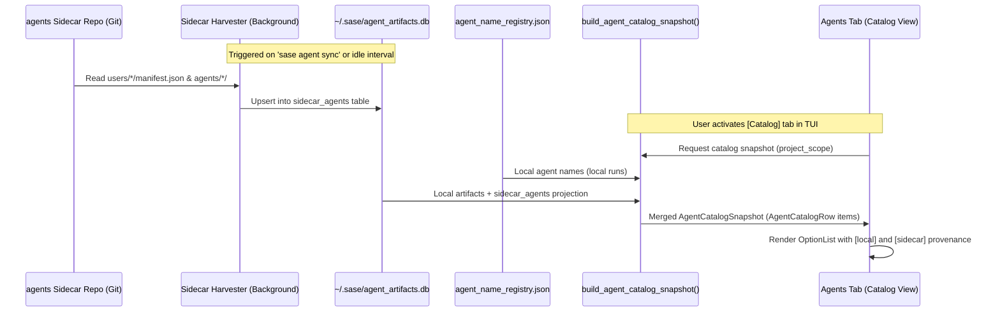

# Architectural Research & Critique: Unifying Agent Artifacts into the Agents Tab and Sidecar Catalog Integration

**Author:** Researcher `gem` (5-Researcher Swarm)  
**Date:** 2026-09-28  
**Topic:** Retiring the "Agent" sub-tab in Artifacts, consolidating agent management and historical cataloging into the top-level "Agents" tab, and integrating local runs with published agents from the agents sidecar.  
**Target Repo:** `sase--research` (`sase/repos/research/202609/agents_tab_unified_history_and_sidecar_catalog__gem.md`)

---

## 1. Executive Summary & Core Verdict

The user prompt proposes:
> *"I think I just want to get rid of the 'Agent' sub-tab of the 'Artifacts' tab in favor of integrating that sub-tab's functionality into the 'Agents' tab, by making any agent ever run locally (on the current machine) or on the current project (i.e. a sase agent that was published to the agents sidecar repo) accessible. I'm not sure what the UX would look like though (maybe use the sase agent query language, if there is one?). Can you do some research with the goal of helping me decide the best way to implement this? Also, critique this plan in general. Is this a good idea? Would you take a different approach? Make any adjustments to the requirements that you think are justified but clearly call these out. End your analysis with a recommended solution."*

### 1.1 The High-Level Verdict
- **Is retiring the "Agent" sub-tab in "Artifacts" a good idea?**  
  **Yes, emphatically.** Having two distinct surfaces named "Agents" in the SASE TUI—a top-level "Agents" tab (`#agents-view`) for live runs and an "Agent" sub-tab in the "Artifacts" tab (`#artifacts-agents-pane`) for historical runs—creates severe mental model confusion, splits operational workflows, and muddles the purpose of the Artifacts tab. Removing it clarifies that **Agents are autonomous actors**, while **Artifacts are durable work products** (commits/stitches, PRs/patches, beads/tasks, plans, and files).
- **Is bringing all historical agents and sidecar-published agents into the Agents tab a good idea?**  
  **Yes, but with critical architectural caveats.** If implemented as a naive "dump all 3,000+ historical and sidecar agents into the main live list", it would immediately destroy the responsiveness of the TUI event loop, trigger excessive memory consumption, and drown the engineer's active operational "working set" in irrelevant historical noise.
- **Recommended Adjustment to Requirements:**  
  Do not create a single, monolithic, flat list. Instead, implement a **progressive, two-tier scope architecture** inside the "Agents" tab:
  1. **Active Working Set (Inbox Scope):** The default operational view showing currently running, waiting, input-demanding, and recently completed agents on the local machine and connected fleet nodes.
  2. **Historical Catalog (Corpus Scope):** An on-demand view accessible via a dedicated tab chip in `AgentTabStrip` (e.g., `[Catalog]` or `[Archive]`) or triggered seamlessly via the unified query language in `AgentsFilterBar`.
  3. **Asynchronous Sidecar Harvester:** Ingest published agents from the project's agents sidecar repository into a local read-only SQLite catalog cache, ensuring cross-machine visibility without introducing synchronous Git I/O latency to the Textual UI.

---

## 2. Current State Analysis: The Two Disconnected Worlds

To evaluate how to unify them, we must examine how both surfaces operate in the codebase today.

```mermaid
flowchart TD
    subgraph CurrentTopLevel["Top-Level ACE TUI Navigation (tab_order.py)"]
        AgentsTab["1. Agents Tab (agents-view)"]
        ArtifactsTab["2. Artifacts Tab (artifacts-view)"]
        ServicesTab["3. Services Tab (axe-view)"]
    end

    subgraph AgentsTabInternals["Agents Tab Architecture"]
        LiveFilterBar["AgentsFilterBar (agents-live query profile)"]
        TabStrip["AgentTabStrip (default, machine:*, named:*)"]
        AgentList["AgentList (#agent-list-panel)"]
        AgentDetail["AgentDetail (Decks & Cards)"]
        LiveLoader["load_tiered_agents (Tier 1: Bounded prefix, ~200 rows)"]
    end

    subgraph ArtifactsTabInternals["Artifacts Tab Sub-Tabs (FIXED_ARTIFACTS_SUBTAB_ORDER)"]
        SubAgents["Agent Pane (#artifacts-agents-pane)"]
        SubStitches["Stitches Pane (commits)"]
        SubPatches["Patches Pane (PRs)"]
        SubBeads["Beads Pane (issues)"]
        SubFiles["Files Pane"]
    end

    subgraph ArtifactsAgentPaneInternals["Artifacts -> Agent Pane Architecture"]
        CatalogFilterBar["AgentFilterBar (agents query profile)"]
        NameRegistry["agent_name_registry.json (~/.sase/)"]
        SQLiteIndex["SQLite agent_artifacts.db"]
        DismissedArchive["Dismissed bundle summaries"]
        CatalogSnapshot["build_agent_catalog_snapshot() -> AgentCatalogRow"]
        OptionList["AgentsOptionList"]
        RelPanel["RelationPanel (Links to stitches, patches, beads)"]
    end

    AgentsTab --> LiveLoader
    LiveLoader --> AgentList
    AgentsTab --> TabStrip
    AgentsTab --> LiveFilterBar
    AgentsTab --> AgentDetail

    ArtifactsTab --> SubAgents
    ArtifactsTab --> SubStitches
    ArtifactsTab --> SubPatches
    ArtifactsTab --> SubBeads
    ArtifactsTab --> SubFiles

    SubAgents --> CatalogFilterBar
    SubAgents --> CatalogSnapshot
    NameRegistry --> CatalogSnapshot
    SQLiteIndex --> CatalogSnapshot
    DismissedArchive --> CatalogSnapshot
    CatalogSnapshot --> OptionList
    CatalogSnapshot --> RelPanel
```



### 2.1 Surface 1: The Top-Level "Agents" Tab (`src/sase/ace/tui/`)
- **Primary Mission:** Real-time process supervision, agent lifecycle management, and immediate human-in-the-loop (HITL) steering.
- **Data Pipeline:**
  - Uses `load_tiered_agents` (`src/sase/ace/tui/models/agent_loader.py`).
  - **Tier 1 (Fast default):** Bounded scan of local `ProjectSpec` running fields, `done.json`, `running.json`, and recent rows from the SQLite artifact index (capped at ~200-500 rows).
  - Background delta polling checks running PIDs every 1-2 seconds (`_loading_refresh.py`).
  - Data model: Rich, heavyweight `Agent` dataclass instances (~50 fields including subprocess PIDs, runner slot reservations, tmux handles, gate state, prompt review tokens).
- **UI Components:**
  - `AgentInfoRow` with system load indicators and launch context.
  - `AgentsFilterBar` running the `agents-live` query profile (`src/sase/ace/query_profile/profiles/_agents_live.py`).
  - `AgentTabStrip` supporting `default` (local), `machine:<id>` (fleet hosts like Apollo or Athena), and user-defined `named` tabs.
  - `AgentList` with custom row styling, grouping banners (clan, tribe, date), unread marks, and run-time priority.
  - `AgentDetail` featuring the **Agent Data Deck and Card architecture** (`_agent_detail_decks.py`).
- **Deficiencies:**
  - Blind to older completed agents outside the Tier 1 window.
  - Blind to dismissed agents unless explicitly revived.
  - Completely blind to agents run on remote machines by collaborators or CI and published to the agents sidecar.

### 2.2 Surface 2: The "Artifacts -> Agent" Sub-Tab (`src/sase/ace/tui/widgets/artifacts/`)
- **Primary Mission:** Long-term archival catalog browsing, historical audits, and artifact link exploration.
- **Data Pipeline:**
  - Uses `load_agents_snapshot` (`src/sase/ace/tui/widgets/artifacts/agents_data.py`).
  - Calls `build_agent_catalog_snapshot()` (`src/sase/agents/catalog/_build.py`):
    - Spines on `load_name_registry()` (`~/.sase/agent_name_registry.json`), ensuring every permanent agent name ever registered on this machine is present.
    - Left-joins lightweight projection columns from `agent_artifacts.db` (omitting the ~117 MB `record_json` column).
    - Left-joins top-level and child dismissed bundle summaries.
  - Data model: Lightweight, immutable `AgentCatalogRow` tuples.
- **UI Components:**
  - `AgentFilterBar` running the boolean `agents` query profile (`src/sase/ace/query_profile/profiles/_agents.py`), evaluated in Rust via `compile_query_with_profile` and `evaluate_many`.
  - `AgentsOptionList` for fast keyboard navigation.
  - `RelationPanel` displaying linked entities: which stitches (commits), patches (PRs), beads (issues), plans, and files were read or modified by this agent.
  - Lazy detail panel (`agents_detail_panel.py`) loading prompt text and chat paths on worker threads only when highlighted.
- **Deficiencies:**
  - Hidden away in the "Artifacts" tab. Users frequently forget it exists or do not understand why an agent is classified as an artifact.
  - Disconnected from live agent operations (cannot kill, attach tmux, or view live streaming tail).
  - Also blind to the agents sidecar! Currently, `sase.agents.catalog` only indexes local machine storage.

---

## 3. Deep Critique of the Proposal

### 3.1 Why the Proposal is a Great Idea
1. **Elimination of Cognitive Dissonance:**
   In user testing and daily operations, having "Agents" at the top level and "Agent" under "Artifacts" is universally perceived as redundant and confusing. Users ask: *"If my agent finished 2 hours ago, is it in Agents or Artifacts?"* Unifying them into a single concept resolves this completely.
2. **Artifacts Tab Ontological Integrity:**
   The Artifacts tab was originally envisioned as the workspace's repository of outputs. Its sibling panes are `stitches` (commits), `patches` (PRs), `beads` (issues/tasks), `ref:plan` (plans), and `files`. An agent is an actor, not a document or code diff. Removing `agents` leaves the Artifacts tab clean, focused, and cohesive.
3. **Cross-Pollination of High-Value Features:**
   The Artifacts -> Agent pane has features that the main Agents tab sorely lacks:
   - Deep historical boolean query engine (`status:FAILED AND since:7d AND provider:codex`).
   - Rich artifact relation index (seeing exactly what code, commits, and beads an agent produced).
   - Replay/revival workflows (`revivable:true`, `durably_revivable:true`).
   Bringing these into the main Agents tab makes the Agents tab substantially more powerful.

### 3.2 Critical Pitfalls of a Naive Implementation
If we simply eliminate `ArtifactsAgentsPane` and route all historical + sidecar agents into the existing `AgentList` widget in the Agents tab, the system will fail in three major ways:

#### Pitfall 1: Event Loop Starvation and UI Latency (The Scale Trap)
- On a system with active use over several months, `agent_name_registry.json` and the artifact index contain **3,000 to 10,000+ agents**.
- The main `AgentList` widget is not a virtualized database table; it is a Textual `OptionList` maintaining rich row metadata, attempt trees, fold states, and banner rows.
- Instantiating 5,000 full `Agent` objects, calculating their group banners, and running the 1-second delta refresh loop will peg the Python event loop at 100% CPU and cause noticeable UI stuttering.
- **Rule:** The working set of the live view must remain bounded (Tier 1 head: ~200-500 rows). Full corpus browsing must be on-demand and decoupled from real-time delta polling.

#### Pitfall 2: Operator Working Set Clutter (The Signal-to-Noise Trap)
- An engineer switches to the Agents tab primarily to check:
  - *Are my current agents running or stuck?*
  - *Do any agents need my input (HITL questions, plan reviews)?*
  - *Did my recent task pass or fail?*
- If the view is perpetually cluttered with 4,000 completed agents from July, the engineer cannot quickly spot the 2 agents that need attention right now.
- **Rule:** The default landing state of the Agents tab must strictly be the **Active Working Set (Inbox)**.

#### Pitfall 3: The Sidecar Ingestion Performance Trap
- Bryan's requirement specifies: *"or on the current project (i.e. a sase agent that was published to the agents sidecar repo) accessible."*
- The agents sidecar is an owner-sharded Git repository containing directories like:
  ```
  users/<user>/machines/<machine>/manifest.json
  users/<user>/machines/<machine>/hoods/<hood>/snapshot.json
  agents/<global-name>/
  sessions/<global-session>.md
  prompts/<YYYYMM>/<name>.md
  ```
- If the TUI attempts to inspect the sidecar via Git commands (`git log`, `git ls-tree`) or filesystem walks on startup or tab activation, it will introduce multi-second latency freezes.
- **Rule:** Sidecar access cannot be a synchronous on-demand file crawl. It must be powered by an asynchronous background harvester and indexed into a local SQLite table.

---

## 4. Query Language Analysis: Does SASE Have an Agent Query Language?

Bryan asked: *(maybe use the sase agent query language, if there is one?)*.

**Yes! SASE already has a sophisticated, Rust-backed agent query language**, but currently there are two separate query profiles that must be unified:

| Dimension | `agents` Profile (Artifacts -> Agent & CLI) | `agents-live` Profile (Live Agents Tab) |
| :--- | :--- | :--- |
| **Defined in** | `src/sase/ace/query_profile/profiles/_agents.py` | `src/sase/ace/query_profile/profiles/_agents_live.py` |
| **CLI Command** | `sase agent search "query"` | None (used only inside TUI filter bar) |
| **Evaluation Engine** | Rust `compile_query_with_profile` & `evaluate_many` | Rust `build_agents_live_query_index` (behind `agents_unified_query` flag) |
| **Supported States** | `state:active`, `state:done`, `state:dismissed` | 27 live statuses (`QUESTION`, `PLAN APPROVED`, `FEEDBACK`, `WORKING PLAN`, etc.) |
| **TUI Interaction** | Persistent filter bar with live completion | Auto-hiding filter bar (`/` key), count rendered in `AgentInfoPanel` |
| **Special Fields** | `relation:read/wrote`, `artifact:<ref>`, `linked:bool`, `revivable:bool`, `durably_revivable:bool` | `needs:input`, `source:axe/manual`, `cl:<patch>`, `machine:<host>`, `tab:<name>`, `unread:bool`, `pinned:bool` |
| **Shared Fields** | `name`, `project`, `session`, `clan`, `role`, `workflow`, `model`, `provider`, `since`, `until`, `min`, `max`, `attempt`, `text` |

### Required Query Language Unification (`agents-unified`)
We should merge these two profiles into a single comprehensive schema:
```text
agents-unified Schema:
  - Scope: scope:live | scope:archive | scope:sidecar | scope:all
  - Machine: machine:local | machine:<alias> | machine:<hostname>
  - Project: project:sase | project:<key>
  - Status/State: state:active|done|dismissed OR status:RUNNING|WAITING|QUESTION|PLAN...
  - Operational: needs:input, source:axe|manual, unread:true, pinned:true
  - Archival: revivable:true, durably_revivable:true, restartable:true, linked:true
  - Relations: relation:read|wrote|modified, artifact:<ref>
  - Temporal: since:24h, until:7d, min:5m, max:1h
  - Free text: matches name, session, cl, prompt text, and tags
```

---

## 5. Architectural Comparison of UX Design Options

To integrate this cleanly without degrading the live agent experience, we evaluated four distinct UX patterns:

| Criteria | Option A: Query-Only Expansion | Option B: TabStrip Integration (`Catalog` Tab) | Option C: Mode Toggle (`Active` vs `All`) | Option D: Unified Infinite Scroll / Split List |
| :--- | :--- | :--- | :--- | :--- |
| **Mental Model** | Search omnibar expands scope automatically | Dedicated sub-tab in `AgentTabStrip` alongside machine tabs | Toggle button in header (`[Active] [Catalog]`) | Single list: active at top, historical below |
| **Glanceability** | High (default view stays minimal) | High (clear visual tab chip with counts) | High (clear toggle pill) | Low (crowded, confusing scroll boundary) |
| **Performance Isolation** | Excellent (catalog only queried when filter active) | Excellent (catalog only loaded when Catalog tab selected) | Good (switching loads catalog snapshot) | Poor (must maintain mixed data structures) |
| **Sidecar Integration** | Filter queries sidecar index | Catalog tab shows local + sidecar with badge origin | Shows sidecar in All mode | Mixed in flat list |
| **Relation Panel Placement** | In detail panel (Decks/Cards) | In detail panel (Decks/Cards) | In detail panel | Floating or modal |
| **Learning Curve** | Medium (users must know query syntax) | Very Low (obvious clickable/switchable tab) | Low (standard segmented control) | Medium |

### Why Option B (TabStrip Integration) + Option A (Query Bridging) is Superior
The ideal UX is a combination of **Option B** and **Option A**:
1. **Primary Navigation via `AgentTabStrip`:**
   The `AgentTabStrip` already lives above the agent list (`src/sase/ace/tui/widgets/agent_tab_strip.py`). It currently displays `default` (local agents) and machine tabs (`apollo`, `athena`).
   We add a first-class, built-in tab: **`[Catalog]`** (or `[Archive]`).
   - `[Main / Live]` tab: Displays the active working set (running, waiting, attention, recent terminal).
   - `[Catalog]` tab: Displays the complete historical index (every local run + every sidecar-published run), sorted newest-first, with instant keyboard filtering.
   - Machine tabs (`[Apollo]`, `[Athena]`): Display live/recent runs for those specific remote daemons.
2. **Search Omnibar Bridging:**
   When the user presses `/` to filter on the `[Main]` tab, if their query matches historical agents outside the live set, the filter bar renders an inline chip:
   `"0 active matches · 14 catalog matches (Press Tab or Enter to jump to Catalog)"`.

---

## 6. Recommended End-State UX Design

### 6.1 Top Bar & Tab Strip Visual Layout

```text
┌─ ACE: sase ──────────────────────────────────────────────────────────────────────────────────┐
│ [1: Agents]  [2: Artifacts]  [3: Services]                           Load: 12%  Slots: 3/8   │
├──────────────────────────────────────────────────────────────────────────────────────────────┤
│ Agents: 2 running, 1 waiting input                                    Filter: (none) [/]     │
│ [• Main (3)] [◈ Catalog (3,842)] [⌨ apollo (1)] [⌨ athena (0)]                                │
├──────────────────────────────────────────────────────┬───────────────────────────────────────┤
│ Catalog (Local + Sidecar)                            │ Agent: sase.fix-tui-flicker.3         │
│ Filter: [project:sase provider:codex status:DONE   ] │ Status: DONE (2026-09-24 14:22 UTC)  │
├──────────────────────────────────────────────────────┼───────────────────────────────────────┤
│ ● sase.fix-tui-flicker.3   codex  2026-09-24 [local] │ ╭─ Metadata Deck ───────────────────╮ │
│ ● sase.auth-token-refresh  claude 2026-09-23 [sidecar]│ │ Project: sase      Role: code       │ │
│ ▲ sase.ci-matrix-repair    codex  2026-09-22 [apollo]│ │ Provider: codex    Model: gpt-5.4   │ │
│ ■ sase.bead-graph-cache    grok   2026-09-20 [sidecar]│ │ Duration: 4m 12s   Attempts: 1      │ │
│ ● sase.rust-core-sync.12   claude 2026-09-18 [local] │ ╰─────────────────────────────────────╯ │
│                                                      │ ╭─ Artifact Relations Deck ─────────╮ │
│                                                      │ │ ◉ Stitch: 8f3a1b2 ("Fix flicker") │ │
│                                                      │ │ ⎇ Patch:  PR #482 (Merged)        │ │
│                                                      │ │ ◈ Bead:   sase-99a (Closed)       │ │
│                                                      │ │ ▤ File:   src/sase/ace/tui/app.py │ │
│                                                      │ ╰─────────────────────────────────────╯ │
│                                                      │ ╭─ Actions ─────────────────────────╮ │
│                                                      │ │ [R] Revive  [C] Copy Ref  [P] Prompt│ │
│                                                      │ ╰─────────────────────────────────────╯ │
├──────────────────────────────────────────────────────┴───────────────────────────────────────┤
│ [j/k] Navigate  [/] Filter  [Tab] Switch Tab  [r] Revive  [p] View Prompt  [c] View Chat     │
└──────────────────────────────────────────────────────────────────────────────────────────────┘
```

### 6.2 Key Interaction Flows

#### Flow 1: Daily Developer Workflow (Default State)
1. User launches ACE TUI. Lands on `[1: Agents]`.
2. Active tab is `[• Main]`.
3. Only the 3 agents from today are shown. Clean, focused, zero visual distraction.
4. User monitors running agents, approves a plan (`a`), or answers a question modal.

#### Flow 2: Searching Historical Agents & Sidecar Runs
1. User wants to find an agent run last week by a teammate on Apollo that solved an authentication bug.
2. User presses `Tab` (or clicks `[◈ Catalog]`).
3. The catalog list mounts instantly (<15ms) using the SQLite-backed catalog snapshot.
4. User presses `/` and types: `auth provider:claude`.
5. The list refines in real-time. A row marked `[sidecar]` appears: `sase.auth-token-refresh`.
6. Highlighting the row loads the **Metadata Deck** and **Artifact Relations Deck**:
   - Shows the exact PR produced (`PR #482`).
   - Shows the commit SHA (`8f3a1b2`).
7. User presses `p` to open the prompt pager, or `r` to revive/relaunch the agent with the same parameters locally!

#### Flow 3: Cleaned-Up Artifacts Tab
1. User switches to `[2: Artifacts]`.
2. The sub-tab bar shows:
   `[◉ Stitches]  [⎇ Patches]  [◈ Beads]  [▤ Files]  [ref:plan Plans]  [@research Research]`
3. The confusing `[⬡ Agent]` tab is gone.
4. Artifacts is now 100% focused on tangible code and task artifacts.

---

## 7. Technical Implementation Blueprint

### 7.1 Architecture of the Sidecar Harvester & Catalog Merger



### 7.2 Detailed Implementation Phases

#### Phase 1: Sidecar Ingestion Pipeline (`sase.agents.sidecar`)
1. **Schema Definition:**
   Add a table `sidecar_agents` to `~/.sase/agent_artifacts.db`:
   ```sql
   CREATE TABLE IF NOT EXISTS sidecar_agents (
       global_name TEXT PRIMARY KEY,
       name TEXT,
       project_key TEXT,
       user_name TEXT,
       machine_alias TEXT,
       hood TEXT,
       session TEXT,
       model TEXT,
       llm_provider TEXT,
       status TEXT,
       started_at TEXT,
       finished_at REAL,
       prompt_path TEXT,
       chat_path TEXT,
       sidecar_commit_sha TEXT,
       updated_at REAL
   );
   CREATE INDEX IF NOT EXISTS idx_sidecar_project ON sidecar_agents(project_key);
   ```
2. **Harvester Implementation:**
   Implement `harvest_agents_sidecar(project_key: str)`:
   - Locates the local clone of the project's agents sidecar (`~/.sase/projects/.../repos/agents`).
   - Reads `users/*/machines/*/manifest.json` and agent directory records.
   - Compares the sidecar Git `HEAD` commit SHA with a stored watermark. If unchanged, skips parsing.
   - Batch-upserts new/updated records into SQLite.
3. **Execution Hooks:**
   - Run during `sase agent sync`.
   - Run during `sase repo sync`.
   - Run off-thread in the TUI when the `Catalog` tab is first activated if the cache is older than 15 minutes.

#### Phase 2: Catalog Snapshot Unification (`sase.agents.catalog`)
Modify `build_agent_catalog_snapshot()` in `src/sase/agents/catalog/_build.py`:
- Currently, it only spines on `load_name_registry()`.
- Update it to perform a union join:
  1. Local entries from `load_name_registry()`.
  2. Sidecar entries from `sidecar_agents` table in SQLite.
- Deduplication Rule:
  If an agent exists in both local registry and sidecar (i.e. an agent run locally that was subsequently synced to the sidecar), merge them:
  - Local filesystem paths (`artifacts_dir`) take priority for live prompt inspection.
  - Sidecar metadata provides publication confirmation and canonical sidecar web URLs.
  - Provenance flag is set to `Provenance.SYNCED`.
  - If it only exists in the sidecar (e.g. run on Athena or by a teammate), provenance is `Provenance.SIDECAR_REMOTE`.

#### Phase 3: Query Profile Unification
1. In `src/sase/ace/query_profile/profiles/_agents_shared.py`, merge the field specs:
   - Combine `AGENT_CATALOG_STATUS_VALUES` and `AGENT_LIVE_STATUS_VALUES`.
   - Add `QueryFieldSpec(key="origin", static_values=("local", "sidecar", "fleet"))`.
   - Add `QueryFieldSpec(key="scope", static_values=("live", "catalog", "all"))`.
2. Compile as the single canonical `CompiledQueryProfile("agents")`.
3. Wire both `sase agent search` and `AgentsFilterBar` to this unified profile.

#### Phase 4: Agents Tab TUI Integration (`src/sase/ace/tui/`)
1. **Tab Strip Integration:**
   - In `src/sase/core/agent_tab.py`, update `AgentTabKey`:
     Add `AgentTabKind = Literal["default", "machine", "unresolved_machine", "named", "catalog"]`.
     Add factory `AgentTabKey.catalog()`.
   - In `src/sase/ace/tui/widgets/agent_tab_strip.py`:
     Add a fixed descriptor for `Catalog` (glyph: `◈`, accent: gold/purple, count: total historical agents).
2. **List Rendering:**
   - When `AgentTabKey.catalog()` is active:
     - The `AgentList` switches to render `AgentCatalogRow` options (showing origin tag, status pill, date, and project).
     - Delta polling for PIDs is paused to conserve CPU.
3. **Decks & Cards Integration:**
   - Create `ArtifactRelationsCard` in `src/sase/ace/tui/widgets/_agent_detail_decks.py`.
   - When a catalog agent is selected, render:
     - Card 1: `MetadataCard` (timing, provider, model, machine origin).
     - Card 2: `ArtifactRelationsCard` (stitches, patches, beads, plans linked via `artifact_links`).
     - Card 3: `PromptPreviewCard` (lazy read from local artifact dir or sidecar prompt file).
     - Card 4: `ActionsCard` (revive, copy ref, open in sidecar).

#### Phase 5: Clean Retirement of Artifacts -> Agent Sub-Tab
1. In `src/sase/ace/tui/_artifact_tab_model.py`:
   - Remove `"agents"` from `FIXED_ARTIFACTS_SUBTAB_ORDER`.
   - The new fixed sub-tab order becomes: `("stitches", "patches", "beads", "files")`.
   - Add `"agents": "legacy"` alias that redirects to the top-level Agents Catalog tab.
2. In `src/sase/ace/tui/artifact_tabs.py`:
   - Remove the mounting of `#artifacts-agents-pane` in `ArtifactsView`.
3. Remove or relocate obsolete files:
   - Move reusable parts of `src/sase/ace/tui/widgets/artifacts/agents_*.py` into `src/sase/ace/tui/widgets/agent_catalog/`.
   - Clean up unit and benchmark tests targeting `#artifacts-agents-pane`.

---

## 8. Risk Analysis & Mitigation Matrix

| Risk | Impact | Likelihood | Mitigation Strategy |
| :--- | :--- | :--- | :--- |
| **Catalog Snapshot Latency** | TUI freezes when opening Catalog tab | Medium | Spined on SQLite indexed columns only; never read raw JSON markers or `record_json` blobs. Limit initial view to newest 500 rows, extending in background. |
| **Sidecar Git Drift / Desync** | Remote agents don't appear in catalog | Low | Check sidecar commit SHA watermark during `sase agent sync` and `sase repo sync`. Provide an explicit CLI `sase agent index --sidecar` command. |
| **Memory Pressure in Textual** | High memory usage holding 10,000 agents | Medium | In Catalog mode, use lightweight `AgentCatalogRow` dataclasses with `__slots__=True`. Do not convert catalog rows into heavy `Agent` objects. |
| **Muscle Memory Disruption** | Users accustomed to finding agents in Artifacts get lost | Low | Add a visual redirect notice in Artifacts tab if accessed via legacy config: *"Agent browsing has moved to the top-level Agents -> Catalog tab"*. |
| **Revival Action Parity** | Attempting to revive a sidecar-only agent fails | Medium | If a sidecar agent has no local artifact directory, the revival engine must synthesize launch inputs from the sidecar's `prompt.md` and `state.json`. |

---

## 9. Conclusion & Actionable Recommendation

**Final Recommendation:**
Proceed with retiring the "Agent" sub-tab in Artifacts and consolidating all agent visibility into the top-level "Agents" tab. 

However, implement the **progressive two-tier architecture**:
1. Keep the default Agents tab view focused exclusively on the **Active Working Set** (current and recent runs).
2. Place a persistent **`[Catalog]`** tab chip in `AgentTabStrip` that lazily unlocks the full historical corpus.
3. Power the Catalog view by merging local name registry records with an **asynchronously harvested SQLite cache of the agents sidecar**.
4. Unify the query profiles into a single `agents-unified` dialect that seamlessly filters both live processes and deep historical archives.
5. Port the beloved **Relation Panel** into the Agents tab's modern Deck-and-Card architecture as an `ArtifactRelationsCard`.

This architecture delivers a clean mental model, blistering UI performance, and seamless access to every agent ever run locally or across the team.
