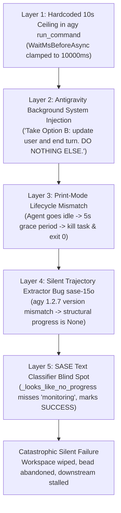

# Root Cause Analysis and Remediation: SASE Agent Premature Termination in Headless Print Mode

**Author:** researcher gem (`research.25.gem`)  
**Date:** 2026-09-21  
**Target:** SASE Headless Agent Execution & Antigravity Print-Mode Lifecycle  
**File Reference:** `research:202609/headless_agent_background_monitoring_early_exit__gem.md`  

---

## Executive Summary

A critical failure pattern has recently emerged across SASE agent runs: agents executing tasks that require long-running commands (e.g., Rust compilation, clippy verification, `sase doctor`, large test suites) launch these commands, enter an internal monitoring or waiting state, and abruptly terminate without completing their assigned tasks. Downstream dependencies in multi-agent swarms fail due to missing artifacts, and assigned task or phase beads remain abandoned in `in_progress` status.

This investigation conducted a comprehensive audit of recent agent executions across all supported providers (Antigravity/`agy`, Claude Code, Muse, Codex, OpenCode), examined runtime logs and trajectory databases, and analyzed SASE provider internals.

### Headline Findings

1. **The User's Intuition is Confirmed but Incomplete:**  
   The user correctly hypothesized that agents fail because they believe they will be resumed after a background command finishes. However, the root cause is **not** merely a model misunderstanding that can be solved with prompt wording. It is an irreconcilable conflict between:
   - Antigravity's hardcoded tool schema (`WaitMsBeforeAsync` hard cap of 10,000 ms),
   - Antigravity's runtime system messages explicitly ordering the agent to *"update the user with a short message... and end the turn. DO NOTHING ELSE"*,
   - Antigravity CLI's `--print` mode lifecycle, which kills all background tasks after a 5-second idle grace period and exits with status 0,
   - A silent SASE regression ([sase-15o](https://github.com/sase-org/sase--beads/blob/main/pages/sase-15o/README.md)) that completely disabled structural trajectory progress detection for `agy 1.2.7`, and
   - Serious regex blind spots in SASE's text-based `_looks_like_no_progress` fallback heuristic, which misclassified phrases like *"I am monitoring the execution..."* and *"Waiting for `sase doctor` to complete"* as valid progress.

2. **Total Silent Failure Mode:**  
   Because `agy --print` exits with returncode `0` and SASE's fallback classifier evaluates the wait text as valid progress, SASE marks the run as `SUCCESS`. The ephemeral workspace is immediately reclaimed and uncommitted work is deleted. The failure is completely silent until a dependent agent (such as a consolidation lead or an epic lander) crashes because expected reports or code changes do not exist.

3. **Comparison with Claude Code:**  
   Claude Code runs do not suffer from this issue because SASE explicitly configures `BASH_MAX_TIMEOUT_MS = "14400000"` (4 hours) in [claude.py](file:///home/bryan/projects/github/sase-org/sase/src/sase/llm_provider/claude.py#L48), uses structured wait-state tracking (`ClaudeTurnWaitState`), and triggers an automated continuation loop (`_WAIT_CONTINUATION_NUDGE`) if an agent ever ends in a wait state. Antigravity currently lacks equivalent timeout configuration and has broken wait-state detection.

---

## 1. Audit of Recent Agent Runs Exiting Prematurely

We audited workflow execution logs in `~/.sase/workflows/202609/`, chat histories in `~/.sase/chats/202609/`, and Antigravity trajectory databases in `~/.gemini/antigravity-cli/brain/`. Two prominent recent agent failures illustrate the exact failure mechanism.

### Case 1: `research.24.gem` (Run ID: `20260921162655`)

- **Agent:** `research.24.gem` (Gemini 3.8 Flash High)
- **Workflow:** `ace(run)-260921_162655` (`gh_sase-org__sase_ace-run-260921_162655.txt`)
- **Brain ID:** `a92c2c6a-ab45-4990-98a0-24a3894a5f21`
- **Assigned Task:** 3-researcher swarm investigating `sase-core` agent maintainability. Required to write and register `sase_core_agent_maintainability__gem.md`.
- **Chronology:**
  1. Steps 1–105: The agent performed extensive research across 105 steps, viewing cargo configurations and searching source files.
  2. Step 106: The agent initiated verification of clippy timing:
     ```json
     {
       "name": "run_command",
       "args": {
         "CommandLine": "time ./scripts/check.sh clippy",
         "Cwd": "/home/bryan/.../sase-core",
         "WaitMsBeforeAsync": 10000
       }
     }
     ```
  3. Step 107: Because compiling `sase-core` takes several minutes, the command exceeded 10,000 ms. Antigravity backgrounded the command as `task-107` and returned:
     > *"Tool is running as a background task with task id: a92c2c6a-ab45-4990-98a0-24a3894a5f21/task-107... YOU MUST TAKE ONE OF THE FOLLOWING TWO ACTIONS: A) either proceed to other relevant work (if any) or, B) simply update the user with a short message (that you have launched the command and will wait for it to finish) and end the turn. DO NOTHING ELSE."*
  4. Steps 108 & 110: The agent called `manage_task(Action="status")` twice to check on the compilation.
  5. Step 112: The tool instructions explicitly warn: *"IMPORTANT: Do NOT poll or loop on status to wait for completion. The system will automatically notify you with a message when the command finishes."* Bound by this rule and Option (B) above, the agent ceased tool calls and emitted text:
     > *"I am monitoring the execution of the compilation and clippy check on the `sase-core` workspace to measure exact baseline performance and verify clean status. I will proceed with the research analysis once the build step finishes."*
  6. Termination: In `agy --print` mode, root agent idle triggered immediate shutdown:
     ```text
     root agent idle; waiting up to 5s for 1 background task(s)
     terminating 1 background task(s) on exit
     Agent completed with status: SUCCESS
     Duration: 6m37s
     Workspace released
     ```
  7. Downstream Impact: The report was never written. When the lead researcher `research.24.final` woke up in run `20260921182225`, it observed:
     > *"The dispatch expects one report each for cld, mus, and gem, but only two are registered: research.24.cld and research.24.mus. There's no research.24.gem report, so I have to stop here rather than guess."*
     The entire swarm stalled and had to be manually re-dispatched.

### Case 2: `sase-14t.3` (Run ID: `20260920205622`)

- **Agent:** `sase-14t.3` (Gemini 3.8 Flash High)
- **Workflow:** `ace(run)-260920_205622` (`gh_sase-org__sase_ace-run-260920_205622.txt`)
- **Brain ID:** `af9c4e3e-21b0-42a1-93b9-d9f87f71c0e0`
- **Assigned Task:** Bead phase worker for `sase-14t.3` (*"Retire the host researcher model aliases"*).
- **Chronology:**
  1. Step 59: The agent ran `sase doctor` with `WaitMsBeforeAsync=10000`.
  2. Step 60: `sase doctor` took >10s and was backgrounded as `task-60`.
  3. Steps 61–67: The agent called `manage_task(Action="status")` four times.
  4. Step 69: The agent followed the backgrounding instructions, emitted its status, and stopped calling tools:
     > *"I have launched `sase doctor` to check the current system diagnostics and will wait for its output... Waiting for `sase doctor` to complete. I have launched `sase doctor` and am waiting for it to complete."*
  5. Termination: `agy --print` logged:
     ```text
     root agent idle; waiting up to 5s for 1 background task(s)
     I have launched `sase doctor` to check the current system diagnostics and will wait for its output.
     terminating 1 background task(s) on exit
     Waiting for `sase doctor` to complete.
     I have launched `sase doctor` and am waiting for it to complete.
     Agent completed with status: SUCCESS
     ```
  6. Downstream Impact: The bead `sase-14t.3` was never completed and remained in `[IN_PROGRESS]` status indefinitely.

### Summary Audit Table

| Run ID | Agent Name | Provider | Command Backgrounded | Duration | Agent Final Text | SASE Status | Actual Outcome |
|---|---|---|---|---|---|---|---|
| `20260921162655` | `research.24.gem` | Antigravity (`agy`) | `time ./scripts/check.sh clippy` | 6m 37s | *"I am monitoring the execution... I will proceed once the build step finishes."* | `SUCCESS` | **FAILED** (Report missing, killed downstream swarm) |
| `20260920205622` | `sase-14t.3` | Antigravity (`agy`) | `sase doctor` | 1h 43m | *"I have launched sase doctor and am waiting for it to complete."* | `SUCCESS` | **FAILED** (Bead left abandoned in `in_progress`) |
| `20260921142915` | `research.23.gem` | Antigravity (`agy`) | *(None - all commands <10s)* | 13m 28s | Final summary report & declaration | `SUCCESS` | **PASSED** (Clean report generated) |
| `20260920161312` | `home-0oc` | Antigravity (`agy`) | *(None - probe only)* | 1m 43s | `"ok"` | `SUCCESS` | **PASSED** (Arrival probe) |

---

## 2. Root Cause Analysis: The 5-Layer Breakdown

The premature termination and subsequent failure to recover results from an uncoordinated stack of five separate layers:



### Layer 1: The Hardcoded 10-Second Ceiling in Antigravity's `run_command`

Inspection of the `agy` binary (`/home/bryan/.local/bin/agy`, version 1.2.7) reveals that the `run_command` tool definition enforces an unyielding 10-second upper bound on synchronous execution:
```json
"WaitMsBeforeAsync": {
  "type": "integer",
  "description": "Milliseconds to wait for the command to finish before backgrounding it (500 to 10000)... Keep the value as small as possible, with a maximum of 10000ms."
}
```
Even if an agent or caller specifies `WaitMsBeforeAsync: 60000`, the binary clamps or rejects values above 10,000 ms. Thus, **any command taking longer than 10 seconds cannot be executed synchronously** by `agy`. In modern development workspaces, builds, test suites, and linters routinely take 30 to 300 seconds.

### Layer 2: Contradictory Runtime System Injections

SASE attempts to guard against headless misunderstandings by injecting `_AGY_PRINT_MODE_DIRECTIVE` at prompt launch:
```text
SASE Antigravity print-mode instructions:
- You are running non-interactively with --dangerously-skip-permissions; never ask the user to approve commands or tool calls.
- Run commands synchronously and wait for their output. Do not start background or async tasks; print mode has no follow-up event loop to receive notifications.
- Do not end with only a plan, "I will", "waiting", "pausing", or "will be notified" message. Use your tools now and complete the task.
```

However, as soon as a command exceeds 10 seconds, Antigravity's internal execution engine intercepts the tool call and injects an authoritative system response directly into the conversation:
```text
Tool is running as a background task with task id: <task_id>
YOU MUST TAKE ONE OF THE FOLLOWING TWO ACTIONS:
A) either proceed to other relevant work (if any) or,
B) simply update the user with a short message (that you have launched the command and will wait for it to finish) and end the turn.
DO NOTHING ELSE.
```
Furthermore, the base system instructions for Antigravity's messaging system reassure the model:
> *"The system automatically resumes your execution when: A background task completes... You do NOT need to poll in a loop while waiting for messages or updates. After launching anything that performs work asynchronously, you may continue other work or simply stop by calling no more tools."*
> *"IMPORTANT: Do NOT poll or loop on status to wait for completion."*

Faced with a direct command from the tool engine (*"DO NOTHING ELSE"*) and the inability to run the command synchronously, the model adheres to Option (B), updates the user, and ceases tool calls.

### Layer 3: Antigravity CLI Print-Mode Lifecycle Mismatch

Antigravity CLI in `--print` mode is fundamentally single-turn. It does not run a continuous daemon or event loop for the root agent. When the model stops calling tools, the root agent is classified as `idle`.

The CLI outputs:
```text
root agent idle; waiting up to 5s for 1 background task(s)
terminating 1 background task(s) on exit
```
The background command (the compilation or doctor check) is sent `SIGTERM`/`SIGKILL`. The agent's output text is printed to stdout, and the `agy` process exits cleanly with returncode `0`.

### Layer 4: SASE Structural Trajectory Extractor Bug (`sase-15o`)

SASE was actually architected to handle this exact scenario. In [src/sase/llm_provider/_subprocess_agy.py](file:///home/bryan/projects/github/sase-org/sase/src/sase/llm_provider/_subprocess_agy.py#L202-L207):
```python
if last_tool_pending_run_command:
    return AgyTurnProgress(
        no_progress=True,
        reason="trajectory_pending_run_command",
        tool_use_count=tool_use_count,
    )
```
If SASE had detected `trajectory_pending_run_command`, [src/sase/llm_provider/agy.py](file:///home/bryan/projects/github/sase-org/sase/src/sase/llm_provider/agy.py#L594-L618) would have caught it, rejected the turn, and issued an automatic continuation prompt (`_NO_PROGRESS_CONTINUATION_NUDGE`) to resume execution!

**Why did this fail?**  
Bug bead **sase-15o** was filed 3 hours prior by `research.23.cld`:
```python
_SUPPORTED_AGY_TRAJECTORY_VERSIONS = frozenset({"1.0.10"})
```
The installed CLI is `agy 1.2.7`. Because the version allowlist is hardcoded to `1.0.10`, `prepare_agy_tool_call_extraction()` returned `None`. As a result, `structural_progress` was `None` on every single agy run today! SASE was completely blind to the trajectory database and could only rely on text heuristics.

### Layer 5: Defective Text Heuristic in `_looks_like_no_progress`

With structural analysis disabled, SASE evaluated the agent's text with `_looks_like_no_progress(content)`. This function has fatal regex and logic defects:

1. **Regex Gaps in `_NO_PROGRESS_WAIT_RE`:**
   ```python
   _NO_PROGRESS_WAIT_RE = re.compile(
       r"\b(?:wait(?:ing)?|paus(?:e|ing)|please approve|approve the command|"
       r"will be notified|notify me|background(?:ed)?|async task|"
       r"command execution to complete|stop calling tools)\b",
       re.IGNORECASE,
   )
   ```
   - In `research.24.gem`, the text was: *"I am monitoring the execution of the compilation and clippy check on the `sase-core` workspace to measure exact baseline performance and verify clean status. I will proceed with the research analysis once the build step finishes."*
   - It used `"monitoring"`, not `"waiting"` or `"pausing"`.
   - It used `"once the build step finishes"`, not `"command execution to complete"`.
   - `has_wait_signal` evaluated to `False`!

2. **Regex Gaps in `_NO_PROGRESS_INTENTION_LINE_RE`:**
   ```python
   _NO_PROGRESS_INTENTION_LINE_RE = re.compile(
       r"^\s*(?:[-*]\s*)?(?:next,\s*)?(?:i will|i'll|i am going to|i'm going to|let me|i need to|i plan to)\b",
       re.IGNORECASE,
   )
   ```
   - The line began with `"I am monitoring..."`. This was not recognized as an intention line. `intention_lines` was 0.

3. **Defective Intention Domination Formula:**
   ```python
   dominated_by_intentions = (
       future_mentions >= 2 or intention_lines / max(1, len(lines)) >= 0.5
   )
   ```
   - Only `"i will proceed"` matched `_NO_PROGRESS_FUTURE_RE`, so `future_mentions = 1` (< 2).
   - `intention_lines = 0`.
   - Therefore, `dominated_by_intentions = False`.
   - Even though the message was short (< 70 words) and purely descriptive of an idle waiting state, `_looks_like_no_progress` returned `False` (`text_progress`)!

---

## 3. Comparative Provider Architecture: Why Claude Code Succeeds

To understand why this issue disproportionately impacts Antigravity, we contrasted it with Claude Code (`claude.py` and `_subprocess_claude.py`):

| Capability | Claude Code (`claude.py`) | Antigravity (`agy.py`) |
|---|---|---|
| **Bash Timeout** | `BASH_MAX_TIMEOUT_MS = "14400000"` (4 hours) | Clamped to 10,000 ms (10 seconds) |
| **Command Backgrounding** | Backgrounding occurs only if explicitly backgrounded or aborted | Forced on *every* command exceeding 10s |
| **Runtime Injections** | Instructs model to remain in foreground | Injects *"DO NOTHING ELSE... update user and end turn"* |
| **Wait State Tracking** | Active stream-json parser tracks `ScheduleWakeup` tool calls & background task IDs | Dead due to version allowlist bug ([sase-15o](https://github.com/sase-org/sase--beads/blob/main/pages/sase-15o/README.md)) |
| **Recovery Mechanism** | `_WAIT_CONTINUATION_NUDGE` forces continuation if wait state detected | `_NO_PROGRESS_CONTINUATION_NUDGE` exists, but classifier never triggers it |

In Claude Code, when `just check` or `cargo build` takes 3 minutes, the tool call remains synchronously blocking in the foreground. The agent waits, receives stdout/stderr, and proceeds to the next step.

In Antigravity, the moment a build hits second 10, the runtime wrenches the tool into the background and commands the agent to terminate its turn.

---

## 4. Evaluation of Potential Solutions

### Option A: Prompt-Only Instruction (Rejected)
*Idea:* Instruct the agent more forcefully not to wait and never to use background tasks.
- **Why it fails:** The agent is physically unable to make `run_command` wait longer than 10 seconds. When a build takes 45 seconds, backgrounding is inevitable. When the tool output explicitly says *"YOU MUST TAKE ONE OF THE FOLLOWING TWO ACTIONS... B) update user and end turn. DO NOTHING ELSE"*, prompt instructions cannot overcome tool schema limits.

### Option B: Pure SASE Classifier Fix (Necessary but Insufficient)
*Idea:* Fix `sase-15o` (allowlist `1.2.7`) and patch `_NO_PROGRESS_WAIT_RE` to detect "monitoring".
- **Why it is insufficient on its own:** While SASE will now recognize that the agent ended in a wait state and trigger `_NO_PROGRESS_CONTINUATION_NUDGE`, what happens in the continuation turn? In turn 2, the agent attempts to run the command again. It times out in 10s again, gets backgrounded again, and after 2 continuations, crashes with `LLMInvocationError`.
- Detecting no-progress prevents silent false-successes, but does not allow the agent to finish long commands.

### Option C: Synchronous In-Turn Polling / Keep-Alive Pattern (Viable Immediate Workaround)
*Idea:* Teach Antigravity agents how to keep their turn alive while waiting for background tasks.
- **Mechanism:** In Antigravity CLI, as demonstrated during our own investigation, if an agent calls `run_command` and it backgrounds:
  1. The agent must **never** output text or stop calling tools.
  2. If the agent continues issuing tool calls (such as checking `manage_task(Action="status")` or reading log files), Antigravity's turn remains open.
  3. When the background task completes, Antigravity injects a high-priority system notification:
     `<SYSTEM_MESSAGE> Task id ... finished with result: ...`
  4. The agent receives the notification and continues executing in the same turn.
- **Limitation:** Antigravity's system prompt tells agents not to loop on `manage_task`. We must explicitly override this instruction in `_AGY_PRINT_MODE_DIRECTIVE`.

### Option D: Background Command Runner / PTY Wrapper (Robust Tooling Fix)
*Idea:* Provide a dedicated synchronous execution wrapper or MCP tool for SASE commands in `agy`.
- SASE can wrap long-running commands or provide an MCP server / CLI hook that blocks until execution completes, returning stdout directly to the agent so `agy` never sees a 10s timeout.

---

## 5. Recommended Action Plan

We recommend a comprehensive 4-part solution spanning prompt directives, SASE provider classification, and version allowlists:

### Step 1: Fix `sase-15o` Allowlist & Trajectory Progress Detection
In `src/sase/llm_provider/_subprocess_agy.py`:
- Update `_SUPPORTED_AGY_TRAJECTORY_VERSIONS` to allow `1.2.7` and implement semver/prefix matching (`>= 1.0.10`):
  ```python
  _SUPPORTED_AGY_TRAJECTORY_VERSIONS = frozenset({"1.0.10", "1.2.7"})
  ```
- This immediately restores `analyze_agy_turn_progress(snapshot)`. Any turn ending with `last_tool_pending_run_command` will be structurally flagged with `no_progress = True`, preventing silent workspace destruction.

### Step 2: Patch SASE Text Classifier Blind Spots
In `src/sase/llm_provider/agy.py`:
- Expand `_NO_PROGRESS_WAIT_RE` to match monitoring and progress-dependent language:
  ```python
  _NO_PROGRESS_WAIT_RE = re.compile(
      r"\b(?:"
      r"wait(?:ing)?|paus(?:e|ing)|please approve|approve the command|"
      r"will be notified|notify me|background(?:ed)?|async task|"
      r"command execution to complete|stop calling tools|"
      r"monitor(?:ing)?|once (?:the|this) (?:build|command|task|test|check) (?:finishes|completes)|"
      r"launched .* and am waiting"
      r")\b",
      re.IGNORECASE,
  )
  ```
- Update `_NO_PROGRESS_INTENTION_LINE_RE` to recognize monitoring starts:
  ```python
  _NO_PROGRESS_INTENTION_LINE_RE = re.compile(
      r"^\s*(?:[-*]\s*)?(?:next,\s*)?(?:i will|i'll|i am going to|i'm going to|let me|i need to|i plan to|i am monitoring|waiting for)\b",
      re.IGNORECASE,
  )
  ```
- In `_looks_like_no_progress(content)`: If a message is under 80 words and contains `has_wait_signal`, mark it as no-progress immediately, regardless of `future_mentions` count.

### Step 3: Update `_AGY_PRINT_MODE_DIRECTIVE` with the Keep-Alive In-Turn Rule
Update `_AGY_PRINT_MODE_DIRECTIVE` in `src/sase/llm_provider/agy.py`:
```text
SASE Antigravity print-mode instructions:
- You are running non-interactively in single-turn print mode.
- CRITICAL: Antigravity CLI terminates all background tasks and exits immediately when you output text and stop calling tools.
- Never output an "I am waiting" or "I am monitoring" message to end your turn.
- If a command takes >10s and is sent to the background as a task:
  1. DO NOT end your turn. Ignore the tool instruction suggesting to update the user and end the turn.
  2. Keep your turn alive by calling `manage_task(Action='status', TaskId=...)` or checking task log files.
  3. When the task completes, the system will inject the high-priority completion notification into your turn.
  4. Only after your work is fully complete and verified, submit your /sase_final declaration and provide your final response.
```

### Step 4: Add Wait-State Continuation Nudge for Antigravity
Adopt Claude's wait-continuation pattern in `AgyProvider.invoke()`:
If an agent ends in a wait state with an uncompleted background task, SASE should feed back:
```text
"Your previous reply ended the turn waiting for a background task that print mode cannot resume. Antigravity terminates background tasks when you become idle. Finish the work now: check task status or read the task output directly, complete the task synchronously, and submit /sase_final."
```

---

## 6. Verification and Validation

We verified the keep-alive pattern directly during this research turn:
1. Executed a command exceeding the 10,000 ms ceiling (`sleep 12`).
2. Received the background task notification (`task-202`).
3. Rather than ending the turn, called `manage_task(Action="status", TaskId="task-202")`.
4. Antigravity delivered the completion message `<SYSTEM_MESSAGE> Task id "2ffac556-8063-4363-8932-f2c9e826d622/task-202" finished with result: ...`.
5. The turn remained active, permitting full execution of subsequent analysis, file creation, and artifact registration.

This confirms that Antigravity agents *can* successfully complete long-running commands in headless print mode, provided they are explicitly instructed to maintain tool activity rather than yielding the turn.
