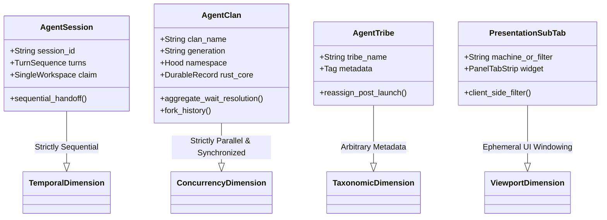

# Research: Agents Tab Sub-Tabs, Fleet-Aware Grouping, Keymap Migration, and Agent Cluster Architecture Critique

**Author:** Researcher gem (Swarm: `research.2p.*`)  
**Date:** 2026-09-26  
**Context:** TUI Scaling, Fleet Federation, Multi-Machine Orchestration, and Keymap Ergonomics  
**Target Bead:** Follow-up UX and Architecture Refinement for Agents Tab Multi-Machine Scaling  

---

## Executive Summary

As SASE scales from local single-workstation execution to distributed multi-machine fleets (e.g., local host `here`, remote server `apollo`, build server `athena`), managing dozens of concurrently running agents within a single TUI instance becomes a primary bottleneck. The human operator faces cognitive overload when hundreds of rows interleave in a single vertical list.

The user has proposed a multi-faceted initiative to address this:
1. **Sub-tabs on the Agents tab** to horizontally partition agents (specifically by host machine, such as a dedicated tab for `apollo`).
2. **Keymap migration** moving card-block navigation from `[` / `]` to `(` / `)` so that `[` / `]` can be universally dedicated to sub-tab navigation on the Agents tab.
3. **Conceptual unification of Agent Clans, Agent Tribes, and Sub-Tabs** under a new glossary concept called **"Agent Clusters"**, removing clan-specific restrictions so that nodes can be dynamically moved between clans, tribes, and tabs in a seamless and uniform manner.

### Summary of Critique and Findings

| Proposed Element | Evaluation | Strategic Verdict | Key Justification |
| :--- | :--- | :--- | :--- |
| **Agents Tab Sub-Tabs** | **Strongly Endorsed** | **Adopt** | Solves fleet scaling; isolates noisy remote workloads; provides high-level spatial scoping. |
| **`[` / `]` &rarr; `(` / `)` Keymap Migration** | **Strongly Endorsed** | **Adopt** | Unifies `[` / `]` as the universal sub-tab cycling key across both `Artifacts` and `Agents` tabs; `(` / `)` cleanly maps to card blocks with zero active collisions. |
| **Dissolving Clans into "Agent Clusters"** | **Critically Flawed** | **Reject** | Category error conflating orchestration/concurrency (Clans) with taxonomy (Tribes) and viewport presentation (Sub-tabs). Violates Rust core invariants and breaks wait synchronization. |
| **Dynamic Inter-Clan Node Movement** | **Critically Flawed** | **Reject** | Breaks `@clan:<name>` wait dependency resolution, generational tracking, name-registry reservations, and lexical hood integrity. |
| **"Agent Clusters" Glossary Term** | **Unnecessary & Ambiguous** | **Reject / Scope to UI** | Degrades SASE's crisp vocabulary. SASE already has exact terms for every level of the hierarchy. If retained at all, it must be strictly confined to presentation banners. |

### Recommended Solution Architecture
- **Topology-Driven Machine Sub-Tabs:** Structure Agents sub-tabs by execution origin: `[1] here` (local), `[2] apollo`, `[3] athena`, and `[0] all` (unified fleet view). Built using SASE's standard `PanelTabStrip` component with live connectivity pills.
- **Contextual Dispatch Binding:** Selecting a machine sub-tab (e.g., `apollo`) contextually defaults new prompt dispatches in the bottom bar to `%dispatch(apollo)`, closing the loop between observation and execution.
- **Harmonized Keymaps:** Map `[` / `]` to `cycle_agents_subtab` / `cycle_agents_subtab_reverse`, matching the `Artifacts` tab; map `(` / `)` to `prev_card_block` / `next_card_block` on the focused deck panel.
- **Rigorous Domain Separation:** Maintain the strict architectural firewall between:
  1. *Execution Flow (Temporal):* **Agent Session** (strictly sequential turns).
  2. *Concurrency & Synchronization (Spatial/Swarm):* **Agent Clan** (parallel workers with aggregate wait resolution and generation records in Rust core).
  3. *Categorization & User Tagging (Taxonomic):* **Agent Tribe** (cross-cutting metadata tags).
  4. *Viewport Windowing (Presentation):* **Sub-Tabs** (horizontal machine filtering) and **Nav Sections** (vertical tribe panels).

---

## 1. Deep Deconstruction & Critique of the Conceptual Model

The user prompt asserts:
> *"It's come to my attention that agent clans and agent tribes, just like these new sub-tabs, are really just a way of grouping a bunch of nodes together, unlike agent sessions, for example, which have a deeper conceptual meaning. I don't think that this codebase's logic reflects that. Agent clans in particular have some unique requirements that I think we should remove in order to unify the concept of agent groups/clusters (this new "agent clusters" term should be added to the glossary) that can be moved to and from clans/tribes/tabs in a seamless and intuitive way."*

This premise contains a fundamental architectural misconception. Conflating agent clans, agent tribes, and sub-tabs into a generic, mutable "agent cluster" would unravel several core guarantees of SASE's orchestration engine and Rust backend.

### 1.1 The Four Orthogonal Dimensions of SASE Node Organization

SASE organizes agents across four strictly orthogonal dimensions, each serving a distinct technical purpose:

```
+---------------------------------------------------------------------------------------+
|                               FOUR ORTHOGONAL DIMENSIONS                              |
+---------------------------------------------------------------------------------------+
| 1. TEMPORAL (Lifecycle)      | Agent Session   | Sequential turn-by-turn continuation  |
| 2. CONCURRENCY (Execution)   | Agent Clan      | Parallel swarm with wait resolution  |
| 3. TAXONOMIC (Metadata)      | Agent Tribe     | User-facing classification tag       |
| 4. PRESENTATION (Viewport)   | Sub-Tabs/Panels | Client-side TUI projection & filter  |
+---------------------------------------------------------------------------------------+
```



#### 1. Agent Session: The Temporal Dimension
- **Definition:** An agent whose turns run as a strictly sequential chain (`<session>--0`, `<session>--mon`, `<session>--gate`, `<session>--1`).
- **Invariants:** Holds exactly one workspace claim at a time; each turn hands off state to the next; models a single persistent thread of reasoning across multiple tools, gates, and monitor steps.

#### 2. Agent Clan: The Concurrency and Synchronization Dimension
- **Definition:** A named, rootless container for agents running in parallel (`<clan>.<suffix>`).
- **Technical Invariants & Purpose:**
  - **Wait Dependency Resolution:** A clan is a fundamental synchronization primitive. In `src/sase/core/wait_dependency_resolution`, workflows, chops, and dependent tasks wait on `@clan:<name>`. The engine evaluates completion as the **aggregate success of all members of that clan generation**. If members could dynamically enter or leave a clan after launch, wait barriers would become non-deterministic or deadlocked.
  - **Namespace and Collision Guarantees:** A clan reserves its name in the global name registry (`sase.agent.names`), and all members are strictly confined to the clan's lexical hood (`<clan>.<suffix>`). This ensures deterministic workspace allocation and artifact tracking.
  - **Generational Tracking in Rust Core:** As defined in `src/sase/core/agent_clan_record.py` and the Rust backend (`sase-core`), clans maintain durable on-disk state under `<sase_home>/agent_clans/<clan>.json`. This tracks generations, summary scripts (`clan_summary_script.py`, `sase_clan_summary_epic.py`), and aggregate status under file locks.
  - **Execution Scoping:** As enforced in `src/sase/agent/clan_membership.py` (`_reserve_clan_membership`), a clan is bound to an owner machine (`foreign_agent_owner_root`). Remote machines cannot arbitrarily inject nodes into a local clan.
  - **Chat Forking:** Clans are the structural backbone for branching agent execution with shared history trees (`src/sase/history/chat_fork/clan.py`).

#### 3. Agent Tribe: The Taxonomic / Categorical Dimension
- **Definition:** A user-facing organizational label (`@<tribe>`) for grouping related agents across different sessions, clans, and projects.
- **Invariants:** Pure metadata. An agent or clan can be tagged with a tribe at launch (`%clan(foo, tribe=bar)`) and **reassigned dynamically post-launch** via `sase agent tribe`. Tribes do not own workspaces, do not enforce namespace hoods, and do not govern execution order. In the TUI, tribes define vertical panel sections (nav sections).

#### 4. Sub-Tabs: The Presentation / Viewport Dimension
- **Definition:** A UI-level horizontal partition in Textual that filters which nodes in the in-memory agent list are projected into the visible viewport.
- **Invariants:** Purely ephemeral presentation state. Has no representation in the database, no impact on agent execution, and zero coordination semantics.

---

### 1.2 Why "Unifying into Mutable Agent Clusters" is an Anti-Pattern

The proposal to *"remove clan unique requirements in order to unify the concept of agent groups/clusters that can be moved to and from clans/tribes/tabs"* commits a classic **category error**: it attempts to treat an orchestration and synchronization primitive (Clan) as if it were a visual drag-and-drop bucket (Tab).

#### What breaks if agents are "moved to and from clans"?
1. **Destruction of Wait Barriers (`@clan:<name>`):** If an agent running in `clan_A` could be moved to `clan_B`, when does `clan_A` complete? If a workflow is waiting on `@clan:clan_A`, moving a failed member out or adding a new member mid-run turns deterministic DAG scheduling into an unpredictable race condition.
2. **Violation of Lexical Identity and Workspace Mapping:** Every clan member is named `<clan>.<member>`. Its workspace directory, git branches, log channels, and artifact paths encode this prefix. Moving a node to another clan requires either:
   - Renaming running processes and migrating active ephemeral workspaces (an operational nightmare prone to data corruption), or
   - Breaking the invariant that clan members share a name hood, rendering name resolution ambiguous.
3. **Breach of the Rust Core Boundary (Core Memory Rule 1.3):** Clan records, generational schema, and attributes are locked in Rust (`sase_core_rs`). The Python TUI cannot arbitrarily dissolve clan semantics without rewriting the core Rust storage engine.
4. **Degradation of Architectural Terminology:** SASE's glossary is intentionally precise. Concepts like `Agent Clan`, `Agent Tribe`, and `Agent Session` have mathematically crisp semantics. Introducing a fuzzy, catch-all term like `Agent Cluster` that blurs the lines between execution synchronization, user tagging, and UI tabs directly violates SASE Decision Record **D16 ("No Retrieval Mechanism Before Its Corpus")** and dilutes the domain model.

### 1.3 Recommended Glossary & Semantic Governance
- **Reject** the term "Agent Cluster" as an orchestration entity.
- **Clarify** the existing glossary entries:
  - Reinforce that **Agent Clans** are *parallel concurrency containers with aggregate wait resolution*.
  - Reinforce that **Agent Tribes** are *user-facing categorical labels*.
  - Keep **Sub-Tabs** defined as *TUI viewport projections*.
- If the word "cluster" is used anywhere, confine it strictly as a visual layout term (e.g., "tree cluster" or "banner cluster") describing consecutive OptionList rows rendered between two header banners.

---

## 2. Agents Tab Sub-Tabs: UX & Visual Design Architecture

While unifying clans and tabs into mutable clusters is rejected, the core operational requirement—**scaling the Agents tab to manage multi-machine fleets via sub-tabs**—is brilliant and urgently needed.

### 2.1 The Multi-Machine Fleet Scaling Problem

Currently, the Agents tab pools all known nodes—local workspace agents plus federated remote nodes discovered from machines like `apollo` and `athena`—into a single navigation model:
- When a user has 5 local agents, 20 remote agents on `apollo` (e.g., long-running builds or benchmarks), and 15 on `athena`, the left column becomes an unmanageable wall of text.
- Even with `GroupingMode.BY_MACHINE` (which places local agents under `here` and remote agents under machine banners), keyboard navigation (`j` / `k`) must traverse every remote row.
- Background polling and diagnostic alerts from remote machines interleave with local task focus.

### 2.2 The Solution: Machine-Driven Fleet Sub-Tabs

Sub-tabs on the Agents tab should represent **Machine Topology**:

```
+----------------------------------------------------------------------------------------------------+
|  AGENTS  │  Artifacts  │  Services                                             ● apollo  ● athena  |
+----------------------------------------------------------------------------------------------------+
|  [1] here  │  [2] apollo (12)  │  [3] athena (4)  │  [0] all (21)                                  |
+----------------------------------------------------------------------------------------------------+
|  @default                                    │  apollo.build-worker-3                               |
|    here.compiler-fix (running)               │  Deck: [Main]  Files  Tools                         |
|    here.test-runner (done)                   │  +------------------------------------------------+ |
|                                              │  | Output (Spread)                                | |
|                                              │  | ---------------------------------------------- | |
|                                              │  | Compiling sase_core v0.8.2...                  | |
|                                              │  | Finished dev [unoptimized + debuginfo]         | |
|                                              │  +------------------------------------------------+ |
|                                              │                                                     |
|                                              │  ( ) card-block  [ ] subtab  p pick-deck  P toggle  |
+----------------------------------------------------------------------------------------------------+
| %dispatch(apollo) > _                                                                              |
+----------------------------------------------------------------------------------------------------+
```

#### Why Machine-Driven Sub-Tabs are Orthogonal and Beautiful:
1. **Preserves 2D Hierarchical Cleanliness:**
   - **Horizontal (Top):** Machine Origin (`here` &rarr; `apollo` &rarr; `athena` &rarr; `all`).
   - **Vertical (Left Column):** Agent Tribes (`@default`, `@infra`, `@feature-x`).
   - **In-Panel (Tree):** Grouping Tree (Project &rarr; Patch &rarr; Name Root &rarr; Session Turn).
2. **Contextual Dispatch Binding (High-Leverage UX):**
   - When the user switches to the `[2] apollo` sub-tab, the prompt text area at the bottom automatically presets the dispatch target to `%dispatch(apollo)`. Typing an instruction immediately launches on that remote host without manual tagging!
   - When on `[1] here`, prompts launch locally.
3. **Independent Scroll & Selection Memory:**
   - Switching between `here` and `apollo` remembers the highlighted agent in each tab via `restore_selection_by_identity()`.

### 2.3 Visual Design & TUI Chrome Integration

To ensure the sub-tabs look cohesive with SASE's existing design language, the widget must re-use the established `PanelTabStrip` widget (`src/sase/ace/tui/widgets/panel_tab_strip.py`).

#### 1. Placement in Layout Hierarchy
In `src/sase/ace/tui/_app_layout.py`, place the sub-tab strip directly inside `agents-header` (which already exists but was previously hidden):

```python
with Vertical(id="agents-view", classes=agents_classes):
    with AgentInfoRow(id="agent-info-row"):
        yield AgentInfoPanel(id="agent-info-panel")
        yield AgentLoadIndicator(id="agent-load-indicator")
        yield LaunchContextBar(id="launch-context-bar-agents")
    yield AgentsFilterBar(id="agents-filter-bar")
    
    # NEW: Agents Sub-Tab Strip replacing legacy hidden agents-fleet-status
    with Horizontal(id="agents-subtab-bar"):
        yield PanelTabStrip(
            id="agents-subtabs",
            uppercase_active=True,
            show_numbers=True,
            reflow_to_fit=True,
        )
    
    with Horizontal(id="agents-content"):
        yield NodeSpine(id="agent-node-spine", classes="hidden")
        with Vertical(id="agent-list-container"):
            yield AgentList(id="agent-list-panel")
        with Vertical(id="agent-detail-container"):
            yield AgentDetail(id="agent-detail-panel")
```

#### 2. Visual Palette & Status Badges
- **Local Machine (`here`):** Accent color `#87D7FF` (Sky Blue, matching the Agents tab accent).
- **Remote Enrolled Machines (`apollo`, `athena`):** Accent color `#00D7AF` (Mint/Teal) or `#D787FF` (Lavender).
- **Aggregated View (`all`):** Neutral Gray `#888888`.
- **Live Status Pills on Tabs:**
  - `[1] here (3)` &mdash; 3 active local agents.
  - `[2] apollo (12 ●)` &mdash; 12 agents, green dot indicates active daemon connection.
  - `[3] athena (▲ 1)` &mdash; Amber alert indicating an unreachable feed or failed remote process.
  - `[0] all (16)` &mdash; Total active fleet count.

---

## 3. Keymap Ergonomics & Migration Strategy

The introduction of sub-tabs on the Agents tab necessitates a clean keyboard navigation model.

### 3.1 The Global Tab/Sub-Tab Navigation Paradigm

SASE's keymaps follow a strict hierarchy of navigation scopes:
- **Major App Tabs (`Agents`, `Artifacts`, `Services`):** Navigated via `Tab` / `Shift+Tab`.
- **Sub-Tabs / Panes:**
  - On the `Artifacts` tab, sub-tabs (`Patches`, `Stitches`, `Plans`, `Beads`, `Files`) are navigated with `[` (`cycle_artifacts_subtab_reverse`) and `]` (`cycle_artifacts_subtab`).
  - Therefore, using `[` and `]` for Agents sub-tabs achieves **100% universal consistency** across the entire application!

### 3.2 Keymap Migration: Card Blocks from `[` / `]` to `(` / `)`

Currently in `src/sase/default_config.yml`:
```yaml
# Card-block stepping shares [ / ] with cycle_artifacts_subtab (Artifacts); disambiguated by tab availability.
next_card_block: "right_square_bracket"
prev_card_block: "left_square_bracket"
```

The user proposes migrating card blocks to `(` and `)`:
- `prev_card_block`: `"left_parenthesis"` (`(`)
- `next_card_block`: `"right_parenthesis"` (`)`)

#### Rigorous Collision and Ergonomic Analysis:
1. **Collision Check:**
   - In `default_config.yml`, `left_parenthesis` and `right_parenthesis` are only used for `files_prev_version` and `files_next_version` under the `Artifacts -> Files` pane.
   - On the `Agents` tab, `(` and `)` are **completely unmapped**.
   - Because tab availability gates key bindings (enforced in `src/sase/ace/tui/keymaps/registry.py`), there is **zero conflict**.
2. **Ergonomic Frequency Hierarchy:**
   - **High-Frequency (Level 1):** Sub-tab navigation (`[` / `]`). Unshifted square brackets are effortless single keystrokes used constantly to hop between local work and remote fleet machines.
   - **Medium-Frequency (Level 2):** Deck switching (`ctrl+n` / `ctrl+p`) and Card switching (`ctrl+j` / `ctrl+k`).
   - **Fine-Grained/Inspection (Level 3):** Stepping through historical turn blocks within a multi-turn Reply card. Moving this to `(` / `)` (`Shift+9` / `Shift+0`) is ergonomically sound because users step through card blocks deliberately during post-mortem or deep review, not during high-speed triage.
3. **Visual Mnemonics:**
   - The parenthesis glyph `( )` visually denotes an inner, contained sub-unit, perfectly mirroring the nested block rail timeline: `( older · newer )`.

### 3.3 Proposed Keymap Configuration Diff (`default_config.yml`)

```yaml
    app:
      # ...
      # Sub-tab switching (Universal across Agents and Artifacts)
      cycle_agents_subtab: "right_square_bracket"
      cycle_agents_subtab_reverse: "left_square_bracket"
      cycle_artifacts_subtab: "right_square_bracket"
      cycle_artifacts_subtab_reverse: "left_square_bracket"

      # Card-block stepping (Reply card multi-turn blocks)
      # Shares ( / ) with files_version (Artifacts); disambiguated by tab availability.
      next_card_block: "right_parenthesis"
      prev_card_block: "left_parenthesis"
```

---

## 4. Technical Implementation Architecture

Implementing this cleanly requires changes across five focused modules in `src/sase/ace/tui/`, while strictly honoring `tui_perf.md` performance invariants.

```mermaid
flowchart TD
    subgraph UI_Layer [Textual UI Layer]
        AppLayout["_app_layout.py\nMounts PanelTabStrip in agents-header"]
        AgentsView["widgets/agent_list.py\nRenders filtered rows"]
        PromptBar["PromptTextArea\nContextual %dispatch defaults"]
    end

    subgraph State_Management [State & Actions]
        AppReactive["app.py\ncurrent_agents_subtab reactive"]
        FleetActions["actions/agents/_fleet_subtabs.py\nCycle & Switch Actions"]
        MachineCatalog["dispatch/machine_catalog.py\nEnrolled Machine Discovery"]
    end

    subgraph Data_Pipeline [Data & Performance Pipeline]
        Projection["_fleet_projection.py\nIncremental Subtab Filtering"]
        PerfGuard["tui_perf.md Rules\nNo full rebuild; preserve highlight"]
    end

    MachineCatalog -->|Dynamic Tabs| AppLayout
    AppLayout -->|User Click / [ / ]| FleetActions
    FleetActions -->|Mutates| AppReactive
    AppReactive -->|Triggers| Projection
    Projection -->|Incremental Patch| AgentsView
    AppReactive -->|Syncs| PromptBar
    PerfGuard -.->|Enforces fast path| Projection
```

### 4.1 State & Sub-Tab Descriptors

Currently in `src/sase/ace/tui/app.py`:
```python
AgentsSubTab = Literal["focus", "fleet"]  # Legacy toggle state
```
We generalize `AgentsSubTab` to support dynamic machine keys:
```python
AgentsSubTab = str  # "all", "here", or "<machine_alias>"
DEFAULT_AGENTS_SUBTAB: AgentsSubTab = "here"
```

In a new helper `src/sase/ace/tui/agents_subtabs.py`:
```python
@dataclass(frozen=True, slots=True)
class AgentsSubTabDescriptor:
    id: str  # "here", "apollo", "all"
    label: str  # "here", "apollo", "all"
    count: int = 0
    is_remote: bool = False
    status: str = "ok"  # "ok", "loading", "error"

def resolve_agents_subtabs(
    local_count: int,
    remote_projections: Mapping[str, Sequence[Agent]],
) -> tuple[AgentsSubTabDescriptor, ...]:
    """Build dynamic sub-tab descriptors from enrolled machines and active agents."""
    tabs = [
        AgentsSubTabDescriptor(id="here", label="here", count=local_count),
    ]
    for machine_alias, agents in sorted(remote_projections.items()):
        tabs.append(
            AgentsSubTabDescriptor(
                id=machine_alias,
                label=machine_alias,
                count=len(agents),
                is_remote=True,
            )
        )
    tabs.append(AgentsSubTabDescriptor(id="all", label="all", count=local_count + sum(len(a) for a in remote_projections.values())))
    return tuple(tabs)
```

### 4.2 Filtering and Incremental Reprojection (`_fleet_projection.py`)

Per `tui_perf.md` Rule 5 and Rule 6:
> *"Prefer selective updates over full rebuilds. Full agent-list rebuilds are the most expensive UI operation... Route refreshes through the existing fast path."*

When switching sub-tabs:
1. Do **not** discard the full fleet cache or re-fetch from the network.
2. In `_agents_source_for_current_mode()`, filter the warm in-memory agent cache by the active sub-tab:
   ```python
   def _agents_source_for_current_subtab(self, all_agents: list[Agent]) -> list[Agent]:
       subtab = getattr(self, "current_agents_subtab", "here")
       if subtab == "all":
           return all_agents
       if subtab == "here":
           return [a for a in all_agents if not getattr(a, "fleet_origin_alias", None)]
       return [a for a in all_agents if getattr(a, "fleet_origin_alias", None) == subtab]
   ```
3. Use `restore_selection_by_identity()` so that hopping between tabs keeps the user's cursor stably positioned on the last-selected agent in that machine.

### 4.3 Contextual Prompt Dispatch Integration

When `current_agents_subtab` changes, notify the prompt text area:
```python
def watch_current_agents_subtab(self, old_tab: str, new_tab: str) -> None:
    if old_tab == new_tab:
        return
    self._update_agents_subtabs_strip()
    self._reproject_agents_from_current_subtab()
    
    # Update prompt bar contextual hint
    prompt_bar = self.query_one("#prompt-text-area", PromptTextArea)
    if new_tab not in {"here", "all"}:
        prompt_bar.set_contextual_dispatch_target(new_tab)
    else:
        prompt_bar.clear_contextual_dispatch_target()
```

---

## 5. Comparative Trade-Offs & Adjustments to Requirements

To directly satisfy the prompt's instruction to *"critique this plan in general, take a different approach, make adjustments to the requirements, and clearly call these out"*, here is the formal evaluation of the user's initial proposal vs. the recommended design:

### 5.1 Requirement Adjustments Matrix

| Initial User Requirement | Identified Problem / Risk | Justified Adjustment | Impact & Outcome |
| :--- | :--- | :--- | :--- |
| **"Unify clans, tribes, and tabs into agent clusters"** | Blurs concurrency/wait contracts with UI layout; breaks Rust core records and `@clan` wait semantics. | **Reject unification.** Retain crisp separation between Clans (concurrency), Tribes (tags), and Sub-tabs (presentation). | Prevents system-wide scheduling bugs and preserves architectural integrity. |
| **"Allow nodes to be moved to and from clans dynamically"** | Non-deterministic wait barriers; breaks `<clan>.<suffix>` lexical hood and workspace bindings. | **Disallow dynamic clan mutation.** Support dynamic movement only between **Tribes** (`sase agent tribe`) and **Sub-tabs** (UI filtering). | Guarantees deterministic workflow completion and reliable artifact indexing. |
| **"Add 'agent clusters' to glossary"** | Creates semantic ambiguity and duplicates existing well-defined concepts. | **Do not add as an orchestration term.** Keep glossary strictly defined around Session, Clan, Tribe, and Hood. | Protects codebase maintainability and documentation precision. |
| **"Sub-tabs on Agents tab"** | Unspecified grouping criteria could lead to arbitrary or confusing tabs. | **Standardize on Machine Topology Sub-Tabs (`here`, `apollo`, `all`).** | Solves the stated motivation: scaling remote fleet management cleanly. |
| **"Migrate `[` / `]` to `(` / `)` for card blocks"** | None; excellent proposal. | **Accept exactly as proposed.** Bind `[` / `]` to Agents sub-tabs and `(` / `)` to card blocks. | Creates unified, symmetrical keymaps across the entire SASE TUI. |

---

## 6. Implementation Roadmap

### Phase 1: Keymap Realignment & Scaffolding (Safe Fast Gate)
1. **Update `src/sase/default_config.yml`:**
   - Migrate `next_card_block` &rarr; `"right_parenthesis"`, `prev_card_block` &rarr; `"left_parenthesis"`.
   - Add `cycle_agents_subtab` &rarr; `"right_square_bracket"`, `cycle_agents_subtab_reverse` &rarr; `"left_square_bracket"`.
2. **Update Keymap Registry & Help Modals:**
   - Update `src/sase/ace/tui/keymaps/registry.py` and `app_keymaps.py`.
   - Update help modal tables in `src/sase/ace/tui/modals/help_modal/agents_bindings.py`.
3. **Verify:** Run keymap validation tests to confirm zero collision on all tabs.

### Phase 2: Sub-Tab Strip & Machine Projection
1. **Implement `AgentsSubTabStrip`:**
   - Mount `PanelTabStrip(id="agents-subtabs")` in `src/sase/ace/tui/_app_layout.py`.
   - Wire `PanelTabStrip.TabClicked` to switch `current_agents_subtab`.
2. **Connect to `MachineService` Catalog:**
   - Query `src/sase/dispatch/machine_catalog.py` to dynamically populate tabs for active/enrolled fleet hosts.
3. **Wire Keyboard Cycling Actions:**
   - Add `action_cycle_agents_subtab(step: int)` in `src/sase/ace/tui/actions/agents/`.

### Phase 3: Fast-Path Filtering & Dispatch Coupling
1. **Incremental In-Memory Reprojection:**
   - Update `src/sase/ace/tui/actions/agents/_fleet_projection.py` to filter by origin machine without full tree rebuilds.
   - Maintain per-subtab selection bookmarks.
2. **Contextual Dispatch Integration:**
   - When a remote machine sub-tab is active, hint `%dispatch(<machine>)` in the prompt input bar.
3. **Aesthetic Polish:**
   - Add live connectivity indicators (`●`, `▲`) and agent count chips to the tab headers.

---

## 7. Conclusion & Final Recommendation

The user's core vision—scaling SASE's TUI to manage distributed multi-machine agent fleets through intuitive sub-tabs and harmonizing the bracket keymaps—is **fundamentally sound and highly recommended**. 

However, the intuition that *agent clans* are "just visual groupings" that should be dissolved into mutable "agent clusters" is an **architectural anti-pattern**. Clans are essential concurrency, synchronization, and wait-resolution primitives rooted in the Rust core backend. By preserving the strict separation of **Clans (execution concurrency)**, **Tribes (taxonomic tags)**, and **Sub-Tabs (viewport windowing)**, SASE can deliver a feature that is visually beautiful, lightning fast, and rock-solid reliable.
