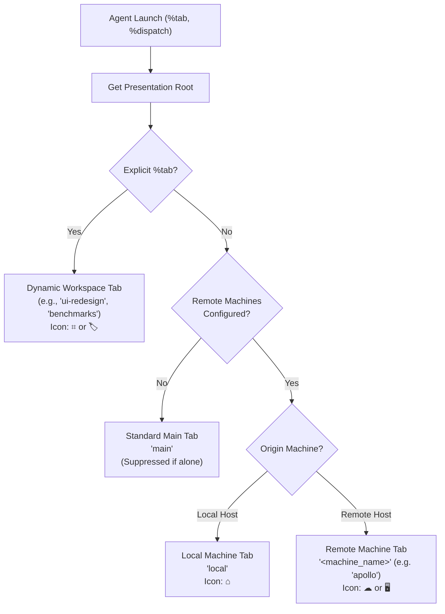
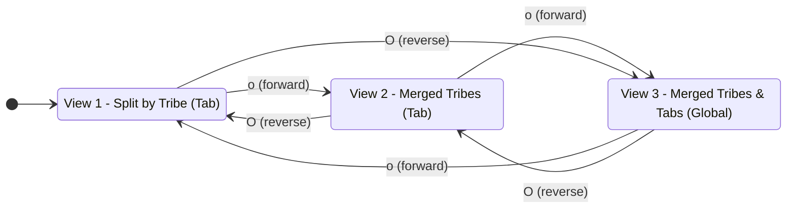

# Dynamic Sub-Tabs, Machine Tabs, and Fleet-Wide Agent Workspace Architecture

**Research Report · Researcher: `gem`**  
**Date:** September 2026  
**Artifact Target:** `research:202609/agents_dynamic_subtabs_and_machine_tabs__gem.md`  

---

## 1. Executive Summary & Verdict

This report investigates the proposal to introduce dynamic sub-tabs to the SASE TUI "Agents" tab, driven by the `%tab:<tab_name>` prompt directive, machine-aware default scoping (`local` / `<machine_name>`), single-tab suppression, and a unified 3-view panel layout cycling via `o` / `O` in lieu of an "ALL" sub-tab.

### Verdict in Brief
The proposed model is an **outstanding architectural and UX advancement**. It fundamentally solves the tension between physical machine topology and logical workflow organization. Prior research (`agent_machine_tabs_and_cluster_semantics.md`) focused narrowly on physical machine boundaries (`here`, `apollo`, `mac`) and proposed an artificial `All` sibling tab that created category confusion and navigation friction. 

In contrast, the user's vision establishes **dynamic tabs as logical workspaces**, with machine tabs serving as an intuitive, automatic fallback when no explicit workspace is requested. Rejecting the "ALL" sub-tab in favor of a 3rd layout view (merging all tribes and all tabs into a single panel) cleanly separates **spatial partitioning** (sub-tabs) from **aggregation projection** (panel layout modes).

### Key Architectural Recommendations
1. **Adopt `%tab:<tab_name>` with Structural Inheritance**: Prompt directives and CLI flag `--tab <name>` set the workspace tab. Child turns of agent sessions, monitors, and gate turns must automatically inherit their parent's tab so structural subtrees never fracture across views.
2. **Implement Two-Tier Resolution (Workspace vs. Machine)**:
   - Explicit `%tab:<name>` always wins across all machines (enabling cross-machine project clustering).
   - Omitted `%tab` falls back to machine tabs (`local` for the controller, `<machine_name>` for remotes) when remote federation hosts are configured, or `main` when standalone.
3. **Refine Single-Tab Suppression with Focus Latching**: Suppress the sub-tab bar whenever $\le 1$ tab has agents *and* the cursor is on the default tab. If a user is actively viewing a dynamic tab whose last agent completes or is killed, preserve the tab with a clean empty state until the user deliberately navigates away, avoiding jarring UI jumps.
4. **Implement the 3-View Panel Layout Ladder (`o` / `O`)**:
   - `o` cycles forward: `Split by Tribe (Tab)` $\to$ `Merged Tribes (Tab)` $\to$ `Merged Tribes & Tabs (Global)` $\to$ `Split by Tribe (Tab)`.
   - `O` cycles in reverse.
   - Display clear status in `AgentGroupingModal` and emit transient toast notifications.
5. **Harmonize Sub-Tab Keymaps Across the App**: Migrate card-block stepping from `[` / `]` to `(` / `)`, unlocking `[` / `]` as the universal sub-tab cycling key across both the "Artifacts" and "Agents" tabs.

---

## 2. Critique of the Proposal & Prior Research

### 2.1 Why the Prior Research Was Insufficiently Ambitious
The earlier research document (`agent_machine_tabs_and_cluster_semantics.md`) evaluated machine tabs primarily as a point fix for multi-machine scaling (`GroupingMode.BY_MACHINE`). Its primary deficiencies were:
1. **Physical Host Conflation**: It treated tabs as strictly synonymous with physical machines (`here`, `apollo`, `mac`). In real-world software engineering, developers work on *topics, epics, and features*—some of which happen to run locally while others run on remote GPU/compute clusters. Restricting tabs to machine names forces users to mentally reconstruct project boundaries fragmented across machine silos.
2. **Category Confusion with the `All` Tab**: The prior synthesis proposed placing `All` alongside individual machines in the tab strip (`All 42 │ ⌂ here 12 │ apollo 24`). This creates a meta-view masquerading as a peer item. `All` is not a machine or a project; it is a full-roster aggregation. Navigating with `[` and `]` requires traversing an redundant catch-all tab that duplicates every row.
3. **Passive, Static Roster Assumptions**: Prior research assumed a fixed set of tabs determined exclusively at machine enrollment time. It lacked any mechanism for user-declared workspaces or ephemeral agent swarms.

### 2.2 Evaluation of the Proposed Plan
The user's plan addresses all three weaknesses while introducing zero UX tax on simple setups:

| Proposed Feature | Evaluation | Technical & UX Rationale |
| :--- | :--- | :--- |
| **`%tab:<tab_name>` Directive** | **Essential** | Gives agents first-class workspace attribution at launch time. Fully auditable, declarative, and reproducible in prompts. |
| **Omission Defaults to `main` / Machine** | **Elegant** | Zero mental overhead for casual launches. Machine defaults take over only when multi-machine federation is actually configured. |
| **Single-Tab Suppression** | **Critical** | Preserves precious vertical terminal rows when dynamic tabs are not in use (e.g. standard local development). |
| **Machine Tabs (`local` / `<machine_name>`)** | **Intuitive** | Distinguishes execution host origin naturally without requiring custom tags. |
| **Icons for Machine Tabs** | **Beautiful** | Instant visual differentiation between local workstation, remote compute nodes, and user project tabs. |
| **Cross-Machine `%tab` Grouping** | **Transformative** | Allows a swarm running across 3 machines for `#benchmarks` to live in a single unified `benchmarks` tab. |
| **No "ALL" Sub-Tab; 3-View `o`/`O` Merging** | **Superior** | Keeps the tab strip semantically pure (disjoint sets) while providing global visibility as a layout projection. |

---

### 2.3 Justified Adjustments and Recommendations

While the core plan is exceptionally solid, deep examination of SASE's TUI engine, agent session lifecycles, and fleet federation reveals four necessary adjustments:

#### Adjustment 1: Active Tab Focus Latching (Preventing Disorienting Tab Snapping)
*Requirement:* "If there is only one tab that has agents on it, then we should not show any tabs at all (i.e. keep the current behavior)."  
*Risk:* Imagine a developer is currently focused on tab `ci-fix`, viewing a running test agent. The agent finishes and is auto-dismissed or killed. The count on `ci-fix` becomes 0. If the system strictly evaluates `len(tabs_with_agents) == 1` immediately, the `ci-fix` tab would vanish instantly, the entire sub-tab bar would collapse, and the cursor would be abruptly thrown onto `main`/`local`. This violates the principle of least astonishment.  
*Adjustment:* **Implement focus latching.** 
- A tab with 0 agents remains visible *as long as it is the currently selected tab*.
- It renders a helpful empty-state view:
  ```text
  No agents on tab 'ci-fix'
  Press [ or ] to switch tabs, or launch with %tab:ci-fix
  ```
- Only when the user navigates away from the empty tab does it prune itself from the active strip. If only one tab remains with agents at that point, the tab strip gracefully hides.

#### Adjustment 2: CLI Parity (`--tab <name>` on Launch Commands)
*Requirement:* Support `%tab:<tab_name>` in prompts.  
*Adjustment:* In accordance with SASE conventions where directives mirror CLI arguments (e.g. `%model` $\leftrightarrow$ `--model`, `%clan` $\leftrightarrow$ `--clan`, `%id` $\leftrightarrow$ `--id`), add `--tab <name>` to:
- `sase run --tab <name>`
- `sase tool run --tab <name>`
- `sase agent create --tab <name>`
This ensures scripts, cron chops, and external integrations can target tabs without having to inject synthetic directive prefixes into prompt text.

#### Adjustment 3: Structural Inheritance Across Agent Sessions, Monitors, and Clans
*Requirement:* Any agents launched with `%tab` use that tab.  
*Adjustment:* Agent lifecycles frequently spawn child processes and follow-up turns:
- **Sequential Agent Sessions (`%id(..., session=...)`)**: All subsequent turns of a session must automatically inherit the session root's `tab`.
- **Sase Monitors (`sase monitor` / `--mon`)**: The detached supervisor turn and the follow-up resume agent must inherit the creator's `tab`.
- **Sase Gates (`sase gate` / `--gate`)**: Human-in-the-loop gate turns must remain in the same tab as the parent agent.
- **Clans (`%clan:<name>`)**: If a clan declarer specifies `%tab:eval`, all co-members of that clan generation must default to `eval` unless an individual member explicitly declares otherwise.
*Rule:* In SASE's TUI, grouping must never split a clan or agent session across views. Structural descendants inherit their presentation root's effective tab.

#### Adjustment 4: Tab Name Sanitization and Case Normalization
*Requirement:* Support arbitrary `<tab_name>`.  
*Adjustment:* Define clear lexical bounds for `<tab_name>`:
- **Allowed Characters**: `[a-zA-Z0-9_.-]+` (slug format). Max length 32 characters.
- **Case Policy**: Case-preserving for display, case-insensitive for identity (`ProjectX` and `projectx` map to the same tab, rendered using the first-seen casing).
- **Reserved Names**: `all` (disallowed to prevent confusion with the rejected ALL sub-tab), `none`, `default`. Authoring `%tab:all` raises a descriptive error: `DirectiveError: '%tab:all' is reserved; use the 'o' panel layout to view all agents`.

---

## 3. Detailed Architecture & Technical Design

### 3.1 Taxonomy of Tabs: Dynamic vs. Machine



#### Effective Tab Resolution Algorithm
For any loaded agent $A$, its effective tab is resolved as:
$$
\text{EffectiveTab}(A) = \begin{cases}
\text{root}(A).\text{tab} & \text{if } \text{root}(A).\text{tab} \neq \text{None} \\
\text{"local"} & \text{if remotes configured and } \text{root}(A).\text{is\_local} \\
\text{root}(A).\text{fleet\_origin\_alias} & \text{if remotes configured and } \text{root}(A).\text{is\_remote} \\
\text{"main"} & \text{otherwise}
\end{cases}
$$

---

### 3.2 Visual & Aesthetic Design ("Beautiful, Intuitive, Reliable")

The Agents tab layout is organized vertically. To ensure the sub-tab bar looks integrated and gorgeous, it is placed immediately above the agent roster content.

```text
┌────────────────────────────────────────────────────────────────────────────────────────────────────────┐
│  ACE 3.4.0 · sase · master*                          [Agents]  Patches  Artifacts  Services           │
├────────────────────────────────────────────────────────────────────────────────────────────────────────┤
│  RUNNING 3  WAITING 1  DONE 28  FAILED 0  ATTENTION 1                      ⌂ local (16GB / 8 slots)   │
├────────────────────────────────────────────────────────────────────────────────────────────────────────┤
│  / status:running                                                                                      │
├────────────────────────────────────────────────────────────────────────────────────────────────────────┤
│    ⌂ local 4  │  ☁ apollo 12 !1  │  🖥 zeus 2  │  ⌗ ui-redesign 3  │  🏷 benchmarks 6                  │
├───────────────────────────────────┬────────────────────────────────────────────────────────────────────┤
│  ▼ @default                       │  Agent: sase-47a.1 (ui-redesign)                                  │
│    ▶ sase-47a.1 [DONE] 1m 24s     │  Status: DONE  Workspace: #47  Model: @flash                     │
│    ● sase-47a.2 [RUNNING] 14s     │  ────────────────────────────────────────────────────────────────  │
│  ▼ @critique                      │  [Step 1] Initialized design token mappings in styles.tcss         │
│    ● sase-47c.1 [RUNNING] 42s     │  [Step 2] Verified responsive typography across breakpoints        │
│                                   │                                                                    │
├───────────────────────────────────┴────────────────────────────────────────────────────────────────────┤
│  [ / ] switch tabs · o layout · p project · d date · s status · m machine · ? help                     │
└────────────────────────────────────────────────────────────────────────────────────────────────────────┘
```

#### Aesthetic Specifications
1. **Machine Tab Styling & Icons**:
   - `local`: Accent `#87D7FF` (Sky Blue) with icon `⌂` (Unicode `U+2302` House) or `🖥` (`U+1F5A5`). E.g., `⌂ local 4`.
   - Remote machines (e.g. `apollo`, `zeus`): Accent `#A6E22E` (Spring Green) with icon `☁` (`U+2601` Cloud) or `🖥`. E.g., `☁ apollo 12`.
2. **Dynamic Workspace Tab Styling & Icons**:
   - Project/feature tabs (e.g. `ui-redesign`): Accent `#FD971F` (Warm Amber) with icon `⌗` (`U+2317` Viewdata Squares) or `🏷` (`U+1F3F7` Label).
3. **Active vs. Inactive Tabs**:
   - **Active Tab**: Rendered with `bold <accent_color>`, background highlight `#2E2E3E`, and an explicit underline or bracket framing (`[ ⌂ local 4 ]`).
   - **Inactive Tab**: Dimmed label `#888888`, muted icon `#666666`, distinct count badge.
4. **Attention Indicator Badges**:
   - Inactive tabs that contain agents requiring human intervention (such as a pending `sase gate` decision or a failed agent) display a high-visibility attention badge: `!1` in `bold #F92672` (Crimson).
   - This ensures a developer working on `local` immediately notices when a gate turn triggers on `apollo` or `ui-redesign`.
5. **Responsive Overflow & Reflow**:
   - Uses `PanelTabStrip`'s three-tier reflow engine:
     - `full`: `⌂ local 4 │ ☁ apollo 12 !1 │ ⌗ ui-redesign 3`
     - `compact`: `⌂ loc 4 │ ☁ apo 12 !1 │ ⌗ ui 3`
     - `micro`: `⌂ 4 │ ☁ 12 !1 │ ⌗ 3`
   - If even micro overflows on small terminal windows (< 70 cols), the strip displays a left/right scroll arrow indicator (`◄ 2 more │ ... │ 1 more ►`).

---

### 3.3 The 3-View Panel Layout Architecture (`o` and `O`)

Currently, `AgentGroupingModal` allows switching between `GroupingMode` (`p` Project, `d` Date, `s` Status, `m` Machine) and toggling panel grouping (`_agent_panels_grouped: bool`) between *Split panels by tribe* and *Merged panels*.

We transform this binary toggle into an **orthogonal 3-view layout ladder**:



#### Detailed View Definitions

| View Mode | Tab Scope | Tribe Partition | Visible Agents |
| :--- | :--- | :--- | :--- |
| **1. Split by Tribe (Active Tab)** *(Default)* | Current Tab only | Multiple side/stacked panels by tribe (`@default`, `@critique`) | Only agents on active tab, partitioned by tribe |
| **2. Merged Tribes (Active Tab)** | Current Tab only | Single unified panel | Only agents on active tab, all tribes merged |
| **3. Merged Tribes & Tabs (Global)** | **All Tabs** | Single unified panel | **Every agent across all tabs and machines**, unified into one panel |

#### Modal Integration (`AgentGroupingModal`)
In `src/sase/ace/tui/modals/agent_grouping_modal.py`, update the footer section:
```text
  Panel layout
  > [o/O] Panel layout: Split by tribe (active tab)
          Press 'o' to cycle forward, 'O' to cycle reverse
          [1] Split by tribe  -->  [2] Merged tribes  -->  [3] Merged tribes & tabs
```
When `o` or `O` is pressed inside the modal:
- Updates the selection index or executes the cycle immediately.
- Calling `_set_agent_panel_layout_mode(new_mode)` updates `self._agent_panel_layout_mode: AgentPanelLayoutMode`.
- Notifies the user via toast: `Agent layout: Merged tribes & tabs (global)`.

#### Behavior of the Sub-Tab Bar in View 3
When the user switches to View 3 (Global Merged):
- The sub-tab bar remains visible (if $\ge 2$ tabs exist), but enters an **aggregate highlight state**:
  `[ ALL TABS (MERGED) ] │ ⌂ local 4 │ ☁ apollo 12 │ ⌗ ui-redesign 3`
- Selecting any specific tab via click or `[` / `]` automatically transitions the layout back to View 2 (or View 1) scoped to that selected tab. This provides an intuitive "drill-down" escape hatch from the global view back to an individual tab.

---

### 3.4 Keymap Migration & Harmonization

| Current Action | Current Key | New Key | Scope / Condition |
| :--- | :--- | :--- | :--- |
| **Cycle Agent Sub-Tabs Forward** | *(None)* | `]` (`right_square_bracket`) | Agents tab |
| **Cycle Agent Sub-Tabs Reverse** | *(None)* | `[` (`left_square_bracket`) | Agents tab |
| **Next Card Block (Detail View)** | `]` | `)` (`right_parenthesis`) | Agents tab detail panel |
| **Prev Card Block (Detail View)** | `[` | `(` (`left_parenthesis`) | Agents tab detail panel |
| **Cycle Panel Layout Forward** | `o` *(in modal)* | `o` *(in modal)* | `AgentGroupingModal` |
| **Cycle Panel Layout Reverse** | *(None)* | `O` *(in modal)* | `AgentGroupingModal` |
| **Open Grouping Chooser** | `o` | `o` | Agents tab |

*Benefits:*
- Square brackets `[` / `]` become the **universal sub-tab cycling keys** throughout the entire SASE application, identically navigating subtabs on both the Artifacts tab (Stitches, Beads, Files, Plans) and the Agents tab (Local, Remotes, Dynamic Workspaces).
- Parentheses `(` / `)` become the universal internal block/version stepping keys (matching Artifacts Files version stepping).

---

## 4. Glossary Specification: `machine-tabs`

In compliance with SASE durable memory requirements (Section 1.1.1 and 3.2 of `AGENTS.md`), the new term will be authored via the audited memory workflow into `sase/memory/glossary/machine-tabs.md`:

```markdown
---
type: reference
tags: [agents, tui, dispatch, federation, navigation]
---

# Machine Tabs

A machine tab is an automatically generated [[sase-agent|agent]] sub-tab in the SASE TUI
"Agents" view that scopes the visible roster to agents running on a specific execution host.

When remote machines are configured in the federation dispatch catalog, the default tab
for agents launched on the local controller is automatically displayed as `local` (replacing
`main`), while agents running on a remote host default to that host's configured alias
(e.g., `apollo`, `zeus`). Machine tabs render with a dedicated host icon (`⌂` for local,
`☁` for remote) and display live count and attention badges.

Machine tabs serve as the physical host fallback in SASE's dynamic workspace model: any
agent launched with the explicit `%tab:<tab_name>` directive joins the specified `<tab_name>`
workspace tab instead, grouping related work across multiple machines into a single logical
tab. If only a single tab contains agents, all sub-tabs are suppressed.
```

---

## 5. Technical Implementation Blueprint

### 5.1 Directive Pipeline & Metadata Storage

1. **`src/sase/xprompt/_directive_types.py`**:
   - Add `"tab"` to `_KNOWN_DIRECTIVES`.
   - Add `tab: str | None = None` to `PromptDirectives`.
2. **`src/sase/xprompt/_directive_collect.py`**:
   - Collect `%tab:<tab_name>` and `%tab(<tab_name>)`.
   - Validate `<tab_name>` format against regex `^[a-zA-Z0-9_.-]+$`. Reject empty strings and reserved words (`all`, `none`).
3. **`src/sase/axe/run_agent_directive_metadata.py`**:
   - In `build_agent_meta()`, write `agent_meta["tab"] = directives.tab` if set.
   - In `preserved_agent_metadata()`, add `"tab"` to preserved keys during re-exec.
4. **`src/sase/core/agent_scan_wire_markers.py`**:
   - Add `tab: str | None = None` to `AgentMetaWire`.
5. **`src/sase/ace/tui/models/_loaders/_meta_enrichment_filesystem.py` and `_meta_enrichment_wire.py`**:
   - In `enrich_agent_from_meta()` and `enrich_agent_from_meta_wire()`:
     ```python
     raw_tab = data.get("tab")
     if isinstance(raw_tab, str) and raw_tab.strip():
         agent.tab = raw_tab.strip()
     ```
6. **`src/sase/ace/tui/models/_fleet_agents_rows.py`**:
   - Populate `agent.tab` from remote federation payloads if provided in the host catalog.

---

### 5.2 TUI Sub-Tab Component & Navigation

1. **New Widget: `AgentSubTabStrip`** (`src/sase/ace/tui/widgets/agent_subtab_strip.py`):
   - Subclasses or wraps `PanelTabStrip`.
   - Computes tab roster from current loaded `_agents_with_children`:
     - Tally agents by effective tab.
     - Detect presence of configured remote machines via `FederationConfig`.
     - Construct `PanelTab` descriptors:
       - `id`: tab name (`local`, `apollo`, `ui-redesign`).
       - `label`: display label with agent count (`local 4`).
       - `icon`: `⌂`, `☁`, `⌗`.
       - `accent_color`: blue, green, amber.
   - Emits `AgentSubTabChanged(tab_id)`.
2. **Single-Tab Suppression & Latching**:
   - If `len(tabs_with_agents) <= 1` and `active_tab in {"main", "local"}`:
     - Set widget CSS `display: none`.
   - If `active_tab` is a dynamic tab with 0 agents:
     - Keep widget visible (latched) until the user switches away.
3. **TUI Layout Placement** (`src/sase/ace/tui/_app_layout.py`):
   - Place `AgentSubTabStrip` directly above `#agents-content`.
4. **Action Handlers & Keymaps**:
   - Add actions `action_next_agents_subtab()` and `action_prev_agents_subtab()`.
   - Bind to `]` and `[` in `default_config.yml` and `app_keymaps.py`.

---

### 5.3 3-View Panel Layout Implementation

1. **Enum: `AgentPanelLayoutMode`** (`src/sase/ace/tui/models/agent_panels.py`):
   ```python
   class AgentPanelLayoutMode(Enum):
       SPLIT_BY_TRIBE = "split_by_tribe"               # View 1
       MERGED_TRIBES = "merged_tribes"                 # View 2
       MERGED_TABS_AND_TRIBES = "merged_tabs_tribes"   # View 3
   ```
2. **Modal Updates** (`src/sase/ace/tui/modals/agent_grouping_modal.py`):
   - Support `o` to step layout forward and `O` to step layout backward.
   - Return `AgentGroupingAction.CYCLE_PANEL_LAYOUT_FORWARD` and `AgentGroupingAction.CYCLE_PANEL_LAYOUT_REVERSE`.
3. **Application Mixin** (`src/sase/ace/tui/actions/agents/_panel_navigation.py`):
   - Implement `action_cycle_agent_panel_layout(reverse: bool = False)`:
     ```python
     order = [
         AgentPanelLayoutMode.SPLIT_BY_TRIBE,
         AgentPanelLayoutMode.MERGED_TRIBES,
         AgentPanelLayoutMode.MERGED_TABS_AND_TRIBES,
     ]
     idx = order.index(self._agent_panel_layout_mode)
     delta = -1 if reverse else 1
     self._agent_panel_layout_mode = order[(idx + delta) % len(order)]
     self._refilter_agents()
     ```
4. **Filter & Projection Pipeline** (`src/sase/ace/tui/actions/agents/_loading_filter.py`):
   - In View 1 and View 2: Filter `_agents = [a for a in roster if a.effective_tab == current_subtab]`.
   - In View 3: Keep all agents `_agents = list(roster)`.
   - Pass `merge_tribe_panels = mode != AgentPanelLayoutMode.SPLIT_BY_TRIBE` to `panel_key_per_agent()`.

---

## 6. Edge Cases, Failure Modes, & Safety Matrix

| Scenario / Edge Case | Failure Risk | Mitigation Strategy |
| :--- | :--- | :--- |
| **All agents on active tab finish/die** | Tab vanishes under cursor; jarring layout snap to local tab | **Focus latching**: Keep tab rendered with an empty-state card until user presses `[`/`]` to leave. |
| **Cross-machine swarm with `%tab`** | Federation sync drops or delays remote agent metadata | Fallback to machine tab until federation metadata syncs; merge seamlessly upon arrival without jumping cursor. |
| **Remote machine goes offline / stale** | Inactive machine tab becomes misleading | Display stale/offline indicator (`☁ apollo ! [offline]`) in tab strip with tooltip explaining status. |
| **Conflicting search query** | Typed filter (e.g. `machine:zeus`) contradicts selected tab `apollo` | Tab filter and search query compose as an `AND` predicate; display clear empty state: "0 agents match query 'machine:zeus' on tab 'apollo'". |
| **Long tab names overflow terminal** | Text truncates or wraps onto second line, breaking TUI layout | Enforce 32-char cap on `%tab`; trigger `PanelTabStrip`'s compact/micro tiers; add horizontal scroll clipping if terminal < 70 cols. |
| **Legacy `[` / `]` card block muscle memory** | User presses `[` expecting card block scroll | Provide release note, startup notice, and update KeybindingFooter and Help Modal to show `(`/`)` for card blocks and `[`/`]` for tabs. |

---

## 7. Delivery & Rollout Plan

- **Phase 1: Directive & Core Metadata Pipeline**
  - Land `%tab:<name>` parsing in `sase.xprompt`.
  - Wire `tab` into `agent_meta.json` and `AgentMetaWire`.
  - Add unit tests for directive validation, normalization, and inheritance.
- **Phase 2: TUI Agent Model & Effective Tab Resolution**
  - Add `Agent.tab` and `resolve_agent_tab()` logic.
  - Implement remote fleet host tab synthesis.
  - Author and register the `glossary:machine-tabs` memory strand.
- **Phase 3: Sub-Tab Strip & Navigation**
  - Build `AgentSubTabStrip` with machine/dynamic icons, counts, and attention badges.
  - Implement single-tab suppression with focus latching.
  - Wire `[` / `]` keymaps and migrate card blocks to `(` / `)`.
- **Phase 4: 3-View Panel Layout Ladder (`o` / `O`)**
  - Update `AgentGroupingModal` with 3-state cycle for `o` and `O`.
  - Implement `AgentPanelLayoutMode` in `_panel_navigation.py` and `_loading_filter.py`.
  - Update visual golden tests and TUI screenshot fixtures.

---

## 8. Conclusion

The proposed dynamic sub-tabs feature with machine defaults and 3-view layout merging is an exemplary synthesis of user-centered design and systems engineering. It avoids the pitfalls of prior rigid models, preserves minimalism when not needed, and scales effortlessly to distributed multi-machine swarms. Implementing the design as refined in this report will make the SASE Agents tab more intuitive, robust, and beautiful.
