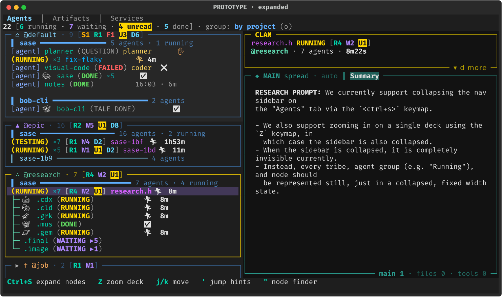
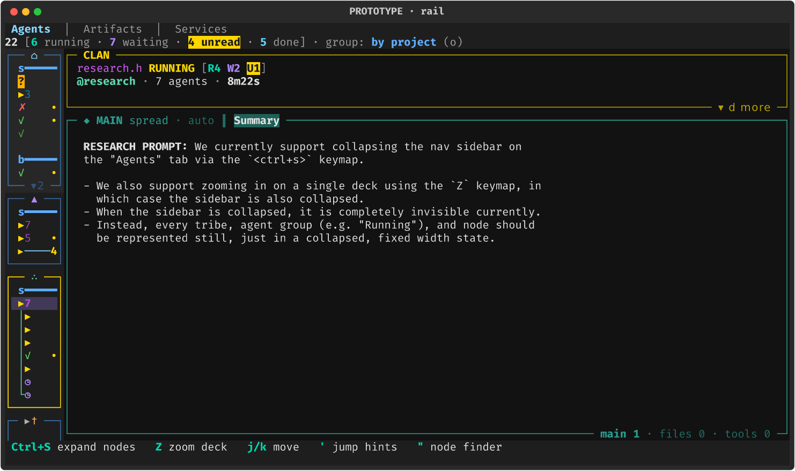
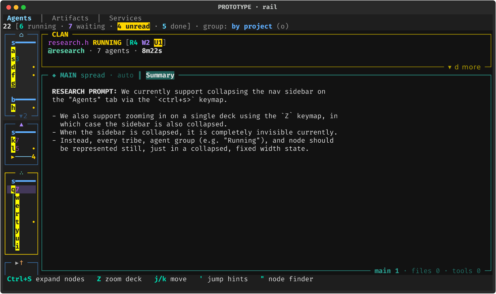
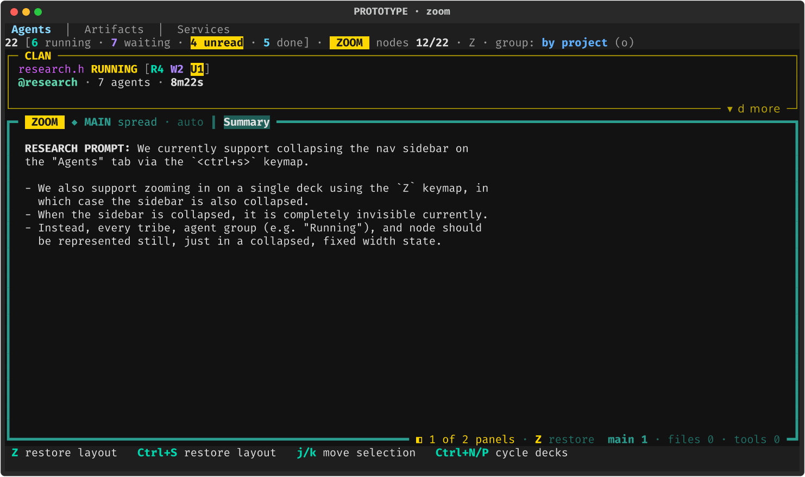

# Agents-Tab Node Rail (`Ctrl+S`) and a Clear Zoom State — Design Research (cld)

**Question.** `Ctrl+S` on the Agents tab collapses the node sidebar to (nearly) nothing,
and `Z` (deck zoom) produces the same look. The proposal: when collapsed with `Ctrl+S`,
the sidebar should still show every tribe, agent group, and node, in a narrow fixed-width
form built from icons. Zoom should keep hiding the sidebar, but should look clearly
different from a collapse. This report checks what exists today, critiques the plan,
adjusts some requirements, and recommends a design and an implementation.

**Short answer.** Build it. Treat the collapsed sidebar as a **node rail**: the same tribe
panels, with the same rows at the same heights, painted as a 9-cell column of glyphs.
Implement it as a **paint-time render mode of the existing `AgentList` widgets**, not as a
new widget. That way the rail cannot drift from the list it summarizes.

Split the current single `nodes_collapsed` flag into two things:

- **Rail preference.** Set by `Ctrl+S` and persisted.
- **Hidden.** Derived from zoom, and never written back to the preference.

Then give zoom its own chrome where the eye already is: a heavy border and a gold `ZOOM`
chip on the zoomed deck panel, plus a "1 of 2 panels · Z restore" hint. Mocks rendered
through sase's own PNG renderer are in [§6](#6-prototype-renders).

---

## 1. What exists today

### 1.1 State and chrome

| Piece | Where | Behavior |
|---|---|---|
| State | `widgets/decks/model.py:147-148` (`DeckAreaState.nodes_collapsed`, `zoom_snapshot`) | One bool covers "node list collapsed". Zoom stores a snapshot of the pre-zoom deck area. |
| `Ctrl+S` | `widgets/decks/layout.py:124` `toggle_nodes_collapsed` | While zoomed it first drops the snapshot (keeping the single zoomed deck), then flips the bool. |
| `Z` | `widgets/decks/layout.py:139-157` `_enter_zoom` | Snapshots the state, forces `layout=SINGLE`, and **forces `nodes_collapsed=True`**. |
| Chrome sync | `widgets/_agent_detail_deck_layout.py:274` `_sync_nodes_collapsed_chrome` | Adds or removes `-nodes-collapsed` on `#agents-content` and shows or hides `#agent-node-spine`. Moves focus off the hidden list. |
| CSS | `styles.tcss:3775-3792` | `-nodes-collapsed` sets `#agent-list-container { display: none }`. The spine is `width: 2`. |
| Spine | `widgets/decks/node_spine.py` | A 2-cell strip: a gold `»` over a dim `│` track, with a proportional gold `┃` thumb. Clicking it expands the list. |
| Info row | `widgets/agent_info_panel.py:453-469` | Collapsed shows `nodes i/N · Ctrl+S`. Zoomed prefixes a bold `zoom · Z`. |
| Persistence | `models/agent_deck_persistence.py` | Stores `nodes_collapsed` and unwraps the zoom, so the pre-zoom value is what gets saved. |

The user says the collapsed sidebar is "completely invisible". That is effectively true.
The spine is 2 dim cells with a small thumb.

The goldens `agents_decks_collapsed_single_120x40.png` and `agents_decks_zoomed_120x40.png`
differ only by the word `zoom · Z` in the info row. I also captured a live `sase screenshot`
of the real TUI. Before and after `Z`, the left edge looks the same.

**Latent bug.** Zoom writes into the same flag that `Ctrl+S` owns, so zoom leaks into the
user's sidebar state. I verified this directly against `widgets/decks/layout.py`:

```
expanded → Z → \        ⇒ nodes_collapsed = True   (sidebar stays collapsed; the user never pressed Ctrl+S)
collapsed → Z → Ctrl+S  ⇒ nodes_collapsed = False, layout = SINGLE  (the pre-zoom split is silently discarded)
```

`test_layout_key_ends_zoom_without_restoring` does not assert on `nodes_collapsed`, so
the leak is not pinned by any test.

### 1.2 How the node panel is built

The node panel is a column (`#agent-list-container`) of **one `AgentList` (a Textual
`OptionList`) per tribe panel**. Each list has a border title of the form
`[hint] ❖/▸ {icon} @tribe · N [chip] ⚙N ⋔N` (`actions/agents/_display_panel_titles.py:128`).
Its options are, in order:

- **Group banners.** Expanded banners are disabled chrome; collapsed banners are selectable
  nav items (`_banner_at_row`).
- **Agent rows.**
- **Blank spacer rows** between L0 groups.

Per-row state lives in parallel maps: `_row_entries`, `_row_render_ctx`,
`_row_tier_styles`, and `_banner_at_row` (`widgets/_agent_list_base.py:85-130`).

**Width.** Each panel publishes a requested width. The column is clamped to 60-130 cells
(`_app_layout.py:47-60`) and set **inline** through `styles.width`
(`actions/agents/_display_panel_layout.py:20-39` and `actions/_event_widgets.py:279`).
**Heights** come from the option counts (`_apply_panel_heights`).

**Row Options are built in only a few places:**

- `_agent_list_build_rows.py:207` and `:322` (agent and banner rows)
- `_agent_list_build_patching.py:251`, `:282`, and `:519` (patch and insert paths)
- the helpers in `_agent_list_widget.py`

Every one of them goes through `cached_format_*` and `assemble_padded_option`.

### 1.3 Icon inventory — the "does every group have an icon?" question

The short answer is **no**. Today's vocabulary:

- **Tribes.** Icons come from config (`default_config.yml:357-376`): `⌂` default, `▲` epic,
  `†` job, `◆` pinned, `◉` review. Each is capped at 4 cells. **User-defined tribes may
  have no icon.** The merged panel shows the text `All agents`.
- **Nodes.**
  - Plain agents have **no glyph**; the row color stands in for one.
  - Clan and session containers have **no glyph**; only the name color differs (clan
    `#D75FFF`, session `#00AFFF`).
  - Non-agent nodes do have glyphs: monitor `⚙`, gate `⋔`, named proc `⚙`, bash/python
    step `❯`, workflow `≡`, Patch `❑`.
  - `🎭 🤖 🚀 🦋 🪐 🐼 🐙 🧪` are **provider** badges, not node types. Each is 2 cells, and
    one row can carry several.
- **Status** is a colored word, e.g. `(RUNNING)`. Glyphs exist only as the status-bucket
  set in `agent/status_buckets.py:18-26`: `▲` Stopped, `◐` Starting, `▶` Running, `…` Queued,
  `⏳` Waiting, `✗` Failed, `✓` Done. They appear **only** in by-status banners, in
  by-machine L1 banners, and in the detail roster.
- **Group banners.** By-status L0 banners carry a bucket glyph. Project, Patch, date,
  machine L0, and name-root banners have **no glyph**, just the text label plus a rule.

**Problems that matter for a rail:**

- **`▲` means three things.** It is the `@epic` tribe icon, the pre-prompt marker, and
  the **"Stopped" bucket**. That bucket is in fact "needs you": QUESTION plus pending plan,
  tale, or epic review (`status_buckets.py:133`). The user-killed `STOPPED` status buckets
  as *Done*.
- **`◆` and `⚙` are overloaded.** `◆` means both the pinned tribe and a bead-linked agent;
  `⚙` means both a monitor and a named proc.
- **`⏳` is 2 cells wide**, while the banner width math uses `len()`. The Waiting banner
  therefore overruns by one cell.
- **Font gaps.** `⧖` and `⧗` have **no glyph** in the bundled Fira Code, DejaVu, or
  Noto Emoji fonts; I checked their cmaps. The existing monitor-timeout `⧖` badge renders
  as tofu in visual snapshots, so the rail must not use either.

---

## 2. Critique: is this a good idea?

**Yes. It is the right pattern, and the current spine is the weakest point of the decks
design.** The sidebar needs three densities, not two:

| Density | Question it answers | Precedent |
|---|---|---|
| Expanded list | "Which agent is which, and what exactly is it doing?" | — |
| **Rail** | "Where is everything, what needs me, where am I?" | VS Code's activity bar, JetBrains tool-window stripes, the Slack/Discord server rail, macOS icon-only sidebars |
| Hidden (zoom) | "Let me read this one thing." | tmux's `Z` zoomed-pane flag (a convention you already use) |

Today the middle density is missing, and zoom and collapse look identical. A rail gives
back about 50 columns to the decks while keeping the two things people actually glance at
the sidebar for: **status at a glance** and **"where is my cursor"**.

That width matters most on narrow terminals. At 80 columns the expanded list takes 60
cells and leaves the decks about 20; the rail leaves them about 70.

**What could go wrong, and how the design below handles it:**

1. **Glyph soup.** A column of mixed emoji, badges, and colors becomes noise.
   *Fix:*
   - one glyph per row;
   - no emoji in the rail;
   - read rows recede (dim), and only running or attention states carry color;
   - unread is a single right-edge dot column.
2. **The rail cannot say *which* agent a row is.** That is inherent to collapsing, and
   that job belongs elsewhere:
   - the identity header always names the selection;
   - hovering a row shows the full expanded row as a tooltip;
   - jump hints and the node finder (`"`) give keyboard access by name.
3. **Drift.** The rail must never disagree with the list, for example by showing a stale
   row or a wrong status after an incremental patch. That rules out a separately
   maintained rail widget (see §2.1).
4. **Performance.** A mode switch must not add work on the hot j/k and refresh paths. A
   render-time projection with a per-Option cache adds none. Runtime ticks stop
   repainting rail rows because the rail does not show runtimes.
5. **Maintenance.** Every future row state has to "decide" its rail glyph. *Fix:* the rail
   derives from the existing status-bucket function plus a small node-kind table, backed
   by an exhaustiveness test.

### 2.1 Approaches considered

| Approach | Verdict |
|---|---|
| **A. Separate `NodeRail` widget** that mirrors the nav stops (a richer `NodeSpine`) | ✗ It would re-implement panel boxes, per-panel heights, scrolling, mouse hit-testing, jump hints, and fold state. Staying row-aligned needs constant syncing, so there are two sources of truth. |
| **B1. Build-time rail Options.** Each `AgentList` emits rail-format Options when in rail mode. | ✓ Workable. Row alignment, nav, scroll, mouse, and hints all come for free. But every build, patch, and insert call site (5+) must honor the mode, as must the render cache, the paint key, and the width math. A future call site that forgets would paint an expanded row into the rail. |
| **B2. Paint-time projection (recommended).** Options stay exactly as built; `AgentList` swaps each Option's *visual* for a rail visual while rail mode is on. | ✓✓ **One choke point.** Build, patch, and insert paths, the render cache, and incremental refresh are untouched, so the rail is correct by construction. A toggle is a cache clear plus a repaint: no option rebuild, and scroll and highlight are preserved. Cost: it overrides `OptionList._get_visual`, a private Textual 8.0.1 hook. `AgentList.install_options` already relies on OptionList internals, so this is a known coupling. Guard it with a test. |
| **C. Just narrow the column** and let the rows clip | ✗ The leftmost cells of today's rows are tree gutters, `[agent]`, and 2-cell emoji. The result looks broken rather than designed. |
| **D. Summary rail**: one icon per tribe with badge counts (Discord-style) | Calm and pretty, but it drops the per-node and per-group rows you asked for, and loses the spatial link to j/k. Worth keeping as a possible *later* ultra-compact density, not as this feature. |

---

## 3. Requirement adjustments (called out explicitly)

1. **"Every node is represented" means every *visible* row, one to one.** The rail
   respects folds exactly as the expanded list does:
   - A folded clan shows as its container row with a member count.
   - A folded group shows as a collapsed banner with a hidden count.
   - A collapsed tribe stays a title-only strip.

   Showing literally every node would break row alignment and fold semantics.
2. **Groups are dividers, not icons.** I recommend *not* inventing per-project, per-date,
   or per-machine icons. A rail banner is a **lead character plus a rule**:
   - the bucket glyph for status groups;
   - the first character of the label for every other group (`s━━━━━` for `sase`);
   - hover for the full label.

   Per-group icons would need new config, would still collide, and add almost nothing
   over initials plus a tooltip.
3. **Zoom must stop writing the `Ctrl+S` state.** `nodes_collapsed` becomes purely the
   user's persisted rail preference. "Hidden" is derived from `is_zoomed(state)`. This
   also fixes the leak in §1.1.
4. **`Ctrl+S` while zoomed exits the zoom exactly like `Z`.** It restores the snapshot,
   and the sidebar returns in the preferred density. Today it keeps the single zoomed deck
   and silently discards a split. After zoom, the sidebar key means "give me my sidebar
   back", not "flip a hidden bit". This **changes the pinned test**
   `test_collapse_key_ends_zoom_then_toggles`.

   Layout keys (`\`, `|`) keep their current end-zoom-without-restore behavior, but the
   sidebar now comes back at the preference instead of staying collapsed.
5. **The 2-cell `NodeSpine` is deleted.** The rail supersedes it. Remove its expand-click
   message and tests, and keep a mouse path to expand (see §4.7).
6. **Zoom is always full-bleed.** No rail and no spine appear while zoomed. The rule to
   teach: *a rail means collapsed; a heavy border with a `ZOOM` chip means zoomed.*
7. **Optional vocabulary alignment (a separate, small follow-up).** Make the expanded
   by-status banners use the rail's glyphs:
   - "Stopped" (needs you): `▲` → the `?` chip;
   - Waiting: `⏳` → `◷`, which also fixes the 2-cell width bug.

   The rail should not depend on this change.

---

## 4. Design

### 4.1 Principles

- **Position = identity.** Rail row *k* is expanded row *k*, at the same y and the same
  scroll offset. Toggling `Ctrl+S` changes only the width; your eye never has to hunt for
  where your row went.
- **Shape = kind or status.** Every row has exactly one 1-cell glyph.
- **Color = urgency.**
  - Done and read rows are dim.
  - Running is gold.
  - Failed is red.
  - "Needs you" is the only reverse-video chip.
- **Right edge = unread.** A single aligned column of gold `•` dots, so scanning down the
  edge answers "what finished while I was away?".
- **Calm by default.** No emoji and no runtimes in the rail. Banners and spacer rows keep
  the list's vertical rhythm, so the rail reads like a minimap of the list.

### 4.2 Sidebar state model

```
SidebarMode = HIDDEN    if is_zoomed(state)
            | RAIL      if state.nodes_collapsed      (persisted preference)
            | EXPANDED  otherwise
```

| From | `Ctrl+S` | `Z` (deck) | `\` / `\|` layout key |
|---|---|---|---|
| EXPANDED | → RAIL (preference saved) | → HIDDEN (zoom) | split as usual |
| RAIL | → EXPANDED | → HIDDEN (zoom) | split as usual; rail stays |
| HIDDEN, zoomed from X | **exit zoom, restore snapshot → X** *(changed)* | exit zoom → X | end zoom (no restore) → preference X |

`_enter_zoom` no longer sets `nodes_collapsed=True`. `_sync_nodes_collapsed_chrome`
becomes `_sync_sidebar_chrome(mode)` and toggles the classes `-nodes-rail` and
`-nodes-hidden` on `#agents-content`. Persistence is unchanged: schema v1's
`nodes_collapsed` now simply means "rail", so existing saved files load correctly with no
migration.

### 4.3 Rail anatomy

**Width: 9 cells** = border 2 + selection gutter 1 + content 6. There is no scrollbar;
overflow is shown in the border instead (§4.6).

A width of 8 also works if container counts cap at `9`. I recommend 9 for breathing room
and two-digit counts.

```
content cell:   0        1        2   3   4   5
node, depth 0:  glyph    count    count        pip
node, depth 1:  guide    glyph    count count      pip
node, depth 2:  guide    guide    glyph count count pip
banner:         lead     ━━━━━━━━━━━━━━━━━━━━ (hidden count when folded, gold)
spacer:         (blank — preserved)
```

- **Selection.** Unchanged: the existing highlight background plus the thick left bar,
  which lives in the selection gutter.
- **Tree guides.** `│`, and `└` on the last child, in the same tier colors the expanded
  view uses. Depth is clamped at 2, which covers clan → member → step.
- **Containers.** A clan or session row shows its aggregate status glyph followed by its
  member count, colored by container kind: clan `#D75FFF`, session `#00AFFF`. A folded
  container is identified by the count plus the absence of child rows below it.

### 4.4 Glyph vocabulary (new module, single source)

Every glyph below is 1 cell wide and present in the bundled Fira Code or DejaVu fonts,
which I verified against their cmaps. Most are already used in the codebase.

| Row | Glyph | Style |
|---|---|---|
| Needs you (bucket "Stopped": QUESTION, plan/tale/epic review) | `?` | **bold `#1a1a1a` on `#FFAF00`**, the only reverse chip |
| Failed | `✗` | bold `#FF5F5F` |
| Running (incl. ANSWERED, active hand-offs) | `▶` | bold `#FFD700` |
| Starting | `◐` | bold `#87D7FF` |
| Queued | `○` | bold `#5F87FF` (the bucket glyph `…` is invisible at 1 cell) |
| Waiting | `◷` | bold `#AF87FF` (`⏳` is 2 cells; `⧗` is missing from the fonts) |
| Done, unread | `✓` | `#5FD75F` + a gold `•` pip |
| Done, read | `✓` | dim `#5FD75F` |
| User-stopped (`STOPPED`) | `Ø` | `#8787AF` (the existing row glyph) |
| Monitor / named proc | `⚙` | existing state colors (`#FFAF5F` / `#5FD7FF`; settled `#9E9E9E`) |
| Gate turn | `⋔` | existing gate accent; settled `#9E9E9E`, failed `#FF5F5F` |
| Workflow step | `❯` | bash `#FFAF5F`, python `#87D787` |
| Workflow / Patch row | `≡` / `❑` | existing type colors |
| Jump hint active | the hint letter | bold `#1a1a1a` on `#FFFF00`; replaces the glyph cell while hints are up |
| Marked (`m`) | `▪` in the pip column | bold `#00D700`; wins over the unread pip |

**Glyph precedence:** hint > node-kind glyph (for non-agent kinds) > status-bucket glyph.

Everything else is dropped from the rail, because the identity header and tooltip carry
it: provider emoji, `⚡`, `◌`, `↻`, `↺`, `✏️`, the bead `◆`, machine and owner chips, and
runtimes.

### 4.5 Group banners in the rail

| Grouping | L0 lead | L1 and below |
|---|---|---|
| by project | project initial, bold `#5FAFFF`, heavy `━` rule (`·` for "(no project)") | Patch: thin `─` rule, no lead |
| by status | the bucket glyph from §4.4 in its color (`?` chip for "needs you") | — |
| by date | first letter (`T`oday, `Y`esterday, `W`eek, `E`arlier) | thin rule |
| by machine | alias initial (`h` for here) | bucket glyph, thin rule |
| name-root | — | thin rule |

A **collapsed** banner (a selectable nav item) renders as `▸` + lead + rule + the hidden
count in gold, e.g. `▸s━━12`. Hovering any banner shows its full label and summary text.

### 4.6 Tribe panel chrome in the rail

- **Title**, centered, 1-4 cells:
  - `[hint]` when panel jump hints are up;
  - `❖` for whole-panel focus, or `▸` when the panel is collapsed;
  - then the tribe icon. A tribe with no icon falls back to its **bold first letter in the
    tribe color**, like an avatar initial. The merged panel shows `All`.
- **Collapsed tribes carry urgency.** A collapsed panel's rows are hidden, so its title
  gains the most urgent mark inside it: the `?` chip, else a red `✗`, else a gold `•`.
- **Borders.** The existing focused-panel gold border and the whole-panel heavy gold
  outline work unchanged.
- **Overflow cue.** The bottom border subtitle shows `▴3 ▾2` (rows above and below the
  viewport). This replaces the scrollbar, which the rail cannot afford.
- **Heights.** Panel heights and the 1-row gaps between panels stay exactly as in
  expanded mode, because rows are one to one.

### 4.7 Interaction

- **Keyboard.** Nothing changes:
  - j/k, `h`/`l` fold navigation, `'` jump hints, `"` node finder, and marks all work,
    because the underlying `AgentList` options and nav stops are unchanged.
  - Focus can stay on the list in rail mode; only HIDDEN needs `_move_focus_off_hidden_list`.
- **Mouse.**
  - Clicking a rail row selects that node, as in the expanded list.
  - Clicking a tribe title selects the panel.
  - The wheel scrolls.
- **Hover to peek.** Hovering a rail row sets the tooltip to *the expanded row itself*.
  Format it on demand from the row's stored `_row_render_ctx` through the existing
  `format_agent_option` / `format_banner_option` functions.
- **Expand affordance.** The info row keeps a chip. Make it clickable to run the
  toggle action:
  - rail: `nodes 12/22 · Ctrl+S`;
  - zoom: `ZOOM · nodes 12/22 · Z`.
- **No animation.** An animated width change would re-flow the deck spreads every frame,
  which is expensive and against `tui_perf` rule 7. Switch instantly.

### 4.8 Zoom chrome

Zoom is always a single panel, so its title bar has room to say so:

- **The zoomed deck panel's border becomes `heavy`**, in its own accent color. This is an
  ambient cue that the panel is "lifted", and it costs no layout because the width is
  unchanged.
- **A reverse gold `ZOOM` chip** leads the deck title. `deck_title()`
  (`widgets/decks/titles.py:165`) must get a correspondingly smaller budget.
- **A restore hint in the bottom border:**
  - `◧ 1 of 2 panels · Z restore` when the zoom came from a split. The half-square
    glyph (`◧ ◨ ⬒ ⬓`) shows which half of the split you are in.
  - `Z restore` when the zoom came from a single panel.
- **The info-row chip** switches from the bold word `zoom` to the same reverse `ZOOM`
  chip, and stays clickable.
- **The footer** lists `Z restore layout` first while zoomed.
- **No rail and no spine.** The left edge is flush, so the two states can never be
  confused.

Tribe-panel isolation, which is also bound to `Z` when a *panel* is selected, is a
different feature and must not get this chrome.

---

## 5. Implementation plan (recommended: approach B2)

**Phase 1 — state model** (`widgets/decks/layout.py`, `widgets/_agent_detail_deck_layout.py`)

- `_enter_zoom` stops setting `nodes_collapsed`.
- `toggle_nodes_collapsed` becomes: if zoomed, `_exit_zoom(state)`; else flip the
  preference.
- Add a `sidebar_mode(state)` helper and `_sync_sidebar_chrome`.
- Update `test_deck_collapse_zoom.py`: the two zoom tests that assert
  `zoomed.nodes_collapsed is True`, and the `Ctrl+S`-in-zoom test. Add tests for the leak
  (`expanded → Z → \` keeps EXPANDED) and for a persistence round trip.

**Phase 2 — rail vocabulary** (new `widgets/_agent_list_render_rail.py`, pure functions)

- `rail_node_visual(agent, ctx, tier_styles, rail_width)`,
  `rail_banner_visual(group, grouping_mode, ...)`, and `rail_panel_title(...)`.
- Exhaustiveness tests:
  - every status the Rust/Python layers can emit, and every bucket override, maps to a
    1-cell glyph;
  - every row type and every `GroupingMode` produces text whose `cell_len` equals the
    rail content width.
- Record every banner's `GroupRow` per row. Today `_banner_at_row` holds only
  *collapsed* banners, so expanded-banner labels are not recoverable at paint time. Add a
  `_group_at_row` map in the same build and patch paths that fill `_banner_at_row`.

**Phase 3 — paint-time projection in `AgentList`**

- `AgentList.set_rail(enabled: bool)` stores the flag, calls `_clear_caches()`, then
  `refresh()`.
- Override `_get_visual(option)`:
  - when rail mode is off, use `super()`;
  - otherwise map `option → index` via `_option_to_index`, then read `_row_entries`,
    `_agents`, `_row_render_ctx`, and `_group_at_row`;
  - build the rail visual, cached in a per-widget dict keyed by the Option (patches
    replace Options, so invalidation is automatic), cleared on toggle and in
    `_clear_caches`.
- Add a guard test that fails loudly if Textual stops routing option rendering through
  `_get_visual`, for example after a version bump.
- CSS under `#agents-content.-nodes-rail`:
  - `#agent-list-container { width: 9 }`;
  - `AgentList { padding: 0; scrollbar-size-vertical: 0; scrollbar-gutter: auto; border-title-align: center }`;
  - option padding `0 0 0 1`;
  - the highlighted option keeps `border-left: thick` with `padding: 0`.
- **Width gotcha.** The column width is set **inline** by
  `_settle_agent_list_container_width` and `on_agent_list_width_changed`, and inline
  styles beat CSS. Both must defer to the rail (set 9, or no-op) while in rail mode, and
  re-settle the negotiated width on expand. `AgentList.WidthChanged` can keep firing;
  the handler just ignores it in rail mode.
- **Titles.** `agent_panel_border_title` gains a `rail=True` variant, and titles are
  repainted on toggle. They are cheap, one per tribe. Add the rail flag to
  `panel_paint_key` so `_panel_content_is_unchanged` cannot skip that repaint.

**Phase 4 — chrome polish**

- Collapsed-tribe urgency marks and the `▴N ▾N` overflow subtitle.
- Hover tooltips: override `_on_mouse_move`, call `super()`, then set `tooltip` from
  `_mouse_hovering_over`.
- A clickable info-row chip.
- Delete `NodeSpine`, `on_node_spine_expand_requested`, the `#agent-node-spine` CSS, and
  their tests. Run `just symvision` afterwards.

**Phase 5 — zoom chrome**

- Heavy border via a `-zoomed` class on the focused `DeckPanel`.
- The `ZOOM` chip in `deck_title` and the restore hint in the deck subtitle
  (`widgets/decks/panel_chrome.py`).
- The info-row chip restyle and footer ordering.

**Phase 6 — goldens, docs, memory**

- New PNG goldens:
  - rail, grouped by project, by status, and by machine;
  - rail with a clan expanded to depth 2;
  - rail with jump hints;
  - rail with collapsed tribes carrying urgency, and with whole-panel focus;
  - an 80×24 narrow terminal;
  - zoom from single and zoom from split.
- Regenerate `agents_decks_collapsed_single/split` and `agents_decks_zoomed`.
- Update the help modal (`modals/help_modal/agents_bindings.py`), the keymap metadata and
  command-palette text ("Collapse/Expand Node Panel" → "Toggle node rail"), and docs.
  `default_config.yml` needs **no** new keys; the `ctrl+s` and `Z` bindings are unchanged.
- The glossary strand **Node Panel** still describes "a slim node spine" and must be
  rewritten. Do that through the `/sase_memory_write` flow, not by editing the file.

**Performance checks** (per `tui_perf`):

- `SASE_TUI_PERF=1` j/k p95 under 16 ms in rail mode.
- A trace span on the toggle, targeting under 1 frame at 200 rows. There is no option
  rebuild, only a line-cache clear.
- Confirm that 1 Hz runtime ticks on running rows no longer repaint rail rows. Patched
  Options that carry the same rail inputs should hit the rail cache.

**Boundary check.** This is presentation only: glyph choice, layout, and Textual chrome.
The status-bucket semantics it reads already exist. Nothing here belongs in `sase-core`.

---

## 6. Prototype renders

These are rendered with a standalone Textual mock (`agents_node_rail_and_zoom_chrome__cld_proto.py`,
next to this report) through `sase.ace.tui.visual_render.render_svg_to_png`, using the same
bundled fonts as the goldens. They are **mocks**: the colors and rows approximate the real
renderer. They are not SASE output.

**Expanded (for reference):** the same data as the rail below.



**Rail (`Ctrl+S`).** Every row sits at the same y as in the expanded view:

- the `?` chip marks the agent waiting on you;
- red `✗` marks a failure;
- dots on the right are unread;
- `▶7` is a running clan of 7 members;
- a clan's members hang off a tier-colored guide;
- `▸s━━4`-style rows are folded groups;
- `▸†` is the collapsed `@job` tribe.



**Rail with jump hints (`'`).** Hint letters take over the glyph cell, easymotion-style.



**Zoom (`Z`).** Full-bleed, with a heavy border, a `ZOOM` chip in the deck title, and the
`◧ 1 of 2 panels · Z restore` hint in the bottom border.



---

## 7. Risks and open questions

- **Private Textual hook.** `_get_visual` is private. Mitigations: the guard test, and the
  existing precedent in `install_options`. If it ever breaks, B1 (build-time rail Options)
  is the fallback. The pure vocabulary module from Phase 2 is shared by both approaches,
  so that work is not lost.
- **Terminal glyph rendering.** Everything chosen is 1 cell in Rich's `cell_len` and
  present in the bundled fonts. Real terminals with exotic fonts may still draw `◷` or `⋔`
  poorly. Most of these glyphs already ship elsewhere in the TUI.
- **By-status grouping is redundant in the rail.** Every row under `▶` is `▶`. That is
  fine; the rail still carries unread dots, counts, and position, and it shines in
  by-project mode, where statuses mix.
- **Decision for you.** Should `Ctrl+S` while zoomed restore the pre-zoom split, as
  recommended in §3.4, or keep today's "stay single and show the sidebar"? I recommend
  restoring, because silently losing a split is a trap. Only this behavior and one pinned
  test hinge on the choice.
- **Possible follow-up (not in scope).** Make the rail the automatic default when the
  terminal is narrower than about 100 columns, where the expanded 60-cell minimum starves
  the decks.

---

## 8. Recommended solution

1. **Model.**
   - Keep `nodes_collapsed` as the persisted `Ctrl+S` preference only.
   - Derive `SidebarMode = HIDDEN (zoomed) | RAIL | EXPANDED`, and stop zoom from writing
     the preference. This fixes the `Z → \` leak.
   - Make `Ctrl+S` while zoomed exit the zoom exactly like `Z`.
2. **Rail.**
   - Replace the 2-cell `NodeSpine` with a **9-cell node rail** built from the **same
     tribe panels, the same rows, and the same heights**, so there is one row per visible
     row and toggling moves nothing vertically.
   - Each node row gets **one glyph**, taken from a single rail vocabulary: the
     status-bucket glyphs, with `?` as the reverse "needs you" chip, `◷` for waiting,
     `○` for queued, and node-kind glyphs for monitors, gates, procs, and steps.
   - Containers get a member count.
   - Unread gets a right-edge gold dot.
   - Banners get lead characters plus rules.
   - Tribe titles show the icon, with an initial as fallback, plus urgency marks when
     the tribe is collapsed.
3. **Mechanism.**
   - Implement the rail as a **paint-time projection inside `AgentList`**, overriding
     `_get_visual` behind an `AgentList.set_rail()` toggle. Every build, patch, and
     insert path, and every cache and incremental refresh, stays untouched.
   - Store banner `GroupRow`s per row.
   - Make the inline column-width setters defer to the rail.
4. **Zoom.**
   - Always full-bleed.
   - The zoomed deck panel gets a heavy border, a reverse gold `ZOOM` title chip, and a
     `◧ 1 of 2 panels · Z restore` hint.
   - The info-row chip matches and is clickable.
5. **Ship it with:**
   - exhaustiveness tests for the vocabulary;
   - state-transition tests, including the leak;
   - a Textual hook guard test;
   - rail and zoom PNG goldens (project, status, and machine grouping; depth; hints;
     collapsed tribes; 80×24);
   - the help, palette, and docs updates;
   - a Node Panel glossary rewrite through the memory-write flow.
6. **Optional follow-ups:**
   - move the expanded by-status banners onto the same vocabulary (`▲`→`?`, `⏳`→`◷`);
   - an auto-rail on narrow terminals.
