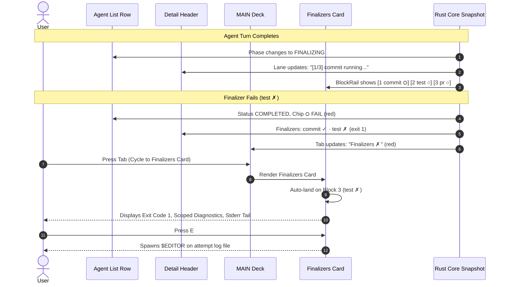
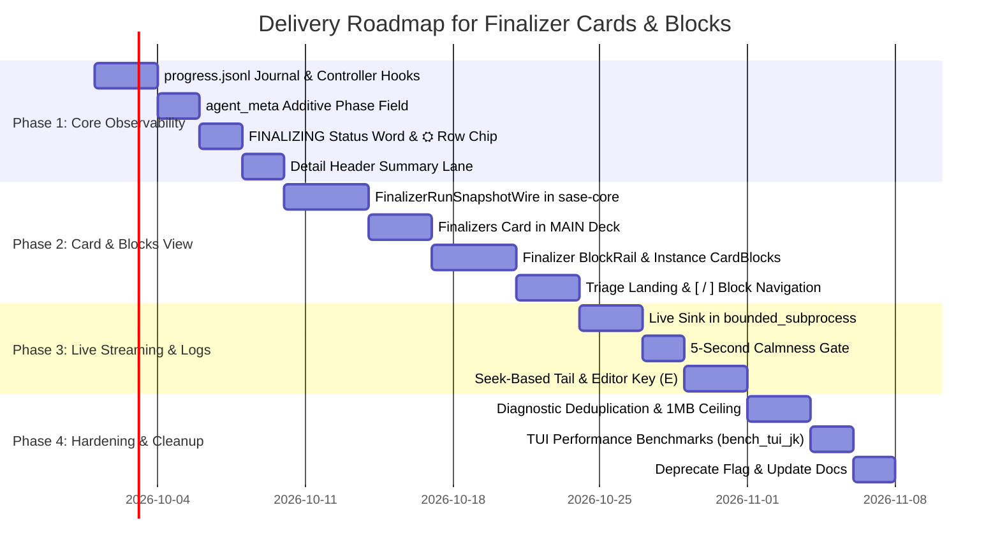

# SASE Agents Tab: Architecture and Visual Design for Finalizers via Decks, Cards, and Card Blocks

**Date:** 2026-09-25  
**Researcher:** gem (`research.a.gem`)  
**Context:** Independent investigation into representing SASE host-owned finalizers on the "Agents" tab, evaluating the roles of Decks, Cards, and upcoming Card Blocks for arbitrary multi-finalizer pipelines.  
**Related Prior Artifacts:**  
- `research:202609/agents_tab_finalizer_panel/agents_tab_finalizer_panel.md` (initial observability study, 2026-09-10)  
- `research:202609/agent_data_card_blocks/agent_data_card_blocks.md` (card blocks architecture, 2026-09-15)  
- `decisions:host-owned-completion` (completion is host-owned, single-turn invariant)  
- `decisions:rust-core-required` (reconciliation and domain projections belong in `sase-core`)  

---

## 1. Executive Summary & Recommended Solution

SASE's execution model draws a fundamental distinction between the agent turn (the LLM's non-deterministic deliberation and tool calls) and completion (deterministic host-owned finalizers executing verification, repository mutation, and dispatch). Currently, the "Agents" tab reflects **zero** information about finalizers. For up to several minutes (23.9% of runs exceed 30 seconds; 13.4% exceed 5 minutes), the agent row displays an ambiguous `RUNNING` status while the host executes pre-commit hooks, conflict repairs, or test suites. Furthermore, when failures occur (6.7% of runs across 16+ distinct diagnostic codes), the agent row simply falls silent or marks an uninformative exit.

With the recent introduction of the **Decks and Cards** layout and the upcoming **Card Blocks** architecture (`Deck -> Card -> Card Blocks`), we now have the exact structural primitives needed to make finalizers first-class, beautiful, and effortless to troubleshoot without cluttering the UI.

### The Recommendation in Brief: "The Dedicated Completion Card with Pipeline Card Blocks"

1. **Decks:** **Do NOT create a 4th Deck (`DeckId.FINALIZERS`).**  
   Decks (`MAIN`, `FILES`, `TOOLS`) represent orthogonal *facets* of the entire agent session (discourse, workspace diffs, tool telemetry) that exist continuously. A finalizer is a lifecycle phase occurring only at completion. Adding a 4th deck hides failures in single-panel mode (out-of-sight hazard) and breaks conversational context.

2. **Cards:** **Add a dedicated `Finalizers` Card to the `MAIN` Deck (`context`, `reply`, `finalizers`).**  
   - Visible in the `MAIN` title strip: `◆ MAIN ┃ Context │ Reply │ Finalizers` (omitted if no finalizers planned).
   - In `SPREAD` mode (default for concise documents), the agent run reads as a complete chronological narrative: **Prompt (`Context`) → Work (`Reply`) → Verification & Output (`Finalizers`)**.
   - In `PAGED` mode, switching cards is a single `Tab` or click, giving finalizers the full height and width needed for deep diagnostic inspection without fighting the prompt or reply for vertical space.
   - Active status pill in the card tab: `Finalizers ⛭` (running/yellow), `Finalizers ✓` (green), or `Finalizers ✗` (accent red), providing instant discovery.

3. **Card Blocks:** **Model each Finalizer Instance as a Card Block within the `Finalizers` Card.**  
   - An agent run executes a pipeline of finalizer instances (`commit`, `check`, `pr`, `notify`). Each instance becomes a non-nesting **Card Block** (`CardBlock`).
   - A dedicated **Finalizer BlockRail** renders at the top of the card:  
     `[ 1 commit ✓ ]  [ 2 lint ✓ ]  [ 3 test ✗ ]  [ 4 pr ○ ]`  
     matching the session timeline language (numbers, labels, glyphs, status colors).
   - **Triage-First Navigation (`[` / `]`):** When entering the `Finalizers` card on failure, the view **lands automatically on the first failed block** (`3 test ✗`), bypassing successful steps. The user immediately sees the failure reason, exit code, and error tail. Pressing `[` steps backward to inspect earlier successes; pressing `]` inspects skipped/blocked steps.
   - **Block Spread vs Block Paged:** If finalizer outputs are short (e.g. only `commit`), blocks spread inline. If any instance emits lengthy output (e.g. a failing test suite), the card pages the blocks one instance at a time with a seek-based log tail.

4. **Row & Header Observability:**  
   - Agent row status transitions: `RUNNING` → `FINALIZING` (with elapsed time ticker).
   - Agent row chip: distinct `⛭` chip on non-success only (silent on 93% success).
   - Detail Header Summary: a dedicated `finalizers` lane (`Finalizers: commit (7a2b9c) ✓ · test ✗`), ensuring status is immediately visible even when the user is focused on `Reply` or `FILES`.

---

## 2. Context & The Core Problem

### 2.1 The Two Invisible Gaps

The initial investigation (`agents_tab_finalizer_panel.md`) revealed two core gaps in the host execution pipeline:

1. **The Invisible Minutes (Live State Gap):**  
   In 23.9% of historical finalizer runs, wall-time exceeds 30 seconds; in 13.4%, it exceeds 5 minutes (due to pre-commit linting, tests, and LLM-assisted conflict repairs via `commit_repair.py`). During this window, the controller runs synchronously inside the agent worker process, keeping attempt numbers, timers, and streaming outputs in local Python variables. In the TUI, the agent row remains frozen on `RUNNING`, indistinguishable from a stalled model.

2. **The Mute Failures (Diagnostic Gap):**  
   Historically, 6.7% of runs fail or refuse across 16 distinct diagnostic codes (e.g., `stitch_failed`, `dirty_after_commit_decisions`, `commit_refused`, `controller_exception`, `plan_integrity_failed`). These failures are fully recorded on disk in `finalizer_result.json` and attempt log files, but the Agents tab reads none of them.

### 2.2 Why We Must Not Overfit to `builtin@commit`

Historically, almost all finalizer runs on the host were the single `builtin@commit` instance. However, SASE's architecture supports arbitrary configured and plugin finalizers:
- `builtin@commit`: Git/stitch mutation, hook execution, conflict repair, declaration publishing.
- `builtin@command`: Arbitrary commands (e.g., `cargo check`, `ruff check`, `pytest`, `npm test`, benchmarks).
- `plugin@github`: Pull request creation/updating, PR comments, draft status toggles.
- `plugin@telegram` / notification: Dispatching structured reports or webhook alerts.
- Workspace cleanup / artifact archival: Scrubbing scratch files, syncing state.

A finalizer pipeline is a directed acyclic graph (DAG) executed in bounded cycles to reach a fixed point. A design that hardcodes commit SHAs, git diffs, or stitch hooks will immediately break down when a pipeline contains `commit -> test -> push -> notify`. The UI model must treat each finalizer instance as a distinct, first-class execution unit.

---

## 3. Structural Evaluation: Decks vs Cards vs Card Blocks

SASE's TUI is organized into a strict three-tier hierarchy:
```
DECK (Spatial Facet) -> CARD (Semantic Document) -> CARD BLOCKS (Sub-Unit Entities)
```
Where do finalizers belong in this hierarchy? Let us evaluate each level critically.

```mermaid
flowchart TD
    subgraph Decks ["1. Decks (Spatial Modality)"]
        D1["MAIN (Discourse)"]
        D2["FILES (Workspace Diffs)"]
        D3["TOOLS (Call Telemetry)"]
        D4["FINALIZERS (4th Deck?) - REJECTED"]
    end

    subgraph Cards ["2. Cards in MAIN (Semantic Documents)"]
        C1["Context (Task & Prompt)"]
        C2["Reply (Agent Reasoning & Shells)"]
        C3["Finalizers (Host Completion Pipeline) - RECOMMENDED"]
    end

    subgraph Blocks ["3. Card Blocks (Concrete Sub-Units)"]
        B1["Block 1: commit (builtin@commit) ✓"]
        B2["Block 2: lint (builtin@command) ✓"]
        B3["Block 3: test (builtin@command) ✗"]
        B4["Block 4: pr (plugin@github) ○"]
    end

    D1 --> C1
    D1 --> C2
    D1 --> C3
    C3 --> B1
    C3 --> B2
    C3 --> B3
    C3 --> B4

    style D4 fill:#552222,stroke:#ff6666,stroke-width:1px,stroke-dasharray: 5 5
    style C3 fill:#1e3d2f,stroke:#44bb77,stroke-width:2px
    style Blocks fill:#1a2333,stroke:#6699ff,stroke-width:1px
```



### 3.1 Level 1: Decks (`DeckId`) — Why a 4th Deck is the Wrong Abstraction

One conceivable proposal is to add `DeckId.FINALIZERS` to `DECK_CYCLE = (MAIN, FILES, TOOLS)`.

| Evaluation Criterion | Standalone Finalizers Deck | Analysis & Verdict |
|---|---|---|
| **Lifecycle Match** | Poor | `FILES` and `TOOLS` accumulate state throughout the agent's lifetime. Finalizers exist only for the final seconds/minutes. A 4th deck sits empty/dormant for 95%+ of an agent's run. |
| **Discoverability** | Very Poor | In single-panel layout (the default for most terminal sizes), deck switching requires explicit keypresses (`m`, `f`, `t`, `z`). If a finalizer fails quietly, users on `MAIN` will completely miss it. |
| **Cognitive Weight** | Heavy | Decks represent complete views of the world. Adding a 4th deck for a short completion phase bloats the top-level deck cycle and complicates deck-split shortcuts. |
| **Split Layout Utility** | Moderate | The only benefit of a deck is opening `MAIN` on the left and `FINALIZERS` on the right via `toggle_deck_split`. However, SASE already supports splitting `MAIN` with `MAIN` across different preferred cards! |

**Conclusion:** Finalizers do not possess the longevity, independence, or ubiquity required to be a Deck. They are a phase of the agent's lifecycle, not an orthogonal modality of the entire session.

### 3.2 Level 2: Cards (`CardPart`) — Why a Dedicated Card in `MAIN` is the Optimal Home

Within the `MAIN` deck, documents are structured into cards: `Context` (the setup), `Reply` (the deliberation/response), and `Summary` (for clans/tribes).

Adding a **`Finalizers` Card** (`card_id="finalizers"`, title `"Finalizers"`) provides exceptional architectural alignment:

1. **Natural Narrative Flow in Spread Mode:**  
   In SASE's `SPREAD` mode (when content fits on screen), the document flows top-to-bottom:
   - What the agent was asked to do (`Context`)
   - What the agent thought and produced (`Reply`)
   - What the host did to verify, commit, and finalize (`Finalizers`)  
   The user simply scrolls to the bottom to see the full outcome of the run.

2. **Immediate Visibility in Paged Mode:**  
   The card tab is visible directly in the `MAIN` deck border:  
   `◆ MAIN ┃ Context │ Reply │ Finalizers`  
   When finalizers are running, the tab shows `Finalizers ⛭`. When they fail, it displays `Finalizers ✗` with red accent styling. The user cannot miss the failure.

3. **Dedicated Canvas for Diagnostics & Logs:**  
   Unlike an accordion fold section squeezed into the footer of `Reply` or `Context`, a dedicated card owns the entire viewport. It can render multi-instance DAGs, attempt histories, diff summaries, and terminal log tails without truncation or cramped layouts.

4. **Preserves `decisions:host-owned-completion`:**  
   Conflating finalizers into the `Reply` card implies that finalizer output is part of the agent's LLM response. Placing finalizers in their own Card reinforces the boundary: `Reply` is agent-owned; `Finalizers` is host-owned.

### 3.3 Level 3: Card Blocks (`CardBlock`) — The Engine for Arbitrary Pipelines

The upcoming Card Blocks feature introduces non-nesting blocks within a card, navigable via `[` and `]`, accompanied by a one-row `BlockRail` (`agent_data_card_blocks.md`).

This is the exact abstraction needed for multi-finalizer pipelines.

#### How Finalizer Card Blocks Work
Consider a project configured with four finalizers:
1. `commit` (`builtin@commit`): Creates git commit, runs hooks, handles conflict recovery.
2. `lint` (`builtin@command`): Runs `ruff check .`.
3. `test` (`builtin@command`): Runs `pytest -q tests/fast`.
4. `pr` (`plugin@github`): Pushes branch and updates PR.

Within the `Finalizers` Card:
- Each instance (`commit`, `lint`, `test`, `pr`) is wrapped as a `CardBlock` with `block_id = instance_id`.
- The card header features a **Finalizer BlockRail**:
  ```text
  [ 1 commit ✓ ]  [ 2 lint ✓ ]  [ 3 test ✗ ]  [ 4 pr ○ ]
  ```
- **Rail Status Language:**
  - `✓` (green): Instance succeeded.
  - `✗` (red): Instance failed.
  - `⛭` (pulsing/yellow): Instance is actively running.
  - `○` (dim): Not run (blocked by an earlier failure in the dependency chain).
  - `⊘` (amber): Refused (policy check or missing prerequisites).
  - `⇥` (dim cyan): Deferred (e.g. delegated to another phase).
  - `·` (dim): Not triggered (e.g. `commit` on a clean working tree).

#### Triage-First Navigation Loop
When an agent completes with a failed finalizer:
1. The user presses `Tab` to navigate to the `Finalizers` card (or clicks the `Finalizers ✗` tab).
2. **Intelligent Landing:** The card lands **directly on the first failed block** (`3 test ✗`)!
3. The focused block immediately displays:
   - The failing command and exit code (`exit 101`).
   - Scoped failure diagnostics (e.g., `AssertionError in tests/fast/test_auth.py:42`).
   - The tail of stdout/stderr with syntax highlighting.
4. **Keystroke Triage:**
   - Press **`[`**: Steps backward to `2 lint ✓` to see what succeeded prior to the failure.
   - Press **`]`**: Steps forward to `4 pr ○` to see why subsequent steps were blocked.
   - Press **`E`**: Opens the current block's complete execution log in `$EDITOR`.
   - Press **`V`**: Opens the full-screen log modal with follow/pause capabilities.



---

## 4. UI Layout & Visual Presentation

### 4.1 Agent List Row Representation (Left Panel)

The left-hand agent list roster must communicate finalizer status at zero performance overhead:

1. **Active Phase (`FINALIZING`):**  
   When the LLM turn ends and the host controller begins, the agent status word shifts from `RUNNING` to `FINALIZING` in bold yellow:
   ```text
   ● 16  feature-auth  FINALIZING 14s  Lead Engineer
   ```
   This immediately kills the "invisible minutes": the user knows the model is done and host verification is underway.

2. **Terminal Non-Success Chip (`⛭`):**  
   - In 93% of runs, all finalizers succeed. **Silence is the reward**: the row renders normally with no extra glyphs.
   - If any finalizer fails or is refused, a distinct `⛭` chip is appended to the status:
     ```text
     ✓ 16  feature-auth  COMPLETED ⛭  Lead Engineer   (red ⛭ on failure)
     ! 16  feature-auth  COMPLETED ⛭  Lead Engineer   (amber ⛭ on refusal)
     ```

### 4.2 Detail Header Summary Lane

The detail header summary (`_agent_display_header_summary.py`) aggregates key metadata at the top of the detail panel. Adding a `finalizers` lane ensures instant awareness across all decks:

```text
Associated: plan:202609/auth_flow.md · phase:impl
Finalizers: commit (9e3a1f) ✓ 1.4s · check ✓ 8.2s · pr (PR #412) ✓ 2.1s
```
On failure:
```text
Finalizers: commit (9e3a1f) ✓ 1.4s · check ✗ (exit 101, 14s) · pr ○ (blocked)
```
This lane renders from the cached snapshot off-thread, obeying the existing per-lane cadence machinery.

### 4.3 The `Finalizers` Card Design

Below is a concrete ASCII layout of the `Finalizers` Card in paged mode:

```text
╭─ ◆ MAIN ───────────────────────────────────────────────────────────── [1.5x] ─╮
│ Context │ Reply │ Finalizers ✗                                                │
│                                                                               │
│ ┌─ RAIL ────────────────────────────────────────────────────────────────────┐ │
│ │  1 commit ✓ 1.4s  │  2 lint ✓ 3.1s  │ [3 test ✗ 42s] │  4 pr ○ (blocked)  │ │
│ └───────────────────────────────────────────────────────────────────────────┘ │
│                                                                               │
│ ── INSTANCE: test (builtin@command) ────────────────────── ATTEMPT 1/1 ────── │
│ Status:      FAILED (exit code 101)                Duration: 42.1s            │
│ Command:     pytest -q tests/unit tests/fast                                  │
│ Trigger:     on_success                            After:    [commit, lint]   │
│                                                                               │
│ ── DIAGNOSTICS ────────────────────────────────────────────────────────────── │
│ ✖ test_failed: 2 tests failed, 48 passed, 1 error                             │
│   tests/unit/test_tokens.py:84: AssertionError: expected 200, got 401         │
│   tests/fast/test_crypto.py:12: ModuleNotFoundError: No module named 'curve'  │
│                                                                               │
│ ── TERMINAL OUTPUT (tail 16 lines) ────────────────────────── [E: Open Log] ─ │
│ _________________________________ test_token_auth __________________________ │
│     def test_token_auth():                                                    │
│         client = Client()                                                     │
│ >       response = client.get("/auth")                                        │
│ E       assert response.status_code == 200                                   │
│ E       AssertionError: assert 401 == 200                                     │
│                                                                               │
│ tests/unit/test_tokens.py:84: AssertionError                                  │
│ =========================== short test summary info ========================== │
│ FAILED tests/unit/test_tokens.py::test_token_auth                             │
│ ERROR tests/fast/test_crypto.py - ModuleNotFoundError: No module named 'curve' │
│ !!!!!!!!!!!!!!!!!!!!!!!!!!! Interrupted: 1 error !!!!!!!!!!!!!!!!!!!!!!!!!!!!! │
│ ==================== 2 failed, 48 passed, 1 error in 41.82s ================= │
│                                                                               │
│ [ [ / ] ] Select Block  ·  [E] Open Full Log  ·  [V] Live Modal  ·  [Tab] Cards│
╰───────────────────────────────────────────────────────────────────────────────╯
```

### 4.4 The Secondary Card Footer in `Reply`

To ensure users who remain on the `Reply` card are never surprised, the bottom of the `Reply` card includes a quiet, single-line completion banner:
```text
────────────────────────────────────────────────────────────────────────────────
Host Completion: commit (9e3a1f) ✓ · test ✗ (exit 101)  [Tab to Finalizers]
```
Clicking or tabbing switches focus immediately to the failed test block on the `Finalizers` card.

---

## 5. Live Execution & Observability Architecture

To drive this UI smoothly without freezing the Textual event loop or corrupting state, the backend and wire contracts require four specific, additive mechanisms.

### 5.1 Append-Only Lifecycle Journal (`progress.jsonl`)

The controller (`src/sase/finalizers/controller.py`) writes an append-only JSONL stream to `artifacts/finalizers/progress.jsonl` at semantic transition points:
- `phase_started` (timestamp, plan_digest, instance_count)
- `instance_started` (timestamp, instance_id, provider_ref)
- `attempt_started` (timestamp, attempt_number)
- `attempt_finished` (timestamp, attempt_number, exit_code, duration_ms)
- `instance_finished` (timestamp, instance_id, verdict, duration_ms)
- `phase_finished` (timestamp, overall_verdict, total_duration_ms)

**Crash Legibility:** If an agent runner crashes or is killed by SIGKILL, an unmatched `attempt_started` combined with a dead runner process deterministically resolves to `interrupted`. The TUI will never render a spinning runner for a dead agent.

### 5.2 Additive Marker on `agent_meta.json`

To keep the agent roster scan fast (zero extra file opens during scrolling):
```json
{
  "finalizers": {
    "phase": "running",
    "status": "in_progress",
    "current_instance": "test",
    "completed": ["commit", "lint"],
    "failed": []
  }
}
```
This is mirrored in `AgentMetaWire` as an additive field.

### 5.3 Live Subprocess Sink & 5-Second Calmness Gate

In `bounded_subprocess.py`, the reader loop provides a streaming `live_sink` callback. The executor binds this to `attempt-N.live` using the monitor logging contract:
- **Calmness Gate:** The TUI does **not** stream live subprocess output for runs under 5 seconds (`ace.finalizer_live_tail_after_seconds = 5.0`). Fast finalizers (p50 = 2.0s) simply transition from `● → ✓`. This eliminates UI flicker and CPU churn.
- **Seek-Based Reads:** When the 5-second gate expires, the TUI performs seek-based reads from the end of `attempt-N.live` (rendering the last 16 lines in the card, or ~500 lines in the modal).
- **Selected-Agent Scoping:** Live file polling only occurs when the Agents tab is focused, the agent is selected, and `mtime(progress.jsonl)` drifts. Background agents incur zero CPU cost.

### 5.4 Rust-Core Reconciliation Projection (`FinalizerRunSnapshotWire`)

In accordance with `decisions:rust-core-required`, the reconciliation logic belongs in `sase-core/crates/sase_core/src/finalizer/`:

```rust
pub struct FinalizerRunSnapshotWire {
    pub schema_version: u32,
    pub phase: FinalizerPhaseWire,             // Idle, Running, Finished
    pub overall_verdict: Option<FinalizerVerdictWire>,
    pub instances: Vec<FinalizerInstanceSnapshotWire>,
    pub active_instance_id: Option<String>,
    pub diagnostics: Vec<FinalizerDiagnosticWire>,
    pub total_duration_ms: Option<u64>,
}

pub struct FinalizerInstanceSnapshotWire {
    pub instance_id: String,
    pub provider_ref: String,
    pub status: FinalizerInstanceStatusWire,   // Pending, Running, Success, Failed, Refused, Deferred, NotTriggered, Blocked
    pub attempts: Vec<FinalizerAttemptSnapshotWire>,
    pub current_attempt: u32,
    pub duration_ms: Option<u64>,
    pub exit_code: Option<i32>,
    pub command_summary: Option<String>,
    pub diagnostics: Vec<FinalizerDiagnosticWire>,
    pub log_path: Option<String>,
}
```

#### Strict Source Precedence Rules:
1. **Authenticated Plan is Authoritative** for instance selection, execution order, and policies.
2. **Terminal Result Dominates Everything:** Once `finalizer_result.json` exists with matching run identity, it overrides the journal.
3. **Journal is Authoritative for Runtime Phase Only** while the runner process is confirmed alive.
4. **Dead Runner + No Result = Interrupted:** Never render `running` or `failed` if the process died without recording a verdict.
5. **Pre-Parse Size Ceiling:** To prevent UI lockups on oversized outputs (such as the 3.32 MB result file found in empirical analysis), the snapshot parser enforces a 1 MiB pre-parse ceiling and deduplicates repeated diagnostics at projection time.

---

## 6. Detailed Troubleshooting Workflows

How does a user actually troubleshoot distinct finalizer failure modes?

### Case 1: Builtin Commit Fails Pre-Commit Hooks
- **What happened:** Git pre-commit hook (e.g. `ruff` or `pytest`) returned non-zero.
- **In the UI:** BlockRail shows `[ 1 commit ✗ ]  [ 2 check ○ ]`.
- **Card Content:** Scoped diagnostics display `hook_failed: pre-commit script returned 1`. The terminal output tail shows the exact linter syntax errors.
- **Action:** User presses `E` to open the full hook log, inspects the error, fixes the file in their editor, and stages the fix.

### Case 2: Multi-Attempt Conflict Repair
- **What happened:** A merge/rebase conflict occurred during stitch creation. Attempt 1 failed. The controller triggered `commit_repair.py`, which used a repair LLM turn to resolve the conflict and succeeded on Attempt 2.
- **In the UI:** BlockRail shows `[ 1 commit ✓ (2 att) ]`.
- **Card Content:** Status banner displays `RESOLVED via conflict repair (Attempt 2/2)`. An attempt toggle shows Attempt 1 (`conflict_detected: merge conflict in src/model.py`) and Attempt 2 (`repair_applied: clean stitch created`).
- **Action:** Full transparency into what the repair model changed without alarming the user.

### Case 3: Test Command Finalizer Fails
- **What happened:** A `builtin@command` finalizer running `cargo test` failed with exit code 101.
- **In the UI:** BlockRail shows `[ 1 commit ✓ ]  [ 2 cargo-test ✗ ]  [ 3 push ○ ]`.
- **Card Content:** Automatically lands on `2 cargo-test ✗`. The output block highlights failing assertions in red.
- **Action:** User reads the assertion error directly on screen without leaving the TUI.

### Case 4: GitHub PR Finalizer Refused
- **What happened:** `plugin@github` attempted to push a branch, but the user had configured `refusal: fail` and credentials were missing.
- **In the UI:** BlockRail shows `[ 1 commit ✓ ]  [ 2 pr ⊘ ]`.
- **Card Content:** Status banner shows `REFUSED: GH_TOKEN environment variable not set`.

---

## 7. Delivery & Rollout Plan

To ensure zero regressions to TUI responsiveness and maintain single-turn testability, implementation should proceed in four distinct phases behind a beta feature flag (`sase flag new ace_finalizer_cards`):



### Phase 1: Foundational Observability (High Value, Zero Risk)
- Instrument `controller.py` with `progress.jsonl` lifecycle writes.
- Add `finalizers.phase` and `status` to `agent_meta.json`.
- Implement `FINALIZING` status word and `⛭` chip on agent rows.
- Add `finalizers` lane to `DetailHeaderSummary`.
- *Value:* Immediately eliminates the "invisible minutes" across the entire app.

### Phase 2: The `Finalizers` Card & BlockRail (Interaction Architecture)
- Implement `FinalizerRunSnapshotWire` in `sase-core` reconciling artifacts.
- Register `Finalizers` Card in `MainDeckDocument` / `card_part.py`.
- Wrap instances into `CardBlock` items with the `BlockRail`.
- Implement `[` / `]` navigation and auto-landing on the first failed instance.
- *Value:* Complete post-mortem visualization and triage for all finalizer types.

### Phase 3: Live Output Streaming & Interactive Inspection
- Implement `live_sink` on `bounded_subprocess.py` writing to `attempt-N.live`.
- Wire the 5-second calmness gate.
- Connect seek-based tail rendering.
- Wire `E` to open `$EDITOR` and `V` to open the log modal.
- *Value:* Real-time feedback for long-running test suites and builds.

### Phase 4: Hardening, Performance Verification, & Documentation
- Enforce the 1 MiB pre-parse ceiling and render-time diagnostic deduplication.
- Verify zero regression on `bench_tui_jk.py` (p95 < 16 ms).
- Document in `docs/ace.md`, `docs/finalizers.md`, and update glossary strands via `/sase_memory_write`.

---

## 8. Open Questions & Design Decisions for Bryan

1. **Card Name:** Should the card tab be labeled **`Finalizers`** or **`Completion`**?  
   *Recommendation:* **`Finalizers`**. While "completion" is a conceptual lifecycle term, SASE users and configuration files explicitly refer to `%final` directives, finalizer plans, and finalizer instances. `Finalizers` is concrete and unambiguous.

2. **Spread Mode Behavior for Multi-Instance Pipelines:**  
   When an agent runs 4 finalizers and all succeed quickly, should they spread inline across the card by default?  
   *Recommendation:* Yes. Match the decks default `block_spread_max_screens = 1.5`. If total rendered lines fit within 1.5 screens, spread them inline; if they exceed 1.5 screens, automatically switch to block-paged mode.

3. **Failure Notifications:**  
   Should a finalizer failure trigger an OS notification or desktop alert?  
   *Recommendation:* Opt-in via configuration (`ace.notify_on_finalizer_failure = true`, default false), or restricted to background/unattended agent runs.

---

## 9. Conclusion

Finalizers are neither a footnote to be buried in an accordion section nor an overarching modality that warrants a separate top-level deck. They are a discrete, structured phase of an agent's run.

By modeling the finalizer pipeline as a **dedicated `Finalizers` Card** within the `MAIN` deck, and each individual finalizer instance as a **Card Block** connected via the **BlockRail**, SASE gains an elegant, scalable, and intuitive system that:
- Seamlessly scales from a single 1-second `commit` to complex 5-step CI/CD verification pipelines.
- Delivers instant 1-keystroke triage (`[` / `]`) to the exact point of failure.
- Completely illuminates the "invisible minutes" with calm, flicker-free live status.
- Preserves the core architectural boundaries of the SASE platform.
