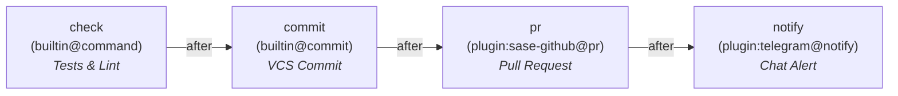
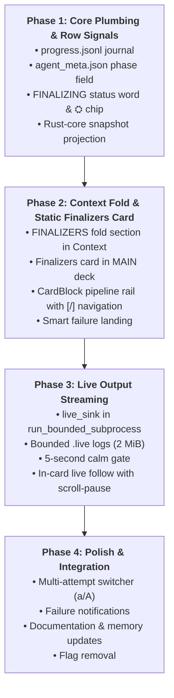

# Finalizer Observability in the Agents Tab: Decks, Cards, and Card Blocks Architecture

- **Researcher:** `gem` (Researcher `research.a.gem` in 4-researcher swarm)
- **Date:** 2026-09-25
- **Workspace:** `sase-org/sase` @ workspace #20
- **Context:** SASE Agents Tab UX, Finalizer Lifecycle Observability, Agent Data Decks (`sase-17d`), and Agent Data Card Blocks (`agent_data_card_blocks.md`)
- **Prior Research:** `agents_tab_finalizer_panel.md` (2026-09-10) and `agent_data_card_blocks.md` (2026-09-25)

---

## 1. Executive Summary

Finalizers are a host-owned, safety-critical phase of every SASE agent turn. By design (`decisions:host-owned-completion`), agents do not mutate Git history, create branches, or open pull requests directly; they emit structured declarations, and the host's finalizer pipeline executes the real-world side effects. 

Empirical measurements across 1,219 host runs demonstrate why finalizer visibility is urgent:
- **23.9% of agent runs spend more than 30 seconds in finalizers.**
- **13.4% spend more than 5 minutes** (e.g. running extensive test suites, complex git hooks, or multi-turn LLM conflict repairs).
- **6.7% of runs end in non-success** across 16 distinct failure/deferral diagnostic codes.
- Yet on the Agents tab today, **the entire finalizer phase is completely invisible**. For minutes on end, a finalized agent reads ambiguously as `RUNNING` (indistinguishable from an LLM generating tokens), and if a finalizer fails or defers, the failure is completely lost to the UI.

### The Architectural Shift Since the Previous Report
The previous research report (`agents_tab_finalizer_panel.md`, 2026-09-10) proposed a foldable text section in the monolithic `AgentPromptPanel` and an output popup modal (`ModalScreen`) for inspection. However, since that report was drafted, the SASE TUI has fundamentally evolved:
1. **Agent Data Decks (`sase-17d`)** landed, restructuring agent inspection into distinct, navigable data planes (`MAIN`, `FILES`, `TOOLS`), with split-screen capability (`SINGLE`, `LEFT_RIGHT`, `TOP_BOTTOM`) and sticky preferred cards.
2. **Agent Data Card Blocks (`agent_data_card_blocks.md`)** established a strict 3-tier hierarchy: **Deck → Card → Block**, introducing docked, one-row timeline rails, clean paged/spread mode invariants, and robust `[` / `]` navigation.

### Bottom Line Recommendation
Do not shoehorn finalizers into a legacy text fold or exile them to a disruptive popup modal. Instead, implement a **3-Layer Progressive Disclosure Architecture** that natively embraces Agent Data Decks and Card Blocks:

1. **Layer 0 — Agent Row (Instant Triage):** A `FINALIZING` status word during execution, and a calm `⛭` lane chip exclusively for active or non-success states (`⛭ check`, `⛭ commit`, `⛭✗`, `⛭⏸`, `⛭⊘`). 93% quiet successes earn zero row chips.
2. **Layer 1 — Context Card Header (Calm Overview):** A compact, collapsible `FINALIZERS` summary section in the `Context` card metadata (placed logically with other lifecycle blocks: after `SHELLS`/`WAIT`, before `BEAD`). Level 1 is a 1-line collapsed summary; Level 2 is an aligned pipeline overview.
3. **Layer 2 — Dedicated `Finalizers` Card with Card Blocks in `MAIN` Deck (Interactive Troubleshooting):** A first-class `Finalizers` card in `MAIN` (`Context | Reply | Finalizers`). 
   - Each finalizer instance (`check`, `commit`, `pr`, `notify`) is modeled as a **`CardBlock`**.
   - When ≥ 2 finalizers exist, the **Block Rail** docks at the top:
     `0 check ✓ ─ 1 commit ✓ ─ ▐2 pr ✗▌ ─ 3 notify –     [ older · newer ]`
   - Navigation via `[` (upstream) and `]` (downstream) cycles instances.
   - Smart landing immediately highlights failures.
   - In `LEFT_RIGHT` split mode, users can view `Reply` on the left and `Finalizers` on the right—troubleshooting test failures or hook errors against the agent's reasoning side-by-side!

---

## 2. Verified Ground Truth & Evolution Since Prior Work

### 2.1 What the Old Report Got Right (Adopted Foundation)
Lead verification and corpus re-inspection confirm that the core backend conclusions of `agents_tab_finalizer_panel.md` remain rock solid:
- **Zero Wire Bump Required:** Wire schema v2 (`FinalizerAggregateResultWire`, `FinalizerInstanceResultWire`, `FinalizerAttemptWire`) is frozen and strictly validated (`deny_unknown_fields`). The UI must not force a v2 → v3 bump.
- **Progress Journal (`progress.jsonl`):** Controller-emitted append-only JSONL recording semantic state transitions (`phase_started`, `instance_started`, `attempt_started`, `attempt_finished`, `instance_finished`, `phase_finished`).
- **Additive `agent_meta.json["finalizers"]`:** Provides instant O(1) row-level status scanning without opening run directories.
- **Bounded `.live` Subprocess Sink:** Subprocess stdout/stderr chunks piped to disposable 2 MiB rotating `.live` logs using the monitor logging contract (`logs/_bounded.py`), keeping canonical `attempt-N.stdout` immutable.
- **Rust-Core Projection (`FinalizerRunSnapshotWire`):** Single source of truth reconciling plan, journal, result, and live files with strict source precedence.
- **Pre-parse Size Ceiling & Deduplication:** Pre-parse ceiling (1 MiB) on `finalizer_result.json` and diagnostic deduplication to protect against catastrophic 3.32 MB duplicate diagnostic files freezing Textual.
- **Calm 5-Second Live Gate:** No live streaming tail flickers for fast (< 5s) finalizers.

### 2.2 What Has Changed: The Arrival of Decks and Card Blocks
The previous report was constrained by the monolithic `AgentPromptPanel` and proposed:
> *"Level 2 — the output modal (explicit keypress): ⏎ on the section opens a ModalScreen with PanelTabStrip tabs per instance..."*

In modern SASE, this modal proposal is obsolete and anti-pattern:
1. **Modals break workflow:** A modal hijacks the entire terminal screen. The user cannot see the agent tree, cannot see the prompt, cannot see the code diffs in `FILES`, and cannot view the agent's explanation in `Reply`.
2. **Agent Data Decks are already tabbed panes:** `DeckPanel` already manages cards, scrolling, search, and split-screen viewing.
3. **Card Blocks provide the exact navigation primitives needed:** The `agent_data_card_blocks.md` specification defines a docked, one-row **Block Rail**, discrete `CardBlock` wrappers, and `[` / `]` stepping. A finalizer pipeline (`check` → `commit` → `pr` → `notify`) maps 1:1 onto Card Blocks.

### 2.3 The tmux 3.5a Keyboard Reality
As definitively proven in `agent_data_card_blocks.md` (§1.4), on tmux 3.5a with `extended-keys off` or `extended-keys always` + `csi-u`, `Ctrl+Shift+J/K` collapses to `Ctrl+J/K` (`\n` and `\x0b`). 
- In SASE, `Ctrl+J` / `Ctrl+K` is already assigned to **cycle deck cards** (`Context` ↔ `Reply` ↔ `Finalizers`).
- If `Ctrl+Shift+J/K` were used for finalizer steps, pressing it would inadvertently switch cards rather than stepping finalizers!
- Therefore, **`[` and `]` (printable characters) are the only reliable default keys** for intra-card block cycling.

---

## 3. Evaluating Architectural Alternatives for Finalizers

We evaluate four architectural models for how finalizers should live in the SASE TUI:

| Dimension | Model 1: Dedicated Deck (`DeckId.FINALIZERS`) | Model 2: Blocks in `Reply` Card | Model 3: Fold Section + Modal (Old Report) | Model 4: Hybrid Fold + `Finalizers` Card with Blocks (Recommended) |
|---|---|---|---|---|
| **Placement** | Top-level deck in `DECK_CYCLE` (`MAIN`, `FILES`, `TOOLS`, `FINALIZERS`) | Blocks appended to end of `Reply` card (`--plan`, `--code`, `commit`) | Section in `Context` header + pop-up `ModalScreen` | Collapsed section in `Context` header + `Finalizers` card in `MAIN` |
| **Quiet Runs (93%)** | Pollutes deck cycle with empty/trivial deck | Distorts triage landing; hides agent reply | Calm (collapsed 1-liner) | Calm (collapsed 1-liner; card accessible if desired) |
| **Multi-Finalizer Pipelines** | Good tab strip | Clutters reply timeline with unrelated host actions | Poor (requires modal) | **Excellent** (docked Block Rail with `[`/`]`) |
| **Split-Screen Use** | Disconnected from `MAIN` | Cannot compare reply with finalizer logs | Impossible (modal blocks UI) | **First-class** (`Reply` on left, `Finalizers` on right) |
| **Host-Owned Separation** | Yes | **Violated** (mixes agent chat with host execution) | Yes | **Yes** (clear conceptual separation) |
| **Verdict** | **Reject** | **Reject** | **Superfished / Incomplete** | **ADOPT** |

### Why Model 1 (Dedicated Deck) Fails
A top-level deck (`DeckId.FINALIZERS`) elevates finalizers to equal standing with `MAIN` (all prompts & replies), `FILES` (all file diffs), and `TOOLS` (hundreds of LLM tool invocations). But in 93% of runs, finalizers run in under 2 seconds and succeed silently; in 16% of runs, trees are clean and finalizers are not even triggered. Making every user `Tab` or cycle past a `FINALIZERS` deck on every agent turn violates SASE's core design tenet: *Silence is the reward*.

### Why Model 2 (Blocks in `Reply` Card) Fails
Putting finalizers as trailing blocks in `Reply` card (`0 --plan`, `1 --code`, `2 commit`) seems tempting at first glance, but it catastrophically breaks the user's mental model:
1. **Breaks `decisions:host-owned-completion`:** The agent didn't run the finalizer; the host did.
2. **Destroys the Triage Landing Loop:** As designed in `agent_data_card_blocks.md`, `j/k` row scanning lands on the *newest block* of the sticky `Reply` card so the user can immediately read the agent's explanation. If `commit` or `check` were the newest block of `Reply`, landing would show raw git stdout (`[master 8d19926] ...`) or pytest output instead of what the agent said!
3. **Semantic Confusion:** An agent session Reply card is about agent conversational phases. Subprocess logs and VCS dispatches are host operations.

### Why Model 3 (Old Fold + Modal) Is Suboptimal
Relying solely on a fold in `Context` and a popup modal treats finalizer inspection as a secondary afterthought. If `check` fails with 40 lines of test errors, opening a modal prevents the user from looking at the code changes in `FILES` or the agent's explanation in `Reply`. It fails to leverage the rich panel and split-view capabilities already present in SASE.

### Why Model 4 (Hybrid Dual-Presence) Is the Clear Winner
Model 4 achieves the ideal balance:
- **At-a-Glance Awareness:** When reading `Context` (the prompt), a neat 1-line fold section (`▸ FINALIZERS · check ✓ · commit ✓`) tells the user everything they need to know without switching cards.
- **Deep Interactive Workspace:** When troubleshooting a failure or reviewing multi-stage pipelines, switching to the `Finalizers` card (`Ctrl+K` or hotkey `F`) provides a dedicated, block-navigable workspace.
- **Split-Screen Parity:** Users can configure a `LEFT_RIGHT` split in SASE with `Reply` on the left and `Finalizers` on the right.

---

## 4. The Recommended Experience: 3-Layer Progressive Disclosure

### 4.1 Layer 0: The Agent Row (Scanner & Triage)
During agent execution and list scanning, finalizers must be legible without opening files:
- **Status Word:** When an agent transitions from provider turn to finalizers, its status word changes from `RUNNING` to **`FINALIZING`**.
  - Bucketed internally under `Running` so sorting, lane filtering, and concurrency limits remain completely intact.
  - Instantly demystifies the "invisible minutes": the user knows the model is done and the host is executing verification/commit/dispatch.
- **Row Chip:** A `⛭` glyph appears in the lane chips:
  - Running: `⛭ check` or `⛭ 2/3` (indicating active instance or progress).
  - Failed: `⛭✗` (red accent).
  - Deferred: `⛭⏸` (amber accent).
  - Refused: `⛭⊘` (magenta accent).
  - Success: **No chip**. (Calm rule: 93% success rate means quiet completion).

```text
# Agent list row during finalizer phase:
● 19.f0--code   FINALIZING  ⛭ check  1m 12s  docs: update architecture
```

### 4.2 Layer 1: Context Card Header (`FINALIZERS` Fold Section)
In `Context` card metadata, placed immediately after `SHELLS`/`WAIT` and before `BEAD`:
- **Fold Level 1 (Collapsed, Default on Success):**
  ```text
  ▸ FINALIZERS · 2 selected · check ✓ 14.2s · commit ✓ 1.8s
  ```
- **Fold Level 2 (Expanded Overview):**
  ```text
  ▾ FINALIZERS · 2 selected · plan c21e7df7 · [F] open card
    ✓ check   builtin@command  14.2s  14 passed, 0 failed
    ✓ commit  builtin@commit    1.8s  sha 8d19926 (master)
      └ after check
  ```
- **Fold Level 3 (Failure Highlight):**
  If any finalizer failed, the section defaults to logically expanded:
  ```text
  ▾ FINALIZERS · 2 selected · 1 failed
    ✗ check   builtin@command  24.5s  2 failed in tests/test_parser.py
    – commit  builtin@commit       –  not run (blocked by check)
      └ after check
    ⚠ test_failure: 2 tests failed in tests/test_parser.py
    Press [F] to open Finalizers card or [E] to view full test log
  ```

### 4.3 Layer 2: The `Finalizers` Card with Card Blocks
The core interactive innovation is the `Finalizers` card in the `MAIN` deck:
`card_document(context_card(...), reply_card(...), finalizers_card(...))`

#### The Card Block Rail
When an agent has ≥ 2 finalizers selected, the top of the card renders the **Block Rail** docked under the panel border:

```text
╭─ ◆ MAIN ┃ Context │ Reply │ Finalizers  3/3 ──────────────────────────────╮
│ 0 check ✓ ─ ▐1 commit ▶▌ ─ 2 pr ◌ ─ 3 notify ◌          [ older · newer ] │
│ ─── ⛭ FINALIZER: commit ─── 07:25:25 ──────────────────────────────────── │
│ Provider:  builtin@commit (default)              Policy:  max 2 · defer   │
│ Trigger:   dirty_tree (triggered)                Status:  RUNNING (att 1) │
│                                                                           │
│ [Live Output · attempt 1]                                                 │
│ [master 8d19926] docs: update finalizer architecture                      │
│  3 files changed, 142 insertions(+), 18 deletions(-)                     │
│ Running pre-commit hooks: cargo test --quiet...                           │
╰───────────────────────────────────────────── main 3 · files 2 · tools 41 ─╯
```

#### Smart Landing Rule
When navigating to the `Finalizers` card:
1. **If any instance failed, refused, or deferred:** Automatically land on the **first non-success block**! The user is taken directly to the problem without pressing extra keys.
2. **If currently finalizing:** Automatically land on the **currently running block** and follow output.
3. **If all succeeded:** Land on the **terminal block** (e.g. `pr` or `commit`), representing the culmination of the pipeline.

#### Navigation
- `[` steps to the **older / upstream** finalizer instance (e.g. moving from `commit` back to `check`).
- `]` steps to the **newer / downstream** finalizer instance (e.g. moving from `commit` forward to `pr`).
- If an instance is running, `G` pins to bottom to follow live output; scrolling up pauses following and shows `↓ N new lines`.

#### Attempt Handling Inside a Card Block
Per the `agent_data_card_blocks.md` invariant: **Blocks never nest.** 
Finalizer attempts must not be created as nested blocks. Instead, attempts are managed cleanly inside the instance block:
- If `attempts == 1`: Render output directly.
- If `attempts > 1` (e.g. retry or conflict repair):
  Render an in-content attempt bar above the log:
  ```text
  Attempts: [ 1 ✗ conflict (2.1s) ]  [ ▐2 ✓ repaired (3.4s)▌ ]
  ```
  - Default view shows the **latest attempt**.
  - Previous attempts can be selected via click or `a` / `A` key toggle.
  - Diagnostics from earlier attempts are muted (`+1 earlier diagnostic (dim)`).

---

## 5. Extensibility: Supporting Arbitrary Non-Commit Finalizers

The user specifically requested: *"I have several plans for new finalizers so make sure you don't overfit this use-case to the builtin `commit` finalizer"*.

The design treats `builtin@commit` as simply one provider implementation conforming to the general contract. Here is how four major classes of upcoming finalizers render natively:



### Archetype 1: Verification Finalizer (`check`, `builtin@command`)
- **Role:** Run test suites, linters, or typecheckers before allowing commits or merges.
- **Evidence Box:**
  - Status: `PASSED` or `FAILED (exit code 1)`
  - Metrics: `48 passed, 0 failed in 18.2s`
- **Output:** Formatted ANSI terminal stream with test failures highlighted.
- **Diagnostics:** Extracted failure summaries (`test_failure: tests/test_auth.py:42`).

### Archetype 2: VCS Mutation Finalizer (`commit`, `builtin@commit`)
- **Role:** Commit accepted declarations, dispatch stitches, invoke LLM conflict repair if needed.
- **Evidence Box:**
  - `Commit: 8d19926 (master)`
  - `Tree: a251c95`
  - `Message: "feat: implement card block navigation"`
  - `Stats: +142 -18 across 3 files`
- **Output:** Hook execution logs (pre-commit, commit-msg, post-commit).
- **Diagnostics:** Deferral reasons (`protected_paths: ["secret.key"]`), refusal reasons.

### Archetype 3: Hosting / Integration Finalizer (`pr`, `plugin:sase-github@pr`)
- **Role:** Push branch to remote, open or update PR, request reviewers.
- **Evidence Box:**
  - `PR: #412 "feat: implement card block navigation"`
  - `URL: https://github.com/sase-org/sase/pull/412`
  - `Branch: feat/card-blocks → master`
  - `Reviewers: @bryan, @lead`
- **Output:** GitHub API response summary or `gh` CLI stdout.

### Archetype 4: Notification Finalizer (`notify`, `plugin:telegram@notify`)
- **Role:** Dispatch execution report to chat/slack/email.
- **Evidence Box:**
  - `Destination: Telegram #agent-ops`
  - `Message ID: 98412`
  - `Delivery: 2026-09-25 14:32:01`
- **Output:** Payload receipt and latency.

### Pipeline Dependency Handling (`after: [...]`)
When finalizer dependencies fail:
If `check` fails with exit code 1:
- `check`: renders `✗ failed` with test traceback.
- `commit`: renders `– not run (blocked by: check)`.
- `pr`: renders `– not run (blocked by: commit)`.
- `notify`: (if configured with `policy: { refusal: "ignore" }` and no dependency on commit) can still run and report the failure!
The Block Rail makes this instantly clear:
`│ 0 check ✗ ─ 1 commit – ─ 2 pr – ─ ▐3 notify ✓▌          [ older · newer ] │`

---

## 6. Split-Screen Workflow: The Killer Feature of Decks + Blocks

One of the greatest advantages of placing finalizers on a `MAIN` deck card is how it leverages SASE's split-screen deck layouts (`DeckLayout.LEFT_RIGHT` and `DeckLayout.TOP_BOTTOM`).

Today, if a test finalizer fails or a commit hook rejects a change, a user troubleshooting in SASE must awkwardly jump between views. With the `Finalizers` card, the user simply presses `{` or `}` to create a `LEFT_RIGHT` split:

```text
╭─ ◆ MAIN ┃ Context │ ▐Reply▌ 3/3 ──╮ ╭─ ◆ MAIN ┃ Context │ Reply │ ▐Finalizers▌ 3/3 ──╮
│ ─── AGENT (code) ─── 07:23:10 ─── │ │ 0 check ✗ ─ 1 commit –            [ older · newer ] │
│ I modified `parser.py` to handle  │ │ ─── ⛭ FINALIZER: check ─── 07:25:01 ─────────── │
│ optional commas in YAML blocks.   │ │ FAILED: tests/test_parser.py:108            │
│ All tests should now pass.        │ │ AssertionError: Expected None, got ','      │
╰───────────────────────────────────╯ ╰───────────────────────────────────────────────╯
```

**Workflow Impact:**
The developer reads the agent's explanation on the left, and reads the exact test failure traceback on the right! 
No modal windows. No switching tabs. Full keyboard navigation across both panes.

---

## 7. Technical Architecture & Wire Reconciliation

### 7.1 The Three Non-Wire Observability Artifacts
To support real-time and post-mortem observability without touching the frozen wire schema:

1. **`finalizers/progress.jsonl` (Append-Only Journal):**
   Emitted by `src/sase/finalizers/controller.py` at transitions:
   - `phase_started` (timestamp, plan_digest, run_id)
   - `instance_started` (instance_id, provider_ref, attempt_number)
   - `attempt_started` (instance_id, attempt_number)
   - `attempt_finished` (instance_id, attempt_number, status, duration_ms)
   - `instance_finished` (instance_id, status, total_duration_ms)
   - `phase_finished` (aggregate_status, total_duration_ms)
   *Reliability invariant:* A dead runner with an unclosed `attempt_started` is projected as `interrupted`, never spinning forever.

2. **Additive `agent_meta.json["finalizers"]`:**
   Updated by the controller on phase changes:
   ```json
   "finalizers": {
     "phase": "running",
     "active_instance": "check",
     "active_attempt": 1,
     "plan_digest": "c21e7df7...",
     "status": null
   }
   ```
   *Reliability invariant:* Scanned in O(1) by `AgentMetaWire` for the agent list row without disk traversals.

3. **Bounded Live Logs (`attempt-N.live`):**
   Written via `live_sink` on `run_bounded_subprocess` inside `bounded_subprocess.py`.
   - Maximum 2 MiB with 1 rotation (4 MiB total ceiling).
   - Dedicated cache; does not collide with immutable `attempt-N.stdout` written at exit.

### 7.2 Rust-Core Reconciliation Projection (`FinalizerRunSnapshotWire`)
Per `decisions:rust-core-required`, backend reconciliation belongs in `sase-core`:
- Located in `sase-core/crates/sase_core/src/finalizer/snapshot.rs`.
- Reconciles: `finalizer_plan.json` + `progress.jsonl` + `final_context.json` + `finalizer_result.json` + `.live` log metadata.
- **Source Precedence Matrix:**
  1. Authenticated `finalizer_plan.json` is authoritative for configured instances, order, and policy.
  2. Terminal `finalizer_result.json` dominates all runtime logs for completed instances.
  3. Runtime `progress.jsonl` is authoritative for current live phase, attempt timings, and substeps.
  4. Missing runner + no terminal result = `interrupted`.
  5. Planned instances absent from result = `not run` (`blocked by X`).
- **Defenses:**
  - 1 MiB pre-parse ceiling on `finalizer_result.json`.
  - Automatic render-time deduplication of diagnostics (collapsing identical codes across attempts).
  - Attempt-scoping of severity (a resolved conflict in attempt 1 does not color attempt 2 red).

---

## 8. Keyboard Navigation & Configuration

### 8.1 Keymap Assignments

| Context | Key | Action Identifier | Description |
|---|---|---|---|
| **Agents List** | `j` / `k` | `cursor_down` / `cursor_up` | Scans agents (shows `FINALIZING` & `⛭` chips) |
| **Main Deck** | `Ctrl+J` / `Ctrl+K` | `prev_card` / `next_card` | Cycles cards: `Context` ↔ `Reply` ↔ `Finalizers` |
| **Main Deck** | `F` | `focus_finalizers_card` | Direct shortcut to jump straight to `Finalizers` card |
| **Finalizers Card** | `[` / `]` | `prev_card_block` / `next_card_block` | Cycles finalizer instances on the Block Rail |
| **Finalizers Card** | `a` / `A` | `toggle_attempt` | Switches active attempt when instance has retries |
| **Finalizers Card** | `E` | `edit_log` | Opens current finalizer's full stdout/stderr in `$EDITOR` |
| **Finalizers Card** | `V` | `view_pager` | Opens log in internal pager |
| **Context Header** | `Enter` | `activate_fold_action` | When on `FINALIZERS` fold, jumps directly to `Finalizers` card |

### 8.2 Configuration Settings (`default_config.yml`)

```yaml
ace:
  finalizers:
    # Seconds an instance must run before live log tailing begins (prevents flicker on fast finalizers)
    live_tail_after_seconds: 5.0
    # Maximum lines shown in in-card tail preview before requiring 'E' or 'V'
    max_preview_lines: 50
    # Enable audio/desktop notification on finalizer failure
    notify_on_failure: true
```

---

## 9. Delivery Plan & Incremental Milestones

To manage risk and provide immediate value, delivery is divided into four distinct phases gated by a `beta` feature flag (`sase flag new ace_finalizers_card`):



### Phase 1: Core Plumbing & Row Signals (Immediate High-Value Win)
- Implement `progress.jsonl` emission in `src/sase/finalizers/controller.py`.
- Add `finalizers.phase` to `agent_meta.json` and `AgentMetaWire`.
- Wire `FINALIZING` status word and `⛭` chip into `_agent_list_styling.py`.
- Implement `FinalizerRunSnapshotWire` in `sase-core`.
- *Outcome:* Solves the "invisible minutes" problem immediately.

### Phase 2: Context Fold & Static `Finalizers` Card
- Implement `ResponsiveFinalizerSection` in `_agent_display_header.py`.
- Add `FINALIZERS_CARD_ID` to `card_part.py`.
- Implement Card Block assembly for finalizer pipelines in `main_document.py` and `main_view.py`.
- Implement the docked `BlockRail` and `[` / `]` navigation.
- Implement Smart Landing logic (landing on failed block).
- *Outcome:* Completed runs have full, beautiful visualization of pipelines, diagnostics, evidence, and outputs.

### Phase 3: Live Output Streaming
- Add `live_sink` callback to `bounded_subprocess.py`.
- Connect executor subprocesses to write bounded `.live` files.
- Wire refresh surface tokens (`mtime(progress.jsonl) + mtime(.live)`).
- Implement in-card log tail with 5-second calm gate and auto-follow.
- *Outcome:* Live visual progress for long-running test suites and commit repairs.

### Phase 4: Polish & Parity
- Add multi-attempt toggle (`a`/`A`) for retried instances.
- Add `$EDITOR` (`E`) and pager (`V`) log actions.
- Update `docs/ace.md`, configuration schema, and keymap registry.
- File memory updates via `/sase_memory_write`.

---

## 10. Direct Answers to Bryan's Key Questions

### Q1: What role should Decks, Cards, and Card Blocks play?
- **Decks:** Do **not** create a new top-level `FINALIZERS` deck. It pollutes deck cycling for the 93% of runs that succeed in under 2 seconds. Finalizers belong in the `MAIN` deck alongside `Context` and `Reply`.
- **Cards:** Add a dedicated **`Finalizers` card** (`Context | Reply | Finalizers`). This creates a complete 3-act lifecycle narrative in `MAIN`: *Input* (`Context`) → *Thinking/Work* (`Reply`) → *Completion/Verification* (`Finalizers`).
- **Card Blocks:** Use **`CardBlock`** for the finalizer pipeline instances! Each instance (`check`, `commit`, `pr`, `notify`) is an identified block on the docked **Block Rail**, navigated with `[` and `]`.

### Q2: What about agents with only 1 finalizer (e.g. `commit` only)?
- Per `agent_data_card_blocks.md` rules, when a card has `< 2` blocks, **the Block Rail is automatically hidden**.
- Single-instance finalizers cleanly fill the `Finalizers` card without an unnecessary rail.
- Multi-instance pipelines automatically reveal the rail.

### Q3: How should attempts inside an instance be handled?
- Follow the strict invariant: **Blocks never nest.**
- An instance's attempts are toggled inside the block via an in-content attempt bar (`Attempts: [ 1 ✗ ] [ 2 ✓ ]`), defaulting to the latest attempt.

### Q4: Does the `Finalizers` card eliminate the need for an output modal?
- **Yes, for 95% of use cases.** The in-card log viewer with split-screen support replaces the disruptive `ModalScreen`.
- Modals or pagers (`V`) and `$EDITOR` (`E`) remain available only as escape hatches for massive (> 5,000 line) logs.

### Q5: How do we prevent overfitting to `commit`?
- Every finalizer instance is rendered through generalized schemas:
  - An **Evidence Box** rendering key-value artifacts (SHAs, test stats, PR links, delivery IDs).
  - A **Diagnostics Box** rendering typed codes and messages.
  - A **Pipeline Dependency Graph** showing `after: [...]` links and explicit `– not run (blocked by X)` statuses.
  - A **Unified Output Log** supporting both command stdout (tests, hooks) and plugin JSON responses.
