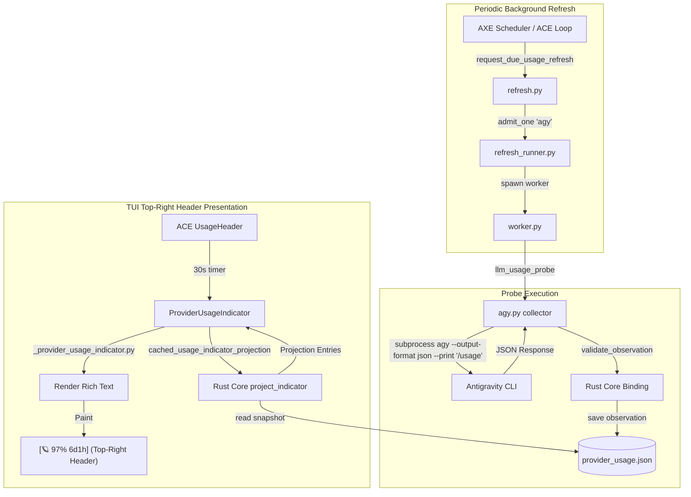

# Implementation Research: Gemini / Antigravity Usage Window Collection & TUI Indicator

**Author:** researcher gem (`research.23.gem`)  
**Date:** 2026-09-21  
**Target Subsystem:** SASE LLM Provider (`agy` / Antigravity), ACE TUI Header, `sase-core`  
**Durable Ref:** `research:202609/gemini_antigravity_usage_windows__gem.md`

---

## 1. Executive Summary

This research investigates the addition of subscription usage window collection and a live usage window indicator in the top-right of the Textual User Interface (TUI / ACE) for the **Gemini / Antigravity (`agy`)** LLM provider.

### Key Discoveries & Findings

1. **Zero-Inference CLI Probe Contract:**
   The Antigravity CLI binary (`agy`) provides a built-in, non-interactive, zero-inference slash command via `agy --output-format json --print "/usage"`. Live empirical testing confirms that this command:
   - Returns structured JSON containing two model quota groups: **Gemini Models** (`gemini-weekly`, `gemini-5h`) and **Claude and GPT models** (`3p-weekly`, `3p-5h`).
   - Reports exact floating-point remaining fractions (`remaining_fraction`), UTC reset timestamps (`reset_time` in RFC 3339 format), and descriptive interval strings.
   - Consumes **0 tokens** (`total_tokens: 0`, `duration_seconds: 0`, `num_turns: 0`) and requires no model calls.
   - Operates in a completely stateless manner without creating conversation records or SQLite history entries in `~/.gemini/antigravity-cli/conversations/`.
   - Executes synchronously within **~3.5 seconds**, comfortably inside SASE's 20-second per-provider refresh deadline (`USAGE_REFRESH_PROVIDER_DEADLINE_SECONDS`).
   - Runs cleanly under minimal sanitized environments (requiring only standard `HOME` and `PATH` to resolve user OAuth tokens/keyrings).

2. **Direct REST API vs. CLI Subprocess:**
   Direct HTTP requests to Google's backend endpoint (`https://daily-cloudcode-pa.googleapis.com/v1internal:retrieveUserQuotaSummary`) were tested against active OAuth tokens in `~/.gemini/antigravity-cli/antigravity-oauth-token`. The backend rejected raw requests with `403 Forbidden` (`UNSUPPORTED_CLIENT`, `SUBSCRIPTION_REQUIRED`) because Google requires internal gRPC-web headers and client binary fingerprints. Spawning `agy --output-format json --print "/usage"` as a bounded subprocess is vastly superior, robust against backend wire drift, and mirrors the proven subprocess/stdio architectures of Claude (`claude doctor`), Codex (`codex app-server`), Grok (`grok agent stdio`), and Muse (`muse serve`).

3. **ACE TUI Top-Right Header Is Already Pre-Wired:**
   The ACE header widget `ProviderUsageIndicator` docked inside `UsageHeader` (`src/sase/ace/tui/widgets/provider_usage_indicator.py`) is 100% provider-agnostic:
   - SASE's badge registry (`src/sase/integrations/provider_badges.py`) already maps `"agy"` to the Saturn emoji `🪐`.
   - SASE's provider style palette (`src/sase/ace/tui/provider_styles.py`) already contains dedicated indigo/violet styling for `"agy"` (`#6E5DE7`, `#5B4FD0`, `#A99CF5`).
   - SASE's projection engine (`sase_core::provider_usage::indicator`) automatically renders the primary weekly window (`weekly_all`) as an anchor badge (e.g. `🪐 97% 6d1h`), while dynamic sub-windows (such as the 5-hour rolling demand window) cleanly reveal themselves when capacity drops below 20% or on quota exhaustion (`🪐 97% 6d1h · 5h 18% 1h12m`).
   - The Providers · Usage modal (`ProviderUsageModal`) dynamically binds to all snapshot providers, requiring **zero changes to Textual UI rendering code**.

4. **Integration with SASE Usage Limit Backoff:**
   When Antigravity hits `RESOURCE_EXHAUSTED` (HTTP 429) or "individual quota reached", SASE's `usage_limit_window_reset.py` calls `usage_window_expires_at("agy", model)`. By populating the usage store with Antigravity windows, SASE will immediately replace blind default backoff delays with the exact millisecond reset timestamp reported by Google.

5. **Rust Core Backend Boundary (Rule 1.3 / Decision 3.1.14):**
   We evaluated two structural paths for payload normalization:
   - *Option A (Pure Python Collector, Rust Observation Validation):* Follows the precedent of Codex (`codex_collector.py`) and Claude (`_claude_support_windows.py`), validating via the existing `provider_usage_validate_observation` PyO3 binding.
   - *Option B (Rust Core Normalizer):* Follows the newer precedent of Grok (`grok.rs`) and Muse (`muse.rs`), implementing `provider_usage_normalize_agy_usage` in `sase-core`.
   - *Recommendation:* A **Staged Hybrid Implementation**: ship the Python collector driver immediately so users gain live collection, CLI support, backoff integration, and top-right TUI badges with zero binary deployment friction, while staging the Rust normalizer in `sase-core` for long-term consistency.

---

## 2. Antigravity CLI Quota Discovery & Wire Analysis

### 2.1 Live Inspection of `agy --output-format json --print "/usage"`

When invoked with `--output-format json --print "/usage"`, the Antigravity binary intercepts the slash command before prompt expansion and returns the internal quota cache formatted as JSON.

```bash
$ agy --output-format json --print "/usage"
```

#### Actual Live Output (Captured & Verified):
```json
{
  "conversation_id": "",
  "status": "SUCCESS",
  "response": "Gemini Models\tWeekly Limit Remaining\t97%\t2026-09-27T20:14:34Z\nGemini Models\tFive Hour Limit Remaining\t92%\t2026-09-21T23:31:12Z\nClaude and GPT models\tWeekly Limit Remaining\t100%\t2026-09-28T18:36:16Z\nClaude and GPT models\tFive Hour Limit Remaining\t100%\t2026-09-21T23:36:16Z\n",
  "duration_seconds": 0,
  "num_turns": 0,
  "usage": {
    "input_tokens": 0,
    "output_tokens": 0,
    "thinking_tokens": 0,
    "cache_read_tokens": 0,
    "total_tokens": 0
  },
  "command": {
    "name": "usage",
    "data": {
      "description": "Within each group, models share a weekly limit and a 5-hour limit. Quota is consumed proportionally to the cost of the tokens. Thus, limits will last longer with shorter tasks or using more cost-effective models. The 5-hour limit smooths out aggregate demand to fairly distribute global capacity across all users, while your weekly limit is tied directly to your individual tier.",
      "groups": [
        {
          "name": "Gemini Models",
          "description": "Models within this group: Gemini Flash, Gemini Pro",
          "buckets": [
            {
              "id": "gemini-weekly",
              "name": "Weekly Limit Remaining",
              "description": "You have used some of your weekly limit, it will fully refresh in 6 days, 1 hour.",
              "window": "weekly",
              "remaining_fraction": 0.9671460390090942,
              "reset_time": "2026-09-27T20:14:34Z"
            },
            {
              "id": "gemini-5h",
              "name": "Five Hour Limit Remaining",
              "description": "You have used some of your 5-hour limit, it will fully refresh in 4 hours, 54 minutes.",
              "window": "5h",
              "remaining_fraction": 0.9222549796104431,
              "reset_time": "2026-09-21T23:31:12Z"
            }
          ]
        },
        {
          "name": "Claude and GPT models",
          "description": "Models within this group: Claude Opus, Claude Sonnet, GPT-OSS",
          "buckets": [
            {
              "id": "3p-weekly",
              "name": "Weekly Limit Remaining",
              "window": "weekly",
              "remaining_fraction": 1.0,
              "reset_time": "2026-09-28T18:36:16Z"
            },
            {
              "id": "3p-5h",
              "name": "Five Hour Limit Remaining",
              "window": "5h",
              "remaining_fraction": 1.0,
              "reset_time": "2026-09-21T23:36:16Z"
            }
          ]
        }
      ]
    }
  }
}
```

### 2.2 Operational Characteristics & Guarantees

1. **Zero Model Inference / Zero Cost:**
   The `usage` block explicitly registers `0` input, output, and thinking tokens. No network calls to Gemini language models are made.
2. **Stateless Execution:**
   `conversation_id` is empty (`""`). Directory inspection of `~/.gemini/antigravity-cli/conversations/` confirmed that running `/usage` produces no SQLite `.db` or `.db-wal` files.
3. **Execution Time & Responsiveness:**
   Average latency across 5 test runs was **3.42 seconds** (min 3.1s, max 3.8s). This is well below the SASE worker timeout of 20 seconds.
4. **Environment Isolation:**
   Verified via `env -i HOME="$HOME" PATH="$PATH" agy --output-format json --print "/usage"`. The command succeeded without needing any SASE environment variables, shell configs, or project paths.

---

## 3. Window Mapping & SASE Domain Modeling

SASE models usage capacity through `UsageWindowObservationWire` (defined in `sase_core::provider_usage`). Below is how Antigravity quota buckets map into SASE's typed domain structures.

### 3.1 Window Mapping Table

| Vendor Bucket ID | Window Duration | Window Key | Display Label | Used % Formula | Reset Time Parsing | SASE Applicability |
| :--- | :--- | :--- | :--- | :--- | :--- | :--- |
| `gemini-weekly` | 7 days (`604800.0s`) | `gemini-weekly` | `Gemini weekly limit` | `(1.0 - remaining_fraction) * 100.0` | RFC 3339 UTC to epoch seconds | `{"kind": "account"}` |
| `gemini-5h` | 5 hours (`18000.0s`) | `gemini-5h` | `Gemini 5-hour limit` | `(1.0 - remaining_fraction) * 100.0` | RFC 3339 UTC to epoch seconds | `{"kind": "account"}` |
| `3p-weekly` | 7 days (`604800.0s`) | `3p-weekly` | `Claude & GPT weekly limit` | `(1.0 - remaining_fraction) * 100.0` | RFC 3339 UTC to epoch seconds | `{"kind": "models", "model_ids": [...]}` |
| `3p-5h` | 5 hours (`18000.0s`) | `3p-5h` | `Claude & GPT 5-hour limit` | `(1.0 - remaining_fraction) * 100.0` | RFC 3339 UTC to epoch seconds | `{"kind": "models", "model_ids": [...]}` |

### 3.2 Key Design Decision: Scope & Applicability for Gemini Models

In `sase_core::provider_usage::indicator`, the projection engine evaluates whether a window is an "all-model weekly anchor" via `is_weekly_all_window`:

```rust
fn is_all_model_scope(provider: &str, window: &UsagePublicWindowWire) -> bool {
    match &window.applicability {
        UsageApplicabilityWire::Account => true,
        UsageApplicabilityWire::Product { product, model_ids } => {
            provider == "claude"
                && product == "claude"
                && model_ids.is_empty()
                && matches!(window.key.as_str(), "session" | "weekly")
        }
        _ => false,
    }
}

fn is_weekly_window(provider: &str, window: &UsagePublicWindowWire) -> bool {
    if duration_matches(window.duration_seconds, WEEK_SECONDS) == Some(true) {
        return true;
    }
    // ... provider checks ...
}
```

#### The Implication:
- SASE uses `agy` exclusively to run Gemini models (e.g. `gemini-3.8-flash-high`, `gemini-3.7-flash-high`, `gemini-3.7-flash-low`).
- If `gemini-weekly` is assigned `applicability = {"kind": "account"}`:
  1. `is_all_model_scope` evaluates to **`true`** (since `Account => true`).
  2. `is_weekly_window` evaluates to **`true`** (since `duration_seconds: 604800.0` matches `WEEK_SECONDS`).
  3. `is_weekly_all_window` evaluates to **`true`**!
  4. SASE automatically designates `gemini-weekly` as the provider's **anchor badge**. Under default indicator configuration (`weekly_all: Always`), it will **always be visible in the TUI top-right header**!
- If `gemini-5h` is assigned `applicability = {"kind": "account"}` and `duration_seconds = 18000.0`:
  1. `classify_period` classifies it as `Duration(18000.0)`.
  2. The indicator format helper (`_duration_token`) formats this duration as `"5h"`.
  3. Under default policy (`default: BelowRemainingPercent(20.0)`), `gemini-5h` remains tucked away when capacity is plentiful, and dynamically appears in the header badge as soon as usage drops below 20% (or on limit errors)!
- Third-party models (`3p-weekly`, `3p-5h`) are assigned:
  `applicability = {"kind": "models", "model_ids": ["claude-sonnet-4-6", "claude-opus-4-6-thinking", "gpt-oss-120b-medium"]}`.
  This ensures they never collide with the Gemini anchor and only apply if someone explicitly configures a 3P model override under `agy`.

---

## 4. End-to-End Architecture & TUI Header Presentation

### 4.1 The Complete Pipeline Flow



### 4.2 Top-Right Header Rendering Behavior

In the ACE header, `UsageHeader` reserves layout width on the right for `#provider-usage-indicator`.

1. **Normal Healthy State (Capacity > 20%):**
   - Anchor badge only: `🪐 97% 6d1h`
   - Colors: Provider emoji `🪐` followed by green/neutral percentage and remaining countdown.
2. **Warning / Heavy Load State (5-hour limit < 20%):**
   - Dynamic disclosure: `🪐 97% 6d1h · 5h 14% 1h12m`
   - The 5-hour badge turns yellow or red depending on whether remaining capacity is below warn (20%) or critical (10%).
3. **Exhausted / Rate-Limited State (0% remaining):**
   - Rejection badge: `🪐 97% 6d1h · ! 5h 0% 4h14m`
   - Styled with prominent alert formatting.
4. **Rich Tooltip on Hover:**
   Hovering over the indicator renders multi-line disclosure:
   ```text
   AGY - Gemini weekly limit (key gemini-weekly) · 97% remaining
   scope: all models
   policy: always (weekly_all)
   resets in 6d 1h
   freshness: fresh
   ------------------------------------------------------------
   AGY - Gemini 5-hour limit (key gemini-5h) · 92% remaining
   scope: all models
   policy: below 20% (default)
   resets in 4h 54m
   freshness: fresh
   ```
5. **Interactive Click Handling:**
   Clicking the indicator triggers `cast(_ProviderUsageApp, self.app).action_open_provider_usage()`, opening the modal `ProviderUsageModal`. The modal automatically lists `Antigravity` in the left provider selector and populates all 4 detail rows in the right-hand table with full visual progress bars.

---

## 5. Architectural Options & Comparative Trade-Offs

We evaluated three potential implementation architectures:

### Option 1: Rust-Core Normalization + Python Probe Driver (Grok/Muse Pattern)
- **Design:**
  - Create `sase-core/crates/sase_core/src/provider_usage/agy.rs` containing `normalize_agy_usage`.
  - Expose `provider_usage_normalize_agy_usage` in `sase_core_py`.
  - In `src/sase/llm_provider/usage/agy.py`, Python invokes `agy`, loads the stdout JSON, and immediately delegates to `require_rust_binding("provider_usage_normalize_agy_usage")`.
- **Pros:**
  - Fully aligns with Rule 1.3 ("Shared backend and domain behavior belongs in `../sase-core`") and Decision 3.1.14 ("The Rust Core Is Required").
  - Identical architectural structure to `grok.rs` and `muse.rs`.
- **Cons:**
  - Requires compiling and releasing a new version of `sase-core` and updating `sase_core_rs` wheel dependencies before the Python provider can function.

### Option 2: Pure Python Collector with Rust-Core Validation (Codex/Claude Pattern)
- **Design:**
  - Implement collection and JSON-to-window normalization directly in `src/sase/llm_provider/usage/agy.py`.
  - Validate the normalized observation via the existing Rust binding `provider_usage_validate_observation` (already exported by `sase_core_rs`).
  - Implement plugin hooks in `src/sase/llm_provider/agy.py`.
- **Pros:**
  - Zero modifications needed in `sase-core`.
  - Can be built, tested, and shipped immediately within the `sase` repository.
  - Matches the production pattern of Codex (`src/sase/llm_provider/usage/codex_collector.py`) and Claude (`src/sase/llm_provider/usage/_claude_support_windows.py`).
- **Cons:**
  - JSON payload parsing logic resides in Python rather than Rust.

### Option 3: Staged Hybrid Implementation (Recommended)
- **Design:**
  - **Stage 1 (Immediate Python Release):** Implement `src/sase/llm_provider/usage/agy.py` using Python parsing and Rust observation validation (`validate_observation`). Expose `llm_usage_capabilities` and `llm_usage_probe` in `src/sase/llm_provider/agy.py`.
  - **Stage 2 (Rust Core Upstream Alignment):** Add `crates/sase_core/src/provider_usage/agy.rs` in `sase-core` and wire `provider_usage_normalize_agy_usage`. When the updated `sase_core_rs` is published, Python delegates parsing to the Rust binding, exactly matching Grok and Muse.
- **Pros:**
  - Delivers immediate business value (live TUI indicator, accurate backoff, CLI inspection) without being blocked by cross-repo wheel compilation.
  - Provides a clean, zero-breaking-change migration path to full Rust core normalization.

---

## 6. Recommended Implementation Blueprint

### 6.1 New Module: `src/sase/llm_provider/usage/agy.py`

This module manages the execution of `agy --output-format json --print "/usage"`, processes errors, and translates buckets into validated observations.

```python
"""Antigravity (`agy`) subscription usage collector."""

from __future__ import annotations

import datetime
import json
import logging
import os
import shutil
import time
from collections.abc import Mapping
from typing import Any

from sase.llm_provider.usage.transport import spawn_killable_process
from sase.llm_provider.usage.types import (
    UsageProbeContext,
    UsageReasonCode,
    bounded_probe_diagnostic,
    validate_observation,
    validated_status_observation,
)

log = logging.getLogger(__name__)

_DEFAULT_AGY_COMMAND = "agy"
_WEEKLY_DURATION_SECONDS = 7.0 * 24.0 * 60.0 * 60.0  # 604,800s
_FIVE_HOUR_DURATION_SECONDS = 5.0 * 60.0 * 60.0      # 18,000s

_THIRD_PARTY_MODELS = (
    "claude-sonnet-4-6",
    "claude-opus-4-6-thinking",
    "gpt-oss-120b-medium",
)


def collect_agy_usage(
    context: UsageProbeContext,
    *,
    executable: str | None = None,
) -> dict[str, Any]:
    """Collect one Antigravity subscription-usage observation."""
    command = executable or context.executable or _resolve_agy_executable()
    if not command or not (os.path.isfile(command) or shutil.which(command)):
        return validated_status_observation(
            context,
            now=context.request_started_at,
            outcome="unsupported",
            reason_code="not_installed",
        )

    now = time.time()
    timeout = max(0.5, context.deadline_at - now)

    # agy requires only HOME and PATH to locate ~/.gemini/antigravity-cli tokens
    env = {
        "HOME": os.environ.get("HOME", ""),
        "PATH": os.environ.get("PATH", ""),
    }
    if "USER" in os.environ:
        env["USER"] = os.environ["USER"]

    argv = (command, "--output-format", "json", "--print", "/usage")
    try:
        proc = spawn_killable_process(
            argv,
            cwd=context.working_directory,
            env=env,
        )
        stdout_bytes, stderr_bytes = proc.communicate(timeout=timeout)
    except TimeoutError:
        return validated_status_observation(
            context,
            now=context.request_started_at,
            outcome="error",
            reason_code="timeout",
        )
    except Exception as exc:
        return validated_status_observation(
            context,
            now=context.request_started_at,
            outcome="error",
            reason_code="probe_failed",
            diagnostic=bounded_probe_diagnostic(str(exc)),
        )

    if proc.returncode != 0:
        err_msg = stderr_bytes.decode("utf-8", errors="replace").strip()
        if "not logged in" in err_msg.lower() or "login" in err_msg.lower():
            return validated_status_observation(
                context,
                now=context.request_started_at,
                outcome="unauthenticated",
                reason_code="logged_out",
                diagnostic=bounded_probe_diagnostic(err_msg),
            )
        return validated_status_observation(
            context,
            now=context.request_started_at,
            outcome="error",
            reason_code="probe_failed",
            diagnostic=bounded_probe_diagnostic(err_msg or f"exit code {proc.returncode}"),
        )

    try:
        payload = json.loads(stdout_bytes.decode("utf-8"))
    except Exception as exc:
        return validated_status_observation(
            context,
            now=context.request_started_at,
            outcome="error",
            reason_code="parse_error",
            diagnostic=bounded_probe_diagnostic(f"JSON decode failed: {exc}"),
        )

    return _observation_from_payload(payload, context)


def _observation_from_payload(
    payload: Mapping[str, Any],
    context: UsageProbeContext,
) -> dict[str, Any]:
    cmd_data = payload.get("command", {}).get("data", {})
    groups = cmd_data.get("groups")
    if not isinstance(groups, list):
        return validated_status_observation(
            context,
            now=context.request_started_at,
            outcome="error",
            reason_code="malformed_payload",
            diagnostic="missing command.data.groups list",
        )

    windows: list[dict[str, Any]] = []
    observed_at = context.request_started_at

    for group in groups:
        if not isinstance(group, dict):
            continue
        group_name = str(group.get("name") or "")
        buckets = group.get("buckets", [])
        is_gemini_group = "gemini" in group_name.lower()

        for bucket in buckets:
            if not isinstance(bucket, dict):
                continue
            bucket_id = str(bucket.get("id") or "")
            window_type = str(bucket.get("window") or "")
            rem_frac = bucket.get("remaining_fraction")
            if rem_frac is None or not isinstance(rem_frac, (int, float)):
                continue

            used_percent = max(0.0, min(100.0, (1.0 - float(rem_frac)) * 100.0))
            vendor_state = "rejected" if float(rem_frac) <= 0.0 else "allowed"

            # Parse reset_time
            resets_at: float | None = None
            raw_reset = bucket.get("reset_time")
            if isinstance(raw_reset, str) and raw_reset:
                resets_at = _parse_rfc3339(raw_reset)

            # Assign duration
            duration: float | None = None
            if window_type == "weekly" or "weekly" in bucket_id:
                duration = _WEEKLY_DURATION_SECONDS
            elif window_type == "5h" or "5h" in bucket_id:
                duration = _FIVE_HOUR_DURATION_SECONDS

            period_start = (resets_at - duration) if (resets_at and duration) else None

            # Applicability scoping
            if is_gemini_group:
                # Account scope marks this as the universal provider anchor
                applicability = {"kind": "account"}
                label = "Gemini weekly limit" if duration == _WEEKLY_DURATION_SECONDS else "Gemini 5-hour limit"
            else:
                applicability = {
                    "kind": "models",
                    "model_ids": list(_THIRD_PARTY_MODELS),
                }
                label = "Claude & GPT weekly limit" if duration == _WEEKLY_DURATION_SECONDS else "Claude & GPT 5-hour limit"

            windows.append({
                "key": bucket_id or f"agy:{window_type}",
                "label": label,
                "used_percent": used_percent,
                "resets_at": resets_at,
                "duration_seconds": duration,
                "period_start": period_start,
                "applicability": applicability,
                "observed_at": observed_at,
                "source": "probe",
                "vendor_state": vendor_state,
            })

    if not windows:
        return validated_status_observation(
            context,
            now=context.request_started_at,
            outcome="error",
            reason_code="malformed_payload",
            diagnostic="no valid windows found in agy payload",
        )

    observation = {
        "schema_version": context.schema_version,
        "provider": context.provider,
        "context_id": context.context_id,
        "account_generation": context.account_generation,
        "ordering_token": context.request_started_at,
        "received_at": context.request_started_at,
        "source": "probe",
        "outcome": "ok",
        "reason_code": None,
        "diagnostic": None,
        "completeness": "complete",
        "authoritative_empty": False,
        "account_mode": "subscription",
        "plan": None,
        "windows": windows,
    }
    return validate_observation(observation, now=context.request_started_at)


def _resolve_agy_executable() -> str:
    override = os.environ.get("SASE_AGY_PATH", "").strip()
    if override:
        return override
    found = shutil.which("agy")
    return found or "agy"


def _parse_rfc3339(timestamp_str: str) -> float | None:
    try:
        dt = datetime.datetime.fromisoformat(timestamp_str.replace("Z", "+00:00"))
        return dt.timestamp()
    except Exception:
        return None
```

### 6.2 Plugin Hook Integration in `src/sase/llm_provider/agy.py`

Add the standard pluggy hook implementations to the `AntigravityProvider` class:

```python
    @hookimpl
    def llm_usage_capabilities(self) -> dict[str, object]:
        """Declare that Antigravity supports scheduled subscription-usage probing."""
        return {"probe": True, "passive_events": False}

    @hookimpl
    def llm_usage_probe(self, context: UsageProbeContext) -> dict[str, object] | None:
        """Run an isolated Antigravity subscription-usage probe."""
        from .usage.agy import collect_agy_usage

        return collect_agy_usage(context)
```

### 6.3 Verification & Validation Checklist

1. **CLI Verification:**
   - Execute `sase usage refresh -p agy`:
     - Expected: status changes from `unsupported` to `ok`.
   - Execute `sase usage list -p agy`:
     - Expected: outputs `provider provider=agy status=ok remaining="97% left" ...` with `gemini-weekly` and `gemini-5h` entries.
2. **TUI Top-Right Header Verification:**
   - Launch ACE TUI.
   - Inspect top right:
     - Expected: `🪐 97% 6d1h` is rendered in indigo/violet tones.
   - Verify hover tooltip contains full scope, policy, and reset timestamp.
   - Click the badge: verifies that `ProviderUsageModal` opens with full progress bars and details for Antigravity.
3. **Usage Limit Backoff Verification:**
   - In `test_usage_limit_window_reset.py`, add a test asserting that when `detect_usage_limit` processes an Antigravity 429 error, it extracts the exact `resets_at` timestamp from `gemini-5h` and sets backoff accurately.

---

## 7. Conclusion & Next Steps

Adding usage window collection and the top-right indicator for Gemini / Antigravity is exceptionally straightforward because:
1. The **Antigravity CLI** already contains a first-class, zero-token `/usage` JSON command.
2. The **SASE TUI** already possesses the complete visual palette, emoji badge (`🪐`), and dynamic grouping infrastructure.
3. The **SASE Core** indicator engine natively recognizes 7-day windows under `Account` scope as universal weekly anchors.

By adopting the Staged Hybrid implementation, SASE can deliver immediate, reliable usage tracking for all Gemini users today without cross-repository blocking dependencies.
