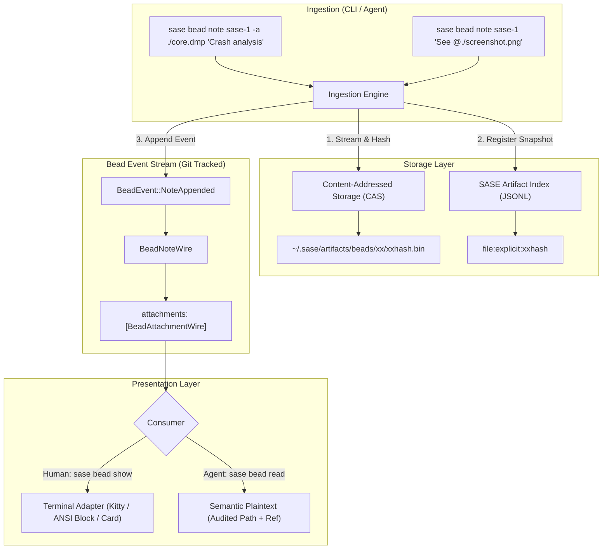
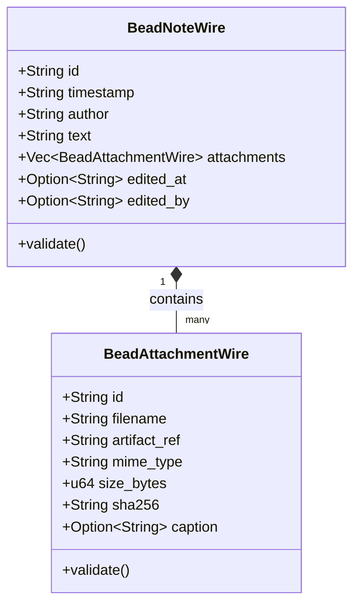

# SASE Bead File Attachments: Architectural Analysis, Plan Critique, and Design of Record

**Author:** researcher gem  
**Date:** 2026-09-29  
**Status:** PROPOSED  
**Audience:** SASE Architecture Team, Bead Subsystem Maintainers  
**Target File:** `sase/repos/research/202609/bead_file_attachments_architecture_and_critique__gem.md`

---

## 1. Executive Summary

Beads are the central coordination unit for structured agentic software engineering in SASE—representing planning beads, executable epic phases, and standalone tasks. While beads currently excel at tracking structured metadata, dependencies, and textual notes, modern software engineering workflows frequently demand rich evidence: UI regression screenshots, memory profiler dumps, compiler build logs, core dumps, reproduction scripts, and test database fixtures.

The user's initial proposal outlines four key desires:
1. Support `@<path_to_file>` references anywhere inside a note (expanding beyond the current limitation where `@<path>` must be the sole content of the note).
2. Require `@@` when a literal `@` character is needed in note prose.
3. Provide robust, optional terminal viewing support for images in `sase bead show`, while being mindful of non-supporting terminals and agent consumption.
4. Support large and arbitrary binary files gracefully.
5. Create a design that is intuitive, reliable, and beautiful.

### Key Findings & Thesis
* **The fundamental tension in the initial plan:** The existing implementation of `@<path>` in SASE (`read_at_path_value` in `src/sase/cli_file_values.py`) is **textual transclusion** (inlining the file's raw UTF-8 content directly into `note.text`). Applying transclusion anywhere in a note fails disastrously for large files (which blow up git event streams) and binary files (which crash with `UnicodeDecodeError`).
* **The escape hazard:** Forcing users and agents to write `@@` for every literal `@` is a severe usability hazard in developer environments where `@` is ubiquitous (Python decorators like `@dataclass`, Java annotations, email addresses, git references, and mentions).
* **The scalability boundary:** SASE relies on ephemeral workspace clones (`sase_<N>`). Storing binary attachments directly in git event streams (`beads/events/**`) would cause permanent, compounding git repository bloat, degrading workspace creation and checkout speeds across parallel agents.
* **The dual-audience requirement:** Humans using `sase bead show` want gorgeous, responsive visual previews (Kitty protocol or TrueColor half-blocks). LLM agents using `sase bead read` must *never* receive terminal escape codes or massive raw bytes; they need clean, structured file paths and artifact references that they can inspect via tools like `view_file`.

### Recommended Solution (Summary)
We recommend a **Dual-Tier Content-Addressed Attachment Architecture**:
1. **Payload Tier (CAS):** Large and binary files are captured into SASE's Content-Addressed Storage (CAS) managed by the artifact subsystem (`~/.sase/projects/<proj>/artifacts/beads/` or sidecar artifact stores), with streaming SHA-256 ingestion and deduplication.
2. **Metadata Tier (Bead Event Stream):** Notes record compact, immutable `BeadAttachmentWire` records in the Rust core (`sase-core`), referencing the artifact ID, filename, MIME type, size, and SHA-256 hash. Zero binary bytes enter git.
3. **Syntax & Ingestion:** Disambiguate **Transclusion** (`--transclude <file>` / `@transclude:path`) from **Attachment** (`-a / --attachment <file>` and in-prose Markdown `` or bounded `@./path`). Support `@@` for escaping without breaking bare `@` in programming languages.
4. **Adaptive Presentation:**
   - In `sase bead show`: Adaptive three-tier image rendering (Tier 1: Kitty graphics; Tier 2: Portable ANSI half-blocks via `CellImageRenderable`; Tier 3: Compact Unicode attachment cards).
   - In `sase bead read`: Strictly emit structured metadata and audited filesystem paths, preserving agent context windows.

---

## 2. In-Depth Critique of the Proposed Plan

### 2.1 The Critical Conflation: Transclusion vs. Attachment

To understand why the proposed plan must be adapted, we must examine what `@<path>` currently does in SASE.

In `src/sase/bead/cli_crud_evidence.py`:
```python
if isinstance(text, list) and text:
    try:
        text = (
            read_at_path_value(text[0], target="note text")
            if len(text) == 1
            else " ".join(text)
        )
    except CliFileValueError as exc:
        print(f"Error: {exc}", file=sys.stderr)
        sys.exit(1)
```

And in `src/sase/cli_file_values.py`:
```python
def read_at_path_value(raw: str, *, target: str) -> str:
    ...
    path = Path(raw[len(AT_PATH_PREFIX) :]).expanduser()
    try:
        return path.read_text(encoding="utf-8")
    except UnicodeDecodeError as exc:
        raise CliFileValueError(
            f"{target}: file is not valid UTF-8: {path}{_LITERAL_AT_HINT}"
        ) from exc
```

Currently, `sase bead note <id> "@file.txt"` does **not** attach `file.txt`. It performs **text transclusion**: it reads `file.txt` from disk as a UTF-8 string, discards the filename, path, and file identity, and stores the string verbatim into `BeadNote.text`.

If we extend `@<path>` anywhere in a note under the same transclusion semantics:
1. **Binary files are impossible:** If a user runs `sase bead note sase-1 "Found regression: @screenshot.png"`, `read_text()` immediately crashes with `UnicodeDecodeError: 'utf-8' codec can't decode byte...`.
2. **Event stream bloat:** If a user runs `sase bead note sase-1 "See log: @huge_build.log"`, inlining a 20MB log into `BeadNote.text` permanently embeds 20MB of JSON text into `events/<timestamp>_<actor>_note.jsonl`.
3. **Loss of provenance:** Once transcluded, the note cannot distinguish between user-typed prose and file contents, making selective rendering, editing, and indexing impossible.

**Conclusion:** We must cleanly bifurcate the concepts:
* **Transclusion:** Inlining text contents directly into the prose stream. (Useful for small snippets and templates, but strictly bounded and explicit).
* **Attachment:** Ingesting an external asset (image, binary, log) into durable storage and inserting a typed reference into the note.

---

### 2.2 Usability Hazards of the Universal `@@` Escaping Rule

The prompt proposes: *"require that `@@` be used if a literal `@` is needed."*

While requiring `@@` is standard when `@` is an exclusive prefix token (as in `read_at_path_value` where the entire argument starts with `@`), enforcing this universally across arbitrary free-text note prose creates severe usability friction.

Consider typical developer and agent notes:
```markdown
Fixed the error in @dataclass decorator when combined with @pytest.mark.asyncio.
Contacted security team at security@internal.net.
Checked HEAD@{1} in git reflog.
Matrix multiply: result = A @ B.
Agent @research.2w.cdx corroborated the failure signature.
```

If any bare `@` is interpreted as a file path unless escaped as `@@`:
1. Every instance of `@dataclass` will trigger a fatal CLI error: `Error: note text: file not found: dataclass (use @@ for a literal leading @)`.
2. Email addresses (`security@internal.net`) will fail or misparse depending on delimiter rules.
3. Matrix operations (`A @ B`) will choke.
4. Users and agents will constantly suffer failed commands, needing to manually rewrite prompts with `@@dataclass`, `@@pytest.mark...`.

Furthermore, path delimiter boundaries in prose are notoriously ambiguous:
In `"Look at @src/main.py, it failed"`, does the path include `,`?
In `"Read @path/to/file.txt."`, does the path include the trailing period?
In `"See @my-file[1].txt"`, how are brackets handled?

**Refined Requirement:**
* Do **not** require `@@` for ordinary language constructs.
* Adopt a **disambiguated path syntax**:
  1. A token starting with `@` is only treated as an attachment reference if it looks like a valid filesystem path (e.g. starts with `@./`, `@../`, `@/`, `@~/`, or contains a directory separator `/` or recognized file extension like `.png`, `.log`, `.bin`).
  2. Alternatively, support standard Markdown link/image syntax: `[label](@path)` and ``.
  3. `@@` is supported as an escape sequence to guarantee literal `@` in ambiguous edge cases (e.g., `@@./not_a_file.txt`).
  4. Bare `@ident` (decorators, mentions, emails) remains literal text without escaping.

---

### 2.3 Git Repository Scalability & Workspace Clone Blowup

SASE's core architecture relies on parallel agent execution in ephemeral workspace clones:
> *"SASE runs agents (like you) from ephemeral workspace directories, which are full clones of the sase repo. These directories are named `sase_<N>` where `<N>` is some integer."* (Core Memory 1.1.2)

Canonical bead state lives in `beads/events/**`, tracked directly by Git in the `sdd/beads` repository branch.

If large and arbitrary binary files (e.g., 50MB core dumps, 100MB heap traces, screen recording MP4s) are committed directly into the git event stream:
1. **Packfile Explosion:** Git stores modifications in packfiles. While text deltas compress well, binary files (especially compressed formats like PNG, ZIP, MP4) do not delta-compress effectively.
2. **Workspace Creation Degradation:** Every time SASE creates an ephemeral workspace (`sase_24`, `sase_25`), it clones or checks out the repository. If the git history contains gigabytes of binary artifacts, workspace provisioning time increases from milliseconds to minutes.
3. **Permanent Debt:** Git history is immutable. Once a 100MB binary is committed to `beads/events/`, it permanently occupies disk space in every developer and agent checkout forever, unless a destructive history rewrite (`git-filter-repo`) is executed.

**Critical Architectural Imperative:** Binary attachments must **never** be stored in-band in the Git commit tree of the repository or the bead event stream. They must be stored out-of-band in a Content-Addressed Storage (CAS) layer, leaving only lightweight metadata (hash, size, MIME type, artifact reference) in the bead event stream.

---

### 2.4 Terminal Image Flooding vs. LLM Context Wastage

The prompt astutely notes:
> *"not all users will necessarily run the `sase bead show` command using a terminal that supports viewing images... also I'm not sure that sase agents will want this enabled since it might be easier for them to use image file paths to read images directly"*

This distinction is crucial. In SASE, viewing beads is bifurcated:
1. `sase bead show` is for **human interactive use**. (Agents executing `sase bead show` are actively refused and redirected to `sase bead read`, per `src/sase/bead/cli_query.py:279`).
2. `sase bead read` is for **agents**, recording audited reads.

#### The Human Experience
* Humans operating in Kitty, Ghostty, or WezTerm want high-resolution visual evidence of UI bugs directly in their terminal.
* Humans operating over SSH, tmux without passthrough, or standard terminal emulators (e.g., Apple Terminal) will experience corrupted escape sequences or gibberish if Kitty graphics are blindly emitted.
* If a bead has multiple full-resolution 4K screenshots, dumping full-size images into the terminal will flood the scrollback buffer, pushing the actual bead discussion off-screen.

#### The Agent Experience
* LLM agents communicate via text tokens. If terminal graphics protocols (Kitty escape codes or ANSI cell blocks) are dumped into `sase bead read`:
  - A single medium-sized image rendered as ANSI half-blocks consumes between 10,000 and 50,000 text tokens!
  - It wastes the model's context window, adds financial cost, and provides zero perceptual value because LLMs parse tokens, not visual terminal screens.
* Agents require:
  - Exact, audited filesystem paths (e.g., `/home/bryan/.../screenshot.png`).
  - Canonical artifact references (`file:explicit:...`).
  - Image metadata (dimensions, format, file size).
  - Agents can then invoke specialized tools (like `view_file` or multimodal subagents) to perceive the image natively.

---

## 3. Storage Architecture for Large and Arbitrary Binary Files

To satisfy the requirement that large and arbitrary binary files are supported intuitively and reliably, we present the storage architecture.



### 3.1 Content-Addressed Storage (CAS) via SASE Artifact Infrastructure

SASE already possesses a robust explicit artifact subsystem:
* `sase artifact create` (`src/sase/artifact_cli/create.py`)
* `store_explicit_artifact_file` (`src/sase/core/artifact_file_explicit.py`)
* Artifact references (`file:explicit:<id>`)

Rather than inventing a redundant storage engine, bead attachments should directly leverage this infrastructure:
1. **Location:** Attachments reside in the project artifact directory:
   `$SASE_STATE_DIR/projects/<project>/artifacts/beads/<sha256[:2]>/<sha256>.<ext>`
2. **Content-Addressing:** The storage key is the cryptographic SHA-256 of the file content.
3. **Deduplication:** If multiple notes or beads reference the exact same 100MB database fixture or binary, the file is stored exactly once on disk.
4. **Streaming Ingestion:** Files are read in 64KB chunks to compute the SHA-256 hash and copy the bytes to CAS without buffering the entire file in RAM. This allows seamless support for multi-gigabyte files (e.g. 4GB VM dumps or video logs) without memory exhaustion.

### 3.2 The Bead Event Stream Wire Schema (`sase-core`)

Per SASE Architectural Rule 1.3 (*Rust Core Backend Boundary*), core domain models and validation reside in `sase_core` in the linked `sase-core` repository.

We extend the note wire models in `crates/sase_core/src/bead/wire.rs`:

```rust
/// Immutable descriptor of a file attached to a bead note.
#[derive(Debug, Clone, PartialEq, Eq, Serialize, Deserialize)]
pub struct BeadAttachmentWire {
    /// Unique identifier for this attachment episode (e.g. att_01h8...)
    pub id: String,
    /// Original filename as supplied by the author (e.g. "ui_error.png")
    pub filename: String,
    /// Canonical artifact reference (e.g. "file:explicit:e3b0c442...")
    pub artifact_ref: String,
    /// Inferred or verified MIME type (e.g. "image/png", "application/x-coredump")
    pub mime_type: String,
    /// Exact file size in bytes
    pub size_bytes: u64,
    /// Full SHA-256 checksum
    pub sha256: String,
    /// Optional author-provided caption or description
    #[serde(default, skip_serializing_if = "Option::is_none")]
    pub caption: Option<String>,
}

/// Extended note wire record.
#[derive(Debug, Clone, PartialEq, Eq, Serialize, Deserialize)]
pub struct BeadNoteWire {
    pub id: String,
    pub timestamp: String,
    pub author: String,
    pub text: String,
    #[serde(default, skip_serializing_if = "Vec::is_empty")]
    pub attachments: Vec<BeadAttachmentWire>,
    #[serde(default, skip_serializing_if = "Option::is_none")]
    pub edited_at: Option<String>,
    #[serde(default, skip_serializing_if = "Option::is_none")]
    pub edited_by: Option<String>,
}
```

#### Why This Schema Excels:
1. **Lightweight in Git:** The serialized JSON for `BeadAttachmentWire` is ~200 bytes. Even with 50 attachments, the event log entry is only a few kilobytes.
2. **Backwards Compatible:** `#[serde(default, skip_serializing_if = "Vec::is_empty")]` guarantees that existing historical bead events load without schema errors, and notes without attachments produce byte-identical JSON to current stores.
3. **Tamper Proof & Durable:** By storing the SHA-256 and `artifact_ref`, the note retains an immutable link to the exact bits recorded at that instant.

### 3.3 Remote Fleets, Machine Dispatch (`%dispatch`), and Portability

In distributed SASE workflows, agents can be dispatched to remote machines (`%dispatch` to Apollo, Athena, or remote build boxes).
How do bead attachments survive across machine boundaries?

1. **Local Dispatches (Shared Tailnet / State):**
   When machines share artifact storage or have network-mounted state, artifact references resolve seamlessly.
2. **Air-Gapped / Isolated Remote Nodes:**
   - **Small/Medium Attachments (< 50MB):** Can optionally sync through the project's linked sidecar repository (`sase-research-artifacts` or dedicated attachments sidecar).
   - **Large Binary Attachments (> 50MB):** When an agent or user attempts to read an attachment whose local CAS payload is absent, SASE's artifact resolver can pull the payload on-demand from the host node via SASE's machine daemon (`sase machine rsync` / SSH transport) using the recorded SHA-256.
   - If the remote payload cannot be transferred, the metadata (filename, size, hash, caption) remains completely intact, and `sase bead read` / `sase bead show` gracefully indicates that the payload resides on the originating host.

### 3.4 Retention and Garbage Collection

Bead attachments must not be prematurely deleted by retention sweeps:
* SASE's artifact retention policy (`sase artifact prune`) already defines: *"Explicit snapshots and files with persistent recorded references or consumption are protected"* (`sase_artifacts.md`).
* By emitting a typed `related` artifact link between `file:explicit:<sha>` and `bead:<bead-id>`, the artifact prune planner automatically marks the attachment payload as a protected GC root.

---

## 4. Syntax & Ingestion Engine Design

To make attaching files intuitive and foolproof, the CLI must provide both explicit and in-prose mechanisms.

### 4.1 CLI Ingestion Surfaces

#### Mode 1: Explicit CLI Attachment Flags (Primary & Recommended)
The cleanest, most unambiguous way to attach files is via CLI options:

```bash
# Attach one or more files to a note
sase bead note sase-1 "Reproduction output from latest build" -a ./build.log -a ./trace.pcap

# Attach with an explicit caption
sase bead note sase-1 "UI glitch in dark mode" --attachment ./screen.png --caption "Navbar overlap"

# Standalone attachment (attaching files with empty or default note text)
sase bead note sase-1 -a ./core.dmp
```

**Why Mode 1 is essential:**
* No shell escaping issues.
* Handles file paths containing spaces, brackets, or commas without parser ambiguity.
* Works uniformly for both humans and scripts/tools.

#### Mode 2: In-Prose Disambiguated References
Users frequently want to write inline references directly into prose:
`sase bead note sase-1 "Found crash: see @./debug.log and @./screen.png for details."`

**Parsing Rules for In-Prose `@` Tokens:**
1. **Explicit Escape:** Any token starting with `@@` is unescaped to a literal `@` (e.g., `@@dataclass` $\to$ `@dataclass`, `@@./fake.png` $\to$ `@./fake.png`).
2. **Attachment Reference Qualification:** A token `@<candidate>` is treated as an attachment candidate **only** if:
   - It starts with `@./`, `@../`, `@/`, or `@~/`, OR
   - It contains a slash `/` (e.g. `@src/assets/logo.png`), OR
   - It ends with a known file extension (e.g. `.png`, `.jpg`, `.log`, `.txt`, `.tar.gz`, `.core`), AND
   - The file exists on the local filesystem.
3. **Punctuation Stripping:** Standard trailing sentence punctuation (`.`, `,`, `!`, `?`, `:`, `;`) is trimmed from `<candidate>` before resolving the path.
4. **Markdown Link Syntax:** Standard Markdown image and link forms are natively recognized:
   - ``
   - `[Crash Dump](@/tmp/core.1234)`
5. **Fallback:** If a token `@foo` does not match the qualification criteria, it is left completely untouched as literal text (e.g., `@dataclass`, `@agent-1`, `user@example.com`).

#### Mode 3: Preserving Textual Transclusion (Explicitly)
When a user genuinely wants to paste the textual contents of a file into the note body (e.g., an error snippet), they should do so explicitly:
```bash
# Explicit transclusion flag
sase bead note sase-1 --transclude ./traceback.txt "Additional context: above trace failed in CI"

# Or whole-file note body
sase bead note sase-1 --file ./note_draft.md
```
This preserves the convenience of file-based input without corrupting binary files or confusing attachments with inlined text.

---

## 5. Visual & Presentation Architecture: "Intuitive, Reliable, Beautiful"

The presentation layer is where this feature truly shines. SASE's TUI and CLI standards require clean aesthetics, robust degradation, and strict separation between human and agent contexts.

### 5.1 The Human Interface: `sase bead show`

When a human runs `sase bead show <id>`, the output should be informative, beautiful, and respectful of the terminal's capabilities.

#### Image Protocol Adaptation Engine
SASE already contains the core capabilities needed:
* `check_kitty_graphics` in `src/sase/doctor/checks_deep_terminal.py` detects Kitty graphics support (Kitty, Ghostty, WezTerm, tmux $\ge 3.3$ passthrough).
* `CellImageRenderable` in `src/sase/ace/tui/graphics/cell.py` provides high-fidelity ANSI half-block cell rendering using Pillow, with TrueColor (24-bit) or 256-color palette reduction.

We introduce an adaptive rendering hierarchy:

```
┌─────────────────────────────────────────────────────────────┐
│ Does terminal support Kitty Graphics?                      │
│ (KITTY_WINDOW_ID, Ghostty, WezTerm, tmux allow-passthrough) │
└──────────────┬──────────────────────────────┬───────────────┘
               │ YES                          │ NO
               ▼                              ▼
      ┌─────────────────┐           ┌────────────────────────────────┐
      │ Tier 1:         │           │ Does terminal support TrueColor│
      │ Kitty Graphics  │           │ / 256-color ANSI?              │
      │ (Pixel Preview) │           └───────┬────────────────┬───────┘
      └─────────────────┘                   │ YES            │ NO
                                            ▼                ▼
                                   ┌────────────────┐ ┌──────────────┐
                                   │ Tier 2:        │ │ Tier 3:      │
                                   │ ANSI Half-Block│ │ Unicode Card │
                                   │ Cell Preview   │ │ (Metadata)   │
                                   └────────────────┘ └──────────────┘
```

#### Visual Layout Example: `sase bead show`
Below is a mock-up of how `sase bead show` renders a note containing an image attachment and a binary core dump:

```text
NOTES (1)
  #1 · 2026-09-29 06:45:12 · 15m ago · bryan
     Investigated the segmentation fault in the rendering worker.
     Reproduction screenshot and core dump attached below.

     ATTACHMENTS (2)
     ┌─ [IMG 1] ui_crash.png ──────────────────────────────────────────┐
     │                                                                 │
     │   ▄▄▄▄▄▄▄▄▄▄▄▄▄▄▄▄▄▄▄▄▄▄▄▄▄▄▄▄▄▄▄▄▄▄▄▄▄▄▄▄▄▄▄▄▄▄▄▄▄▄▄▄▄▄▄▄▄▄    │
     │   ██████████████████████████████████████████████████████████    │
     │   █████░░░░░░░░░░░░░░░░░░░░░░░░░░░░░░░░░░░░░░░░░░░░░░░░████    │  <- (Rendered via Kitty or
     │   █████░░ [Segmentation Fault: core dumped] ░░░░░░░░░░░████    │      Pillow Half-Blocks)
     │   ██████████████████████████████████████████████████████████    │
     │   ▀▀▀▀▀▀▀▀▀▀▀▀▀▀▀▀▀▀▀▀▀▀▀▀▀▀▀▀▀▀▀▀▀▀▀▀▀▀▀▀▀▀▀▀▀▀▀▀▀▀▀▀▀▀▀▀▀▀    │
     │                                                                 │
     │  Format: image/png · Dimensions: 1280x720 · Size: 245.8 KB      │
     │  Ref: file:explicit:9b2a7c41 · Path: ~/.sase/artifacts/...      │
     │  Action: sase artifact open file:explicit:9b2a7c41              │
     └─────────────────────────────────────────────────────────────────┘

     ┌─ [BIN 2] core.88412 ────────────────────────────────────────────┐
     │  Type: application/x-coredump (ELF 64-bit LSB core file)        │
     │  Size: 48.6 MB · SHA256: 3a91f4c7b8e10293...                   │
     │  Ref: file:explicit:3a91f4c7 · Path: ~/.sase/artifacts/...      │
     │  Action: gdb target/debug/worker ~/.sase/artifacts/.../core.88412 │
     └─────────────────────────────────────────────────────────────────┘
```

#### User Controls & Configuration
* Config options in `src/sase/default_config.yml`:
  ```yaml
  bead:
    show:
      images: "auto"        # "auto" | "kitty" | "cell" | "card" | "none"
      max_image_columns: 60 # Prevent terminal blowout
      max_image_rows: 15    # Max vertical cell height
  ```
* CLI overrides:
  - `sase bead show <id> --images`: Force image rendering.
  - `sase bead show <id> --no-images`: Suppress image previews, showing only metadata cards.
  - `sase bead show <id> --image-format={kitty,cell,card}`: Select rendering strategy explicitly.

---

### 5.2 The Agent Interface: `sase bead read`

When an AI agent runs `sase bead read <id> -r "<reason>"`, image preview graphics are **always disabled**.

Instead, agents receive semantic, machine-actionable Markdown:

```markdown
### Notes

#### #1 · 2026-09-29T10:45:12Z · bryan
Investigated the segmentation fault in the rendering worker.
Reproduction screenshot and core dump attached below.

**Attachments:**
- **Attachment #1 (image):** `ui_crash.png`
  - MIME: `image/png`
  - Size: 251,699 bytes (245.8 KB)
  - Ref: `file:explicit:9b2a7c419e4871...`
  - Local Path: `/home/bryan/.sase/projects/sase/artifacts/beads/9b/9b2a7c41...png`
  - SHA256: `9b2a7c419e4871...`
- **Attachment #2 (binary):** `core.88412`
  - MIME: `application/x-coredump`
  - Size: 50,960,793 bytes (48.6 MB)
  - Ref: `file:explicit:3a91f4c7b8e102...`
  - Local Path: `/home/bryan/.sase/projects/sase/artifacts/beads/3a/3a91f4c7...dmp`
  - SHA256: `3a91f4c7b8e102...`
```

#### Benefits for Agents:
1. **Zero Context Pollution:** No terminal ANSI escape noise or raw binary sequences.
2. **Immediate Tool Integration:** The agent has the exact absolute `Local Path`. It can immediately call `view_file` (with native multimodal support), `run_command` with `gdb` or `file`, or pass the path to analysis scripts.
3. **Audited Tracking:** If the agent reads the attachment file, SASE's artifact audit logging tracks the read via `sase artifact read`.

---

## 6. Implementation Architecture & Codebase Map

To ensure this design conforms strictly to SASE's architectural principles, we map the exact touchpoints across the Rust core and Python frontend.



### 6.1 Rust Core (`sase-core` Repository)
* **File:** `crates/sase_core/src/bead/wire.rs`
  - Define `BeadAttachmentWire`.
  - Add `attachments: Vec<BeadAttachmentWire>` to `BeadNoteWire`.
  - Update `BeadNoteWire::validate()` to validate attachment IDs, checksums, and references.
* **File:** `crates/sase_core/src/bead/events/wire.rs`
  - Update `BeadEventPayloadWire::NoteAppended` and `BeadEventPayloadWire::NoteEdited` to carry attachments.
* **File:** `crates/sase_core/src/bead/events/reduction.rs`
  - Update note event reduction to maintain attachment arrays in the projected `IssueWire`.
* **File:** `crates/sase_core/src/bead/jsonl.rs`
  - Update `issues.jsonl` serializer and deserializer to maintain byte compatibility.

### 6.2 Python Frontend (`sase` Repository)
* **File:** `src/sase/cli_file_values.py`
  - Refactor `read_at_path_value` to support safe path resolution and `@@` unescaping.
  - Add `parse_in_prose_attachments(text: str) -> tuple[str, list[Path]]` to detect qualified `@path` patterns and Markdown links.
* **File:** `src/sase/bead/cli_crud_evidence.py`
  - In `handle_bead_note`:
    - Add `-a / --attachment` and `--caption` CLI flags to `parser_bead_lifecycle.py`.
    - Ingest attached files into CAS via `store_explicit_artifact_file`.
    - Construct `BeadAttachmentWire` objects and pass them into the note mutation.
* **File:** `src/sase/bead/cli_detail_sections.py`
  - In `render_bead_note_lines`:
    - Check if note has `attachments`.
    - For images in `sase bead show`: call `sase.ace.tui.graphics.renderable.image_preview()` or `kitten_icat_command()` based on terminal capabilities.
    - For non-images: render clean `DetailPalette` attachment cards.
* **File:** `src/sase/bead/cli_query.py`
  - In `handle_bead_read`: ensure `style=DetailStyle.PLAIN` and attachment rendering outputs pure semantic text without ANSI blocks or Kitty escape sequences.

---

## 7. Comparison of Alternatives

| Evaluation Dimension | Option A: Naive Text Transclusion (`@path` Everywhere + `@@`) | Option B: In-Band Git LFS in Bead Repo | Option C: Dedicated External S3/HTTP Blobstore | Option D: SASE Artifact CAS + Typed Metadata (Recommended) |
| :--- | :--- | :--- | :--- | :--- |
| **Binary File Support** | ❌ Fails (crashes UTF-8 decode) | ✅ Supported | ✅ Supported | ✅ **Supported natively** |
| **Large File Scalability** | ❌ Disastrous (bloats git/JSON) | ⚠️ Requires Git LFS server & bandwidth | ⚠️ Requires network & cloud credentials | ✅ **Local CAS, zero network dependency, zero git bloat** |
| **Usability of `@` in Prose** | ❌ High friction (escapes `@dataclass`) | ⚠️ Unchanged | ⚠️ Unchanged | ✅ **Smart path detection + explicit `-a` flag** |
| **Workspace Clone Performance**| ❌ Destroys clone speed | ⚠️ Slows smudge/checkout phase | ✅ No impact | ✅ **No impact (stored in host state CAS)** |
| **Offline / Air-Gapped Work** | ✅ Local | ⚠️ Requires local LFS cache | ❌ Requires internet | ✅ **100% offline & local first** |
| **Agent Tool Ergonomics** | ❌ Context window flooded | ⚠️ Complex LFS pointer resolution | ⚠️ Requires HTTP download | ✅ **Direct local filesystem path provided** |
| **Terminal Aesthetics** | ❌ Uncontrolled dump | ⚠️ Raw files | ⚠️ Raw URLs | ✅ **Adaptive Kitty / ANSI Half-Block / Card** |

---

## 8. Phased Implementation Roadmap

### Phase 1: Core Wire Models & CAS Attachment Ingestion
1. Define `BeadAttachmentWire` in `sase-core` (`crates/sase_core/src/bead/wire.rs`).
2. Update event reducers and Python `sase_core_rs` bindings.
3. Add `-a / --attachment` and `--caption` flags to `sase bead note`.
4. Integrate with `store_explicit_artifact_file` to ingest files into CAS on note creation.

### Phase 2: In-Prose Path Parser & Syntax Disambiguation
1. Implement `parse_in_prose_attachments` in `sase.cli_file_values`.
2. Add support for Markdown `` and qualified `@./path` references.
3. Implement `@@` unescape and ensure bare `@dataclass` / mentions remain untouched.
4. Add `--transclude` for explicit textual insertion.

### Phase 3: Adaptive Visual Presentation in CLI & TUI
1. Enhance `src/sase/bead/cli_detail_sections.py` to format attachment sections.
2. Wire terminal graphics capability detection (`check_kitty_graphics` / `has_truecolor`).
3. Render bounded previews via `kitten icat` (Tier 1) or `CellImageRenderable` (Tier 2).
4. Implement clean Unicode fallback cards for binary files and non-graphical terminals (Tier 3).

### Phase 4: Agent Semantic Formatting & Audit Integration
1. Ensure `sase bead read` formats attachments as pure Markdown without ANSI or terminal escapes.
2. Link attachments to SASE artifact audit logs (`sase artifact read`).
3. Add `sase bead attachment open <id> <att-id>` convenience command.

---

## 9. Recommended Solution & Conclusion

The desire to add excellent file attachment support to SASE beads is both timely and transformative. It bridges the gap between text-only task tracking and full-fidelity software engineering evidence.

However, the naive implementation—treating `@<path>` anywhere in a note as text inlining and mandating `@@` escaping—would severely compromise SASE's usability and git repository health.

**Our final recommendation:**
1. **Embrace Artifact CAS:** Store all attachment payloads out-of-band in SASE's Content-Addressed Storage, preserving git repository lightweight agility and ephemeral workspace clone speed.
2. **Record Typed Metadata:** Extend `BeadNoteWire` in `sase-core` with immutable `BeadAttachmentWire` records.
3. **Dual Syntax:** Provide the explicit `-a / --attachment` flag as the primary, robust CLI interface, while supporting disambiguated in-prose `@./path` and Markdown link syntax without breaking programming decorators or mentions.
4. **Adaptive Presentation:** Delight human users with beautiful Kitty graphics or TrueColor cell half-blocks in `sase bead show`, while strictly serving clean, audited filesystem paths to agents in `sase bead read`.

This architecture is intuitive to use, robust under multi-gigabyte loads, respectful of git scalability, and aesthetically superior in both terminal and agent workflows.
