# Command capacity and a readable load meter

Research date: 2026-09-11. Consolidates
[researcher A](command_capacity_and_load_meter__a.md),
[researcher B](command_capacity_and_load_meter__b.md), and an independent source review
by the lead researcher. This is a design recommendation; no runtime configuration or
application code was changed.

**Recommendation: pursue this, but implement temporary command reservations in the
existing capacity system, with durable queue handoffs and actual concurrency controls.**
Changing an agent's stored weight around a subprocess is insufficient. The most valuable
outcome is that expensive work becomes accounted for wherever it starts, while ordinary
verification stays easy to run.

Keep the requested athena full-check reservation of **16 total units (+15 on a base-one
agent)** as an initial policy. Use smaller profiles on apollo and the Mac, and choose
`check` demand from its existing selection plan. Require explicit machine capacities of
**32 / 8 / 4**, and show one compact local meter at the top right of Agents. The
important departures from the initial idea are explicit below.

**What the evidence establishes.** The original `sase-z4` contract deliberately made
weights launch-time requirements, retained the integer `max_running_agents` setting, and
deferred starvation prevention. Current Rust projects one conservative maximum base
claim per serial lineage and rejects conflicting live reweighting with
`active-claim-weight-conflict`. Independent parallel branches remain separate claims.
These invariants should survive this feature.[1]

There is already a second capacity system: pytest's machine-wide worker-token gate. Its
budget uses CPU and available memory, reserves 700 MiB per worker based on an earlier
measurement, and defaults to a pool capped at 32. Directly executing the current policy
helper produced:

| Input worker-pool budget | Current automatic worker range |
| -----------------------: | -----------------------------: |
|                       32 |                           4–14 |
|                        8 |                            4–4 |
|                        4 |                            4–4 |

These inputs are **pytest pool budgets**, not automatically the configured SASE
capacity. A's claim that the current controller directly yields total 16 is inaccurate;
B correctly found the 14-worker ceiling. Reserving 16 is a reasonable conservative
choice, not an exact measurement or the current formula's result.[2]

Several other findings change the design:

- `install` can use a cached wheel, but a miss invokes `maturin develop --release` and
  subsequently installs the Rust LSP. `_setup`, a dependency of `lint`, `check`, and
  test recipes, can also rebuild the core. B's unconditional two-unit installation price
  misses this path.[3]
- A refused middle-gear request currently escalates to the governed full lane; it does
  **not** fall back to serial. The “never queues” description applies to the middle
  gear's attempt, not an unconditional guarantee that all of `check` avoids waiting. Any
  new serial fallback is an intentional behavior change.[4]
- The Agents header currently disappears when fleet mode is unavailable. Simply
  replacing its text would make the moved meter disappear on standalone machines. Its
  visibility and refresh must become independent of fleet availability.[5]
- The predecessor reports' assertion that the entire visual corpus is still stale is
  time-sensitive. The audited epic page now lists the deliberate regeneration phase
  `sase-z4.6.5.4.4` as closed, while acceptance remains in progress. Recheck the landing
  baseline; do not assume yesterday's visual failures remain.[1]

**Why build it—and when not to.** Static researcher/lander weights poorly predict a
command's temporary demand. Moving the charge to the expensive phase improves scheduling
and explains pressure in the UI. However, pytest already has mechanical admission: the
alternative is not merely asking agents to be polite, as B suggests. The improvement is
unified admission across agents, testing, and compilation.

A scalar is an estimate of reserved capacity, not measured CPU load, a memory guarantee,
or an OS limit. Neither “one physical core” nor “one CPU plus exactly 700 MiB” is a
universal definition: baseline provider activity, compilers, tests, and Mac hardware
differ. Treat a unit as a scheduling policy calibrated against worker demand; retain
separate CPU and memory checks inside workload adapters. Do not warn merely because
Linux load average differs from the ledger.

The real cost is a scheduler extension spanning Rust policy, subprocess ownership,
monitors, configuration, and verification entry points. If SASE cannot commit to one
admission authority and reliable cleanup, postpone the general wrapper and improve the
existing pytest gate first. A visible but inaccurate meter, two competing ledgers, or
routine `--force` usage would be worse than the current simpler system. Ship neither the
capacity increase to 32 nor the heavy-command accounting in isolation during the
operational cutover.

**The command interface.** Prefer profile-based use over making agents remember numbers:

```sh
sase tool run -- just check
sase tool run -- just check-full
sase tool run -q -- just check-full
sase tool run -f -- just check-full
sase tool run -w 15 -- expensive-command --its-own-option
sase tool status
```

This chooses B's named `run` surface over A's mandatory numeric positional. The command
after `--` is required; wrapper controls are optional. `-w/--weight` means **additional
units**, matching the requested “increase by 15.” Accept positive finite decimal
weights; reject booleans, zero, negatives, NaN, infinity and overflow. A profile can
need zero extra because existing baseline capacity covers its serial work. Recognized
repository profiles calculate a total target and its increment from the real base claim.
Diagnostics always show both. Unknown commands require an explicit weight or
`-p/--profile`; do not guess from shell strings or quietly charge one unit.

Require `--`; everything before it belongs to SASE, everything after it is child argv.
Thus `sase tool run -f -- command -f` forces admission and separately passes `-f` to the
child. Use argv execution without an implicit shell; pipelines require an explicitly
invoked shell and an authored weight. Profile matching must include repository identity,
recipe and relevant options, not just the basename `just`.

Add `-n/--dry-run` to explain the profile, selected test lane, worker ceiling, base,
increment and projected total. `status` should expose holders, pending requests, age,
forced state and local machine identity; `-j/--json` belongs on inspection/preflight
output. Keep command stdout intact and send wrapper diagnostics to stderr. Sort options
and provide short aliases under the existing CLI rules.[6]

The default attempt does not wait or start the child when capacity is unavailable. A
useful refusal is:

```text
Cannot start just check-full on athena.
Load 20/32 includes your base 1.
Needs +15, total 16; starting now would reach 35/32 (3 over).

Queue:  sase tool run -q -- just check-full
Force:  sase tool run -f -- just check-full
Details: sase tool status
```

Queue and force are choices the agent can execute, not a blocking stdin prompt or an
automatic approval gate. Queue comes first. `--force` bypasses admission, still records
the full reservation, and never silently changes child worker options. It must not
bypass invalid numbers, corrupt ownership, or an unavailable authoritative ledger.

Use a structured `capacity_unavailable` outcome and conventional exit 75 for a direct
wrapper refusal. Preserve child exit status, including a child's own 75; a status code
alone cannot distinguish them. Persist whether the child started. `just` and outer shell
wrappers may transform exit codes, so integrations must use the typed outcome rather
than assume 75 survives every layer. Reject `--force` with `--queue`. An exact request
larger than machine capacity cannot enter the normal queue: offer a smaller request or
force.

**Accounting and queueing.** Keep `queue_weight` immutable. Introduce command
reservations linked to the authoritative claim owner returned by Rust. For the initial
release, permit one executing top-level tool reservation per serial lineage:

```text
effective lineage load = active base claim + active tool increment
machine load           = sum of effective lineage loads
                         + independently owned standalone tool reservations
```

A base-one agent plus 15 is 16. Serial handoff records do not duplicate either charge.
Independent concurrent jobs must eventually add, not take a maximum; A's maximum-overlay
rule would undercount concurrent tools if generalized. In v1, reject a second
independent tool invocation in the same lineage before starting it. Parallel agent
branches retain their independent claims.

Nested recipe calls reuse a verified inherited reservation, and receive its remaining
worker allowance. An environment variable alone is not proof: validate the local
reservation ID, generation and ownership. A nested request exceeding the outer
reservation fails with an instruction to reserve at the outer boundary. Do not support
in-place nested upgrades while retaining lower reservations; that introduces
hold-and-wait deadlocks. Sequential stages may change demand only after the preceding
stage's processes have finished and released its increment.

Store base, requested extra/target, granted extra, worker allowance, profile version,
owner lineage, command identity, machine/boot identity, process birth identity,
timestamps, force status and lifecycle generation. Admission, storage publication and
transitions must be serialized by the existing host admission lock. Rust owns
validation, projection, eligibility, fair ordering and transition rules; host adapters
own OS liveness, I/O and process control. Do not add a second Python scheduler.[1]

**Queueing means a durable handoff, with the base capacity released.** Reuse the
existing monitor supervisor and family continuation. Inside an agent, `-q` creates the
durable request and hands off only after supervisor acknowledgement; it ends the
provider turn. Inside an existing monitor it waits there, without recursively creating
another monitor. Workspace ownership remains held while execution capacity is parked.
The waiting monitor is visible as `WAITING FOR CAPACITY`; `TESTING` and execution
timeout start only when the child starts. Queue timeout is separate.[7]

```mermaid
stateDiagram-v2
    Active --> Running: acquire increment atomically
    Active --> Refused: no capacity; child not started
    Refused --> Parked: queue accepted; provider handoff acknowledged
    Parked --> Running: atomically acquire base plus tool target
    Running --> Active: child tree finished; release increment
    Parked --> Cancelled: cancel or queue timeout
    Cancelled --> Admission: successor needs its base claim
```



This is a necessary extension to today's monitor behavior, not an already solved queue.
If 32 agents keep their base-one claims while waiting for +15, the machine is
permanently full. Parking must release the capacity only once the provider has actually
handed off; clearing a field while it continues working is not suspension.

Likewise, **do not restore a cancelled waiter's base unconditionally**, as A proposes:
other work may have consumed the released capacity. A resumed provider must reacquire
ordinary admission. After a running tool completes, an inline agent can keep its
already-held base; a monitor successor either atomically inherits that base or re-enters
admission according to normal lifecycle rules.

Use the same queue for new agents and tool requests. Preserve existing priority/FIFO
initially, permit fitting requests to bypass a large request for a bounded period, then
protect the oldest eligible aged request from **all later competing admissions** until
it fits. Start with 120 seconds as a tunable aging threshold. Freeze its requested
target while reserving. Do not let lighter-only blocking, changing priorities, or a
timer that repeatedly forgets the reservation undermine eventual progress. Remove
reservations for cancelled, impossible or dead requests; surface prolonged waits instead
of silently resetting age. This guarantees progress only when running work eventually
releases capacity and force is not continually used. Fair multi-permit queues do trade
utilization for head-of-line protection; Tokio documents that tradeoff directly.[8]

**Crash recovery is a release protocol, not a TTL.** Prefer a durable local record plus
kernel-backed holder locks and supervisor/process identity. Locks are useful, but a
living wedged process still holds its lock. A dead wrapper can also leave a live child.
On Linux, `flock` belongs to the open file description, survives `exec`, and lasts until
all duplicated descriptors close or a holder explicitly unlocks it. Parent death alone
does not establish command completion.
[Linux `flock(2)` documentation](https://man7.org/linux/man-pages/man2/flock.2.html)

Reject B's proposal to ignore a claim after four/six hours while its process remains
alive. A timeout must terminate the supervised workload and confirm termination before
releasing capacity. Keep inherited holder handles under controlled ownership and
supervise a process group; reconcile both locks and workload liveness. If the supervisor
dies but descendants remain, conservatively retain the claim and recover or terminate
them. If liveness cannot be established, mark the claim uncertain and fail closed.
Reboot reconciliation uses boot identity. Unmanaged daemonization is outside the
wrapper's supported foreground-command contract; test these lifecycle cases on both
Linux and macOS.

**One capacity authority, including bootstrap and CI.** Both researchers recommend
skipping the pytest pool under an outer SASE grant. That avoids double-charging one
command, but it is not sufficient: an older/unwrapped test run can still acquire the
entire old pool while a wrapped run spends the new ledger. The machine can admit both
budgets simultaneously.

Make all supported pytest entry points on a managed host consume the same ledger,
including human invocations, standalone commands and CI processes sharing that host.
Standalone work receives its own supervised owner and reservation; it must not require
inventing an agent. With no agent baseline, an explicit `-w 15` reserves 15 total; a
recognized full-check profile still requests its configured total of 16 on athena. A
standalone `-q` uses the durable supervisor without a provider handoff or automatic
agent successor. Isolated CI machines can keep the existing local pool until migrated,
since they do not compete with the managed machine's ledger.

The first cutover needs an explicit drain/version barrier: stop new legacy admissions,
let existing leases finish, verify the old pool is empty, and enable the new adapter for
all participating launchers. Alternatively, build a real bridge that represents legacy
leases in the common ledger under coordinated locking; an environment-variable bypass is
not that bridge. Old workspaces incapable of the new protocol must fail with an upgrade
remedy on managed hosts. Keep compatibility code until standalone and CI paths have
equivalent coverage; replacing it does not automatically prove or close B's referenced
stale-holder bugs.

Integrate reservations into recipe execution so forgetting the outer prefix does not
bypass accounting. Also update the seven commands in the requested memory block to show
the supported `sase tool run -- just …` form and explain queue/force. Nested calls
should make the prefix harmless. This combines A's explicit agent guidance with B's
stronger mechanical enforcement.

Wrap **before** expensive recipe dependencies: a wrapper inside the body of `check` is
too late if `_setup` has already compiled the core. Keep a stable installed SASE
launcher for admission while the workspace environment is being rebuilt. A genuinely
fresh installation without that launcher needs a documented bounded bootstrap path; do
not make installing SASE depend on importing the broken extension it is supposed to
build. Grant lifetime must span that bootstrap command, and `run_silent` must not
swallow capacity/queue diagnostics needed by the supervisor.

**Starting weights, with their limits.** The following are proposed reservations for an
ordinary base-one agent, not measurements of peak resource use. “Total” includes that
base. Exact `-w 15` remains +15 on every machine; portable profiles, rather than exact
requests, select smaller totals.

| Command/path                           | Athena total (extra) | Apollo total | Mac total | Rationale and required control                                                              |
| -------------------------------------- | -------------------: | -----------: | --------: | ------------------------------------------------------------------------------------------- |
| `install`, cached wheel / no build     |               2 (+1) |            2 |         2 | Installation and I/O; bound concurrent source builds and extraction.                        |
| `install`, Rust/source build required  |               8 (+7) |            8 |         4 | Conservative initial build envelope; cap compiler jobs to the allowance.                    |
| `fmt`                                  |               2 (+1) |            2 |         2 | Short formatting work; govern any setup it triggers separately.                             |
| `lint`, normal setup already satisfied |               4 (+3) |            4 |         4 | Sequential whole-repo gates; this is a ceiling, not a claim that all gates use four CPUs.   |
| `check`, ordinary lint/scoped stages   |           1–5 (+0–4) |          1–5 |       1–4 | Serial work can use the baseline; optional small parallel test grant adds 2–4 worker units. |
| `check`, required full escalation      |             16 (+15) |            4 |         2 | Preserve full selection and hand long work to a monitor.                                    |
| `check-full`                           |             16 (+15) |            4 |         2 | Deliberate half-machine share on this fleet, bounded actual worker count.                   |
| `test`                                 |             16 (+15) |            4 |         2 | Same parallel test engine, excluding the dedicated slow/visual lanes.                       |
| `test-cov`                             |             16 (+15) |            4 |         2 | Start with the same reservation; reduce workers if measured memory requires it.             |

For these machines, the default full profile targets `min(16, max(2, floor(C/2)))`,
bounded by capacity; on a capacity-one machine it uses a serial target of one.
Nondefault base claims are included explicitly and never silently shrunk. An agent's
declared baseline can cover one ordinary serial command; parallel profiles charge extra
for additional demand. The scalar remains a policy envelope rather than an exact worker
count.

Initially cap athena's full pytest run at its existing **14 workers**, despite reserving
16 total. On apollo cap at **3 workers** under total 4; on the Mac run **serially**
under total 2. Those smaller worker widths are deliberate changes from the current
four-worker floor, and must be implemented in the adapter. Additional
CPU/available-memory checks may lower the width. Reserving fewer units while still
starting four workers would be cosmetic accounting.

With total 16, athena admits **at most two** such runs. Two require the entire 32-unit
budget: two full checks plus five unrelated base-one agents would require 37. Do not
promise two concurrent checks in the presence of other agents, or silently park agents
that have not chosen to queue.

Keep reservations phase-specific where the integration knows safe boundaries: release a
build increment before lint, and obtain the test increment immediately before pytest. A
generic explicit-weight wrapper reserves for its entire child lifetime; it cannot infer
internal stages. For a full-check convenience profile, reserving the peak through the
complete command is a conservative v1 fallback if stage orchestration is not ready.

Do not adopt B's unmeasured “coverage adds 30–50% RSS” pricing, or claims that Rust is
demonstrably the single hungriest job. Cargo can be wide, but width must be measured for
this tree. Its default is logical-CPU parallelism and it supports an explicit jobs
bound; uv separately limits simultaneous source builds and install threads. Account for
nested build multiplication as well as outer job count.
[Cargo build controls](https://doc.rust-lang.org/cargo/commands/cargo-build.html#miscellaneous-options),
[uv concurrency controls](https://docs.astral.sh/uv/reference/environment/#uv_concurrent_builds)

**How `check` should decide.** Reuse `Selection`, `gear_candidate`, estimated serial
seconds, rule reasons, timing coverage and the persisted selection manifest. Do not
create a parallel heuristic from changed-file count. The integration should:

1. Govern setup/build work, then compute the selection against the resulting source/core
   identity. Preflight alone starts no costly compiler or test processes.
2. Request modest lint capacity, degrading to bounded serial execution when its extra
   grant is unavailable. This requires the stage adapters to honor their actual thread
   allowance.
3. Skip pytest for an empty selection; use the baseline for a cheap serial selection.
4. When **only** the serial-runtime budget rejected a valid selection, try a 2–4-worker
   grant. Select the smallest useful width predicted to meet the existing serial-time
   budget, capped by selected work and resource limits. If refused, run the same
   selection serially or hand that long serial run to a monitor. This intentional new
   fallback trades duration for availability.
5. If a broadening/correctness rule fires, selection evidence is invalid, or the source
   fingerprint changed, retain the complete required full lane. If the full profile does
   not fit, return queue/force choices. Never substitute the earlier scoped subset to
   avoid a refusal. Reducing worker width may preserve correctness; reducing required
   coverage does not.

Record the lane, reasons, predicted cost, requested/granted width, queue time and actual
duration. Persist and validate a source/config/profile fingerprint so queued work cannot
execute a stale plan. Restart or recompute before execution if it changed. Do not rerun
already-successful mutating recipe stages automatically after a late refusal.

The reports' empirical evidence needs qualification. B's ten escalations among sixteen
local records is a useful small sample, not an established 62% long-term rate.
Independently reading the committed timing table found **811 duration entries totaling
7,412.7 seconds**, alongside metadata saying `measured_file_count: 3513`. It does not
substantiate “123.5 worker-minutes across 3,513 files” as a fresh complete-suite
measurement. The older decision record's roughly 61 worker-minutes is historical
context, not directly comparable to this sparse table.[2][4]

Instrument representative warm/cold runs before final tuning. For each command and
machine, capture CPU-seconds, wall time, actual maximum concurrency, process-tree memory
peak, queue delay, force frequency and host/TUI responsiveness. Start with low-impact
workloads and collect full-check data from runs already required for landing. Evaluate
throughput and p95 queue time, not only single-run speed. Coverage and cold-build
reservations should be tuned from their own distributions. Leave multidimensional
scheduling, CPU enforcement and cross-machine dispatch out of this first implementation.

**Initialization and fleet meaning.** These are three independent machine budgets, not a
pooled fleet budget of 44. Write the supplied values into the selected machine overlays;
the current Mac overlay is named `kellys_mbp`, not `mac`. The opened chezmoi source
contains those identities and no explicit capacity entries in the three overlays.[9]

Follow `plan_config_init`'s read-only planning, TTY interaction, YAML preservation and
chezmoi deployment. Extend the “already complete” condition so identity without capacity
still needs initialization. Prompt with a suggestion, validate and persist the accepted
value, and expose the missing/invalid state through `init --check` and doctor.
Noninteractive init requires preconfiguration or an explicit supported config edit;
`--yes` must not invent machine policy.[6]

Retain `max_running_agents` as the stored key for this release, display it as “Machine
capacity,” and keep its positive-integer contract. Fractional agent/tool weights remain
supported; fractional machine capacities and a renamed key are unnecessary for the
requested outcome. Preserve override precedence, and display the same effective
denominator that admission uses. A temporary override does not satisfy persistent
initialization.

Use stable hardware information only as a suggestion. Do not write an automatically
changing `MemAvailable` calculation as the machine's default policy, and do not suggest
athena's 64 logical CPUs when the desired capacity is 32. The user's supplied 32/8/4
values are authoritative.

Make init completion strict while migrating existing runtime behavior deliberately:
configure this fleet before activation; during a compatibility interval retain legacy
ordinary-agent admission for uninitialized installations and mark the fallback
explicitly (`8/~10`, with explanation). New heavy tool admissions fail with an
initialization remedy rather than trust an accidental fallback. Do not change the legacy
fallback from 10 to a newly computed value as an unrelated migration effect. This
resolves A/B's disagreement without silently increasing an unconfigured host's
concurrency.

Remove the four research-swarm 0.25 defaults and the epic-lander 2.0 default in their
authoritative source templates. Keep the general `%q(weight=…)` mechanism. The swarm and
lander then start at the ordinary base one and pay for costly commands when invoked.
Update plugin fixtures and released compatibility requirements; do not hand-edit
deployed skill copies. The requested `lint_and_test.md` update uses the memory
edit/publish workflow, with any changed monitor skill guidance rendered from its source
after landing.[6]

**The meter should answer one question quickly.** Put local reserved load at the far
right, independent of the selected project, filters, visible rows, remote availability
or grouping. Delete `_append_capacity_prefix` on the left. Keep counts and attention
information in the status strip; remote reachability and freshness belong in Machines,
with an exceptional warning glyph and accessible detail preserving the old header's
health signal.[5]

```text
[7 running · 2 queued · 1 needs you]       load  ▰▰▱▱▱▱▱▱   8/32
[7 running · 2 queued · 1 needs you]       load  ▰▰▰▰▰▰▱▱  24/32
[7 running · 2 queued · 1 needs you]       load  ▰▰▰▰▰▰▰▰  35/32 !
```

Use an eight-cell bar and a prominent right-aligned numerator, quiet slash/denominator
and dim label. The bar shows approximate utilization; the ratio carries exact readable
values. Reuse the existing theme-aware usage palette, with quiet normal fill, amber near
capacity, and red/exclamation for over-capacity. A full but properly admitted machine is
busy, not necessarily broken: prefer saturated amber at exactly capacity and reserve the
error treatment for overload or invalid accounting. Do not use color alone or animate
routine changes.

Choose A's simpler single-fill meter over B's base/tool/reservation textures. At eight
cells, a base/tool split is usually too coarse to justify another visual legend; mixing
reserved-but-not-running demand into the fill would also change the meaning of `L`. Put
`agents 5 + tools 15`, top holders, waiting target and source of capacity in a tooltip
and keyboard-accessible Machines/details view. Clicking the meter opens that view. A
remote problem must not recolor healthy local utilization as overload.

At narrow widths drop the bar, then the `load` label if necessary; preserve `6.75/32`.
Reuse `format_capacity_value(..., minimum_decimal=False)` for both values, but test
meaningful fractional boundaries and rounding. Never use formatted strings for
admission, round small positive claims into zero, or suppress a true overload marker
because the display rounded. Unknown occupancy is `—/32`, unknown capacity `—/—`; stale
data is visibly stale, not zero. Machine budgets are not summed in the local numerator
or denominator.

Route updates from the existing cached capacity snapshot, including new reservation
lifecycle invalidation. Remove the fleet-only header visibility condition. No disk
scans, subprocesses or network calls belong on rendering/key paths. Verify light/dark
themes, ASCII fallback, 70/80/120-column widths, standalone/fleet modes, filters,
loading/errors and forced overload. Inspect the PNG diffs deliberately against the
current accepted baseline. Remote capacity publication is useful later but is not a
prerequisite for replacing the local header.

**Release acceptance.** The feature needs Rust policy and binding tests for fractional
conservation, serial ownership, candidate exclusion, atomic concurrent grants, full-load
parking, cancellation/readmission, aged-request progress, impossible requests and
capacity reduction. Preserve deterministic compensated summation and the existing
at-most-four-ULP comparison bound on the proposed total and limit. Running work finishes
after a lowered limit; the meter shows overload and new demand waits.

Use real subprocess integration tests for spawn failure, nonzero exit, signals,
wrapper/supervisor death with live descendants, monitor handoff acknowledgement failure,
timeout, reboot reconciliation, nested reuse and forbidden concurrent siblings. Test
direct human/CI invocations, cold bootstrap, stale workspaces, legacy-pool cutover and
worker-option overrides. Verify full-escalation coverage remains full after a refused
upgrade. Compare runtime, CLI and TUI from the same captured snapshot, rather than
separate scans that may disagree legitimately over time.

These checks are acceptance criteria for implementation. This research turn ran
source/policy inspections and small helper evaluations, not fresh heavy workload
benchmarks or application verification.

**Evidence and provenance.** A was selected by `research.1t.cdx` and its canonical
`dynamic_tool_capacity_and_agents_load_ux__a.md` label; its two registrations are
snapshots of that same report. The canonical file moved here matches
`file:explicit:50acdaf33b31fbcee75231c9` (SHA-256 prefix `7f51825e75ac`). B was selected
by `research.1t.cld` and `dynamic_tool_capacity_claims__b.md`, matching
`file:explicit:883de84a99c2fc4fdb51b9bb` (`c65800dc7e1e`). Both were read with
`sase artifact read`, then moved only within this research checkout without changing
their bytes. The older A snapshot remains untouched. No predecessor chat transcripts
were read.

The independent review used SASE `49f4a5f9fd1e62d737e9591ac0ca857ccaa55b08`, opened Rust
core `18a78c8441d11f450ca332863e1483481a144ca6`, and opened chezmoi
`0d927d0ee756d63088f9b2a270b27a0d591a6439`. Source links below are pinned where
appropriate; the auditable artifact references identify the design context actually
used.

1. Audited `bead:sase-z4`, `plan:202609/weighted_queue_capacity.md`, and
   `plan:202609/weighted_capacity_landing_repairs.md`;
   [Rust capacity policy](https://github.com/sase-org/sase-core/blob/18a78c8441d11f450ca332863e1483481a144ca6/crates/sase_core/src/runner_capacity.rs).
   The live bead query is fresher than the published artifact page for some notes;
   neither establishes that historical failures reproduce now.
2. [Worker budget and range calculation](https://github.com/sase-org/sase/blob/49f4a5f9fd1e62d737e9591ac0ca857ccaa55b08/tests/_suite_gate_budget.py);
   [committed timing table](https://github.com/sase-org/sase/blob/49f4a5f9fd1e62d737e9591ac0ca857ccaa55b08/tests/shard_timings.json);
   audited `decisions:two-speed-verification`. The small helper executions and
   timing-table counts are lead-researcher observations.
3. [Justfile](https://github.com/sase-org/sase/blob/49f4a5f9fd1e62d737e9591ac0ca857ccaa55b08/Justfile):
   `_setup`, `install`, `check`, `check-full`, `rust-install`;
   [output wrapper](https://github.com/sase-org/sase/blob/49f4a5f9fd1e62d737e9591ac0ca857ccaa55b08/tools/run_silent).
4. [Test runner](https://github.com/sase-org/sase/blob/49f4a5f9fd1e62d737e9591ac0ca857ccaa55b08/tools/run_pytest),
   [middle gear](https://github.com/sase-org/sase/blob/49f4a5f9fd1e62d737e9591ac0ca857ccaa55b08/tests/_test_selection_gear.py),
   and
   [selection policy](https://github.com/sase-org/sase/blob/49f4a5f9fd1e62d737e9591ac0ca857ccaa55b08/tests/_test_selection.py).
   B's live-host statistics remain attributed observations, not independent fresh
   measurements by the lead.
5. [Fleet header](https://github.com/sase-org/sase/blob/49f4a5f9fd1e62d737e9591ac0ca857ccaa55b08/src/sase/ace/tui/actions/agents/_fleet_header.py),
   [info panel](https://github.com/sase-org/sase/blob/49f4a5f9fd1e62d737e9591ac0ca857ccaa55b08/src/sase/ace/tui/widgets/agent_info_panel.py),
   capacity formatter and cached display adapters; audited `tui_perf.md`. The lead also
   visually inspected the committed `agents_weighted_runner_capacity_120x40.png`
   specimen.
6. [Init handler](https://github.com/sase-org/sase/blob/49f4a5f9fd1e62d737e9591ac0ca857ccaa55b08/src/sase/main/config_init_handler.py),
   config accessor and default configuration; audited `cli_rules.md`,
   `lint_and_test.md`, `xprompts.md`, `generated_skills.md`, and the memory-write skill.
   The research-swarm source location/presets are corroborated by A/B and the original
   epic; the lead independently confirmed the lander default.
7. [Monitor supervisor](https://github.com/sase-org/sase/blob/49f4a5f9fd1e62d737e9591ac0ca857ccaa55b08/src/sase/monitor/supervise.py),
   start/transaction code, current monitor skill, and audited
   `decisions:single-turn-agents`, `decisions:gates-never-block`, and `glossary:agent`.
   Queue-aware monitor semantics here are proposed extensions.
8. [Tokio semaphore fairness](https://docs.rs/tokio/latest/tokio/sync/struct.Semaphore.html):
   multi-permit head-of-line blocking is documented; SASE's specific aging policy is
   this report's recommendation.
9. Chezmoi paths `home/dot_config/sase/sase_athena.yml`, `sase_apollo.yml`, and
   `sase_kellys_mbp.yml`, read only through the opened linked checkout. No remote-host
   inspection or deployment was performed.

**Recommended implementation.** First finish/revalidate `sase-z4` ownership and
compatibility acceptance, then implement the shared Rust reservation protocol and
supervised lifecycle before enabling any new workload policy. Add explicit init capacity
and source provenance, the `tool run/status` interface, and monitor parking/readmission
together with starvation protection. Integrate managed pytest and bootstrap entry points
under one admission authority, then activate 32/8/4 and remove the static
researcher/lander weights in the coordinated rollout. Finish with the single cached
top-right meter and the requested verification guidance. Start with the table
above—especially athena's +15 full check and selection-driven `check`—then tune from
measured concurrency, memory and queue outcomes. This is worth pursuing as a reliable
admission system; the convenience wrapper and visual polish should make that system
understandable, not conceal gaps in it.
