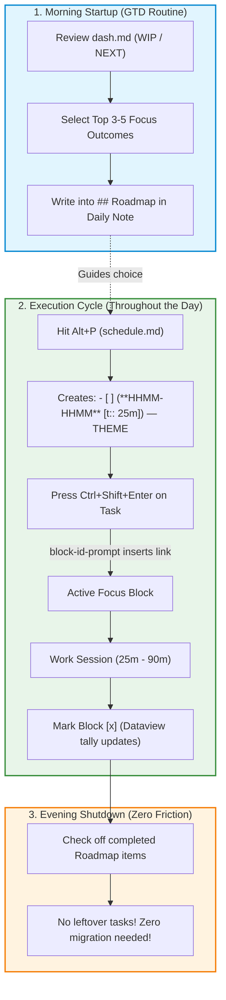

# Daily Pomodoro Tracking, Work Logging, and Roadmap Architecture

**Researcher:** `gem` (5-Researcher Swarm)  
**Target Context:** Bryan's Obsidian Vault (`~/bob`), Daily Notes (`2026/YYYYMMDD.md`), GTD Routines (`gtd_daily.md`), Dashboard (`dash.md`), and Custom Tooling (`block-id-prompt`, `schedule.md`)  
**Date:** September 29, 2026  

---

## 1. Executive Summary & Core Diagnosis

### 1.1 The User's Dilemma
In tracking daily work within the `## Pomodoros` section of Obsidian daily notes (e.g., `~/bob/2026/20260929.md`), the current process has become "a bit chaotic." While there is a strong desire for improved planning and a clear daily roadmap, there is an equal requirement for **simplicity** and low friction, with additional complexity allowed only if strictly justified by tangible utility.

### 1.2 The Root Cause: Conflation of Retrospective Log with Prospective Roadmap
The core diagnostic finding of this research is that the `## Pomodoros` section is currently being forced to fulfill **two opposing architectural roles** within a single list structure:
1. **Retrospective Execution Ledger:** An immutable, chronological audit log of actual focused time spent (`- [x] (**HHMM-HHMM** [t:: 25m]) — CATEGORY`), calculated dynamically via Dataview inline duration queries.
2. **Prospective Daily Backlog / Roadmap:** An uncurated staging menu of candidate work buckets (`- [ ] () — CATEGORY`) containing dozens of unresolved block links (`[[sase#^...]]`, `[[bob#^...]]`).

### 1.3 The "Chaotic" Snowball Mechanism
A forensic analysis of vault git history reveals an acute operational pathology:
- On **September 25, 2026**, a massive staging block of ~20 category headings and 60+ individual task block links was introduced under `## Pomodoros`.
- In practice, a productive engineering workday yields **4 to 8 focused sessions** (covering 1 to 3 core themes). Consequently, 80% to 90% of the staged candidate tasks remain unworked at day's end.
- Because `gtd_daily.md` mandates the daily recurring task:
  ```markdown
  - [ ] #task Migrate unfinished Pomodoro tasks from yesterday’s daily file!
  ```
  this entire unworked mass of ~60 tasks was manually cut-and-pasted across **five consecutive days** (September 25 $\to$ 26 $\to$ 27 $\to$ 28 $\to$ 29).
- What was intended as a "daily roadmap" degraded into a **stale mini-backlog** living inside the daily note, directly duplicating the master project backlogs (`sase.md`, `bob.md`) and the central task cockpit (`dash.md`). This creates visual clutter, false open-task metrics in the Obsidian Tasks plugin, and cognitive fatigue.

### 1.4 The Recommended Solution: Dual-Section Architecture ("Roadmap" + "Pomodoros")
The optimal path forward is **not** more complex tooling, but an elegant **separation of concerns** that directly leverages Bryan's existing custom hotkeys and plugins:
- **Decouple Planning from Execution:** Establish a compact, dedicated `## Roadmap` (or `## Today's Focus`) section in the daily note restricted strictly to **3 to 5 Primary Focus Outcomes / Themes** (the "Rule of 3").
- **Purify the `## Pomodoros` Section:** Return `## Pomodoros` to its true identity as a pure, lightweight **Execution & Time Ledger**. It should only ever contain completed blocks and the *single* currently active block.
- **Retire the Migration Chore:** Eliminate the "Migrate unfinished Pomodoro tasks" checklist item from `gtd_daily.md`. Backlogs belong in `dash.md` and project notes; daily notes are ephemeral execution canvases.
- **Zero Plugin Breakage:** This architectural refinement maintains 100% backwards and runtime compatibility with Bryan's custom `block-id-prompt` plugin (`Ctrl+Shift+Enter`), the `schedule.md` Templater hotkey (`Alt+P`), and the Dataview duration header.

---

## 2. Forensic Analysis of the Current Bob Architecture

To understand why the system feels chaotic, we must analyze the interconnected components of Bryan's personal productivity stack across files, templates, plugins, and git history.

### 2.1 Anatomy of a Daily Note (e.g., `20260929.md`)
The daily file exhibits three distinct functional zones:

```markdown
# 2026-09-29 Tue
[[2026/20260928|prev]]  | [[2026/202630|next]]

- [*] #task [[gtd_daily]] [created::2026-09-29] ^gtd

## Pomodoros (`= durationformat(default(sum(nonnull(map(filter(this.file.tasks, (task) => task.completed AND startswith(meta(task.section).subpath, "Pomodoros")), (task) => task.t))), dur("0m")), "h'h' m'm'")`)

- [x] (**0735-0800** [t:: 25m]) — GOALS
	- 🍅 [[sase_goals#^epic-roadmap]]
	- 🍅 [[bob#^better-roadmaps]]
	- 🍅 [[sase_agent_history#^read-research]]
- [x] (**0830-0945** [t:: 75m]) — GOALS
	- 🍅 [[sase_goals#^epic-roadmap]]
	- 🍅 [[bob#^better-roadmaps]]
	- 🍅 [[sase_agent_history#^read-research]]
...
- [ ] (**1235-1300** [t:: 25m]) — GOALS
	- [[sase_goals#^epic-roadmap]]
	- [[bob#^better-roadmaps]]
	- [[sase_agent_history#^read-research]]
	- [[sase#^fix-telegram-leak]]
- [ ] () — GTD
	- [[#^gtd]]
- [ ] () — SASE
	- [[sase#^recovery-panel]]
	- [[sase#^final-ux]]
	- [[sase#^tui-cli]]
... [20 more category headers and 60+ task links] ...
```

#### Key Mechanics Observed:
1. **Dataview Duration Formula:** The section header dynamically parses all completed tasks in `## Pomodoros` carrying the inline metadata field `[t:: ...]`, computes their sum in minutes, and renders a clean total string like `Pomodoros (1h 55m)`.
2. **Execution Atom:** Completed blocks follow the syntax:
   `- [x] (**HHMM-HHMM** [t:: <dur>]) — <THEME>`
   Sub-bullets under each block record the specific work items completed, prefixed with `🍅` and linked to block IDs in project files (e.g., `🍅 [[sase_goals#^epic-roadmap]]`).
3. **In-Flight Atom:** An active or upcoming block uses an open checkbox with planned timestamps:
   `- [ ] (**1235-1300** [t:: 25m]) — GOALS`
4. **Staging / Candidate Atoms:** Placeholder blocks without timestamps:
   `- [ ] () — <CATEGORY>`
   These serve as holding buckets for tasks Bryan thought he might touch during the day.

### 2.2 Git Archaeology: Tracing the Rollover Phenomenon
Examining the commit logs of the `~/bob` repository reveals the exact timeline of how this planning pattern developed:

| Commit Hash | Date & Time | Action in Daily Notes |
|:---|:---|:---|
| `e4d9d5f8` / `0941eb52` | 2026-09-25 09:35 | First appearance of staged `() — DECKS`, `() — SASE` candidate buckets in `20260925.md`. |
| `2362f37e` | 2026-09-25 21:00 | End of day: Unfinished candidate blocks cut from `20260925.md` and pasted into `20260926.md`. |
| `1e41f081` | 2026-09-26 21:30 | End of day: Unfinished candidate blocks migrated from `20260926.md` into `20260927.md`. |
| `a178e902` | 2026-09-27 21:15 | End of day: Unfinished candidate blocks migrated from `20260927.md` into `20260928.md`. |
| `83646f46` | 2026-09-29 06:36 | Daily note `20260929.md` created with default template. |
| `f17feb08` | 2026-09-29 06:36:49 | Exactly 17 seconds later: Commit `f17feb08` removes the 92-line block of uncompleted tasks from `20260928.md` and pastes it into `20260929.md`. |

**Insight:** Prior to September 25 (e.g., `20260924.md`), daily notes were concise (45 lines, 1.3 KB). At the end of the day, only completed pomodoros remained. Starting September 25, the notes ballooned to 134 lines (3.7 KB) due to the persistent accumulation of candidate tasks that roll over indefinitely.

### 2.3 The Surrounding Tooling Ecosystem
Bryan's daily workflow is deeply integrated with custom tooling:
1. **`obsidian-tasks-plugin` & `dash.md`:** `dash.md` is the central cockpit displaying live queries for `WIP Tasks` (`status.type is IN_PROGRESS`), `NEXT Tasks` (`status.name includes Next`), and `READY Tasks` (`status.type is TODO`).
2. **`gtd_daily.md`:** The daily recurring checklist that drives morning startup:
   - Review calendar and email
   - Import Keep inbox
   - Review `[[dash#READY Tasks|READY]]` tasks
   - Review `[[dash#WIP Tasks|WIP]]` + `[[dash#NEXT Tasks|NEXT]]` tasks and plan daily "Pomodoros"
   - Migrate unfinished Pomodoro tasks from yesterday's daily file
3. **`_templates/schedule.md` (Hotkey `Alt+P`):** A Templater script that prompts for `N` or `N-M` (count and break minutes) and automatically writes `(**HHMM-HHMM** [t:: 25m])` blocks starting from current time.
4. **`block-id-prompt` Custom Plugin (Hotkey `Ctrl+Shift+Enter`):**
   - When Bryan's cursor is on a task in `dash.md` or a project note like `sase.md`, pressing `Ctrl+Shift+Enter` calls `openPomodoroTaskLink()`.
   - The plugin searches today's daily note for `## Pomodoros`.
   - Function `selectPomodoroInsertionTarget()` identifies an open entry:
     - If exactly one timed entry exists (e.g., `- [ ] (**1235-1300** [t:: 25m])`), it selects that entry.
     - Otherwise, it falls back to the first open entry (`openLines[0]`, such as `- [ ] () — ...`).
   - It inserts the wiki link `- [[file#^block-id]]` under that entry and activates the task status.
   - It executes `planFuturePomodoroLinkCleanup()` to remove duplicate links from any subsequent open entries.
   - If the task is already active (`/`), pressing `Ctrl+Shift+Enter` prompts for a work summary!

---

## 3. Deconstruction of the Four Core Pain Points

### Pain Point 1: The Rollover Snowball & GTD Friction
The requirement to "Migrate unfinished Pomodoro tasks from yesterday’s daily file" turns morning planning into an administrative drag. When an engineer faces a wall of 60 uncompleted tasks carried over from yesterday:
- It creates an immediate psychological sense of deficit or backlog failure before the day has even started.
- It blurs the distinction between what is *actually urgent today* versus what was simply copied over from four days ago.
- It duplicates the master backlog: project notes (`sase.md`, `bob.md`) and `dash.md` already track these tasks. Having a third replica in the daily note serves no indexing purpose.

### Pain Point 2: Task Checkbox Pollution & Metric Distortion
In Markdown and Obsidian task engines:
- Every `- [ ] () — CATEGORY` is an unresolved checklist item.
- When plugins like `obsidian-tasks-plugin` or Dataview scan the vault, today's daily note appears to have 25+ open tasks that are not actually actionable tasks, but merely category containers.
- This pollutes task aggregation queries and distorts completion statistics.

### Pain Point 3: Duplication Fatigue & Visual Redundancy
Examining `20260929.md` lines 23–39:
```markdown
- [x] (**0735-0800** [t:: 25m]) — GOALS
	- 🍅 [[sase_goals#^epic-roadmap]]
	- 🍅 [[bob#^better-roadmaps]]
	- 🍅 [[sase_agent_history#^read-research]]
- [x] (**0830-0945** [t:: 75m]) — GOALS
	- 🍅 [[sase_goals#^epic-roadmap]]
	- 🍅 [[bob#^better-roadmaps]]
	- 🍅 [[sase_agent_history#^read-research]]
- [x] (**1150-1205** [t:: 15m]) — GOALS
	- 🍅 [[sase_goals#^epic-roadmap]]
	- 🍅 [[bob#^better-roadmaps]]
	- 🍅 [[sase_agent_history#^read-research]]
- [ ] (**1235-1300** [t:: 25m]) — GOALS
	- [[sase_goals#^epic-roadmap]]
	- [[bob#^better-roadmaps]]
	- [[sase_agent_history#^read-research]]
	- [[sase#^fix-telegram-leak]]
```
When working on a substantive goal across a morning, Bryan is forced to re-list and re-link the exact same 3 tasks across 4 separate time blocks, manually inserting `🍅` on each sub-bullet. This creates repetitive text bloat without adding informational value.

### Pain Point 4: Rigidity vs. Reality (Pomodoro vs. Timeboxing vs. Interstitial Journaling)
Classic Pomodoro (Francesco Cirillo) prescribes rigid 25-minute work intervals separated by 5-minute breaks. But Bryan's actual logged durations tell a completely different story:
- `20260924`: `0900-1215` [t:: **195m**], `1240-1445` [t:: **125m**]
- `20260925`: `0835-1000` [t:: **85m**], `1840-2000` [t:: **80m**]
- `20260927`: `1420-1535` [t:: **75m**], `1635-1800` [t:: **85m**]
- `20260928`: `0525-0630` [t:: **65m**], `1610-1710` [t:: **60m**]
- `20260929`: `0830-0945` [t:: **75m**], `1150-1205` [t:: **15m**]

**The Reality:** Bryan does not work in 25-minute Pomodoro mechanical cycles. He works in **variable-length Deep Work Focus Blocks** interspersed with **Reactive Operations / Firefighting** (restarting failed agents, handling Codex outages, triaging beads).
Attempting to force deep distributed systems engineering into 25-minute boxes creates guilt when a session runs 75 minutes, or requires pretending that an 85-minute block is "a Pomodoro." In reality, Bryan's system is a hybrid of **Timeboxing** and **Interstitial Journaling**.

---

## 4. Methodological Evaluation: Planning vs. Logging Paradigms

To establish a principled foundation for redesign, we evaluate how recognized time-management frameworks address this exact tension:

| Framework | Core Premise | Handling of Planning (Roadmap) | Handling of Execution (Time Log) | Fit for SASE / Autonomous Agent Dev |
|:---|:---|:---|:---|:---|
| **Classic Pomodoro** (Cirillo) | 25m focus / 5m break; tally checkmarks per task. | "Activity Inventory" $\to$ "To Do Today" sheet (max 8-12 poms). | Checkmarks beside planned items; tracking interruptions. | **Poor:** Engineering deep work & multi-agent orchestration cannot be arbitrarily stopped at 25m without heavy cognitive context-switching penalties. |
| **Timeboxing / Time Blocking** (Cal Newport) | Allocate discrete temporal blocks on a calendar/ledger for specific objectives. | Fixed daily schedule grid constructed each morning. | Work within assigned boxes; revise schedule dynamically if interrupted. | **Moderate-High:** Excellent for protecting deep work, but rigid schedules shatter quickly when autonomous agents fail or trigger alerts. |
| **Interstitial Journaling** (Tony Stubblebine) | At every transition, write timestamp, note what was just finished, and note the immediate next action. | Emergent; planned one step at a time at each transition boundary. | Real-time narrative stream combining timestamps, reflections, and next steps. | **High:** Extremely natural for developers and terminal-heavy workflows. Captures interruptions effortlessly. |
| **The Rule of 3 / MIT** (Babauta, J.D. Meier) | Limit daily intentional commitments to exactly 3 significant outcomes. | 3 Most Important Tasks (MITs) defined during morning review. | Any technique (timebox, pomodoro, or flow) used to complete the 3 MITs. | **Very High:** Eliminates choice overload; provides a realistic roadmap that withstands daily chaos. |

### Key Insight: The "Menu vs. Flight Plan" Distinction
- A **Backlog / Menu** (like `dash.md`) answers: *"What could I possibly work on?"*
- A **Daily Roadmap** answers: *"What are the 1 to 3 substantive outcomes that will define success today?"*
- An **Execution Ledger** answers: *"Where did my hours actually go?"*

The failure in Bryan's current layout is using the **Execution Ledger** to store the **Backlog Menu**, leaving no room for a clear **Daily Roadmap**.

---

## 5. Solution Space: Three Candidate Approaches

We evaluate three potential architectural designs ranging from ultra-minimalist to structured.

```
                    ┌────────────────────────────────────────┐
                    │    DESIGN SPECTRUM FOR DAILY TRACKING   │
                    └────────────────────────────────────────┘

    Option A: Ultra-Minimalist       Option B: Dual-Section (RECOMMENDED)      Option C: Query-Driven
    ┌────────────────────────┐      ┌───────────────────────────────┐        ┌────────────────────────┐
    │ Retrospective Log Only │      │ Focus Roadmap + Clean Log     │        │ Embedded Tasks Queries │
    ├────────────────────────┤      ├───────────────────────────────┤        ├────────────────────────┤
    │ • Zero advance staging │      │ • ## Roadmap (Top 3 Focus)    │        │ • ````tasks ... ````   │
    │ • Pure timestamp log   │      │ • ## Pomodoros (Pure Log)     │        │ • Tagged #today        │
    │ • No roadmap in note   │      │ • Clean execution ledger      │        │ • Auto-updating        │
    │                        │      │ • Zero rollover snowball      │        │                        │
    └────────────────────────┘      └───────────────────────────────┘        └────────────────────────┘
       Complexity: LOW                 Complexity: LOW-BALANCED                 Complexity: MEDIUM
       Planning Value: LOW             Planning Value: HIGH                     Planning Value: MEDIUM
```

---

### Option A: The Ultra-Minimalist Retrospective Log
**Concept:** Abandon daily roadmaps inside the daily note entirely. The daily note starts completely empty under `## Pomodoros`. Bryan opens `dash.md` to see what is `WIP` or `NEXT`. Whenever he starts a block, he presses `Alt+P` (`schedule.md`), sets the time, links the task via `Ctrl+Shift+Enter`, and works.

- **Advantages:**
  - Zero rollover: nothing to migrate at night or morning.
  - Simplest possible daily note (15–30 lines max).
  - No checkbox pollution.
- **Disadvantages:**
  - Fails Bryan's explicit desire: *"I feel like I could do a better job of planning... the roadmap for my day."*
  - Provides no visible daily compass when getting derailed by interruptions.

---

### Option B: The Dual-Section Architecture ("Roadmap" + "Clean Pomodoros") — *RECOMMENDED*
**Concept:** Formally split the daily note into two distinct, dedicated sections:
1. `## Roadmap` (or `## Today's Focus`): A tight, structured declaration of **3 to 5 primary tracks/outcomes** for the day.
2. `## Pomodoros`: A clean, pure execution log that contains **only** completed blocks and the *single* currently active block.

```markdown
## Roadmap
- [ ] 🎯 **GOALS**: Plan epic roadmap & complete research [[sase_goals#^epic-roadmap]]
- [ ] 🎯 **DECKS**: Implement card blocks & paging [[sase#^card-blocks]]
- [ ] 🔧 **OPERATIONS**: Agent health & bead triage [[#^gtd]]

## Pomodoros (`= durationformat(...)`)
- [x] (**0735-0800** [t:: 25m]) — GOALS
	- 🍅 [[sase_goals#^epic-roadmap]]
- [ ] (**0830-0945** [t:: 75m]) — GOALS
	- [[sase_goals#^epic-roadmap]]
```

- **Advantages:**
  - **Crystal-Clear Daily Roadmap:** Bryan knows his top priorities at a glance without scrolling through 60 tasks.
  - **Zero Rollover Snowball:** No 60-task graveyard. The candidate staging buckets (`() — SASE`, etc.) are completely eliminated.
  - **Retires Morning Migration Chore:** GTD checklist no longer needs to migrate Pomodoro tasks.
  - **Full Tooling Compatibility:** `block-id-prompt` (`Ctrl+Shift+Enter`), `schedule.md` (`Alt+P`), and the Dataview duration header work out of the box with zero code changes.
  - **Clean Checkbox Counts:** Only actual focus targets and real time blocks have checkboxes.
- **Disadvantages:**
  - Requires a slight mental shift during morning GTD to select 3-5 focus targets instead of dumping entire project categories.

---

### Option C: The Query-Driven Daily Cockpit
**Concept:** Embed dynamic `obsidian-tasks-plugin` queries directly into the daily note (e.g., tasks scheduled for today or tagged `#today`), pulling them live from `sase.md`, `bob.md`, and other project files.

- **Advantages:**
  - Automatic synchronization: completing a task in the project note updates the daily note view without manual copying.
- **Disadvantages:**
  - Queries do not capture intentional sequence or relative weight for the day.
  - Slower mobile/vault rendering performance with multiple embedded queries.
  - Adds unnecessary query complexity when Bryan already has `dash.md` for querying.

---

## 6. Detailed Specification of the Recommended Solution (Option B)

### 6.1 Architectural Overview
The recommended solution restructures the daily note into a harmonious two-stage pipeline: **Intention (Roadmap)** followed by **Execution (Pomodoros)**.



---

### 6.2 The Daily Note Layout
Below is the exact recommended layout for Bryan's daily notes:

```markdown
---
parent: '[[2026/202609]]'
template: "[[daily]]"
alt_file: "[[dash]]"
type: "[[day]]"
created: 2026-09-30T06:30:00-04:00
date: 2026-09-30
aliases:
  - 2026-09-30 Wed
tags:
  - daily
id: 20260930
---

# 2026-09-30 Wed

[[2026/20260929|prev]]  | [[2026/20261001|next]]

- [*] #task [[gtd_daily]] [created::2026-09-30] ^gtd

## Roadmap
- [ ] 🎯 **P1 (Primary):** [[sase_goals#^epic-roadmap]] — Finalize epic roadmap for goals
- [ ] 🎯 **P2 (Secondary):** [[sase#^card-blocks]] — Implement card block parser & paging
- [ ] 🔧 **P3 (Ops / Maintenance):** [[#^gtd]] & SASE agent health monitoring

## Pomodoros (`= durationformat(default(sum(nonnull(map(filter(this.file.tasks, (task) => task.completed AND startswith(meta(task.section).subpath, "Pomodoros")), (task) => task.t))), dur("0m")), "h'h' m'm'")`)

- [x] (**0730-0815** [t:: 45m]) — GTD
	- 🍅 [[#^gtd]]
- [x] (**0830-0945** [t:: 75m]) — GOALS
	- 🍅 [[sase_goals#^epic-roadmap]]
		- Reviewed prior swarm findings and aligned goals persistence model.
- [ ] (**1015-1100** [t:: 45m]) — DECKS
	- [[sase#^card-blocks]]
```

---

### 6.3 Rules of the New Workflow

#### 1. The Rule of 3 for `## Roadmap`
- The `## Roadmap` section contains **at most 3 to 5 items**.
- Structure items by intent:
  - **P1 (The Big Rock):** The single most impactful technical objective of the day.
  - **P2 (Secondary Objective):** A meaningful secondary feature or research task.
  - **P3 (Operational Track):** GTD routines, agent monitoring, or code review.
- Tasks in `## Roadmap` are formatted as standard tasks with block links:
  `- [ ] 🎯 **THEME**: [[project#^task-id]] — Short outcome description`
- When the outcome is achieved during the day, mark it `[x]`!

#### 2. The Strict Boundary for `## Pomodoros`
- **Zero candidate staging lists:** Never insert `- [ ] () — SASE` or empty category buckets into `## Pomodoros`.
- The section contains **only**:
  1. Completed time blocks: `- [x] (**HHMM-HHMM** [t:: <dur>]) — <THEME>`
  2. The single active / upcoming time block: `- [ ] (**HHMM-HHMM** [t:: <dur>]) — <THEME>`
- When sitting down to work:
  - Press `Alt+P` (`schedule.md`) to create the time block.
  - Navigate to the task in `## Roadmap` (or `dash.md`), press `Ctrl+Shift+Enter`. The link is inserted into the open block.
  - Work the session.
  - When finished, mark the block `[x]`. The Dataview duration in the header immediately updates!

#### 3. Solving Subtask Duplication & Emojis
- Stop copying the exact same 3 subtasks across consecutive blocks!
- If an extended deep work session spans multiple blocks under the same theme (e.g., `GOALS`), log the substantive progress notes on the block where they actually occurred rather than cloning identical link lists:
  ```markdown
  - [x] (**0830-0915** [t:: 45m]) — GOALS
      - 🍅 [[sase_goals#^epic-roadmap]]
          - Drafted architecture section.
  - [x] (**0930-1015** [t:: 45m]) — GOALS
      - 🍅 [[sase_goals#^epic-roadmap]]
          - Completed verification requirements.
  ```
- Subtasks that are purely reference links only need to be linked once in the session where they were referenced.

#### 4. Embracing Timeboxing (Liberation from Artificial 25m Chunks)
- Bryan's work naturally fits **45m, 60m, or 75m deep work blocks**.
- `schedule.md` (`Alt+P`) already supports custom intervals, or the duration tag `[t:: 60m]` can be adjusted manually.
- The Dataview sum `durationformat(...)` reads any valid duration (e.g. `15m`, `45m`, `75m`). Bryan should feel completely free to log a continuous 75-minute block as `(**0830-0945** [t:: 75m])` instead of artificially chopping it into three 25-minute entries.

#### 5. Handling Interruptions & Agent Maintenance
- Engineering with autonomous LLM agents involves unpredictable events (e.g., overnight agent failures, API outages).
- When an interruption occurs:
  1. Close or pause the active block.
  2. Start an ad-hoc block: `- [x] (**1420-1455** [t:: 35m]) — RELAUNCH`
  3. Add a quick micro-note: `Restarted 4 failed SASE agents on Apollo.`
  4. Resume the roadmap track.
- This treats interruptions as legitimate, tracked time without wrecking the daily roadmap.

---

## 7. Tooling & Plugin Compatibility Audit

Because Bryan's workflow relies heavily on custom Obsidian plugins and hotkeys, any change must be strictly audited against existing code.

### 7.1 Audit of `block-id-prompt/main.js`
The core insertion logic resides in `selectPomodoroInsertionTarget()`:
```javascript
// From block-id-prompt/main.js (lines 3070-3095):
function selectPomodoroInsertionTarget(lines, section, fencedLines) {
  const openLines = [];
  const timedLines = [];
  for (let line = section.startLine + 1; line <= section.endLine; line++) {
    ...
    if (!isOpenPomodoroStatus(status)) continue;
    openLines.push(line);
    if (hasPomodoroTimeRange(lines[line])) {
      timedLines.push(line);
    }
  }

  if (timedLines.length > 1) {
    return { error: "multiple-open-timed" };
  }

  const entryLine = timedLines.length === 1 ? timedLines[0] : openLines[0];
  ...
  return { entryLine };
}
```

#### Compatibility Verification:
1. **Target Selection:** When Bryan presses `Alt+P` to generate an upcoming block (e.g., `- [ ] (**1000-1025** [t:: 25m]) — GOALS`), `hasPomodoroTimeRange()` matches `timedLines.push()`. Since there is exactly one open timed block, `selectPomodoroInsertionTarget()` selects it with 100% precision.
2. **Duplicate Cleanup:** `planFuturePomodoroLinkCleanup()` searches for duplicate links in subsequent open entries. Under the new architecture, there are no subsequent open candidate entries, so cleanup safely executes as a no-op (0 removed).
3. **Work Summaries:** When pausing an in-progress task (`/`), `openWorkSummaryPrompt()` opens the modal and appends the work summary to the task and the daily note exactly as before.
4. **Link Source Flexibility:** Bryan can press `Ctrl+Shift+Enter` on a task in `dash.md`, in `sase.md`, or directly in the new `## Roadmap` section of the daily note. The plugin resolves the target task and links it into `## Pomodoros` identically.

**Verdict:** Zero code modifications are required in `block-id-prompt`. The plugin actually functions **more reliably** under the new architecture because eliminating 20+ empty `() — ...` entries removes any risk of ambiguous entry selection.

### 7.2 Audit of `_templates/schedule.md` (`Alt+P`)
`schedule.md` prompts for `N` or `N-M` and outputs:
`(**HHMM-HHMM** [t:: 25m])`
This matches the exact syntax expected by `selectPomodoroInsertionTarget()` and Dataview. It remains completely unchanged.

---

## 8. Actionable Implementation Steps

To transition smoothly without disrupting current work, follow these concrete steps:

### Step 1: Update `_templates/daily.md`
Edit `~/bob/_templates/daily.md` to introduce the `## Roadmap` structure and clean the initial `## Pomodoros` state:

```markdown
---
parent: '[[<% moment(tp.file.title, "YYYYMMDD").format("YYYY/YYYYMM") %>]]'
template: "[[daily]]"
alt_file: "[[dash]]"
type: "[[day]]"
created: <% tp.file.creation_date("YYYY-MM-DD[T]HH:mm:ssZ") %>
date: <% moment(tp.file.title, "YYYYMMDD").format("YYYY-MM-DD") %>
aliases:
  - <% moment(tp.file.title, "YYYYMMDD").format("YYYY-MM-DD ddd") %>
tags:
  - daily
id: <% tp.file.title %>
---

# <% moment(tp.file.title, "YYYYMMDD").format("YYYY-MM-DD ddd") %>

[[<% tp.date.now("YYYY/YYYYMMDD", -1, tp.file.title, "YYYYMMDD") %>|prev]]  | [[<% tp.date.now("YYYY/YYYYMMDD", 1, tp.file.title, "YYYYMMDD") %>|next]]

- [*] #task [[gtd_daily]] [created::<% tp.file.creation_date("YYYY-MM-DD") %>] ^gtd

## Roadmap
- [ ] 🎯 **P1:** 
- [ ] 🎯 **P2:** 
- [ ] 🔧 **P3 (Ops):** [[#^gtd]]

## Pomodoros (`= durationformat(default(sum(nonnull(map(filter(this.file.tasks, (task) => task.completed AND startswith(meta(task.section).subpath, "Pomodoros")), (task) => task.t))), dur("0m")), "h'h' m'm'")`)

- [ ] () — GTD
	- [[#^gtd]]
```

*(Note: `- [ ] () — GTD` is retained as the sole initial opening block so that `Ctrl+Shift+Enter` on morning GTD tasks has an immediate target before any timed pomodoro is scheduled).*

### Step 2: Update `gtd_daily.md`
Modify `~/bob/gtd_daily.md` to retire the rollover chore and replace it with intentional roadmap selection:

1. **Delete Line 9:**
   `~~- [ ] #task Migrate unfinished Pomodoro tasks from yesterday’s daily file!~~`
2. **Update Line 24:**
   Change:
   `- [ ] #task Review [[dash#WIP Tasks|WIP]] + [[dash#NEXT Tasks|NEXT]] tasks and plan daily "Pomodoros"`
   To:
   `- [ ] #task Review [[dash#WIP Tasks|WIP]] + [[dash#NEXT Tasks|NEXT]] tasks and set Top 3 Focus Targets in today's [[#Roadmap|Roadmap]]`

### Step 3: Immediate Cleanup of Today's File (`20260929.md`)
For today's daily file:
1. Delete lines 42–134 (the 20 category blocks of unworked staged tasks).
2. Create `## Roadmap` above `## Pomodoros` and list the 3 things that actually matter for today:
   - `[[sase_goals#^epic-roadmap]]` (Goals Roadmap)
   - `[[bob#^better-roadmaps]]` (Roadmap UX Research)
   - SASE Agent Maintenance
3. Notice the immediate drop in cognitive pressure: the file instantly becomes clean, readable, and rewarding.

---

## 9. Summary Comparison Matrix

| Evaluation Dimension | Current Workflow (`20260929.md`) | Proposed Dual-Section Workflow |
|:---|:---|:---|
| **Daily File Size** | 134 lines (~3.7 KB), 80% dead weight | 35–50 lines (~1.2 KB), 100% signal |
| **Morning Planning Overhead** | High: Cut/paste 60 tasks from yesterday | Low: Pick top 3 focus targets from `dash.md` |
| **Evening Shutdown Overhead** | High: Guilt from 50 uncompleted `- [ ]` tasks | Zero: No rollover; clean closure |
| **Roadmap Clarity** | Low: Buried in 22 category headers | High: Top 3 outcomes visible at the top of the file |
| **Task Checkbox Accuracy** | Poor: Dozens of category placeholders pollute task queries | Clean: Checkboxes represent real outcomes & time blocks |
| **Tooling & Hotkey Continuity**| Uses `Ctrl+Shift+Enter`, `Alt+P` | Uses identical `Ctrl+Shift+Enter`, `Alt+P` without changes |
| **Resilience to Interruptions** | Fragile: Giant static list drifts out of sync | Resilient: Interstitial blocks log reality without breaking roadmap |

---

## 10. Conclusion

Bryan does not need a new plugin, a complex time-tracking database, or a rigid scheduling system. His existing custom Obsidian infrastructure (`block-id-prompt`, `dash.md`, `schedule.md`, Dataview durations) is already exceptionally well-designed.

The chaos he feels is entirely the result of **a single structural mistake**: using the daily execution ledger as a dumping ground for the project backlog. 

By cleanly separating the daily note into **`## Roadmap`** (what matters today) and **`## Pomodoros`** (what was actually executed), Bryan achieves:
- **Simpler daily operations:** No more cutting and pasting 60 rollover tasks every morning.
- **Better planning:** Daily focus anchored on 3 primary outcomes rather than an overwhelming 60-item menu.
- **Accurate accountability:** A clean, satisfying retrospective time log that accurately reflects both deep work and operational firefighting.
