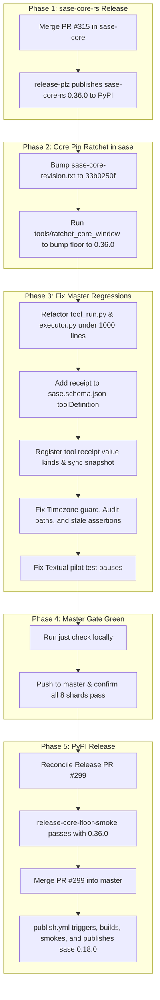

# Research Report: Fixing Master CI and Releasing the Next Version to PyPI

**Author**: `research.2v.gem`  
**Date**: September 28, 2026  
**Target Repository**: `sase-org/sase` (linked: `sase-org/sase-core`)  

---

## 1. Executive Summary

The `sase` project has not released a new version to PyPI in approximately one month (current release is `0.17.1`, whereas pending release is `0.18.0`). Over 840 commits have landed on `master` since the last green CI run on September 18, 2026. The `Master Gate` CI workflow is consistently red across multiple jobs on every commit, and the pending release pull request (`#299 chore(master): release 0.18.0`) is blocked with failing checks (`mergeStateStatus: UNSTABLE`).

Our investigation reveals that the release outage is caused by an interrelated chain of two distinct issues:

1. **The PyPI Release Floor Blocker**: `sase` cannot release a new version to PyPI until `sase-core-rs 0.36.0` is published to PyPI. Recent commits to `sase` require at least 10 new Rust core bindings (`tool_run_briefs`, `managed_tmp_roots`, `canonicalize_agent_tab_name`, `goal_card_view`, etc.). When CI tests a release candidate (`release-core-floor-smoke` in `ci.yml` and `install-smoke-core-floor` in `publish.yml`), it installs the current PyPI release of `sase-core-rs` (`0.35.1`), which is missing these bindings and causes an immediate fatal error. In the linked repository `sase-org/sase-core`, PR #315 (`chore: release v0.36.0`) is pending to publish `0.36.0` to PyPI.
2. **Master Gate Failures**: Even within the repository workspace, `master` is failing 12 distinct lint and test checks across 6 shards. These include unratcheted core pins (`sase-core-revision.txt`), file line limit violations (`toobig`), missing properties in the JSON schema (`sase.schema.json`), uncaptioned CLI completion value slots, stale test assertions, unreviewed marker path passing sites, timezone display guard violations, and Textual async timing issues.

Once `sase-core-rs 0.36.0` is published to PyPI and the 12 master regressions are resolved, `Master Gate` will turn green, PR #299 will pass `release-core-floor-smoke`, and the automated release-please pipeline in `publish.yml` will cleanly cut and publish `sase 0.18.0` to PyPI.

---

## 2. Release & CI Pipeline Architecture

Understanding how SASE cuts releases and enforces CI gates is essential to resolving the blockage.

### 2.1 The Two-Speed CI Architecture
Per decision records `ci-two-speed-split` and `check-full-is-explicit`:
- **`master-gate.yml`**: Triggers on every push to `master`. It is bounded by SHA (never cancelled) and consists of:
  - `core-wheel`: Resolves `sase-core-revision.txt`, checks out that commit of `sase-org/sase-core`, builds the `sase_core_rs` abi3 wheel and `sase-xprompt-lsp` binary, and caches/uploads them.
  - `lint`: Runs keep-sorted, ruff, mypy, flags integrity, pyscripts validation, test-waits audit, changelog validation, patch/stitch terminology audit, symvision unused symbols check, and line count checks (`_lint-toobig`).
  - `test`: Runs 8 deterministic, timing-balanced shards of the fast test suite (`SHARD_COUNT: 8`).
- **`ci.yml`**: Triggers on pull requests. Contains full lint, test, contention, perf floor, and release smoke jobs.
- **`publish.yml`**: Scheduled every 3 hours (`17 */3 * * *`) and manually dispatchable via `workflow_dispatch`.

### 2.2 The PyPI Release Mechanism (`publish.yml`)
SASE delegates versioning and changelog management to Google's `release-please`:
1. `release-please` inspects conventional commits on `master` and maintains a release pull request on branch `release-please--branches--master` (currently PR #299, titled `chore(master): release 0.18.0`).
2. The `sync-release-metadata` job in `publish.yml` reconciles `pyproject.toml` and `uv.lock` on that branch by calling `python tools/ratchet_core_window`.
3. When PR #299 is merged into `master`, the next run of `publish.yml` detects `release_created=true`.
4. It builds distribution artifacts (`uv build`, `twine check dist/*`).
5. **Critical Gate**: `install-smoke` and `install-smoke-core-floor` install the built `sase` wheel into fresh virtual environments. Specifically, `install-smoke-core-floor` resolves the published `sase-core-rs` floor from `pyproject.toml` and installs `sase-core-rs==${CORE_MINIMUM}` from PyPI, verifying `sase core health --json` and all required bindings.
6. `publish` uploads the verified artifacts to PyPI via `pypa/gh-action-pypi-publish`.

---

## 3. Root Cause Analysis: PyPI Release Blocker

### 3.1 The `sase-core-rs` Skew
On PR #299, check `CI/release-core-floor-smoke` failed with:
```
sase_core_rs 0.35.1 is missing 10 of 725 required binding(s):
  build_agent_tab_catalog
  canonicalize_agent_tab_name
  launch_scratch_liveness_wire_schema_version
  managed_tmp_roots_list
  managed_tmp_roots_register
  managed_tmp_roots_wire_schema_version
  observe_launch_scratch_liveness
  tool_run_briefs
  tool_run_live_glance
  tool_run_node_summaries
```
These 10 bindings represent features added to SASE over the past month:
- Tool run glance/briefs/node-summaries (epic `sase-1bt`)
- Managed tmp roots registry (epic `sase-1bf`)
- Launch scratch liveness probes
- `%tab` directive and agent tab catalog (epic `sase-1bc.4`)

While the Rust implementations of these bindings were merged into `sase-org/sase-core` master, `sase-core-rs` version `0.36.0` was **never published to PyPI**. The latest version available on PyPI remains `0.35.1`.

Because `sase` declares `sase-core-rs` as a runtime dependency and `release-core-floor-smoke` tests against actual PyPI packages, **no new version of `sase` can be published to PyPI until `sase-core-rs 0.36.0` is published to PyPI**.

### 3.2 Pending Release in `sase-core`
In repository `sase-org/sase-core`, PR #315 (`chore: release v0.36.0`) was generated by `release-plz` and includes all of the above bindings, plus the very latest commit `33b0250` (`feat(goals): make goal a first-class builtin artifact kind in sase-core (sase-1bu.6)`). Once PR #315 is merged, `release-plz` will publish `sase-core-rs 0.36.0` to PyPI.

---

## 4. Root Cause Analysis: Master Gate CI Failures

Even with a locally built core wheel, `Master Gate` CI on `master` fails with 12 distinct issues across lint and test shards. Every failure has been isolated and analyzed:

### 4.1 Failure 1: Unratcheted `sase-core-revision.txt`
- **Job**: `lint` (and `tests/goals/test_goal_artifact_kind.py`)
- **Error**:
  ```
  [validate_sase_core_rs] missing required binding(s): goal_card_view, goal_card_markdown, goal_citation_line
  ```
- **Analysis**: Commit `17d2beb767` (`sase-1bu.6`) in `sase` added `goal_card_view`, `goal_card_markdown`, and `goal_citation_line` to `tools/validate_sase_core_rs` and added `test_goal_artifact_kind.py`. In `sase-core`, commit `33b0250` added those exact bindings to `sase_core_py`. However, `sase-core-revision.txt` in `sase` still pointed to `cbe70f66fb28a6b14a023a1458f26cf0f75de911` (the commit before `33b0250`). In CI, `core-wheel` builds against `sase-core-revision.txt`, producing a wheel that lacks those 3 functions.
- **Remedy**: Bump `sase-core-revision.txt` to `33b0250f91b81ebe9913796574e5faf787f741cf`.

### 4.2 Failure 2: `toobig` File Length Violations
- **Job**: `lint` (`_lint-toobig`)
- **Error**:
  ```
  ERROR: VIOLATION: src/sase/core/tool_run.py has 1154 lines (limit: 1000)
  ERROR: VIOLATION: src/sase/tool/executor.py has 1175 lines (limit: 1000)
  ERROR: Found 2 file(s) exceeding line limit of 1000
  ```
- **Analysis**: Recent feature additions (`89e4882803`, `5c54e6c14b`, `281147666b`, `ff5412bbb6`) expanded `tool_run.py` to 1,154 lines and `executor.py` to 1,175 lines. The `_lint-toobig` recipe enforces a strict 1,000 line limit.
- **Remedy**: Refactor `src/sase/core/tool_run.py` by extracting ledger query/projection routines into a sibling module (e.g. `src/sase/core/tool_run_projections.py`), and refactor `src/sase/tool/executor.py` by extracting reporting and settlement helpers into focused submodules under 500 lines.

### 4.3 Failure 3: `sase.schema.json` Missing `receipt` on `toolDefinition`
- **Job**: `test (2)`
- **Error**: `tests/test_config_schema_tools.py::test_project_sase_yml_matches_public_schema`
  ```
  jsonschema.exceptions.ValidationError: Additional properties are not allowed ('receipt' was unexpected)
  On instance['tools']['check']
  ```
- **Analysis**: Commit `3065117500` removed the beta feature flag for tool receipts and declared the `receipt` policy directly under `tools.check` in `sase/sase.yml`. However, the author updated `sase/sase.yml` without adding the `receipt` property to `"toolDefinition"` in `src/sase/config/sase.schema.json`.
- **Remedy**: Add the `receipt` property definition (object with `accept` array and `ttl` string) to `toolDefinition` in `src/sase/config/sase.schema.json`.

### 4.4 Failure 4: Missing Completion Slot Kinds for `tool receipt(s)`
- **Job**: `test (2)` & `test (3)`
- **Error**:
  ```
  FAILED tests/completion/test_kind_coverage.py::test_every_value_slot_is_kinded_choiced_or_hinted
  AssertionError: uncaptioned completion value slots: tool/receipt:tool_receipt_tool, tool/receipts:tool_receipts_days
  FAILED tests/completion/test_snapshot.py::test_checked_in_snapshot_has_no_drift
  FAILED tests/completion/test_snapshot.py::test_current_structural_view_matches_checked_in_snapshot
  ```
- **Analysis**: Subcommands `sase tool receipt` and `sase tool receipts` were added to the CLI parser, but their positional and option arguments were never assigned completion value kinds or hints in `src/sase/completion/kinds.py`, and the CLI completion snapshot was not synced.
- **Remedy**:
  1. In `src/sase/completion/kinds.py`, map `tool_receipt_tool` to `ValueKind.TOOL` (or path override) and `tool_receipts_days` to `ValueKind.INTEGER` / hint.
  2. Run `just sync-completion-spec` to regenerate `src/sase/completion/snapshot.json`.

### 4.5 Failure 5: Agent Completion Candidate Regression from `%tab`
- **Job**: `test (2)`
- **Error**: 9 tests failed in `tests/ace/tui/test_agent_completion.py`, e.g.:
  ```
  AssertionError: assert ['main', 'foo.plan', ...] == ['foo.plan', ...]
  AssertionError: assert [('tribe', '@builders'), ('tab', 'main'), ...] == [('tribe', '@builders'), ('clan', 'review'), ...]
  ```
- **Analysis**: Commit `372ecc97c3` implemented the `%tab` directive (epic `sase-1bc.4`). It updated `build_agent_completion_candidates()` to invoke `_build_tab_completion_candidates()`, which automatically injects a candidate named `'main'` with kind `'tab'`. The older tests in `test_agent_completion.py` expected the candidate list without tab candidates.
- **Remedy**: Update `tests/ace/tui/test_agent_completion.py` test cases to account for tab candidates, or restrict tab candidate emission when no explicit tabs are defined.

### 4.6 Failure 6: `MagicMock` Missing `agent_meta`
- **Job**: `test (6)`
- **Error**: 6 tests failed in `tests/test_axe_run_agent_exec_repeat_env.py`:
  ```
  AttributeError: Mock object has no attribute 'agent_meta'. Did you mean: 'agent_model'?
  ```
- **Analysis**: Commit `372ecc97c3` added `_export_exec_agent_tab(ctx, ...)` in `src/sase/axe/run_agent_exec.py`, which accesses `ctx.agent_meta`. In `test_axe_run_agent_exec_repeat_env.py`, `ctx = MagicMock(spec=AgentExecContext)` is created. Because `agent_meta` was not explicitly populated on the mock instance, accessing it under `spec=AgentExecContext` raises an `AttributeError`.
- **Remedy**: Set `ctx.agent_meta = {}` in `tests/test_axe_run_agent_exec_repeat_env.py` wherever `ctx = MagicMock(spec=AgentExecContext)` is created.

### 4.7 Failure 7: Outdated Text Assertion in Getting Started Docs Test
- **Job**: `test (6)`
- **Error**: `tests/test_docs_getting_started_providers.py::test_getting_started_muse_grok_wording_separates_provider_selection`
  ```
  assert 'Grok Build can still be reached automatically through the shipped `@small`, `@medium`, and `@large` pools, and through `@xlarge` when Claude and Codex are unavailable' in text
  ```
- **Analysis**: Commit `90d6138504` rephrased `docs/getting_started.md` to:
  `"Both can still be reached automatically through whichever shipped size aliases currently target them (see the generated [shipped size-alias defaults](llms.md#implicit-role-aliases)); override llm_provider.model_aliases.builtin.<size> to change that."`
  The test was not updated to reflect the new documentation text.
- **Remedy**: Update the assertion in `tests/test_docs_getting_started_providers.py` to match the current documentation.

### 4.8 Failure 8: Stale Trash Limit Assertion
- **Job**: `test (7)`
- **Error**: `tests/ace/tui/actions/test_prompts_overlay_entry_points.py::test_open_action_opens_overlay_on_stash_with_trash_count`
  ```
  assert modal._trash_limit == 20
  E assert 100 == 20 (+ where 100 = PromptsModal()._trash_limit)
  ```
- **Analysis**: Commit `1ec4569d87` increased the Prompt Trash limit from 20 to 100, but missed updating this test assertion.
- **Remedy**: Update line 117 to `assert modal._trash_limit == 100`.

### 4.9 Failure 9: Directive Completion Collision with `%tab`
- **Job**: `test (7)`
- **Error**:
  ```
  FAILED tests/ace/tui/widgets/test_directive_completion_candidates.py::test_removed_auto_approval_directives_are_absent_from_completion
  FAILED tests/ace/tui/widgets/test_directive_completion_candidates.py::test_removed_tribe_spellings_are_absent_from_completion
  ```
- **Analysis**: These tests tested prefixes `%ta` and `%t` expecting an empty list to verify that obsolete directives `%tale` and `%tribe` were absent. When `%tab` was introduced, `%ta` and `%t` now validly match `%tab`.
- **Remedy**: Update the tests to check `%tale` and `%tribe` explicitly, or test non-colliding prefixes.

### 4.10 Failure 10: Unreviewed Marker Path Passing Sites
- **Job**: `test (4)`
- **Error**: `tests/test_agent_artifact_marker_path_passing_audit.py::test_tracked_marker_path_passing_sites_are_reviewed`
  ```
  Extra items in the left set:
  'src/sase/axe/run_agent_directive_metadata.py:session_root_tab'
  'src/sase/finalizers/cli.py:_target_for_dir'
  ```
- **Analysis**: SASE maintains an architectural audit test ensuring all sites that pass paths to artifact markers are reviewed. New code added in `run_agent_directive_metadata.py` and `finalizers/cli.py` touched path-passing code but did not register the sites in the reviewed set.
- **Remedy**: Add both entries to `_REVIEWED_PATH_PASSING_CONTEXTS` in `tests/test_agent_artifact_marker_path_passing_audit.py`.

### 4.11 Failure 11: System Clock Display Guard Violations
- **Job**: `test (7)`
- **Error**: `tests/test_timezone_display_guard.py::test_no_system_clock_display_sites`
  ```
  src/sase/ace/tui/tool_runs/blocks.py:153: datetime.fromtimestamp(float(first_seen)).strftime(...)
  src/sase/ace/tui/update_gear.py:80, 81, 111: datetime.fromtimestamp(...) / datetime.now()
  src/sase/ace/tui/update_panel_state.py:142, 143: datetime.fromtimestamp(...)
  src/sase/tool/view_vocabulary.py:131: datetime.fromtimestamp(settled_ts).strftime("%H:%M")
  ```
- **Analysis**: Per SASE rules, display times must be rendered through `sase.core.time` (e.g. `format_local_time`, `local_datetime`) rather than unmanaged system-clock `datetime.fromtimestamp()` to respect user-configured timezones and mockable clocks.
- **Remedy**: Route timestamp formatting in these 4 files through `sase.core.time` utilities.

### 4.12 Failure 12: Timing / Flaky Tests in Textual Pilots
- **Job**: `test (4)` & `test (5)`
- **Error**:
  - `tests/ace/tui/widgets/test_agent_header_panel.py::test_expanded_overflowing_header_claims_half_page_scroll` fails with `assert 2.0 == 0.0`.
  - `tests/ace/tui/command_line/test_chrome_layout.py` occasionally fails on terminal resize (`assert 134 > 134` or `assert 200 == 96`).
- **Analysis**: In `test_agent_header_panel.py`, `main_view.pin_to_bottom()` triggers a deferred layout update. The test immediately sampled `deck_y = float(deck_scroll.scroll_y)` without yielding to Textual with `await pilot.pause()`. The subsequent scroll action allowed the layout update to process, shifting `scroll_y` to `2.0`. In `test_chrome_layout.py`, resizing the terminal via `pilot.resize_terminal()` is asynchronous; under heavy CI load, the widget outer width did not update before assertions ran.
- **Remedy**:
  - In `test_agent_header_panel.py:694`, add `await pilot.pause()` immediately after `main_view.pin_to_bottom()`.
  - In `test_chrome_layout.py`, ensure terminal resizes wait until the frame's outer width settles.

---

## 5. Recommended Solution & Execution Roadmap

To fix master CI and release the next version of `sase` to PyPI, follow this sequenced plan:



### Detailed Action Steps

#### Step 1: Land and Publish `sase-core-rs 0.36.0`
1. In repository `sase-org/sase-core`:
   - Verify PR #315 includes commit `33b0250` (`goal_card_view`, `goal_card_markdown`, `goal_citation_line`).
   - Merge PR #315 to master.
   - Wait for `release-plz` workflow to build wheels and upload `sase-core-rs==0.36.0` to PyPI.
   - Confirm availability: `pip index versions sase-core-rs`.

#### Step 2: Update Core Pin and Floor in `sase`
1. Update `sase-core-revision.txt` to `33b0250f91b81ebe9913796574e5faf787f741cf`.
2. Run:
   ```bash
   python tools/ratchet_core_window --allow-transitive-lock-refresh
   ```
   This updates `pyproject.toml` to `sase-core-rs>=0.36.0,<0.37.0` and updates `uv.lock`.

#### Step 3: Implement Code Fixes in `sase`
1. **Line limits (`_lint-toobig`)**:
   - Extract ledger reading/projection code from `src/sase/core/tool_run.py` to `src/sase/core/tool_run_projections.py`.
   - Extract reporting and settlement helpers from `src/sase/tool/executor.py` into `src/sase/tool/executor_settle.py`.
   - Run `just _lint-toobig` to confirm both files are well under 1,000 lines.
2. **Schema validation**:
   - In `src/sase/config/sase.schema.json`, add `"receipt"` to `"toolDefinition"` properties:
     ```json
     "receipt": {
       "type": "object",
       "additionalProperties": false,
       "properties": {
         "accept": {
           "type": "array",
           "items": { "type": "string", "enum": ["pass", "no_new_failures"] }
         },
         "ttl": { "type": "string" }
       }
     }
     ```
   - Verify: `pytest tests/test_config_schema_tools.py`.
3. **CLI Completion**:
   - In `src/sase/completion/kinds.py`, add `tool_receipt_tool` and `tool_receipts_days`.
   - Run `just sync-completion-spec`.
   - Verify: `pytest tests/completion/`.
4. **Timezone Guard**:
   - Update `src/sase/ace/tui/tool_runs/blocks.py`, `src/sase/ace/tui/update_gear.py`, `src/sase/ace/tui/update_panel_state.py`, and `src/sase/tool/view_vocabulary.py` to call `sase.core.time` instead of bare `datetime.fromtimestamp` / `datetime.now()`.
   - Verify: `pytest tests/test_timezone_display_guard.py`.
5. **Path Audit**:
   - Add the two missing call sites to `_REVIEWED_PATH_PASSING_CONTEXTS` in `tests/test_agent_artifact_marker_path_passing_audit.py`.
   - Verify: `pytest tests/test_agent_artifact_marker_path_passing_audit.py`.
6. **Test Stale Assertions & Mocks**:
   - In `tests/ace/tui/actions/test_prompts_overlay_entry_points.py:117`, change `20` to `100`.
   - In `tests/test_docs_getting_started_providers.py`, update the asserted string to match `docs/getting_started.md`.
   - In `tests/test_axe_run_agent_exec_repeat_env.py`, set `ctx.agent_meta = {}`.
   - In `tests/ace/tui/widgets/test_directive_completion_candidates.py`, update prefixes for removed directives.
   - In `tests/ace/tui/test_agent_completion.py`, update expected candidates to accommodate the `tab` candidate `'main'`.
   - In `tests/ace/tui/widgets/test_agent_header_panel.py:694`, add `await pilot.pause()` after `main_view.pin_to_bottom()`.

#### Step 4: Validate and Land on `master`
1. Run `just check` locally. Verify all lint checks and test shards pass cleanly.
2. Commit and land on `master`.
3. Monitor GitHub Actions `Master Gate` to ensure a green build (`✓`).

#### Step 5: Finalize PyPI Release
1. Run the `Publish` workflow via `workflow_dispatch` (or wait for the 3-hour schedule). Release Please will refresh PR #299 with all commits up to the new green master HEAD.
2. In PR #299, verify that `release-core-floor-smoke` passes (since `sase-core-rs 0.36.0` is now on PyPI).
3. Merge PR #299 into `master`.
4. The `Publish` workflow will run automatically on the merge commit, execute `build`, pass `install-smoke` and `install-smoke-core-floor`, and publish `sase 0.18.0` to PyPI.
