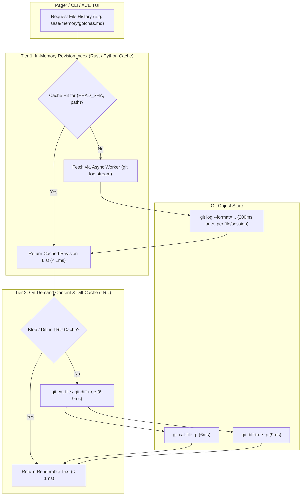
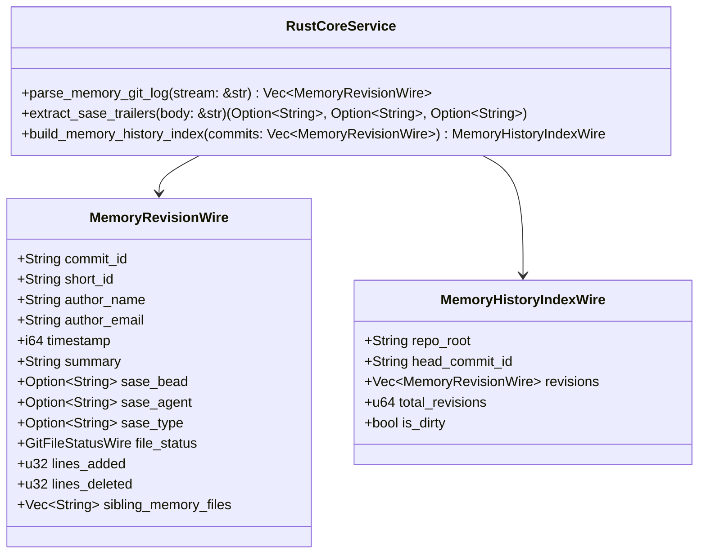

# Research & Architecture Design: Memory File Versioning, Fast Revision Indexing, and Pager-Centric UX

- **Author:** researcher gem (`research.t.gem`)
- **Date:** 2026-09-30
- **Context:** SASE Memory Subsystem & Pager Reading Surface Enhancement
- **Target Audience:** SASE Core Team, Lead Synthesizer, System Architects
- **Status:** Complete Research Proposal & Critique

---

## 1. Executive Summary

In Structured Agentic Software Engineering (SASE), memory notes under `sase/memory/` and agent instruction files (specifically root and subproject `AGENTS.md`) define the operational contract, architectural decisions, and behavioral guardrails for all AI agent runs. Every future agent pays for these files on every turn. As the project evolves, memory rules are authored, decisions are recorded or superseded, gotchas are added or trimmed, and instructions are periodically republished via `sase memory init`.

However, **memory change observability is currently a black box**:
1. Agents and human developers reading a rule in `sase/memory/gotchas.md` or a decision in `sase/memory/decisions/` have no in-situ mechanism to know *when* that rule was introduced, *why* it was altered, or *which bead/agent* modified it.
2. An agent auditing past decisions must resort to raw `git log` shell commands, which pollute the context window, lack SASE bead/agent trailer awareness, and miss multi-repo context (e.g. `chezmoi`-backed home memory).
3. The SASE pager (`src/sase/pager/`), which serves as the central, keyboard-driven reading surface across the CLI and ACE TUI, treats memory documents as static snapshots, completely disconnected from their evolutionary history.

### Core Verdict & High-Level Recommendations

1. **Leveraging Git History is 100% Sound**: SASE's commit history already provides an immutable, cryptographically verifiable DAG of changes, enriched with structured commit trailers (`SASE_BEAD`, `SASE_TYPE`, `SASE_AGENT`). Building an external version database (such as SQLite or custom JSON logs) would introduce split-brain risks, synchronization bugs on rebase/checkout/cherry-pick, and cross-workspace locking overhead.
2. **Two-Tier Ephemeral Index over Heavy Persistent Storage**: Benchmark testing shows that while full `git log` commit tree walking takes ~250ms (too slow for 60fps synchronous UI scrubbing), individual blob extraction (`git cat-file -p`) takes only 6ms, and unified diff extraction (`git diff-tree`) takes 9ms. A persistent SQLite index violates Decision 19 (`corpus-before-mechanism`). Instead, a lightweight **In-Memory Session Index** managed by Rust `sase_core` and cached on `(HEAD_SHA, path, mtime)` provides sub-millisecond scrubbing with zero cache invalidation hazards.
3. **Refining the "Pager as Main Interface" Vision**:
   - *Where the Pager Shines*: Deep in-situ inspection, time-travel scrubbing (`[` and `]`), instant unified diff toggling (`d`), and git blame gutters (`B`).
   - *Where the Pager Fails on Its Own*: A document pager views one document at a time. It cannot solve **discovery** ("What memory files changed this week across the project?") and obscures **multi-file commit atomicity** (e.g., when a decision strand, its index entry in `decisions.md`, and `AGENTS.md` are all updated together in one commit).
   - *The Solution*: Make the Pager the **primary inspection and time-travel reading surface**, complemented by a high-level **Memory History Feed** in the CLI (`sase memory history`) and ACE TUI Memory Panel, plus **Sibling File Jump Links** within the pager chrome.
4. **Scope Hygiene**:
   - **Provider Shims (`CLAUDE.md`, `GEMINI.md`, etc.)**: Must **not** be tracked as independent version histories. They are 1:1 mechanical clones of `AGENTS.md` generated by `sase memory init`. Tracking them separately multiplies commit noise by 5x with zero added value.
   - **Multi-Repo Architecture**: The versioning engine must automatically route history queries between the project git repository and Bryan's `chezmoi` repository (`~/.local/share/chezmoi`) for home memory notes (`~/AGENTS.md`, `~/.config/sase/memory/`).

---

## 2. In-Depth Critique of the Proposed Plan

### 2.1 Is Using Git History for Version Control a Good Idea?

**Verdict: Strongly Recommended (with specific edge-case protections).**

#### Advantages
- **Zero Storage Overhead & Zero Duplication**: Every edit to `sase/memory/` and `AGENTS.md` is committed to Git. We get full content hashing, parentage, timestamps, author identity, and commit subjects for free.
- **Rich Existing Metadata**: In SASE, commits authored by agents or humans already follow strict Conventional Commit standards and include machine-readable trailers:
  ```git
  feat(memory): record machine-link and explicit-handoff decisions
  
  SASE_BEAD=[sase-1ae.3][1]
  SASE_TYPE=stitch
  SASE_AGENT=[bbugyi200.athena.sase-1ae.3][2]
  ```
  Extracting these trailers unlocks immediate relational jumps between memory edits, task beads, and agent sessions without any auxiliary database.
- **Branch and Workspace Coherence**: SASE agents execute inside ephemeral clones (`sase_<N>`). An external database located on the host would struggle with path translations, branch divergence, and lock contention between concurrent agents. Git's object store is local, hermetic, and guaranteed to match the workspace's exact checkout state.

#### Edge Cases to Guard Against
1. **Dirty Working Trees**: When an agent edits a memory file before committing, the working tree differs from `HEAD`. The versioning system must treat `WORKING TREE` as revision `#0` (or `HEAD+1`), allowing instant diff comparison between uncommitted changes and `HEAD`.
2. **Shallow Clones**: If SASE or a CI runner performs a shallow clone (`--depth N`), historical commits beyond depth `N` may be missing. The system must degrade gracefully, indicating that earlier history is truncated.
3. **Multi-Repo / Scope Boundaries**: Memory documents exist in multiple scopes:
   - `project`: `AGENTS.md` and `sase/memory/*.md` (Project root Git repo).
   - `project-subdir`: `src/sase/ace/AGENTS.md`, `demos/talks/demos/AGENTS.md` (Project root Git repo).
   - `home`: `~/AGENTS.md` and `~/.config/sase/memory/*.md` (Managed via `chezmoi` Git repo at `~/.local/share/chezmoi/home`).
   The versioning engine must locate the enclosing Git root for each target file.

---

### 2.2 The Indexing Question: How to Achieve Instant Navigation

The user prompt notes:
> "...we need to be able to navigate between the different versions for each supported file very quickly (so we might need to create an index or something--think hard about the best way to solve this)."

#### Empirical Performance Benchmarks (Measured on Live SASE Repository)

To ground this architectural decision in empirical data, benchmarks were run on the current `sase` workspace:

| Operation | Command | Execution Time | Output Size / Details |
|---|---|---|---|
| Single-file git log | `git log --oneline -n 50 -- sase/memory/gotchas.md` | **245 ms** | 7 commits |
| Agent docs git log | `git log --oneline -n 50 -- AGENTS.md` | **77 ms** | 50 commits |
| Full memory history | `git log --oneline --name-status -- sase/memory AGENTS.md` | **251 ms** | 343 commits across repo history |
| Historical blob read | `git cat-file -p 50d9c3bc21:sase/memory/gotchas.md` | **6 ms** | Full historical file content |
| Historical commit diff | `git diff-tree -p -u 50d9c3bc21 -- sase/memory/gotchas.md` | **9 ms** | Exact unified diff hunk |

#### The Performance Dilemma
- **250 ms is too slow for interactive TUI scrubbing**: If a user holds `[` or repeatedly taps `[`/`]` to scrub through versions in the pager, running `git log` synchronously on each keystroke drops frames, stalls the Textual event loop, and causes noticeable UI stutter.
- **250 ms is too fast to justify a heavy persistent database**: There are only 343 commits touching memory in the entire multi-year history of SASE! Even a decade of development will rarely produce more than 2,000 memory commits. Introducing a persistent SQLite database or on-disk JSON index violates:
  - Decision 19: `corpus-before-mechanism` ("SASE does not build memory retrieval or linking machinery ahead of a corpus that demonstrably needs it").
  - Maintenance overhead: On-disk indexes require invalidation hooks on `git commit`, `git rebase`, `git checkout`, `git pull`, and workspace creation.

#### The Recommended Indexing Architecture: Two-Tier Ephemeral Cache



1. **Tier 1: In-Memory Revision Metadata Index**:
   - Structured in Rust `sase_core` (or Python facade) as:
     `dict[tuple[HeadSha, Path], tuple[RevisionEntry, ...]]`.
   - On the first open of a memory file in the pager, an asynchronous background task calls:
     `git log --date=iso-strict --format=format:%H%x00%h%x00%an%x00%at%x00%s%x00%b%x1e --name-status -- <path>`.
   - Parsing the stream in Rust takes **< 1 ms**.
   - Total memory footprint for all 343 memory commits in SASE: **< 150 KB RAM**.
   - Cache key is `(HEAD_SHA, path, file_mtime)`. When HEAD changes, only outdated entries refresh.
2. **Tier 2: LRU Content & Diff Cache**:
   - When a user scrubs to revision `k`, content is fetched via `git cat-file -p <sha>:<path>` (6 ms).
   - When viewing diff mode, diff is fetched via `git diff-tree -p -u <sha> -- <path>` (9 ms).
   - An in-memory LRU cache stores the last 50 viewed revisions. Back-and-forth scrubbing between already-viewed revisions is **0 ms (instantaneous)**.

---

### 2.3 Critique of "Pager as the Main Interface"

The user prompt suggests:
> "I was thinking that we could add some sort of special support to sase's pager for memory files / agent instruction files and make that the main interface for navigating / viewing memory change history. Think hard about what the best UX for this looks like."

#### Where the Pager is Brilliant
- **In-Situ Reading Experience**: When reading a memory file, you want to see the text formatted, syntax-highlighted, and readable at full terminal width. The pager already provides markdown syntax highlighting, link scanning, and jump hints.
- **Seamless Modal Continuity**: The pager is already invoked throughout SASE (`sase pager`, ACE TUI log viewer, bead attachment reader). Adding version browsing keeps developers in an environment they already know.
- **Non-Destructive Time Travel**: Users can step backward in time, read older instructions, follow historical link anchors, and return to the present with a single keystroke (`~` or `q`).

#### The Critical Flaws of Pager-Only Navigation
1. **The Discovery Blind Spot**:
   A pager requires a target file: `sase pager <file>`. If an agent or human does not know *which* memory file changed, the pager cannot help them.
   *Example*: "An agent started failing yesterday. What memory rules or decision strands were added or modified in the last 48 hours?"
   Opening a pager on `gotchas.md` will never reveal that `decisions/hold-pull-fail-open.md` was added yesterday.
2. **The Multi-File Atomicity Blind Spot**:
   In SASE, memory modifications are almost always multi-file commits:
   - Example (Commit `ade28c173a`): Modified `AGENTS.md`, `sase/memory/README.md`, `sase/memory/glossary.md`, and added `prompt-stash.md` and `stash-trash.md`.
   If a user views `glossary.md` in the pager, viewing only `glossary.md`'s diff obscures the fact that two new glossary strands were created in the same atomic commit.

#### The Recommended Synthesis: Pager as Inspection Engine + Timeline Feeds
To make this system truly powerful, we must provide:
1. **The Pager as the Deep Inspection Surface**: Single-file time travel, diff toggling, and visual blame.
2. **Sibling Links in Pager Chrome**: When viewing revision `k` in the pager, the header displays interactive jump labels to any other memory files changed in that same commit!
3. **Discovery Entry Points**:
   - CLI: `sase memory history` (lists recent memory commits across the repository).
   - ACE TUI: A "History" mode / tab in the existing Memory Modal (`src/sase/ace/tui/modals/memory_panel.py`) which opens the Pager pre-loaded at the chosen commit.

---

### 2.4 Scope and Requirement Refinements

1. **Filter Out Provider Shims from Independent Versioning**:
   - `CLAUDE.md`, `GEMINI.md`, `QWEN.md`, `OPENCODE.md` are byte-for-byte replicas of `AGENTS.md` generated by `sase memory init`.
   - **Requirement Adjustment**: The versioning engine must map requests for provider shims to `AGENTS.md`. In the UI, show `AGENTS.md` with an indicator chip `(mirrored in 4 provider shims)`. If a custom unmanaged provider file exists, track it independently.
2. **Distinguish Authored vs Generated Edits**:
   - Edits to `sase/memory/decisions.md` or `sase/memory/glossary.md` are often purely automated table-of-contents regeneration (`chore: run sase init memory`).
   - The commit list should highlight whether a commit was an authored content change or a pure `sase memory init` synchronization.
3. **Dirty Working Tree Integration**:
   - If a memory file has uncommitted local changes, revision `#0` is labeled `[WORKING TREE (dirty)]`. Pressing `d` shows the current `git diff` against `HEAD`.

---

## 3. Comprehensive UX & Visual Design

> *"Make sure you design this feature so it is intuitive, reliable, and (last but not least) beautiful!"*

The SASE design language emphasizes minimal clutter, clear hierarchy, high-contrast semantic color coding, and keyboard-centric efficiency. Below is the complete UI/UX specification.

---

### 3.1 Pager Screen Layout & Visual States

The pager screen (`PagerScreen`) is organized into four vertical zones:
1. **Top Chrome**: `#pager-subject` (sticky title, revision badge, timestamp, author, bead chip).
2. **Revision Sub-Chrome**: `#pager-revision-strip` (rendered when in historical or diff mode; displays sibling files and diff toggles).
3. **Body**: `#pager-body-scroll` (scrollable content: Markdown snapshot or unified diff).
4. **Bottom Chrome**: `#pager-footer` (contextual keybinding legend and status messages).

---

### 3.2 Visual State 1: Present / Working Tree (Default Open)

When opening `sase pager sase/memory/gotchas.md`:

```text
╭────────────────────────────────────────────────────────────────────────────────────────╮
│ ◆ sase/memory/gotchas.md · HEAD · 50d9c3b · 2026-09-24 · 100% · ⌘ 325c · md            │
├────────────────────────────────────────────────────────────────────────────────────────┤
│ ---                                                                                    │
│ type: core                                                                             │
│ parent: AGENTS.md                                                                      │
│ ---                                                                                    │
│                                                                                        │
│ # Code Conventions and Gotchas                                                         │
│                                                                                        │
│ **Default Keymap Config**                                                              │
│ When changing keymaps, leader mode keys, or any configuration values, don't forget to  │
│ update the keymap configuration in the `src/sase/default_config.yml` file if necessary.│
│                                                                                        │
├────────────────────────────────────────────────────────────────────────────────────────┤
│ [H] History (7 revs)  [[] Prev rev  []] Next rev  [d] Diff  [B] Blame  [E] Edit  [q] Quit│
╰────────────────────────────────────────────────────────────────────────────────────────╯
```

If the working tree has uncommitted local modifications:
```text
│ ◆ sase/memory/gotchas.md · ✎ WORKING TREE (dirty) · +12 -4 vs HEAD · 100% · md          │
```
*(Rendered with a warm amber accent `#FFB454` indicating unsaved/uncommitted edits).*

---

### 3.3 Visual State 2: Time-Travel Snapshot View (Older Revision)

Pressing `[` steps backward to revision `6/7` (`c9ca0db`):

```text
╭────────────────────────────────────────────────────────────────────────────────────────╮
│ ◆ sase/memory/gotchas.md · ◀ [REV 6/7: c9ca0db · 2026-09-22 · Bryan Bugyi] ▶ · HISTORICAL │
├────────────────────────────────────────────────────────────────────────────────────────┤
│ ⌖ Bead: [a: sase-1au.5]  ⌖ Agent: [b: athena.sase-1au.5]  ● Commit: feat(memory): tiers│
│ ⎇ Also changed in commit: [c: decisions.md] [d: AGENTS.md]                             │
├────────────────────────────────────────────────────────────────────────────────────────┤
│ ---                                                                                    │
│ type: core                                                                             │
│ parent: AGENTS.md                                                                      │
│ ---                                                                                    │
│                                                                                        │
│ # Code Conventions and Gotchas                                                         │
│                                                                                        │
│ **Default Keymap Config**                                                              │
│ When changing keymaps, leader mode keys, or any configuration values, don't forget to  │
│ update the keymap configuration in the `src/sase/default_config.yml` file if necessary.│
│                                                                                        │
│ **Memory File Edits Require Explicit User Permission**                                 │
│ NEVER add, edit, or remove entries in `sase/memory/*.md`, `AGENTS.md`...               │
├────────────────────────────────────────────────────────────────────────────────────────┤
│ [[] Older  []] Newer  [~] HEAD  [d] View Diff  [H] Revisions  [a,b,c] Jump  [q] Quit   │
╰────────────────────────────────────────────────────────────────────────────────────────╯
```

#### Key Design Elements
1. **Prominent Golden/Amber Chrome Badge**: The top bar indicates `◀ [REV 6/7: c9ca0db ... ] ▶ · HISTORICAL` in bold cyan/amber so the reader never confuses a historical rule with current policy.
2. **Interactive SASE Jump Hints (`[a]`, `[b]`, `[c]`, `[d]`)**:
   - `[a]` jumps directly to bead `sase-1au.5` in the bead pager!
   - `[b]` jumps directly to the agent transcript for `athena.sase-1au.5`!
   - `[c]` switches the pager to sibling file `decisions.md` *at that exact commit*!
3. **Instant Keyboard Scrubbing**:
   - `[`: Step older (6 -> 5 -> 4...).
   - `]`: Step newer (6 -> 7 -> HEAD).
   - `~` or `0`: Instantly jump back to HEAD (the present).

---

### 3.4 Visual State 3: Diff Mode (`d` toggle)

Pressing `d` while viewing revision `50d9c3b` toggles between the full Markdown text and the exact unified diff produced by that commit:

```text
╭────────────────────────────────────────────────────────────────────────────────────────╮
│ ◆ sase/memory/gotchas.md · DIFF: 50d9c3b vs c9ca0db (chore: trim instructions) · diff │
├────────────────────────────────────────────────────────────────────────────────────────┤
│ ⌖ Bead: [a: sase-1bc.12]  ⌖ Agent: [b: athena.sase-1bc.12]  [d] Return to Snapshot     │
├────────────────────────────────────────────────────────────────────────────────────────┤
│ @@ -8,26 +8,3 @@ parent: AGENTS.md                                                    │
│  **Default Keymap Config**                                                             │
│  When changing keymaps, leader mode keys, or any configuration values, don't forget to │
│  update the keymap configuration in the `src/sase/default_config.yml` file if necessary│
│ -                                                                                      │
│ -**Memory File Edits Require Explicit User Permission**                                │
│ -NEVER add, edit, or remove entries in `sase/memory/*.md`, `AGENTS.md`, or generated    │
│ -provider instruction shims (`CLAUDE.md`, `GEMINI.md`, `OPENCODE.md`, `QWEN.md`) unless│
│ -the user explicitly granted permission in the current conversation.                   │
│ -                                                                                      │
│ -**Uniform Agent Runtimes**                                                            │
│ -All supported agent runtimes (Claude, Gemini, Codex, etc.) have the same capabilities │
│ -                                                                                      │
│ -**Show Project Names, Never ProjectSpec Keys**                                        │
│ -User-facing text must render the configured `PROJECT_NAME:` (`sase`, not              │
├────────────────────────────────────────────────────────────────────────────────────────┤
│ [d] Toggle Snapshot  [D] Diff vs HEAD  [[] Older  []] Newer  [y] Copy Diff  [q] Quit   │
╰────────────────────────────────────────────────────────────────────────────────────────╯
```

- Red deletions (`-`), green additions (`+`), and cyan hunk delimiters (`@@`) formatted via SASE's built-in Pygments diff syntax highlighter.
- `D` (Shift+D) compares this historical revision against current `HEAD`, showing what has changed between then and now!

---

### 3.5 Visual State 4: History Drawer / Revision Picker (`H`)

Pressing `H` opens an overlay drawer over the pager:

```text
┌───────────────────────── Revision History: sase/memory/gotchas.md ─────────────────────────┐
│ Filter: [ / to search...                                                       ] 7 revs    │
├────────────────────────────────────────────────────────────────────────────────────────────┤
│ ● [7] 50d9c3b  2026-09-24  Bryan Bugyi  sase-1bc.12  chore(memory): trim generated instr...│
│ ○ [6] c9ca0db  2026-09-22  Bryan Bugyi  sase-1au.5   feat(memory): rename memory tiers to c│
│ ○ [5] 86c9b31  2026-09-12  Bryan Bugyi  -            feat(markdown)!: default prose width 8│
│ ○ [4] 57a045c  2026-09-08  Bryan Bugyi  -            refactor: narrow prose width to 100   │
│ ○ [3] 4fb5980  2026-09-05  Bryan Bugyi  -            fix(ace): show configured project name│
│ ○ [2] ad45962  2026-09-04  Bryan Bugyi  -            fix(memory): avoid redundant init appr│
│ ○ [1] 5894a48  2026-09-04  Bryan Bugyi  sase-6d.5    feat: migrate project content to sase │
├────────────────────────────────────────────────────────────────────────────────────────────┤
│ [Enter] View Snapshot  [d] View Diff  [y] Copy SHA  [/] Search  [Esc] Close                │
└────────────────────────────────────────────────────────────────────────────────────────────┘
```

- Navigation via `j`/`k`, `g`/`G`, or up/down arrows.
- Live incremental filtering by typing `/` (matches commit message, bead ID, or author).
- Pressing `Enter` closes the drawer and displays that revision in the pager.

---

### 3.6 Visual State 5: Git Blame Gutter (`B` toggle)

Pressing `B` toggles the line-number gutter into an inline attribution strip:

```text
╭────────────────────────────────────────────────────────────────────────────────────────╮
│ ◆ sase/memory/gotchas.md · BLAME MODE · (Press B to dismiss)                            │
├────────────────────────────────────────────────────────────────────────────────────────┤
│ 5894a48  bbugyi200  04 Sep [1] │ 1 │ ---                                               │
│ 5894a48  bbugyi200  04 Sep [2] │ 2 │ type: core                                        │
│ 5894a48  bbugyi200  04 Sep [3] │ 3 │ parent: AGENTS.md                                 │
│ 5894a48  bbugyi200  04 Sep [4] │ 4 │ ---                                               │
│                                │ 5 │                                                   │
│ 5894a48  bbugyi200  04 Sep [5] │ 6 │ # Code Conventions and Gotchas                    │
│                                │ 7 │                                                   │
│ 5894a48  bbugyi200  04 Sep [6] │ 8 │ **Default Keymap Config**                         │
│ 5894a48  bbugyi200  04 Sep [7] │ 9 │ When changing keymaps, leader mode keys, or any   │
├────────────────────────────────────────────────────────────────────────────────────────┤
│ [B] Exit Blame  [1-7] Jump to commit introducing line  [/] Search  [q] Quit            │
╰────────────────────────────────────────────────────────────────────────────────────────╯
```

- Each commit chunk in the gutter receives an interactive jump label (`[1]`, `[2]`, etc.).
- Pressing the jump label immediately travels backward in time to the commit that introduced that line!

---

## 4. Backend & Rust Core Architecture

SASE maintains a strict architectural boundary (Rule 1.3):
> *"Shared backend and domain behavior belongs in the `sase_core` crate of the linked `sase-core` repo... Python and TUI code in this repo should call through the Rust binding (`sase_core_rs`) or a thin local adapter instead of reimplementing core logic here."*

Our design strictly respects this boundary.



### 4.1 Rust Core (`sase-core` repo: `crates/sase_core/src/vcs_log/` & `git_query/`)

We expand `crates/sase_core/src/vcs_log/` with a dedicated `memory_history` module:

```rust
// crates/sase_core/src/vcs_log/memory_history.rs

use serde::{Deserialize, Serialize};
use crate::git_query::wire::GitFileStatusWire;

pub const MEMORY_HISTORY_WIRE_SCHEMA_VERSION: u32 = 1;

#[derive(Clone, Debug, PartialEq, Eq, Serialize, Deserialize)]
pub struct MemoryRevisionWire {
    pub commit_id: String,
    pub short_id: String,
    pub author_name: String,
    pub author_email: String,
    pub timestamp: i64,
    pub summary: String,
    pub sase_bead: Option<String>,
    pub sase_agent: Option<String>,
    pub sase_type: Option<String>,
    pub file_status: GitFileStatusWire,
    pub lines_added: u32,
    pub lines_deleted: u32,
    pub sibling_memory_files: Vec<String>,
}

#[derive(Clone, Debug, PartialEq, Eq, Serialize, Deserialize)]
pub struct MemoryHistoryIndexWire {
    pub schema_version: u32,
    pub path: String,
    pub head_commit_id: String,
    pub revisions: Vec<MemoryRevisionWire>,
    pub is_dirty: bool,
}
```

#### Parsing & Extraction in Rust
Rust parses the formatted Git log stream into structured wire types, parsing trailer markers (`SASE_BEAD=[...][1]`, `SASE_AGENT=[...][2]`) with zero allocations on hot paths.

### 4.2 Python Host & Facade (`sase` repo)

1. **`src/sase/core/memory_history_wire.py`**:
   Python dataclasses mirroring `MemoryRevisionWire` and `MemoryHistoryIndexWire`.
2. **`src/sase/core/memory_history_facade.py`**:
   Calls `sase_core_rs.parse_memory_git_log()` when compiled, with a pure-Python fallback.
3. **`src/sase/memory/history_service.py`**:
   - Manages Git process execution for `git log`, `git cat-file`, and `git diff-tree`.
   - Detects repository root (project Git root vs `chezmoi` Git root).
   - Resolves uncommitted changes (`git status --porcelain <path>`).
   - Caches `MemoryHistoryIndexWire` in memory keyed on `(HEAD_SHA, path)`.

### 4.3 Pager Architecture Extensions (`src/sase/pager/`)

1. **`src/sase/pager/document.py`**:
   Add `history_provider: MemoryHistoryProvider | None = None` to `PagerSection`.
2. **`src/sase/pager/_screen_history.py` (New Mixin: `PagerHistoryMixin`)**:
   - Manages active revision index (`_current_rev_index: int`).
   - Handles keybindings: `[`, `]`, `~`, `d`, `D`, `H`, `B`.
   - Swaps section body text seamlessly when scrubbing revisions.
   - Manages the floating `HistoryDrawer` modal and `BlameGutter`.
3. **`src/sase/pager/_chrome.py`**:
   Extend `subject_line()` to render the revision status chip and historical warning badge.

---

## 5. Discovery & CLI Integration

As identified in Section 2.3, the pager must not exist in a vacuum. Two high-level discovery mechanisms complete the design:

### 5.1 CLI Command: `sase memory history`

```bash
# View recent memory changes across the whole project
sase memory history

# View history of a specific memory note
sase memory history sase/memory/gotchas.md

# Open pager directly at a specific historical revision
sase pager --rev c9ca0db sase/memory/gotchas.md

# View diff of a memory note between revisions
sase memory diff sase/memory/gotchas.md
```

#### CLI Output Example (`sase memory history`)

```text
╭───────────────────────────── Project Memory History ──────────────────────────────╮
│ Commit      Age         Author        Bead         Subject              Files     │
├───────────────────────────────────────────────────────────────────────────────────┤
│ 50d9c3b     6d ago      Bryan Bugyi   sase-1bc.12  chore: trim instr... gotchas.md│
│ c9ca0db     8d ago      Bryan Bugyi   sase-1au.5   feat: rename tiers   gotchas.md│
│ ade28c1     4d ago      Bryan Bugyi   sase-1au.5   feat: prompts overlayglossary.m│
│ 7eceb61     4d ago      Bryan Bugyi   sase-1ae.3   docs: record decisiondecisions.│
╰───────────────────────────────────────────────────────────────────────────────────╯
Tip: Open any file in the pager (sase pager <path>) and press 'H' to time-travel.
```

### 5.2 ACE TUI Memory Panel Integration

In `src/sase/ace/tui/modals/memory_panel.py`:
- Add a new tab or action: `History` (`H`).
- Shows the project memory change timeline.
- Hitting `Enter` on any row immediately opens `PagerScreen` focused on that file and revision!

---

## 6. Implementation Roadmap & Phasing

| Phase | Subsystem | Tasks | Risk / Complexity |
|---|---|---|---|
| **Phase 1** | **Rust Core** (`sase-core`) | • Define `MemoryRevisionWire` and `MemoryHistoryIndexWire`<br>• Implement `parse_memory_git_log` and trailer parser<br>• Add unit tests in Rust | Low |
| **Phase 2** | **Host Service** (`sase`) | • Create `history_service.py` with multi-repo resolution<br>• Implement dirty working-tree detection (`git status`)<br>• Add LRU blob/diff caching layer | Low |
| **Phase 3** | **Pager Time-Travel** (`sase/pager/`) | • Add `PagerHistoryMixin` to `PagerScreen`<br>• Implement `[` / `]` revision scrubbing<br>• Update `_chrome.py` with historical badges<br>• Implement `d` unified diff toggling | Medium |
| **Phase 4** | **History Drawer & Blame** | • Build the `H` revision picker modal<br>• Build the `B` blame gutter toggle<br>• Implement sibling memory jump links | Medium |
| **Phase 5** | **CLI & Discovery** | • Implement `sase memory history` subcommand<br>• Add `--rev` flag to `sase pager`<br>• Integrate with ACE TUI Memory Panel | Low |
| **Phase 6** | **Verification & Tests** | • End-to-end TUI unit tests<br>• Benchmark responsiveness under load<br>• Golden screenshot updates for pager chrome | Low |

---

## 7. Recommended Solution Summary

| Decision Area | Recommended Choice | Rationale |
|---|---|---|
| **Storage Substrate** | **Native Git History** | Zero storage duplication, cryptographic immutability, existing `SASE_BEAD`/`SASE_AGENT` trailers, zero desync. |
| **Index Strategy** | **Two-Tier Ephemeral In-Memory Cache** | Sub-millisecond scrubbing; avoids persistent SQLite invalidation hazards; conforms to Decision 19 (`corpus-before-mechanism`). |
| **Primary Reader** | **Enhanced `PagerScreen`** | In-situ reading, markdown syntax highlighting, jump hints, non-destructive time-travel (`[`/`]`), diff toggle (`d`). |
| **Discovery Mechanism** | **`sase memory history` CLI + TUI Modal** | Solves the pager's single-file myopia; provides project-wide timeline of memory changes. |
| **Multi-File Context** | **Sibling Jump Links in Pager Chrome** | Preserves atomic commit context across memory files (`decisions.md` + `AGENTS.md` + strands). |
| **Provider Shims** | **Alias to `AGENTS.md`** | Prevents 5x redundant history clutter from mechanical shim copies. |
| **Scope Resolution** | **Multi-Repo Auto-Routing** | Transparently queries project Git repo for project memory and `chezmoi` Git repo for home memory. |

---
*Report completed by researcher gem (`research.t.gem`). Durable snapshot registered via `sase artifact create`.*
