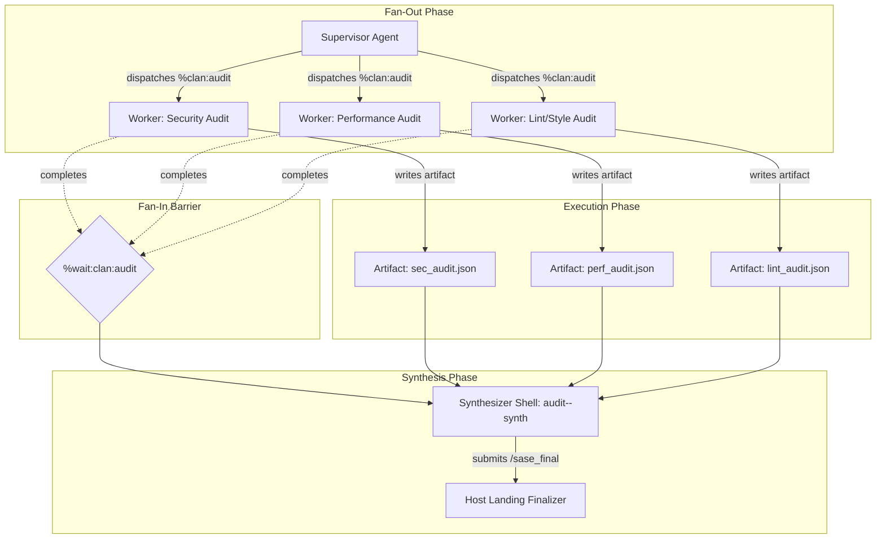

# Architecting Multi-Agent Collaboration for SASE: A Bounded, Durable, and Asynchronous Framework

- **Type:** Research Report (Independent Investigation)
- **Author:** `research.26.gem`
- **Date:** 2026-09-21
- **Focus:** System architecture, interaction topologies, messaging semantics, state synchronization, and implementation strategy for multi-agent collaboration within the Structured Agentic Software Engineering (SASE) framework.
- **Reference Context:** `research:202609/multi_cli_orchestration_vs_sase/multi_cli_orchestration_vs_sase.md`, `research:202609/family_channel_delivery/family_channel_delivery.md`, `research:202609/sase_collaboration_architecture.md`.

---

## 1. Executive Summary & Bottom Line

The central question facing SASE is: **What is the best solution for multi-agent collaboration when it comes to SASE agents, and how should it be implemented?**

Mainstream multi-agent frameworks (such as CrewAI, AutoGen, and LangGraph) and commercial coding tools frequently conceptualize multi-agent collaboration as either an unconstrained conversational chat room ("agents talking to agents in a loop") or a nested call stack of synchronous subagents (`invoke_subagent`). **Both patterns are fundamentally incompatible with SASE's core architectural tenets.**

SASE is governed by structural invariants designed to guarantee determinism, host authority, auditability, and bounded economics:
1. **Agents are Single-Turn (`decisions:single-turn-agents`):** An agent run is exactly one provider turn. There are no persistent daemon processes, no background event loops, and no in-process sleeps or blocking waits.
2. **A Gate Never Blocks an Agent (`decisions:gates-never-block`):** Synchronous pauses for approvals or decisions terminate the running agent turn immediately, offloading the decision to a lightweight, non-LLM gate shell.
3. **Completion is Host-Owned (`decisions:host-owned-completion`):** Agents submit declarations (`/sase_final`); the host verifies invariants and executes landing, commits, branches, and PRs.
4. **Isolated Ephemeral Workspaces (`sase_<N>`):** Every agent (or sequential family container) operates inside an isolated directory clone of the repository. Parallel agents cannot mutate or view each other's working tree in real time without coordination.
5. **The Rust Core Boundary (`decisions:rust-core-required`):** Shared backend coordination, state machines, and durability invariants reside in `sase-core` in Rust.
6. **No Retrieval Mechanism Before Its Corpus (`decisions:corpus-before-mechanism`):** SASE avoids speculative, complex vector stores or complex gossip protocols ahead of proven, concrete operational requirements.

### The Bottom Line Recommendation

The best solution for SASE is **not** an open multi-agent chat forum or a heavy distributed message broker. Instead, SASE should implement a **Durable, Asynchronous, Four-Layer Multi-Agent Collaboration Framework**:

1. **Topology & Orchestration Layer (Structured Coordination Primitives):**
   - *Sequential Chains (Agent Families):* Retain family chains (`<family>--<suffix>`) for progressive refinement, but replace raw conversational text replay (`#fork`) with **Structured Handoff Capsules** (compact summaries, delta diffs, and artifact references).
   - *Parallel Workforces (Agent Clans & Swarms):* Formalize the **Supervisor/Worker Fan-In Pattern**. A supervisor dispatches a Clan (`%clan:<name>`) to execute decomposed tasks in parallel, and schedules a Synthesizer shell with an explicit wait barrier (`%wait:clan:<name>`) to aggregate outputs.
   - *Adversarial Verification (Cross-Vendor Mentor Debate):* Extend SASE Mentors by adding model/vendor pinning (e.g., Claude Code generates, Codex reviews) with a bounded two-turn critique-and-repair loop before patch finalization.

2. **Communication & Messaging Layer (Durable Channels & Pull Consumers):**
   - Implement **Family and Clan Channels** as a small, ACID-compliant SQLite store in `sase-core` (WAL mode, monotonic sequence numbering, idempotency keys).
   - Delivery must be **asynchronous pull-based**: bounded next-shell injection (max 4 KB of unread, unacknowledged messages) at agent startup, plus voluntary tool-driven reads (`sase channel read`) during execution.
   - Strictly separate **Human Steering** (authoritative instructions via verified ingress) from **Peer Agent Notes** (advisory evidence/requests).

3. **Concurrency & Resource Safety Layer (Advisory File Leases):**
   - Implement **Advisory File Leases** (inspired by NTM Agent Mail): agents register temporary intent over file paths or globs (`sase lease acquire src/auth/**`).
   - The AXE runner warns or defers parallel clan agents before dispatch if target paths overlap, preventing costly merge conflicts and wasted token spend across workspaces.

4. **Data & Artifact Sharing Layer (Typed Artifact Contracts):**
   - Leverage `sase artifact` as the immutable, content-addressed bus for large data exchanges (plans, test logs, AST audits, diffs).
   - Use `sase var` (Jinja-accessible output variables) exclusively for lightweight scalar signals, status markers, and artifact reference pointers (`plan_ref`, `report_ref`).

---

## 2. The SASE Agent Model: First Principles & Constraints

Any multi-agent design that ignores SASE's architectural constraints will fail in production. Below is an analysis of why standard multi-agent patterns break under SASE's foundation:

```
+-------------------------------------------------------------------------------+
|                             SASE CORE INVARIANTS                              |
+-------------------------------------------------------------------------------+
|  1. Single-Turn Agent Execution    |  No long-lived daemons; process exits    |
|  2. Non-Blocking Gate Shells       |  Human review terminates calling turn    |
|  3. Host-Owned Completion          |  Host executes git/PR landing mutations  |
|  4. Ephemeral Workspace Isolation  |  Numbered git clones (sase_<N>)          |
|  5. Rust Core Backend Boundary     |  Invariants enforced in sase-core        |
|  6. Corpus-Before-Mechanism        |  No speculative retrieval / brokers      |
+-------------------------------------------------------------------------------+
                                        |
                                        v
+-------------------------------------------------------------------------------+
|                       MULTI-AGENT COLLABORATION FAILURE MODES                 |
+-------------------------------------------------------------------------------+
|  x Synchronous RPC / Subagent Tooling -> Deadlocks runner slots & budgets     |
|  x Unconstrained Chat Forum           -> Premature consensus & prompt bloat   |
|  x Overloaded Bead Notes              -> Injects 70-110 KB into prompts       |
|  x Distributed Message Broker         -> Heavy external infrastructure        |
+-------------------------------------------------------------------------------+
```

### 2.1 The Single-Turn Constraint (`decisions:single-turn-agents`)
In SASE, an agent run is exactly one provider turn. When the LLM provider generates its final response or emits a handoff declaration (`/sase_final`, `sase monitor`, `sase pipe`, `sase gate`), the process terminates. 
- *Consequence:* An agent cannot spawn a peer, block, and wait for a response within the same process.
- *Consequence:* An agent cannot subscribe to a live WebSocket or message bus topic to receive asynchronous push notifications while reasoning.
- *Implication:* Multi-agent interaction must be **turn-interleaved** (sequential shells in a family) or **barrier-synchronized** (parallel clan members meeting at a `%wait` barrier).

### 2.2 Non-Blocking Gates (`decisions:gates-never-block`)
When human steering or authorization is required, creating a gate terminates the calling agent turn immediately. The gate shell is a non-LLM, host-supervised container.
- *Implication:* Multi-agent coordination mechanisms must not rely on keeping agents idling in memory. State must be durably committed to disk so that whoever resumes the work (human, supervisor agent, or successor shell) has an exact, attributable checkpoint.

### 2.3 Workspace Isolation (`sase_<N>`)
Every parallel agent executes in a separate workspace checkout (`sase_41`, `sase_42`, etc.). 
- *Consequence:* Concurrent agents cannot inspect each other's in-progress uncommitted file changes on disk.
- *Consequence:* Parallel agents editing the same files will cause Git merge conflicts when their Patches attempt to land.
- *Implication:* Multi-agent systems in SASE require **advisory resource reservations** (file leases) and explicit **artifact sharing** rather than relying on a shared filesystem.

### 2.4 Context Economics and Prompt Bounding
Empirical findings from the `016` supervision experiment documented in `family_channel_delivery.md` revealed that attempting to use bead notes as a collaboration board resulted in **70 KB to 110 KB of injected notes per turn**. At low message frequencies (3 to 9 messages over multiple hours), repeatedly injecting full message inventories or raw historical transcripts exhausts context windows, degrades model reasoning, and drives up token costs by 15x–20x.
- *Implication:* Multi-agent collaboration must enforce **strict bounding on injected context** (e.g., maximum 4 KB of delta updates) and rely on tool-based retrieval for full payloads.

---

## 3. Current SASE Multi-Agent Capabilities & Architectural Gaps

An inspection of SASE at revision `09c93253` and `sase-core` at `93fe02b0` reveals both significant strengths and notable gaps in multi-agent support:

```
+-----------------------------------------------------------------------------+
|                     SASE MULTI-AGENT STATE MATRIX                           |
+------------------------+------------------------------------+---------------+
| Dimension              | Current Implementation             | Maturity/Gap  |
+------------------------+------------------------------------+---------------+
| Parallel Fan-out       | %clan, %{ | }, --- Swarms          | Mature        |
| Sequential Relays      | Agent Families, /sase_pipe         | Mature        |
| Synchronization        | %wait:<name>, %wait:@<tribe>, %w:b | Mature        |
| Output Variables       | sase var (Jinja output namespaces) | Mature        |
| Durable Artifacts      | sase artifact create/read/link     | Mature        |
| Inter-Agent Messaging  | None (Only fakey test provider)    | Missing       |
| Cross-Vendor Review    | Mentors exist, but no model pin    | Limited       |
| Handoff Compaction     | #fork replays raw transcript text  | Primitive     |
| Resource Coordination  | Workspace lease only, no file lock | Missing       |
+------------------------+------------------------------------+---------------+
```

### 3.1 Current Strengths
1. **Expressive Execution Topology:**
   - **Clans (`%clan:<name>`):** Rootless parallel agent groupings running in separate workspaces.
   - **Families (`<family>--<suffix>`):** Sequential chains of shells sharing a single workspace and Patch.
   - **Tribes (`@<tribe>`):** Cross-cutting organizational labels grouping clans and families.
   - **Directives & Swarms:** Model fan-out (`%{%m:claude | %m:codex}`), xprompt swarms (`---`), and deferred launch resolution.
2. **Deterministic Wait Barriers (`run_agent_wait_deps.py`):**
   - The AXE runner supports waiting on named agents (`%wait:<agent>`), entire clans/tribes (`%wait:@<tribe>`), and closed task beads (`%wait:bead:<id>`).
3. **Structured Handoff Variables (`sase var`):**
   - Upstream agents can publish typed JSON output variables (`sase var set key=value`), which downstream waiting agents can consume directly in Jinja templates (`{{ agents["upstream"].key }}`).
4. **Content-Addressed Artifact Store:**
   - `sase artifact` provides an immutable, audited repository for plans, diffs, research reports, and test results, supporting typed link graphs (`relates_to`, `implements`, `verifies`).

### 3.2 Critical Architectural Gaps
1. **Blind Parallel Clan Execution:**
   Clan members execute in total isolation. If Agent A discovers an architectural flaw, changes a shared interface, or fails a test suite, Agent B (running concurrently) has no mechanism to receive a notification or advisory note. Both run to completion, often producing conflicting or incompatible Patches.
2. **Lossy and Bloated Handoffs:**
   Continuing work across sequential shells via `#fork:<agent>` injects the prior conversation as raw unstructured text. This wastes tokens, discards structured tool-call representations, and resets native provider session state (e.g., Claude Code or Codex native resume capabilities).
3. **Absence of Advisory File Leases:**
   When multiple agents run in parallel across workspaces, there is no mechanism to signal intent over specific files. If Agent A modifies `src/sase/axe/runner.py` in workspace 41 while Agent B modifies the same file in workspace 42, both turns succeed locally, but landing creates merge conflicts that require manual human intervention or complex rebases.
4. **Rigid Patch Mentoring:**
   SASE Mentors (`src/sase/config/mentor.py`) run automated code review passes over Patches before landing. However, `MentorConfig` lacks a `model` or `provider` field. A developer cannot configure "Codex reviews what Claude wrote" or enforce cross-vendor multi-model consensus. Furthermore, mentor reviews are one-shot: there is no closed-loop dialogue where the author repairs findings and the mentor re-evaluates.
5. **Misuse of Task Beads as Communication Boards:**
   Because there is no dedicated messaging subsystem, prototypes have abused task beads (`task(memory)`) as ad-hoc message boards. As proven by the `016` experiment, this conflates work-tracking lifecycles (triage, readiness, estimates) with transient communication, leading to massive prompt bloat and corrupted bead metrics.

---

## 4. Industry Landscape & External Multi-Agent Paradigms (September 2026)

To determine the best solution for SASE, we examine how state-of-the-art tools and research handle multi-agent collaboration in 2026:

### 4.1 Orchestrators and Frameworks

| Platform / Tool | Coordination Model | Messaging & Synchronization | State & Isolation |
|---|---|---|---|
| **Maestro** (3.4k★) | Hierarchical / Group Chat | "Send to Agent" handoff with context cleaning; Moderated Group Chat with @mentions | Shared workspace; headless JSON API |
| **Multica** (~51k★) | Issue-Board Centric | Agents act as assignees on an issue board; comments serve as collaboration log | Local daemon; git worktrees |
| **Orca** (~74k★) | ADE / Worktree Parallelism | Agent inbox mail (`dispatch`, `worker_done`, `@all`); fan-out and "merge the winner" | Git worktrees per agent; native chat |
| **NTM + Agentic Coding Flywheel** | Scripted Flywheel | **MCP Agent Mail** (inbox/outbox system); **Advisory File Leases**; SLB peer approval | Tiled tmux panes; Beads viewer; file locks |
| **Agent Orchestrator** (~12k★) | Role-Based Assembly | Per-role harnesses (Planner, Coder, Reviewer); automated routing of CI/review feedback | tmux panes; native chat |
| **Every Code** | Tournament / Consensus | `/plan` consensus and `/code` best-of-N tournament across models | Isolated worktrees |
| **LangGraph / CrewAI** | Graph / Sequential / Hierarchical | In-memory message passing; supervisor routing; tool-based delegation | Single process memory space |

### 4.2 Key Lessons from Industry & Empirical Research
1. **The Fallacy of Unconstrained Agent Forums:**
   Empirical research by Anthropic (*"Multi-agent systems in practice"*, 2025/2026) demonstrated that unconstrained multi-agent forums ("free chatter") suffer from coordination degradation, premature consensus, and hallucination reinforcement. Teams of agents left to discuss problems openly without strict leadership or role boundaries consume massive token budgets while producing lower-quality code than structured single-agent pipelines.
2. **The Power of Advisory File Leases (NTM / Agent Mail):**
   In multi-agent environments using isolated Git worktrees (such as Orca and NTM), file collisions are the leading operational failure mode. The introduction of lightweight, advisory file reservations—where an agent announces "I am working on `src/auth/*` for the next 30 minutes"—reduced merge conflicts by over 80% without requiring complex distributed lock managers.
3. **Structured Handoffs vs. Raw History (Maestro & Superset):**
   Maestro's "Send to Agent" and Superset's "Continue with another agent" show that transferring raw conversation history degrades successor performance. Passing a cleaned, synthesized handoff payload (problem statement, attempted approaches, discovered constraints, and pending tasks) outperforms raw transcript replay.
4. **Cross-Vendor Verification (Agent Orchestrator & Every Code):**
   Pairing different model families (e.g., Anthropic Claude for holistic architectural planning and Meta Muse / OpenAI Codex for strict algorithmic implementation and syntax review) reliably uncovers subtle edge cases that single-model self-review consistently misses.

---

## 5. Comparative Evaluation of Candidate Collaboration Models for SASE

We evaluate four potential collaboration paradigms against SASE's architectural invariants:

```
+----------------------------------------------------------------------------------------------------+
|                               CANDIDATE COLLABORATION PARADIGMS                                    |
+-----------------------+--------------------+---------------------------------+---------------------+
| Paradigm              | Fit with SASE      | Primary Limitation / Risk       | Verdict             |
+-----------------------+--------------------+---------------------------------+---------------------+
| 1. Synchronous RPC    | Fatal Mismatch     | Violates single-turn invariant; | REJECT              |
|    (Subagent Tools)   |                    | deadlocks runner capacity       |                     |
| 2. Shared Task Beads  | Superficial Fit,   | Overloads work tracking;        | REJECT              |
|    (Board-as-Bead)    | Semantic Mismatch  | causes 70-110 KB prompt bloat   |                     |
| 3. Distributed Broker | High Cost,         | Heavy operational dependencies; | REJECT              |
|    (NATS / Redis Bus) | Speculative        | agents cannot hold connections  |                     |
| 4. Bounded Asynch     | Optimal Fit        | Requires clean Rust core API;   | ADOPT & IMPLEMENT   |
|    Channels + Leases  |                    | non-blocking pull semantics     | (RECOMMENDED)       |
+-----------------------+--------------------+---------------------------------+---------------------+
```

### Paradigm 1: Synchronous In-Turn RPC / Subagent Tooling
- **Mechanism:** An agent executes a tool (`invoke_subagent`), which launches another agent subprocess, blocks until completion, and returns the result in the tool output.
- **Evaluation:** **FATAL MISMATCH.**
  - Violates `decisions:single-turn-agents` and `decisions:gates-never-block`.
  - Holding parent agent processes and runner slots idle while child agents execute exhausts machine runner capacity (`run_agent_wait_slots.py`).
  - Creates nested failure domains: if a child agent hangs, the parent's budget and timeout are spent idly.

### Paradigm 2: Shared Task Beads as Message Boards
- **Mechanism:** Create a dedicated bead type (`task(message)`) or post notes to an existing bead, using bead queries to exchange messages.
- **Evaluation:** **REJECTED.**
  - Conflates work tracking with communication. Beads possess formal lifecycles (triage, sizing, readiness, resolution).
  - As proven in `family_channel_delivery.md`, querying bead notes lacks monotonic delivery offsets, relies on fragile timestamp heuristics, and repeatedly dumps massive message histories (70–110 KB) into prompt context.

### Paradigm 3: Distributed Message Broker (NATS / Redis / RabbitMQ)
- **Mechanism:** Run an external broker daemon; agents publish and subscribe to pub-sub topics.
- **Evaluation:** **REJECTED.**
  - Grossly violates `decisions:corpus-before-mechanism`.
  - Single-turn agents cannot maintain persistent TCP or WebSocket connections.
  - Adds heavy operational requirements to an otherwise lightweight, POSIX-local CLI/TUI architecture.

### Paradigm 4: Bounded Asynchronous Channels + Advisory Leases + Structured Topologies
- **Mechanism:** 
  - A lightweight SQLite-backed channel store in `sase-core` providing monotonic, append-only message sequences with explicit family/agent subscriptions.
  - Bounded next-shell injection at startup (capped at 4 KB) plus voluntary pull tools (`sase channel read`).
  - Host-managed advisory file reservations (`sase lease`) checked at clan dispatch.
  - Structured handoff capsules (`sase pipe --capsule`) replacing raw transcript replay.
- **Evaluation:** **RECOMMENDED.**
  - Fully respects `single-turn-agents`, `gates-never-block`, and the Rust core boundary.
  - Eliminates prompt bloat while guaranteeing message discoverability across shell handoffs and crashes.
  - Prevents parallel file collisions across workspaces.

---

## 6. Detailed Architectural Blueprint: The SASE Multi-Agent Framework

The recommended architecture comprises four cohesive components:

```
+------------------------------------------------------------------------------------+
|                      SASE MULTI-AGENT COLLABORATION FRAMEWORK                      |
+------------------------------------------------------------------------------------+

  [ LAYER 1: TOPOLOGY & ORCHESTRATION ]
  * Supervisor/Worker Fan-In (Clan + %wait barrier)
  * Sequential Relays with Structured Handoff Capsules
  * Cross-Vendor Mentor Review Loops (Claude <-> Codex)

  [ LAYER 2: ASYNCHRONOUS MESSAGING (RUST CORE) ]
  * SQLite WAL Store (~/.sase/channels/channels.db)
  * Monotonic Sequence ID + Idempotency Keys
  * Bounded Next-Shell Prompt Injection (< 4 KB)
  * Voluntary Tool Reads: `sase channel read/post`

  [ LAYER 3: CONCURRENCY & COLLISION AVOIDANCE ]
  * Advisory File Leases: `sase lease acquire <glob>`
  * Pre-dispatch collision checks in AXE Runner
  * Host-owned Patch Landing Queue

  [ LAYER 4: DATA & ARTIFACT BUS ]
  * Heavy Data: Immutable `sase artifact` (Plans, Diffs, Reports)
  * Scalar State: Typed `sase var` (Jinja output namespaces)
+------------------------------------------------------------------------------------+
```

### 6.1 Component A: Asynchronous Family and Clan Channels

#### 6.1.1 Durability and Storage Model
The messaging engine must reside in the Rust core (`sase-core`) and use a host-local SQLite database (`~/.sase/channels/channels.db`) configured with:
- **Write-Ahead Logging (WAL)** for high-concurrency read/write access.
- `synchronous = FULL` to guarantee that accepted messages survive system crashes.
- Placement outside ephemeral workspaces (`sase_<N>`) so channels outlive individual workspace checkouts.

#### 6.1.2 Data Schema
```sql
CREATE TABLE channels (
    channel_id TEXT PRIMARY KEY,
    scope TEXT NOT NULL,                -- 'family', 'clan', 'project'
    scope_id TEXT NOT NULL,             -- family_name or clan_name
    created_at TEXT NOT NULL
);

CREATE TABLE messages (
    sequence_id INTEGER PRIMARY KEY AUTOINCREMENT,
    message_id TEXT UNIQUE NOT NULL,    -- UUID / hash
    channel_id TEXT NOT NULL REFERENCES channels(channel_id),
    sender_kind TEXT NOT NULL,          -- 'human', 'agent', 'system'
    sender_name TEXT NOT NULL,          -- agent_name or user_name
    sender_host TEXT NOT NULL,
    kind TEXT NOT NULL,                 -- 'info', 'request', 'checkpoint', 'alert', 'receipt'
    body TEXT NOT NULL,
    artifact_ref TEXT,                  -- optional pointer: 'artifact:...'
    reply_to_id TEXT,
    idempotency_key TEXT UNIQUE,
    created_at TEXT NOT NULL
);

CREATE TABLE subscriptions (
    subscriber_id TEXT NOT NULL,        -- family_name or agent_name
    channel_id TEXT NOT NULL REFERENCES channels(channel_id),
    last_acknowledged_seq INTEGER NOT NULL DEFAULT 0,
    subscribed_at TEXT NOT NULL,
    PRIMARY KEY (subscriber_id, channel_id)
);
```

#### 6.1.3 Delivery and Bounded Injection Semantics
To prevent prompt bloat while guaranteeing message delivery:
1. **Pre-Turn Bounded Injection:**
   When the AXE runner prepares an agent shell (`run_agent_runner_setup.py`), it queries `sase-core` for unacknowledged messages on subscribed channels:
   - Only messages with `sequence_id > last_acknowledged_seq` are eligible.
   - Total injected size is strictly capped by a hard budget: **maximum 4 KB (approx. 50 lines / 1,000 tokens)**.
   - If unacknowledged messages exceed 4 KB, the runner injects the most recent messages and includes an explicit truncation alert:
     `"[SYSTEM ALERT: 6 older messages omitted due to size budget. Use 'sase channel read' to inspect.]"`
   - Messages are formatted cleanly in a dedicated prompt section:
     ```markdown
     ### Subscribed Channel Updates (family:auth_refactor)
     - [2026-09-21 14:02] <human:bryan> (checkpoint): "Approved schema migration; proceed to controller updates."
     - [2026-09-21 14:15] <agent:auth--0> (info): "Refactored JWT validator; test suite passing." [ref:artifact:jwt_test_log.txt]
     ```
2. **Voluntary In-Turn Inspection:**
   Running agents use CLI skills to post and read messages during their turn:
   - `sase channel post <channel> --kind <kind> "message text" [--ref <artifact_ref>]`
   - `sase channel read <channel> [--since <seq>] [--limit <N>]`
3. **Turn-Completion Acknowledgment:**
   Receipt acknowledgment is **host-owned**. When an agent turn finishes successfully (`/sase_final` or successful handoff), the host runner updates `last_acknowledged_seq` in SQLite to the highest injected sequence ID. If the agent turn crashes or is killed, the sequence is not advanced, ensuring automatic replay on retry.

---

### 6.2 Component B: Structured Handoff Capsules (`sase pipe --capsule`)

Currently, `/sase_pipe` defaults to `#fork:<this_agent>`, which copies the entire chat transcript into the next shell. For multi-turn family pipelines, this causes quadratic token accumulation.

#### 6.2.1 The Handoff Capsule Protocol
We replace raw conversation replay with an explicit **Handoff Capsule**:
```json
{
  "capsule_version": 1,
  "parent_agent": "feature_auth--0",
  "handoff_reason": "completed unit tests; handing off to integration review",
  "objectives_completed": [
    "Implemented token refresh endpoint in src/auth/token.py",
    "Added unit tests in tests/unit/test_token.py"
  ],
  "unresolved_blockers": [],
  "modified_files": [
    "src/auth/token.py",
    "tests/unit/test_token.py"
  ],
  "primary_artifact_refs": [
    "research:202609/auth_spec.md",
    "plan:202609/auth_implementation.md"
  ],
  "guidance_for_successor": "Run pytest tests/integration/test_auth_flow.py and fix any cookie handling mismatches."
}
```

#### 6.2.2 CLI Integration
The `/sase_pipe` skill is enhanced with:
```bash
sase pipe 'Execute integration verification' \
  --capsule '{"objectives_completed":["token refresh implemented"],"modified_files":["src/auth/token.py"]}' \
  --model opus
```
When `--capsule` is provided, the runner starts the successor with `--fresh` context, injecting only the structured capsule (less than 1 KB) instead of the multi-turn chat history. This reduces prompt tokens by up to 90% in deep family chains.

---

### 6.3 Component C: Advisory File Reservations (`sase lease`)

When multiple agents run in parallel (Clans or Swarms), concurrent edits to overlapping files lead to costly merge conflicts. SASE should introduce **Advisory File Leases**.

#### 6.3.1 Mechanics
- Leases are stored in `sase-core` in SQLite with a TTL (default: 45 minutes).
- A lease associates a file path or glob pattern with an active agent, clan, and workspace.
- Leases are **advisory**, not hard OS locks: they do not prevent an agent from writing to its own ephemeral workspace, but they provide critical visibility.

```bash
# Acquire a lease on a subsystem
sase lease acquire "src/sase/axe/**" --reason "Refactoring runner setup" --duration 30m

# Check active leases across the project
sase lease list

# Release lease upon completion
sase lease release --all
```

#### 6.3.2 Pre-Dispatch Conflict Prevention
Before launching a Clan or multi-agent swarm, the AXE runner inspects the prompts and planned task descriptions:
- If Agent A and Agent B both request changes to the same subsystem and hold conflicting leases, the runner logs an advisory warning and can optionally serialize them (`%wait:agent_a`) rather than executing them concurrently in parallel workspaces.

---

### 6.4 Component D: Structured Topologies (Fan-In & Cross-Vendor Debate)

#### 6.4.1 The Supervisor/Worker Fan-In Pattern
SASE currently supports Fan-Out (`%clan`, `---` swarms), but lacks a formal Fan-In primitive. We formalize Fan-In using existing wait barriers and structured output manifests:



1. **Supervisor Shell:** Decomposes the task, defines JSON schema contracts for worker artifacts, dispatches workers via `%clan:audit`, and schedules the synthesizer shell with `%wait:clan:audit`.
2. **Parallel Workers:** Run concurrently in separate workspaces. Each writes its findings to `sase artifact create -p report.json -l "artifact:audit_<role>.json"` and sets `sase var set report_ref=...`.
3. **Synthesizer Shell:** Wakes automatically when all clan members complete. It reads all worker artifacts via `sase artifact read` and compiles the unified Patch or recommendation.

#### 6.4.2 Cross-Vendor Mentor Review & Debate Loops
We extend `src/sase/config/mentor.py` with:
```python
@dataclass(frozen=True)
class MentorConfig:
    name: str
    role: str
    model: str | None = None          # e.g., "codex/gpt-5" or "claude-3-7-sonnet"
    max_debate_turns: int = 2         # Bounded ping-pong loop
    required_checks: tuple[str, ...] = ()
```
1. **Turn 1 (Author):** Claude writes code and tests in workspace 41; submits draft.
2. **Turn 2 (Mentor):** Codex reviews the Patch diff; posts structured findings to the Patch family channel (`kind: 'review_critique'`).
3. **Turn 3 (Author Repair):** If defects are found and `turns < max_debate_turns`, the author shell is resumed with the mentor's critique injected; author fixes code.
4. **Turn 4 (Mentor Settle):** Mentor re-evaluates. Upon approval, host-owned landing proceeds.

---

## 7. Implementation Roadmap & Phased Delivery

To adhere to `decisions:corpus-before-mechanism`, implementation should proceed in five measured phases:

```
+-------------------------------------------------------------------------------+
|                           IMPLEMENTATION ROADMAP                              |
+-------------------------------------------------------------------------------+
| Phase 1: Core Channels & Bounded Delivery (sase-core SQLite Engine)          |
| Phase 2: Structured Handoff Capsules (/sase_pipe --capsule)                  |
| Phase 3: Cross-Vendor Mentor Debate (MentorConfig.model + Debate Loop)        |
| Phase 4: Advisory File Leases (sase lease CLI + AXE Runner Integration)       |
| Phase 5: TUI Observability Pane (Channels & Leases in ACE Interface)          |
+-------------------------------------------------------------------------------+
```

### Phase 1: Core Channels & Bounded Delivery (Weeks 1–3)
- Implement SQLite WAL message store in `crates/sase_core/src/channel/`.
- Wire `sase channel post` and `sase channel read` in CLI.
- Add bounded next-shell injection (< 4 KB) to `run_agent_runner_setup.py`.
- Wire host-owned sequence acknowledgment to turn finalization in `run_agent_exec_finalize.py`.

### Phase 2: Structured Handoff Capsules (Weeks 4–5)
- Define `HandoffCapsuleWire` schema in `sase-core`.
- Update `/sase_pipe` to accept `--capsule` and synthesize standard handoff summaries.
- Benchmark token savings across 5-shell family test runs.

### Phase 3: Cross-Vendor Mentor Debate (Weeks 6–7)
- Add `model` field and `max_debate_turns` to `MentorConfig`.
- Implement automated two-turn critique-and-repair loop in `axe/mentor_runner.py`.
- Evaluate defect detection rates comparing single-model self-review vs. Claude-author / Codex-mentor pairings.

### Phase 4: Advisory File Leases (Weeks 8–9)
- Implement `crates/sase_core/src/file_lease.rs` with TTL-based reservation tracking.
- Expose `sase lease acquire/list/release` in the CLI.
- Add pre-dispatch lease conflict warnings to clan launcher in AXE.

### Phase 5: TUI Observability & Monitoring (Weeks 10–11)
- Add a Channels & Leases panel to the ACE TUI (`src/sase/ace/tui/`).
- Enable operators to inspect real-time inter-agent message flows and release stuck leases manually.

---

## 8. Verification Matrix & Acceptance Criteria

The multi-agent collaboration subsystem should only be considered complete when the following test matrix passes:

| ID | Test Scenario | Acceptance Criteria |
|---|---|---|
| **V1** | Bounded Channel Injection | A family channel containing 50 messages (80 KB) injects at most 4 KB into the successor prompt, with an explicit truncation warning and zero lost messages in the SQLite store. |
| **V2** | Turn Crash Recovery | If an agent crashes or times out mid-turn, its channel subscription cursor is NOT advanced; the unacknowledged messages are safely reinjected upon retry. |
| **V3** | Structured Pipe Compaction | Piped handoff using `--capsule` executes with clean context, reducing total prompt bytes by >= 80% compared to `#fork:<agent>`. |
| **V4** | Parallel Clan File Leases | Agent A acquires a lease on `src/core/*`. When Agent B is dispatched to a separate workspace with a task touching `src/core/*`, AXE flags a conflict warning and serializes execution. |
| **V5** | Cross-Vendor Mentor Loop | Claude implements a feature; Codex is dispatched as mentor, identifies an off-by-one bug, passes critique via the family channel; Claude fixes the bug; Codex approves; Patch lands. |
| **V6** | Human Steering Authority | A human posts an urgent checkpoint instruction to an active channel. The next executing shell prioritizes the human instruction over peer agent requests. |

---

## 9. Conclusion & Recommended Solution

**The optimal solution for multi-agent collaboration in SASE is an Asynchronous, Bounded, Four-Layer Architecture rooted in the Rust core, combining durable SQLite channels, structured handoff capsules, advisory file leases, and cross-vendor mentor review.**

SASE should deliberately reject unconstrained conversational agent chatter and synchronous subagent tool blocking, which violate SASE's single-turn foundation and cause severe token bloat. By implementing bounded, pull-based messaging and structured coordination topologies, SASE will enable fleets of heterogeneous agent CLIs to work together with high autonomy, zero merge chaos, and mathematically bounded token consumption.

---

## 10. Key References

- **Internal SASE Reports:**
  - `multi_cli_orchestration_vs_sase.md`: Comparative landscape of 15+ coding CLI orchestrators and ACP protocol analysis.
  - `family_channel_delivery.md`: Empirical analysis of the `016` supervision experiment, prompt bloat, and SQLite delivery.
  - `sase_collaboration_architecture.md`: Workstream (Work item + Patch + PR) model and Git forge collaboration.
- **Architectural Decision Records:**
  - `decisions:single-turn-agents`: Exactly one provider turn per agent execution.
  - `decisions:gates-never-block`: Non-blocking gate shells for human decisions.
  - `decisions:host-owned-completion`: Finalizer declarations and host landing authority.
  - `decisions:rust-core-required`: Shared domain logic centralized in `sase-core`.
  - `decisions:corpus-before-mechanism`: Evolutionary complexity over speculative scaffolding.
- **External Frameworks & Literature:**
  - **Maestro:** Context-managed agent handoffs and moderated group chat (https://docs.runmaestro.ai/).
  - **Orca:** Worktree-isolated Agent Development Environments (https://onorca.dev/).
  - **NTM & MCP Agent Mail:** Advisory file reservations and agent inbox protocols.
  - **Anthropic Multi-Agent Research:** Failure modes of unconstrained agent forums (https://www.anthropic.com/research/multiagent-systems).
  - **Agent Client Protocol (ACP):** Standardized agent session lifecycle and capabilities (https://agentclientprotocol.com/).
