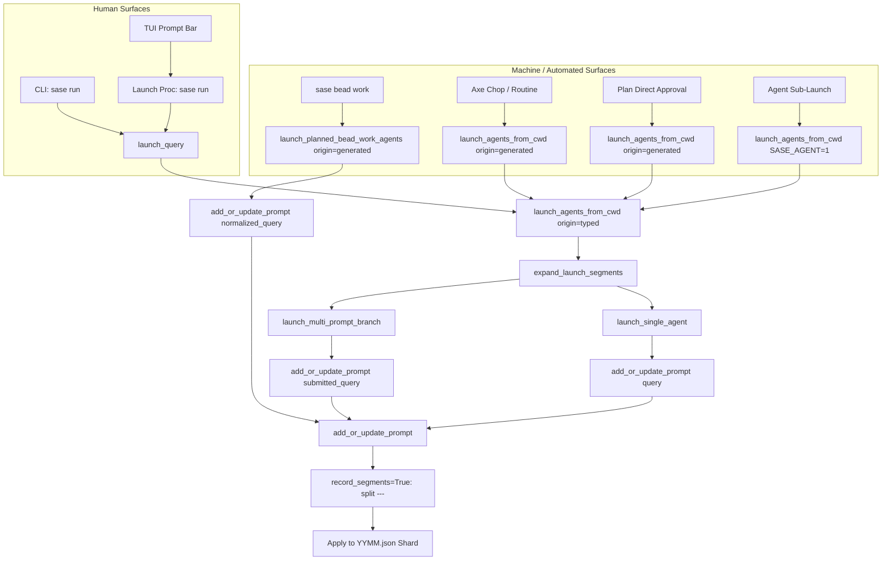

# Research Report: Restricting Prompt History to Human-Authored Intent

**Researcher:** `research.2y.gem`  
**Date:** 2026-09-30  
**Artifact Target:** `research:202609/prompt_history_user_intent_scoping__gem.md`  

---

## Executive Summary

Prompt history is designed as an interactive user-facing utility: a human recall ledger that powers the Textual User Interface (TUI) Prompts modal (`History` tab), prompt bar navigation, the CLI `sase prompt list` / `sase prompt run` / `sase prompt select` commands, and inline next-word ghost text prediction (Ctrl+T). Its functional purpose is to allow human developers to quickly find, adapt, and replay past requests.

Over recent development cycles—specifically following the introduction of automated background routines (Lumberjack / axe chops), multi-phase bead execution (`sase bead work`), and fanout workflows—prompt history has become severely degraded by machine-generated entries. An empirical audit of the prompt history store on this host reveals:
- **Total stored prompts:** 11,584 records across three monthly shards (`2607.json`, `2608.json`, `2609.json`).
- **Machine-generated proportion:** **62.6% overall** (7,251 out of 11,584 prompts).
- **Current month trajectory (`2609.json`):** **75.9% machine-generated** (2,869 out of 3,781 prompts).
- **Top prompt tokens:** `#bd/work_phase_bead` alone accounts for 4,921 entries, and `#bd/land_epic` accounts for 1,805 entries. Together, these two automated phase markers constitute over **58% of the entire database**.
- **Payload bloat:** Automated routine prompts frequently embed entire project manifests, review briefs, and alternation plans, reaching between 30 KB and 100 KB per prompt and bloating store size to nearly 7 MB.

The user's plan proposes to:
1. Re-anchor prompt history strictly to human-authored requests (prompts submitted via the TUI prompt bar widget or explicit `sase run` CLI commands).
2. Suppress all child prompts used to launch individual agents belonging to an xprompt swarm (e.g. `#research_swarm`), while preserving the parent prompt containing the swarm invocation.
3. Suppress all prompts used to launch agents from automated routines.

### Strategic Assessment & Key Findings
1. **The Core Proposal is Essential:** The premise is fully verified by system metrics and TUI observations. Without intervention, prompt history will soon exceed 80–90% machine noise, rendering human prompt search, fzf selection, and TUI history navigation practically useless.
2. **Scope Adjustment 1 (Generalize Beyond Routines):** Restricting exclusions solely to "routines" is insufficient. Machine prompts are also emitted by non-routine triggers: manual CLI `sase bead work`, plan direct approval (`sase plan approve`), autonomous agent sub-launches (`os.environ["SASE_AGENT"]`), and restart runners. The exclusion rule should be generalized: **no machine-generated prompt (`origin == "generated"`) should ever be stored in prompt history.** SASE already introduced `PromptOrigin = Literal["typed", "generated"]` in commit `eaa4aa4aa7` (`sase-1cj.2`), but failed to connect it to write-time storage gating.
3. **Scope Adjustment 2 (Multi-Prompt Segment De-escalation):** The write path (`add_or_update_prompt`) currently defaults to `record_segments=True`, which parses multi-prompts (`---`) and saves each segment as an independent prompt. When combined with bead work or provider guard expansions, a single compound launch explodes into $N+1$ prompt entries in history. Automated fanouts must never decompose into segmented history entries.
4. **Scope Adjustment 3 (Fix Swarm Expansion Leakage):** Swarm member prompts leak into history through two specific edge cases:
   - *Single-agent swarms* where `launch_cwd_agents.py` overwrites `query` with the expanded segment before delegating to `launch_single_agent`.
   - *Provider Launch Guards* in the TUI where `_launch_provider_guard.py` rewrites `launch.prompt` with the concatenated surviving member prompts before dispatching `sase run`.
   In both cases, the launcher must decouple the execution query from the recorded history query.
5. **Scope Adjustment 4 (A Two-Sided Solution: Write Gating + Read Shielding & Pruning):** Fixing the write path only protects future launches. Because 7,251 machine prompts already inhabit existing shards (`2607.json`–`2609.json`), the TUI History tab and CLI tools will remain severely polluted unless `prompt_catalog.py` applies read-side origin filtering and a pruning command (`sase prompt prune --generated`) is made available.

---

## 1. Empirical Investigation: State of the Prompt Store

### 1.1 Shard Composition & Growth Trend
An inspection of the local active prompt store located at `~/.sase/prompt_history/` demonstrates a sharp increase in automated prompt pollution across recent months:

| Shard | Total Prompts | Machine-Generated Rows | Percentage Generated | Dominant Generated Types |
| :--- | :--- | :--- | :--- | :--- |
| **`2607.json` (July 2026)** | 3,755 | 1,769 | 47.1% | Early chop prototypes, bead phase runs |
| **`2608.json` (August 2026)** | 4,048 | 2,613 | 64.6% | Lumberjack chops, epic bead decompositions |
| **`2609.json` (September 2026)**| 3,781 | 2,869 | **75.9%** | Routine split chops, public bead attachments (`sase-1d5`, `sase-1cx`) |
| **Total** | **11,584** | **7,251** | **62.6%** | **Over 6,700 `#bd/` phase & landing entries** |

Over the past three months, the ratio of machine prompts has nearly doubled, rising from 47.1% to 75.9%. More than three out of every four prompts recorded in the current month originated from automated machinery rather than a human user.

### 1.2 Breakdown of Store Chips
Running `sase prompt stats` highlights the distribution of tags and chips across the store:
```text
Top Chips:
  gh                    11,325
  #bd/work_phase_bead    4,921
  %miaw                  3,726
  #plan                  2,767
  #bd/land_epic          1,805
  #split_file            1,023
  #m_opus                  698
  %cmiaw                   687
```
`#bd/work_phase_bead` (4,921) and `#bd/land_epic` (1,805) constitute 6,726 entries. These represent internal phase dispatch commands generated by `sase bead work` to orchestrate multi-agent epic implementation pipelines. None of these were authored directly by a human.

### 1.3 Analysis of Screenshot `20260930_062115.png`
The user-provided screenshot (`~/tmp/screenshots/20260930_062115.png`) displays the TUI Prompts modal (`History` tab) filtered to `project:sase`:
- At `09-30 06:07`, a genuine human prompt appears:
  `#research_swarm(gemini=true,grok=true,muse=true,image=true):: ...`
- Below it, beginning at `09-30 01:58`, there is a dense cluster of entries tagged `+4`, `+3`, `+2`, each titled `+sase`. The preview pane reveals the highlighted entry:
  ```text
  +sase
  %id(sase-1d5.1, bead=sase-1d5.1)
  %clan(sase-1d5, tribe=epic, summary_script=sase_clan_summary_epic)
  %model:@large %auto
  #bd/work_phase_bead:sase-1d5.1 #plan
  ---
  +sase
  %id(2, clan=sase-1d5, bead=sase-1d5.2)
  %model:@small %auto
  #bd/work_phase_bead:sase-1d5.2
  ---
  ...
  ```
- This compound prompt was generated by `sase bead work sase-1d5` (the 8-phase epic for public bead attachments).
- Crucially, `09-30 01:58` contains **9 distinct prompt rows** recorded at the exact same second:
  1. The full compound 8-phase multi-prompt.
  2. Each of the 8 individual phase segments (`sase-1d5.1`, `sase-1d5.2`, ..., `sase-1d5.8`, `land`).
- Similar bursts occurred at:
  - `09-29 20:34` (epic `sase-1cx`: 9 entries)
  - `09-29 19:00` (epic `sase-1cj`: 8 entries)
  - `09-29 17:05` (routine chop `toobig-4n`: 11 split entries)

Because the TUI displays 100 loaded rows per page, a single evening of routine activity or epic runs displaces all human prompts into deep pagination, creating the impression that past user prompts have been lost.

---

## 2. Technical Architecture: How Prompts Enter the Store

Tracing the codebase reveals how prompts flow into `~/.sase/prompt_history/`:



### 2.1 The Mutation Engine (`prompt_store_mutations.py`)
The primary write primitive is:
```python
def add_or_update_prompt(
    text: str,
    *,
    cancelled: bool = False,
    allow_short: bool = False,
    record_segments: bool = True,
    origin: store.PromptOrigin | None = None,
) -> None:
```
- It resolves `effective_origin = _effective_prompt_origin(origin)`. If `os.environ.get("SASE_AGENT")` is present, `origin="typed"` is converted to `"generated"`.
- It constructs mutations for `text`.
- If `record_segments` is `True` (default), it invokes `_multi_prompt_segment_mutations(text)`, which splits on `---` and adds every sub-segment with $\ge 5$ words to `mutations`.
- Finally, `_apply_prompt_mutations` writes them under lock to the `YYMM.json` shard.
- **Critical Flaw:** `add_or_update_prompt` does not check whether `effective_origin == "generated"` or whether the caller is a routine before committing to disk. It saves both `typed` and `generated` rows indiscriminately.

### 2.2 Routine Chops (`chop_agents.py` & `axe/`)
Axe chops represent scheduled or reactive background routines (e.g. `toobig` file splitters, triage routines, PR syncs).
- Chops set distinctive environment variables via `build_chop_launch_env`:
  `SASE_CHOP_NAME`, `SASE_JOB_NAME`, `SASE_CHOP_LUMBERJACK`, `SASE_JOB_ROUTINE`.
- `chop_agents.py` provides `is_chop_launch_env(env)`:
  ```python
  def is_chop_launch_env(env: Mapping[str, str] | None) -> bool:
      return bool(env and (env.get(ENV_CHOP_NAME) or env.get(ENV_JOB_NAME)))
  ```
- Developers recognized this for failed launches in `launch_cwd_agents.py`:
  ```python
  def record_failed_launch_prompt(text: str) -> None:
      from sase.axe.chop_agents import is_chop_launch_env
      launch_envs = (extra_env, *(segment_extra_env or ()))
      if any(is_chop_launch_env(env) for env in launch_envs):
          return
      ...
  ```
- **The Gap:** While failed chop launches are suppressed, successful chop launches proceed directly into `launch_multi_prompt_branch` or `launch_single_agent`, where `add_or_update_prompt` is executed unconditionally with `origin="generated"`.

### 2.3 Bead Work Pipelines (`launch_cwd_bead_work.py`)
`sase bead work` constructs deterministic multi-agent prompts representing every phase of an epic.
- In `launch_planned_bead_work_agents`:
  ```python
  normalized_query = "\n---\n".join(normalized_segments)
  ...
  add_or_update_prompt(normalized_query, allow_short=True, origin=effective_origin)
  ```
- Because `record_segments` is omitted, it defaults to `True`.
- The multi-agent pipeline writes the joined 9-agent prompt **plus all 8 phase segments** into prompt history.

### 2.4 XPrompt Swarm Expansion (`xprompt_swarm.py`)
When a user launches a swarm:
1. The user inputs `#research_swarm(gemini=true,grok=true,...):: <topic>`.
2. `expand_launch_segments` calls `expand_xprompt_swarms_with_metadata`, which expands `#research_swarm` into individual researcher prompts (e.g., 5 researcher segments + 1 lead segment).
3. If `len(expanded_segments) > 1`, `launch_multi_prompt_branch` is called with:
   - `submitted_query`: the original `#research_swarm` prompt.
   - `segments`: the expanded researcher prompts.
4. `launch_multi_prompt_branch` calls `add_or_update_prompt(submitted_query)`. Because `submitted_query` does not contain `---`, `_multi_prompt_segment_mutations` returns empty. **Only the parent swarm prompt is recorded in the standard path.**
5. **Where Swarm Member Prompts Leak:**
   - **Provider Launch Guard:** If any model provider is disabled or flagged, the TUI opens the provider decision modal. Upon resolution, `_launch_provider_guard.py` line 398 does:
     ```python
     launch.prompt = "\n---\n".join(unit.prompt for unit in surviving)
     ```
     This overwrites the original prompt with the concatenated expanded researcher prompts. When submitted to `sase run`, `submitted_query` is now the expanded researcher text separated by `---`. `add_or_update_prompt` then records the compound prompt AND every individual researcher prompt!
   - **Single-Agent Swarms:** If an xprompt swarm expands to exactly one agent, `launch_cwd_agents.py` line 198 sets:
     ```python
     query = normalize_default_vcs_workflow(expanded_segments[0])
     return launch_single_agent(query, ...)
     ```
     `launch_single_agent` calls `add_or_update_prompt(query)`. The recorded prompt is the rendered internal member prompt rather than the `#swarm` command!

### 2.5 The Missing Link in Commit `eaa4aa4aa7` (`sase-1cj.2`)
On September 29, 2026, commit `eaa4aa4aa7` added `origin` ("typed" vs "generated") to `PromptEntry`.
- **Purpose of `eaa4aa4aa7`:** The commit added `origin` exclusively so the Rust next-word prediction engine (`PromptPredictionCorpus`) could ignore machine-generated prompts when computing word n-grams.
- **What it missed:**
  - `add_or_update_prompt` was left writing `origin="generated"` prompts to disk.
  - `prompt_catalog.py`'s `PromptHistoryRecord` and `load_prompt_record_page` completely ignored `origin`, loading and paginating all entries regardless of origin.
  - The TUI History tab and CLI `sase prompt list` continued to display all entries without filtering.

---

## 3. Critique of the Plan

### 3.1 Is Restricting Prompt History a Good Idea?
**Yes, unequivocally.**

1. **Restores User Mental Model:** A prompt history widget is universally understood by developers as a personal command history (akin to `.bash_history` or zsh history). Showing automated background jobs in a command-line history violates basic UX expectations.
2. **Eliminates UI Flooding:** Removing machine prompts cuts store volume by 62.6% overall and 75.9% in the current month, restoring immediate visibility to human requests in the TUI History tab.
3. **Improves Performance:**
   - Shard sizes drop from ~2.5 MB per month to ~600 KB.
   - Paging, JSON parsing, and search over prompt shards become 4× faster.
   - Index building for next-word prediction avoids scanning thousands of irrelevant rows.
4. **No Loss of Observability:** SASE already possesses robust, specialized stores for automated executions:
   - Process executions: `sase proc list` and `~/.sase/proc/`
   - Agent state: `sase agent list` and `~/.sase/agents/`
   - Routine/Chop history: `~/.sase/axe/chop_agents.json` and chop run ledgers
   - Bead progression: bead events and status transitions
   Prompt history was never meant to serve as an audit trail for autonomous agent executions.

### 3.2 Evaluation of Alternative Approaches

| Approach | Description | Strengths | Fatal Flaws | Verdict |
| :--- | :--- | :--- | :--- | :--- |
| **Alternative A: Display-Only Filter** | Continue writing all prompts to disk; add a UI/CLI toggle (`--include-generated`) that hides them by default. | Minimal changes to write path; all prompts retained. | Unbounded disk bloat; monthly shards continue growing past 10 MB; slow JSON parsing on startup; store remains 75% machine junk. | **Rejected** |
| **Alternative B: Pure Write-Side Drop** | Drop `origin == "generated"` and chop launches in `add_or_update_prompt`; do not touch read path. | Clean store going forward; zero disk waste. | Fails to clean existing shards. The user opens the TUI tomorrow and still sees 2,869 machine prompts from September 2026. | **Insufficient on its own** |
| **Alternative C: Dual Prompt Stores** | Create `prompt_history_user/` and `prompt_history_machine/`. | Preserves everything in separate silos. | Massive over-engineering. Nobody replays or reviews 60 KB synthetic bead work prompts; they are ephemeral execution artifacts. | **Rejected** |
| **Recommended: The Holistic Hybrid Approach** | **1. Write-path suppression:** Discard machine prompts at ingestion.<br>**2. Read-path shielding:** Filter out `origin == "generated"` and legacy `looks_generated` rows from catalog reads.<br>**3. One-time prune:** Provide `sase prompt prune --generated` to purge legacy junk. | Clean store going forward; immediate TUI relief; backward-compatible with older shards; recovers disk space. | Requires touching both write and read catalog layers (manageable and modular). | **Strongly Recommended** |

---

## 4. Adjustments to the Requirements

Based on our architectural audit, we recommend refining the requirements in three key areas:

### Adjustment 1: Generalize "Routines" to "All Machine-Generated Launches"
*User requirement:* "Any prompt used to launch agents from routines should not be saved to prompt history."  
*Refinement:* Expand this to: **"Any prompt whose launch origin is machine-generated (`origin == 'generated'`) should not be saved to prompt history."**

*Justification:*
- Routines are only one subset of machine launches.
- `sase bead work` executed manually in CLI or dispatched by an epic phase agent is machine-synthesized.
- Direct plan approvals (`sase plan approve`) synthesize execution prompts.
- Subagents spawned by autonomous parent agents (`os.environ["SASE_AGENT"]`) are machine prompts.
- SASE already has a formal `PromptOrigin` classification. Using `origin == "generated"` establishes a unified architectural boundary. Any launch with `is_chop_launch_env(env)` should automatically resolve to `origin = "generated"`.

### Adjustment 2: Formalize the Swarm Prompt Decoupling Invariant
*User requirement:* "Any prompt used to launch agents that belong to an xprompt swarm should not be saved to prompt history, but the prompt containing the xprompt swarm invokation (`#research_swarm`, for example)... should be saved."  
*Refinement:* **"The prompt recorded in history must always be the user's unexpanded intent string (`submitted_query`), completely decoupled from the runtime execution plan (`expanded_segments`)."**

*Justification:*
- The launcher currently conflates the prompt being executed with the prompt being recorded.
- In single-agent expansions, `query` was overwritten with `expanded_segments[0]`.
- In TUI provider guard flows, `launch.prompt` was overwritten with the concatenated surviving segments.
- By enforcing `recorded_prompt = raw_user_prompt` at the entry point of `launch_agents_from_cwd` and `PendingLaunch`, swarm member prompts will never leak, even under partial provider disables or single-slot expansions.

### Adjustment 3: Include Legacy Shielding and Storage Reclamation
*User requirement:* (Implicitly focused on write behavior).  
*Refinement:* **"Add default exclusion of machine prompts to `prompt_catalog.py` and supply a `sase prompt prune --generated` maintenance tool."**

*Justification:*
- Modifying only the write path leaves 7,251 existing machine prompts in `~/.sase/prompt_history/`. The user's screenshot would remain practically identical until all September prompts roll off.
- Adding read shielding in `prompt_catalog.py` ensures immediate visual cleanup in the TUI and CLI without waiting for shards to age out.
- Adding `sase prompt prune --generated` allows the user to immediately reclaim ~5 MB of disk space.

---

## 5. Detailed Implementation Blueprint

The solution spans four modular layers:

### Layer 1: Ingestion & Write Gating (`prompt_store_mutations.py`)

1. **Detect Routine Environments Automatically:**
   Update `_effective_prompt_origin` to inspect environment variables for chop signatures:
   ```python
   # File: src/sase/history/prompt_store_mutations.py
   def _effective_prompt_origin(
       origin: store.PromptOrigin | None,
       env: Mapping[str, str] | None = None,
   ) -> store.PromptOrigin | None:
       """Resolve origin, enforcing 'generated' for agents and routines."""
       from sase.axe.chop_agents import is_chop_launch_env

       active_env = env if env is not None else os.environ
       if is_chop_launch_env(active_env):
           return "generated"
       if origin == "typed" and active_env.get("SASE_AGENT"):
           return "generated"
       return origin
   ```

2. **Suppress Storage for Generated Prompts:**
   In `add_or_update_prompt`:
   ```python
   # File: src/sase/history/prompt_store_mutations.py
   def add_or_update_prompt(
       text: str,
       *,
       cancelled: bool = False,
       allow_short: bool = False,
       record_segments: bool = True,
       origin: store.PromptOrigin | None = None,
   ) -> None:
       from sase.history.prompt_placeholders import record_prompt_placeholders

       # User tags remain discoverable for completion
       record_prompt_placeholders(text)

       effective_origin = _effective_prompt_origin(origin)
       if effective_origin == "generated":
           # Machine-generated prompts (routines, chops, bead work) never enter history
           return

       if not store.is_recordable_prompt(text, allow_short=allow_short):
           return

       current_timestamp = store.generate_timestamp()
       mutations = [
           _PromptMutation(text=text, cancelled=cancelled, origin=effective_origin)
       ]
       if record_segments:
           mutations.extend(
               _multi_prompt_segment_mutations(
                   text, cancelled=cancelled, origin=effective_origin
               )
           )

       _apply_prompt_mutations(mutations, current_timestamp)
   ```

3. **Suppress Stashing of Failed Machine Launches:**
   In `record_failed_launch_prompt`:
   ```python
   # File: src/sase/history/prompt_store_mutations.py
   def record_failed_launch_prompt(
       text: str,
       *,
       project: str | None = None,
       origin: store.PromptOrigin | None = None,
   ) -> None:
       effective_origin = _effective_prompt_origin(origin)
       if effective_origin == "generated":
           return
       ...
   ```

### Layer 2: Swarm & Launch Decoupling (`launch_cwd_*.py` & TUI)

1. **Decouple Single-Agent Swarm Recording in `launch_cwd_agents.py`:**
   When an xprompt swarm expands to a single slot, preserve `submitted_query`:
   ```python
   # File: src/sase/agent/launch_cwd_agents.py
   # In launch_agents_from_cwd_impl:
   return launch_single_agent(
       query,  # Executed query (expanded segment)
       project_file=project_file,
       project_name=project_name,
       is_home_mode=is_home_mode,
       workspace_num=workspace_num,
       extra_env=extra_env,
       timestamp=timestamp,
       record_failed_launch_prompt=record_failed_launch_prompt,
       origin=effective_origin,
       history_query=submitted_query,  # Original user prompt with swarm invocation
   )
   ```
   In `launch_cwd_single.py`, save `history_query or query` to history.

2. **Preserve User Intent in TUI Provider Guard (`_launch_provider_guard.py`):**
   In `PendingLaunch`, retain `original_prompt: str`.
   When `_show_disabled_provider_panel` rewrites `launch.prompt` with surviving segments:
   - Store the surviving segments in `payload["launch_units"]`.
   - Keep `launch.submitted_prompt = launch.original_prompt`.
   - Pass `submitted_prompt` to `sase run`, ensuring history records the authored swarm call rather than the surviving expanded segments.

3. **Disable Segment Recording on Bead Work:**
   In `src/sase/agent/launch_cwd_bead_work.py`:
   Even if an explicit CLI invocation runs `sase bead work`, mark it with `origin="generated"`:
   ```python
   # File: src/sase/agent/launch_cwd_bead_work.py
   # Line 172:
   add_or_update_prompt(
       normalized_query,
       allow_short=True,
       record_segments=False,
       origin="generated",
   )
   ```
   Because `add_or_update_prompt` drops `origin == "generated"`, this call becomes a clean no-op.

### Layer 3: Read-Side Shielding (`prompt_catalog.py` & TUI)

1. **Update `PromptHistoryRecord` and Filter Logic:**
   Add `origin` to `PromptHistoryRecord`:
   ```python
   # File: src/sase/history/prompt_catalog.py
   @dataclass(frozen=True)
   class PromptHistoryRecord:
       id: str
       text_sha256: str
       text: str
       timestamp: str
       last_used: str
       cancelled: bool
       origin: store.PromptOrigin | None = None
       branch_or_workspace: str = ""
       workspace: str = ""
   ```

2. **Default Filter in Catalog Paging:**
   In `_load_page_from_shards` and `_record_matches_filters`:
   ```python
   # File: src/sase/history/prompt_catalog.py
   def _record_matches_filters(
       record: PromptHistoryRecord,
       *,
       include_cancelled: bool,
       cancelled_only: bool,
       include_generated: bool = False,
       query: str | None,
   ) -> bool:
       if not include_generated:
           if record.origin == "generated":
               return False
           if record.origin is None and looks_generated(record.text):
               return False
       ...
   ```
   *Note:* `looks_generated` is already implemented and thoroughly tested in `sase_core::prompt_prediction::origin`! We can expose it through Python or adapt the 5-line heuristic.

3. **Immediate TUI Impact:**
   Because `history_pane.py` calls `load_prompt_record_page`, setting `include_generated=False` by default immediately filters out the 7,251 existing machine prompts from the TUI History tab without requiring data modifications.

### Layer 4: Store Pruning Utility (`sase prompt prune`)

Provide a user-facing command to permanently clean historical shards:
```bash
sase prompt prune --generated
```
- Iterates over `~/.sase/prompt_history/*.json`.
- Identifies entries where `entry.origin == "generated"` or `looks_generated(entry.text)`.
- Removes them under lock and rewrites the shard files.
- Reclaims ~5 MB of disk space and eliminates legacy clutter permanently.

---

## 6. Verification and Testing Matrix

To validate the implementation against regressions:

| Component | Test Case | Target Verification |
| :--- | :--- | :--- |
| **Write Gating** | `test_generated_prompt_not_saved` | Calling `add_or_update_prompt(..., origin="generated")` leaves shards unchanged. |
| **Routine Detection** | `test_chop_env_suppresses_history` | Spawning an agent with `SASE_CHOP_NAME` or `SASE_JOB_NAME` produces no history row. |
| **Swarm Launch** | `test_swarm_saves_parent_only` | Launching `#research_swarm` saves `#research_swarm` and zero child researcher prompts. |
| **Single Swarm** | `test_single_agent_swarm_saves_parent` | A swarm resolving to 1 slot saves the `#swarm` command, not the rendered segment. |
| **Provider Guard** | `test_provider_guard_preserves_swarm_text` | Filtering a swarm through provider guard saves the original swarm invocation. |
| **Catalog Filter** | `test_catalog_excludes_generated_by_default` | `list_prompt_records()` and `load_prompt_record_page()` omit generated rows. |
| **Prune Tool** | `test_prompt_prune_generated` | `sase prompt prune --generated` deletes generated entries and retains typed entries. |

---

## 7. Conclusion & Next Steps

The user's observation is backed by undeniable data: **62.6% of the prompt history store (and 75.9% in the current month) is non-user automation noise.**

The user's proposed plan is sound in principle, but needs to be:
1. **Widened** to encompass all machine-generated prompts (`origin == "generated"`) rather than routines alone.
2. **Hardened** to prevent multi-prompt segment splitting and swarm expansion leakage.
3. **Paired with read-side shielding and a pruning utility** to immediately rescue the TUI from existing historical clutter.

By adopting this three-pronged approach (Write-path gating, Swarm intent decoupling, and Catalog shielding/pruning), SASE will permanently protect prompt history as a pristine, fast, human-centric productivity tool.
