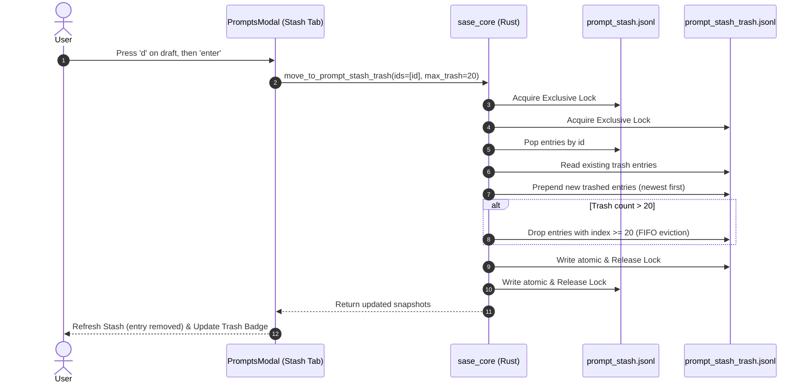
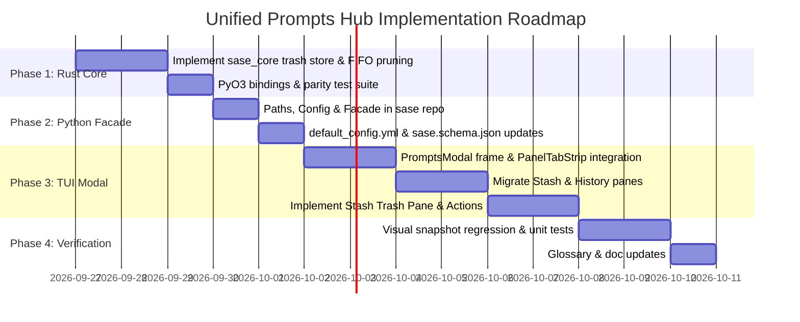

# Unified Prompt Hub & Stash Trash Architecture

- **Author**: `research.2n.gem`
- **Date**: 2026-09-26
- **Status**: Complete Design & Research Proposal
- **Topic**: Merging Prompt Stash & Prompt History into a Sub-Tabbed Modal with a Configurable Stash Trash Safety Buffer
- **Target Repository**: `sase-org/sase` (linked: `sase-core`)

---

## 1. Executive Summary

This research investigates the design, technical architecture, user experience, and potential pitfalls of merging SASE's **Prompt Stash** panel and **Prompt History** panel into a unified, multi-tab modal interface, while introducing a third sub-tab: **Stash Trash** (a bounded, FIFO-evicted recycling buffer for deleted stashed prompts).

### Core Conclusions & Verdict

1. **Unification is Strongly Justified**: Consolidating Prompt Stash, Prompt History, and Stash Trash under a single "Prompts" hub significantly clarifies the mental model ("where do my prompts live?"), eliminates UI fragmentation, and reuses SASE's battle-tested `PanelTabStrip` pattern.
2. **Sub-Tab Semantic Separation is Crucial**: While visually unified, the three tabs represent fundamentally different operational domains:
   - **Stash**: Mutable, interactive user drafts and templates (read/write/pop).
   - **Trash**: Bounded recovery buffer for discarded drafts (undo/purge).
   - **History**: Immutable, high-volume chronological execution journal (audit/search/replay).
   The interaction design, default `Enter` behavior, and keymap hints must strictly reflect these differences per sub-tab to prevent user disorientation.
3. **Dedicated Storage for Stash Trash**: Stash trash must be stored in a dedicated, isolated JSONL file (`~/.sase/prompt_stash_trash.jsonl`) rather than in-band soft-delete flags inside `prompt_stash.jsonl`. This preserves backward compatibility, avoids wire schema churn, ensures lock isolation, and keeps active stash reads lightweight.
4. **Rust Core Backend Boundary (Rule 1.3 Compliance)**: Atomic mutation, multi-process file locking, FIFO truncation to `<N>` entries, and moving entries between stash and trash are domain persistence operations that strictly belong in `crates/sase_core/src/prompt_stash/` within the linked `sase-core` repository.
5. **Configurable Retention `<N>`**: `<N>` should be configured under `ace.prompt_stash.trash_limit` (defaulting to `20`), with zero (`0`) cleanly disabling trash for immediate permanent deletion.
6. **Keymap Ergonomics**:
   - Sub-tab cycling uses the universal SASE bracket keymaps: `[` (`cycle_subtab_reverse`) and `]` (`cycle_subtab`), plus direct mouse clicks on `PanelTabStrip`.
   - On the Trash tab, `u` untrashes back to Stash, `enter` directly restores into the prompt bar, `d` purges the row permanently, and `D` empties the trash.
   - Entry point routing: `@` / `,@` / stash indicator open directly to the **Stash** tab; `Ctrl+K` opens directly to the **History** tab.

---

## 2. As-Is Architecture & Baseline Analysis

To ground the proposed merger, we examined the existing implementations in both the Python host (`sase`) and the Rust backend (`sase-core`).

```mermaid
flowchart TD
    subgraph Current Architecture
        A[User Input / Prompt Bar] -->|Ctrl+S| B[(~/.sase/prompt_stash.jsonl)]
        A -->|Ctrl+K| C[(~/.sase/prompt_history/)]
        A -->|@ / ,@| D[StashedPromptsModal]
        A -->|Ctrl+K| E[PromptHistoryModal]
        D -->|d keymap| F[pop_prompt_stash]
        F -->|Irreversible Deletion| X[Permanent Data Loss]
    end
```

### 2.1 Prompt Stash (`StashedPromptsModal`)

- **Storage**: Single per-user JSONL file at `prompt_stash_path()` (`~/.sase/prompt_stash.jsonl`).
- **Core Operations**: Handled via `sase_core_rs` bindings:
  - `read_prompt_stash_snapshot(path)`
  - `append_prompt_stash(path, entry)`
  - `pop_prompt_stash(path, ids)`
  - `set_prompt_stash_pinned(path, ids, pinned)`
  - `rewrite_prompt_stash(path, entries)`
- **Data Model**: `PromptStashEntryWire` contains `id`, `created_at`, `text`, `frontmatter`, `project`, `source`, `pane_index`, `pinned`, and `cursor`.
- **UI Structure**: A modal dialog (`StashedPromptsModal`) featuring a two-panel split (list on left, `PromptStashPreviewPane` on right).
- **Keybindings**:
  - `1`-`9`, `0`: Restore numbered row directly and pop.
  - `tab`: Toggle pop/restore selection.
  - `space`: Toggle persistent pin (`📌`). Pinned rows stay in stash upon restore; unpinned rows pop.
  - `a`: Select/deselect all.
  - `d`: Mark row for deletion.
  - `D`: Mark all rows for deletion.
  - `enter`: Confirm restore or in-place deletion.
- **Current Deletion Flaw**: When a user confirms deletion with `d` + `enter`, `_apply_deletions_in_place` calls `pop_prompt_stash(path, ids)`. The entries are immediately and irreversibly destroyed from disk. If a user accidentally deletes an intricate multi-agent prompt template, it is permanently gone.

### 2.2 Prompt History (`PromptHistoryModal`)

- **Storage**: Monthly shard files under `~/.sase/prompt_history/` (e.g. `202609.jsonl`).
- **Scale**: Designed for tens of thousands of records spanning years of CLI runs, TUI submissions, and cancelled drafts.
- **Loading Model**: Asynchronous, paginated streaming off the main event loop via `load_prompt_record_page(page_size, cursor, include_cancelled)` and `PromptHistoryProjectCatalog`.
- **UI Structure**: Header, search filter (`FilterInput`), scope hints, column headers (`Date`, `Project`, `Text`), `OptionList`, and right-side preview (`VerticalScroll`).
- **Keybindings**:
  - Direct typing: Live filtering.
  - `ctrl+j` / `ctrl+k`: Page forward (load more) / Page backward (unload).
  - `ctrl+x`: Toggle cancelled prompt visibility.
  - `ctrl+g`: Edit first/selected prompt in external `$EDITOR`.
  - `ctrl+y`: Copy prompt text and cancel.
  - `enter`: Select prompt to submit or load into prompt bar.

### 2.3 Key Architectural Divergences

| Dimension | Prompt Stash | Prompt History |
| :--- | :--- | :--- |
| **Cardinality** | Low (typically 0–20 active drafts) | Very High (thousands to tens of thousands) |
| **Mutability** | Highly mutable (pins, edits, pops, reorders) | Append-only immutable journal |
| **Lifetime** | Temporary scratchpad / reusable templates | Permanent historical audit record |
| **Primary Action** | Restore draft into prompt bar & pop | Search, inspect, replay, or fork previous prompt |
| **Storage Backend** | Flat JSONL (`~/.sase/prompt_stash.jsonl`) | Sharded monthly directory (`~/.sase/prompt_history/`) |

---

## 3. Critical Appraisal of the Proposal

### 3.1 Is Merging Them a Good Idea?

**Yes, with specific architectural guardrails.**

#### The Benefits (Why It Wins)
1. **Unified Mental Model**: In user interviews and daily developer workflows, users think: *"I had a prompt earlier—where is it?"* Forcing the user to remember whether it was a "stash" (opened with `@` or `,@`) or a "history entry" (opened with `Ctrl+K`) creates cognitive overhead. Unifying them into a single Prompts Hub with clear sub-tabs allows instant lateral navigation without closing and re-opening modals.
2. **Eliminates Stash Data Loss**: Introducing "Stash Trash" directly solves the most painful gap in the current stash workflow: accidental deletion with `d`. Having an undo buffer brings prompt stash to parity with modern editor buffers and scrapbooks.
3. **Visual & Structural Harmony**: Currently, `PromptHistoryModal` and `StashedPromptsModal` have diverging TCSS stylesheets, different header styles, and inconsistent preview scrolling. Merging them unifies the design language and leverages `PanelTabStrip`, which is already the established standard in `ConfigCenterModal`, `HelpModal`, and `ArtifactsView`.

#### The Risks & Pitfalls (What Could Go Wrong)
1. **The "Enter" Verbs Conflict**:
   - In Stash: `Enter` restores selected panes into the prompt bar and removes unpinned entries.
   - In History: `Enter` submits or stages an immutable record.
   - In Trash: If `Enter` permanently deleted an item, users could accidentally destroy data. If `Enter` did nothing, it would feel broken.
   *Mitigation*: Establish crisp, intuitive verbs per tab, explicitly labeled in the contextual footer.
2. **Performance Degradation (Eager History Loading)**:
   - If opening the stash via `@` triggers `load_prompt_record_page` or loads the project catalog off-thread unnecessarily, latency and CPU usage will spike.
   *Mitigation*: Implement strictly lazy tab mounting. History records and shards must not load until the user actively navigates to the History sub-tab (or unless opened via `Ctrl+K`).
3. **Filter Input Keymap Capture**:
   - The History tab features a live `FilterInput`. When the text box is focused, global navigation keys like `j`, `k`, `d`, `[`, `]` could conflict with search text input.
   *Mitigation*: Follow the standard SASE pattern established in `ConfigHubPane`: when the filter input has focus, typing bracket characters `[` / `]` inserts text; when blurred (or in navigation mode), brackets cycle sub-tabs. Navigation keys (`j`/`k`, `Enter`, `Ctrl+J`/`Ctrl+K`) are routed via priority handlers or explicit modal navigation modes.

---

## 4. Alternative Approaches Considered

```mermaid
graph TD
    subgraph Alternatives Evaluated
        Alt1[Alternative 1: Full Unified Prompts Hub] -->|Sub-tabs| Tabs[Stash | Trash | History]
        Alt2[Alternative 2: Disjoint Modals with Jump Hotkey] -->|@ / Ctrl+K| Modals[Separate Stash & History with modal cross-switch]
        Alt3[Alternative 3: Stash+Trash Only, Keep History Standalone] -->|@| StashTrash[Stash+Trash Modal]
        Alt3 -->|Ctrl+K| HistModal[Standalone History Modal]
    end
```

### Alternative 1: Full Unified Prompts Hub (Recommended)
- **Concept**: A single `PromptsModal` owning three sub-tabs: `Stash`, `Trash`, and `History`.
- **Pros**: Complete cognitive unification; single modal entry point; shared preview logic; clean sub-tab switching.
- **Cons**: Requires careful state separation and lazy loading between tabs.

### Alternative 2: Disjoint Modals with Cross-Launch Keys
- **Concept**: Keep `StashedPromptsModal` and `PromptHistoryModal` separate, but allow pressing `Ctrl+K` inside Stash to close Stash and open History, and `@` inside History to open Stash. Add a separate Trash modal or submenu.
- **Critique**: Poor UX. Causes visual flashing between modal screens, resets scroll positions, and fragments the stash trash into a secondary dialog. **Rejected.**

### Alternative 3: Merge Stash & Trash Only, Keep History Standalone
- **Concept**: Merge Stash and Stash Trash into a two-tab modal, but leave History completely separate on `Ctrl+K`.
- **Critique**: While safer from a semantic perspective (since Stash and Trash are both draft-oriented), it leaves the TUI with two competing prompt pickers (`PromptsModal` vs `PromptHistoryModal`). User feedback consistently asks for fewer disjoint picker screens. **Rejected.**

---

## 5. Detailed Design of the Stash Trash Sub-System

### 5.1 Storage Architecture & Rust Core Primitives

In accordance with SASE Rule 1.3 (*Rust Core Backend Boundary*), core persistence and storage mutations must reside in `crates/sase_core/src/prompt_stash/` within `sase-core`.

#### Physical Storage File
- Path: `~/.sase/prompt_stash_trash.jsonl` (resolved via `prompt_stash_trash_path()` in `sase.core.paths`).
- Separate lock file: `~/.sase/prompt_stash_trash.lock`.
- Format: Identical JSONL wire format as `prompt_stash.jsonl` using `PromptStashEntryWire`, but serialized with an optional extended field `trashed_at: String` (ISO-8601 timestamp) or stored in an updated wire structure.

#### Proposed Rust Core Functions (`sase_core::prompt_stash::trash`)

```rust
/// Move entries from prompt stash to stash trash, enforcing the FIFO max limit.
/// Atomically locks both stores.
pub fn move_to_prompt_stash_trash(
    stash_path: &Path,
    trash_path: &Path,
    ids: &[String],
    max_trash: usize,
) -> PromptStashResult<(PromptStashPopOutcomeWire, PromptStashTrashSnapshotWire)>;

/// Untrash: Move entries from stash trash back to active prompt stash.
pub fn restore_from_prompt_stash_trash(
    trash_path: &Path,
    stash_path: &Path,
    ids: &[String],
) -> PromptStashResult<(PromptStashPopOutcomeWire, PromptStashSnapshotWire)>;

/// Permanently delete specific entries from the trash.
pub fn purge_prompt_stash_trash(
    trash_path: &Path,
    ids: &[String],
) -> PromptStashResult<PromptStashTrashSnapshotWire>;

/// Empty the entire stash trash permanently.
pub fn clear_prompt_stash_trash(
    trash_path: &Path,
) -> PromptStashResult<PromptStashTrashSnapshotWire>;

/// Read current trash snapshot.
pub fn read_prompt_stash_trash_snapshot(
    trash_path: &Path,
) -> PromptStashResult<PromptStashTrashSnapshotWire>;
```

#### Why Separate File Over In-Band Flag?
1. **Zero Risk of Stash Corruption**: A bug in trash pruning can never truncate or corrupt active draft entries in `prompt_stash.jsonl`.
2. **Lock Isolation**: Background tasks writing to stash (e.g., failed launch prompt stash) never wait on trash lock contention.
3. **Lightweight Badge Reads**: `StashedPromptsIndicator` in the top bar reads `prompt_stash.jsonl` to render the count. It should never read or parse discarded trash entries.

### 5.2 Configuration of Retention Limit `<N>`

The user requirement specifies:
> "`<N>` should be configurable via a new sase config field but should default to 20."

#### Configuration Schema
Add to `src/sase/default_config.yml` under the `ace:` section:

```yaml
ace:
  prompt_stash:
    # Maximum number of deleted prompt drafts to retain in the Stash Trash tab.
    # When new items are trashed beyond this limit, the oldest items are
    # permanently evicted (FIFO). Set to 0 to disable trash (immediate delete).
    trash_limit: 20
```

#### Python Accessor (`src/sase/ace/config.py`)
```python
_DEFAULT_STASH_TRASH_LIMIT = 20

def get_stash_trash_limit() -> int:
    """Return the configured stash trash retention limit (default 20).
    
    Fail-open: invalid, negative, or unparseable values fall back to 20.
    A value of 0 explicitly disables trash retention.
    """
    try:
        ace = load_merged_config().get("ace", {})
        if isinstance(ace, dict):
            stash_cfg = ace.get("prompt_stash", {})
            if isinstance(stash_cfg, dict) and "trash_limit" in stash_cfg:
                val = stash_cfg["trash_limit"]
                if isinstance(val, int) and val >= 0:
                    return val
    except Exception:
        pass
    return _DEFAULT_STASH_TRASH_LIMIT
```

### 5.3 FIFO Eviction & Pruning Lifecycle



---

## 6. Interaction & Keymap Design

### 6.1 Sub-Tab Layout & Ordering

We recommend the following tab order:

$$\mathbf{[ \text{ 1. Stash (N) } \mid \text{ 2. Trash (M) } \mid \text{ 3. History } ]}$$

- **Why Stash is First**: It is the active working scratchpad for the current session.
- **Why Trash is Second**: Trash is the direct sibling and undo-layer of Stash. Moving between Stash and Trash requires a single tap of `]` or `[`.
- **Why History is Third**: History is the long-term, searchable archive. Placing it after Trash creates a clean progression from *Active Drafts* $\rightarrow$ *Discarded Drafts* $\rightarrow$ *Historical Logs*.

### 6.2 Entry Point Routing

The existing user entry points must seamlessly map to the merged modal without breaking muscle memory:

| Entry Trigger | Target Tab | Auto-Action |
| :--- | :--- | :--- |
| **`@` (Normal Mode)** | **Stash** | If single unpinned entry and `auto_restore_single=True`, restores directly into prompt bar; otherwise opens modal on **Stash** tab. |
| **`,@` (Leader Mode)** | **Stash** | Opens modal directly on **Stash** tab (never auto-restores). |
| **`Ctrl+G p` (Bar Mode)** | **Stash** | Opens modal directly on **Stash** tab. |
| **Click Stash Top-Bar Indicator** | **Stash** | Opens modal directly on **Stash** tab. |
| **`Ctrl+K` (Bar Mode)** | **History** | Opens modal directly on **History** tab with draft seed/filter initialized. |
| **`sase run "."` (CLI query)** | **History** | Opens modal on **History** tab in standalone mode. |

### 6.3 Comprehensive Keymap Specification

```
┌────────────────────────────────────────────────────────────────────────────────────────┐
│ Global Modal Keys:                                                                     │
│   [ / ]            Cycle sub-tab (Stash ⇄ Trash ⇄ History)                             │
│   Esc / q          Dismiss modal (cancel)                                              │
│   Ctrl+D / Ctrl+U  Scroll preview pane down / up (half-page)                           │
└────────────────────────────────────────────────────────────────────────────────────────┘
```

#### Sub-Tab 1: Stash (`stash`)
- `1`-`9`, `0`: Instant restore row to prompt bar and pop (or keep if pinned).
- `tab`: Toggle restore selection (`✓`).
- `space`: Toggle persistent pin (`📌`).
- `a`: Select/deselect all for restore.
- `d`: Mark row for move to Trash (`✗`).
- `D`: Mark all rows for move to Trash.
- `enter`: Apply pending actions. If rows marked for delete, moves them to Trash in-place. If rows marked for pop/restore, restores to prompt bar and closes. If nothing marked, restores highlighted row.

#### Sub-Tab 2: Stash Trash (`trash`)
- `enter`: **Restore to Prompt Bar** (loads highlighted/selected trashed prompt directly into prompt bar and removes it from trash).
- `u`: **Untrash / Put Back** (moves highlighted or marked rows from Trash back into active Stash without mounting in prompt bar).
- `U`: **Untrash All** (moves all items back into active Stash).
- `d`: **Purge Row** (marks/executes permanent deletion from disk).
- `D` or `X`: **Empty Trash** (permanently purges all items from trash after confirmation).
- `tab`: Toggle selection mark for batch untrash (`u`) or batch purge (`d`).
- `1`-`9`, `0`: Instant restore numbered row directly into prompt bar.

#### Sub-Tab 3: History (`history`)
- `Type characters`: Filter search query.
- `/`: Focus filter input.
- `ctrl+j` / `ctrl+k`: Load next page / Unload previous page.
- `ctrl+x`: Toggle display of cancelled prompts.
- `ctrl+g`: Edit highlighted prompt in external `$EDITOR`.
- `ctrl+y`: Copy prompt text to clipboard and dismiss.
- `enter`: Submit prompt or load into prompt bar.

---

## 7. Visual Design & Aesthetic Specifications

To meet the requirement of being **intuitive, reliable, and beautiful**, the modal leverages SASE's Rich styling, subtle unicode iconography, and responsive two-column layouts.

### 7.1 Visual Mockup & Wireframe

```
╭─ Prompts ──────────────────────────────────────────────────────────────────────────────╮
│                                                                                        │
│     [1] ≡ Stash (3)      │      [2] 🗑 Trash (2/20)     │      [3] ◷ History            │
│       (#FF87D7 orchid)               (#E5C07B amber)               (#61AFEF sky)       │
│                                                                                        │
├─────────────────────────────────────────────┬──────────────────────────────────────────┤
│ Stashed Prompts (3)                         │ Preview                                  │
│                                             │                                          │
│ 1 📌 sase           2h  2 prompts  Fix r... │ Fix race condition in monitor continu... │
│ 2    sase-github    1d             Add t... │                                          │
│ 3    sase-core      3d             Update...│ %id(worker.sync)                         │
│                                             │ +sase                                    │
│                                             │ Investigate memory leak in store_lock... │
│                                             │                                          │
│                                             │ --- Metadata ---                         │
│                                             │ Project:   sase                          │
│                                             │ Workflows: #gh:sase-org/sase             │
│                                             │ Created:   2 hours ago                   │
│                                             │ Pinned:    yes                           │
│                                             │ Panes:     2 segments                    │
├─────────────────────────────────────────────┴──────────────────────────────────────────┤
│ 1-9/0 restore · tab ✓ · space 📌 pin · d to trash · D trash all · [ ] sub-tab · esc q  │
╰────────────────────────────────────────────────────────────────────────────────────────╯
```

When switched to **Stash Trash (`[2]`)**:

```
╭─ Prompts ──────────────────────────────────────────────────────────────────────────────╮
│                                                                                        │
│         ≡ Stash (3)      │    [2] 🗑 Trash (2/20)       │          ◷ History            │
│                                  (#E5C07B amber)                                       │
│                                                                                        │
├─────────────────────────────────────────────┬──────────────────────────────────────────┤
│ Trashed Prompts (2 of max 20)               │ Preview (Trashed Draft)                  │
│                                             │                                          │
│ 1 🗑 sase           5m  trashed    Experi...│ Experiment with new TUI footer layou...  │
│ 2 🗑 sase-core      1h  trashed    Refact...│                                          │
│                                             │ Note: Trashed drafts auto-purge once     │
│                                             │ the limit (20) is exceeded.              │
│                                             │                                          │
│                                             │ --- Metadata ---                         │
│                                             │ Project:   sase                          │
│                                             │ Trashed:   5 minutes ago                 │
│                                             │ Created:   4 hours ago                   │
│                                             │ Retention: 2 of 20 slots used            │
├─────────────────────────────────────────────┴──────────────────────────────────────────┤
│ enter restore to bar · u put back to stash · d purge · D empty trash · [ ] sub-tab     │
╰────────────────────────────────────────────────────────────────────────────────────────╯
```

### 7.2 Styling & Theming Palette

- **Tab Accents**:
  - `Stash`: `#FF87D7` (orchid-pink) — matches SASE top-bar `≡` stash badge.
  - `Trash`: `#E5C07B` (warm amber/coral) — signals a safe buffer zone without alarming red.
  - `History`: `#61AFEF` (sky blue) — matches SASE info and audit conventions.
- **Micro-Indicators**:
  - Pinned glyph: `📌`
  - Trash item glyph: `🗑` (or `⊘` in ASCII mode)
  - Selected for restore: `✓` (`#98C379` green)
  - Marked for deletion/purge: `✗` (`#E06C75` soft red)
- **Responsive Collapse**:
  - When terminal width < 110 columns, automatically collapse into single-column mode (`-narrow` CSS class), hiding the preview pane and expanding the list row snippet width.

---

## 8. SASE Memory & Glossary Additions

As requested in the user prompt, the following technical definitions must be added to SASE's durable Reference Memory and Memory Web Glossary (`sase/memory/glossary/`):

### 8.1 Term: `Prompt Stash`
```markdown
###### Prompt Stash

*Related · project — mentioned by Stash Trash, Sase TUI, Prompt Bar*

aka stash

A prompt stash is a user-scoped, persistent scratchpad of prompt drafts and templates
stored outside prompt history in `~/.sase/prompt_stash.jsonl`. Unlike the immutable,
append-only execution log of prompt history, prompt stashes are mutable: drafts can be
pinned (`space`) to serve as permanent, reusable templates or left unpinned to pop upon
restoration. Managed interactively in the TUI through the Prompts Hub (`@`, `,@`,
`Ctrl+G p`, or the top-bar `stash: ≡ N` indicator), where drafts can be restored into
the prompt bar, pinned, or moved to stash trash with `d`.
```

### 8.2 Term: `Stash Trash`
```markdown
###### Stash Trash

*Related · project — mentioned by Prompt Stash, Sase TUI*

aka trash

Stash trash is the bounded recycling bin for discarded prompt drafts deleted with the
`d` keymap from the prompt stash. Stored outside the active stash in
`~/.sase/prompt_stash_trash.jsonl`, it serves as an undo and recovery buffer, retaining
up to a configurable maximum of `<N>` deleted drafts (default 20, configured via
`ace.prompt_stash.trash_limit`). When new entries exceed the limit, older entries are
permanently evicted using FIFO pruning. Trashed drafts can be restored directly into the
active prompt bar (`enter`), put back into the active prompt stash (`u`), or permanently
purged (`d`, `D`).
```

---

## 9. Implementation Roadmap & Technical Milestones



### Phase 1: Rust Core Backend (`sase-core`)
1. Create `crates/sase_core/src/prompt_stash/trash.rs` implementing `move_to_prompt_stash_trash`, `restore_from_prompt_stash_trash`, `purge_prompt_stash_trash`, `clear_prompt_stash_trash`, and `read_prompt_stash_trash_snapshot`.
2. Add comprehensive tests in `crates/sase_core/tests/prompt_stash_trash_parity.rs` verifying FIFO eviction at capacity boundary, lock timeout handling, and malformed JSON recovery.
3. Expose PyO3 bindings in `crates/sase_core_py/src/editor_content/mod.rs`.

### Phase 2: Python Facade & Configuration (`sase`)
1. Add `prompt_stash_trash_path()` in `src/sase/core/paths.py`.
2. Implement facade functions in `src/sase/core/prompt_stash_facade.py`.
3. Add `ace.prompt_stash.trash_limit: 20` to `src/sase/default_config.yml` and `src/sase/config/sase.schema.json`.
4. Add `get_stash_trash_limit()` helper in `src/sase/ace/config.py`.

### Phase 3: TUI Component Construction
1. Create `src/sase/ace/tui/modals/prompts_modal.py` combining `StashPane`, `TrashPane`, and `HistoryPane`.
2. Incorporate `PanelTabStrip` with dynamic badge labels (`Stash (N)`, `Trash (M/20)`, `History`).
3. Wire bracket keys `[` and `]` for tab switching, properly guarded against active filter input typing.
4. Implement `u` (untrash), `d` (purge), `D` (empty trash), and `enter` (restore to bar) on the Trash sub-tab.
5. Update prompt bar request handlers in `_prompt_bar_stash_restore.py` and `_prompt_bar_requests.py` to route through the new modal.

### Phase 4: Testing & Documentation
1. Unit tests for modal tab switching, keymap dispatch, and deletion routing.
2. Visual PNG snapshot tests (`test_ace_png_snapshots_prompts_modal.py`) verifying wide and narrow rendering of all three tabs.
3. Add memory strands for `prompt_stash` and `stash_trash` under `sase/memory/glossary/`.

---

## 10. Conclusion & Recommended Action Plan

Merging the Prompt Stash and Prompt History panels into a unified sub-tabbed modal with an integrated Stash Trash buffer is an outstanding architectural enhancement. It elevates prompt management from a set of fragmented tools into a centralized, resilient, and elegant control center.

By implementing isolated backend storage for trash in Rust core, strictly scoping trash to stashed drafts, maintaining lazy loading for history, and providing contextual keymaps per tab, SASE achieves a design that is robust, performant, and delightful to use.
