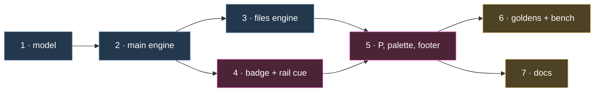

# ◆ sase-1b1: What Deck Views Add

- **Epic:** `sase-1b1`, _Deck views: see and choose how a deck panel pages its cards and
  blocks_
- **Plan:** `plan:202609/deck_views.md`
- **Research:** `research:202609/deck_card_paging_ux/deck_card_paging_ux.md`
- **Reviewed:** 2026-09-27, against sase `25a7bd24fe`

> **Status.** The epic was approved and launched on 2026-09-27 at 05:45 EDT. All 7
> phases are in progress. As of 06:25 EDT nothing has landed: no commit on master
> references `sase-1b1`, and no `DeckView`, `view_policy`, or `cycle_deck_view` symbol
> exists under `src/`. This report describes the value the approved plan **will** add.
> It does not describe shipped behavior.

## The one-paragraph version

Card blocks (`sase-19x`) gave every Agents-tab deck panel two automatic paging
decisions: whether the deck spreads or pages its cards, and whether a long Reply pages
its turn blocks. Neither decision is visible, and neither can be overridden. **sase-1b1
makes the layout legible and choosable.** It does this with one ordered _view depth_ of
three layouts (`spread` → `page cards` → `page blocks`) and one text badge in the top
border that names the layout and whether it is `auto` or `fixed`. `P` widens the view
without losing your place, and the palette picks a view directly or restores Auto.
Choices persist per panel and per deck. All of it is presentation-only TUI state, and
Auto's behavior stays byte-for-byte the same.

```text
today   ◆ MAIN ┃ Context │ Reply  2/2                      spread? paged? blocks? chosen?
after   ◆ MAIN  page blocks · auto ┃ Context │ Reply  2/2   all four answered in the title
```

## 1. The blind spot today

| Question the reader has               | What the TUI shows on master                                                                          |
| ------------------------------------- | ----------------------------------------------------------------------------------------------------- |
| Is this deck spread or paged?         | A dim `spread` in the bottom border, only when spread. It is the first thing dropped when space is short. |
| Are the Reply's blocks inline or paged? | Nothing. The block rail looks the same in both modes.                                                 |
| Did the TUI choose this, or did I?    | No such concept. The layout is always automatic.                                                      |
| Can I change it?                      | Only globally, by editing `spread_max_screens` / `block_spread_max_screens` (1.5 screens, ±10 % hysteresis). |

**Verified in code on master** (paths under `src/sase/ace/tui/widgets/decks/`):

- **The only mode cue is the first to go.** `deck_subtitle()` tries its width candidates
  as tag + counted switcher → counted switcher → … (`titles.py:255`). The `spread` tag is
  gone before the switcher counts are. Paged is signaled only by the tag's absence.
- **The title has no mode.** `deck_title()` has full, compact, and micro tiers. None of
  them carries a layout.
- **Returning to spread loses your place.** In `_apply_main_transition`, the spread
  branch always returns early (`panel_transitions.py:530–553`). As a result the
  `_restore_spread` offset restore at line 584 is unreachable. Paged → spread lands on
  the preferred card or on a sticky landing, and the reader's offset and bottom pin are
  lost.
- **Deck state resets new fields.** `with_panel_deck` and `with_preferred_card`
  rebuild `DeckPanelState(deck, preferred)` positionally (`model.py:95, 107`). Any new
  panel field would be silently reset on every deck switch.
- **The Files probe is not complete.** `probe_files_spread()` stops once it passes its
  row bound. Its pages cannot back a forced spread without silently dropping content.

**How often it matters.** These numbers are a fresh measurement on the Mac: 280 agent runs
from September 2026, grouped into 197 sessions by `agent_family`. Raw Reply line counts
are a lower bound on rendered rows, so every share below is a floor.

| Signal                                                   | Full-height panel (30 rows) | Half-height split (15 rows) |
| -------------------------------------------------------- | --------------------------- | --------------------------- |
| Sessions whose deck Auto-pages                           | **≥ 25 %**                  | **≥ 51 %**                  |
| Multi-turn Replies whose blocks Auto-page                | **≥ 44 %** (17 / 39)        | **≥ 69 %** (27 / 39)        |

- **Layout flips unannounced:** for **26 %** of sessions (52 / 197), the automatic layout
  at full height differs from the one at half height. A top/bottom split changes the
  picture, and nothing on screen says so.
- **Turns per session:** p50 1, p90 3, max 13. 20 % of sessions (39) have ≥ 2 turns,
  so their Reply has blocks.
- **Raw Reply lines per session:** p50 25, p90 107, max **8,853**.
- **athena, for comparison:** the card-blocks research measured 70 sessions over Sep
  20–25, with 3 / 5 / 15 turns and 72 / 738 / **14,013** Reply lines (p50 / p90 / max).
  The plan's 14,000-line pathological benchmark fixture is sized to that real maximum.

## 2. What the epic adds

```text
◆ MAIN  page blocks · auto ┃ Context │ Reply  2/2          full width
◆ MAIN  spread · fixed ┃ Context │ Reply  2/2               a fixed choice, bold accent
◆ MAIN  blocks · auto ┃ ‹ 2/2 › Reply                       compact split
MAIN B·A 2/2                                                micro
▤ FILES  page cards · spreading… ┃ ‹ 2/5 › app.py          fixed spread, probe in flight
▤ FILES  page cards · spread unavailable ┃ ‹ 1/3 › shot.png  fixed spread, blocked by media

          P               P            P
page blocks ──▶ page cards ──▶ spread ──▶ page blocks …    back to Auto: palette only
```

| Question                         | After sase-1b1                                                                                                   |
| -------------------------------- | ---------------------------------------------------------------------------------------------------------------- |
| **Which layout am I in?**        | A badge right after the deck name, on a 7-rung width ladder that ranks the badge above inactive card tabs.        |
| **Auto, or my choice?**          | `auto` (muted) or `fixed` (bold accent). These are text, not color: `A`/`F` survive monochrome and micro widths.  |
| **Where am I in the blocks?**    | The rail adds `page 3/5` or `all 5` in its widest tier.                                                          |
| **Can I change it?**             | `P` steps one layout wider and wraps. Palette entries: `Deck view: spread / page cards / page blocks (fixed)` and `Deck view: automatic`. |
| **Will it stick?**               | Per panel and per deck, across agents, `j`/`k`, deck switches, splits, zoom, and restart.                        |
| **Will I lose my place?**        | No. One anchor (card, block, offset, bottom pin) is restored in every direction, including rapid `P P P`.         |

## 3. Value by audience

### 👀 Everyone who reads agent output

- **A whole long Reply in one press.** Auto usually lands a long multi-turn Reply on
  `page blocks`. The first `P` widens it to `page cards`: the full Reply, without
  spreading the whole deck.
- **Layout changes stop being mysterious.** When a split or a resize flips the
  automatic layout (26 % of Mac sessions), the badge changes in place.
- **A preference per panel.** For example, a narrow right split can stay `page cards`
  while the left panel stays `auto`. New panels start `auto`.
- **Nothing is silently dropped.** A forced Files spread reads complete pages. It caps
  each page at the paged view's render limit and shows the same truncation hint. Media
  yields `spread unavailable` plus one toast, and the preference waits for the next text
  subject.

### ⌨️ Interaction quality

- **One key, one source of truth.** The badge, footer (`P view`), `P` availability, and
  palette visibility all derive from one pure resolver, so they cannot disagree.
- **Every press changes the screen.** Layouts that render identically for the current
  content are skipped. When fewer than two distinct layouts exist (Tools, an empty or
  single-card deck, a partial document, Files with media), `P` is hidden rather than
  dead.
- **Quiet by default.** Routine presses post no toasts. Only the first `P` that turns
  Auto into fixed posts one: `Main view fixed · palette “Deck view: automatic” undoes`.
- **No flicker.** During `j`/`k` header-only paints, the badge holds its last
  full-document value.

### 🏗️ The codebase: structural dividends

| Dividend                                                                     | Why it outlasts this epic                                                                                     |
| ---------------------------------------------------------------------------- | ------------------------------------------------------------------------------------------------------------- |
| Pure `view_policy.py` and `view_badge.py` (signatures, cycle, label rule)    | Unit-tested without Textual. Any future deck or frontend reuses the same equivalence rules.                    |
| `dataclasses.replace` in the deck-state helpers                              | Fixes the latent positional-rebuild reset for every future panel field, including 1b2's per-deck cards.        |
| A spread-target anchor restore                                               | The first working paged → spread restore. Automatic transitions can adopt it later (see §6).                   |
| A complete Files probe with per-page caps and a `truncated` flag             | Spread becomes a promise the renderer can keep. It never reads a whole huge file.                              |
| Fixed views skip measurement                                                 | A fixed panel does less work than Auto on every subject change.                                                |
| An additive `views` field in the schema-v1 state file                        | Zero migration code. Older builds keep reading the file.                                                       |
| Explicit Main/Files dispatch (`deck in (MAIN, FILES)`, never "not Tools")    | A new deck (FINAL) stays `auto` by construction instead of by accident.                                        |

## 4. Where the plan improved on its research

| The research said                                                                       | The plan decided                                                              | Why it is better                                                                                |
| --------------------------------------------------------------------------------------- | ----------------------------------------------------------------------------- | ----------------------------------------------------------------------------------------------- |
| Cycle `spread → cards → blocks`, yet "first press from page blocks yields page cards"   | **Widen and wrap:** `blocks → cards → spread`                                 | Resolves the contradiction. One press reaches the whole Reply, and a big Reply never passes through full spread on the way. |
| Two-field badge: `AUTO · DECK PAGED · BLOCKS SPREAD`                                    | One layout name plus a status: `page blocks · auto`                           | Two fields would imply two switches, the very model the design rejects. It is also shorter in splits. |
| Bump the schema; "today's decoder rejects any version other than 1"                     | Keep v1 and add an optional `views` field                                     | `_decode_panel` already ignores unknown keys, so no migration is needed and old builds stay compatible. |
| Show `BLOCKS —` on a blockless card                                                     | Label rule: show the requested name when the request is vacuous               | A fixed badge stays stable across `Ctrl+J`, and it never names a picture that is not on screen. |
| Performance guard left open                                                             | Budgets: `P` p50 ≤ 150 ms, p95 ≤ 300 ms; 14k-line Reply ≤ 1 s; Files ≤ 1 s after the probe | Measurement comes before mitigation, and the mitigations are applied in a stated order. |
| Forced Files spread (not addressed)                                                     | A complete probe with truncation hints, `spreading…`, and `spread unavailable` | Closes a silent content-loss path the research never saw.                                       |

## 5. How the value arrives



| Wave        | Phases | Value unlocked                                                                    | Visible to users              |
| ----------- | ------ | --------------------------------------------------------------------------------- | ----------------------------- |
| Foundations | 1      | Policy model, pure resolver, badge text, persistence                              | No                            |
| Engines     | 2, 3   | Fixed policies honored, anchor-preserving transitions, the complete Files probe   | No (nothing can set a policy) |
| **See**     | 4      | Badge and rail cue. The subtitle's `spread` tag is removed.                       | **Yes**, the badge reads `auto` |
| **Choose**  | 5      | `P`, palette choices, footer, help, toasts                                        | **Yes**                       |
| Prove       | 6      | 6 new PNG goldens, live inspection at wide and narrow widths, D10 benchmarks      | No                            |
| Explain     | 7      | `docs/ace.md` and `docs/configuration.md`                                         | Yes                           |

- **Earliest payoff:** the badge sits **three phases deep** (1 → 2 → 4), and choice
  arrives one phase later.
- **Critical path:** five phases (1 → 2 → 3 → 5 → 6).
- **Size:** 6 medium phases and 1 small.
- **No flag.** Each landed phase is coherent on its own: the badge is useful before `P`
  exists. That matches the flag policy, which scaffolds only unfinished user-facing
  slices.

## 6. Review notes: what could dilute the value

1. **A durable choice outlives its context.** A `spread` fixed on a small Reply also
   applies to the next 8,853-line (Mac) or 14,013-line (athena) Reply in that panel. The
   bold `fixed` badge and the D10 benchmark are the defenses. **Watch the 14k-line
   result.** If it misses 1 s, the plan's last-resort guard becomes necessary.
2. **Reset is palette-only.** `P` cycles exactly three layouts, and Auto returns only
   through `Deck view: automatic`. The first-fix toast and the help row
   `Cycle deck view (auto: palette)` teach this. If panels drift into stale fixed views,
   the plan already names the fix: a dedicated reset key.
3. **The block half serves a minority on the Mac.** Only 20 % of Mac sessions have ≥ 2
   turns, against a p50 of 3 turns on athena. The deck half (spread versus page cards)
   is the universal win, because at least 25–51 % of sessions Auto-page.
4. **Automatic transitions keep today's gap.** The anchor-preserving restore is built
   for the view-change path only. An automatic paged → spread flip, such as on a
   resize, still skips the unreachable `_restore_spread`. **Suggested follow-up:** route
   `_apply_main_transition` through the new spread-target restore.
5. **Delivery risk is the concurrent sase-1b2 epic.** All seven phases share files with
   1b2 phases: `DeckPanelState`, the deciders, titles, the palette, goldens, and docs.
   The live races are 1b1.1 against 1b2.9/.10 and 1b1.2–.4 against 1b2.11. The epic
   carries nine shared rules (R1–R9). Under R1,
   FINAL gets no views, and whichever epic lands second proposes extending views to it.
   The land agent's merged-tree check matters more than usual here.
6. **Older builds drop `views` silently.** This is the price of the additive v1 field.
   If an older sase rewrites `ace_agents_deck_state.json`, fixed views revert to Auto.
   That is fail-open and harmless, but noticeable when two builds share one `~/.sase`.

## Bottom line

sase-1b1 makes an invisible, automatic decision visible and reversible. It does so with
one badge, one key, and one palette family, which answer "spread or paged, blocks inline
or paged, automatic or mine?" at every width. It keeps the reader's place, so a layout
change never feels like navigation. Auto stays exactly as it is, fixed views cost less
than Auto, and forced spreads are benchmarked. The side effects are a pure resolver, a
fixed deck-state reset bug, a working spread restore, and a complete Files probe. They
leave the deck layer safer for the next deck, starting with FINAL.

---

**Sources**

- The `sase-1b1` epic and its 7 phase beads, including the cross-epic notes shared with
  `sase-1b2`, read with `sase bead read`.
- `plan:202609/deck_views.md`.
- `research:202609/deck_card_paging_ux/deck_card_paging_ux.md` and the card-blocks
  research `research:202609/agent_data_card_blocks/agent_data_card_blocks__cld.md`
  (athena session sizes, Appendix B).
- Code checks on sase `25a7bd24fe`: `titles.py`, `model.py`, `panel_transitions.py`,
  `panel_spread.py`, `panel_blocks.py`, `block_rail.py`,
  `file_panel/_spread_probe.py`, `models/agent_deck_persistence.py`, and
  `default_config.yml`.
- Mac metrics were computed on 2026-09-27 from the 280
  `~/.sase/projects/*/artifacts/ace-run/202609/*/*/agent_meta.json` runs, grouped by
  `agent_family`. Reply size is the larger of `live_reply.md` and `response.md`. Budgets
  assume 30-row (full) and 15-row (split) panel bodies at 1.5 screens with +10 %
  hysteresis.
