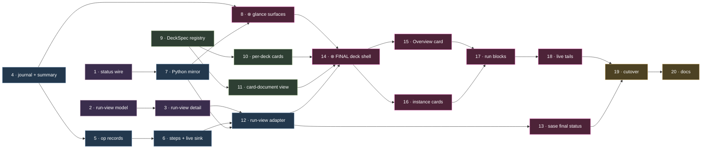

# ⊛ sase-1b2: What Finalizer Visibility Adds

- **Epic:** `sase-1b2`, _Finalizers on the Agents tab: FINALIZING rows, Reply receipts,
  and the ⊛ FINAL deck_
- **Plan:** `plan:202609/agents_tab_final_deck.md`
- **Research:**
  `research:202609/agents_tab_finalizer_visibility/agents_tab_finalizer_visibility.md`
- **Reviewed:** 2026-09-27, against sase `ee40b14447` and sase-core `fe1e065`

> **Status.** The epic was approved and launched on 2026-09-27 at 05:49 EDT, and all 20
> phases are in progress. Nothing has landed yet: neither sase master nor sase-core
> carries an epic commit, and the `ace_final_deck` flag does not exist. This report
> describes the value the approved plan **will** add. It does not describe shipped
> behavior.

## The one-paragraph version

Finalizers land a SASE turn's work. Commit, check, tasks, and plugin finalizers run under
host control after the model finishes. None of this shows on the Agents tab today. For
one to two minutes per turn, the row says `RUNNING` although the model is done. Rejected
declarations, deferred commits, warnings, and handoff skips exist only in files nobody
opens. **sase-1b2 makes landing legible at four zoom levels**: row, Reply, deck, and CLI.
All four read one provider-neutral data layer, reconciled by one Rust projection. The
layer never changes a verdict, and nothing in it is specific to commit. The largest
payoffs:

- rows that tell the truth
- landing failures that look different from model failures
- a direct answer to "why didn't my finalizer run?"
- future finalizers that render fully on day one, with no TUI code

## 1. The blind spot, measured

Both columns cover the last 15 days. The athena column comes from the epic's research
(2026-09-25). The mac column is a fresh re-measurement made for this review
(2026-09-27).

| Signal                                     | athena                     | mac                                         | Agents tab today |
| ------------------------------------------ | -------------------------- | ------------------------------------------- | ---------------- |
| Model done → finalizer result              | p50 **108 s**, p90 265 s   | p50 **53 s**, p90 98 s (committing runs)    | `RUNNING`        |
| Runs with ≥ 1 rejected `sase final submit` | **41 %** (72 / 174)        | 10 % (3 / 29)                               | nothing          |
| Successful commits printing `⚠` warnings   | **96 %** (165 / 172)       | **100 %** (29 / 29)                         | nothing          |
| Sealed plan with no result and no record   | 184 (102 plan handoffs)    | 28 (16 plan handoffs)                       | nothing          |
| Declaration recovery model turns           | 10                         | 0                                           | nothing          |
| Clean-tree runs (zero attempts)            | 11 % (22 / 196)            | 52 % (32 / 61), each reported as `success`  | nothing          |

**Verified in code on master** (paths under `src/sase/`):

- **Nothing is written while finalizers run.** The controller keeps the active instance
  in local variables. `finalizer_result.json` is written only at terminal points.
- **A handoff skip leaves no trace.** `finalizers/controller.py:122` returns early and
  writes nothing.
- **`finalizers_drift` is written and never read.** The only reference is the writer at
  `controller.py:91`.
- **The three executors write three incompatible attempt shapes.** Conflict repair also
  hard-codes the instance id `"commit"` at 8 sites in `commit_repair_conflict.py`.
- **The deck layer can't safely take a fourth deck:**
  - `DeckId` is `MAIN | FILES | TOOLS`.
  - `panel_chrome._FALLBACK_ACCENTS[deck]` raises `KeyError` for any new deck.
  - `panel_blocks.py` (703 lines) references `DeckId.MAIN` 13 times.
  - `DeckPanelState.preferred_card` is one slot shared by every deck.

## 2. What the epic adds: four zoom levels

| Zoom           | Question                                                       | Surface                          | Today → after sase-1b2                                                                                                           |
| -------------- | -------------------------------------------------------------- | -------------------------------- | -------------------------------------------------------------------------------------------------------------------------------- |
| **Glance**     | Is it still landing? Did landing fail?                         | Agent row and header chip        | `RUNNING` becomes `FINALIZING ⊛ commit · just fix 1:42`. A `⊛✗`, `⊛⏸` or `⊛!` chip follows a non-success. Success stays silent. |
| **In context** | How did _this_ turn land?                                      | End of each shell's Reply phase  | Nothing becomes a 1–4 line `─── ⊛ FINAL ───` receipt with headline evidence and exactly one failure-reason line.                 |
| **Diagnose**   | What ran, why, what failed, and what did it print?             | New `⊛ FINAL` deck (`p n`)       | Opening files by hand becomes an Overview plus one card per instance, with attempts, operations, steps, evidence and live tails.  |
| **Author**     | Why wasn't my finalizer selected? What did my validator reject? | Overview card, `sase final status` | Invisible becomes selection reasons, a declaration timeline, controller cycles and drift.                                        |

```text
▶ sase-1ab--code   (FINALIZING)  ⊛ commit · just fix 1:42
✗ sase-1c9--code   (FAILED)      ⊛✗ check
✓ research.b.cld   (DONE)        ⊛⏸ commit
✓ sase-1d2--code   (DONE)                      ← success stays silent

─── ⊛ FINAL ─── 07:31:40 ─────────────────────────────────────
  ✗ check    command_failed · attempt 2/2                 3m40s
             FAILED tests/ace/tui/test_final_deck.py::test_receipt
  – tasks    not run · blocked by check
             p n  open FINAL deck
```

## 3. Value by audience

### 👀 Operators watching the fleet

- **Rows tell the truth.** The window between the model finishing and the work landing
  reads `FINALIZING` instead of `RUNNING`. This is a presentation overlay (D11), so
  buckets, ordering, filters, capacity and actions are unchanged. Only the label moves.
- **Different failures look different.**
  - `⊛✗` on a FAILED row means "the work was done, but landing failed". That needs a
    different fix from a failed model turn.
  - `⊛⏸` on a DONE row flags a deliberately deferred commit, which today is a lie of
    omission.
- **The signal stays meaningful.**
  - Success is silent.
  - Warnings never color a row, which matters when 96–100 % of successes carry them.
  - A session chip counts only runs after the newest clean landing, so a fixed feedback
    round clears it (D10).
- **A one-key triage loop.** Pin FINAL below Reply with `p N`, and each `j`/`k` shows one
  agent's landing story. The `final ✗` border subtitle is visible from every deck.

### 🔧 Whoever debugs a landing

- **One place for everything.** Attempts, operations, steps, exit codes and durations
  sit together. Earlier attempts collapse and the failing one expands. `v` opens stdout,
  stderr, live logs, protocol envelopes and recovery prompts.
- **Named states replace silence and false alarms.**
  - `skipped · plan handoff` labels the 102 (athena) and 16 (mac) plan-shell skips per
    fortnight that today leave no record.
  - A killed finalizer reads `interrupted`, never a forever-spinner.
  - `not reached` stays calm.
- **Output survives a kill.** A bounded live sink rotates at 512 KiB. It keeps the output
  of a finalizer killed at the 1,800 s hard timeout, and it is deleted after normal
  completion.
- **Errors stay in proportion.** Diagnostics from superseded attempts are downgraded, so
  a success reached on a retry never shows red.

### ✍️ Finalizer and plugin authors

- **Why it didn't run.** The Overview lists configured-but-unselected instances with the
  reason: `%final:!lint`, `%final:none`, or `not default`.
- **What was rejected.** The declaration timeline shows each rejected submit with its
  code, which covers athena's 41 % of runs with a rejection. The Overview also becomes
  the first reader of `finalizers_drift`.
- **The same view in the terminal.** `sase final status [<agent>]` prints the same
  projection, pretty or as JSON. An agent debugging a predecessor sees exactly what the
  user sees.
- **No TUI code for a new finalizer.** A plugin emits progress through
  `sase.finalizers.sdk.step()` and typed evidence (`*_sha`, `*_url`, `bead_id`,
  `*_path`, `*_seconds`, `exit_code`), and it renders fully. The acceptance test is a
  hypothetical `acme-sase@open-pr` fixture that must render with no provider-specific
  branch.

### 🏗️ The codebase: structural dividends

| Dividend                                                  | Why it outlasts this epic                                                                                     |
| --------------------------------------------------------- | ------------------------------------------------------------------------------------------------------------- |
| `DeckSpec` registry and explicit per-deck dispatch        | The next deck costs one record, not ~15 parallel tables. An unknown deck fails loudly instead of silently becoming Tools. |
| Per-deck sticky cards                                     | Fixes a latent conflict: a second sticky deck would overwrite Main's sticky Reply.                             |
| `CardDocumentView` and a generalized block host           | Card blocks, spread/paged, search and export stop being Main-only.                                             |
| Uniform operation record                                  | One renderer serves every executor. The conflict-repair fix stops a renamed commit instance from writing into `commit/`. |
| Rust `finalizer::run_view` projection                     | The TUI, the CLI, and any future web or mobile view agree on what happened and why.                            |
| Progress journal and `finalizer_status` summary           | A cheap, durable landing record that future notifications and roll-ups can reuse.                              |

## 4. Built for finalizers that don't exist yet

Every run in both corpora is a single `commit` instance, so the design deliberately
avoids fitting itself to commit:

- **Sase owns the layout; providers own the evidence.** There is no TUI plugin API.
- **The projection and the deck model have no commit fields.** `commit` and `command` get
  _enrichers_ (a per-repo table; an argv line and failing lines). Plugins need none.
- **Calm states are first class:** `refused ⊘`, `deferred ⏸`, `not triggered ○`,
  `skipped ○` and `not run –`. A safety finalizer that refuses often won't read as
  broken.
- **Order comes from the plan's `after` edges,** not from an invented linear pipeline.

## 5. How the value arrives



| Wave        | Phases        | Value unlocked                                                                      | Visible to users     |
| ----------- | ------------- | ----------------------------------------------------------------------------------- | -------------------- |
| Foundations | 1, 2, 4, 9    | Handoff skips and live progress recorded on disk; the deck layer made safe to extend | No (data only)       |
| **Glance**  | 7 → 8         | `FINALIZING`, `⊛` chips, the header chip, Reply receipts                            | Behind `ace_final_deck` |
| Data depth  | 5, 6, 3       | Uniform operation records, stitch steps, live logs that survive timeouts            | No                   |
| Author CLI  | 12 → 13       | `sase final status`                                                                 | **Yes, unflagged**   |
| Deck        | 10, 11, 14–18 | ⊛ FINAL deck, Overview, instance cards, run blocks, live tails                      | Behind the flag      |
| Cutover     | 19 → 20       | Flag removed, goldens, the j/k bench, docs                                          | Yes                  |

- **Earliest payoff.** The glance surfaces sit only **three phases deep** (1 → 7 → 8).
- **Critical path.** It is **ten phases** long and runs through the producer chain:
  journal → operation records → step channel → adapter → deck → cards → blocks → live
  tails → cutover → docs.
- **Size.** 7 phases are small and 13 are medium.

## 6. Guardrails that protect the value

- **Observability never changes a verdict (D14).**
  - There is no execution-wire bump.
  - Every writer is best-effort.
  - Fault-injection tests prove that verdicts and `finalizer_result.json` bytes don't
    change.
- **Bounded by construction:**
  - journal 256 KiB, steps 64 KiB, live logs rotating at 512 KiB
  - a 4 MiB pre-parse ceiling; oversized input shows `unavailable` and keeps raw access
- **Performance:**
  - no artifact I/O in render or keystroke paths
  - the 1 Hz tick runs only for the selected, visible, active node
  - j/k p95 must stay under 16 ms with the flag on and off
- **Secrecy:** the projection never outputs config values, enforced by a sentinel test.
- **Safe rollout:**
  - With the flag off, output is byte-identical.
  - Goldens stay pixel-identical until cutover.
  - v1 is read-only: no retry, cancel or bypass controls.

## 7. Review notes: what could dilute the value

1. **Chronic warnings will mute `⚠N`.** 100 % of mac successes and 96 % of athena
   successes print `⚠`. The top sources are all known:
   - quarantined hood publications (`sase-10x`, still open)
   - the prompt-archive link fence (noted on `sase-yy.8.6`)
   - the artifact-link outbox drain

   D7 keeps warnings off rows, which is right. But the receipt's `⚠N` and the deck's
   "success with warnings" carry almost no information until these are fixed.
   **Suggestion:** land `sase-10x` before or alongside cutover.
2. **Near-term value is mostly glance.** Today there is one `commit` instance, no
   instance with more than one attempt, and about 1 % of sessions with more than one
   run. FINAL will usually show one card and no blocks. The near-term wins are truthful
   rows, receipts, skip labels and the declaration timeline. The multi-instance deck
   pays off as `check`, `tasks` and plugin finalizers arrive.
3. **The busier host gains most.** On mac the invisible window is about half athena's,
   and rejections are about a quarter as common. Even so, 86 % of mac's committing runs
   spend over 30 s mislabelled as `RUNNING`.
4. **`success` hides no-ops.** Half of mac's runs report `success` with zero attempts.
   The projection's `not triggered` state, derived from `final_context.json`, is what
   separates them, and the plan's zero-attempt fixture covers it.
5. **Visibility isn't a fix.** In `sase-193`, a phase bead stays closed when declaration
   recovery fails. The timeline and chip will make that failure visible, but the bug
   stays open until someone fixes it.
6. **The refactor risk comes first.** Phases 9–11 rework deck plumbing that every panel
   uses, and they must leave every golden pixel-identical. Their reviews deserve the
   most care.

## Bottom line

sase-1b2 turns the least observable one to two minutes of every SASE turn into the
best-explained part. Rows stop lying, landing failures get a name and a reason, and
authors get a "why" for every selection and rejection. All of it comes from one additive,
fail-safe data layer and one shared Rust projection. The structural work (`DeckSpec`,
per-deck cards, a generic card-document view, uniform operation records) lowers the cost
of the next deck and the next finalizer long after this epic closes.

---

**Sources**

- The `sase-1b2` epic and phase beads, read with `sase bead read`.
- `plan:202609/agents_tab_final_deck.md`.
- `research:202609/agents_tab_finalizer_visibility/agents_tab_finalizer_visibility.md`.
- Code checks on sase `ee40b14447` and sase-core `fe1e065`.
- Mac metrics, computed on 2026-09-27 over the 89 finalizer plans sealed in the last 15
  days under `~/.sase/projects/*/artifacts` (sase and bob-cli). The post-turn window runs
  from the last `live_reply.md` write to the `finalizer_result.json` write.
