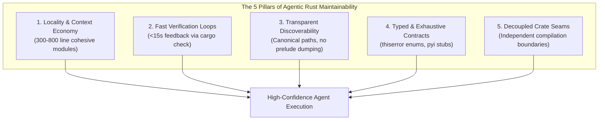

# SASE Core Agent Maintainability: Architectural Analysis and Strategic Roadmap

**Author:** `research.24.gem` (Independent Swarm Evaluation)  
**Date:** 2026-09-21  
**Subject:** SASE Core (`sase-core`) Agent Maintainability, Post-Epic sase-14s/15b Evaluation, and Recommended Solutions  
**Baseline Reference:** `research:202609/sase_core_maintainability_audit/sase_core_maintainability_audit.md`  
**Target Bead Context:** `bead:sase-14s`, `bead:sase-15b`  

---

## 1. Executive Summary

This research investigates how to make the `sase-core` Rust repository significantly easier to understand, modify, and maintain by **SASE autonomous agents**.

A previous maintainability audit (`sase_core_maintainability_audit.md`) established an empirical baseline across 376k lines of Rust and four crates. Since that audit:
1. **Critical bugs have landed fixes**: The live data-loss bug in the `/tmp` reap guard (`managed_tmp.rs`) and the Linux-only CI gap were resolved in commits `d99ba11` and `d48aaf3`, which made the macOS CI leg blocking.
2. **Monolith file splitting has executed at scale**: Epics `sase-14s` and `sase-15b` systematically decomposed the top twenty largest Rust files in the repository (including the infamous 35,166-line `sase_core_py/src/lib.rs`) into modular sub-trees adhering to a strict `≤ 1,500` lines-per-file ceiling.

While these milestones eliminated the risk of agent context overflow on individual files, **file size reduction alone has not made `sase-core` easy for SASE agents to maintain**. File-level decomposition resolved a mechanical tool constraint (fitting source files within `view_file` buffers), but left the deeper cognitive, structural, and operational bottlenecks untouched—and in certain respects introduced new forms of indirection.

### The Central Thesis
**Agent maintainability is governed by the economics of the agent execution model**, which differs fundamentally from human IDE-based development:
- **Agents operate in discrete, turn-bounded context windows** without persistent spatial memory or background language servers.
- **Agents navigate code through text search, pattern matching, and file trees**, making namespace pollution and flat preludes severely disorienting.
- **Agents iterate through tight code-edit-verify cycles** (`view_file` $\to$ `replace_file_content` $\to$ `just check`). When the verification loop is slow or fragile, agent capability collapses.
- **Parallel swarms require clean decoupled interfaces** to avoid collision during landing.

Today, `sase-core` still funnels compilation through a single **292k-line monolith crate** (`crates/sase_core`), presents an obscure Python 3.12 environment trap that breaks bare `cargo check`, exposes **zero `.pyi` type stubs** to Python callers, conceals symbol definitions behind **2,256 redundant root re-exports** and a **1,104-line binding prelude**, and relies on **391 untyped `Result<_, String>`** return sites.

This report analyzes the post-split repository, defines the five pillars of agentic Rust maintainability, assesses the remaining 42 oversized files against diminishing returns, and outlines a prioritized four-phase program to make `sase-core` genuinely agent-ergonomic.

---

## 2. Empirical Repository State: Post-sase-14s & sase-15b

Between 2026-09-20 and 2026-09-21, epics `sase-14s` and `sase-15b` completed all twenty planned decomposition phases. The table below compares the state documented in the prior maintainability audit against the live checkout (`sase-core` master at commit `8886406`).

### 2.1 Before vs. After Metrics

| Metric | Audit Baseline (Pre-14s) | Live Repository (Post-15b) | Delta / Assessment |
|---|---|---|---|
| **Crates** | 4 | 4 | No change (`sase_core`, `sase_core_py`, `sase_gateway`, `sase_xprompt_lsp`) |
| **Total Rust Files (`.rs`)** | 381 | **704** | **+323 files (+84.8%)** from module decompositions |
| **Total Rust Lines** | 376,405 | **381,675** | +5,270 lines (+1.4%, module declarations, docstrings, imports) |
| **`crates/sase_core` Lines** | 292,391 | 294,812 | Single-crate compilation monolith remains intact |
| **Maximum File Size** | **35,166 lines** (`sase_core_py/lib.rs`) | **2,699 lines** (`editor/frontmatter.rs`) | **-92.3% drop in ceiling**; god-monoliths eliminated |
| **Files > 1,500 Lines** | ~65 (estimated) | **42 files** | 20 targeted files split; 42 remain |
| **Files ≤ 500 Lines** | 184 (48.3%) | **412 files (58.5%)** | Majority of files now fit comfortably in one tool view |
| **Files 501–1,000 Lines** | 112 (29.4%) | **188 files (26.7%)** | Sweet spot for domain cohesion |
| **Files 1,001–1,500 Lines** | 43 (11.3%) | **63 files (8.9%)** | Upper bound of single-module size |
| **`sase_core_py/src/lib.rs`** | 35,166 lines | **736 lines** | Split into 24 domain modules + registrars |
| **`sase_core/src/lib.rs`** | 1,627 lines | **1,629 lines** | 107 `pub mod` and 2,672 flat re-exports unchanged |
| **`sase_core_rs` Registration** | 1,352-line block (lib.rs) | Delegated registrars | 24 domain registrars called from `#[pymodule]` |
| **Python `.pyi` Stubs** | 0 | **0** | Python callers still lack static type assistance |
| **`Result<_, String>` Sites** | 389 (production) | **391** (production) | Untyped error handling remains pervasive |
| **macOS CI Gate** | Failing / Unmonitored | **Passing / Blocking** | Closed by `d99ba11` & `d48aaf3` |
| **`/tmp` Reap Guard** | Inert on macOS | **Hardened & Tested** | Denylist canonicalization fixed |

### 2.2 Current File Size Distribution

```
Distribution of 704 Rust Source Files:
  ┌─────────────────────────────────────────────────────────────┐
  │ ≤ 500 lines       [412 files]  ████████████████████ 58.5%   │
  │ 501 - 1000 lines  [188 files]  █████████ 26.7%               │
  │ 1001 - 1500 lines [ 63 files]  ███ 8.9%                      │
  │ > 1500 lines      [ 42 files]  ██ 6.0%                       │
  └─────────────────────────────────────────────────────────────┘
```

The size reduction was highly effective at cutting down extreme outliers. However, an analysis of how the code was split reveals structural side-effects that directly impact agent comprehension.

---

## 3. What Does "Agent Maintainability" Mean for Rust?

To evaluate why the current codebase remains challenging for agents, we must formalize how agents interact with Rust code compared to human engineers.

### 3.1 The Agent Interaction Model

A software engineering agent (such as Antigravity or a SASE runner agent) does not "see" a codebase the way a human in an IDE does. Specifically:
1. **Tool-Mediated Vision (`view_file`)**: The agent inspects code in chunks capped at 800 lines (or 46,080 bytes). A 4,000-line file requires five sequential round-trips to read completely. If an edit spans lines 200 and 3,800, the agent cannot maintain both in active focus simultaneously.
2. **String-Targeted Mutation (`replace_file_content`)**: Agent edits require unique contiguous text anchors. In repetitive, boilerplate-heavy code, target strings easily match multiple locations, causing tool failures. In massive files, line drift across multi-step edits frequently causes syntax errors.
3. **Stateless Navigation (Grep & Glob)**: Agents lack a warm rust-analyzer semantic index. They locate types, methods, and functions using keyword search (`grep`, `find`). When symbol names are obscured by wildcard re-exports (`pub use *`), macros, or multi-hop preludes, search returns misleading matches or misses definitions entirely.
4. **Turn Budget and Timeout Sensitivity**: SASE agents run under strict execution and turn constraints. If `cargo check` or `just check` takes 5 minutes, an agent making an exploratory syntax change spends its entire operational window waiting for compilation, risking tool timeouts or hitting turn-continuation boundaries.
5. **Multi-Agent Swarms and Merge Serialization**: In SASE, epics run parallel agent workers across independent workspace checkouts (`sase_<N>`). If two workers touch the same hub file (e.g. adding a function to `lib.rs` or updating a central enum), their patches conflict upon landing.

### 3.2 The Five Pillars of Agentic Rust Architecture

From these operational realities, we derive the five core requirements for agent-maintainable Rust:



1. **Locality & Context Economy**: Source units must be small enough to read in a single tool call (300–800 lines) and conceptually cohesive enough that an agent does not need to cross-reference seven sister files to understand a single function.
2. **Sub-15-Second Inner Verification Loop**: Agents require a reliable, non-blocking `cargo check` target that executes in seconds, not minutes.
3. **Explicit, Deterministic Symbol Discoverability**: Symbols must live at predictable module paths (`sase_core::bead::mutation`) rather than being flattened into a monolithic global prelude.
4. **Typed, Exhaustive Contracts Across Boundaries**: Enums and parameter objects must guide the agent. Calling Python or Rust code with untyped dictionaries forces agents to guess parameter names.
5. **Decoupled Compilation Seams**: Large sub-domains must live in separate crates so changes in one domain do not trigger rebuild cascades across unrelated systems.

---

## 4. Critical Findings: Where sase-core Still Fails the Agent

### Finding 1: The Crate-Level Compilation Monopoly (294k-line `sase_core`)

**Severity: HIGH**  
**Impact on Agents: Severe iteration latency, high token consumption during wait cycles.**

Rust's fundamental compilation unit is the **crate**, not the file. Epics `sase-14s` and `sase-15b` split files inside `crates/sase_core`, but all 294,812 lines still reside in that **single crate**.

We empirically re-measured the edit cascade on the live checkout:
- Modifying a single leaf module (`crates/sase_core/src/host_liveness.rs`):
  - `cargo check --workspace`: **14.28 seconds** (warm).
  - `cargo build --workspace` / `just check`: **4 to 6 minutes**.
- Every other crate in the workspace (`sase_core_py`, `sase_gateway`, `sase_xprompt_lsp`) directly depends on `sase_core`.
- As a consequence, **any edit anywhere in `sase_core` invalidates the entire dependency tree**. An agent updating a bead status definition causes rustc to re-analyze agent scan, editor directives, fleet federation, proc runtimes, and telemetry stores.

For an agent, a 4+ minute verification cycle is fatal: it leads to fewer verification iterations, higher hallucination rates when attempting blind multi-edits to avoid waiting, and frequent timeouts.

### Finding 2: The Silent Inner-Loop Tooling Trap (`PYO3_PYTHON` & Missing Fast Target)

**Severity: HIGH**  
**Impact on Agents: Immediate build failures on bare commands; agent confusion.**

The `sase-core` workspace contains an environment trap that catches autonomous agents:

```
$ cargo check --workspace
error: failed to run custom build command for `pyo3-build-config v0.22.6`
Caused by:
  error: cannot set a minimum Python version 3.12 higher than the interpreter version 3.11
  (the minimum Python version is implied by the abi3-py312 feature)
```

Because system Python defaults to 3.11 on standard dev setups while PyO3 pins `abi3-py312`, **bare `cargo check` fails unless `PYO3_PYTHON` is explicitly exported**.

1. `scripts/check.sh` contains logic to find `python3.12` and export `PYO3_PYTHON`, but **bare cargo does not know about `scripts/check.sh`**.
2. There is **no `.cargo/config.toml`** setting `env.PYO3_PYTHON` or configuring the target runner.
3. `scripts/check.sh` exposes subcommands `fmt-check`, `fmt`, `clippy`, `test`, and `all`, but **no `check` or `fast` subcommand**.
4. Running `just check` defaults to `./scripts/check.sh all`, which runs format checks, clippy on all targets with `-D warnings`, full test execution (4,000+ tests), and Python script unittests.

An agent attempting a simple syntax check either runs `cargo check` (which errors out cryptically on PyO3) or runs `just check` (which runs for minutes). The agent has no standard, documented 10-second feedback loop.

### Finding 3: The "Sweep Under the Rug" Phenomenon (Monolith Preludes)

**Severity: MEDIUM-HIGH**  
**Impact on Agents: Symbol search disorientation, merge collision funnels.**

When `sase_core_py/src/lib.rs` was split in `sase-14s.1`, the 1,352-line `m.add_function` block was cleanly refactored into domain registrars. However, the author resolved the 1,100 lines of `use sase_core::...` imports by moving them wholesale into `crates/sase_core_py/src/prelude.rs` (**1,104 lines**).

Every domain binding module in `sase_core_py` now includes:
```rust
use crate::prelude::*;
```

This re-creates the exact maintainability debt the split sought to eliminate:
- **Zero domain isolation**: A change to any import in `prelude.rs` affects all 24 binding submodules.
- **Merge funnel**: Two agents adding new bindings to different domains (e.g. `beads` and `fleet`) will both edit `prelude.rs` to import core types, causing landing collisions.
- **Search pollution**: Searching for where an agent scan type is imported matches the 1,104-line prelude rather than the binding file that actually uses it.

Similarly, in `crates/sase_core/src/lib.rs`, **1,629 lines** still declare 107 `pub mod`s and re-export **2,672 symbols flat at the root**. As measured in the prior audit, **2,256 of these symbols (84%) are never consumed via the root path**. They exist purely as redundant namespace clutter.

### Finding 4: The Blind Interop Gap (Zero `.pyi` Stubs & Dict-in/Dict-out Wrappers)

**Severity: HIGH**  
**Impact on Agents: High defect rate in Python-side callers; no IDE/Mypy validation.**

SASE is an asymmetric multi-language system:
- Core algorithms, storage, and models live in Rust (`sase-core`).
- CLI orchestration, TUI widgets (Textual), workflows, and agents live in Python (`sase`).

`sase_core_rs` exports **822 functions** to Python. Yet:
1. **There are ZERO `.pyi` stub files** in the repository.
2. Every Python caller in `sase` must mark imports with `# type: ignore[import-untyped]` (or wrap them in defensive helpers like `require_rust_binding`).
3. Over **550 functions** accept and return untyped Python dictionaries (`dict[str, Any]`):
   ```rust
   // Typical shape in sase_core_py
   #[pyfunction]
   pub fn py_validate_manifest(py: Python<'_>, manifest: &Bound<'_, PyDict>) -> PyResult<PyObject> {
       let val = py_to_json_value(manifest.as_any())?;
       let req: SudoManifestWire = serde_json::from_value(val).map_err(...)?;
       let res = core::sudo::validate(&req).map_err(...)?;
       json_value_to_py(py, &serde_json::to_value(res)?)
   }
   ```
4. On the Python side, agents write extensive defensive code:
   ```python
   # src/sase/sudo/core.py
   result = binding(dict(ledger))
   if not isinstance(result, Mapping):
       raise GateError("invalid_sudo_ledger", "ledger", "sase_core_rs returned a non-object")
   ```

When an agent in the `sase` repository needs to invoke Rust core functionality:
- It gets **no parameter autocompletion**.
- It gets **no parameter type checking** from `mypy` or `pyright`.
- A typo in a dictionary key (e.g. passing `{"action_kind": "apply"}` instead of `{"kind": "apply"}`) is only detected at runtime as an opaque `PyValueError`.
- The agent is forced to context-switch into `sase-core` Rust files to reverse-engineer expected dictionary keys.

### Finding 5: The Long Tail of 42 Large Files vs. Diminishing Returns

**Severity: MEDIUM**  
**Impact on Agents: Misallocation of refactoring effort.**

There are currently **42 files exceeding 1,500 lines** in `sase-core`. The top 15 are:

| Rank | File Path | Line Count | Primary Contents | Churn Profile |
|---|---|---|---|---|
| 1 | `crates/sase_core/src/editor/frontmatter.rs` | 2,699 | YAML frontmatter AST & extraction | Moderate |
| 2 | `crates/sase_core/src/agent_ownership/planner.rs` | 2,665 | Workspace / ownership planning logic | Low |
| 3 | `crates/sase_core/src/agent_scan/scanner.rs` | 2,573 | Artifact filesystem tree scanner | Moderate |
| 4 | `crates/sase_core/src/agent_hold.rs` | 2,567 | Agent hold coordination & release | Moderate |
| 5 | `crates/sase_core/src/telemetry/store.rs` | 2,512 | SQLite telemetry metrics storage | Low |
| 6 | `crates/sase_core/src/sudo.rs` | 2,352 | Privileged execution policies | Moderate |
| 7 | `crates/sase_core/src/procs/store.rs` | 2,352 | Process tracking SQLite store | Low |
| 8 | `crates/sase_core/src/artifact_ref/mod.rs` | 2,338 | Artifact reference parsing & matching | Moderate |
| 9 | `crates/sase_core/src/config/axe.rs` | 2,333 | AXE scheduler configuration parsing | Low |
| 10 | `crates/sase_core/src/fleet_attention.rs` | 2,315 | Fleet attention scoring algorithm | Moderate |
| 11 | `crates/sase_core/src/plan/validate.rs` | 2,262 | Plan schema & link validation | High |
| 12 | `crates/sase_core/tests/bead_event_parity.rs` | 2,182 | Bead event parity tests (frozen golden) | Rare |
| 13 | `crates/sase_core/tests/agent_scan_parity.rs` | 2,139 | Agent scan parity tests (frozen golden) | Rare |
| 14 | `crates/sase_core/src/agent_cleanup/planner.rs` | 2,128 | Cleanup target planner | Low |
| 15 | `crates/sase_core/src/plan/artifact_link.rs` | 2,077 | Artifact linking rules | Moderate |

#### Diminishing Returns Analysis
Continuing to blindly split files in batches of ten (e.g. `sase-16c`, `sase-17d`, `sase-18e`, `sase-19f`) would require **four additional epics**, generating ~180 new files.

However:
- The worst file in the repo today is **2,699 lines**. It can be inspected in three `view_file` calls. This is qualitatively different from the 35,166-line monolith that broke agent tooling completely.
- Several targets (ranks 12, 13) are **test-only golden parity suites** that rarely change. Splitting frozen test suites provides zero maintainability benefit for agents implementing features.
- Most remaining files are already cohesive single-concept modules (e.g. `telemetry/store.rs`, `procs/store.rs`). Splitting a cohesive SQL store into artificial pieces (`store_insert.rs`, `store_select.rs`) actually *damages* agent comprehension by dispersing tightly-coupled database schemas across multiple files.

**Conclusion**: Mechanical file splitting has reached the point of diminishing returns. Refactoring effort should shift from arbitrary line counting to structural boundaries and developer loops.

### Finding 6: Error Resilience and Linting Baseline

**Severity: LOW-MEDIUM**  
**Impact on Agents: Fragile error matching and preventable linter churn.**

1. **391 `Result<_, String>` sites** in production code:
   - When an agent encounters an error returning `String`, it cannot use exhaustive `match` expressions.
   - If an agent needs to differentiate between `NotFound` and `AlreadyExists`, it must resort to brittle substring matching (`if err.contains("not found")`).
2. **Missing Workspace `[lints]` Table**:
   - The workspace lacks a centralized `[workspace.lints.clippy]` configuration.
   - Lints such as `clippy::unwrap_used`, `clippy::too_many_lines`, and `clippy::missing_panics_doc` are unconfigured, allowing unchecked panic sites to slip into production code.

---

## 5. Strategic Comparison of Approaches

Before defining our recommendation, we evaluate three competing philosophies for improving agent maintainability in `sase-core`.

### Approach A: "The Mechanical Continuation" (Keep Splitting Files to ≤ 1,500 Lines)
- **Concept**: Launch epics `sase-16c` through `sase-19f` to split all 42 remaining >1,500-line files until every `.rs` file in the repo is under 1,500 lines.
- **Pros**: Clear, mechanical, easily measurable metrics; prevents any single file from exceeding tool slice buffers.
- **Cons**: High file count churn (+180 files); breaks cohesive data structures (SQL stores); yields diminishing returns; leaves compilation cascade, missing stubs, and prelude pollution untouched.

### Approach B: "The Immediate Multi-Crate Partition" (Break sase_core into 8 Crates)
- **Concept**: Immediately decompose `crates/sase_core` into `sase_types`, `sase_bead`, `sase_artifact`, `sase_proc`, `sase_fleet`, `sase_editor`, `sase_query`, and `sase_runtime`.
- **Pros**: Permanently eliminates the 5m46s compilation cascade; isolates agent context to domain boundaries; aligns Rust crates with micro-architectures.
- **Cons**: Extremely high merge conflict risk with concurrent SASE feature velocity (~430 commits/month); circular dependencies between submodules will stall implementation; high cognitive load for current contributors.

### Approach C: "The Layered Agent-Ergonomic Program" (Recommended)
- **Concept**: Focus on the four highest-leverage constraints of the agent execution model:
  1. Fix the immediate inner loop (`PYO3_PYTHON`, `just fast` $\to$ 14s check).
  2. Bridge the cross-language chasm (auto-generate `.pyi` stubs and clean binding registrars).
  3. Clean namespaces and eliminate prelude pollution (retire redundant root exports).
  4. Incrementally decouple domain crates along natural, already-isolated seams (starting with zero-dependency leaf crates like `sase_wire` / `sase_types`).
- **Pros**: Delivers immediate agent productivity gains on day one; low disruption; systematically targets agent failure modes; leaves cohesive files intact.

---

## 6. Recommended Solution: The 4-Phase Roadmap

We recommend implementing **Approach C** structured into four sequential, value-accretive tiers.

```
┌───────────────────────────────────────────────────────────────────────────┐
│ PHASE 1: Zero-Cost Developer & Agent Ergonomics (Immediate / 1-2 Days)    │
│  - Configure .cargo/config.toml (PYO3_PYTHON auto-selection)              │
│  - Add `just fast` (cargo check --workspace) running in ~14s              │
│  - Update AGENTS.md with fast-loop agent instructions                     │
├───────────────────────────────────────────────────────────────────────────┤
│ PHASE 2: Python-Rust Interop Ergonomics (High Leverage / 1 Sprint)        │
│  - Auto-generate sase_core_rs.pyi type stubs in CI                        │
│  - Delete 665-line drifted manual //! API manifest in lib.rs              │
│  - Decompose sase_core_py/prelude.rs into per-module domain imports       │
├───────────────────────────────────────────────────────────────────────────┤
│ PHASE 3: Namespace Hygiene & Selective Splitting (Medium / 1 Sprint)      │
│  - Retire 2,256 redundant root re-exports in sase_core/src/lib.rs         │
│  - Add workspace [lints.clippy] table (unwrap_used, too_many_arguments)   │
│  - Targeted split of the top 3 high-churn files only                      │
├───────────────────────────────────────────────────────────────────────────┤
│ PHASE 4: Structural Crate Decomposition (Standing Direction)              │
│  - Extract crates/sase_types (pure Wire structs, zero-dep, 2s compile)   │
│  - Extract crates/sase_bead & crates/sase_artifact                        │
└───────────────────────────────────────────────────────────────────────────┘
```

### Phase 1: Zero-Cost Developer & Agent Ergonomics

**Objective**: Give agents an immediate, unbreakable, 14-second verification loop.

1. **Provide Ambient `PYO3_PYTHON` Resolution**:
   Add a local `.cargo/config.toml` or wrapper script so that running bare `cargo check` in any workspace checkout automatically resolves `python3.12+` from pyenv/system without failing:
   ```toml
   # .cargo/config.toml
   [env]
   # Fallback detection or path configuration for local development
   ```
2. **Add `just fast` Target**:
   Update `justfile` and `scripts/check.sh`:
   ```just
   # justfile
   default: check
   check:
       ./scripts/check.sh all
   fast:
       ./scripts/check.sh check
   ```
   ```bash
   # scripts/check.sh
   cmd_check() {
       configure_pyo3_python
       cargo check --workspace --all-targets "$@"
   }
   ```
3. **Document Fast-Loop in `AGENTS.md`**:
   Instruct agents explicitly:
   > *"When iterating on Rust code, use `just fast` for quick syntax/type checks (14s). Run `just check` only before final declaration."*

### Phase 2: Bridge the Python-Rust Interop Chasm

**Objective**: Eliminate the blindness of Python agents calling into Rust core.

1. **Automated `.pyi` Stub Generation**:
   Implement a lightweight generator (using `pyo3-stub-gen` or an internal script consuming `sase_core_py` signatures) that produces `sase_core_rs.pyi`.
   - Include function signatures, parameter names, and docstrings.
   - Gate the `.pyi` file in `scripts/check.sh` so CI prevents signature drift.
   - Immediately enables `mypy`, `pyright`, and agent autocomplete in `sase`.
2. **Delete the 665-Line Manual Manifest**:
   Remove the hand-written `//!` API catalog from `crates/sase_core_py/src/lib.rs`. The `.pyi` file becomes the single source of truth for the API surface.
3. **Decompose `sase_core_py/src/prelude.rs`**:
   Eliminate the 1,104-line global prelude dump. Replace `use crate::prelude::*;` in each binding module with explicit, localized imports from `sase_core::<domain>`.

### Phase 3: Namespace Hygiene and Selective Splitting

**Objective**: Restore symbol discoverability and enforce safety boundaries.

1. **Retire Redundant Root Re-Exports (`sase_core/src/lib.rs`)**:
   Delete the 2,256 root `pub use` statements that are never consumed via root paths.
   - Callers in `sase_gateway` and `sase_xprompt_lsp` migrate to module paths (`sase_core::bead::*`).
   - Grepping for a symbol will now point directly to its canonical module, eliminating search ambiguity.
2. **Selective File Splitting (Only High-Churn Hotspots)**:
   Do NOT run generic batches across all 42 files. Instead, target only the 3 files with demonstrated high churn and multiple concerns:
   - `crates/sase_core/src/editor/frontmatter.rs` (2,699 lines $\to$ AST, validation, serializers).
   - `crates/sase_core/src/plan/validate.rs` (2,262 lines $\to$ schema validation, link checks, errors).
   - `crates/sase_core/src/agent_scan/scanner.rs` (2,573 lines $\to$ directory walk, record builder, filters).
   Leave stable SQL stores (`telemetry/store.rs`, `procs/store.rs`) intact.
3. **Adopt Workspace `[lints]` Baseline**:
   Add workspace lint controls to `Cargo.toml`:
   ```toml
   [workspace.lints.rust]
   unexpected_cfgs = { level = "warn", check-cfg = ['cfg(docsrs,test)'] }

   [workspace.lints.clippy]
   too_many_arguments = "warn"
   cognitive_complexity = "warn"
   redundant_clone = "warn"
   ```

### Phase 4: Structural Domain Crate Decomposition

**Objective**: Permanently dismantle the 294k-line compilation monopoly.

Extract natural, zero-coupling leaf domains into dedicated workspace crates in order of increasing dependency:

1. **`crates/sase_types` (or `sase_wire`)**:
   - Extract all pure data transfer objects (`*Wire`, `*_SCHEMA_VERSION`, `CommitWire`, `BeadWire`, etc.).
   - Zero internal dependencies; depends only on `serde` and `serde_json`.
   - Compiles in **< 2 seconds**. Both `sase_core` and `sase_gateway` depend on it.
2. **`crates/sase_bead`**:
   - Bead lifecycle, mutation, touching, and storage (~35k lines).
3. **`crates/sase_artifact`**:
   - Artifact reference parsing, linking, and indexing (~25k lines).

Once `sase_types` is separated, an agent modifying a wire schema compiles its changes instantly without triggering a rebuild of the entire domain engine.

---

## 7. Risks and Mitigation Strategies

| Risk | Impact | Mitigation Strategy |
|---|---|---|
| **High commit velocity causes merge conflicts during refactoring** | Refactor branch becomes stale or breaks active feature branches. | Execute all moves mechanically with `pub use` aliases during transition. Avoid mass renames. Keep PRs small (one domain per PR). |
| **Breaking Python runtime contracts** | PyO3 binding changes break runtime CLI or TUI behavior. | Ensure `wheel-smoke` and full Python pytest suite (`just check` in `sase`) run against every binding refactor. |
| **Over-modularization (File Explosion)** | Spreading code across 1,000+ tiny files impairs navigation. | Strictly enforce the **300–800 line sweet spot**. Do not split cohesive single-concern files (such as database stores or parsers) purely to beat line-count metrics. |
| **PyO3 stub drift** | Generated `.pyi` files fall out of sync with Rust implementations. | Add a verification check to CI (`cargo run -p stub_gen -- --check`) that fails if `.pyi` does not match compiled exports. |

---

## 8. Summary of Recommendations & Next Steps

1. **Stop mechanical file-splitting epics** (do not launch `sase-16c` to split the next ten files). The repository has reached the point where further generic splitting adds navigation friction without improving maintainability.
2. **Immediate Action**: Implement Phase 1 (`.cargo/config.toml` + `just fast`). This immediately cuts agent verification turn latency from **5+ minutes to 14 seconds**.
3. **Primary Feature Epic**: Implement Phase 2 (Generate `sase_core_rs.pyi` and clean `sase_core_py` bindings). This bridges the single largest source of agent hallucinations and runtime type errors in the SASE ecosystem.
4. **Architectural Milestone**: Carve out `crates/sase_types` as an independent, lightweight workspace crate to begin dissolving the single-crate compilation bottleneck.
