# Decomposing SASE Goals: A Verifiable, Multi-Epic Architecture and Roadmap

**Researcher:** `research.2s.gem`  
**Date:** 2026-09-27  
**Context:** Synthesis and critique of `sase_goals_design.md` for executable epic decomposition  
**Scope:** Architecture breakdown, verification isolation, risk mitigation, and implementation sequence  

---

## 0. Executive Summary & Verdict

### The Question
Should SASE Goals be implemented as a **single large epic**, or should it be split into **multiple, distinct, and verifiable epics**?

### The Verdict: Strongly Split into Multiple Epics
**Do NOT attempt a single monolithic epic.** A single epic for SASE Goals would be a critical planning failure. 

Implementing Goals touches six distinct, complex layers of SASE:
1. Low-level storage and distributed concurrency in `sase-core` (Rust crate, git-based append-only events, `live/` markers, projections).
2. Host launch resolution and metadata propagation (`sase turn`/`axe`, prompt preprocessing, directive completion, `/sase_goal` skill).
3. The turn completion contract and evidence protocol (`builtin@goal` finalizer, host candidate gathering, symbolic token resolution for `@commit`/`@reply`, receipt embedding).
4. Attention routing and interaction gates (`GoalVerify` gate, `JumpToGoal` notifications, Verify/Reject/Drop branches, acknowledgement flows).
5. Textual TUI visualization and navigation (top-level Goals tab, Review/Running/Idle lanes, 30s review card, Agents-tab chips and FINAL Goal card, numbered rail jumps).
6. Notification cutover and feature flag retirement (silencing `JumpToAgent(done)` successes, idle nudges, telemetry, and flag cleanup).

Bundling all six layers into one epic would guarantee the same failure modes documented in SASE’s most painful stalled epics: **`sase-zm`** (14 phases, 0 closed, stalled indefinitely and had to be superseded) and **`sase-11e`** (recursive child-epic cascades: `.8` → `.8.6` → `.8.6.5` → `.8.6.5.4` caused by an unpassable acceptance matrix and cross-repo dependency floor deadlocks).

### The Recommended Solution: A 5-Epic Sequence + Preparatory Task Beads
The Goals feature must be partitioned into **five distinct, sequential, and independently verifiable epics**, preceded by four small, zero-risk preparatory task beads:

| Sequence | Epic / Unit | Core Domain | Primary Deliverables | Verification Surface | Blast Radius if Broken |
| :--- | :--- | :--- | :--- | :--- | :--- |
| **Prep** | Standalone Tasks | Metadata & Navigation Fixes | Parent lineage persistence, reveal-path `JumpToAgent` fix, `%goal` directive, `goals` beta flag | Unit tests & existing CLI | Zero (isolated fixes) |
| **Epic 1** | **E1: Goal Storage Substrate & Fast CLI** | `sase-core` (Rust) & CLI | Event ledger, reducer, `live/` markers, conflict-free rebase, local projection, fast CLI (`sase goal list/show/doctor`) | Rust unit tests, concurrent rebase test, CLI latency benchmarks (<30ms p50) | Zero (storage dormant, CLI only) |
| **Epic 2** | **E2: Launch Binding & Agent Intake** | Host Launch Pipeline & Skills | Binding ladder (plan, clan, session, parent, routine, draft), `goal_id` in metadata, prompt intake block, `/sase_goal` skill | Launch matrix across all 8 shapes, swarm draft sharing test, draft CAS naming | Low (intake only, fallback to excerpt) |
| **Epic 3** | **E3: Finalizer, Evidence & `GoalVerify` Gate** | Turn Lifecycle & Gates | Required `builtin@goal` finalizer, candidate evidence gathering, token resolution, `GoalVerify` gate, dual-run notifications | Finalizer mock tests, token validation, CLI verify/reject, dual notification verification | Medium (runs in dual mode with legacy pings) |
| **Epic 4** | **E4: Goals TUI Surface & Navigation Mesh** | Textual TUI & Widgets | Top-level Goals tab, Review/Running/Idle lanes, 30s review card, Agent chip, FINAL deck Goal card, *by goal* grouping, numbered jumps | TUI screenshots, golden tests, paint budget benchmarks (<16ms), layout tests | Zero to agents (UI rendering only) |
| **Epic 5** | **E5: Attention Cutover & Flag Deprecation** | Notification Routing & Rollout | Silencing success pings, answer acknowledgement flow, idle nudges, multi-day soak on athena/apollo, flag removal | End-to-end user verification, soak metrics, flag deletion test checklist | Controlled (final cutover after proven soak) |

---

## 1. Why a Single Epic is a Failure Trap

To understand why a single epic is inappropriate, we must examine the specific mechanics of how large epics stall and fail within SASE's agentic engineering model.

### 1.1 Lessons from SASE's Stalled and Cascading Epics
An inspection of SASE's historical bead records and research reports reveals a stark pattern:
1. **The `sase-zm` Disaster (14 phases, 0 closed):**
   `sase-zm` attempted to solve runner capacity, command monitoring, admission control, and execution profiles in a single massive epic. Because it bundled storage models with runtime admission and scheduling policies, phase workers could never establish a stable baseline. The epic remained stuck in `IN_PROGRESS` for weeks with zero closed phases until it was superseded and broken up into the 8-epic `sase_tool` roadmap (`sase_tool_epic_roadmap.md`).
2. **The `sase-11e` Recursive Child-Epic Cascade (Depth 4+):**
   `sase-11e` (the routine/job terminology rename and tribe identity epic) spawned child epics `sase-11e.8` → `sase-11e.8.6` → `sase-11e.8.6.5` → `sase-11e.8.6.5.4`. Why?
   - **Cross-repo dependency floor lock:** Acceptance phases stalled waiting for `sase-core-rs` wheels on PyPI and core pin bumps in `sase-core-revision.txt`.
   - **Open-ended acceptance criteria:** Plans included open-ended clauses like "audit every reachable message," which implementers partially addressed and land agents repeatedly rejected during land audits (`bd/land_epic`).
   - **Lander `%auto` loops:** Land agents ran with `%auto`, immediately proposing and approving child epics without human intervention.
3. **The `sase-19i` Node Finder Iteration Loop (Depth 7):**
   `sase-19i` cascaded through 7 rounds of child epics (`sase-19i.7.3.3.3.3.3`) because performance budgets (<50ms open budget) were tangled with live TUI widget rendering and broad-query filtering.

### 1.2 The Five Failure Vectors of a Monolithic Goals Epic
If Goals is launched as a single epic, it will trigger all three historical failure modes simultaneously:

1. **The Cross-Repo Pin and Wheel Deadlock:**
   The Goal domain, event types, reducer, eligibility logic, and fast CLI belong in `sase-core` (`sase_core::goal`). In SASE, `sase` consumes `sase_core_rs` via a pinned commit in `sase-core-revision.txt` and published wheels. A single epic in `sase` cannot cleanly implement Rust backend logic, run CI, land changes in `sase-core`, wait for packaging/pinning, and implement the Python UI in one unbroken agent sequence. The land agent's `just check-full` gate will fail on dependency mismatches, spawning recursive child epics.
2. **The Blast Radius on Live Agent Turns:**
   SASE executes hundreds of agent turns daily across dozens of parallel workspaces. In the design of record (`sase_goals_design.md` §4.5), `builtin@goal` is configured as a **required** finalizer ordered after commit:
   ```yaml
   finalizers:
     defaults: [commit, goal]
     required: [goal]
   ```
   If storage I/O, draft naming, token resolution (`@commit`, `@reply`), or receipt snapshotting has a single uncaught exception or locking bug, **every agent turn across every workspace in the repository crashes at finalization.** Bundling this risk into the same epic that is debugging Textual layout widgets or tab keymaps is reckless.
3. **The Impossible Acceptance Matrix:**
   The design of record specifies 12 complex acceptance tests (§5). In a single epic, the land agent must audit all 12 at once:
   - Git rebase conflict-freedom across concurrent clones.
   - Launch binding across direct, swarm, plan, bead, session, retry, pipe, questions, and monitors.
   - Finalizer token resolution and receipt embedding.
   - `GoalVerify` gate lifecycle (verify, reject+relaunch, drop, ack).
   - TUI layout, lane rendering, card formatting, and numbered rail jumps.
   - Silencing of success notifications without silencing errors or approvals.
   If an edge case fails in any one layer (e.g. a minor wrapping issue on narrow terminals in the Review card, or an unhandled race in swarm draft naming), the land agent *cannot legally close the epic* under `bd/land_epic` rules. It will spawn `goals.8`, and the cascade begins.
4. **Confounding Verification Feedback:**
   When a verification test fails in a monolithic epic, isolating the root cause is difficult. Did the claim fail to appear because the Rust reducer miscalculated status? Because the Python binding dropped `goal_id` on child spawn? Because the finalizer crashed during token resolution? Because the gate notification wasn't dispatched? Or because the TUI failed to refresh its projection off-thread?
5. **Implementer Context Collapse:**
   An epic with 12–15 phases exhausts agent context. Later phase workers lose track of decisions made in Phase 1, reinventing or bypassing abstractions and leaving dead code.

---

## 2. Decomposition Principles for SASE Epics

To guarantee that the multi-epic roadmap succeeds, we apply five architectural decomposition principles tailored to SASE's execution environment:

1. **Vertical Coherence with Horizontal Independence:**
   Each epic must implement a complete, coherent layer that provides immediate, self-contained utility and can be exercised through a dedicated interface (CLI, wire tests, mock agents, or visual snapshots).
2. **Independent, Automated Verification Boundaries:**
   Every epic must define its own unambiguous, fully automated definition of done. The land agent for Epic $N$ must never need to test features slated for Epic $N+1$.
3. **The Dual-Run & Shadowing Principle:**
   New mechanisms must run in parallel with legacy mechanisms before cutover. For example, in Epic 3, `GoalVerify` gates are introduced, but standard `JumpToAgent(done)` notifications remain active. Only in Epic 5 are success pings silenced, ensuring zero disruption to daily developer awareness during development.
4. **Feature Flag Containment:**
   All user-reaching behavior is protected by a temporary `beta` feature flag (`goals`, default off) registered via `sase flag new goals`. This allows intermediate phases and epics to merge into `master` without polluting production workflows or risking regressions.
5. **Bounded Epic Sizing (4–6 Phases Max):**
   In accordance with `sase_sizes.md`, each epic must be sized at `large` (requiring an epic plan) containing 4 to 6 `medium` phases. This avoids the cognitive bloat of 10+ phase epics and keeps landing audits tight and passable.

---

## 3. The Multi-Epic Architecture: Detailed Breakdown

```mermaid
flowchart TD
    subgraph Prep ["Preparatory Standalone Tasks"]
        P1["Persist parent lineage in child metadata"]
        P2["Fix JumpToAgent reveal path"]
        P3["Add %goal directive & tab completion"]
        P4["Register goals beta feature flag"]
    end

    subgraph E1 ["Epic 1: Goal Storage Substrate & Fast CLI"]
        E1_1["Rust sase-core::goal domain & wire types"]
        E1_2["Event ledger, reducer & live/ markers"]
        E1_3["Conflict-free rebase & local projection"]
        E1_4["Fast CLI: sase goal list, show, doctor"]
    end

    subgraph E2 ["Epic 2: Launch Binding & Agent Intake"]
        E2_1["Host launch resolution ladder (8 sources)"]
        E2_2["Metadata goal_id propagation & lineage"]
        E2_3["Prompt intake block injection for drafts"]
        E2_4["sase goal name/adopt CLI & /sase_goal skill"]
        E2_5["Plan propose hook integration"]
    end

    subgraph E3 ["Epic 3: Finalizer, Evidence & GoalVerify Gate"]
        E3_1["builtin@goal finalizer obligation & schema"]
        E3_2["Host candidate evidence gathering & token resolution"]
        E3_3["Eligibility engine & receipt embedding"]
        E3_4["GoalVerify gate creation & JumpToGoal router"]
        E3_5["CLI verification commands & dual-run notifications"]
    end

    subgraph E4 ["Epic 4: Goals TUI Surface & Navigation Mesh"]
        E4_1["Top-level Goals tab & Review/Running/Idle lanes"]
        E4_2["30-second Review card & card renderer"]
        E4_3["Agents tab chips, FINAL Goal card & by-goal grouping"]
        E4_4["Numbered rail jumps (1-9) & reveal-path integration"]
        E4_5["Top-bar inbox badge (inbox: ⌖N) & keymaps"]
    end

    subgraph E5 ["Epic 5: Attention Cutover & Flag Deprecation"]
        E5_1["Silence JumpToAgent(done) under goals flag"]
        E5_2["Answer-only claim auto-acknowledgement flow"]
        E5_3["Idle aging nudges & hygiene tooling"]
        E5_4["Multi-day production soak on athena/apollo"]
        E5_5["Retire goals flag: delete Off branches & land unconditional"]
    end

    Prep --> E1
    E1 --> E2
    E2 --> E3
    E3 --> E4
    E4 --> E5
```



---

### 3.0 Preparatory Work: Zero-Risk Standalone Tasks

Before launching the first epic, four prerequisite items identified during research must be completed as standalone task beads. None of these require an epic, and all can land directly on master:

- **Task P.1: Persist parent lineage in child metadata.**  
  *Context:* `parent_agent_name` is currently read in several places (`launch_request_planning.py`, `agents_sync/inventory_sources.py`), but no production code writes it into child `agent_meta.json`.  
  *Task:* Write `parent_agent_name` and a new `parent_goal_id` during child workspace setup.  
  *Verification:* Unit test confirming child launch metadata contains parent fields.
- **Task P.2: Fix `handle_jump_to_agent` reveal path.**  
  *Context:* `handle_jump_to_agent` in `actions/agents/_notification_handlers.py` linearly scans `app._agents`, sets index, but fails to expand collapsed groups or clear active filters.  
  *Task:* Route agent jump navigation through `reveal_agent_navigation_target`.  
  *Verification:* TUI test proving jumping to an agent inside a collapsed group expands the group and sets focus.
- **Task P.3: Register `%goal` directive.**  
  *Context:* `%goal:<id>` and `%goal:new` need recognition in prompt preprocessing.  
  *Task:* Add `goal` to `_KNOWN_DIRECTIVES` in `src/sase/xprompt/_directive_types.py` and register tab-completion over active goals.  
  *Verification:* Parser unit test confirming `%goal:xyz` is parsed and stripped from unit prompts without errors.
- **Task P.4: Scaffold `goals` feature flag.**  
  *Context:* Create the temporary beta flag that will isolate all subsequent epic work.  
  *Task:* Run `sase flag new goals -k beta --when-enabled "Enables the Goals workflow, Goals tab, GoalVerify gates, and silences turn completion pings" --when-disabled "Uses standard agent turn completion notifications and hides Goals surfaces" --remove-when "Goals has soaked for 7 days on athena and apollo with stable latency and zero missed notifications"`.  
  *Verification:* Flag bead created; lint passes (`tools/check_feature_flags`).

---

### 3.1 Epic 1: Goal Storage Substrate, Ledger & Core CLI (E1)

*Goal:* Establish the durable, conflict-free storage layer and fast command-line interface in `sase-core` and Python.

#### Architectural Scope
- Implement `sase_core::goal` module:
  - Wire and domain structs: `Goal`, `GoalStatus` (`draft`, `active`, `review`, `done`, `dropped`), `GoalOrigin`, `GoalEvent`.
  - The Event Reducer: State is derived purely by reducing immutable events (`created`, `named`, `edited`, `adopted`, `agent_attached`, `progress`, `plan_attached`, `claimed`, `claim_retracted`, `settled`, `reopened`, `merged`).
  - Storage directory layout under `goals/` sidecar role (co-hosted in the `beads` repo):
    ```text
    goals/
      STORE.json                         # schema fence
      live/<id>                          # empty marker for each UNSETTLED goal
      items/<id>/events/<ulid>.json      # immutable events
    ```
  - Rebase engine: Marker add/delete and immutable event appends guarantee that concurrent commits from different machines never produce git content conflicts.
  - Local projection: `~/.sase/projects/<key>/goals-hot.json` keyed by directory signatures.
  - Rust fast-path CLI commands:
    - `sase goal list` (`-a`, `-f`, `-j`, `-s`): Scans `live/` markers, reduces active events, renders in <30ms.
    - `sase goal show <id>`: Displays goal details, timeline, and contributors.
    - `sase goal doctor` (`-r`): Validates and rebuilds markers and hot projection from event truth.
    - Human verbs: `sase goal new`, `sase goal edit`.
- Update `sase-core-revision.txt` in `sase` to pin the new core release.

#### Why Isolated?
This epic is 100% backend and CLI. It touches **zero** agent launch logic, **zero** finalizers, and **zero** TUI code. Active agents run completely unaware of its presence.

#### Verification Surface & Acceptance Criteria
1. **Concurrency and Rebase Invariant:** Automated test creating two separate git checkouts of the beads repo; both checkouts create and update distinct goals and simultaneously append progress events to the same goal; both push and rebase without merge conflicts or lost events.
2. **Strict O(n_unsettled) Performance Contract:**
   - Benchmark `sase goal list` with 10, 100, and 1,000 unsettled goals. p50 must be <30ms; p95 <50ms.
   - Benchmark with 100,000 *settled* goals (`done`/`dropped`). List latency must not increase by more than 10%.
   - File-open tracing proves that directories for settled goals are **never opened** during `sase goal list`.
3. **Projection Self-Healing:** Deleting `goals-hot.json` and running `sase goal list` automatically regenerates the projection with identical contents.
4. **CLI Validation:** Full argument parsing tests conforming to `cli_rules.md`.

---

### 3.2 Epic 2: Launch Binding, Lineage & Agent Intake (E2)

*Goal:* Guarantee that every LLM agent turn is bound to exactly one goal at launch, propagating goal identity through agent lifecycles and enabling draft naming/adoption.

#### Architectural Scope
- **Pure Rust Binding Function:** Implemented in `sase-core`, evaluated in Python launch orchestration (`run_agent_runner.py`):
  1. `%goal:<id>` (explicit binding to unsettled goal) or `%goal:new` (opt out).
  2. Session continuation (pipe, questions, monitor/gate follow-up, plan→code successor).
  3. Plan `goal_id` (epic phase and land agents resolve via epic bead → plan → `goal_id`).
  4. Clan swarm (all members of a clan launched together bind to **one** shared draft).
  5. Parent lineage (child inherits parent's `goal_id`).
  6. Bead link (`sase bead work` on a bead linked to an unsettled goal).
  7. Routine run (binds to per-routine standing goal).
  8. Draft fallback (machine-local draft created from prompt excerpt).
- **Metadata Stamping:** Persist `goal_id` in `agent_meta.json` and expose `SASE_GOAL_ID` in the environment.
- **Prompt Intake Injection:**
  - For bound turns: Inject one-line goal context (`SASE GOAL ⌖<id> — <title>`).
  - For draft turns: Inject the intake instruction block instructing the agent to run `sase goal list`, and either `sase goal adopt` or `sase goal name`.
- **CLI Commands for Agents:**
  - `sase goal name <id> -t "<title>" -o "<outcome>"` (compare-and-swap; safe for concurrent swarm callers).
  - `sase goal adopt <id> -i <target_id> -w "<why>"` (retracts claim if target was in review).
- **Plan Propose Hook:** `sase plan propose` automatically names or refines the draft goal from the plan's title and outcome.
- **Skill:** Deploy `/sase_goal` generated skill teaching `list`, `show`, `name`, and `adopt`.

#### Why Isolated?
At this stage, agents are bound to goals and can name them, but **no claims are made** and **no notifications change**. Goals simply transition from `draft` to `active` (Running or Idle). If an agent fails to name a draft, the host falls back to the prompt excerpt upon agent completion. Zero risk of breaking agent runs.

#### Verification Surface & Acceptance Criteria
1. **Universal Binding Invariant:** Launch agents across all 8 resolution paths (direct prompt, clan swarm, subagent, plan propose, epic phase, pipe, questions, routine). Assert that `goal_id` is present in `agent_meta.json` before provider process starts in 100% of runs.
2. **Mechanical Proc Exemption:** Verify that background procs, gate monitors, and shells do not create goals.
3. **Swarm Coalescence:** Launch a 5-member swarm (e.g. `%alt 5`). Verify that all 5 members receive the *identical* draft `goal_id`, that the first agent to call `sase goal name` succeeds, and that subsequent calls by siblings report `already named` and exit 0.
4. **Draft Privacy:** An adopted draft never publishes its prompt excerpt to the shared git ledger.
5. **Prompt Digest Invariant:** Verify that the stored unit-prompt digest matches `submitted_xprompt.md` and that swarm root provenance is preserved.

---

### 3.3 Epic 3: Finalizer, Evidence Protocol & `GoalVerify` Gate (E3)

*Goal:* Implement the `builtin@goal` finalizer, host candidate evidence collection, claim validation, and the `GoalVerify` interaction gate.

#### Architectural Scope
- **Finalizer Integration:**
  - Register `builtin@goal` in `default_config.yml` under `finalizers.instances`, configured with `after: [commit]`.
  - When `goals` flag is enabled, include `goal` in `finalizers.required`.
  - Follow the `bead_action` pattern: Python finalizer runner calls `sase_core::goal::decide_goal_action`.
- **Evidence Discovery Engine:**
  - Host automatically collects candidate evidence before invoking the finalizer:
    - `@commit` (resolved to commit SHA and stitch ref after `builtin@commit` runs).
    - Newly created `file:` and `research:` artifact refs.
    - Associated `plan:` ref.
    - Covering test receipts from `host_completion_state.py`.
    - `@reply` snapshot (the host's durable artifact of the agent's textual response).
- **Agent Finalizer Protocol:**
  - The finalizer prompt passes `can_claim` and candidates.
  - Agent returns either:
    - `{"decision": "keep_open", "progress": "..."}`
    - `{"decision": "claim", "claim": "...", "evidence": [...], "check": [...], "gaps": [...]}`
- **Host Eligibility Enforcement:**
  - Host verifies `can_claim`: Goal is active; agent role permits claiming (epic phases cannot claim, epic landers can; wait-dependency children cannot claim; routine runs cannot claim); no sibling contributors are currently running.
  - Validates evidence refs: Checks that `@commit` did not suffer deferral; verifies that cited artifacts exist; validates 1–3 "check it" steps are provided.
- **Claim Execution & Cross-Machine Snapshotting:**
  - Append `claimed` event to ledger.
  - Embed host receipt snapshots (test tool, verdict, tree SHA, timestamp) into the event so machines lacking local receipt databases can render evidence.
- **The `GoalVerify` Interaction Gate:**
  - Created upon durable claim commit: `GoalVerify` gate with three branches:
    - **Verify:** Settle goal as `done · verified`.
    - **Reject:** Settle goal as `active` (reopened), require feedback, and optionally relaunch with `%goal:<id>`.
    - **Drop:** Settle goal as `dropped · canceled`.
  - CLI commands: `sase goal verify <id>`, `sase goal reject <id> -m "..." [-l]`, `sase goal drop <id>`.
- **Dual-Run Notification Mode:**
  - `GoalVerify` gate dispatches a `JumpToGoal` notification.
  - Standard `JumpToAgent(done)` notification **continues to fire** during this epic.

#### Why Isolated?
Running in dual-run mode decouples finalizer verification from notification cutover. If there are any edge cases in gate generation or claim resolution, developer awareness is maintained by the legacy success pings.

#### Verification Surface & Acceptance Criteria
1. **Deferred Commit Refusal:** An agent attempting to claim with `@commit` when `builtin@commit` was deferred is refused; the goal remains open.
2. **Role Eligibility Matrix:**
   - Epic phase worker attempting to claim is rejected (`can_claim: false`).
   - Epic land agent attempting to claim is accepted.
   - Researcher with pending peer dependencies is rejected; lead researcher is accepted.
3. **Gate Deduplication:** Verify that retried finalizers or network hiccups produce exactly one `GoalVerify` gate for a given claim (`goal:<id>:claim:<n>`).
4. **Gate Settlement Integrity:**
   - Resolving the gate via CLI (`sase goal verify`) transitions goal to `done` and resolves the gate across all interfaces.
   - Rejecting via `sase goal reject -l` transitions goal to `active` and launches a successor turn with `%goal:<id>` and feedback in the prompt.
5. **Dismissal Non-Decision:** Reading or dismissing the gate notification in the TUI does *not* settle the goal.

---

### 3.4 Epic 4: Goals TUI Surface & Navigation Mesh (E4)

*Goal:* Deliver the dedicated visual control surface for Goals in the Textual TUI, integrating with the Agents tab, FINAL deck, and relation navigation rails.

#### Architectural Scope
- **Top-Level Goals Tab:**
  - Position 2 in `TAB_ORDER` (`("agents", "goals", "artifacts", "services")`).
  - Top-bar tab badge showing the count of goals in Review: `Goals ⌖2`.
  - Top-bar inbox integration: `inbox: ⌖2 ⚑1`.
- **Three Primary Lanes:**
  - **Review:** Goals claimed by agents waiting for human verdict. Ordered by claim age.
  - **Running:** Active goals with at least one live contributor agent.
  - **Idle:** Active goals with zero live contributors (shows last progress note and idle age).
  - Collapsed **Standing** (routine goals) and **Done today** (lazily loaded history).
- **Goal Rows & Contributor Pips:**
  - Display `⌖ <title>`, age, and up to 5 status pips (`●` running, `○` waiting, `✓` done, `✗` failed) + `+n`.
- **The 30-Second Review Card:**
  - Structured comparison: **You asked** (prompt preview) → **Outcome** → **Claim** → **Check it** (numbered steps) → **Evidence** (clickable chips) → **Gaps** (rendered as warnings) → **Agents** (chips) → **Timeline**.
- **Keybindings:**
  - `v`: Verify (with optional note).
  - `r`: Reject (opens feedback prompt, option to relaunch).
  - `x`: Drop.
  - `l`: Launch agent onto highlighted goal.
  - `a`: Jump to newest live contributor on the Agents tab.
  - `p`: Open origin prompt viewer.
  - `h`: Toggle history lane.
- **Agents Tab & FINAL Deck Integration:**
  - Agent header: Add status-colored goal chip `⌖ <title>`.
  - FINAL Deck: Goal instance card showing the turn's decision, claim, and evidence chips.
  - Grouping mode: Add **by goal** grouping in the `o` picker.
- **Navigation Rails & Jumps:**
  - Numbered jump chips (1–9) for all agents and evidence artifacts.
  - Jumps to agents use `reveal_agent_navigation_target` (from Task P.2), expanding collapsed groups and clearing filters.

#### Why Isolated?
This is a pure frontend presentation epic. Because the storage engine (E1), launch bindings (E2), and gate interactions (E3) are already stable and proven, this epic focuses exclusively on Textual widgets, reactive updates, golden snapshots, and UI performance budgets.

#### Verification Surface & Acceptance Criteria
1. **Strict TUI Performance Budgets:**
   - Projection refresh on the event loop must execute in <2ms at $n=100$.
   - Highlight movement to paint must remain within the 16ms frame budget (60 FPS feel).
   - History lane loads asynchronously without blocking the event loop.
2. **Snapshot and Golden Suite:**
   - Automated `sase screenshot` captures of the Goals tab across terminal sizes (80x24, 120x40, 200x60).
   - Goldens for Review card, Running lane, Idle lane, and FINAL deck Goal card.
3. **Bidirectional Jump Mesh:**
   - Pressing an agent chip number in the Goals tab navigates to the Agents tab, expands collapsed groups if needed, and focuses the target agent.
   - Pressing the goal chip in an Agents tab row jumps directly to the goal in the Goals tab.
4. **Keymap Integrity:** All new bindings verified in `default_config.yml` per gotchas rule.

---

### 3.5 Epic 5: Attention Cutover, Answer Acknowledgement & Flag Retirement (E5)

*Goal:* Complete the paradigm shift from process-watching to outcome-verification by silencing success pings, enabling answer acknowledgement, soaking the feature, and removing the feature flag.

#### Architectural Scope
- **Attention Cutover (Silencing Success Pings):**
  - In `src/sase/axe/run_agent_runner_finalize.py`: When the `goals` flag is active, suppress the `JumpToAgent` notification tagged `done`.
  - Keep failure notifications (`ViewErrorReport`), questions, gates, sudo requests, and triage pings completely unchanged.
  - `GoalVerify` gate becomes the sole notification for normal completions.
- **Answer-Only Auto-Acknowledgement:**
  - For goals where the sole claim evidence is `@reply`:
  - Opening the answer artifact from the notification row or card automatically settles the goal as `done · acknowledged`.
  - Provide an undo window (`u` key to revert to Review).
- **Idle Goal Hygiene:**
  - Quiet notification when a goal transitions to Idle.
  - Aging badges and periodic stale-goal drop nudges after `goals.idle_nudge_days`.
- **Local-Only Project Support:**
  - Graceful fallback for standalone repositories without a beads sidecar, maintaining a local git repository labeled *local only*.
- **Telemetry & Soak Period:**
  - Collect live metrics on athena, apollo, and macbook:
    - Claims per day.
    - Verification vs rejection vs acknowledgement rates.
    - Median time-to-verify.
    - Notification volume reduction.
    - Hot-list latency stability under continuous production churn.
  - Mandatory 7-day soak period under real workloads.
- **Feature Flag Retirement:**
  - Execute `sase flag close goals`:
    - Delete the Off branches in finalizers, launch pipelines, and TUI tab bars.
    - Make the On branches unconditional.
    - Remove the `goals` entry from the feature flag registry.
    - Close the flag task bead.

#### Why Isolated?
This epic represents the permanent organizational cutover. By isolating it as the final step after a 7-day soak, Bryan has absolute control over when the old success pings are turned off, with trivial rollback capability at any point prior.

#### Verification Surface & Acceptance Criteria
1. **The Silence Verification:** Run a successful agent turn; verify that zero sound/banner pings are emitted, the turn completes cleanly, and the claim arrives in the Goals inbox. Run a failing agent turn; verify that `ViewErrorReport` fires loudly as before.
2. **Answer Acknowledgement UX:** Verify that opening a reply settles the goal, that pressing `u` undoes the settlement, and that `sase goal show` reflects `done · acknowledged`.
3. **Soak Stability Proof:** 7 consecutive days of multi-agent runs on athena with zero unhandled exceptions, zero lost notifications, and `sase goal list` p95 staying strictly under 50ms.
4. **Clean Flag Deletion:** All disabled code branches deleted; `tools/check_feature_flags` passes cleanly.

---

## 4. Alternative Decomposition Models Considered

| Model | Epic Structure | Why It Was Considered | Why It Was Rejected |
| :--- | :--- | :--- | :--- |
| **Model A: Monolithic** | 1 massive epic (~18 phases) | "Ship it all in one go; single plan" | **Fatal.** High probability of stalling indefinitely like `sase-zm`. Recursive child epic loops (`.8`, `.8.6`) triggered by `check-full` failures. Massive blast radius across active agent runs. |
| **Model B: Two-Epic Split** | 1. Backend (Storage + Binding + Finalizer)<br>2. Frontend (TUI + Gates + Cutover) | Seems to respect the Rust/Python boundary | **Too coarse.** Epic 1 would still bundle storage with runtime finalizers, risking repository-wide agent turn failures. Epic 2 would bundle delicate notification silencing with TUI layout and widgets. |
| **Model C: Three-Epic Split** | 1. Core & Binding<br>2. Finalizers & Gates<br>3. TUI & Cutover | Separates storage, execution, and presentation | Better, but still combines UI development with the irreversible behavioral shift of silencing notifications. If TUI takes longer to polish, cutover is stalled. |
| **Model D: Four-Epic Split** | 1. Storage & CLI<br>2. Binding & Finalizer<br>3. TUI Surfaces<br>4. Gate Cutover | Separates TUI from cutover | Merging Binding (launch) with Finalizer (completion) means agent turn intake and agent turn termination are modified simultaneously, compounding debugging complexity. |
| **Model E: Recommended (5 Epics + Prep)** | **E1 (Storage/CLI) → E2 (Binding/Intake) → E3 (Finalizer/Gate) → E4 (TUI) → E5 (Cutover)** | **Maximum verification clarity; zero blast radius; strict horizontal independence; safe dual-run mode; trivial rollback.** | **Chosen.** Directly addresses every historical failure mode observed in SASE epics. |

---

## 5. Execution Guardrails & Anti-Stall Guidelines

To ensure that the 5-epic sequence executes smoothly without falling into the recursive landing traps seen in `sase-11e`, the following execution guardrails must be enforced across all 5 epics:

1. **Hard Phase Ceiling (Max 5 Phases per Epic):**
   No epic in this sequence may exceed 5 implementation phases. If a proposed plan contains 6 or more phases, it must be split before approval.
2. **Freeze Acceptance Criteria at Plan Propose:**
   Every epic plan must conclude with a fixed, numbered checklist of explicit commands and expected outputs. Land agents (`bd/land_epic`) must judge completion *strictly against that checklist*. Open-ended instructions such as "audit all callers" or "ensure universal coverage" are explicitly banned.
3. **Decouple External Waits from Epic Code:**
   Waiting for PyPI packages or external CI builds must never be treated as an in-progress phase blocker. If a cross-repo bump is needed, handle it as a distinct administrative step between epics.
4. **Prevent Land-Agent `%auto` Runaway:**
   If a land agent for any of these epics fails its audit, do not permit an automatic child-epic loop. Inspect the audit note, resolve the discrepancy or file it as a standalone task bead, and complete the landing.
5. **Enforce Test-First Landing Proofs:**
   Every phase within E1–E5 must write a regression or contract test *before* implementing feature code, and record that specific test passing in its close note.

---

## 6. Recommended Immediate Action Plan

To begin implementing Goals immediately with zero risk to ongoing work, execute the following steps in exact order:

1. **Step 1: Land the Preparatory Task Beads (Today)**
   - File and implement Task P.1 (persist parent lineage in child metadata).
   - File and implement Task P.2 (fix reveal path in `handle_jump_to_agent`).
   - File and implement Task P.3 (register `%goal` directive in `_KNOWN_DIRECTIVES`).
   - Run `sase flag new goals -k beta` (Task P.4) to scaffold the feature flag.
2. **Step 2: Author the Epic 1 Plan (`sase_goals_e1_storage`)**
   - Use `/sase_plan` to author the plan for **Epic 1: Goal Storage Substrate & Core CLI**.
   - Scope E1 strictly to `sase-core::goal`, the event ledger, the reducer, `live/` markers, conflict-free rebase tests, and the `sase goal list/show/doctor` fast CLI.
   - Explicitly list E2 through E5 as successors in the plan context so reviewers understand what E1 intentionally omits.
3. **Step 3: Execute and Land Epic 1**
   - Implement E1 phases in `sase-core` and Python.
   - Run the concurrent rebase test and latency benchmarks.
   - Bump `sase-core-revision.txt` in `sase`.
   - Land E1 onto master.
4. **Step 4: Proceed Incrementally through E2 → E3 → E4 → E5**
   - Author and land each subsequent epic only after its predecessor's acceptance criteria have been completely verified on master.

By following this disciplined, 5-epic decomposition, the Goals subsystem can be delivered safely, predictably, and with absolute verification rigor, avoiding all of the traps that plague monolithic software engineering.
