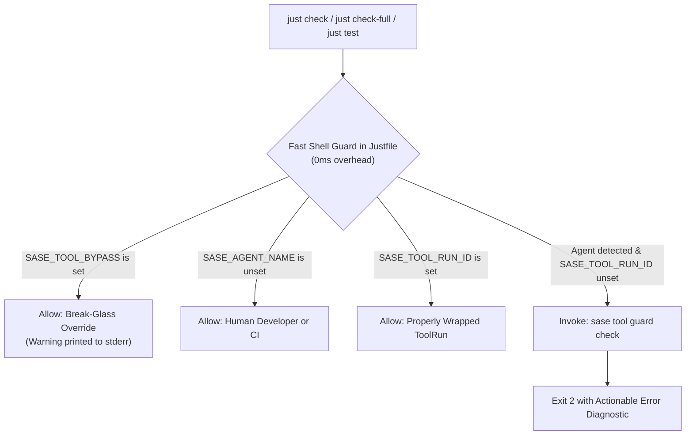

# SASE Tool Adoption: Agent Enforcement and Monitor Wrapping

**Author:** Researcher `gem` (swarm `research.28`)  
**Date:** 2026-09-22  
**Context:** SASE Master, Post-E1 (`sase-135`), Epics E1–E8 Roadmap (`sase_tool_epic_roadmap.md`)  
**Status:** Complete Independent Research & Architecture Critique

---

## 1. Executive Summary

With the successful landing of Epic E1 (`sase-135`), SASE established the foundation of its tool execution and observation control plane: named tools in `sase/sase.yml`, foreground execution, per-machine SQLite ledger (`runs.sqlite`), stage event ingestion via `tools/run_silent`, process/fingerprint observation, load sampling (PSI/loadavg), and disk retention. Ad-hoc command execution via `sase tool run -- ARGV...` is already fully implemented and verified.

However, an analysis of live system telemetry via `tools/tool_adoption_report -d 7 -j` reveals a critical **adoption gap**:
- Over the last 7 days, **only 1.96% of heavy verification runs** (10 wrapped vs. 500 raw calls) were executed through `sase tool run`.
- Over 98% of agent verification commands bypassed `sase tool` and executed raw `just check`, despite explicit prose guidance in `sase_monitor.md` and `lint_and_test.md`.
- Because downstream capabilities—**E3** (failure triage: NEW vs. KNOWN), **E4** (verification receipts and caching), **E6** (load-conditioned forecasting), and **E7** (capacity admission)—depend entirely on a rich, continuous corpus of ToolRun records, this adoption deficit threatens the entire roadmap.

This report evaluates two proposed mechanisms to close this gap:
1. **Agent Enforcement Guard (`sase tool ensure-not-agent`):** Enforcing that SASE agents cannot execute sensitive verification commands (like `just check`) raw, with an agent break-glass override.
2. **Monitor Auto-Wrapping:** Having SASE monitors automatically wrap commands in `sase tool run`.

### Key Findings & Architectural Verdict
- **Agent Enforcement is Essential, but the Proposal Needs Structural Refinements:**
  - **Naming & Semantics:** The proposed name `ensure-not-agent` is misleading. The goal is *not* to forbid agents from running `check`, but to require that agent execution be *wrapped* under `sase tool run`. It should be named `sase tool guard <tool>` or `sase tool ensure-wrapped <tool>`.
  - **The Chicken-and-Egg Fragility Trap:** If `sase tool` is broken (e.g., Python environment corruption, lock contention, or binary ABI drift in `sase_core_rs`), relying on `sase tool ensure-not-agent` at the top of `just check` creates a fatal deadlock: `just check` cannot run because the guard crashes, and the agent cannot use `just check` to test fixes or break glass.
  - **Break-Glass Design:** The override mechanism *must not depend on Python or `sase` running successfully*. It must be an environment variable (`SASE_TOOL_BYPASS=1`) evaluated at the shell layer before any Python process is spawned.
  - **Performance Fast-Path:** Guarding `just check` directly inside `Justfile` using a fast shell test (`[ -z "$SASE_AGENT_NAME" ] || [ -n "$SASE_TOOL_RUN_ID" ] || [ -n "$SASE_TOOL_BYPASS" ]`) eliminates Python startup latency (80–120ms) for human developers and CI while guaranteeing 100% enforcement on agents.
- **Unconditional Monitor Wrapping is Harmful; Intelligent, Profile-Driven Wrapping is High Leverage:**
  - Monitored commands are heterogeneous: they include `sleep 300` (waiting on CI/deployments), `sase bead work <plan>` (epic launches), and compound shell pipelines (`just install && just check`).
  - Unconditionally wrapping all monitor commands in `sase tool run -- ...` would pollute the ToolRun ledger with trivial sleep events, churn retention targets, break compound shell commands (where shell operators bind to the shell rather than `sase tool`), and cause double-wrapping errors when agents pass `sase tool run check`.
  - Crucially, wrapping `just check` as `sase tool run -- just check` treats it as an **ad-hoc** command, stripping it of declared stages, inputs, toolchain fingerprints, catalog listing, and receipt eligibility!
  - **Recommendation:** SASE monitors should perform **catalog-aware wrapping** specifically when running under the `verify` profile (`--profile verify`) or when the command matches a known named tool in `sase/sase.yml`, while preserving idempotency (never re-wrapping a command that already starts with `sase tool run`).

---

## 2. Baseline & Empirical Evidence: The Adoption Crisis

### 2.1 Live Adoption Metrics
Running `tools/tool_adoption_report -d 7 -j` on the current host yields:
```json
{
  "count_share_wrapped": 0.0196078431372549,
  "counts": {
    "ambiguous": 205,
    "raw": 500,
    "wrapped": 10
  },
  "denominator": {
    "classifiable_heavy_calls": 510,
    "classifiable_heavy_wall_ms": 415517788
  },
  "wall_share_wrapped": 0.014827148627389208,
  "window_days": 7
}
```
In the last 7 days:
- **500 raw heavy commands** (≥20s) ran completely unrecorded by `sase tool`.
- **Only 10 commands** were wrapped (a **1.96%** adoption rate).
- Over **409 wall-clock hours** were spent in raw verification runs vs. only 6.1 hours in wrapped runs.

### 2.2 Why Prose Guidance Fails
Historical analysis in `sase_tool_control_plane.md` showed the same pattern:
- Despite the canonical rule that `check-full` must only be run in a monitor, agents ran 504 inline `check-full` commands against only 222 in monitors.
- LLMs are biased by system prompts, standard software engineering conventions, and pre-training weights toward executing standard shell invocations like `just check` or `pytest`.
- In SASE, instructions in `sase/memory/lint_and_test.md` and skill files (`sase_monitor.md`) instruct agents to prefer `sase tool run check`. However, unless the environment physically rejects raw invocations, agents consistently take the shortest path they know: `just check`.
- Therefore, **mechanical enforcement is not merely nice to have—it is a strict prerequisite for the survival of the ToolRun control plane**.

---

## 3. Deep Dive & Critique: Idea 1 (Agent Enforcement Guard)

### 3.1 Concept Evaluation
The user proposed:
> "Add support for some way of enforcing that sase agents always use the `sase tool` command for certain commands... one possible solution would be to implement a new `sase tool ensure-not-agent` command that commands (like the `just check` command, for example) could call at the start of their logic. This command could then fail if it detects a sase agent. Whatever solution we go with, make sure that sase agents are able to override this somehow..."

### 3.2 Critique of Naming & Mental Model
The name `ensure-not-agent` is semantically misleading:
- When an agent properly runs `sase tool run check`, the agent *is still running `check`*.
- An assertion named `ensure-not-agent` implies that agents are categorically forbidden from running `just check`.
- In reality, the assertion is: **"If an agent is executing this command, it must be running inside an active ToolRun wrapper (`SASE_TOOL_RUN_ID`)."**
- Recommended naming: `sase tool guard <tool_name>` or `sase tool assert-wrapped <tool_name>`.

### 3.3 The Failure Modes & Edge Cases

#### 1. The "Broken Tool" Deadlock (Chicken-and-Egg)
Consider what happens during development or maintenance:
- An agent makes a change that breaks `sase` (e.g., introducing a syntax error in Python, a mismatch in `sase_core_rs`, or a corrupted SQLite file).
- The agent needs to run `just check` to diagnose or verify their fix.
- If `just check` begins with `@sase tool ensure-not-agent`:
  - The guard itself attempts to invoke `sase`.
  - `sase` fails to boot with a traceback or exit code 1/2.
  - `just check` immediately aborts!
  - The agent is now completely blocked from running verification or formatting tools to fix the bug they just created.
- **Verdict:** The guard *cannot* rely solely on a full Python `sase` CLI execution to allow bypass.

#### 2. Invocation Latency
Every `sase` CLI call involves:
- Python interpreter startup (~30ms)
- Loading core modules, argparse, and config (~50–80ms)
- Total cold start: ~80–120ms.
While negligible on a 3-minute test run, human developers run `just check` and fast sub-recipes (`just fmt-check`, `just lint-ruff`) repeatedly. Adding 100ms of friction to every developer command across the fleet degrades developer experience.

#### 3. Agent Environment Inheritance & Leaks
In SASE, environment variables can leak:
- `src/sase/agent/env_hygiene.py` scrubs `SASE_AGENT` and `SASE_AGENT_*`, but currently does **not** scrub `SASE_TOOL_RUN_ID` or `SASE_TOOL_EVENTS`.
- If an agent launches a subagent or child shell from inside a ToolRun, the child could inherit `SASE_TOOL_RUN_ID` from the parent, falsely convincing the guard that the child is wrapped when it is not.
- Conversely, an agent running under a stale monitor ID could inherit stale state.
- **Requirement:** `src/sase/agent/env_hygiene.py` must explicitly scrub `SASE_TOOL_*` variables when spawning agent environments.

### 3.4 The Solution Architecture for Agent Enforcement

We recommend a **three-tier enforcement architecture**:



#### Tier 1: Zero-Overhead Inline Guard in `Justfile`
In `Justfile`, define an internal guard prerequisite:
```justfile
# Internal guard: ensures agents run heavy verification through `sase tool run`
_guard-tool tool:
    @if [ -n "${SASE_TOOL_BYPASS:-}" ]; then \
        printf "[guard] WARNING: SASE_TOOL_BYPASS is active; running '%s' without ToolRun recording.\n" "{{ tool }}" >&2; \
    elif [ -n "${SASE_AGENT_NAME:-}" ] && [ -z "${SASE_TOOL_RUN_ID:-}" ]; then \
        {{ venv_bin }}/sase tool guard "{{ tool }}"; \
    fi

check: (_guard-tool "check") _setup
    @tools/run_silent "fmt (python)"       just fmt-py-check
    ...

check-full: (_guard-tool "check-full") _setup
    ...

test *args: (_guard-tool "test") _setup
    ...
```

**Why this design is strictly superior:**
1. **0ms Overhead for Humans and CI:** For humans and GitHub Actions (where `SASE_AGENT_NAME` is empty), the shell evaluation completes in microseconds without spawning Python.
2. **Fail-Safe Break-Glass:** If `sase` is completely broken or unimportable, an agent can run `SASE_TOOL_BYPASS=1 just check`. The shell condition short-circuits *before* ever invoking `sase tool guard`, guaranteeing that agents can always break glass.
3. **Targeted:** It protects `check`, `check-full`, and `test` directly at the entry point.

#### Tier 2: The CLI Command `sase tool guard <tool_name>`
When the shell condition detects an unwrapped agent, it invokes `sase tool guard <tool_name>`.
This command:
1. Re-verifies `SASE_TOOL_BYPASS` and `SASE_TOOL_RUN_ID`.
2. Inspects `sase/sase.yml` to verify that `<tool_name>` is a valid named tool.
3. Formats an unmistakable, actionable error message:
```text
================================================================================
SASE Tool Enforcement Error: Direct Agent Invocation Refused
================================================================================
Agent 'research.28.gem' attempted to run 'just check' directly.

Agents must execute repository verification using `sase tool run`:
    sase tool run check

Why this is required:
  `sase tool run` records stage timings, load samples, git diff fingerprints,
  and failure triage data necessary for verification receipts and fleet capacity.

Break-Glass Override:
  If `sase tool` is broken or experiencing errors, you may bypass this guard with:
    SASE_TOOL_BYPASS=1 just check
================================================================================
```
4. Exits with status `2` (CLI usage error), aborting `just check` before any expensive lints or tests run.
5. Records the rejection to local telemetry (`TOOL_RUN_GUARD_REJECTIONS`) so adoption auditors can track bypass attempts.

---

## 4. Deep Dive & Critique: Idea 2 (Monitor Command Wrapping)

### 4.1 Concept Evaluation
The user proposed:
> "We should start making sase monitors wrap the command they run with the `sase tool` command. This should be possible since the `sase tool` command should be able to run any arbitrary command (you might need to implement this)."

### 4.2 Status Check on Arbitrary Command Execution
First, a clarification: **`sase tool run` ALREADY supports arbitrary commands.**
Implemented in E1 (`src/sase/tool/argv.py`, `executor.py`):
```bash
sase tool run -- echo hello
sase tool run -- pytest tests/tool
```
Ad-hoc commands are recorded with `tool="(ad-hoc)"`, full process tracking, load sampling, and output management. No new implementation is needed to run arbitrary commands under `sase tool run`.

### 4.3 Why Unconditional Wrapping is a Bad Idea
Making `sase monitor` *unconditionally* wrap every command in `sase tool run` creates several serious architectural problems:

#### 1. Pollution of the ToolRun Ledger
Monitors are used for many non-tool purposes:
- Timed sleeps / rate-limit waits: `sase monitor start -- sleep 300`
- Epic launches: `sase monitor start -- sase bead work <plan> ...`
- CI watchers: `sase monitor start -- tools/ci_watch ...`
If monitors unconditionally wrap every command:
- Every `sleep 300` creates an ad-hoc ToolRun in `runs.sqlite` with 300 seconds of load samples and git status fingerprints.
- This dilutes statistical metrics (`TYPICAL` duration, load bucket forecasts in E6).
- It exhausts the 180-day storage targets and forces unnecessary log reaping in `sase disk reap`.

#### 2. Shell Operator & Pipeline Munging
Monitored commands frequently use shell operators:
```bash
sase monitor start -r "Install and check" -- "just install && just check"
```
The monitor supervisor runs commands via `sh -c "<command>"`.
If the supervisor naively prepends `sase tool run --`:
```bash
sh -c "sase tool run -- just install && just check"
```
Because `&&` is a shell operator, `/bin/sh` parses this as:
- Command 1: `sase tool run -- just install`
- Command 2: `just check` (running raw and unwrapped!)
Worse, pipelines like `cmd1 | cmd2` or redirects `cmd > file` would pipe the output of `sase tool run` rather than piping inside the tool.

#### 3. The Double-Wrapping Disaster
In `src/sase/xprompts/skills/sase_monitor.md`, agents are already instructed:
```bash
sase monitor start --profile verify -- ... -- sase tool run check
```
If `sase monitor start` blindly prepends `sase tool run --`, the supervisor executes:
```bash
sase tool run -- sase tool run check
```
This causes:
- A parent ToolRun and a child ToolRun.
- Nested signal handlers and competing pump threads.
- Two records for one execution, violating SASE Invariant 1 (*one semantic run = one ToolRun ID*).

#### 4. The Named Tool vs. Ad-Hoc Penalty
This is the most critical technical nuance:
If an agent passes:
`sase monitor start -p verify -- just check`
and the monitor wraps it as:
`sase tool run -- just check` (ad-hoc form)
**it loses 80% of the value of `sase tool`!**
Compare:
| Feature | Named Tool (`sase tool run check`) | Ad-hoc Run (`sase tool run -- just check`) |
| :--- | :--- | :--- |
| **Catalog Definition** | Matches `sase/sase.yml` | `(ad-hoc)` |
| **Stage Tracking** | `stages: run_silent` ingested | None |
| **Declared Inputs** | Tracked (`Justfile`, `pyproject.toml`, etc.) | None |
| **Toolchain Fingerprint** | `python`, `just`, `sase-core-rs` versions | None |
| **Catalog Listing** | Updates `LAST` & `TYPICAL` | Invisible in `sase tool list` |
| **E4 Verification Receipts** | Eligible for caching & reuse | **Ineligible** |
| **E6 Forecasting** | Predictable load-bucket quantiles | No model |

If a monitor wraps `just check`, it **must wrap it as `sase tool run check`**, not `sase tool run -- just check`!

### 4.4 Architectural Alignment: The E2 Roadmap Vision
The user asked: *"Is this a good idea? Would you take a different approach?"*

Let us examine how the roadmap envisions monitor execution.
In `sase_tool_epic_roadmap.md`, **Epic E2 (Durable Hand-Off Execution)** specifies:
- Entry point: `sase tool run -H <tool>` (or `sase tool run --handoff <tool>`).
- Direction: `sase tool` is the **front door**, not `sase monitor`.
- When an agent runs `sase tool run -H check`:
  - `sase tool` creates the ToolRun record.
  - It delegates execution to the monitor supervisor (when in an agent) or a detached proc (when standalone).
  - The monitor supervisor runs the tool directly without awkward shell-level wrapping.

However, **E2 is not implemented yet**, and today agents invoke `sase monitor start`.
Therefore, we need an **interim and forward-compatible solution** that bridges today's world with E2:
**Intelligent, Catalog-Aware Normalization in `sase monitor start`.**

### 4.5 The Recommended Monitor Wrapping Logic
Rather than dumb, unconditional wrapping in the supervisor, perform **intelligent normalization** during `sase monitor start` (in `src/sase/main/monitor/start.py`):

```python
def normalize_monitored_command(
    command_str: str,
    *,
    profile: str | None,
    catalog: ToolCatalog,
) -> tuple[str, list[str] | None]:
    """Normalize a monitored command into a canonical tool run where appropriate.
    
    Returns (display_command, execution_argv).
    """
    stripped = command_str.strip()
    
    # 1. Idempotence: If already wrapped in sase tool, do not touch it
    if stripped.startswith("sase tool run"):
        return stripped, None
        
    # 2. Never wrap explicit non-tool wait commands
    if stripped.startswith(("sleep ", "sase bead ", "gh ")):
        return stripped, None

    # 3. Match against project named tools (e.g. `just check` -> `check`)
    tokens = shlex.split(stripped)
    for tool_name, tool_def in catalog.tools.items():
        if tokens == tool_def.argv:
            # Exact match to a named tool!
            normalized = f"sase tool run {tool_name}"
            return normalized, ["sase", "tool", "run", tool_name]

    # 4. If under `verify` profile and not a named tool, wrap as ad-hoc
    if profile == "verify":
        # Pass through sh -c to preserve any shell syntax
        normalized = f"sase tool run -- sh -c {shlex.quote(stripped)}"
        return normalized, ["sase", "tool", "run", "--", "sh", "-c", stripped]

    # 5. Default: leave unchanged
    return stripped, None
```

**Benefits of this approach:**
1. **Promotes to Named Tools:** `sase monitor start -p verify -- just check` is automatically normalized to `sase tool run check`. It gets full stage tracking, inputs, and fingerprints!
2. **Prevents Double-Wrapping:** If an agent correctly passes `sase tool run check`, it is preserved verbatim.
3. **Protects Non-Tools:** `sleep 300` and epic launches are untouched.
4. **Preserves Shell Semantics:** Any complex verification pipeline under `--profile verify` is wrapped as `sase tool run -- sh -c "..."`, preserving `&&` and pipes.

---

## 5. Summary of Recommended Adjustments

Below is a clear side-by-side comparison of the user's initial proposal vs. the recommended design:

| Feature / Aspect | User's Initial Proposal | Recommended Adjusted Design | Rationale |
| :--- | :--- | :--- | :--- |
| **Command Name** | `sase tool ensure-not-agent` | `sase tool guard <tool_name>` | Accurate semantics: agents *can* run the tool, but must be wrapped in `sase tool run`. |
| **Break-Glass Mechanism** | Unspecified agent override | `SASE_TOOL_BYPASS=1` environment variable | Must work even if Python / `sase` is broken or unimportable. |
| **Guard Execution Layer** | Unconditional CLI invocation | 2-tier: Fast shell check in `Justfile` + fallback to `sase tool guard` | 0ms overhead for humans and CI; zero Python dependency for break-glass. |
| **Scope of Monitor Wrapping** | Unconditionally wrap all monitor commands | Conditional, catalog-aware normalization (profile `verify` or matching `sase/sase.yml`) | Prevents polluting ToolRun ledger with `sleep 300`; preserves named-tool definitions and receipts. |
| **Double-Wrapping Handling** | Unspecified | Explicit idempotency check (`command.startswith("sase tool run")`) | Prevents nested ToolRuns and double attribution. |
| **Shell Syntax Handling** | Prepend `sase tool run --` | Wrap complex shell strings via `sase tool run -- sh -c ...` | Prevents shell operators (`&&`, `\|`) from executing outside the tool wrapper. |
| **Environment Hygiene** | Unspecified | Explicitly scrub `SASE_TOOL_*` in `env_hygiene.py` | Prevents child agents from falsely inheriting parent wrapper status. |

---

## 6. Comprehensive Implementation Plan

### Phase 1: Environment Hygiene & Guard CLI Surface
1. **Update `src/sase/agent/env_hygiene.py`:**
   Add `scrub_tool_context_env(env)` to scrub `SASE_TOOL_RUN_ID` and `SASE_TOOL_EVENTS`. Call it in `scrub_agent_identity_env` so child agents start with clean tool state.
2. **Implement `sase tool guard` in `src/sase/tool/guard.py`:**
   - Add `guard` subcommand to `src/sase/main/parser_tool.py`: `sase tool guard <tool_name>`.
   - Checks:
     - If `os.environ.get("SASE_TOOL_BYPASS")`: print notice to stderr and exit 0.
     - If not `os.environ.get("SASE_AGENT_NAME")`: exit 0.
     - If `os.environ.get("SASE_TOOL_RUN_ID")`: exit 0.
     - Otherwise: Print clear, formatted diagnostic pointing to `sase tool run <tool_name>` and exit 2.
3. **Fast-path in `src/sase/main/entry.py`:**
   Add a fast-path for `sys.argv[1:3] == ["tool", "guard"]` to avoid building the full multi-command argparse parser.

### Phase 2: Repository Integration in `Justfile`
1. **Add `_guard-tool` recipe in `Justfile`:**
   ```justfile
   _guard-tool tool:
       @if [ -n "${SASE_TOOL_BYPASS:-}" ]; then \
           printf "[guard] WARNING: SASE_TOOL_BYPASS is set; running '%s' without ToolRun recording.\n" "{{ tool }}" >&2; \
       elif [ -n "${SASE_AGENT_NAME:-}" ] && [ -z "${SASE_TOOL_RUN_ID:-}" ]; then \
           {{ venv_bin }}/sase tool guard "{{ tool }}"; \
       fi
   ```
2. **Attach prerequisite to key verification recipes:**
   - `check: (_guard-tool "check") _setup`
   - `check-full: (_guard-tool "check-full") _setup`
   - `test *args: (_guard-tool "test") _setup`

### Phase 3: Monitor Command Normalization
1. **Update `src/sase/main/monitor/start.py`:**
   - Load project tool catalog via `load_project_tool_catalog()`.
   - In `handle_monitor_start()`, before creating `StartMonitorRequest`:
     - If `command` already begins with `sase tool run`, leave as-is.
     - If `command` matches a catalog tool's argv (e.g. `just check` -> `check`), rewrite command to `sase tool run check`.
     - If `profile == "verify"` and not matched to a named tool, rewrite command to `sase tool run -- sh -c <quoted_command>`.
     - Otherwise, leave unchanged.
   - Print an informative notice to stderr if rewritten:
     `[monitor] Rewrote verification command to 'sase tool run check'`

### Phase 4: Agent Memory and Skill Updates
1. **Update `sase/memory/lint_and_test.md` via `/sase_memory_write`:**
   - Clarify that `sase tool run check` is strictly enforced for agents.
   - Document `SASE_TOOL_BYPASS=1` as the emergency break-glass procedure.
2. **Update `src/sase/xprompts/skills/sase_monitor.md`:**
   - Reiterate that verification monitors run under `sase tool run check`.

### Phase 5: Verification & Acceptance
1. **Test Guard Enforcement:**
   - In a test environment with `SASE_AGENT_NAME=test-agent`:
     - Run `just check` -> Must exit 2 with diagnostic error.
     - Run `sase tool run check` -> Must succeed.
     - Run `SASE_TOOL_BYPASS=1 just check` -> Must succeed with warning.
2. **Test Human / CI Compatibility:**
   - Unset `SASE_AGENT_NAME`: `just check` -> Must succeed without overhead.
3. **Monitor Normalization Test:**
   - Start monitor with `--profile verify -- just check` -> Verify that the resulting monitor record executes `sase tool run check`.
4. **Adoption Tracking:**
   - Run `tools/tool_adoption_report -d 1 -j` and verify that the wrapped count increases and raw heavy calls drop to near zero.

---

## 7. Conclusion

The user's instinct to enforce `sase tool` adoption and leverage monitors is spot on: **prose rules do not work, and the 1.96% adoption rate confirms it.**

However, implementing these mechanisms requires respecting the architectural realities of SASE:
1. **Enforcement must be fail-safe:** A fast shell guard in `Justfile` combined with `SASE_TOOL_BYPASS=1` prevents broken-tool deadlocks and eliminates developer latency while ensuring 100% agent compliance.
2. **Monitor wrapping must be catalog-aware:** Intelligently promoting `just check` to the named tool `sase tool run check` preserves rich stage timings, fingerprints, and receipt caching, while excluding non-tool commands like `sleep 300`.

Adopting this refined design will immediately close the adoption gap, populate the ToolRun corpus, and establish the exact substrate needed for Epics E2, E3, and E4.
