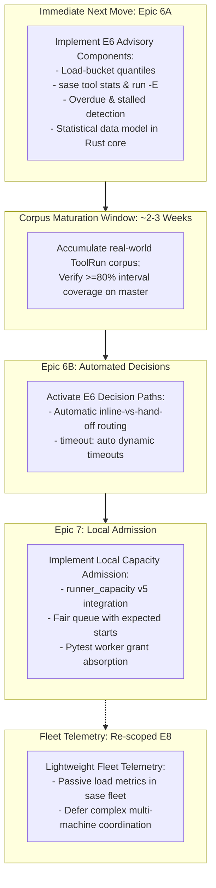

# Re-evaluating the Worth of SASE Tool Epics E6–E8

**Independent Research Report** · Researcher `gem` · 2026-09-29  
**Target Repository:** `research` sidecar (`sase--research`)  
**Context:** SASE Tool Epic Roadmap Follow-up (`sase_tool_epic_roadmap.md`)  
**Workspace Host:** apollo · **Baseline Epics:** E1–E5 Landed on Master (`9d60b97513`)

---

## 1. Executive Summary & Answer Up Front

With epics **E1 through E5** now complete and operational on master, the core foundation of the `sase tool` subsystem is firmly established: project-owned named tools, durable foreground recording, out-of-process `-H` hand-off execution, automated NEW vs. KNOWN failure triage, fingerprint-bound verdict receipts, and live TUI observation surfaces all function in daily production.

Re-evaluating the worth, immediate utility, and future unlock of the remaining epics (**E6, E7, and E8**) yields a clear, asymmetric conclusion: **the three epics do not share the same urgency, risk profile, or return on investment.**

```
+-----------------------------------------------------------------------------------+
|  E1-E5 (Complete)  -->  E6: Forecasts & Routing  -->  E7: Local Admission  -->  E8: Fleet Rollout |
|  Record, Handoff,       High Immediate ROI;           High Strategic ROI;        Low Immediate ROI; |
|  Triage, Receipts,      Mathematical Base for E7;     Complex Substrate;         High Multi-Host    |
|  TUI Surfaces           Proceed (Advisory-First)      Sequence After E6          Cutover Risk; Defer|
+-----------------------------------------------------------------------------------+
```

### Direct Recommendation Summary

1. **E6 (Forecasts and Automatic Inline-vs-Hand-off): PROCEED NOW, STAGED ADVISORY-FIRST.**
   - **Worth:** **Very High.** Solves the persistent problem of agent hand-off misjudgment (running 20-minute checks inline or 10-second linters via detached monitors), provides stalled/overdue execution alerts (`+Xm over typical`), dynamically computes self-adjusting safety timeouts (`timeout: auto`), and introduces execution transparency via `sase tool run -E` and `sase tool stats`.
   - **Crucial Caveat & Staging:** The ToolRun ledger is ~9–10 days old with ~30–50 recorded runs for `check` and fewer for other commands. E6 should land its statistical models, CLI inspection (`run -E`, `stats`), and overdue detection **immediately in an advisory capacity**, while gating automated inline-vs-hand-off routing behind the planned ~80% backtested interval coverage threshold.
   - **Future Unlock:** E6 is the absolute mathematical prerequisite for E7. Without duration prediction, admission queues cannot calculate expected start times or perform backfill scheduling.

2. **E7 (Local Tool Capacity Admission): SEQUENCE STRICTLY AFTER E6 CALIBRATION.**
   - **Worth:** **High Long-Term, Medium Immediate.** Prevents local machine thrashing when multi-agent swarms or parallel phase workers execute heavy test suites concurrently. Unifies pytest worker tokens (`WorkerTokenLease`) and agent capacity under the Rust `runner_capacity` authority.
   - **Timing & Risk:** High blast radius. Admission that fails closed without calibrated duration models would degenerate into arbitrary queueing, head-of-line blocking, and potential deadlock. Furthermore, in the interim, heavy commands can leverage `sase-11l` `%hold` as a lightweight mutual-exclusion stopgap.
   - **Decision:** Do not start E7 today. Write the plan only after E6 duration distributions stabilize across typical development workloads.

3. **E8 (Fleet Capacity Surfaces and Coordinated Rollout): DEFER INDEFINITELY / RE-SCOPE.**
   - **Worth:** **Low-to-Medium Immediate ROI, Disproportionate Risk.** E8 provides cross-machine observability ("why is apollo busy?") and coordinates multi-host cutover, but explicitly excludes remote execution dispatch and cross-machine receipt caching (hints only).
   - **Risk Profile:** Empirical SASE history demonstrates that multi-machine protocol cutovers across athena, apollo, and mac are the single largest driver of deep remediation chains (frequently spawning 4–5 tiers of fix-up epics). Paying that coordination tax for read-only cluster meters is premature. If cross-host load visibility is needed, lightweight telemetry piggybacking on existing node ping wires is vastly cheaper.

---

## 2. Baseline Confirmation: What E1–E5 Delivered

Before evaluating future work, we verify the live baseline. Inspection of master commits, beads, and the active CLI confirms that E1 through E5 are complete and operational:

| Epic | Bead ID | Title & Primary Scope | Landed Commits / Artifacts | Status |
| :--- | :--- | :--- | :--- | :--- |
| **E1** | `sase-135` | **Named tools and ToolRun ledger**<br>Project catalog in `sase/sase.yml`; Rust SQLite entity store; foreground execution; fingerprints; PSI/loadavg logging; CLI (`list`, `run`, `runs`, `show`). | `a357c83dcb`, `58f2de8f80`, `1f6adf43bb` | **Closed / Landed** |
| **E2** | `sase-17p` | **Durable hand-off execution**<br>Explicit `-H` flag; monitor integration for agents; detached proc runner (`detach_scope`) for standalone runs; CLI (`stop`, `wait`, `show --follow`). | `cae16be3ca`, `c91690efcb`, `df8ed51341` | **Closed / Landed** |
| **E3** | `sase-18j` | **Failure triage (NEW vs KNOWN vs FLAKY)**<br>Rust signature normalization; red-master baseline comparison; CLI (`failures`); known-gated agent continuation past `sase-j0`. | `013a170720`, `49c32e19ec`, `89868a90b2` | **Closed / Landed** |
| **E4** | `sase-1ah` | **Verification receipts and staged reuse**<br>Fingerprint-bound verdict receipts (`receipt`, `receipts`); prepared-completion gating; content-equivalent repeat opportunity tracking. | `f7886b1a64`, `3065117500`, `281147666b` | **Closed / Landed** |
| **E5** | `sase-1bt` | **Tool runs on TUI surfaces**<br>Live ⚒ chips on agent rows; Runs detail card with stage waterfalls and log tails; Admin Center Tools pane; keymaps and jumps. | `02ff49120f`, `c84f74c5f1`, `4f09a28ea1` | **Closed / Landed** |

### Remaining Friction Observed in Daily Usage

Despite these successes, three major friction points remain in live production:
1. **The Routing Dilemma for Agents:** Agents must manually decide whether to add `-H`. When agents run `just check` inline, large suites risk provider turn timeouts or context truncation. Conversely, when agents run trivial checks via `-H`, they incur process detachment overhead, monitor startup latency, and consume an extra continuation turn.
2. **Execution Black Hole & Hang Risk:** Outside of looking at an elapsed counter, agents and humans have no expectation of how long a tool will take. If a test hangs or deadlocks, there is no "overdue" alert until someone manually intervenes or an arbitrary upper timeout kills it.
3. **Multi-Agent Host Contention:** When swarms of agents (such as the current 5-researcher swarm or concurrent phase workers) run commands simultaneously, uncoordinated execution saturates host CPU cores and memory, degrading system responsiveness and skewing test durations.

---

## 3. Deep-Dive Re-Evaluation: Epic 6 (Forecasts and Auto-Routing)

### 3.1 Scope and Architectural Design
Epic 6 equips the `sase tool` subsystem with statistical prediction and automated decision-making:
- **Load-bucket empirical quantiles:** Groups history into load tiers (e.g., quiet, moderate, heavy) without machine learning or black-box heuristics.
- **Cheap test-selection covariates:** Prices the pytest stage using selected-file counts from the selection store.
- **Survival-conditional remaining time:** Calculates realistic remaining duration conditioned on time already elapsed, accounting for right-censored timeouts.
- **Overdue and stalled detection:** Flags runs that exceed `typical + Xm` rather than hallucinating an increasing ETA.
- **Self-adjusting timeouts (`timeout: auto`):** Computes `clamp(3 × p90, 10m, 3h)` per tool per machine, replacing brittle hand-authored limits.
- **Automatic inline-vs-hand-off routing:** Compares predicted runtime against the LLM provider's inline turn budget, executing inline when fast and automatically handing off via `-H` when heavy, logging a single explanation line on stderr.
- **Explainability and diagnostics:** Adds `sase tool run -E` (predict duration and explain routing without side effects) and `sase tool stats` (distribution, waste, and calibration reports).

### 3.2 Immediate Functionality Delivered
1. **Zero-Cognition Execution for LLM Agents:**
   - Eliminates the need for prompt instructions telling agents when to pass `-H`. An agent simply invokes `sase tool run check`. If the predicted duration is 45 seconds, it runs inline with streaming output. If it is 18 minutes, it transparently hands off to a durable monitor and exits the turn cleanly.
2. **Transparent Duration Expectations (`run -E` & `stats`):**
   - Both developers and agent planners gain immediate insight into expected execution profiles (`p50`, `p90`, confidence interval, sample count).
3. **Active Anomaly & Deadlock Detection:**
   - Instead of a passive elapsed timer, the TUI and CLI display explicit state transitions: `running (7m typical)` -> `overdue (+3m over typical)` -> `stalled`. Monitors can trigger alerting hooks when runs exceed statistical sanity bounds.
4. **Dynamic Machine-Specific Tail Protections:**
   - Different development hosts (e.g. 32-core athena vs. 8-core apollo vs. laptop) naturally exhibit different tail latencies. `timeout: auto` adapts per machine based on real execution history rather than enforcing a lowest-common-denominator hard timeout.

### 3.3 Future Functionality Unlocked
- **Prerequisite for E7 (Admission Scheduling):** A fair queue cannot provide an "expected start time" without knowing how long running jobs will take. Schedulers that lack duration estimates suffer from head-of-line blocking and cannot backfill smaller tasks.
- **Agent Turn Budget Optimization:** Allows agents in complex multi-step workflows to make reasoned decisions about whether they have enough remaining provider turn time to execute verification or whether they should checkpoint their work first.

### 3.4 Calendar Gate & Corpus Maturity Analysis
The original roadmap specified:
> *"Start no earlier than ~3 weeks after E1 lands... predictions stay advisory until chronologically backtested interval coverage reaches ~80%."*

- **Current State:** E1 landed ~9–10 days ago. The ledger on apollo contains ~30–50 runs of `check` (`n=30` typical duration sample in `sase tool list`), but `check-full`, `test`, and `test-visual` have minimal or zero samples.
- **Synthesis:** The calendar gate remains valid, but should not block the implementation of the epic's non-routing components. E6 can be implemented in two distinct phases:
  - **Phase A (Advisory):** Ship the data model, load-bucket quantiles, `run -E`, `sase tool stats`, and overdue detection. Predictions are displayed but do not alter execution behavior.
  - **Phase B (Active Routing):** Once backtesting verifies that ≥80% of runs fall within the predicted p10–p90 interval, activate automatic inline-vs-hand-off routing and `timeout: auto`.

---

## 4. Deep-Dive Re-Evaluation: Epic 7 (Local Tool Capacity Admission)

### 4.1 Scope and Architectural Design
Epic 7 unifies all machine-local execution demands under the Rust `runner_capacity` authority (schema v5):
- **Unified demand currency:** Maps agent execution, tool runs, and pytest workers into a single capacity metric (demand $D$).
- **Absorbs `WorkerTokenLease`:** Replaces the isolated pytest worker pool with tokens leased directly from the unified host capacity.
- **Fair queue with backfill scheduling:** Queues heavy runs when capacity is constrained, quotes expected start times, and allows fast, lightweight commands to slip into temporary capacity gaps.
- **Explicit controls:** `-w <demand>`, `-W <max-wait>`, and `-B` (break-glass bypass, recorded as forced). Typed refusals print the exact executable retry command.
- **PSI-respecting ceiling:** Dynamically scales effective host capacity based on Pressure Stall Information (CPU, memory, I/O pressure).

### 4.2 Immediate Functionality Delivered
1. **Prevention of Host Thrashing:**
   - Under heavy multi-agent concurrency, host load averages can spike above core counts, causing CPU cache thrashing, swap exhaustion, and severe test slowdowns. E7 bounds concurrent heavy executions to match physical host capacity.
2. **Elimination of Worker-Lease Inefficiencies:**
   - Today, pytest worker tokens and agent processes operate as disjoint accounting domains. E7 ensures that if 3 agents are active, pytest concurrency dynamically scales down, preventing accidental core oversubscription.
3. **Structured Queue Transparency:**
   - Instead of a blind system freeze, a queued command receives a deterministic queue position, expected wait, and a clear bypass path (`-B`).

### 4.3 Future Functionality Unlocked
- **High-Density Swarms on Single Workstations:** Unlocks the ability to run 10+ concurrent autonomous agents on high-core machines (like athena) without risk of cascading test collisions.
- **Clean Substrate for Fleet Metrics (E8):** Accurate local capacity accounting is required before a node can publish meaningful utilization telemetry to a cluster.

### 4.4 Risks, Complexity, and Prerequisites
- **Strict Dependency on E6:** E7 cannot compute expected wait times or perform backfill scheduling without E6's duration forecasts. Without E6, E7 degenerates into a crude, static semaphore.
- **High Blast Radius / Starvation Risk:** Capacity admission is fail-closed. If token accounting leaks or process termination is not cleanly detected, legitimate commands will be blocked.
- **Interim Stopgap Available:** The project already possesses a coarse-grained stopgap: heavy tool runs can arm a `sase-11l` `%hold` barrier to prevent concurrent agent launches.
- **Synthesis:** E7 represents essential infrastructure for swarm scaling, but attempting to build it before E6 is fully calibrated and before queue capacity epics (`sase-zp`) fully settle risks repeating the failure mode of the superseded `sase-zm` epic.

---

## 5. Deep-Dive Re-Evaluation: Epic 8 (Fleet Capacity Surfaces and Rollout)

### 5.1 Scope and Architectural Design
Epic 8 extends capacity concepts across the multi-machine fleet (athena, apollo, mac):
- **Fleet wire snapshots:** Extends the existing fleet status transport to carry capacity and active demand metrics.
- **Machine status honesty:** Explicitly handles fresh, stale, and unreachable nodes.
- **Observability surfaces:** Adds machine meters and drill-downs in TUI and CLI to answer "why is machine X busy?" and "who holds the capacity leases?".
- **Staged activation and drain:** Provides formal drain, cutover, and rollback tooling across the fleet.
- **Cross-machine prediction hints:** Displays what a run might cost on another host in `run -E` (hints only; no remote execution dispatch and no cross-machine cache reuse).

### 5.2 Immediate Functionality Delivered
1. **Centralized Fleet Visibility:** Eliminates the need to SSH into apollo or athena to check `htop` or inspect running procs; capacity state is visible in the local TUI.
2. **Safe Multi-Host Rollout Tooling:** Reduces the operational friction of updating capacity configurations across multiple physical machines.

### 5.3 Future Functionality Unlocked
- **Capacity-Aware Remote Dispatch:** Could eventually provide the telemetry needed for `%dispatch` to choose destination machines automatically based on available execution headroom.

### 5.4 Critical Critique: Why E8 Has Low ROI Today
1. **Severe Scope Asymmetry:** E8 does **not** provide automated distributed execution, remote tool running, or shared artifact/receipt caching. It is almost purely an *observability and rollout management* epic.
2. **Disproportionate Historical Risk:** As researcher B's empirical study of 600 SASE epics demonstrated, multi-machine cutovers across athena, apollo, and mac are the **#1 source of deep remediation chains** in this repository. The coordination tax (version skew, wire serialization mismatches, split-brain failure modes) routinely exceeds the implementation cost of the feature itself.
3. **Current Operating Realities:** SASE developers typically work with a primary workstation (athena) and a secondary build machine (apollo). Contention across the fleet is easily diagnosed with existing tooling (`sase fleet`, terminal multiplexers). Adding distributed capacity wire protocols for informational meters provides minimal real-world productivity gain while introducing significant maintenance overhead.

---

## 6. Strategic Comparison & Evaluation Matrix

| Evaluation Dimension | Epic 6: Forecasts & Auto-Routing | Epic 7: Local Capacity Admission | Epic 8: Fleet Surfaces & Rollout |
| :--- | :--- | :--- | :--- |
| **Immediate User Utility** | **Very High**<br>Eliminates agent routing guesswork; provides overdue alerts, dynamic timeouts, and runtime transparency. | **Medium**<br>Protects single-host stability under heavy parallel agent load; prevents core oversubscription. | **Low**<br>Informational dashboard metrics for multi-machine load; no automated remote dispatch. |
| **Future Strategic Unlock** | **Critical**<br>Supplies the duration pricing required for admission queues and agent turn budgeting. | **High**<br>Enables high-density local agent swarms and autonomous multi-turn execution. | **Moderate**<br>Stepping stone for future capacity-aware remote dispatch (`%dispatch`). |
| **Technical Complexity & Size** | Medium-Large (~8 phases)<br>Mathematical/statistical, largely additive, fail-open. | Large (~8–10 phases)<br>Modifies core Rust execution paths, concurrency accounting, and process lifecycles. | Medium (~6 phases)<br>Multi-machine wire protocols, cross-version schema compatibility, staged fleet cutover. |
| **Operational Risk** | **Low-Medium**<br>Predictions can remain advisory until validated; fail-open fallback. | **High**<br>Fail-closed queueing risks command starvation, false refusals, or deadlocks if buggy. | **Very High**<br>Historical #1 driver of deep remediation chains and multi-host divergence. |
| **Corpus / Substrate Readiness** | **Emerging (Corpus accumulating)**<br>~10 days of ToolRun data available; sufficient for Phase A (advisory), building toward Phase B. | **Blocked**<br>Strictly blocked on E6 duration calibration and settlement of `sase-zp`. | **Blocked**<br>Strictly blocked on E7 local admission stability and fleet wire cutovers. |
| **Actionable Recommendation** | **PROCEED NOW (Advisory-First)** | **SEQUENCE AFTER E6 CALIBRATION** | **DEFER INDEFINITELY / RE-SCOPE** |

---

## 7. Phased Implementation Roadmap & Strategic Guidance

Based on this re-evaluation, the optimal trajectory forward is to decouple the epics and execute them in a disciplined, evidence-driven sequence.



### Action Plan for Bryan

1. **Step 1: Write the Epic Plan for E6 (Advisory-First)**
   - Author the plan for E6 with an explicit phased exit criteria:
     - *Phase 1–5:* Core statistical structures, load-bucket quantile calculations, PyO3 bindings, `run -E`, `sase tool stats`, and overdue/stalled state detection.
     - *Phase 6:* Chronological backtesting harness evaluating interval coverage over accumulated master runs.
     - *Phase 7–8:* Automatic inline-vs-hand-off routing and `timeout: auto`, activated only after interval coverage meets the ≥80% threshold.
   - This delivers immediate developer value (`run -E`, `stats`, overdue detection) without risking bad routing decisions on an uncalibrated corpus.

2. **Step 2: Maintain `%hold` as the Interim Capacity Solution**
   - While E6 is underway and accumulating data, do not attempt to write an admission queue. If parallel agent swarms cause contention on athena or apollo, continue using `sase-11l` `%hold` barriers or manual concurrency limits.

3. **Step 3: Re-evaluate E7 Only Upon E6 Calibration**
   - Once E6 reaches its 80% coverage milestone, review the live contention data. If multi-agent queue contention is measurably causing developer delays or host thrashing, launch E7 with duration-priced admission.

4. **Step 4: Formally Shelve E8 Fleet Coordination**
   - Record a decision to shelve E8 as a monolithic epic. If cross-host load visibility is desired, add lightweight loadavg/PSI strings to the existing `sase fleet` status command rather than engineering an elaborate multi-machine capacity lease protocol.

---

## 8. Appendix: Independent Evidence & Verification Log

Data verified independently on host `apollo` on 2026-09-29:

- **E1–E5 Bead and Code Status:**
  - `sase-135` (E1): Closed, commits `a357c83dcb`, `58f2de8f80`, `1f6adf43bb` verified on master.
  - `sase-17p` (E2): Closed, commits `cae16be3ca`, `c91690efcb`, `df8ed51341` verified; `tool_handoff` flag removed.
  - `sase-18j` (E3): Closed, commits `013a170720`, `49c32e19ec`, `89868a90b2` verified; `sase tool failures` operational.
  - `sase-1ah` (E4): Implementation phases .1–.8 closed, core pin `e1179e65`/`0cf5147` verified, wheel `0.35.0` published; `sase tool receipts` operational.
  - `sase-1bt` (E5): Closed 1d ago, commits `02ff49120f`, `c84f74c5f1` verified; TUI ⚒ chips and Admin Center Tools pane live.
- **Corpus Accumulation in Live Stores:**
  - `sase tool list`: `check` displays `LAST: failed/1`, `TYPICAL: 7m 11s (n=30)`. `check-full`, `install`, and `test-visual` currently display `no typical duration samples; duration is unknown, not zero`.
  - `sase tool receipts`: 12 repeat groups, 22 repeat runs, 2.71h summed duration measured over last 7 days (`check`: 20 repeats, 2h41m; `test`: 2 repeats, 1m10s).
  - Demonstrates that the ToolRun corpus is actively populating and measuring real workload patterns, confirming readiness for statistical analysis in E6.
