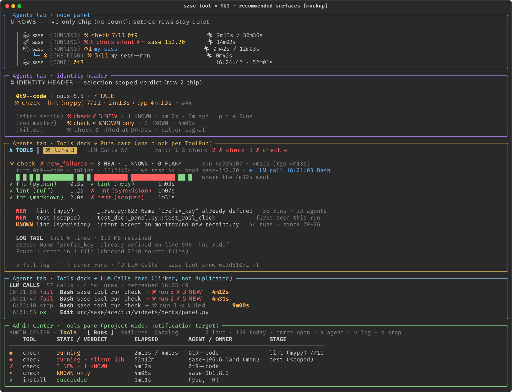

# `sase tool` in the TUI: consolidated UX recommendation

**Lead researcher:** consolidation of five independent reports (cdx, cld, grk, mus, gem)
plus the lead's own verification · **Date:** 2026-09-27 · **Host:** athena · **sase
master inspected:** `c78eb3805f`

**Question.** Bryan wants to bring `sase tool` into the Agents tab, and maybe other parts
of the TUI. He floated two ideas without much confidence in either:

- a new card in the **Tools** deck;
- a small **hammer icon with a count** on agent nodes that made tool runs.

What is the best UX for `sase tool` in the TUI, and where should the work start?

**Inputs.** Five researcher reports sit beside this file:
[`__cdx`](sase_tool_tui_integration__cdx.md), [`__cld`](sase_tool_tui_integration__cld.md)
(with [mockup](sase_tool_tui_integration_ux__cld_mockup.png)),
[`__grk`](sase_tool_tui_integration__grk.md), [`__mus`](sase_tool_tui_integration__mus.md),
and [`__gem`](sase_tool_tui_integration__gem.md). The lead re-ran every number that
decides the design against the live ledger and code. Section 4 records where the reports
disagreed and how each disagreement was settled.

---

## 0. Answer up front

**Both ideas point at real surfaces, but each needs a change.** The hammer should stay
and the count should go. The Tools-deck card is right, but it is where you go for
detail, not the whole integration.

| Your idea | Verdict | Why |
| --- | --- | --- |
| Hammer + count on agent rows | **Keep the hammer (`⚒`). Drop the count. Show the chip only while a run is live, and turn it red when the run goes silent.** | Median runs per agent is **1** (p90 3; 473 of 725 agents in 7 days had exactly one). A count would put `⚒1` on nearly every coding agent and never change a decision. What the row *can't* tell you today is that a `(RUNNING)` agent has been stuck inside `check`, stage 7 of 11, for 4 minutes. On average only **1.4 runs are live at once**, so a live-only chip is rare enough to mean something. |
| New card in the Tools deck | **Yes: a `⚒ Runs` card, first in the existing λ Tools deck, beside LLM Calls.** It is the drill-down home, not the whole integration. | The LLM Calls rename freed the deck name "Tools" for exactly this. Runs are 1–3 per node, so they fill a card, not a deck. The deck is two keypresses away, though. It can't answer "what is this agent doing right now?", and it can't show agent-less or cross-agent runs. |

**Recommended design: one noun, one glyph, one renderer, four places it appears.** In
order of value:

1. **Live row chip.** `⚒ check 7/11` appears only while a ToolRun is live. When the run's
   heartbeat stops it turns red: `⚒⚠ check silent 4m`. It follows the `⊛` finalizer-chip
   precedent: it shows state, never a quantity, and stays quiet on success.
2. **Identity-header chip** for the selected node only. Live:
   `⚒ check · lint (mypy) 7/11 · 2m13s / typ 4m13s`. Settled:
   `⚒ check ✗ 3 NEW · 1 KNOWN`. It shows the triage verdict, not the exit code.
3. **Tools deck → `⚒ Runs` card.** One card block per run, with:
   - a stage waterfall;
   - triage items;
   - the log tail;
   - actions.

   LLM Calls rows and the Main deck's slow-tool list *link* to the run instead of
   repeating it.
4. **Admin Center → Tools pane** (Runs · Failures · Catalog). This covers project-wide
   and agent-less runs, is the target for the `-H` settlement notification, and is where
   you start a named tool from the TUI.

**Start with data, not widgets.** Add a slim, fingerprint-free ToolRun projection to
sase-core. The TUI must never call the CLI read handlers, because each one reconciles:
it writes to the store and can publish notifications. Then ship layers 1–2, which carry
most of the value, before the deck card.

This is the `sase tool` roadmap's **E5 "Surfaces"** epic, made concrete. No E5 epic
bead exists yet.



*The mockup is cld's. It matches this design except where §5 differs: the chip accent
and default-card details, and Reply receipts, which are deferred.*

---

## 1. Two different things are called "tool"

The project has already separated these two, and every surface has to keep them apart:

- **LLM Calls** are provider tool invocations inside one agent run (Read, Edit, Bash,
  …), read from `tool_calls.jsonl`. The glossary is explicit: LLM Calls "is not an
  execution record; named SASE tools and future ToolRuns are separate control-plane
  concepts." The λ Tools deck currently holds exactly one card of these
  (`src/sase/ace/tui/widgets/decks/panel_chrome.py:383` hard-codes
  `CardTab("llm-calls", "LLM Calls")`).
- **A ToolRun** is the durable, machine-local record `sase tool run` writes to
  `~/.sase/tools/runs.sqlite`. It holds:
  - catalog identity or ad-hoc argv;
  - lifecycle;
  - `agent` attribution;
  - `owner_kind`/`owner_id` (a monitor or proc that owns a handed-off run);
  - `parent_run_id`;
  - project, workspace, and bead;
  - stages, samples, and fingerprints;
  - triage items and receipts.

  It is not an LLM call, a monitor, or a proc, although monitors and procs may own one.

The two overlap in one place: a Bash LLM call whose command is `sase tool run …`. Many
ToolRuns are not LLM calls at all: monitor-owned runs, human `-H` runs, and future
`%tool` units. Most LLM calls are not ToolRuns. The rule that follows is **link, don't
merge**. The two can share the Tools deck as separate cards, but never one timeline and
never one count.

**The TUI shows no ToolRuns today.** `src/sase/ace/` has no ToolRun consumer. The only
TUI-adjacent use is ToolRun-id completion on the `:` command line
(`src/sase/completion/candidates/catalog_entities.py:57`). Several places already have
ToolRun data that no surface shows:

- Monitor follow-up prompts embed a Tool-run row and a triage section. Agents see this;
  the human doesn't.
- The hand-off settlement notification publishes with `action=None` (`sase-189`).
- Agents cite run ids in bead notes as evidence, and those ids are dead text.

---

## 2. Evidence (lead-verified)

Read-only SQL over athena's ledger at ~17:30 EDT on 2026-09-27. The ledger starts
2026-09-20, which gives 7.4 days and 1,298 runs. cdx's independent 1,000-row sample and
cld's figures agree with these.

| Measure | Value | Design implication |
| --- | --- | --- |
| Runs, last 7 days (1,250) | `check` 1,094 · ad-hoc 102 · `test` 49 · `install` 4 · `test-visual` 1 | In practice, "tool run" means "the agent ran `check`" |
| Attribution | 1,026 inline · 224 monitor-owned · 0 proc-owned · 21 with no agent · 5 nested | Map runs to nodes by **both** `agent` and `(owner_kind, owner_id)`. Agent-less runs need a non-Agents home |
| Runs per agent (725 agents) | p50 **1**, p90 3, max 30. 473 agents had exactly one | **A count is near-constant noise** |
| Live runs at once (time-average) | **1.38** overall, 0.71 inline | A live-only row chip sits on about 1–2 rows at a time. cld measured ≥1 live run 54% of the time, with a peak of 7 |
| Inline `check` duration (n=886) | p50 3m55s · p75 7m35s · p90 15m39s | Agents sit in `(RUNNING)` for minutes, and nothing says why |
| Monitor-owned `check` (n=179) | p50 7m07s · p90 42m52s | Monitor rows need progress too |
| Settled `check`, last 24 h (n=168) | NEW 64 · signaled 46 · UNKNOWN 29 · KNOWN/FLAKY-only 13 · **pass 11** · other 5 | On a red master the exit code tells you nothing; **the verdict is the signal** |
| Each agent's *latest* `check` (36 h, 159 agents) | NEW 41% · signaled 25% · UNKNOWN 17% · KNOWN-only 8% · **pass 7%** | A persistent verdict mark would light up ~93% of rows that ran `check` |
| Signaled runs, 7 d (115) | p50 **539 s**, p90 544 s. 94 are inline `terminal_cause=signal` | A caller-side limit at about 9 minutes kills about a quarter of checks. Show it as "killed at 9m", which is different from "failed" |
| Unsettled right now | 1: `2f5ce886…`, a monitor-owned `check` "running" for **52.7 h**. Its last sample was 187,061 s ago; its open stage is `test (scoped)` | Heartbeat age exposes zombies without the TUI writing anything |
| Stage events | 10,017 `stage_started` vs 9,932 `stage_finished`. 85 stage rows are unfinished | **The in-flight stage is recorded live**, so the chip can name it. This corrects cld, who said it had to be inferred. Only the *expected* stage count is inferred, from the last complete run of the same `definition_digest` |
| `tool_run_list` payload | 50 rows = **532 KB** (≈16 KB of fingerprints per row), ~51 ms. It filters by one exact `agent` only; `owner_id` and `agents` are rejected | The TUI needs a **slim, multi-key projection** |
| `tool_run_summary` | Needs `project` + `tool_name` + `definition_digest`, and returns per-definition LAST/TYPICAL | It is **not** a per-agent aggregate. This answers mus's open question: a new core projection is needed |
| CLI reads | `sase tool runs -n 1` takes 0.6–0.7 s. Every `runs`/`show`/`list`/`failures` call first runs `reconcile_unsettled_tool_runs()` (`src/sase/tool/query.py:79,126`) | The TUI must never reuse the CLI handlers and never reconcile on a render or keystroke path |
| ToolRun-id completion | 200 candidates materialize **3.4 MB** in 88–169 ms | Completion would benefit from the same slim projection |
| Monitor scan | `sase monitor list -a -j`: 1,600 rows, **0** with `tool_run_id` (`sase-1bi`). But the ledger's `owner_id` **is** the monitor id, and the TUI `Agent` already has `monitor_id` | cld called the scan bug the prerequisite. It **is not a blocker**: the TUI can join from the ledger side. Fix it anyway for the CLI and for forward links |
| Indexes | Only `created_ts`, `(project, tool_name, created_ts)`, and `state`. None on `agent` or `owner_id` | Fine at 1.3k rows, wrong for a 180-day ledger. Add them |

---

## 3. What users need, ranked

| # | Job | How often | Today | Best surface |
| --- | --- | --- | --- | --- |
| J1 | "Why is this agent still running? What is it doing?" | Constant (~1.4 live runs on average) | The row says `(RUNNING)`. After 20 s, the Main deck's slow-tool list shows a running Bash call, but not which stage it is in | **Row chip**, header chip |
| J2 | "Is this run stuck, or about to be killed?" | Daily (25% signaled; a 52 h zombie now) | Invisible; CLI only | Red silent chip; `elapsed / typ` in the header; Admin Runs view; stop action |
| J3 | "Did this agent's check pass? Are these NEW failures, or just the known red?" | Every time you review an agent | Buried in reply prose or a Bash output tail | **Header chip**; Runs card |
| J4 | "Why did it fail?" | Often, right after J3 | `sase tool show RUN` in a shell | **Tools deck → Runs card** |
| J5 | "Is master red? Which failures are shared across agents?" | Daily | `sase tool failures` | **Admin Center → Tools → Failures**, with a jump to agents |
| J6 | "This monitor is a check. How far along is it, and what did it find?" | 224 monitor runs per week | Raw log only | Row chip on the monitor node; Runs card on the monitor |
| J7 | "My `-H` run settled; open it." | Per human hand-off | A notification with no action | Notification action → the run |
| J8 | "What tools exist, how long do they take? Let me run one." | Rare for this user | `sase tool list` | Admin Center → Tools → Catalog |

J1–J3 are glance jobs and belong on the row or header. J4 and J6 are drill-downs for the
selected node, which is the deck card. J5, J7, and J8 are project- or machine-scoped and
belong in a pane.

---

## 4. Where the reports disagreed, and the resolution

| Question | Positions | Resolution | Deciding evidence |
| --- | --- | --- | --- |
| **Where per-node detail lives** | Card in the Tools deck: cdx, cld, grk (and roadmap E5). A 5th RUNS deck: mus. A Verification card in FINAL, plus renaming Tools to CALLS: gem | **`⚒ Runs` card in the Tools deck** | The deck was deliberately left named TOOLS when its card became LLM Calls. `Ctrl+N/P` visit every deck without skipping empty ones, so a 5th deck charges every user on every node for a card's worth of content. FINAL is "how this node's turns landed", but most ToolRuns are mid-turn iteration, not landing. FINAL should later *link* to the run that proves a receipt (an enricher that renders `verdict_provenance`), not host runs. mus's valid concerns (count noun, availability gate) are fixed inside the Tools deck (§5.3) |
| **Row signal** | None in v1, with a later attention chip: cdx. Live-only plus silent: cld. Live plus a persistent `✗ check` for NEW: grk. Count chip with failure color: mus. Persistent ✓/✗/~ verdict on every row: gem | **Live-only chip plus silent state. No count. No persistent verdict (for now)** | 41% of agents' latest checks are NEW and only 7% pass. Any persistent verdict mark is wallpaper until master is mostly green. A live chip averages 1–2 rows and answers the most frequent job. It reuses the `⊛` contract (`src/sase/ace/tui/models/finalizer_row_state.py`) |
| **Glyph** | Take `⚒` and move the chop icon to `⏲`: cld. Avoid `⚒`: cdx. No glyph, the tool name is enough: grk. `⛏` or text: mus. `[⟳ check]`: gem | **`⚒` for ToolRuns; move the chop/AXE link-trail icon to `⏲`** (Bryan's call, §9) | `⚒` has exactly two call sites, both link-trail icons (`src/sase/ace/tui/actions/link_trail.py:27`, `src/sase/ace/tui/relations/link_subject.py:29`), and AXE is a retired name. `⏲` and `⛏` are unused anywhere in `src/sase`. `⚒` is one cell in the bundled fonts; `🔨` is a two-cell emoji. One glyph shared by row, header, card, and pane gives the noun a single visual identity |
| **Card order and default** | LLM Calls first, for muscle memory: cdx. Runs first when present: cld. FINAL-style attention rule: grk | **Runs first in the tab strip. Default: sticky preference → Runs when the node has runs → LLM Calls** | Stickiness (FINAL's `final_default_card` precedent) keeps anyone who picks LLM Calls on LLM Calls, which covers cdx's concern. With two cards, a predictable rule beats an attention heuristic, and Runs is the short, high-signal card |
| **Project-wide surface** | Admin Center Tools pane: cld, grk, gem (and roadmap E5). Projects → Tools sub-tab: cdx. A possible 4th top-level tab: gem | **Admin Center → Tools pane**, filtered to the current project by default | The ledger and failure groups are machine-wide and cross-project. Procs, the owners of handed-off runs, is already a top-level Admin pane. Projects is an inventory surface, not an activity monitor. The 3-tab budget stands, because only 21 of 1,250 runs have no agent |
| **Running a tool from the TUI** | Through `:` as a durable proc, without `-H`: cdx. `r` = `sase tool run -H`: cld, gem | **Catalog `r` runs `sase tool run -H <tool>`** in a worker at the catalog project root, then selects the reserved run. `:` stays the power-user path | `-H` is the designed human hand-off. It reserves fail-closed, links exactly one owning proc, and can be followed, waited on, and stopped by id; its settlement notification is what `sase-189` wires up. A `:`-launched foreground run would record an owner-less, agent-less run. `-H` refuses inside a live owner, so it must not be wrapped in a `:` proc |
| **Rust core change?** | None needed: mus. A slim projection in core: cdx, cld | **Yes** | List rows weigh ~10–16 KB; there is no multi-agent or owner filter; `tool_run_summary` is per definition; CLI reads write. By the boundary litmus test, Telegram, web, and editor frontends would all want "agent X is in `check` 7/11" and the same verdict bucket |
| **Monitor-scan bug as a prerequisite** | Prerequisite: cld. Not raised: others | **Independent small fix, not a blocker** | `owner_id` = `monitor_id` (checked on 5 recent monitor-owned runs), and `Agent.monitor_id` exists |
| **Current stage name** | Inferred, never recorded: cld | **Recorded live** | `stage_started` rows exist for in-flight stages (for example, the zombie's `test (scoped)`) |

Two other gem claims do not hold:

- **"A Tools-deck card has zero non-agent visibility."** True, and that is why the
  Admin pane exists. It does not argue against the card.
- **Renaming the deck to CALLS.** This would undo the reason the deck name was kept.

---

## 5. Recommended design, surface by surface

### 5.1 Row chip: live-only (J1, J2, J6)

```
│ 🎭 sase (RUNNING) ⚒ check 7/11 0t9                     🏃 2m13s / 30m36s
│ 🚀 sase (RUNNING) ⚒⚠ check silent 4m sase-1b2.20        🏃 14m02s
│    └─ ⚙ (CHECKING) ⚒ 3/11 my-sess--mon                  🏃 0m42s
│ 🎭 sase (DONE) 0t8                                       16:24:42 · 52m01s
```

- **When.** Only while the node has an unsettled run (`created` or `running`). A settled
  run leaves the row.
- **Content.**
  - Tool name plus `done/expected` stages. The expected count comes from the last
    complete run with the same `definition_digest`.
  - With no such run, show elapsed instead (`⚒ check 2m13s`).
  - Monitor rows drop the tool name when their label already says it (`⚒ 3/11`).
- **Silent state.** Once the newest sample is older than ~60 s (samples come every 10 s,
  per `src/sase/tool/sample.py:21`), show red `⚒⚠ check silent Nm`. Say "silent", not
  "lost": the TUI never reconciles, so it must not claim an outcome.
- **Who gets the chip.**
  - Inline run: the agent turn named by `runs.agent`.
  - Monitor-owned run: the **monitor member row** (`owner_id` = `monitor_id`), not a
    second chip on the parent, which already shows `⚙`.
  - Proc-owned run (`-H`, future `%tool` units): the proc node when one is visible.
  - Session containers inherit the most severe live chip of their members
    (silent > live), as they already do for `⊛`.
- **Slot and width.**
  - The chip goes right after the status parenthetical, in the `⊛` chip's slot family.
    If both apply, keep both, and truncate the ToolRun chip first.
  - It is at most ~16 cells.
  - `+N` appears only when two runs are live on the same node.
  - Style: bold Tools-deck accent (`#87D7FF`), so the chip points at where its detail
    lives; red when silent.
- **Rendering.** Patch rows when a chip appears or disappears; never rebuild the list
  (tui_perf rule 6). Add the chip token to the render-cache key on purpose
  (`_agent_list_render_cache.py`). The chip's elapsed time rides the existing 1 s
  runtime tick.
- **Remote rows.** No chip. The ledger is machine-local, and absence must never read as
  "no runs".

### 5.2 Identity-header chip: selection-scoped verdict (J1–J3)

This is one chip on compact header row 2 (`_identity_header_compact.py`), next to the
activity/`⊛ finalizing` chip. It is visible whichever deck is open.

| State | Chip |
| --- | --- |
| Live | `⚒ check · lint (mypy) 7/11 · 2m13s / typ 4m13s` (amber once past TYPICAL; never an ETA) |
| Silent | `⚒⚠ check · test (scoped) · silent 52h` (red) |
| NEW | `⚒ check ✗ 3 NEW · 1 KNOWN · 4m12s · 6m ago` |
| KNOWN only | `⚒ check ≈ KNOWN only · 2 KNOWN · 4m05s` |
| UNKNOWN | `⚒ check ? 2 UNKNOWN · 4m20s` |
| Killed / lost | `⚒ check ⊘ killed at 9m00s · signal`, or `⊘ lost · wrapper_lost`, from the typed `terminal_cause` |
| Pass | `⚒ check ✓ 4m01s` |

- The chip shows the node's latest run per tool. With several tools, it shows the most
  severe one plus `+N`.
- The verdict glyph bucket (`✗ ≈ ? ⊘ ✓`) is **computed in sase-core**, so the CLI and
  the TUI can never disagree.
- The expanded header gains a `Tool runs` field listing each tool's latest run id. The
  ids become copyable, which fixes today's dead-text run ids.

### 5.3 Tools deck → `⚒ Runs` card (J3, J4, J6): the canonical per-node view

**Deck chrome**

- The deck keeps `λ TOOLS`, key `t`, and accent `#87D7FF`.
- Blurb: "Tool runs and LLM calls". Empty copy: "No tool runs or LLM calls for this node".
- Tabs: `⚒ Runs │ LLM Calls`. A node with no runs keeps today's single LLM Calls card.
- Default card: sticky preference → Runs → LLM Calls.
- **The switcher never merges integers.** Wide: `tools ⚒ 2 · 57 calls`. Compact:
  `tools ⚒2 57`. While a run is live the segment reads `tools ⚒ check`, via the
  `status_segments` path FINAL uses. Replace the Tools deck's single `count_noun`
  with per-card availability.

**Availability**

- The probe must open for nodes the current transcript-based gate excludes
  (`src/sase/ace/tui/widgets/decks/availability.py:51`):
  - monitor turns and named procs that own a run;
  - future `%tool` units, which appear as `▣` proc nodes labeled `tool:check`.
- It stays no-I/O: `has_content` comes from the cached node summary or the cached
  LLM-call count, and is `None` while the first load is in flight.

**Scope.** Resolve which runs a node shows from the node's kind, never by name-prefix
guessing:

| Selected node | Runs shown |
| --- | --- |
| Agent turn | `agent == turn name` |
| Session container | Union of its member turns' runs, deduped by `run_id`, with a turn label on each block |
| Monitor turn | `owner_kind=monitor, owner_id=monitor_id`, annotated with the starter's attribution |
| Named proc / `%tool` unit | `owner_kind=proc, owner_id` |
| Clan / tribe | No history in v1. The empty state points to Admin Center → Tools |
| Remote row | "ToolRun history lives on <machine>". Never zero |

A monitor-owned run shows up both on the monitor and in the starter's session. That is
intentional: it is two relationships. Session totals still dedupe by `run_id`. Nested
runs indent under their parent.

**Blocks: one per run.** This reuses deck → card → block:

- It lands on the newest run, and `(`/`)` step between runs.
- The rail reads `1 ⊘ check  2 ✗ check  3 ✗ check`.
- If you're on the newest block, it follows new runs. If you've moved back, it holds
  position and marks the new arrival.

**Block anatomy**, in descending importance:

```
⚒ check  ✗ new_failures — 3 NEW · 1 KNOWN · 0 FLAKY      run 6c3d5107 · 4m12s (typ 4m13s)
  turn 0t9--code · inline · 16:21:04 · bead sase-1b2.20 · ← LLM call 16:21:03 Bash
  ▇▏▇▏▇▏▇▏█████████▏██▏▇▏██████████▏█████████████▏██▏▇      (stage waterfall: width ∝ time)
  ✓ fmt (python) 0.3s   ✓ lint (mypy) 1m03s   ✗ lint (symvision) 1m07s   ✗ test (scoped) 1m31s …
  NEW   lint (mypy)       _tree.py:622 Name "prefix_key" already defined   35 runs · 33 agents
  KNOWN lint (symvision)  intent_accept in monitor/no_new_receipt.py      44 runs · since 09-26
  LOG TAIL  last 12 lines · 1.2 MB retained (truncation stated, never hidden)
  v full log · y copy id · ( ) other runs · ^J LLM Calls
```

- **Outcome line.** Verdict, triage counts, run id, and duration against TYPICAL. A
  killed run reads `⊘ killed at 9m00s · signal`, not "failed".
- **Stage waterfall.** Widths are proportional to `stages.elapsed_ms`, so you can see
  where the minutes went and which stage broke. Failed and running stages expand
  first; passed stages stay one line.
  - While a run is live, the open stage is drawn from its real `stage_started` row.
  - A 1 Hz tick runs only while the card is visible and navigation is idle, reusing
    FINAL's live-tail gate (`decks/final/live.py`).
- **Triage items.** Each shows its class, stage, and display text, plus how many runs
  and agents have hit the same failure (cross-agent witness counts). That answers
  "is this mine?" without leaving the card.
- **Context line.** Safe `display_argv` only; **never `private_argv`**. Plus turn,
  launch mode, owner, parent, workspace, and bead.
- **Honest absence.** Say "summary retained; detail pruned" or "owner log unavailable"
  explicitly, matching the CLI's retention semantics. Never render an empty success.
- **Keys.**
  - `h/l/H/L` detail levels apply to whichever card is active (grk). On Runs they step
    compact → stages → log tail.
  - `v`: the retained log in the pager. `y`: copy the run id.
  - Stop through the palette, with confirmation (§5.5).
  - Every key goes in `src/sase/default_config.yml`.

### 5.4 Links into the run, instead of copies

- **LLM Calls.** A Bash row whose command is `sase tool run …` (or a monitor-start that
  wraps one) gains `→ ⚒ run 3 ✗ 3 NEW`, and the jump selects that block.
  - Primary join: same agent, `created_ts` within the call's window, and matching
    argv.
  - Fallback: scrape the run id that the compact footer prints
    (`src/sase/tool/executor_display.py`).
- **Main deck slow-tool list.** This list already shows a *running* `sase tool run check`
  Bash call after 20 s (`src/sase/ace/tui/llm_calls/slow.py`, `is_running`). Give it the
  same suffix, with the live stage (`running · lint (mypy) 7/11`). This upgrades a
  surface people already read.
- **Monitor and proc nodes.** The Context card gains a `Tool run ⚒ check ✗ 3 NEW ·
  04349ecf` row. Later, pin the stage strip above the raw Output card.
- **Later, on evidence:**
  - per-turn `⚒` receipts in the Reply card, styled like `⊛ FINAL` receipts;
  - run ids in bead notes rendered as jumpable references;
  - a FINAL enricher that links a receipt's `verdict_provenance` to its run.

### 5.5 Admin Center → Tools pane (J2, J5, J7, J8)

This is a new pane beside Procs and Statistics, filtered to the current project with `A`
for all projects. It has three views.

- **Runs** (default).
  - Live runs first, and silent runs pinned at the top in red: the 52 h zombie reads
    `running · silent 52h`.
  - Then recent runs, with filters for tool, state, agent, and needs-review.
  - The detail region uses **the same block renderer** as the Runs card.
  - Keys: `enter` opens, `a` jumps to the owning Agents node, `v` shows the log, `s`
    stops.
- **Failures.**
  - The `sase tool failures` signature groups: class, tool/stage, signature, runs,
    agents, first and last seen, owner.
  - `enter` lists the affected agents and jumps to one. This answers "is master red, and
    who is blocked by it?"
- **Catalog.**
  - Shows `sase tool list` LAST/TYPICAL.
  - `r` runs `sase tool run -H <tool>` in a worker and selects the reserved run.
  - Receipt coverage loads on demand, off-thread (about 1 s). The receipts opportunity
    report (about 7 s) never loads automatically.

Around the pane:

- **Notifications (`sase-189`).** Add a real `open-tool-run` action. It routes to the
  agent's Runs block when the run has a visible agent; otherwise it opens this pane,
  focused on the run.
- **Procs rows.** Decode the `tool-run:<id>` tag on hand-off worker procs into a
  `⚒ check` cell that links here.
- **Stop.** Confirm first, with the cancel button focused, and say what stopping does:
  - Inline agent run: the agent's command exits 143, and the agent will see a failed
    check.
  - Monitor-owned run: stopping suppresses the monitor's follow-up by design
    (`src/sase/tool/control.py:323`).

  Stop goes through the owner, off the event loop.
- **Rerun.** Not in v1. There is no CLI rerun, and rerunning in an agent's live
  workspace would race the agent.

### 5.6 Discoverability

- **Command palette:** Show tool runs; Stop this node's live tool run; Run project tool…;
  Open Tools pane.
- **`:` command line:** it keeps full `sase tool …` access with its existing run-id
  completion.
- **Help and guide copy:** the Tools deck is described as having two cards.

---

## 6. Data and performance contract

This follows the binding rules in `tui_perf`: 1, 5, 6, 7, 8, 11, 13, and 14.

1. **A new sase-core projection (the Rust boundary applies).**
   - **`tool_run_live_glance()`**: all unsettled runs on the machine. That is a tiny set
     (peak 7). Each entry carries:
     - tool, run_id, agent, owner, and state;
     - current stage name, stages done, and expected stage count;
     - `typical_ms` and last heartbeat.

     One call feeds every row chip.
   - **`tool_run_node_summaries({agents, owners, since_ts, per_node_limit})`**, for the
     selected node's header and card. Per node, it returns:
     - live runs;
     - the latest settled run per tool: state, exit, `terminal_cause`, verdict bucket,
       NEW/KNOWN/FLAKY/UNKNOWN counts, and duration;
     - bounded run lists without fingerprints.
   - Indexes on `(agent, created_ts)` and `(owner_kind, owner_id)`. The verdict bucket is
     computed in core.
   - Move the `sase-core-revision.txt` pin past the core change (`docs/rust_backend.md`).
2. **Change token.** Stat `runs.sqlite` and `runs.sqlite-wal`, and register the result
   as an `ace_refresh_tokens` surface.
   - A quiet tick reloads nothing.
   - While a run is live, samples drift the token about every 10 s. Each drift costs one
     coalesced glance call on a worker (a few ms of SQLite), deferred during j/k bursts
     (NavigationGate).
3. **Rows and header** follow the bead-warmup pattern
   (`actions/agents/_loading_bead_warmup.py`): coalesced, re-attached by identity, and
   `patch_row`. Formatters stay pure functions of the in-memory `Agent`, with no SQLite
   on the render path.
4. **Card detail.**
   - Load `tool_run_show` + `tool_run_triage_show` for the visible block on a worker,
     behind `DetailPanelDebouncer`.
   - Cache in an LRU keyed by `(run_id, settled_ts)`; settled runs are effectively
     immutable.
   - Re-read the selected identity after every await, and reject stale generations
     (copy `FinalDeckView`).
5. **Never on a UI path:**
   - reconcile;
   - the CLI handlers;
   - `subprocess sase tool`;
   - receipt lookup, which re-fingerprints (about 1 s);
   - the receipts report (about 7 s);
   - direct SQLite access from Python.

   Treat a 250 ms busy timeout as "keep the last snapshot".
6. **Tests that matter:**
   - A direct run appears once under its turn and once under its session.
   - A monitor-owned run appears on the monitor and in the session without
     double-counting.
   - Nested structure is kept.
   - running → settled never moves an older selected block.
   - Each of these renders distinctly: NEW, KNOWN, FLAKY, UNKNOWN, untriaged, pass,
     signal, lost, pre-start stop, pruned detail, missing logs, and truncated output.
   - Private argv never reaches the UI.
   - Remote absence never reads as zero.
   - A quiet tick opens no ToolRun files.
   - j/k p95 stays under 16 ms.
   - Visual goldens cover narrow, wide, split, zoomed, empty, live, silent, failed,
     pruned, and remote states, with labels that don't depend on color.

---

## 7. Phased plan (one epic: roadmap E5)

| # | Phase | Repos | Size | User-verifiable result |
| --- | --- | --- | --- | --- |
| 0 | Glance + node-summary projections, indexes, verdict bucket; Python adapter; change token | sase-core (+pin), sase | M | A bench shows the idle tick reloads nothing; a live run drifts the token about every 10 s; a glance call is a few ms |
| 1 | Row live chip, monitor/session attribution, silent state; move the chop icon `⚒` → `⏲` | sase | M | Start `sase tool run check` in an agent and watch `⚒ check k/11` advance, then disappear on settle. The zombie shows `silent` |
| 2 | Header chip + expanded `Tool runs` field + slow-tool-list suffix | sase | S–M | Selecting any agent answers "did its last check add NEW failures?" without opening a deck |
| 3 | Tools deck as a multi-card deck: `⚒ Runs` card, blocks, waterfall, triage, log tail, `v`/`y`/stop, availability for monitors and procs, switcher; LLM Calls links | sase | L | `p t` shows Runs; `(`/`)` step between runs; LLM Calls rows jump to `run N`; a check monitor's Tools deck is no longer empty |
| 4 | Admin Center Tools pane (Runs/Failures/Catalog), `sase-189` action, Procs tag decode, Catalog `-H` run | sase | M | A `-H` settlement notification opens its run; Failures → jump to an agent works |
| 5 | Docs and glossary: the LLM Calls strand's "future ToolRuns", the Agent Data Deck strand's Tools description, the Tool Run strand's surfaces; `docs/ace.md`, keymaps, goldens | sase + memory | S | Screenshot report reviewed; glossary edits made through `/sase_memory_write` |

Notes on the plan:

- **`sase-1bi`** (monitor-scan `tool_run_id`) is an independent small fix and can land
  any time.
- **Flag.** Put the epic behind one feature flag, following project convention. Read
  the `sase_flags` memory note first.
- **Sequencing.** Land after `sase-1b1` (deck views) and `sase-1b2` (FINAL deck)
  settle, since Phase 3 touches the same deck chrome and both are in progress. Also
  land after `sase-124` (Agents-tab freshness), as the roadmap requires.
- **Value.** Phases 0–2 deliver most of the value and can ship before the deck work.

---

## 8. What not to build, and when to revisit

| Don't build | Why | Reopen when |
| --- | --- | --- |
| Any run **count** on rows | p50 of 1 per agent carries no information | Never, as a raw count |
| A persistent verdict mark on rows (`⚒✗`) | ~93% of rows that ran check would be marked | ≥70% of agents' latest checks are pass or KNOWN-only for a week. Today that is 15% |
| A 5th RUNS deck; a 4th top-level tab; child nodes for inline runs | Cycle cost; the tab budget; tree churn on every start and settle (tui_perf rule 6) | Runs become many-per-node, or agent-less runs become common |
| A Verification card in FINAL; renaming Tools to CALLS | FINAL covers landing, not iteration; the rename undoes the freed name | A FINAL *link* to the run behind a receipt is fine now |
| ETAs, or a top-bar `⚒N` live count | No fake precision; ≥1 run is live about half the time | E6 forecasts are calibrated (≥80% interval coverage); E7 admission gives the count a capacity meaning |
| TUI reconcile or "lost" guesses | Keystroke and render paths are read-only | A backend job that reconciles and notifies on silent runs is a separate follow-up |
| In-TUI rerun | Side effects; it would race the agent's workspace | A CLI rerun contract exists |
| Artifacts-pane browsing | The ledger is machine-local SQLite with retention, not a sidecar document | A `tool:<run-id>` artifact reference, reserved for citations |
| Statistics views (adoption, verdict rates, stage hot spots, receipt coverage) | Aggregates are not inspection; they shouldn't block E5 | After Phase 4, alongside E6 |

---

## 9. Decisions for Bryan

1. **Glyph.** Use `⚒` for ToolRuns and move the chop/AXE link-trail icon to `⏲`
   (recommended), or keep `⚒` for chops and use `⛏` for runs.
2. **Runs as the first/default card** in Tools when a node has runs (recommended),
   versus LLM Calls first.
3. **Stopping an agent's inline run from the TUI.** Recommended: allowed, with
   consequence copy, because it is the only fix for a silent run short of killing the
   agent. The alternative is to allow stop only for proc- and monitor-owned runs.
4. **The ~9-minute kill.** It hits 25% of agents' latest checks and is a routing
   problem (`sase-17e`, `sase-17g`). The TUI will show `⊘ killed at 9m`. Should fixing
   the root cause be prioritized ahead of E5?

---

## 10. Recommended solution

Treat the ToolRun as its own noun, with one glyph (`⚒`), one renderer, and one set of
verbs (open, log, copy, stop). Put it where each job is answered:

1. **Row chip, live-only.** `⚒ check 7/11` while a run is live; red `⚒⚠ … silent` when
   its heartbeat stops. No count and no persistent verdict. It sits on the agent turn,
   or on the monitor member that owns the run, and session rows inherit it.
2. **Identity-header chip.** The selected node's latest verdict per tool:
   NEW/KNOWN/UNKNOWN/killed/pass, from core's triage bucket.
3. **`⚒ Runs` card.** First in the existing λ Tools deck, beside an unchanged LLM Calls
   card, with a sticky default. One block per run: stage waterfall, triage items with
   cross-agent counts, log tail, actions. LLM Calls rows and the Main slow-tool list
   *link* to the run.
4. **Admin Center → Tools pane** (Runs/Failures/Catalog) for project-wide weather,
   agent-less runs, `-H` launches, and the settlement notification's missing action.

Build it data-first:

- a slim glance and node-summary projection in sase-core, with agent and owner indexes;
- a stat-only change token;
- row patches, not rebuilds;
- never the CLI's reconciling read path.

Ship the row and header chips before the deck card, because they answer the question
asked most often: "what is this agent doing right now, and did its check pass?"

---

## Appendix A: Lead verification log

- **Code at `c78eb3805f`:**
  - `panel_chrome.py:383`: the single hard-coded LLM Calls tab.
  - `decks/spec.py`: 4 decks; Tools blurb "LLM tool-call timeline"; count noun
    call/calls.
  - `availability.py:51-66`: the Tools probe excludes clans, named procs, and pinned
    attempts.
  - `final/document.py:61`: `final_default_card`, whose sticky preference is the
    precedent reused here.
  - `_identity_header_compact.py:199-222` and `finalizer_row_state.py:230-257`: the
    activity/`⊛ finalizing` chip slot.
  - `decks/model.py:43-53`: deck cycling visits every deck and skips none.
  - `tool/handoff.py:160-166`: hand-off procs are tagged `tool-run:<id>`.
  - `tool/notify.py:94`: the settlement notification has `action=None`.
  - `llm_calls/slow.py:132-140`: running slow calls.
  - `config_center_catalog.py`: panes are config, logs, machines, procs, projects,
    statistics, updates.
  - `tool/control.py:323`: monitor stop suppresses the follow-up.
  - `docs/tool.md:260-300`: `-H` semantics and refusal inside an agent or live owner.
  - `⚒` has 2 call sites; `⏲ ⛏ ⚗ ⚖` have none.
- **Ledger:** read-only (`mode=ro`) SQL for every number in §2. Bindings were probed
  through the sase venv (`tool_run_list` payload and filters, `tool_run_summary`
  request shape, completion cost). `sase tool runs -n 1` was timed twice: 689 and
  608 ms.
- **Monitors:** `sase monitor list -a -j` returned 1,600 rows, 0 with `tool_run_id`.
  The ledger's `owner_id` matches `monitor_id`, checked on 5 recent monitor-owned runs.
- **Beads read:** `sase-124`, `sase-11y` (closed), `sase-1b1`, `sase-1b2`, `sase-189`,
  and `sase-1bi` (filed by cld during this research). A search found no E5 epic bead.
- **Prior research read:**
  - `research:202609/sase_tool_epic_roadmap/sase_tool_epic_roadmap.md`: E5 scope, which
    this report makes concrete.
  - `research:202609/tool_launch_directive/tool_launch_directive.md`: `%tool` units as
    `▣` proc nodes labeled `tool:check`.
- **Memory read:** `tui_perf.md`, and the glossary strands for Tool Run, LLM Calls, and
  Agent Data Deck.

## Appendix B: What each report contributed

| Report | Position | Adopted | Not adopted |
| --- | --- | --- | --- |
| **cdx** | Tool Runs as the 2nd card in Tools; no row badge; Projects → Tools; Statistics later | The scope-by-node-kind table; follow-vs-hold block selection; honest pruned/remote states; the no-private-argv rule; stop/rerun disclosure copy; the acceptance-test list | Keeping LLM Calls as the default card; Projects → Tools; routing runs through the `:` proc |
| **cld** | Five layers: live row chip, header verdict, Runs card, monitor rows, Admin Tools pane; ledger mining; mockup | The overall layering, the live/silent chip, the header chip, the waterfall, LLM Calls linkage, the Admin pane layout, `sase-189` routing, and reopen conditions | Monitor-scan fix as a prerequisite (the owner join works without it); "stage inferred, not recorded" (it is recorded) |
| **grk** | FINAL-style glance chip, Runs card, links, Admin pane v2 | Silent-on-success; truncating the ToolRun chip before `⊛`; `h/l/H/L` on the active card; the switcher status segment; the blurb and empty copy | The persistent `✗ check` NEW chip (41% of latest checks are NEW) |
| **mus** | 5th RUNS deck + count chip; Tools deck untouched | Availability must cover monitors and procs; the count noun must not mix; the N+1 warning | The 5th deck; the count chip; "no core change needed" (`tool_run_summary` is per definition) |
| **gem** | Global Tool Hub + persistent verdict chips + FINAL Verification card + CALLS rename | Separate global and contextual surfaces; the quick-run palette entry; stage bars | The FINAL placement, the rename, persistent chips on every row, and the 4th-tab path |
