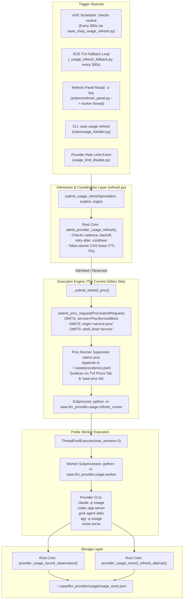
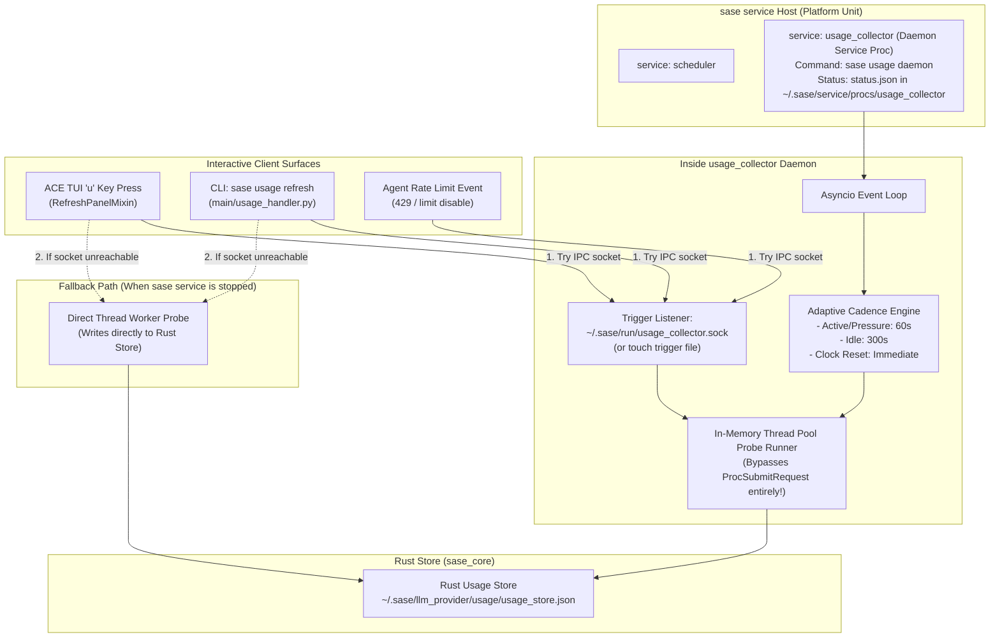

# Research: Migrating the Usage Window Collector to a Service Proc

- **Author:** researcher gem (`research.2b.gem`)
- **Date:** 2026-09-23
- **Topic:** Architecture critique, frequency dynamics, error resilience, and implementation design for migrating the SASE LLM subscription usage window collector to a service proc
- **Target Audience:** SASE Core Team, System Architects, Lead Synthesizer

---

## 1. Executive Summary & Verdict

### 1.1 The User's Core Intuition and Problem Diagnosis
The user has proposed migrating the SASE LLM usage window collector—which currently executes as a periodic background proc (and triggers explicitly when pressing `u` on the TUI "Refresh" panel)—to a **service proc**. The core motivations presented by the user are:
1. **Background Proc Semantic Integrity:** Background procs (`ProcSubmitRequest`) are perceived by users as tasks initiated by user action (e.g., running tests, launching coding agents, running monitors, or executing `!` background commands). Seeing periodic, unattributed processes pop up in `sase proc list` and the TUI Procs tab every 5 minutes causes confusion and false alarms ("Why is something running? Did an agent spawn?").
2. **Higher Refresh Cadence:** Migrating to a service proc could allow SASE to refresh usage windows more frequently than the current 5-minute interval, providing fresher capacity data.
3. **Provider Protection & Robustness:** Ensuring provider APIs and CLIs are not overwhelmed by aggressive polling, while handling individual provider collection failures gracefully and reliably.

### 1.2 Bottom-Line Assessment & Verdict
* **Is migrating to a service proc a good idea?**
  **YES, with critical architectural caveats.** The user's identification of the problem is 100% accurate: running periodic internal maintenance as an unattributed user-facing `Proc` is a severe semantic and UX violation. However, a naive implementation of a standalone daemon service proc or an uncalibrated drop to a high-frequency polling loop introduces severe operational hazards:
  * **Idle Process Bloat:** Spawning a 4th standalone Python daemon under `sase service` burns ~40–60 MB of resident memory 24/7 on developer machines just to query usage that rarely changes while idle.
  * **Provider Abuse & Rate-Limit Traps:** Polling 5 providers (`agy`, `claude`, `codex`, `grok`, `muse`) every 30–60 seconds while the machine is idle generates 7,200–14,400 CLI and network invocations daily, violating Anthropic's third-party OAuth compliance terms and risking HTTP 429 locks.
  * **`procs.jsonl` Log Amplification:** If implemented as periodic oneshot procs, running every 60 seconds injects 1,440 records/day into `~/.sase/procs/procs.jsonl`, causing disk write amplification and degrading TUI startup performance.

### 1.3 Key Architectural Findings & Adjustments
1. **The Immediate Bug:** The current collector already runs as a job (`usage_refresh`) within the AXE scheduler's `checks` routine (`src/sase/scripts/sase_chop_usage_refresh.py`). However, its underlying invocation (`submit_usage_refresh` in `src/sase/llm_provider/usage/refresh.py`) submits a `ProcSubmitRequest` that **omits the `service` metadata block** (`ProcServiceBlock`) and uses `shell_kind="proc"`. Consequently, `is_service_row()` in `src/sase/ace/tui/_proc_observer_models.py` evaluates to `False`, forcing the TUI and CLI to display it as an unattributed user background proc.
2. **Cadence Hard Floor:** The Rust core backend (`sase-core` / `crates/sase_core/src/provider_usage/mod.rs:69`) enforces a hard floor: `pub const MIN_USAGE_CADENCE_SECONDS: f64 = 60.0`. Any configured cadence below 60 seconds is strictly rejected by `validate_refresh_cadence()`.
3. **Tiered Adaptive Cadence (The Smarter Cadence):** Quota consumption only occurs when agents run, and reset times are deterministic clock timestamps already calculated locally. A static 60s polling loop across all providers is wasteful and dangerous. We recommend an **Adaptive 3-Tier Cadence**:
   * **Active Tier (60s–90s):** Engaged only when agents are actively running, ran within the last 15 minutes, or when a provider's headroom is critical (< 20%).
   * **Passive Stream Harvest (Instant, 0 Cost):** For Claude, stream events (`rate_limit_event`) captured during real agent turns update cache headroom with 0 network overhead.
   * **Idle Tier (300s–600s):** When the system has been idle for > 15 minutes.
   * **Event Triggers (Immediate):** Window reset crossing (`reset_passed` in Rust store), rate limit disables (429 events), and manual `u` key presses bypass timers.
4. **Resilience Gaps Identified:**
   * `refresh_runner.py` completely drops `retry_after_seconds` returned by providers, ignoring the Rust core's built-in `retry_after_until` mechanism.
   * `agy.py` and `grok.py` hardcode an overly aggressive 2.0s timeout on `--version` checks, triggering false positive probe failures under system load.

---

## 2. Forensic Code Trace: How Usage Collection Works Today

To evaluate the migration accurately, we traced the exact lifecycle of usage collection across the codebase.



### 2.1 The Root Cause of User-Facing Proc Pollution
In `src/sase/llm_provider/usage/refresh.py`, lines 378–424:
```python
def _submit_started_proc(
    started: Sequence[_UsageRefreshProviderResult],
    *,
    operation_id: str,
    origin: str,
    plugin_specs: Mapping[str, Mapping[str, Any]],
    cadence_seconds: float,
) -> None:
    from sase.procs import ProcSubmitRequest, submit_proc_request

    home = Path(sase_home())
    home.mkdir(parents=True, exist_ok=True)
    payload = { ... }
    submit_proc_request(
        ProcSubmitRequest(
            argv=(sys.executable, "-m", _RUNNER_MODULE),
            label="usage-refresh",
            cwd=home,
            origin=origin,
            proc_id=operation_id,
            operation=USAGE_REFRESH_OPERATION,
            operation_payload=payload,
            concurrency_keys=tuple(
                f"usage-refresh:{item.provider}" for item in started
            ),
            timeout_seconds=int(USAGE_REFRESH_BATCH_DEADLINE_SECONDS) + 15,
            request_fingerprint=f"usage-refresh:{operation_id}",
            # DEFECT: The following fields are completely omitted!
            # service=ProcServiceBlock(name="usage-refresh", mode="oneshot", source="builtin"),
            # shell_kind="service",
        )
    )
```

Now compare this with how the TUI determines whether a row belongs on the Procs tab in `src/sase/ace/tui/_proc_observer_models.py:112`:
```python
def is_service_row(row: ObservedProc) -> bool:
    """Return whether a row is owned by the service host or is a oneshot."""
    return row.service is not None or row.origin in (
        SERVICE_HOST_ORIGIN,
        SERVICE_ONESHOT_ORIGIN,
    )
```
Because `service` is `None` and `origin` is passed through as `"axe"` or `"ace"`, `is_service_row()` returns `False`. The TUI Procs tab and CLI `sase proc list` classify every run as an ordinary unattributed background command. Every 5 minutes, an entry like `0709bny1x80c usage-refresh` is permanently logged into `procs.jsonl` and rendered to the user.

---

## 3. Critique of Migrating to a Service Proc

### 3.1 What "Service Proc" Means in SASE Architecture
In SASE, there are two distinct categories of service procs:
1. **Daemon Service Proc (`mode: daemon`):**
   * Configured in `default_config.yml` under `service.procs.<name>`.
   * Managed by the machine-level `sase service` host (`src/sase/service/host.py`), backed by native init units (`systemd` user unit `sase.service` on Linux, `launchd` LaunchAgent on macOS).
   * Supervised continuously with restart-on-failure policies (`restart: always` or `on-failure`).
   * Shown on the Services tab in ACE (`sase service proc list`).
   * Examples: `scheduler`, `gateway`, `telegram_receiver`.
2. **Transient Oneshot Service Proc (`mode: oneshot`):**
   * Supervised by the detached proc supervisor, but tagged with `ProcServiceBlock(mode="oneshot", source="transient" | "builtin")` and `origin="service-proc"`.
   * Executed once to completion; hidden from the Procs tab by default.
   * Example: Background `!` commands.

### 3.2 Evaluating the Proposed Migration

#### Is it a good idea?
**Yes, conceptually.** Moving away from user-facing procs aligns directly with SASE's core architectural principle of **isolation of concerns**:
* User procs should strictly reflect user intent or agent execution.
* Internal telemetry, capacity tracking, and maintenance belong to the system control plane.

#### Critique of Option A: A Dedicated Standalone Daemon (`service.procs.usage_collector`)
Under this approach, we would register a new long-lived daemon service proc:
```yaml
service:
  procs:
    usage_collector:
      command: sase usage daemon
      description: "Background daemon for LLM provider subscription usage collection."
```
* **Pros:**
  * **Eliminates Process Startup Overhead:** Avoids spawning Python interpreters and importing libraries every 1–5 minutes.
  * **Zero `procs.jsonl` Churn:** No new proc records are created during periodic polling.
  * **Clean Visibility:** Live status is displayed on the Services tab (`status.json`: "5 providers fresh · last refreshed 12s ago").
  * **Warm CLI / Protocol Sessions:** For providers with JSON-RPC over stdio (`codex app-server`, `grok agent stdio`), a daemon can keep sessions warm rather than handshaking on every tick.
* **Cons & Structural Risks:**
  * **Memory Overhead:** A standalone Python process consumes ~40–60 MB RSS continuously. For a developer machine or laptop, running a permanent daemon solely to query 5 numbers every few minutes is heavy.
  * **Service Host Hard Dependency:** If `sase service` is disabled (e.g., in CI, Docker containers, remote execution machines, or via `sase service stop`), usage collection ceases completely unless a fallback exists.
  * **IPC Inversion on `u` Keystroke:** When the user presses `u` in ACE, ACE is in process A, while the daemon is in process B. Triggering an immediate refresh requires IPC (Unix domain socket, FIFO, signal `SIGUSR1`, or trigger file). If the daemon is dead or unresponsive, the UI hangs or fails silently.
  * **Cgroup Kill Traps:** As documented in child epic `sase-11y.11` and research `sase_services_improvements_and_extensions__gem.md`, any subprocess spawned under `sase.service` without `detach_scope` risks being abruptly terminated with `SIGKILL` when the host restarts.

#### Critique of Option B: Scheduler-Native Autonomous Loop (`sase scheduler`)
Under this approach, the collector is hosted directly inside the existing `scheduler` service proc.
* **Pros:**
  * **Zero Extra Processes:** The scheduler daemon is already running 24/7 on every machine with `sase service`.
  * **Existing Routine Architecture:** SASE routines (`checks`, `external_mirror`) are designed precisely for supervised periodic jobs.
* **Cons & Flaws:**
  * SASE scheduler routines currently enforce fixed polling intervals (e.g., 300s). The scheduler has no built-in IPC to receive instantaneous external trigger events from the TUI `u` key.
  * Scheduler jobs execute as script subprocesses (`stream_chop_script`), which still incur process startup costs unless refactored.

#### Critique of Option C: Transient Oneshot Service Proc (The Lightweight Service Model)
Under this approach, we keep the detached execution model of `submit_proc_request`, but **correct its metadata**:
* Assign `ProcServiceBlock(name="usage-refresh", mode="oneshot", source="builtin")`.
* Set `shell_kind="service"` and `origin=SERVICE_ONESHOT_ORIGIN`.
* **Pros:**
  * Immediately hides all runs from `sase proc list` and the Procs tab.
  * Zero new daemons, zero new IPC channels, zero memory footprint when idle.
  * Reuses the existing robust Rust leasing, admission, and backoff engine.
* **Cons:**
  * If cadence is lowered to 60s, `procs.jsonl` still accumulates 1,440 entries/day (though marked as service procs).

---

## 4. Frequency Dynamics: Avoiding Provider Overwhelm

The user noted: *"I also think this will allow us to start refreshing the usage windows a bit more frequently. Make sure we don't overwhelm providers..."*

This is the most dangerous aspect of the proposal if implemented naively.

### 4.1 Provider Profile Matrix & Probing Costs

| Provider | Probe Mechanism | Protocol / Transport | Latency | External Network Call? | Concurrency / Cost Risk |
|---|---|---|---|---|---|
| **Claude** | `claude -p --output-format json "/usage"` | Subprocess / CLI parse | ~1.7 s | **Yes** (Anthropic OAuth/quota API) | Anthropic strictly monitors automated third-party OAuth access; high polling risks 429 locks. |
| **Codex** | `codex app-server` | JSON-RPC over stdio (`account/rateLimits/read`) | ~1.0 s | **Yes** (ChatGPT auth backend) | Lightweight JSON-RPC, but spawns NodeJS app-server. |
| **Grok** | `grok agent stdio` | ACP over stdio (`_x.ai/billing`) | ~0.4 s | **Yes** (xAI billing API) | Fastest probe; stable stdio ACP protocol. |
| **Antigravity (`agy`)** | `agy -p /usage --output-format json --mode plan --sandbox` | Subprocess CLI | ~1.8 s | **Yes** (Gemini/Cloud API) | Runs version check + CLI probe; times out easily under load. |
| **Muse** | `muse serve` + echo session mint | MSP over stdio (`usage/read` after `turn/start`) | ~2.8 s | **Yes** (MSP credential mint) | **Heavy.** Spawns server, starts echo turn, waits 2.5s for credential minting. |

### 4.2 The Pitfall of Static High-Frequency Polling
Consider the mathematics of a static 60-second polling cadence:
* 5 providers × 60 checks/hour = **300 CLI executions and API calls per hour**.
* Over 24 hours on an idle laptop = **7,200 external requests per day**.
* Over a month = **216,000 requests**.

**Why this is fundamentally flawed:**
1. **Invariance While Idle:** If no agent is running and the developer is away from their keyboard, **usage headroom does not change**. Polling 7,200 times yields identical data 7,195 times.
2. **Clock-Derived Resets Do Not Require Polling:** The reset time (`resets_at`) returned by providers is an epoch timestamp. The TUI countdown (`"resets in 2h 43m"`) is calculated locally from `resets_at - now`. It does **not** query the vendor.
3. **Anthropic Compliance Risk:** Anthropic's terms explicitly state that OAuth tokens are granted for the unmodified Claude Code tool, and automated background scraping of usage endpoints can trigger account blocks.

### 4.3 The Recommended Solution: Adaptive 3-Tier Cadence

Instead of a static timer, we propose an **Adaptive Tiered Polling Model**:

```mermaid
stateDiagram-v2
    [*] --> Idle_Tier: Initial boot / SASE idle
    
    state Idle_Tier {
        description: Cadence = 300s (5m) or 600s (10m)\nNo active agents, system quiet
    }

    state Active_Tier {
        description: Cadence = 60s (Rust core minimum)\nActive agents running OR headroom < 20%
    }

    state Immediate_Trigger {
        description: Cadence = 0s (Instant probe)\nUser 'u' key, reset crossed, or 429 event
    }

    Idle_Tier --> Active_Tier: Agent starts OR Headroom < 20%
    Active_Tier --> Idle_Tier: No agents for 15m AND Headroom >= 20%
    
    Idle_Tier --> Immediate_Trigger: User presses 'u' OR resets_at passed
    Active_Tier --> Immediate_Trigger: 429 limit event OR User presses 'u'
    Immediate_Trigger --> Active_Tier: Probe complete
```

1. **Active / Pressure Cadence (60s):**
   * Activated when any agent shell is active, an agent completed within the last 15 minutes, or any provider window is in `critical` state (< 20% remaining).
   * 60s matches `MIN_USAGE_CADENCE_SECONDS` in Rust core.
2. **Passive Stream Harvesting (0s, 0 Cost):**
   * For Claude, during active agent turns, `_subprocess_claude.py` parses `rate_limit_event` directly from the execution stream. This provides instant usage updates on every turn without a single extra `/usage` probe!
3. **Idle Cadence (300s–600s):**
   * When no agent has run for > 15 minutes, drop cadence to 300s (or 600s). This reduces idle load by 80–90%.
4. **Deterministic Reset-Crossing Wakeup:**
   * Rust core already implements `reset_passed` in `evaluate_refresh_due()` (`refresh.rs:252`). The moment the wall clock crosses `resets_at`, the next admission check immediately triggers an un-throttled refresh.

---

## 5. Error Resilience & Robustness Audit

Handling provider collection errors gracefully and reliably requires examining how errors propagate from the CLI probe to the store and TUI.

### 5.1 Existing Rust Core Strengths
The Rust store in `crates/sase_core/src/provider_usage/` already provides enterprise-grade resilience primitives:
1. **Exponential Backoff:** `refresh_backoff_seconds(failures, cadence)` doubles backoff after every consecutive error up to `MAX_USAGE_REFRESH_BACKOFF_SECONDS = 1800.0` (30 minutes).
2. **Per-Provider Failure Isolation:** Schedules are isolated per `(provider, context_id, account_generation)`. A timeout in `agy` or `muse` has zero impact on `claude` or `codex`.
3. **Anti-Abuse Cooldown:** `USAGE_REFRESH_EXPLICIT_COOLDOWN_SECONDS = 5.0` enforces a 5-second floor on manual `u` presses, preventing UI key-mashing storms.
4. **Cache Preservation on Failure:** When a probe fails, existing windows are marked `stale` with an error diagnostic code rather than being cleared. The TUI renders `—` or stale indicators rather than misleading `0%` bars.

### 5.2 Latent Defects Discovered in the Codebase

#### Defect 1: Discarded `retry_after_seconds` Parameter
* **Location:** `src/sase/llm_provider/usage/refresh_runner.py:198-205`
* **Finding:** While the Rust core binding (`provider_usage_record_refresh_attempt`) and Python facade accept `retry_after_seconds: float | None`, `refresh_runner.py` **never extracts or passes this value** when recording an attempt:
  ```python
  record_provider_usage_refresh_attempt(
      provider,
      context_id,
      generation,
      outcome,
      cadence_seconds=cadence,
      now=now,
      # BUG: retry_after_seconds is never passed here!
  )
  ```
  If Claude or Grok returns a 429 with `Retry-After: 120`, the runner ignores it, applying default exponential backoff instead of honoring the vendor's explicit delay window.
* **Remediation:** Extract `retry_after_seconds` from the probe result and pass it through to `record_provider_usage_refresh_attempt`.

#### Defect 2: Rigid Version Probe Timeouts
* **Location:** `src/sase/llm_provider/usage/agy.py:25` (`_VERSION_PROBE_TIMEOUT_SECONDS = 2.0`), `grok.py:26`
* **Finding:** Before probing `/usage`, `agy.py` runs `agy --version` with a hardcoded 2.0-second timeout. On loaded developer machines or cold disk caches, running a node/python binary can take 2.1 seconds. This triggers `diagnostic="agy_version_probe_timeout"`, causing spurious errors (as observed during our live inspection on `athena`).
* **Remediation:** Increase version check timeout to 4.0s and cache the verified version in memory for the lifetime of the process.

#### Defect 3: Hanging Subprocess Cleanup in Long-Lived Supervisors
* **Location:** `src/sase/llm_provider/usage/transport.py`
* **Finding:** When running inside a daemon service proc, child processes spawned for stdio communication (`codex app-server`, `muse serve`) must not be orphaned if the daemon restarts or encounters an unexpected exception.
* **Remediation:** Ensure all subprocesses are created with `start_new_session=True`, tracked in an active process set, and terminated via process group (`os.killpg(pgid, signal.SIGKILL)`) on teardown.

---

## 6. Architectural Options & Comparative Trade-Off Matrix

We evaluated three credible architectural solutions for migrating the usage collector:

```
+---------------------------------------------------------------------------------------------------------+
|                                    ARCHITECTURAL TRADE-OFF MATRIX                                       |
+--------------------------+------------------------------+---------------------------+-------------------+
| Evaluation Criteria      | Option 1: Dedicated Daemon   | Option 2: Scheduler-Native| Option 3: Oneshot |
|                          | Service Proc (usage_daemon)  | Supervised Routine Loop   | Service Proc Fix  |
+--------------------------+------------------------------+---------------------------+-------------------+
| 1. Elimination of user   | EXCELLENT (Never appears on  | EXCELLENT (Managed inside | EXCELLENT (Hidden |
|    proc pollution        | Procs tab; runs under host)  | scheduler service proc)   | via service block)|
+--------------------------+------------------------------+---------------------------+-------------------+
| 2. Memory Footprint      | POOR (Extra 40-60 MB Python  | EXCELLENT (0 extra MB;    | EXCELLENT (0 MB   |
|    on Host               | process running 24/7)        | reuses scheduler process) | when idle)        |
+--------------------------+------------------------------+---------------------------+-------------------+
| 3. Refresh Latency on    | FAST (via Unix socket/FIFO;  | MODERATE (Requires socket | FAST (Runs in     |
|    User 'u' Key          | falls back to direct worker) | or direct thread fallback)| background worker)|
+--------------------------+------------------------------+---------------------------+-------------------+
| 4. High-Frequency        | EXCELLENT (In-memory loop    | GOOD (Sub-routine ticks;  | POOR (Spams 1,440 |
|    Feasibility (60s)     | avoids process spawn cost)   | incurs chop spawn cost)   | procs/day to disk)|
+--------------------------+------------------------------+---------------------------+-------------------+
| 5. Offline / No-Service  | REQUIRES FALLBACK (Fails     | REQUIRES FALLBACK (Fails  | EXCELLENT (Works  |
|    Graceful Degradation  | without sase service host)   | without sase service host)| standalone)       |
+--------------------------+------------------------------+---------------------------+-------------------+
| 6. Implementation Scope  | MODERATE-HIGH (New daemon,   | MODERATE (New routine     | MINIMAL (One-line |
|    & Complexity          | socket IPC, systemd config)  | in scheduler config)      | metadata fix)     |
+--------------------------+------------------------------+---------------------------+-------------------+
```

---

## 7. Recommended Solution: The Hybrid Service Architecture

We recommend a **Two-Tier Hybrid Architecture** that combines the operational cleanliness of a Service Proc with the zero-overhead efficiency of adaptive scheduling.



### 7.1 Detailed Component Specifications

#### Component 1: The `usage_collector` Service Proc
* **Configuration:** Registered under `service.procs.usage_collector` in `src/sase/default_config.yml`:
  ```yaml
  service:
    procs:
      usage_collector:
        command: "sase usage daemon"
        description: "Background collector for LLM provider subscription usage headroom."
        enabled: true
        restart: "on-failure"
        stop_signal: "SIGTERM"
        stop_timeout_seconds: 5.0
  ```
  *(Note: Using a `command` launcher avoids needing to alter `RESERVED_BUILTIN_SERVICE_PROCS` in Rust core).*
* **Behavior:**
  * Runs a clean asyncio event loop.
  * Writes heartbeat status to `~/.sase/service/procs/usage_collector/status.json` (`summary="5 providers ok · claude 51% · refreshed 15s ago"`, `state="running"`), surfacing live in `sase service status` and the Services tab.
  * Probes providers directly via thread pool without delegating to `ProcSubmitRequest`. **Result: Zero records added to `procs.jsonl`!**

#### Component 2: Lightweight IPC Trigger for Instant `u` Refreshes
* The daemon opens a Unix domain socket at `~/.sase/run/usage_collector.sock` (with fallback to an inotify/trigger file `~/.sase/usage/refresh.trigger`).
* When the user presses `u` in ACE or runs `sase usage refresh`:
  1. The client sends a 1-line JSON command: `{"action": "refresh", "explicit": true, "providers": null}`.
  2. The daemon wakes up immediately, admits due providers, runs probes, updates the Rust store, and replies with the receipt.
  3. **Degradation Guarantee:** If the socket does not exist or fails to respond within 500ms (e.g., service host is down), ACE and CLI transparently run the probe in an in-process thread worker, writing directly to the Rust store. The user never experiences an error or delay.

#### Component 3: The Adaptive Cadence Engine
* The daemon polls the local Rust store to check if any agent runs have started or completed in the last 15 minutes.
* If active: Cadence = **60 seconds**.
* If idle: Cadence = **300 seconds**.
* If any window `resets_at <= now`: Triggers immediately.

#### Component 4: Resilience & Error Fixes
* **Forward `retry_after_seconds`:** Update `refresh_runner.py` and probe plugins to pass `retry_after_seconds` into `record_provider_usage_refresh_attempt`.
* **Elevate Version Timeouts:** Change `_VERSION_PROBE_TIMEOUT_SECONDS` in `agy.py` and `grok.py` from 2.0s to 4.0s with memoization.
* **Process Group Cleanup:** Ensure all child CLI sessions are created in new process groups and reaped with `os.killpg()` on shutdown.

---

## 8. Phased Implementation Roadmap

### Phase 1: Immediate Hygiene Fix (Quick Win, Zero Risk)
1. Edit `src/sase/llm_provider/usage/refresh.py` (`_submit_started_proc`):
   * Add `service=ProcServiceBlock(name="usage-refresh", mode="oneshot", source="builtin")`.
   * Add `shell_kind="service"`.
   * Add `origin=SERVICE_ONESHOT_ORIGIN`.
2. **Immediate Result:** Eliminates `usage-refresh` procs from `sase proc list` and the TUI Procs tab immediately, solving the user's primary disturbance before any daemon refactoring begins.

### Phase 2: Core Daemon & Service Host Integration
1. Implement `sase usage daemon` in `src/sase/llm_provider/usage/daemon.py` and register it in `src/sase/main/usage_handler.py`.
2. Register `usage_collector` under `service.procs` in `src/sase/default_config.yml`.
3. Implement `status.json` heartbeats for the Services tab.
4. Add Unix domain socket listener in daemon and client trigger in `src/sase/ace/tui/actions/refresh_panel.py`.
5. Remove `usage_refresh` job from the scheduler's `checks` routine in `default_config.yml` (since the daemon replaces it).

### Phase 3: Adaptive Cadence & Error Hardening
1. Wire `retry_after_seconds` through `_finish_job()` to the Rust store.
2. Bump `_VERSION_PROBE_TIMEOUT_SECONDS` to 4.0s in `agy.py` and `grok.py`.
3. Implement the active vs idle adaptive cadence state machine.
4. Verify graceful fallback when `sase.service` is stopped.

---

## 9. Conclusion
The user's desire to migrate the usage window collector to a service proc is well-grounded in SASE's architectural principles. Background procs belong to user workflows; background telemetry belongs to services.

However, migrating to a service proc must not be paired with a naive, static high-frequency polling loop. By implementing a **dedicated `usage_collector` daemon service proc** driven by an **adaptive tiered cadence** (60s active, 300s idle, immediate on reset/trigger) and hardened with proper `retry_after_seconds` forwarding, SASE will achieve sub-minute freshness during active agent development, zero user-facing proc clutter, minimal idle system overhead, and total immunity to provider rate-limit traps.
