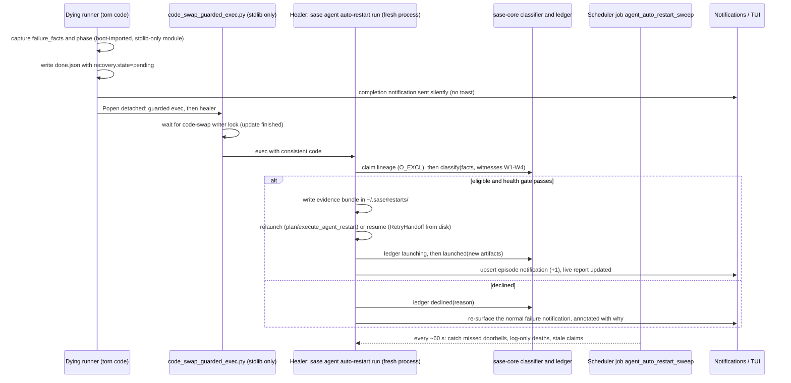

# Auto-Restarting Agents Broken by a Mid-Run sase Update: Research, Critique, and Design

- **Researcher:** cld (one of five in swarm `research.47`)
- **Date:** 2026-10-09
- **Trigger:**
  `ImportError: cannot import name 'auto_launch_prefix' from 'sase.monitor.continuation_delivery'`
  killed several agents after sase was updated while they were running.

---

## TL;DR

1. **Today's incident was not random code skew. It was a bug in the anti-skew mechanism.**
   - All four of today's failures crashed inside `refresh_runner_code_after_wait()`.
     That function exists to survive a code swap during a `%wait`.
   - It detects that sase's HEAD moved, and *then*, before its `os.execv`, it lazily
     imports modules from the new source tree.
   - The old in-memory function asked the new on-disk module for a symbol that commit
     `9fd8a081f4` had just deleted.
   - A small fix (re-exec first, reconcile after) would have prevented all four. Ship it
     no matter what else is decided.
2. **The broader problem is real and recurring.**
   - Since July, **43 of the 905 failed agents on athena (~4.8%) died from code-swap
     skew**, about 3.5 a week.
   - `sase dev update` ran **32 times in the last 4 days**: 6, 5, 16 and 5 per day.
   - Every long-lived agent is exposed.
3. **Auto-restart is a good idea as a safety net, but not as literally specified.**
   - **21 of the 43 skew failures happened *after* the agent's model turn had finished**:
     in finalizers, successor spawn, or plan handoff.
   - For those, `,x` + resubmit would throw away finished but uncommitted work sitting
     in the held workspace. It would also pay for the whole run again, and could
     double-commit.
   - Recovery has to depend on the phase in which the agent died.
4. **Recommended design, in one paragraph:**
   - **Who:** an out-of-process healer, so recovery never runs inside the broken
     interpreter.
     - The dying runner wakes it through the existing `code_swap_guarded_exec.py`
       bootstrap, which waits for an in-flight `sase dev update` to finish.
     - A scheduler job backstops it.
   - **What triggers it:** a **two-signal classifier**: a known skew signature **and** an
     independent witness that sase's code moved during the agent's lifetime.
   - **Exactly once:** a durable **at-most-once ledger** keyed by the agent's lineage
     root.
   - **When:** only after a health gate confirms the install is coherent and quiescent.
   - **How:**
     - **Relaunch** (true `,x` semantics, with forced name reuse) for agents that died
       before their model turn.
     - **Resume in place** for agents that died after it.
   - **What you see:** **one grouped, live-updating notification per update episode**,
     plus an amber `RESTARTING ↻` state in the TUI instead of a red `FAILED`.
5. **Structural fix (separate track): pin each process to an immutable release.**
   - Each process would import from a per-revision release directory chosen when it
     starts. That makes "update while agents run" safe by construction.
   - Auto-restart then remains only for the residual cross-process data-format skew.

---

## 1. What Actually Happened Today

### 1.1 Timeline

Reconstructed from `~/.sase/workflows/202610/*_ace-run-261009_*.txt` runner logs and
`~/.sase/logs/dev_update.jsonl`.

| Time (EDT) | Event |
| --- | --- |
| 11:49:45 | Commit `9fd8a081f4` ("feat(autonomy): structural inheritance of live record…") deletes `auto_launch_prefix` from `sase/monitor/continuation_delivery.py`. |
| 11:53:16 | `sase dev update` fast-forwards the primary checkout `d7c4958 → 9fd8a08`. The journal records sase `updated`, all plugins and `sase-core-rs` `already current`. |
| ~11:57 → ~12:40 | Four `%wait` agents see their dependencies resolve. Each prints `Refreshing sase runner code after dependency wait: <old> -> 9fd8a081…` and dies with the ImportError. The agents had booted on `9c5000f` or `d7c4958`; one of them had been waiting for 4.5 hours. |

**No LLM work was lost.** All four were still parked in `%wait`, so none had started its
provider turn. For these four, `,x` + resubmit is exactly the right recovery.

### 1.2 Mechanism

- **Every process imports from the live checkouts.** The global `sase` is a uv tool
  whose `.pth` files are plain paths into those checkouts:
  - `_editable_impl_sase.pth` → `~/projects/github/sase-org/sase/src`
  - `sase-github`, `sase-telegram` and `sase-research-artifacts` work the same way.
  - Even `sase_core_rs.pth` → `~/projects/github/sase-org/sase-core/crates/sase_core_py/python`.
- **So the code a process sees depends on when it imported it.**
  - Modules imported at boot keep the old revision for the life of the process.
  - Any deferred, function-local import reads the new source.
  - The result is old callers bound to new callees.

### 1.3 The Irony

- `src/sase/axe/run_agent_runner_refresh.py:137` (`refresh_runner_code_after_wait`)
  runs in this order:
  1. It confirms HEAD moved.
  2. It calls `_reconcile_prompt_with_live_auto_state()` (line 95).
  3. That function's local imports (lines 115–121) load **new** modules.
  4. Only then does it reach `os.execv`.
- In the old in-memory version of that function, the import list still included
  `auto_launch_prefix`, so it crashed before reaching the `execv` that would have made
  everything consistent.
- **The traceback gives this away.** It prints the *new* on-disk source at the failing
  line numbers, because `linecache` re-reads the file. Line 121 shows
  `from sase.macro._directive_edit_core import set_prompt_directive`, not the statement
  that actually failed.
- **Current HEAD still has the same shape.** Function-local imports still run between
  "HEAD moved" and `execv`:
  - lines 115–121
  - line 153 (`read_local_macros_path`)
  - the local-macros and planned-name helpers

---

## 2. How Big Is the Problem? (athena Corpus)

### 2.1 Method

- I scanned every failed `done.json` under `~/.sase/projects/*/artifacts/`, plus every
  `FAILED` row archived in `~/.sase/dismissed_bundles/` (2026-07 → today). That is 905
  failed agents.
- I matched skew signatures over `error` + `traceback`, de-duplicated the matches, and
  bucketed each one by lifecycle phase from its traceback frames.

### 2.2 Skew Signatures That Reached a Failure Record

| Signature family | Count | Examples |
| --- | ---: | --- |
| `ImportError: cannot import name 'X' from 'sase.…' (<path in installed checkout>)` | 30 | `spawn_agent_session_successor` from `sase.agent.detached_child` (×5, 09-24); `normalize_pr_origin` from `sase.ace.patch.models` (×5, 08-10); `reauthor_capacity_multiplier_for_prefix` (×4); `auto_launch_prefix` (today) |
| Rust wire skew: `… wire schema mismatch: got N, expected M`, `… wire is stale: expected N, got M` | 8 | `agent scan wire schema mismatch: got 10, expected 9` (×3, 09-25) |
| Data-format skew: `… was written by a newer or unknown sase version` | 3 | SDD store record (07-13) |
| `No module named 'sase.…'` | 2 | `sase.agent.launch_executor`, `sase.llm_provider._plan_utils` |
| `cannot import name … from partially initialized module 'sase.…'` | 1 | `sase.workspace_provider.occupant` |
| Signature-mismatch `TypeError` / `AttributeError` | 2 | `wait_for_gate() got an unexpected keyword argument 'on_poll'` |

### 2.3 Log-Only Signatures

These appear in raw runner logs, but not always in `done.json`:

- `sase_core_rs is importable but does not expose binding 'X'; the installed wheel is stale`
- `ModuleNotFoundError: No module named 'sase_core_rs'`
- `cannot import name 'sase_core_rs' from partially initialized module 'sase_core_rs'`

All three mean the Rust wheel was being reinstalled at that moment.

Treat log-only counts as upper bounds. Runner logs can also contain tool output that an
agent echoed into them.

### 2.4 Phase Split of the 43 De-Duplicated Skew Failures

| Phase | Count | What a fresh `,x` relaunch would do |
| --- | ---: | --- |
| Pre-provider (bootstrap, wait-refresh, workspace prep) | 14 | Correct; nothing to lose |
| **Post-provider** (inside `invoke_agent` after the provider exited, finalizers, successor spawn) | **17** | **Redo finished work and strand the original diff** |
| Plan handoff (`handle_plan_marker` / `handle_accepted_plan`) | 4 | Re-plan an existing plan |
| Workflow python steps (`setup`, `resolve`, `launch_split_agents`) | 3 | Usually fine |
| Unclassified | 5 | — |

### 2.5 Failures That Are Not Skew

The most common failures overall are not skew, and must **never** trigger an automatic
restart:

| Failure | Count |
| --- | ---: |
| `Error running LLM provider command (exit code 1)` | 105 |
| Commit finalizer `uncommitted changes remain` / `dirty work vanished` | ~90 |
| `Failed to prepare workspace` | 47 (plus many linked-repo materialization failures) |
| `%queue capacity…` directive errors | 21 |
| `No space left on device` | — |
| `reentrant call inside <_io.BufferedWriter>` | — |

---

## 3. What Already Exists (Reuse Inventory)

The codebase already contains most of the pieces. The design below mostly composes them.

| Existing piece | Location | Relevance |
| --- | --- | --- |
| Import preload + `code_swap_explanation(exc)` two-signal classifier (ImportError/AttributeError in the cause chain **and** the source revision moved) | `src/sase/axe/source_skew.py` | The right idea, but only wired into the accepted-plan path. The preload covers only `sase.sdd`, `sase.bead` and three modules. |
| Startup code identity | `run_agent_runner.py:79` (`_STARTUP_CODE_IDENTITY`) | Computed but **not persisted**. An external healer can't see it today. |
| Re-exec after `%wait` when HEAD moved | `run_agent_runner_refresh.py` | Today's bug site. Fix it (see §10, P0). |
| Code-swap writer lock, advisory reader registry, and the `code_swap_guarded_exec.py` bootstrap. The bootstrap is "executed by filename, not as a package import", waits for the swap, then execs a fresh command. | `src/sase/dev_update/code_swap_lock.py`, `code_swap_guarded_exec.py` | The ideal doorbell: start the healer only after the update finishes, in a fresh interpreter. |
| Dev-update journal: timestamp plus per-root `old_version → new_version` | `~/.sase/logs/dev_update.jsonl` (`dev_update/journal.py`) | Independent witness that code moved between an agent's boot and its failure. |
| `llm_provider.retry.sase` entry: `"uses a format this process does not understand"`, with `preserve_workspace: true` and `spawn_new_agent: true` | `default_config.yml:1770` | Shows the authors already decided late failures should **inherit the workspace**, not start over. But it runs in the torn process, sees only exec-loop errors, and matches prose `str(exc)`. |
| Spawn-on-retry: `RetryHandoff`, a `#fork:<name>` resume prompt, workspace-claim transfer, and lineage fields (`retry_of_timestamp`, `retry_attempt`, `retry_chain_root_timestamp`, `retried_as_timestamp`, `retry_error_category`) | `run_agent_retry_spawn.py:267`, `run_agent_exec_retry.py:261` | The "resume in place" mode, once it can be built from disk instead of in-memory state. |
| `sase agent restart`: headless kill/dismiss, **forced name reuse**, relaunch from `~`, recovery bundle in `~/.sase/restarts/` | `src/sase/agent/restart.py`, `_restart_planning.py`, `_restart_execute.py` | The headless twin of `,x`. Already used by the provider drain. |
| Provider drain: detect a pattern in `done.json`, relaunch many agents, send one enriched notification | `src/sase/agent/provider_drain.py`, `_drain_selection.py`, `agents/_drain_render.py`, `notifications/senders.py:257` | Closest precedent for this whole feature. |
| `upsert_notification` with a `(sender, dedup_key)` +1 trail and `supersedes`; `ViewReport` structured reports with a **live** `report_path` plus an embedded snapshot | `notifications/store.py:200`, `docs/notifications.md` "Report Notifications" | Supports one notification per update episode that updates itself. |
| ↻ visual vocabulary: `↻N` attempts, an `attempt #N` header, `↻ code changed`, the `↻ Restart available` toast | `_agent_list_helpers.py`, `_agent_display_header_metadata_identity.py`, `update_panel_state.py` | Reuse the same glyph and colors. |

---

## 4. Critique: Is This a Good Idea?

**Verdict: yes, build it, but as the second line of defense, and not literally as
specified.** It turns a recurring manual chore (`,x`, `<ctrl+g><enter>`, repeated per
agent and per update) into something the system handles. For pre-provider failures that
recovery is provably safe. Six problems with the literal plan follow.

1. **It treats a symptom whose cause is cheap to remove.**
   - Today's incident was one specific bug, and the general cause (live editable source)
     has a known structural fix (§10).
   - An auto-restarter that silently absorbs skew makes the underlying problem invisible.
     It needs telemetry and an honest notification, and prevention has to stay on the
     roadmap.
2. **`,x` semantics are wrong for about half of the real cases (21/43).**
   - After the model turn, the held workspace contains finished but uncommitted work.
   - A fresh relaunch claims a *new* workspace from origin and re-does the work. That can
     mean hours of xhigh model time spent twice.
   - The dismissal that precedes the relaunch releases the old workspace, stranding the
     original diff.
   - In finalizer-stage crashes a commit may already exist, so the relaunch can create
     duplicate commits or conflicting PRs.
   - The existing `llm_provider.retry.sase` config (`preserve_workspace: true`) already
     encodes the opposite choice.
3. **Matching prose is brittle, and a pattern alone is not evidence.**
   - `cannot import name 'X' from 'sase.Y'` is also exactly what a genuine bug on master
     looks like. Restarting it just fails again and burns the one attempt.
   - The classifier needs a second, independent witness that the code moved during the
     agent's life.
4. **The healer must not live in the dying process.**
   - The obvious hook is to add `cannot import name` to `llm_provider.retry`
     `error_patterns`.
   - But that runs restart code lazily imported into the torn interpreter. For example,
     `spawn_retry_agent` lazily imports `sase.agent.detached_child`, which is literally
     the module that broke five agents on 09-24.
   - The most common skew site (runner-level wait refresh) never reaches
     `handle_workflow_error` at all.
5. **Restarting too early hits the half-updated tree again.**
   - `sase dev update` has several steps: fetch/merge per root, reconcile, Rust
     prebuild/verify.
   - An immediate relaunch can boot into a half-updated tree. The `sase_core_rs`
     "partially initialized" and "stale wheel" signatures show this happening, and it
     wastes the one allowed attempt.
6. **Notification storms and misleading severity.**
   - One update can break N agents over hours; today it was four over ~45 minutes.
     N red "failed" toasts followed by N "restarted" toasts is noise.
   - Today's toast heuristic marks any row whose first note contains "fail" or "error"
     as an error (`_toasts.py:109`).
   - It also labels every `ViewErrorReport` row "Axe:" (`_toasts.py:270`), so a failed
     user agent already shows up as an "Axe error".

### 4.1 Further Constraints the Design Must Respect

- **Dependency graphs.**
  - On dismissal, agents waiting on the dismissed one are only released when that
    dependency *succeeded* (`_resolve_waiters_before_artifact_delete` in
    `ace/tui/actions/agents/_killing_utils.py`).
  - The replacement must therefore take the **same name**, so `%wait:<name>` waiters
    bind to it.
- **User intent wins.** Never auto-recover an agent the user killed, dismissed, or is
  editing via `,x` at that moment.
- **Exactly-once must survive crashes** of the healer itself.

---

## 5. Requirement Adjustments (Explicit)

| # | Your requirement | Adjusted requirement | Why |
| --- | --- | --- | --- |
| A1 | "Restart exactly once" | **At most one automatic restart per agent lineage**, enforced by a durable claim keyed by the lineage root. If the replacement fails again, report it and never retry it. | True exactly-once is impossible across crashes without risking duplicates. At-most-once plus escalation is the safe reading of your intent. |
| A2 | "Dismiss + relaunch like `,x`, submit the prompt unmodified" | **Recovery depends on phase** (§7):<br>• Died **before** the model turn: `,x` semantics, but always **force name reuse** (as `sase agent restart` does), even when the prompt has no `%id`.<br>• Died **after** the model turn: **resume in place**. Fork the chat into a short continuation turn in the held workspace instead of starting over.<br>• Risky or unknown phase: don't act; send a one-tap gate. | Fresh relaunch is right for 14 of 43 cases and harmful for ~21. Name reuse keeps waiters and bead claims intact. |
| A3 | "Detect error patterns" | **Signature + witness.** A match against a curated catalog (§6) **and** independent evidence that sase's code changed between the agent's boot and its failure. | Rules out real bugs on master, which look identical. |
| A4 | *(new)* | **Quiescence and health gate.** Relaunch only after any in-flight `sase dev update` has finished and a fresh interpreter can import the failing symbol or binding. | Otherwise the single attempt is burned on a half-updated tree. |
| A5 | "Excellent, thorough notification per restart" | **One grouped notification per update episode**, with a live report and one +1 entry per agent. Agents under recovery send their failure notification **silently** (no toast). Escalate with a normal failure notification if recovery declines or fails. | It reads as one story ("an update broke 4 agents; sase restarted them") instead of eight alarms. |
| A6 | *(new)* | **Prevention ships first**: the refresh-path fix plus a regression test that fails if anything is imported between the HEAD check and `execv`. Release pinning is the structural follow-up. | It prevents 100% of today's incident at near-zero cost. |
| A7 | *(new)* | **Respect user intent and give a kill switch.** Skip agents that are killed, user-dismissed, currently being `,x`-edited, holding a question or gate, or refused by the restart planner. Add a storm breaker and a config switch. | Automation must never fight the user. |
| A8 | *(new)* | **Keep the evidence.** Forced name reuse wipes the failed run's artifact directory, so copy `error_report.md`, `done.json`, the runner-log tail and the prompt into the `~/.sase/restarts/<stamp>-<name>/` bundle. Link it from the replacement and from the notification. | You should always be able to see *why* sase restarted something. |

---

## 6. Which Error Patterns to Match

### 6.1 Principles

1. **Prefer structured facts over prose.**
   - At failure time the runner holds the live exception object. Persist a
     `failure_facts` block in `done.json`:
     - the exception type chain
     - `ImportError.name` / `.path`
     - the missing attribute or symbol
     - the file of the last traceback frame
     - the lifecycle phase (§7)
   - Regexes are only a fallback, for legacy rows and for log-only deaths ("Runner
     exited without recording an error…").
2. **Scope by origin.**
   - The missing module or symbol must belong to a **managed distribution**: one that
     `sase dev update` swaps (`sase`, the editable plugins, `sase_core_rs`).
   - Its path must resolve under that distribution's installed root, **not** the
     agent's workspace checkout.
   - Agents working on the sase repo itself constantly produce ImportErrors from
     *workspace* code while running tests. Those must never match.
3. **Two signals, always:** a signature **and** a witness (§6.4).
4. **Stable tokens for future guards.**
   - Add a typed `NewerFormatError`, or a stable `[sase:format-skew]` token in the
     message, for every "this data was written by a newer process" refusal.
   - New guards are then matched by type rather than by wording.

### 6.2 Signature Catalog

| Tier | ID | Signature | Corpus hits | Action when witnessed |
| --- | --- | --- | ---: | --- |
| **1: Torn Python code** | T1a | `ImportError: cannot import name '<sym>' from '<managed mod>' (<path under managed root>)` | 30 | Auto-recover. **Provable:** `<sym>` is defined in `<relpath>` at the boot revision and absent at HEAD (`git show <boot>:<relpath>` versus the working tree). |
| | T1b | `ModuleNotFoundError: No module named '<managed mod>'` | 2 | Auto-recover. Provable with `git cat-file -e <boot>:<relpath>` versus HEAD. |
| | T1c | `AttributeError: module '<managed mod>' has no attribute '<x>'` | rare | Auto-recover; same proof technique. |
| | T1d | `cannot import name '<sym>' from partially initialized module '<managed mod>'` | 1 (+23 in logs) | Auto-recover **only if** the same import now succeeds in a fresh interpreter (W4). Otherwise it is a real circular-import bug. |
| | T1e | `SyntaxError` / `IndentationError` whose filename is under a managed root | — | Auto-recover if the file now compiles: it was read mid-checkout. |
| **2: Rust binding/wire skew** | T2a | `sase_core_rs is importable but does not expose binding '<x>'; the installed wheel is stale` | ≥9 in logs | Auto-recover **after the health gate**: a fresh interpreter has `sase_core_rs.<x>`. |
| | T2b | `<x> wire schema mismatch: got N, expected M` / `<x> wire is stale: expected N, got M` | 8 | Auto-recover after the health gate: the Python expectation equals the Rust value in a fresh interpreter. |
| | T2c | `No module named 'sase_core_rs'` / `cannot import name 'sase_core_rs' from partially initialized module 'sase_core_rs'` | 19 in logs | Auto-recover after the health gate: the import succeeds. |
| **3: Cross-process data-format skew** | T3a | `… was written by a newer or unknown sase version` | 3 | Auto-recover with W1 or W2. |
| | T3b | `uses a format this process does not understand` | (in config) | Auto-recover; fold the `llm_provider.retry.sase` entry into this feature. |
| **4: Usually a real bug** | T4a | `TypeError: <f>() got an unexpected keyword argument` / `missing N required positional argument` / `takes N positional arguments but M were given`, where the callee's file is under a managed root | 1 | **v2 only.** Auto-recover only if `git diff <boot>..HEAD` touches the callee's file. Otherwise decline. |
| | T4b | `NameError` inside a managed module | 2 | Never auto-recover. Annotate only. |

### 6.3 Explicitly Never Restart

| Failure | Why not |
| --- | --- |
| Provider exits and usage limits | Owned by `llm_provider.retry` and the provider drain |
| Commit-finalizer failures | Restarting would duplicate work |
| Workspace or linked-repo materialization failures | Environmental; a separate feature could own them |
| Directive errors (`%queue capacity…`, `%name … renamed`) | Deterministic: the same prompt fails again |
| `No space left on device` | Restarting cannot fix it |
| Killed agents | User intent |
| "Runner exited without recording an error" with no signature in the log tail | No evidence of skew |

### 6.4 Witnesses

Record which witness fired; it goes into the notification's "why".

| ID | Witness | Cost |
| --- | --- | --- |
| W1 | **Boot fingerprint.** The runner persists `code_identity = {sase: <sha>, plugins: {…}, core: <version>}` and `booted_at` into `agent_meta.json`, and the current identity differs. | Trivial: `_STARTUP_CODE_IDENTITY` already exists. |
| W2 | **Dev-update journal.** An `updated` outcome for the owning root, with a timestamp between boot and failure. | Trivial. Also catches agents whose boot fingerprint is missing. |
| W3 | **File-level proof.** The named symbol, module or file differs between the boot revision and HEAD. | One `git show` per failure. Strongest evidence. |
| W4 | **Live probe.** The same import or binding succeeds in a fresh interpreter *now*. This doubles as the health gate. | ~0.3–1 s per failure. |

### 6.5 Rules

| Tier | Auto-recover when |
| --- | --- |
| 1 | signature ∧ (W1 ∨ W2) ∧ W4 (W3 strengthens the "why") |
| 2 | signature ∧ W4, after quiescence |
| 3 | signature ∧ (W1 ∨ W2) |
| 4 | Decline in v1 |

### 6.6 Where It Lives

- Implement the classifier as a **pure function in sase-core**, per the Rust-boundary
  rule: `classify_agent_failure(facts, witnesses) -> RecoveryVerdict { tier, signature, mode, reason, witnesses }`.
- The TUI, the mobile bridge, `sase agent list`, the healer and the scheduler job must
  all show the same verdict and the same "why" text.

---

## 7. Recovery Mode by Phase

- **Make the phase exact.** The runner should write a phase breadcrumb (into
  `agent_meta.json` or `workflow_state.json`) as it crosses each boundary:
  `booting → waiting → preparing → provider_running → provider_done → finalizing → completing`.
- This is exact and cheap, and it replaces the traceback-frame heuristics I had to use
  for §2.

| Phase at death | Mode | Behavior |
| --- | --- | --- |
| `booting` (runner import or argv; often no `done.json`, only a log tail) | **Relaunch** | `,x` semantics: same `raw_prompt.md`, forced name reuse, fresh workspace, launched from `~` |
| `waiting` / `preparing` (all four of today's failures) | **Relaunch** | Same as above. `%wait` directives re-resolve and pass immediately when their dependencies are done. |
| Workflow step with no completed side-effecting step | **Relaunch** | — |
| `provider_done` / `finalizing` / `completing` | **Resume in place** | A child turn inherits the held workspace and its claim, forks the chat (`#fork:<name>`), and gets a nudge such as: *"Your previous turn finished, but sase crashed while finalizing it because sase was updated mid-run. Your workspace changes are intact. Do not redo the work: verify the workspace state and resubmit your final declaration."* This is the existing spawn-on-retry design, rebuilt from disk (`RetryHandoff.from_artifacts(dir)`) so it can run in the healer. |
| Plan handoff, `provider_running` (the runner died mid-turn), an open question or gate, or a known pushed commit | **Ask** | A one-tap gate with options "Resume", "Relaunch fresh" and "Leave it" |

---

## 8. Architecture



### 8.1 Components

1. **Boot fingerprint and phase breadcrumbs** (runner). Persist `code_identity` and
   `booted_at` (W1), and update the phase as the runner crosses each boundary.
2. **Failure facts** (runner).
   - Extend `record_runner_error` (`run_agent_runner_errors.py:29`), the loop-level
     failure writer, and `handle_workflow_error` to write `failure_facts`.
   - The facts module must be **imported at boot and depend only on the stdlib**, so the
     failure path never performs a lazy import itself.
3. **Doorbell** (runner).
   - If the facts look skew-shaped, set `recovery.state = "pending"` in `done.json` and
     send the completion notification with `silent=True`.
   - Then `Popen` the stdlib-only `code_swap_guarded_exec.py` bootstrap, detached, with
     the command `sase agent auto-restart run -a <artifacts_dir>`.
   - The bootstrap blocks until any `sase dev update` has released the writer lock, then
     execs a **fresh** interpreter.
   - That is quiescence for free, plus a guarantee that the healer never runs torn code.
4. **Healer** (`sase agent auto-restart run`). Each step:
   1. **claim** the ledger entry
   2. **classify**, via the core verdict
   3. **health gate**, via the W4 probe; if it fails, mark `deferred` and let the
      sweeper retry
   4. **plan**, through `plan_agent_restart`, whose refusals become decline reasons
   5. **bundle evidence**
   6. **execute** the relaunch or resume
   7. **record** the outcome in the ledger
   8. **notify**
5. **Sweeper** (scheduler job `agent_auto_restart_sweep`, on a ~60 s routine).
   - Scans the last 24 hours of failed rows, including log-only deaths, through the
     artifact index.
   - Heals anything the doorbell missed.
   - Resolves stale claims.
   - Escalates any `pending` row whose healer died by re-surfacing its failure
     notification, so nothing is silently swallowed.
6. **Ledger** (Rust-owned record in `~/.sase/agent_auto_restart/`).
   - Key: the lineage root, i.e. `retry_chain_root_timestamp`, or the agent's own
     timestamp.
   - States: `claimed → declined | deferred | launching(planned_name, plan_digest) → launched(new_artifacts) → settled(ok | failed)`.
   - The replacement carries `auto_restart_of` and `auto_restart_root` in its
     `agent_meta`. If it later fails, the lookup finds the existing ledger entry, and
     there is no second attempt.
   - **Crash-safety rule:** if the healer dies in the `launching` state, the sweeper
     *adopts* any agent with `planned_name` whose artifacts are newer than the claim. It
     never re-launches, because forced name reuse would wipe the just-launched
     replacement.
7. **Ordering.** Restart dependencies before dependents (topological over `%wait`
   names). Otherwise go least-progress-first, as the drain does.
8. **Storm breaker.** Stop auto-acting and send one "auto-restart paused" notification if
   either limit is exceeded:
   - more than `max_per_episode` restarts (default 12)
   - more than `max_per_30m` restarts (default 20)

   Mass breakage is more likely a real bug on master than skew.
   `sase agent auto-restart resume` re-arms it.
9. **Skips** (become decline reasons):
   - killed agents
   - agents present in `dismissed_agents.json`
   - an active relaunch-cleanup barrier or name reservation (the user is `,x`-ing it)
   - a pending question or gate
   - monitor and gate turns (in v1)
   - `plan_agent_restart` refusals (multi-segment or fan-out prompts, containers, a
     hard-disabled provider)

### 8.2 Code Placement (Rust-Boundary Rule)

| Lives in | What |
| --- | --- |
| **sase-core (Rust)** | `failure_facts` wire; `classify_agent_failure` (catalog, tiers, phase-to-mode); ledger record wire and state machine; episode-id derivation; status projection, so `RESTARTING` / `↻ restarted` look identical in the TUI, mobile and CLI |
| **sase (Python)** | Fact capture in the runner; doorbell; healer orchestration (reusing `sase agent restart` and the retry-spawn machinery); notifications; TUI presentation; scheduler job; CLI |

---

## 9. UX Design: Intuitive, Reliable, Beautiful

**Mental model, in one sentence:** *If a sase update breaks a running agent, sase puts
it back, once, and tells you exactly what it did and why.*

### 9.1 Agents Tab

- **While recovery is pending or deferred**, the row shows an amber `RESTARTING ↻`
  instead of a red `FAILED`, with a dim hint:
  `sase updated d7c4958 → 9fd8a08` or `↻ waiting for sase update to finish`.
  No red flash for something the system is handling.
- **After a relaunch**, the old row disappears (exactly as with `,x`). The replacement
  appears under the **same name** with a `↻` chip, reusing the existing `↻N` fragment
  style. Its identity header gains one line:

  ```
  ↻ Auto-restarted after sase update d7c4958 → 9fd8a08
    was: ImportError — cannot import name 'auto_launch_prefix' (sase.monitor.continuation_delivery)
    failed 12:03 while its %wait refreshed · before its model turn · nothing lost
  ```

  A key on that line opens the original `error_report.md` from the evidence bundle.
- **After a resume**, the replacement header reads `↻ Resumed in workspace #3 after sase
  update … · original turn's changes kept`.
- **When recovery is declined**, the row shows a normal `FAILED` plus a single dim reason,
  such as one of these:
  - `auto-restart skipped — already restarted once`
  - `— no sase update during this run (looks like a real bug)`
  - `— killed by you`
- **No new keymap is needed in v1**: `,x` stays the manual path. Update the help modal to
  mention the behavior.

### 9.2 The Notification

There is one row per **update episode**.

| Field | Value |
| --- | --- |
| Sender | `agent-auto-restart` |
| Icon | `↻` |
| Tags | `sase-update`, `auto-restart` |
| `dedup_key` | `agent-auto-restart:<episode>`, where the episode is the target revision set, e.g. `sase@9fd8a08` |
| Upsert behavior | Later agents in the same episode add a +1 entry and refresh the title |
| Action | `ViewReport`, with a **live** `report_path` (`~/.sase/agent_auto_restart/episodes/<episode>.json`) plus an embedded snapshot |
| Files | Each agent's original `error_report.md`, from the evidence bundle |

`notes` for today's incident would read:

```
↻ Restarted 4 agents after sase update d7c4958 → 9fd8a08
sase was updated at 11:53 ("feat(autonomy): structural inheritance of live record…") while these agents were running; their in-memory code no longer matched the files on disk.
• research.46.final — broke 12:03 refreshing after its %wait (ImportError: auto_launch_prefix) → relaunched, ws #3
• toobig-7h.test_justfile_lint.0 — broke 12:40 refreshing after its %wait → relaunched, ws #5
• … 2 more
Nothing was lost: all 4 broke before their model turn started.
Each agent gets one automatic restart; if one breaks again you'll get a normal failure notification.
```

The report document uses only existing `ChopReport` blocks:

- **headline** (tone `ok`): `4 agents restarted · 0 left alone`
- **kv**:
  - Update: `d7c4958 → 9fd8a08`
  - When: `11:53`
  - Commit: the subject line
  - Roots changed: `sase`
  - Witness: `dev-update journal + boot fingerprint`
- **rows**: `Agent | Broke during | Signature | Action | Now`. The **Now** column is
  live (RUNNING / DONE / FAILED) because the report is a live `report_path` the healer
  and sweeper keep fresh.
- **bullets**: "Left alone", each with a reason, e.g.
  `foo.bar — you killed it`, `baz — already restarted once (lineage 20261009080616)`.
- **text**: "Why this happened", two sentences in plain English, without jargon.
- **divider**, then a dim **text**: "Prevention: see release pinning (§10)."

Single-agent episodes read `↻ Restarted research.46.final after sase update 9fd8a08`.
Resumes read `↻ Resumed …`.

**Toast and severity rules:**

- Exactly **one toast per episode** (`↻ sase update: restarted 4 agents`), at
  *information* severity.
- Keep "fail" and "error" out of `notes[0]` on success rows, because of the keyword
  heuristic in `_toasts.py`.
- The agents' own failure notifications were written silently and are superseded by the
  episode row, so the inbox tells one story.

**Escalations,** which go to the Errors tab via `ViewErrorReport`:

| Situation | Title |
| --- | --- |
| Recovery declined or failed | `Couldn't restart research.46.final automatically — <reason>. Press ,x on it to retry by hand.` |
| The replacement broke again | The normal failure notification, plus `This was its automatic restart after sase update 9fd8a08 — not retrying again.` |
| Storm breaker tripped | `Auto-restart paused: 13 agents broke within one update — this looks like a real bug, not an update race.` |

**Telegram and mobile:** the same `notes`, plus a "Show report" button. They need no new
plumbing beyond what `ViewReport` already gets.

**v2 (optional):** a dedicated action kind (e.g. `AgentAutoRestart`) where `Enter` jumps
to the replacement (or opens a picker for multi-agent episodes) and the report stays in
the pane. This needs a sase-core tab and priority classification update, so v1 uses
`ViewReport`.

### 9.3 CLI

A new `sase agent auto-restart` group. Per the CLI rules: subcommands sorted
alphabetically, short aliases on every option, and a bare invocation defaulting to
`list`.

| Command | Purpose |
| --- | --- |
| `list` (default) | Ledger entries: lineage, verdict, mode, state, episode, replacement name |
| `resume` | Re-arm after the storm breaker trips |
| `run (-a/--artifacts-dir DIR \| NAME)` | The doorbell target; also usable by hand |
| `scan [-j/--json] [-n/--dry-run] [-s/--since DURATION]` | What would be restarted and why. Replays the catalog over history; essential for tuning. |
| `show NAME` | The full verdict, including every witness and the evidence-bundle path |

### 9.4 `sase dev update` Messaging

The command already detects live runners through advisory holders. Add one line so you
learn about the feature at the moment it matters:

```
3 running agents are still on d7c4958. If this update breaks one, sase restarts it once automatically (sase agent auto-restart list).
```

### 9.5 Flag vs. Config

- **During the epic**, add a `beta` feature flag `agent_auto_restart`. Per the flags
  note, it is epic scaffolding, removed when the epic lands.
- **Permanent choices are config, not a flag:**

  ```yaml
  agent:
    auto_restart:
      enabled: true
      modes: {pre_provider: relaunch, post_provider: resume, plan_handoff: ask}
      quiescence_seconds: 30
      storm: {max_per_episode: 12, max_per_30m: 20}
  ```

- **Sunset `llm_provider.retry.sase`** once resume mode covers it, so one feature owns
  "an update broke my agent".

---

## 10. Prevention Track

Do this first and in parallel; it makes auto-restart rare.

### P0: Fix Today's Bug (Tiny; Ship Now)

- In `refresh_runner_code_after_wait`, **exec first and reconcile after**:
  - The refreshed pass already re-extracts directives from the prompt file. Move the
    `%auto` reconciliation (`_reconcile_prompt_with_live_auto_state`) into that
    post-exec pass, where it runs with new, consistent code.
  - Alternatively, hoist every import used between the HEAD check and `execv` to module
    scope.
- Add an **import-firewall test**:
  - Install a `sys.meta_path` finder that raises on any `sase.*` import once the identity
    check has run.
  - Mock `os.execv`.
  - Assert the function reaches `execv`.

### P1: Make Post-Provider Skew a CI Failure, Not a Production Surprise

- Run a fake-provider agent end to end under an import-recording hook.
- Fail the test if any module is *first* imported after the provider exits and is not in
  the preload set.
- This turns `preload_post_gate_modules`'s hand-kept allowlist into a test-enforced
  invariant. It covers the 17 post-provider cases, e.g. `invoke_agent` → `sase.monitor`
  → `sase.agent.detached_child`.

### P2: Release Pinning (Structural; Separate Epic)

1. **Build a release per update.** `sase dev update` materializes each root at its new
   SHA into an immutable `~/.local/share/sase/releases/<id>/`.
   - `git worktree add --detach` shares the object store, so this is cheap.
   - The Rust `.so` is built or copied into the release.
2. **Flip atomically.** Then atomically rename the `releases/current` symlink.
3. **Pin each process at startup.**
   - Each editable `.pth` becomes one `import _sase_release_pin` line. Python's `site`
     executes `.pth` lines that start with `import`.
   - That module resolves `current` with `os.path.realpath` **once, at interpreter
     start**, and puts the resolved paths on `sys.path`.
4. **Result:** every process imports from its boot release for life.
   - `refresh_runner_code_after_wait` and the TUI's "↻ Restart available" keep working
     by comparing the pinned release against `current`.
5. **Garbage-collect old releases.** Remove a release when it is neither `current` nor
   mapped by a live process (`/proc/<pid>/maps`, or the advisory holder registry).
6. **What it eliminates and what remains.**
   - It eliminates Tier 1 and Tier 2 entirely, including Rust `.so` swaps.
   - Tier 3 (an old process reading data a newer process wrote) remains, and is correct
     behavior. Auto-restart stays as the net for it.

---

## 11. Alternatives Considered and Rejected

| Alternative | Why rejected |
| --- | --- |
| Add `cannot import name` to `llm_provider.retry.*.error_patterns` | Runs restart code inside the torn interpreter. Never sees runner-level failures (today's site). Matches prose with no witness. |
| TUI-driven automatic `,x` | The TUI may not be running. It is itself a long-lived, skew-prone process. The logic would be stuck in the presentation layer. Telegram and mobile users would get nothing. |
| Make advisory readers block `sase dev update` until agents finish | Agents run for hours, so updates would stall. You explicitly want concurrent updates. |
| Proactively restart every live agent at update time | Wasteful. Most agents survive updates; skew is ~4.8% of failures. |
| Unlimited or backoff retries | A real bug on master would loop and burn money. |

---

## 12. Recommended Solution

Build an **out-of-process, two-signal, phase-aware, at-most-once auto-restart**, and
ship **prevention first**. Phased plan:

| Phase | Scope | Exit criterion |
| --- | --- | --- |
| 0 | **Prevention P0**: fix the refresh path and add the import-firewall test | Today's incident can't recur |
| 1 | **Facts and verdicts.** Boot `code_identity`, phase breadcrumbs, `failure_facts` in `done.json`. sase-core `classify_agent_failure` with the §6 catalog and witnesses. `sase agent auto-restart scan -n`. | Replaying the 905-row corpus classifies ~14 as relaunch, ~17 as resume and the rest as ask or decline, with **zero** hits among the ~860 non-skew failures |
| 2 | **Healer, ledger and sweeper**, relaunch mode only, behind the beta flag. Covers the evidence bundle, ordering, storm breaker and skip rules. Reuses `plan_agent_restart` / `execute_agent_restart`. | The four agents from 2026-10-09 come back under their own names within ~1 min of the update finishing |
| 3 | **Doorbell and UX.** Guarded-exec doorbell, `RESTARTING ↻` state, episode notification with a live report, toast copy, `sase dev update` hint. | One notification and one information toast for a 4-agent episode; no red toasts |
| 4 | **Resume-in-place mode**: `RetryHandoff.from_artifacts`, held-workspace claim transfer, nudge prompt. Sunset `llm_provider.retry.sase`. | Replaying 2026-09-24 (`spawn_agent_session_successor` ×5) resumes each run with its finished diff intact |
| 5 | **Prevention P1 and P2** (post-provider import test; release pinning), as a separate epic | Tier 1 and Tier 2 skew becomes impossible |

**Negative acceptance test:** seed a real `ImportError` on master with no update during
the run. Expected result: no restart, and a normal failure notification annotated "no
sase update during this run".

---

## 13. Open Questions for You

1. Should post-provider failures be **resumed automatically** in v1, or go to a one-tap
   gate until resume mode has soaked? I lean automatic: it is one short turn in a
   workspace whose diff is intact.
2. Is it OK to **always reuse the name**, even for prompts without `%id`?
   - It keeps `%wait` waiters and bead claims correct.
   - But it wipes the failed run's artifact directory. The evidence is copied to
     `~/.sase/restarts/` first.
3. Should a replacement ever get a second restart when a *different* update episode
   breaks it? I recommend no for v1, and reconsidering after soak.
4. Do you want release pinning (P2)? It changes how `sase dev update` installs, but it is
   what turns "updating while agents run" from *recovered* into *supported*.

---

## Appendix A: Method and Reproducibility

### Data Sources

- **Failure records:** `~/.sase/projects/*/artifacts/*/*/*/*/done.json` (failed
  outcomes) and `~/.sase/dismissed_bundles/*/*.json` (`FAILED*` rows). 905 failed agents
  from 2026-07 to 2026-10-09.
- **Runner logs:** `~/.sase/workflows/2026{07..10}/*.txt` (16,664 logs; 1,093 ended
  `FAILED`). Used for log-only signatures.
- **Update cadence:** `~/.sase/logs/dev_update.jsonl` (journal starts 2026-10-06).

### Analysis Rules

- **De-duplication:** by record and normalized signature.
- **Phase bucketing:** from traceback frame names:
  - `invoke_agent`, `run_finalizers`, `finalize_loop` or completion functions →
    post-provider
  - `refresh_runner_code_after_wait`, bootstrap or launch functions → pre-provider
- Phase counts are heuristic. Phase breadcrumbs (§7) would make them exact.

---

## Appendix B: Key File References

### Runner and Code Swap

| What | Location |
| --- | --- |
| Runner boot identity | `src/sase/axe/run_agent_runner.py:79` (`_STARTUP_CODE_IDENTITY`) |
| Refresh call site | `src/sase/axe/run_agent_runner.py:232` |
| Top-level error capture | `src/sase/axe/run_agent_runner.py:305-336` |
| Refresh-after-wait | `src/sase/axe/run_agent_runner_refresh.py:95-136` (lazy imports), `:137` |
| Preload and classifier | `src/sase/axe/source_skew.py:134` (`code_swap_explanation`), `:196` (`preload_post_gate_modules`) |
| Error summary format | `src/sase/axe/run_agent_runner_errors.py:29-48` |
| Code-swap locks and guarded exec | `src/sase/dev_update/code_swap_lock.py`, `src/sase/dev_update/code_swap_guarded_exec.py` |
| Dev-update journal | `src/sase/dev_update/journal.py` |

### Retry and Restart

| What | Location |
| --- | --- |
| In-process retry | `src/sase/axe/run_agent_exec_retry.py:261` |
| Spawn-on-retry | `src/sase/axe/run_agent_retry_spawn.py:267` |
| Retry config (`sase:` skew entry) | `src/sase/default_config.yml:1770` |
| Headless restart | `src/sase/agent/restart.py`, `_restart_planning.py`, `_restart_execute.py`, `_restart_recovery.py` |
| Provider drain precedent | `src/sase/agent/provider_drain.py`, `_drain_selection.py`, `src/sase/agents/_drain_render.py` |

### TUI `,x` Path

| What | Location |
| --- | --- |
| Leader dispatch | `src/sase/ace/tui/actions/agent_workflow/_leader_mode.py:318-329` |
| Kill-and-edit | `src/sase/ace/tui/actions/agent_workflow/_entry_relaunch.py:246` |
| Prompt rewrite | `src/sase/agent/relaunch_prompt.py:101` |
| Dismissal | `src/sase/ace/tui/actions/agents/_dismissing.py:308` |
| Waiter release on dismiss | `src/sase/ace/tui/actions/agents/_killing_utils.py` (`_resolve_waiters_before_artifact_delete`) |

### Notifications

| What | Location |
| --- | --- |
| Agent completion notification | `src/sase/axe/run_agent_runner_finalize.py:309` |
| Upsert and dedup | `src/sase/notifications/store.py:200` |
| Usage-limit drain notification | `src/sase/notifications/senders.py:257` |
| Toast severity heuristic | `src/sase/ace/tui/actions/agents/_toasts.py:109`, `:270` |
| `ViewReport` | `docs/notifications.md` ("Report Notifications") |
