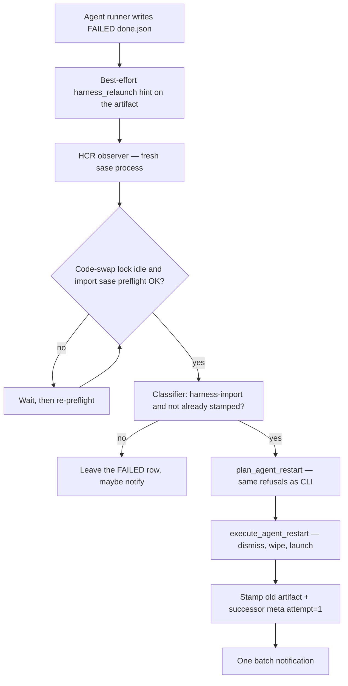

# Auto-relaunch agents that die on a live sase update

**Question.** Agents just failed with
`ImportError: cannot import name 'auto_launch_prefix' from 'sase.monitor.continuation_delivery'`
because sase was updated while they were running. How should SASE automatically
detect failures like this, dismiss and relaunch the failed agent exactly once
(the `,x` then submit path), and tell the user beautifully? Is the plan a good
idea, and what should change?

**Researcher.** grk (`research.47.grk`). Independent report. I did not read peer
reports from this swarm.

**Scope.** Current agent-failure recording, `,x` / `sase agent restart` /
`sase agent drain`, mid-run editable-source survival (`source_skew`, runner
re-exec, code-swap lock, update-gear restart), notification senders, and the
error-pattern question. Recommendation for a host-owned **harness crash
relaunch** (HCR) feature.

## Bottom line

The plan is a good idea **as a narrow recovery companion**, not as a general
"auto-retry FAILED agents" feature. Do it. Tighten the requirements.

The motivating crash is a known class: a long-lived agent runner keeps old
modules in `sys.modules` while a deferred `from sase.x import y` reads the new
checkout. `auto_launch_prefix` was renamed to `queue_launch_prefix` in
`sase.monitor.continuation_delivery`; that name is already gone from HEAD.
SASE already tried to survive this (`sase.axe.source_skew` preload +
`code_swap_explanation`, re-exec after a dependency wait, the yellow update
gear that restarts ACE and the service). The preload walk covers `sase.sdd`
and `sase.bead`, not `sase.monitor`, so this exact ImportError is an uncovered
lazy-import hole.

**Do not puppet the TUI.** The CLI equivalent of "`,x` on a failed row, then
submit the loaded prompt unchanged" is already `sase agent restart NAME`.
That path dismisses a terminal row, forces name reuse (`%id:!name`), and
relaunches from `$HOME` so the new process imports **current** sase. That is
the operation to automate.

**Do not detect-and-restart inside the dying process.** The process that hit
the ImportError is the one whose module graph is torn. Recovery has to be an
out-of-process observer that execs a **fresh** `sase` (the same durable-proc
shape as automatic provider drain).

**Do not match generic FAILED.** Match a small **harness-import** class whose
module is `sase.*` / `sase_core*` / a swapped SASE plugin. Restart each
logical run **once**. Batch a swarm into one notification. Ship behind a beta
flag. Pair it with a cheap prevention stitch: preload `sase.monitor`.

Recommended solution: **Harness Crash Relaunch** — classifier + once-stamp +
`sase agent restart` durable proc + one gold recovery notification, with
prevention as phase 1 of the same epic.

## 1. Critique of the plan

### 1.1 What is right

Supporting "update sase while agents run" is the right product goal. Bryan
already invested in it: source-skew preload, wait-path re-exec, code-swap
locks around `sase bead work`, and the updates gear that queues an ACE +
service restart. Agents still die in the window where a live runner is past
preload and not in a wait, then hits a deferred import. Automatic recovery
for that class is justified. Asking for exactly-once and a thorough
notification is also right: silent relaunch would hide token spend; unbounded
retry would crash-loop a broken install.

The chosen human analog is right **semantically**: failed row, dismiss, same
prompt, same name. Name reuse is what keeps a research swarm looking like
itself (`research.47.grk` stays `research.47.grk`). `R` retry is the wrong
analog — it allocates a new name (`allocate_retry_name`) and leaves the
FAILED corpse on the roster.

### 1.2 What is wrong or incomplete

**TUI puppeting.** Driving Agents-tab focus, `,x`, then `<ctrl+g><enter>`
requires ACE to be open, focused, and not mid-prompt-edit. It races the
user's prompt bar. `<ctrl+g>` is "open `$EDITOR`", not submit; submit is
plain `<enter>` once the bar is mounted. ACE itself may be stale until the
yellow gear restarts it. The durable, headless, Telegram-safe equivalent
already exists: `sase agent restart`. Docs already say so
(`docs/cli.md`, `docs/ace.md` leader `,x`).

**The dying process cannot save itself.** Any "on ImportError, restart me"
handler in the agent runner is running the torn graph. It can at best write
`done.json` / a spool line. The observer must be the **post-update service**
or a **fresh proc**.

**`,x` then submit is a full redo, not a resume.** `sase agent restart`
rebuilds from `raw_prompt.md`, wipes the run's artifacts (chat under
`~/.sase/chats` is kept, not reattached), and launches a new process. An
agent that researched for an hour and then died on a lazy import will spend
that hour again. For a continuation **follow-up** whose stored prompt *is*
the continuation, that is correct. For the original turn, it is expensive.
The plan should say that out loud and still auto-restart the narrow class
(the alternative is leaving the swarm dead). Do **not** invent chat-resume
in v1; that is a different feature (`spawn_retry_agent` / `retry_handoff.json`).

**Pattern lists of symbol names will rot.** `auto_launch_prefix` is already
absent. Match the *shape* (cannot-import-name from `sase.*`) plus optional
source-revision movement, not a catalog of yesterday's identifiers.

**Prevention is cheaper than recovery.** Expanding
`preload_post_gate_modules()` to `sase.monitor` (and other known lazy
surfaces) would have stopped this specific crash. Recovery still matters:
preload will always lag new lazy imports, plugin checkouts, and
`sase_core_rs` wheel swaps. Ship both in one epic, prevention first.

**Generic FAILED auto-retry is a bad idea.** Provider 429s, usage limits,
user kills, OOM, plan failures, workspace ImportErrors, and tool failures
must never enter this path. Usage limits already have
`handle_possible_usage_limit` + `sase agent drain`. Do not unify them.

### 1.3 Justified requirement adjustments

Call these out as changes to the prompt, not as silent scope creep:

1. **Implement the relaunch as `sase agent restart`, not as TUI key
   synthesis.** Same dismiss + forced-name-reuse + unmodified prompt. No
   prompt bar, no `<ctrl+g>`.
2. **Observer is out-of-process** (sase service + durable proc), so it works
   with ACE closed and after ACE itself restarts from the update.
3. **Add a prevention phase** in the same epic: extend source-skew preload
   to `sase.monitor` (and document the remaining holes).
4. **Match a harness-import class, not an allowlist of error strings.**
5. **Exactly-once is per successor hop**, not per agent name forever. A later
   manual `,x` starts a new chain. An auto-relaunched agent that fails the
   same way is **not** relaunched again.
6. **Batch a simultaneous swarm into one proc and one notification**, with
   `+1` evidence per extra agent (service crash-loop already uses this
   inbox pattern).
7. **Beta feature flag** (`agent_harness_relaunch`), default off until the
   classifier has tests against real `done.json` traces, then default-on
   for the narrow class. Config kill switch after the flag is removed.
8. **Wait out an in-flight `sase dev update`** (code-swap writer lock) and
   preflight a fresh `import sase` before relaunching. A torn install must
   not be retry-fuel.
9. **Remote rows stay on the owning machine.** Local observer, local restart.
10. **Do not auto-relaunch user-killed, asking, waiting-on-gate, container,
    multi-segment, or promptless rows.** Reuse `plan_agent_restart`
    refusals.

## 2. What actually happened

### 2.1 The exception

```
ImportError: cannot import name 'auto_launch_prefix'
from 'sase.monitor.continuation_delivery'
```

HEAD exports `queue_launch_prefix` from
`src/sase/monitor/continuation_delivery.py`. `sase.monitor.followup` imports
it at module level. `sase.llm_provider._invoke` still **lazily** imports
`adopt_ordinary_continuation_delivery` from the same module just before
provider invocation. A runner that started on the old revision, never
imported `continuation_delivery`, then executed old bytecode containing
`from … import auto_launch_prefix` after the file on disk had been renamed,
produces exactly this traceback.

This is the failure `source_skew.py` was written to describe:

> every module already in `sys.modules` stays at the old revision while
> every *deferred* import reads the new source, so a lazy
> `from sase.x import y` can fail against a stale cached module.

### 2.2 What SASE already does about live updates

| Mechanism | What it covers | Hole |
| --- | --- | --- |
| `preload_post_gate_modules()` | Eager-imports `sase.sdd`, `sase.bead`, a few named modules, and workspace/vcs/llm entry points at runner boot | Does not walk `sase.monitor` or most of `sase.axe` / `sase.llm_provider` |
| `snapshot_source_revision()` + `code_swap_explanation()` | Labels an ImportError/AttributeError as a code swap when HEAD moved | Honesty only; the agent still FAILED |
| `refresh_runner_code_after_wait()` | `os.execv` of the same argv after a blocking wait if editable HEAD moved | Only after a wait, and only once (`SASE_RUNNER_CODE_REFRESHED`) |
| `dev_update/code_swap_lock.py` | Shared lock so `sase bead work` is not importing during a swap | Residual race for unguarded readers; agent runners already imported |
| Updates gear (yellow) | ACE + sase service restart once live work drains, or at a deadline | Agents that already crashed stay FAILED |
| `sase agent restart` | Dismiss/kill + wipe name + relaunch stored prompt under `%id:!name` | Manual |
| `sase agent drain` + `provider_drain` flag | Auto-relaunch agents stranded by a hard provider disable | Different failure class; proven shape to copy |

The missing piece is **recovery after the runner has already written FAILED**.

### 2.3 The human path the user named

On a FAILED Agents-tab row:

1. `,x` (`leader.kill_and_edit`) reads `raw_prompt.md`, dismisses the
   terminal row (`execute_agent_restart` uses `dismiss_named_agent` when
   `agent.is_done`), rewrites the prompt with
   `prepare_kill_and_edit_prompt` (forced name reuse), and mounts the prompt
   bar.
2. Submitting **without edits** (plain `<enter>` on the bar; `<ctrl+g>` only
   opens `$EDITOR` first) launches that rewritten prompt.

`sase agent restart NAME` is that sequence without the edit pause. For a
FAILED agent it dismisses rather than kills. Planning is read-only and
refuses fan-out, containers, missing prompts, and hard-disabled providers.
Execution snapshots `~/.sase/restarts/` recovery, then stop → wipe →
`launch_agents_from_cwd` from `$HOME`.

`R` (`agents_retry`) is a different verb: it does **not** dismiss, and it
allocates a new retry name. Using it would duplicate swarm identities.

## 3. Is this a good idea?

**Yes, for a closed class of host-infrastructure deaths.** Those failures
are not the agent's work product. The user already decided the original
prompt should run. The new process will import the sase they just installed.
Name reuse keeps the Agents tab stable. A thorough notification keeps the
user in control.

**No, as a general FAILED watchdog.** Automatic redo of agent-logic
failures, provider outages, or user stops would hide real bugs, double-spend
tokens, and fight the user. SASE already has the right special cases:

- Provider retry / `spawn_new_agent` (in-turn, same process or child with
  chat handoff).
- Usage-limit disable + drain (stranded live agents, not FAILED import
  crashes).
- Service-proc crash-loop (host procs, threshold then give-up).

HCR is the third cousin of drain: **host-caused stranding, one automatic
relaunch, one notification, durable proc, beta flag.**

A different approach I would take **instead of only recovery**: freeze a
copy of sase at spawn, or make the runner eager-import the whole package.
That is the correct long-term isolation story and it is too large for this
incident. Short-term: close the known preload hole **and** add HCR.

## 4. Error patterns to match

Think in **classes**, not strings. The classifier reads `done.json`
(`error`, `traceback`), optional `output_path` tail, and
`code_swap_explanation` signals. It returns a structured match
(`pattern_id`, `module`, `symbol`, `confidence`) or `None`.

### 4.1 Restart-eligible (v1)

All of these require the implicated module to be **harness code**: `sase`,
`sase.*`, `sase_core`, `sase_core_rs`, or a distribution sase itself
installed (required plugin / `sase-*` extra). Workspace and project-venv
imports are ineligible.

| `pattern_id` | Shape | Why it is restart-safe |
| --- | --- | --- |
| `sase_import_name` | `ImportError: cannot import name 'X' from 'sase…'` | Classic deferred-import vs rename. This incident. |
| `sase_module_missing` | `ModuleNotFoundError: No module named 'sase…'` | Package layout moved or install mid-import. |
| `sase_attribute` | `AttributeError: module 'sase…' has no attribute 'X'` | Partial reload / old caller vs new module. |
| `sase_extension` | Import/AttributeError naming `sase_core_rs` or the native module | Wheel swapped under a live interpreter. |
| `sase_bytecode` | bad magic number, bad marshal, `.pyc` mismatch under the sase install | Update replaced bytecode. |
| `sase_torn_file` | `FileNotFoundError` / `IsADirectoryError` whose path is inside the sase install during import | Update replaced files under the runner. |
| `code_swap` | `code_swap_explanation(exc)` is non-`None` | Already the project's own definition of this incident. |

`code_swap` is sufficient but **not necessary**. A PyPI/`uv tool`
upgrade can swap files without the editable checkout HEAD moving. Matching
only when git SHA changed would miss non-editable installs.

### 4.2 Explicitly ineligible

Do **not** restart on:

- Provider HTTP/SSE errors, 429, overloaded, authentication.
- Usage-limit text (drain owns that).
- User kill, SIGTERM/SIGKILL, `was_killed`, `loop_outcome == "killed"`.
- `MemoryError`, OOM killer, `RecursionError`.
- `KeyboardInterrupt`.
- Plan / tale / epic / question / gate failures (`PLAN FAILED`, `QUESTION`,
  etc.).
- `failed_retried` parent of a spawn-on-retry child.
- Tool-run, pytest, `just check`, monitor *command* failures.
- `ImportError` whose module lives in the agent workspace, a project venv,
  or an unrelated third-party package.
- `SyntaxError` in workspace code.
- Occupancy / name-taken / launch-guard refusals.
- Any row `plan_agent_restart` would refuse (no `raw_prompt.md`,
  multi-segment, fan-out, container).

`SyntaxError` **in `sase.*`**: do not relaunch while the code-swap lock is
held or while the yellow gear still says "updating". After the install
settles, preflight `import sase`. If that still raises `SyntaxError`, the
update is broken — notify, do not loop.

### 4.3 Grey area, v1 decision

- **Long-running agents with a large transcript.** Still auto-relaunch on a
  harness-import match. The notification must state duration and that this
  is a **full redo** of the stored prompt. A later config
  `skip_if_runtime_over_seconds` (or a gate) can opt those into confirm;
  do not block v1 on it.
- **Monitor supervisor death before a follow-up exists.** HCR restarts an
  existing FAILED **agent row**. A monitor stuck without a follow-up agent
  is `sase monitor` resume territory — follow-up, not v1.
- **Plugin ImportError** for a required `sase_*` plugin that `sase dev
  update` swapped: eligible. A random `pip` package the agent imported:
  ineligible.

### 4.4 Why not a growing regex list

`llm_provider.usage_limit` patterns are per-provider and stable. Harness
symbols are not. Last week's `auto_launch_prefix` is this week's
`queue_launch_prefix`. A shape matcher plus a harness-module predicate
survives renames. Unit-test it with this incident's traceback as a fixture,
plus negative fixtures from provider errors and workspace ImportErrors.

## 5. Recommended design — Harness Crash Relaunch

### 5.1 Product shape

When a terminal agent row matches the harness-import class, SASE dismisses
it and relaunches its stored prompt under the same name, **once**, from a
fresh sase process, then tells the user what it did.

Visually: the FAILED row disappears the way `,x` already makes it disappear;
a new `STARTING`/`RUNNING` row with the **same** name takes its place; one
gold inbox card explains why. A five-researcher swarm that dies together
becomes one card with four `+1`s, not five toasts.

### 5.2 Architecture



Three layers, same split as drain:

1. **Classifier** (pure, tested, no I/O besides reading artifact files).
2. **Planner** — wrap `plan_agent_restart`; a per-agent refusal is a skip,
   never a whole-batch abort.
3. **Executor** — wrap `execute_agent_restart`; durable proc
   `sase agent harness-relaunch --yes --json` (or `sase agent restart` in a
   loop with a batch envelope). Operation name `agent.harness-relaunch`,
   concurrency key `harness-relaunch` so two observers cannot double-fire.

### 5.3 Where the observer lives

**Not in ACE.** ACE may be down, stale, or focused on a prompt.

**Not in the crashing runner**, except a best-effort stamp.

**Yes: sase service + durable proc**, copying `handle_possible_usage_limit`
→ `submit_proc_request(operation=AGENT_DRAIN)`:

- **Primary trigger:** after a sase update settles (the same moment the
  yellow gear restarts ACE/service). Scan FAILED rows whose `done.json`
  is newer than the pre-update boot identity.
- **Secondary trigger:** on a new FAILED index row (artifact-index
  mutation / turn refresh pulse already exists). Enqueue a line on a
  spool `~/.sase/harness_relaunch/queue.jsonl` if the runner can still
  write; the service drains the spool.
- **Safety net:** a short lookback scan (default 15 minutes) of FAILED
  rows missing a stamp, so a runner that died before `done.json` still
  gets caught once the listing shows it terminal.

Coalesce matches in a ~30s window into **one** proc so a five-agent swarm
is one drain-like pass, sequential relaunches (avoid a runner-slot
stampede), one notification.

`settle_drain_trigger_agent` already waits for the trigger row to go
terminal before drain selects it. HCR should wait the same way so it
never kills a runner that is still unwinding.

### 5.4 Exactly once

User wording: "restart an agent exactly once when a detected error pattern
matches." Implement as **one automatic hop per failed run**:

1. **Before** dismiss: write `harness_relaunch.json` on the FAILED artifact
   (`attempted_at`, `pattern_id`, error excerpt, boot SHA, current SHA,
   proc id).
2. **On the successor:** `agent_meta.json` field
   `harness_relaunched_from: {name, artifacts_timestamp, pattern_id, attempt: 1}`.
3. Classifier **refuses** a FAILED row that already has (1) or whose own
   meta has `harness_relaunched_from.attempt >= 1`.
4. A later **manual** `,x` / `sase agent restart` does not set that meta
   (or sets `source: manual`), so a future incident can auto-relaunch
   again.
5. Name-level concurrency key `harness-relaunch:<name>` during the hop.

Do not use a forever-per-name denylist. `research.47.grk` should be
eligible again next week if sase is updated under it again.

If the successor fails with a **non-harness** error, that is a real
failure — leave it. If it fails with the **same** harness class, stop.
The install is still torn or the preload hole is still open; looping will
not help. The notification for the first hop already told the user.

### 5.5 Fresh process, then preflight

The proc argv must be a new `sase` on `$PATH`, not an in-process import of
the observer's (possibly still-stale) modules beyond the tiny classifier.

Before the first dismiss:

1. If the code-swap **writer** lock is held, wait with a cap, then proceed
   or skip-with-notify.
2. In a **child** Python, `import sase` and import the module named in the
   match (e.g. `sase.monitor.continuation_delivery`). Failure → skip, notify
   "sase is still unloading; not relaunching yet."
3. Then `plan_agent_restart` / `execute_agent_restart`.

This is the difference between "retry once" and "crash-loop a broken
`just install`."

### 5.6 Feature flag and config

New **beta** flag `agent_harness_relaunch` via `sase flag new` (do not
hand-edit the registry). Off by default, like `provider_drain`.

Config (not a flag — the user may want this forever):

```yaml
agent:
  harness_relaunch:
    # Read only when the beta flag is on; ignored when off.
    lookback_seconds: 900
    coalesce_seconds: 30
    settle_timeout_seconds: 60
    # null = always auto on match. A later opt-in gate for long runs.
    skip_if_runtime_over_seconds: null
```

When the flag is removed, the On branch stays; this config remains as the
permanent kill/tune surface. That matches the flags memory: a forever
choice is config, not a flag.

### 5.7 Rust core vs this repo

Litmus: any frontend (CLI, ACE, Telegram, mobile) must see the same
relaunch. That means the observer + `sase agent restart` live in the
**host**, not in ACE widgets.

v1 should stay in this repo's Python, next to `sase.agent.restart` and
`sase.agent.provider_drain`. Those are already the shared backend for
`,x` and drain. Do **not** block on a sase-core port. If the classifier
later becomes part of agent-artifact scan records, that is a follow-up
wire change (and would need the `sase-core-revision.txt` pin). Notification
append stays on the existing Rust-backed store via
`sase.notifications.senders`.

### 5.8 What not to build in v1

- TUI prompt-bar automation.
- Chat resume / `retry_handoff.json` reuse.
- Auto-relaunch of monitors, gates, or service procs (service already has
  crash-loop).
- In-process `importlib.reload`.
- Snapshotting the whole sase tree per agent (right long-term, wrong now).
- A new Agents-tab verb. `,x` and `sase agent restart` stay the manual
  tools; HCR is host policy.

## 6. Notification design

This is the user-visible product. Copy the **care** of
`notify_provider_usage_limit_disabled` (multi-line notes, trigger agent,
verbatim provider snippet, what happens next) and the **coalescing** of
`notify_service_crash_loop` (`dedup_key` + `+1`).

### 6.1 One card per burst

- **sender:** `agent.harness`
- **icon:** `↻` (authored, so it does not fall back to the 🤖 JumpToAgent
  default — this is recovery, not a normal completion)
- **color:** `#C9A227` (the yellow-gear family: "sase changed under you")
- **tags:** `agent`, `harness-relaunch`, plus the `pattern_id`
- **dedup_key:** `harness-relaunch:<boot-or-update-id>:<window>` so five
  swarm members become one row with `+1`s
- **action:** `JumpToAgent` on the **successor** (`cl_name`, `raw_suffix`
  of the new artifacts timestamp, `agent_name`). Enter jumps to the live
  row, not the dismissed corpse.
- **files:** a short markdown digest under
  `~/.sase/harness_relaunch/digest_*.md` (matched error, truncated
  traceback, old → new SHA, each agent, recovery dir if a hop went
  partial). Keep `ViewErrorReport` as a *second* affordance only if Jump
  cannot carry the digest; prefer JumpToAgent so the inbox matches "your
  agent is running again."

### 6.2 Notes (the actual copy)

Write in complete, specific lines. Example for this incident, one agent:

```
↻ Relaunched research.47.grk after a sase code swap.
It failed with ImportError: cannot import name 'auto_launch_prefix'
from 'sase.monitor.continuation_delivery'.
The runner had started on <oldsha> and sase moved to <newsha> while it
was live, so a deferred import read the new module.
This is the same as ,x on that FAILED row and submitting the prompt
unchanged — same name, same prompt, new process.
Relaunch is once; if this run dies the same way it will stay FAILED.
Dismiss the new row or ,x it if you did not want this.
```

Swarm burst:

```
↻ Relaunched 5 agents after a sase code swap.
Matched harness import: cannot import name 'auto_launch_prefix' from
'sase.monitor.continuation_delivery'.
Relaunched: research.47.cdx, research.47.cld, research.47.mus,
research.47.gem, research.47.grk.
Each hop is once. Enter jumps to research.47.cdx; the digest lists all
five, including any skip (already relaunched, no prompt, still updating).
```

Additional lines when relevant:

- Duration / that this **redoes** the stored prompt (not a chat resume).
- Skips grouped like drain: "Left alone: 1 already relaunched (foo), 1
  still updating (bar)."
- Partial hop: recovery command from `~/.sase/restarts/` (restart already
  writes this).
- Preflight failed: "sase still failed to import; nothing was relaunched."

### 6.3 Toast vs inbox

Inbox is the source of truth (durable, Telegram, mobile). Toast the first
note at **warning** severity (recovery of a failure, not a happy
completion). Do not toast every `+1`. Drain's "start toast + completion
toast" is fine here too: `Relaunching N agents after a sase update` then
the summary.

Silent: never. Hidden agents (`hidden: true`) still get a **non-silent**
harness card — this is host action, not agent completion. Do not inherit
`silent=agent_hidden` from the completion path.

### 6.4 Agents-tab beauty

- Forced name reuse means the hood/clan/session **does not sprout `-retry`
  clones**. That is the aesthetic win over `R`.
- Stamp a small data-card line on the successor: `↻ relaunched after
  harness crash` with the `pattern_id`. One glance, then it is an ordinary
  agent.
- Do not flash a modal. Do not steal prompt-bar focus.

## 7. Implementation sketch (for the eventual plan)

Epic with a beta flag. Four phases, prevention first so the next update
does not need HCR for this exact symbol.

**Phase 1 — Honesty and prevention (no user-visible relaunch)**

- Walk `sase.monitor` in `preload_post_gate_modules` (best-effort, same as
  `sase.sdd`).
- When writing FAILED `done.json`, if the classifier matches, attach
  `harness_failure: {pattern_id, module, symbol}` so the TUI and
  `sase agent list -j` can show it even before relaunch exists.
- Tests: this incident's traceback matches; a workspace `ImportError`
  does not; a 429 does not.

**Phase 2 — Manual-equivalent engine**

- `sase agent harness-relaunch --dry-run/--yes/--json` batching
  `plan_agent_restart` + `execute_agent_restart`.
- Once-stamps as in §5.4.
- Refuse the ineligible set. Reuse restart recovery dirs.

**Phase 3 — Observer + notification (flag on)**

- Durable proc submission from the service after update settle + FAILED
  lookback.
- Sender `notify_harness_relaunch(...)` in `sase.notifications.senders`.
- Coalesce / `+1` / JumpToAgent to the successor.
- Both-states tests for the flag.

**Phase 4 — Polish**

- Data-card badge.
- Optional `skip_if_runtime_over_seconds`.
- Monitor-follow-up hole documented as a task bead, not silently stretched
  into this epic.

Verification: `just check` is the agent default. Screenshot goldens only if
the data-card badge lands. No `just check-full` unless CI demands it.

## 8. Risks

- **Token double-spend** on a long agent whose crash was late. Mitigate
  with honest notification copy; optional duration gate later.
- **Stampede** if a whole fleet dies. Mitigate with coalesce + sequential
  hops + runner-slot admission that restart already uses.
- **Fighting the user** who is staring at the FAILED row and about to `,x`
  themselves. Mitigate by settling first, then dismissing quickly; if the
  user already dismissed, `plan_agent_restart` returns `not_found` → skip.
- **Broken install crash-loop.** Mitigate with preflight import +
  attempt=1.
- **Stale ACE observing with stale classifier.** Mitigate by putting the
  observer in a fresh `sase` proc after the update, not in ACE's event
  loop.
- **Wrong analog (`R`).** Would pollute names. Do not.

## 9. Recommended solution

Ship **Harness Crash Relaunch**:

1. Treat this ImportError as one member of a **harness-import** class
   (cannot-import-name / missing module / attribute / extension / bytecode
   / torn file on `sase*` plus `code_swap_explanation`), never as a
   generic FAILED retry.
2. Close the known hole by preloading `sase.monitor` so the next rename
   does not depend on recovery.
3. Automate **`sase agent restart`** (dismiss + forced name reuse +
   unmodified stored prompt + fresh process). That *is* `,x` then submit
   without the edit pause. Do not drive ACE keys.
4. Observe **out of process**, after the update has settled, with a
   preflight `import sase`.
5. **One hop.** Stamp the corpse and the successor. Never auto-relaunch an
   auto-relaunched run.
6. **One gold `↻` notification per burst**, JumpToAgent to the live
   successor, digest attached, copy that names the error, the SHAs, the
   once-rule, and how to undo.
7. Beta flag `agent_harness_relaunch`, drain-like durable proc, config for
   lookback/coalesce. Manual `,x` and `sase agent restart` remain.

I would not auto-retry all FAILED agents. I would not resume chat in v1. I
would not put this in the TUI. I would take the prevention stitch in the
same epic, because recovery without it guarantees we will write this report
again the next time a lazy import is added.

That is the design I would implement.
