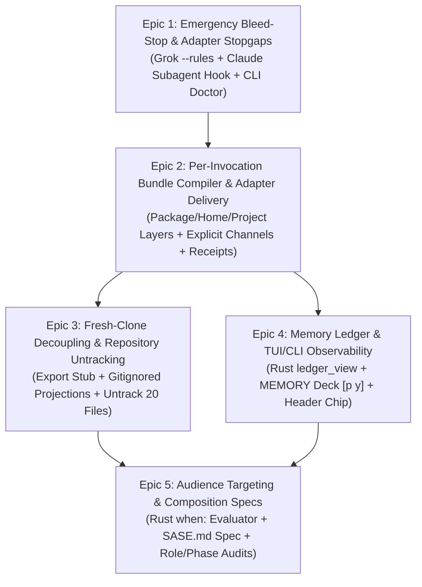

# Decomposing Agent Instruction Migration: Architectural Evaluation and Recommended Epic Structure

**Author:** `research.3p.gem` (Gemini 3.8 Flash)  
**Date:** 2026-10-05  
**Topic:** Architectural decomposition, risk analysis, and epic structuring for migrating static SASE agent instruction files to dynamic, memory-compiled launch-time instruction bundles delivered via adapter explicit channels.  
**Builds on:**
- `research:202610/sase_md_instruction_delivery/sase_md_instruction_delivery.md` ("Report 1")
- `research:202610/instruction_bundles_provider_parity_and_memory_ledger.md` ("Report 2")
- `research:202610/fresh_clone_bootstrap_and_native_subagent_instructions/fresh_clone_bootstrap_and_native_subagent_instructions.md` ("Report 3")

---

## Executive Summary

The proposal to migrate SASE agent instruction files from 20 statically committed, churn-heavy files into dynamically compiled instruction bundles delivered per provider invocation is architecturally sound and necessary. The current system exhibits severe behavioral defects: Grok has loaded zero project instructions since 2026-09-10; Claude Code and Codex receive the runtime contract twice (wasting ~790 tokens per turn); Claude subagents mistakenly attempt to finalize parent agent turns; and 111 commits touched `AGENTS.md` over 60 days purely due to generator churn.

However, executing this migration as a single monolithic initiative would be a critical tactical error. The project spans five fundamentally different layers:
1. Vendor CLI adapter harnesses and process flags (Python).
2. Compilation and template composition logic (Python).
3. Repository tracking, git exclusion, and fresh-clone bootstrapping (Git/CI).
4. Core data models, schema validation, and join ledgers (`sase-core` in Rust).
5. Textual user interface decks and reactive status widgets (Python/Textual).

Attempting to deliver all five layers in one epic introduces an unacceptable blast radius. Because SASE agents are self-hosting—running inside ephemeral workspaces to develop SASE itself—any regression in instruction delivery or finalizer declaration handling will break subsequent agent runs.

**Recommendation:** Split this work into **five decoupled, phased epics**, preceded by immediate stopgaps. Each epic delivers standalone user-facing or operational value, operates behind granular feature flags, and establishes concrete, binary exit criteria verified through automated CLI checks and session artifacts.



---

## 1. Critique of Prior Research & Critical Issues Identified

The three prior research documents provide strong foundational evidence, but a rigorous architectural review reveals several key tensions, contradictions, and hidden risks that must be addressed in the epic design.

### 1.1 Contradiction on Codex Project `AGENTS.md` Suppression (Doc 1 vs. Doc 3)

- **The Conflict:** Report 1 asserted that Codex *cannot* disable project `AGENTS.md` discovery, labeling this "the decisive fact behind R7" (untracking generated files). Report 3 subsequently proved that passing `-c project_doc_max_bytes=0` to Codex suppresses both `AGENTS.md` and `AGENTS.override.md` while preserving `$CODEX_HOME/AGENTS.md`.
- **The Issue:** Treating `-c project_doc_max_bytes=0` as a permanent solution is perilous. It is an undocumented internal knob in `codex-cli`. If a future CLI update alters or ignores this configuration, Codex will silently revert to double-loading.
- **Architectural Resolution:** R7 (untracking the 20 generated files) remains mandatory, but for the right reason: eliminating git churn (111 commits in 60 days) and guaranteeing multi-provider uniformity, rather than depending solely on an undocumented Codex flag.

### 1.2 The Provider Subagent Asymmetry Gap (Doc 3)

- **The Finding:** Report 3 revealed that Claude Code general-purpose subagents mistakenly invoked `/sase_final` (15 times in 30 days, producing 2 accepted final declarations for their parent's turn), while Explore subagents received zero project instructions. Report 3 identified the hidden `--append-subagent-system-prompt-file` flag to fix this.
- **The Issue:** The prior reports glossed over the fact that *other providers have no equivalent subagent channel*. Grok's `--rules` flag does not propagate to child agents; Muse and Antigravity lack system-prompt flags entirely and rely on prompt prefixes that do not flow into subagents.
- **Architectural Resolution:** Epics must not promise universal "provider parity for subagents." Subagent delivery is fundamentally asymmetric. SASE must deliver dedicated subagent bundles where vendor channels exist (Claude), enforce root-only tool locks mechanically (PreToolUse hook), and record honest receipt statuses (`subagent: unconfigurable` or `subagent: inherited`) where vendor channels do not exist.

### 1.3 The "Build the Meter Before the Engine" Ordering Trap (Doc 2)

- **The Conflict:** Report 2 proposed building the entire memory ledger, reverse index, Rust `ledger_view`, and 4-tier Textual TUI deck (`p` `y`) in Phase 0 in "observed mode" before modifying instruction generation.
- **The Issue:** Front-loading complex Textual UI development, PyO3 bindings, and Rust crate modifications halts work on the core compiler. It forces the developer to build UI widgets for broken legacy formats that are about to be superseded. Meanwhile, Grok remains starved of instructions and Claude subagents continue misbehaving.
- **Architectural Resolution:** Split observability into two phases:
  - *Phase A (in Epic 1 & 2):* Lightweight JSON receipt output (`instructions.json`) and a simple CLI diagnostic (`sase doctor instructions`).
  - *Phase B (in Epic 4):* The full Textual TUI deck (`p` `y`), Rust join ledger, and reverse index, constructed once the bundle and receipt schemas are stable.

### 1.4 Interactive Fresh-Clone Fragility (Doc 3)

- **The Proposal:** Report 3 recommended a committed `AGENTS.md` stub with a bootstrap clause: *"If your context does not contain full instructions, run `just agent-instructions`, then read the file it prints."*
- **The Issue:** Relying on an LLM to reliably parse and execute a multi-step self-bootstrap clause in an interactive terminal is fragile. Models frequently skip meta-instructions or attempt to proceed with whatever partial context is loaded.
- **Architectural Resolution:** Mechanical loading must be the primary channel; text instructions are only a fallback:
  1. Claude Code imports gitignored `.sase/instructions/claude.md` via `@` in `CLAUDE.md`.
  2. Codex natively reads gitignored `AGENTS.override.md`.
  3. `just install` automatically runs `sase instructions sync` to pre-populate both files.
  4. The bootstrap clause in `AGENTS.md` is strictly a tertiary safety net for uninitialized, raw CLI invocations.

### 1.5 Self-Hosting Circular Dependency Risk

- **The Threat:** SASE agents run in ephemeral `sase_<N>` clones. If an agent working on instruction delivery breaks `_invoke.py`, subsequent agents dispatched to review, test, or repair the branch may fail to receive their instructions, fail to execute `/sase_final`, or fail to run required git checks.
- **Architectural Resolution:** All dynamic delivery features must be gated behind per-provider feature flags (`feature_flags.py`). At launch, if bundle compilation encounters an error, the runner must gracefully fall back to the last-known-good (LKG) cached bundle and emit an alert, rather than crashing or launching an uninstructed agent.

---

## 2. Justification: Why This Work Must Be Split into Epics

A single epic would be unmanageable for the following reasons:

1. **Failure Domain Isolation:** Modifying provider adapters (`src/sase/llm_provider/`) carries different risks than modifying repository tracking (`.gitignore`, git index) or editing the Rust core (`crates/sase_core/`). Isolating these into separate epics prevents harness bugs from blocking repository hygiene.
2. **Immediate Time-to-Value:** The Grok regression (zero instructions for 4 weeks) and Claude subagent finalization bug are critical production issues. They can be fixed in a small, low-risk stopgap epic within days, without waiting weeks for the compiler or TUI deck.
3. **Independent Verifiability:** Each epic provides a discrete set of acceptance criteria that can be confirmed in CI and locally via CLI before progressing to the next layer.
4. **Rust Core Release Cadence:** Work in `sase-core` requires modifying Rust code, updating PyO3 bindings, compiling wheels, and bumping `sase-core-revision.txt` in the main repo (per rule 1.3). Decoupling the Python compiler (Epic 2) from the Rust schema evaluator (Epic 5) and Rust join view (Epic 4) avoids cross-repo development gridlock.

---

## 3. Recommended Epic Breakdown

We recommend structuring the migration into **five discrete epics**, ordered logically by risk, dependency, and value.

```
┌─────────────────────────────────────────────────────────────────────────────┐
│ Epic 1: inst-fix-stopgaps                                                   │
│ Emergency Bleed-Stop & Provider Adapter Parity                              │
└──────────────────────────────────────┬──────────────────────────────────────┘
                                       │
                                       ▼
┌─────────────────────────────────────────────────────────────────────────────┐
│ Epic 2: inst-bundle-engine                                                  │
│ Per-Invocation Bundle Compiler & Explicit Adapter Delivery                  │
└───────────────────┬─────────────────────────────────────┬───────────────────┘
                    │                                     │
                    ▼                                     ▼
┌──────────────────────────────────────┐  ┌───────────────────────────────────┐
│ Epic 3: inst-fresh-clone-decouple    │  │ Epic 4: inst-memory-ledger-tui    │
│ Fresh-Clone Decoupling & Repo Hygiene│  │ Memory Ledger & TUI Observability │
└───────────────────┬──────────────────┘  └───────────────────┬───────────────┘
                    │                                         │
                    └──────────────────┬──────────────────────┘
                                       │
                                       ▼
┌─────────────────────────────────────────────────────────────────────────────┐
│ Epic 5: inst-audience-composition                                           │
│ Audience Targeting, Composition Specs, & Budget Enforcement                 │
└─────────────────────────────────────────────────────────────────────────────┘
```

---

### Epic 1: Emergency Bleed-Stop & Provider Adapter Parity
**Slug:** `inst-fix-stopgaps`  
**Estimated Size:** Small (2–3 days)  
**Dependencies:** None

#### Objective
Immediately repair active, measured harms in production provider sessions without waiting for compiler or TUI redesign.

#### Detailed Scope
1. **Grok Root Instructions:** Update `src/sase/llm_provider/grok.py` to pass current rendered project instructions plus the home layer via `--rules <text>`. Keep SASE workspaces untrusted to prevent the double-load bug (`AGENTS.md` + `CLAUDE.md`).
2. **Claude Subagent Lockout:** Implement a PreToolUse hook in Claude Code integration that inspects `agent_id`. If `agent_id` is present (indicating a subagent), block execution of `sase final`, `sase stitch create`, or any finalizer submission tool.
3. **Claude Subagent Initial Delivery:** Pass a trimmed helper directive via `--append-subagent-system-prompt-file` that strips turn obligations (`/sase_final`).
4. **Diagnostic CLI Baseline:** Introduce `sase doctor instructions --quick` to parse recent provider session logs (Claude transcripts, Codex rollouts, Grok `prompt_context.json`, Muse `session.jsonl`) and output current instruction copy counts.
5. **Shim Deprecation:** Stop generating `OPENCODE.md` (which OpenCode never reads) and `QWEN.md` (which causes double loads in Qwen).

#### Exit Criteria & Verifiable Results
- [ ] `grok inspect` in a SASE workspace reports `Project trusted: no`, while Grok session logs (`prompt_context.json`) show non-empty instruction context.
- [ ] Grok final-declaration compliance rate on non-research turns begins recovering from the 26% regression baseline toward 60%.
- [ ] Zero Claude subagents successfully execute `sase final` across 100 consecutive subagent invocations in test and production runs.
- [ ] `sase doctor instructions --quick` runs cleanly and correctly reports current baseline states (identifying Codex 2×, Claude 2×, Grok 1×, Muse 1×).

#### Rollback Strategy
Revert specific adapter flags in `grok.py` or disable the Claude hook via environment variable `SASE_DISABLE_SUBAGENT_HOOK=1`.

---

### Epic 2: Per-Invocation Bundle Compiler & Explicit Adapter Delivery
**Slug:** `inst-bundle-engine`  
**Estimated Size:** Medium (1–2 weeks)  
**Dependencies:** Epic 1

#### Objective
Transition from static instruction files to dynamic, memory-compiled instruction bundles assembled immediately before `provider.invoke`, delivered exclusively through explicit adapter channels.

#### Detailed Scope
1. **Bundle Compiler (`src/sase/instructions/bundle.py`):**
   - Composes layers in strict sequence: Package Base (`pkg.contract`, `pkg.repos`, `pkg.provider.*`), Plugins (`plugin.github`, etc.), Home Memory (`~/sase/memory`), and Project Memory (`sase/memory`).
   - Deduplicates content by section ID to guarantee zero repeated clauses.
   - Retires `sase/memory/sase.md` into the packaged base, unifying the runtime contract into a single source.
   - Converts today's four hand-written adapter directives into package sections conditional on `provider`.
2. **Adapter Delivery Envelopes (`src/sase/llm_provider/`):**
   - **Claude:** `--append-system-prompt-file <bundle>` and `--append-subagent-system-prompt-file <subagent-bundle>`; apply `claudeMdExcludes` for `~/CLAUDE.md`.
   - **Codex:** Write bundle to shadow `$CODEX_HOME/AGENTS.md`. In interim mode (before Epic 3 untracks files), deliver complement mode or use `-c project_doc_max_bytes=0`.
   - **Grok:** `--rules <bundle>` (keeping workspaces untrusted).
   - **Muse & Antigravity:** Single-turn prefix + bundle text prepended to prompt.
   - Update `_invoke.py` and finalizer follow-up paths (`declaration_recovery.py`, `commit_repair_conflict.py`) to trigger compilation immediately prior to process spawn.
3. **Provenance & Audit Artifacts:**
   - Write `$SASE_ARTIFACTS_DIR/instructions/instructions.md` (exact render) and `instructions.json` (receipt metadata: SHA256, section IDs, source blob OIDs, token counts, delivery envelope).
   - Export `SASE_INSTRUCTIONS_FILE` environment variable so agents can inspect their own instructions.
   - Record `instructions_bundle_sha` in `agent_meta.json`.
4. **Feature Flags & Safety:**
   - Add granular feature flags: `instructions_delivery_claude`, `instructions_delivery_codex`, `instructions_delivery_grok`, etc.
   - Implement runtime fallback: if compiler raises an exception, deliver cached last-known-good (LKG) bundle and log a loud warning.

#### Exit Criteria & Verifiable Results
- [ ] For every provider, session records verify that the bundle hash appears **exactly once** (`✓1×`), with zero duplicate SASE contract sections.
- [ ] The ~790 duplicate tokens on Claude and Codex are completely eliminated.
- [ ] Muse and Grok sessions reliably receive the home layer (`~/sase/memory`).
- [ ] `$SASE_ARTIFACTS_DIR/instructions/instructions.json` is generated for 100% of agent turns, containing verifiable section digests.
- [ ] Agent finalizer completion rate across all providers meets or exceeds existing baselines.

#### Rollback Strategy
Individual provider flags can be toggled off instantly in `default_config.yml` or via CLI, reverting that provider to legacy file-reading behavior without affecting others.

---

### Epic 3: Fresh-Clone Decoupling & Repository Churn Elimination
**Slug:** `inst-fresh-clone-decouple`  
**Estimated Size:** Medium (1 week)  
**Dependencies:** Epic 2

#### Objective
Untrack generated instruction files to eliminate the 111-commit churn in git, while establishing a robust, self-bootstrapping experience for fresh clones and interactive developers.

#### Detailed Scope
1. **Committed Root Export Stub (`AGENTS.md`):**
   - Implement `sase instructions export` to generate a lean, human- and agent-friendly stub (enforced ≤80 lines, ~1.5k tokens).
   - Includes: orientation, build/test commands (`just install`, `just check`), universal core conventions (`gotchas`, `rust_core_backend_boundary`), and the bootstrap clause.
   - Excludes: `/sase_final`, ephemeral workspace rules, sidecar audit rules, and trigger rosters.
2. **Committed Claude Import Shim (`CLAUDE.md`):**
   - Replace root `CLAUDE.md` with two lines:
     ```markdown
     @AGENTS.md
     @.sase/instructions/claude.md
     ```
3. **Interactive Projection Sync (`sase instructions sync`):**
   - Command compiles `mode: interactive` projections into gitignored paths:
     - `.sase/instructions/claude.md` (read by Claude via import).
     - `AGENTS.override.md` (read natively by Codex instead of `AGENTS.md`).
     - `.sase/instructions/agents.md` (read by Grok, Muse, and others).
   - Wire `just agent-instructions` to execute `uv run sase instructions sync`.
   - Update `just install` to execute instruction sync automatically.
4. **Repository Untracking & Hygiene:**
   - Remove 20 generated instruction files from git tracking: root `GEMINI.md`, `QWEN.md`, `OPENCODE.md`, and nested instruction files in `tools/`, `src/sase/ace/`, `demos/tapes/`.
   - Add `.sase/` and `AGENTS.override.md` to `.gitignore`.
   - Convert nested directory instructions into path-scoped reference memory notes (e.g., `paths: [src/sase/ace/**]`) in `sase/memory/`.
5. **CI Drift Gate:**
   - Add `sase instructions export --check` to `just check` / CI to ensure the committed stub never drifts from memory sources.

#### Exit Criteria & Verifiable Results
- [ ] `git status` in any SASE workspace is never dirtied by instruction generation; editing a memory note produces 0 diffs in `AGENTS.md`.
- [ ] Fresh Clone Test: Cloning the repo into a clean directory with no pre-existing `.sase` directory and launching `claude`, `codex`, or `grok` loads only the lean export stub without failing or encountering `/sase_final` obligations.
- [ ] Running `just install` populates `.sase/instructions/claude.md` and `AGENTS.override.md`, immediately providing full interactive instructions to Claude and Codex without touching git tracking.
- [ ] CI passes with all 20 legacy instruction files untracked.

#### Rollback Strategy
If untracking breaks an unexpected workflow, `sase memory init` can re-generate the 20 tracked files from git history.

---

### Epic 4: Memory Ledger & SASE TUI / CLI Observability
**Slug:** `inst-memory-ledger-tui`  
**Estimated Size:** Large (2 weeks)  
**Dependencies:** Epic 2 (can run in parallel with Epic 3)

#### Objective
Provide deep, real-time observability into what each agent was told, what it actually loaded, and what memory it pulled, visible across the Textual TUI and CLI.

#### Detailed Scope
1. **Core Join Engine (`crates/sase_core/src/instructions/ledger.rs`):**
   - Implements `ledger_view` in Rust, joining:
     - Intended receipt (`instructions.json`).
     - Observed provider session record (conformance check).
     - Pulled memory reads (`~/.sase/projects/<p>/memory_reads.jsonl`).
     - Memory git history (detecting notes modified since agent run).
   - Exposes PyO3 bindings (`sase_core_rs.instructions`) and updates `sase-core-revision.txt`.
2. **Reverse Index:**
   - Append-only `~/.sase/projects/<p>/instruction_receipts.jsonl` recording agent ID, artifact path, and section blob OIDs per turn.
   - Eliminates expensive history scans across disk.
3. **TUI Level 1 & 2 (Header & Context Lane):**
   - Add compact delivery status chip to `_identity_header_compact.py` (`✓1×`, `‼2×`, `∅`, `⟲ lkg`, `◌`).
   - Upgrade Context card MEMORY lane to display ledger summary and receipt launch row.
4. **TUI Level 3 (Dedicated MEMORY Deck `p` `y`):**
   - Register new `MEMORY` deck (picker key `y`, glyph `❖`).
   - **Card 1 (Receipt):** Shows invocation count, bundle hash, audience facts, delivery envelope, and observed conformance.
   - **Card 2 (Ledger):** Symbol-coded memory roster:
     - `●` inlined (body in bundle)
     - `◇` offered (trigger in bundle, unread)
     - `◆` offered → read (trigger present, read logged)
     - `◈` unlisted read (read without trigger)
     - `○` withheld (filtered by audience `when:`)
     - `⊘` foreign (vendor auto-memory)
     - `↻` changed since (note modified after agent ran)
   - **Card 3 (Bundle):** Displays exact rendered bundle text with line numbers and section headers.
5. **CLI Parity & Admin Pane:**
   - Add `sase instructions show <agent>` (`--json`, `--bundle`).
   - Add `sase instructions render --as <agent|facts> [--diff]`.
   - Add Memory pane "Seen by" view in Admin Center showing which agents received or read specific notes.

#### Exit Criteria & Verifiable Results
- [ ] Identity header chip updates in real time with 0 perceptible latency during agent navigation.
- [ ] Pressing `p` `y` in the TUI opens the MEMORY deck in <50ms with live, reactive Receipt, Ledger, and Bundle cards matching the session artifacts.
- [ ] Selecting hint `[n]` on a ledger row opens the memory pager pinned to the exact git blob the agent saw.
- [ ] `sase instructions show <agent>` outputs byte-accurate ledger data matching the TUI display.
- [ ] Synthetic delivery anomalies (e.g. simulated double-load or missing envelope) immediately trigger red indicators (`‼2×` or `∅`) in the TUI.

#### Rollback Strategy
The TUI deck can be hidden via `DECK_SPECS` feature flag without impacting CLI or runtime instruction delivery.

---

### Epic 5: Audience Targeting, Composition Specs, & Budget Enforcement
**Slug:** `inst-audience-composition`  
**Estimated Size:** Large (2 weeks)  
**Dependencies:** Epic 2, Epic 3

#### Objective
Enable targeted, role- and lifecycle-specific instruction bundles using declarative composition specifications, protected by strict pre-flight token budgets and matrix validation.

#### Detailed Scope
1. **Launch-Fact Schema & Evaluator (`crates/sase_core/src/instructions/when.rs`):**
   - Closed, validated schema in Rust: `mode`, `provider`, `role` (`root`, `plan`, `code`, `monitor`, `gate`, `subagent`), `phase_worker`, `tribe`, `macros`, `commit_method`, `vcs`, `host`, `flags`.
   - Declarative `when:` map evaluator supporting OR within lists, AND across keys, and `not:` negations. No free-form Jinja or arbitrary expression evaluators.
2. **Composition Spec Parser (`SASE.md`):**
   - Supports optional project-level `SASE.md` defining custom layouts and slots (`<!-- sase:slot core -->`).
   - Parses note frontmatter `when:` filters to selectively include/exclude trigger lines or inlined sections.
3. **Pre-flight CI Matrix Validator (`sase instructions check --matrix`):**
   - Enumerates all valid audience combinations.
   - Enforces the router token ratchet (≤100 lines and ≤1,600 tokens for the project layer) per audience.
   - Enforces **R9 Invariant:** hard rules (runtime contract, baseline read triggers) can never be hidden by a `when:` filter.
4. **Initial High-Value Audiences:**
   - **Lean Monitor & Gate Turns:** Delivers contract and execution rules; omits reference trigger catalog (~1,800 tokens saved per turn).
   - **Phase Workers:** Replaces prose "unless" exceptions with an absolute rule: *Do not create beads; record `PROPOSED FOLLOW-UP:` notes on phase bead.*
   - **Dedicated Claude Subagent Render:** Strips `/sase_final` obligations while retaining repository boundaries and memory access.
   - **Research vs. Code Tribes:** Tunes decision web density and excludes lint/test triggers for pure research runs.

#### Exit Criteria & Verifiable Results
- [ ] `sase instructions check --matrix` runs in CI, asserting that all reachable audience renders satisfy token ratchets and hard-rule invariants.
- [ ] Monitor and gate agent bundles are measured to be ~40% smaller than root coder bundles, saving ~1,800 tokens on 12.5% of all SASE runs.
- [ ] Phase worker runs exhibit 0 rogue task bead creations across 50 simulated phase executions.
- [ ] Claude subagents consistently receive dedicated helper bundles without `/sase_final`.
- [ ] Syntax errors or unknown keys in `when:` frontmatter fail loudly during `just check` rather than at agent launch time.

#### Rollback Strategy
Remove the `when:` clauses from note frontmatter or delete project `SASE.md`; the compiler defaults to including all sections for all audiences.

---

## 4. Phasing, Dependency Analysis, & Sequencing

### 4.1 Dependency Flow

The dependencies between epics follow strict architectural necessity:

```
[Epic 1: Stopgaps]
       │
       ▼
[Epic 2: Bundle Engine] ──────────────┐
       │                              │
       ▼                              ▼
[Epic 3: Fresh Clones]         [Epic 4: Ledger TUI]
       │                              │
       └──────────────┬───────────────┘
                      │
                      ▼
[Epic 5: Audiences & Specs]
```

- **Epic 1 must precede Epic 2:** Fixing Grok and Claude subagents is an emergency that requires minimal code touch.
- **Epic 2 is the core foundation:** Both Epic 3 (export stub/untracking) and Epic 4 (ledger/TUI) require the bundle compiler and receipt schema to exist.
- **Epic 3 and Epic 4 can execute in parallel:** Epic 3 focuses on git hygiene and CLI fresh clones; Epic 4 focuses on Rust core joins and Textual UI.
- **Epic 5 is the final capstone:** Audience targeting should only be introduced once the delivery channel (Epic 2), repo untracking (Epic 3), and observability meter (Epic 4) are rock-solid.

### 4.2 Feature Flag Lifecycle

To ensure zero downtime and safe rollout across self-hosting agents:

| Feature Flag | Introduced | Default Enabled | Retired / Permanent |
| :--- | :---: | :---: | :---: |
| `instructions_grok_rules` | Epic 1 | Epic 1 | Epic 2 |
| `instructions_bundle_claude` | Epic 2 | Epic 2 (staged) | Epic 3 |
| `instructions_bundle_codex` | Epic 2 | Epic 2 (staged) | Epic 3 |
| `instructions_bundle_all` | Epic 2 | Epic 3 | Epic 5 |
| `instructions_untrack_shims` | Epic 3 | Epic 3 | Epic 4 |
| `instructions_tui_deck` | Epic 4 | Epic 4 | Post-Epic 5 |
| `instructions_when_filtering` | Epic 5 | Epic 5 | Post-Epic 5 |

---

## 5. Explicit Anti-Goals: What NOT to Build

To prevent scope creep and maintain alignment with SASE core principles, the following proposals from the research must be explicitly rejected or deferred:

1. **Do NOT build `%tag` or free-form prompt tagging:**
   `%t` already aliases `%tribe`, and hand-typed tags suffer from drift. All audience targeting must be driven by closed, host-verified launch facts (`role`, `tribe`, `phase_worker`, `macros`, `provider`).
2. **Defer `traits:` and prompt escape hatches (`%trait:`):**
   In accordance with `decisions:corpus-before-mechanism`, do not build trait machinery until a concrete memory section demonstrably requires a label that launch facts cannot supply.
3. **Do NOT create a monolithic `SASE.md` holding prose text:**
   A single markdown file containing all instruction prose would undo the modular benefits of SASE memory notes, audited reads, web strands, and frontmatter routing. `SASE.md` must remain strictly an optional *composition layout spec*.
4. **Do NOT degrade instructions based on model size or tier:**
   Smaller models need clearer, more explicit constraints than frontier models. Degrading hard rules or conventions for lower-tier models leads to elevated finalizer failures.
5. **Do NOT dynamically sniff file paths at launch time:**
   Attempting to infer what an agent needs based on working directory path sniffing is unreliable. Subsystem conventions belong in path-scoped reference triggers (`paths: [...]`) that the agent reads dynamically when editing relevant files.

---

## 6. Comprehensive Verification & Audit Playbook

For the user evaluating the completion of these epics, this playbook specifies the exact verification commands and inspection points.

```
┌─────────────────────────────────────────────────────────────────────────────┐
│                       VERIFICATION PLAYBOOK BY EPIC                         │
├───────┬──────────────────────────────────┬──────────────────────────────────┤
│ Epic  │ Verification Command             │ Expected Pass Criteria           │
├───────┼──────────────────────────────────┼──────────────────────────────────┤
│ E1    │ `sase doctor instructions`       │ Grok received >0 instructions;   │
│       │                                  │ Claude subagent declarations = 0 │
├───────┼──────────────────────────────────┼──────────────────────────────────┤
│ E2    │ `sase doctor instructions`       │ All providers report `✓1×`;      │
│       │ `cat $SASE_ARTIFACTS_DIR/`       │ Bundle hash matches session log; │
│       │ `instructions/instructions.json` │ Duplicate tokens = 0             │
├───────┼──────────────────────────────────┼──────────────────────────────────┤
│ E3    │ `git status --porcelain`         │ 0 dirty instruction files;       │
│       │ `sase instructions export --chk` │ Exit code 0 (no stub drift);     │
│       │ `just agent-instructions`        │ Generates gitignored projections │
├───────┼──────────────────────────────────┼──────────────────────────────────┤
│ E4    │ `sase instructions show <agent>` │ Outputs matching ledger view;    │
│       │ TUI keystroke `p` `y`            │ Deck opens in <50ms with live    │
│       │                                  │ Receipt, Ledger, and Bundle cards│
├───────┼──────────────────────────────────┼──────────────────────────────────┤
│ E5    │ `sase instructions check --mat`  │ All audience permutations pass   │
│       │                                  │ budgets; R9 hard rules preserved │
└───────┴──────────────────────────────────┴──────────────────────────────────┘
```

### Final Conclusion

Splitting this migration into five focused epics transforms a high-risk, 6-week monolithic overhaul into a sequence of safe, incremental improvements. Epic 1 stops the active bleeding in days; Epic 2 establishes the core per-invocation compilation engine; Epic 3 cleanses git tracking and protects fresh clones; Epic 4 delivers best-in-class TUI/CLI observability; and Epic 5 unlocks fine-grained audience specialization.
