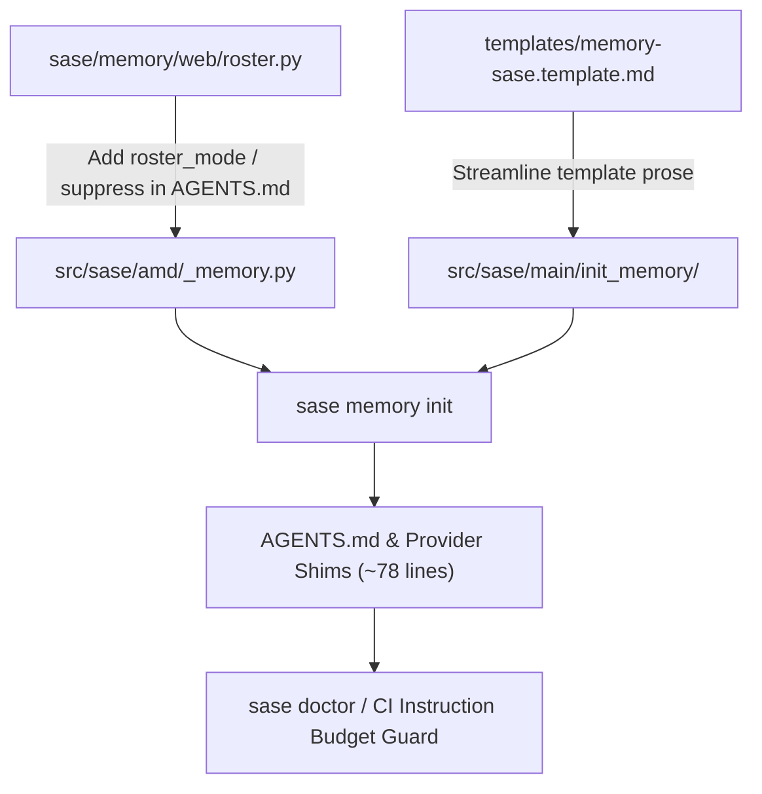

# Research Report: Reducing Agent Instruction Files to <=100 Lines

**Researcher ID:** `research.02.gem`  
**Date:** 2026-10-02  
**Target File:** `AGENTS.md` (and provider shims `CLAUDE.md`, `GEMINI.md`, `QWEN.md`, `OPENCODE.md`)  
**Status:** Complete Analysis & Recommended Architecture  

---

## Executive Summary

The proposal to reduce SASE's agent instruction files down to **<=100 lines** is **both achievable and strategically advantageous**, but **only if the metric is approached as a token/signal density optimization rather than syntactic line-golfing**. 

Today, this project's root `AGENTS.md` (and its byte-for-byte provider shims) stands at **283 lines** (~4,316 tokens). Furthermore, when run under providers that discover both `AGENTS.md` and proprietary convention files (such as Antigravity/Gemini CLI discovering both `AGENTS.md` and `GEMINI.md`), agents are penalized with **566 lines (~8.6k tokens)** of redundant prompt injection before a single user token is processed.

Our audit demonstrates that **over half the file (145 lines, 51.2%)** is consumed by inlined **Memory Web descriptors**—specifically, expanding the full rosters of 24 architectural decisions (90 lines), 66 glossary terms (27 lines), and task bead types (22 lines). Another **103 lines (36.4%)** is consumed by Core Memory, which currently contains verbose explanations, procedural guidance duplicate of existing skills, and historical background.

By restructuring Memory Web rendering, compacting core templates, and enforcing single-line trigger descriptions for reference memory, the root instruction file can be reduced to **approximately 78–84 lines (~1,150–1,250 tokens)**—an immediate **~70% reduction in line count and token budget**—without discarding a single invariant guardrail or trigger keyword.

### Key Recommendations at a Glance:
1. **Reopen Decision `webs-render-in-their-own-section`**: Cease inlining full strand rosters into `AGENTS.md`. Memory webs should render as concise catalog pointers (~15–18 lines total across all webs).
2. **Compact Core Memory Templates**: Refactor `memory-sase.template.md` to state hard operational constraints tersely (workspace boundaries, repository boundaries, host completion) rather than tutorial essays (~28–32 lines total).
3. **Refine Requirements from "Raw Line Count" to "Token & Signal Budget"**: Enforce `<=100 lines` at standard 88-column wrapping, coupled with a `<=1,500 token` ceiling, to prevent perverse incentives like removing blank lines or joining sentences into unreadable 300-column run-on lines.
4. **Fix Provider Shim Redundancy**: Avoid dual-loading penalty in CLI environments where both `AGENTS.md` and provider-specific files (`GEMINI.md`) reside in the root.

---

## 1. Baseline Audit: The Anatomy of 283 Lines

Running `sase memory list` and inspecting `AGENTS.md` reveals the exact composition of the current 283 lines (~4,316 approx tokens):

```
+-------------------------------------------------------------------------------+
| SECTION                                | LINES | PERCENT | PRIMARY CONTENT    |
+-------------------------------------------------------------------------------+
| Header & Section Overheads             |     6 |    2.1% | H1, Section Intros |
| Section 1: Core Memory                 |   103 |   36.4% | sase.md, gotchas,  |
|                                        |       |         | rust_core boundary |
| Section 2: Reference Memory            |    33 |   11.7% | 10 reference notes |
| Section 3: Memory Webs                 |   145 |   51.2% | decisions (90),    |
|                                        |       |         | glossary (27),     |
|                                        |       |         | task_types (22)    |
+-------------------------------------------------------------------------------+
| TOTAL                                  |   283 |  100.0% | ~4,316 tokens      |
+-------------------------------------------------------------------------------+
```

### 1.1 Detailed Sub-Section Breakdown

#### Core Memory (103 lines)
- **`sase/memory/sase.md` (76 lines inlined)**:
  - SASE Memory overview (core vs reference vs web definitions, `/sase_memory_write` rule): 18 lines.
  - Ephemeral `sase_<N>` workspace rules (jail boundary, portable plan warning): 8 lines.
  - Repositories (list of 5 repos + 3 paragraphs forbidding web fetches, enforcing `/sase_repo`, sidecar read rules): 34 lines.
  - SASE Final Declaration (`/sase_final` requirement, `/sase_monitor` handoff): 10 lines.
  - Spacing & section headers: 6 lines.
- **`sase/memory/gotchas.md` (6 lines inlined)**:
  - Keymap config note: 6 lines.
- **`sase/memory/rust_core_backend_boundary.md` (17 lines inlined)**:
  - Crate boundary, litmus test, bindings, CI pin: 17 lines.

#### Reference Memory (33 lines)
- 3 lines of introductory instructions.
- 10 reference note entries (averaging 3 lines each when formatted at standard width):
  `cli_rules.md`, `dispatch.md`, `generated_skills.md`, `lint_and_test.md`, `sase_artifacts.md`, `sase_beads.md`, `sase_flags.md`, `symvision.md`, `tui.md`, `xprompts.md`.

#### Memory Webs (145 lines)
- 6 lines of section overview.
- **`sase/memory/decisions.md` (90 lines)**:
  - 9 lines of web description and query instruction.
  - **81 lines of strand rosters**: 24 distinct architectural decision records rendered as numbered items with full slugs and 2–3 line summaries.
- **`sase/memory/glossary.md` (27 lines)**:
  - 7 lines of query instruction.
  - **20 lines of inline roster**: 66 terms formatted in a semicolon-delimited block.
- **`sase/memory/task_types.md` (22 lines)**:
  - 5 lines of header.
  - **12 lines of strand roster**: 5 task types (Bug, CI, Feature, Flake, Memory).
  - 5 lines on filing discovered work (`/sase_new_task`).

### 1.2 Mathematical Reality of the <=100 Lines Target

If we evaluate the current sections in isolation:
- Core Memory alone = **103 lines** (>100 lines).
- Memory Webs alone = **145 lines** (>100 lines).

This proves that **no single localized trim can achieve <=100 lines**. You cannot simply delete reference notes or shorten keymap gotchas. Reaching <=100 lines requires addressing the systemic expansion mechanism in Memory Webs *and* rewriting Core Memory templates for high information density.

---

## 2. Critique of the Plan: Is <=100 Lines a Good Idea?

### 2.1 The Strong Arguments FOR the Plan

1. **Context Economy and Cumulative Swarm Turn Overhead**
   Every agent invocation in SASE (or any agent framework) pays the system instruction cost on Turn 0 and on every subsequent turn of the trajectory. In swarms (such as this 5-researcher swarm, or multi-phase epic workers), 4.3k tokens multiplied by dozens of turns across multiple agents generates hundreds of thousands of input tokens of pure overhead. Trimming to ~1.2k tokens yields substantial latency reductions (time-to-first-token) and financial/quota savings.

2. **Mitigating Attention Diffusion ("Lost in the Middle")**
   Empirical LLM evaluation repeatedly shows that long prompt prefixes suffer from degraded rule adherence. When an instruction document presents 24 decisions (including retired v1 import leg mechanics, CI two-speed splits, and tool admission order) alongside immediate operational rules ("do not leave workspace", "use `/sase_repo`"), the critical operational rules compete for attention against irrelevant historical context. An agent working on a small CLI bug does not need to know the architectural nuances of decision `record-before-admit`.

3. **Prompt Cache Stability**
   In modern inference platforms (Claude prompt caching, Gemini context caching, OpenAI prefix caching), cache invalidation occurs whenever the prefix changes. Currently, adding any new glossary term, recording an ADR, or adding a task type mutates `AGENTS.md` and all provider shims. This invalidates the prompt cache for *all* agents across the entire project. Isolating volatile strand rosters away from the root instruction file keeps the core prefix byte-stable across sprints.

### 2.2 The Risks and Pitfalls of an Unadjusted Plan

1. **The "Progressive Disclosure Tax" (Retrieval Failure)**
   Progressive disclosure has an inherent prerequisite: **the agent must recognize the trigger to disclose**.
   - If an invariant rule is moved into a reference note, an agent will not know it is violating the rule until after the violation occurs.
   - *Example:* If the rule forbidding raw `git commit` or workspace escapes is moved out of core instructions, an agent will run `git commit` directly, bypassing SASE's stitch and host-completion pipeline. It will never read `sase_beads.md` or `sase.md` because nothing prompted it to do so.
   - Core invariants cannot be progressively disclosed; only domain-specific depth can.

2. **Tool-Call / Latency Inflation**
   If instructions are truncated so aggressively that agents must run `sase memory read` repeatedly on routine turns, the system incurs a net penalty:
   - Each `sase memory read` requires an agent tool turn, taking 2–4 seconds of wall-clock time.
   - The tool call and its verbose output are appended to the ongoing chat history, consuming more tokens over the turn than were saved by trimming `AGENTS.md`.

3. **Perverse Formatting Incentives (Line-Golfing vs Token-Density)**
   A rigid `<=100 lines` constraint risks encouraging developers or automated scripts to concatenate paragraphs, omit blank lines between markdown sections, or produce 300-column lines. LLM tokenizers and attention heads parse clean markdown structure (headers, concise lists, blank line delimiters) far more reliably than dense walls of text.

---

## 3. Recommended Adjustments to the Requirements

To make the <=100 lines goal both safe and maximally effective, we recommend four specific adjustments:

### Adjustment 1: Replace Raw Line Count with a Dual Budget (Lines + Tokens)
- **Primary Metric:** `<=100 lines` formatted at standard Markdown line width (80–88 columns) with standard markdown paragraph spacing.
- **Secondary Metric:** `<=1,500 tokens` total input overhead.
- **Rationale:** Prevents artificial line concatenation while ensuring actual token economy.

### Adjustment 2: Formalize the Core Invariant Boundary
Establish a strict criterion for what is allowed in Core Memory:
- **Allowed in Core:** Only rules where failure is **unrecoverable, catastrophic, or invisible to host finalizers**.
  - Ephemeral workspace confinement (prevents host contamination).
  - External repository boundary via `/sase_repo` (prevents silent cross-repo pollution).
  - Final declaration via `/sase_final` (ensures host-owned completion).
  - Rust core backend boundary (prevents Python duplication of domain logic).
- **Disallowed in Core:** Procedural step-by-step guides (which belong in skills), full catalogs (which belong in memory webs), and reference indices with multi-sentence elaborations.

### Adjustment 3: Reopen Decision `webs-render-in-their-own-section`
The ADR `decisions:webs-render-in-their-own-section` contains an explicit reopening clause:
> *"Reopens when. A project accumulates enough memory webs that unconditionally inlining every descriptor becomes a real token-budget problem. That would need a new, explicitly scoped opt-out mechanism designed for that purpose..."*

The project has reached this exact milestone. With 24 decisions and 66 glossary terms, inlining web descriptors with full rosters has become the single greatest source of instruction bloat. The requirement must officially permit **roster suppression or summary rendering** in `AGENTS.md`.

### Adjustment 4: Address Provider Shim Dual-Loading
When tools like Antigravity CLI or Gemini CLI initialize in a SASE workspace, they load both `AGENTS.md` and `GEMINI.md` if both exist in the directory. A 100-line `AGENTS.md` duplicated as `GEMINI.md` still results in 200 lines loaded. SASE should support configuring provider shim deployment (e.g. symlinks, single-file root, or provider-specific targeting).

---

## 4. Architectural Solution & Section-by-Section Design

Here is the exact blueprint to reduce `AGENTS.md` from 283 lines to **~80 lines**.

### 4.1 Section 1: Core Memory (Reduce from 103 to ~30 lines)

#### Proposed Streamlined `sase/memory/sase.md` (~18 lines):
```markdown
# SASE = Structured Agentic Software Engineering

## Memory Architecture
- **Core Memory** is inlined here.
- **Reference Memory** is read on demand: `sase memory read <path> -r "<why>"`. Never read canonical files directly.
- **Memory Webs** are keyword-addressed: `sase memory read <web>:<keyword> -r "<why>"`.
- To create, edit, or delete memory files, invoke `/sase_memory_write`.

## Ephemeral Workspaces
You run inside an ephemeral workspace (`sase_<N>`). Never run commands outside this directory, and never hardcode workspace paths in plans or generated artifacts.

## Repositories & Boundaries
Linked repos: `sase-github`, `sase-telegram`, `sase-nvim`, `sase-research-artifacts`, `sase--research`.
- **Cross-Repo Access:** You MUST run `/sase_repo` before reading or modifying any repo other than your workspace checkout (including web/gh fetches).
- **Sidecar Artifacts:** Read sidecars ONLY via `sase artifact read <ref> "<reason>"`.

## Host Completion & Final Declaration
Before any normal response ending your turn, invoke `/sase_final` as your last action. Never wait or promise to resume; hand long commands to `/sase_monitor`. Mechanical handoffs (`/sase_plan`, `/sase_monitor`, `/sase_questions`) are exempt.
```
*(Line count: 18 lines. Previous: 76 lines. Savings: 58 lines).*

#### Streamlined `gotchas.md` (~3 lines):
```markdown
## Gotchas
- **Keymaps:** When updating keymaps or leader keys, sync `src/sase/default_config.yml`.
```
*(Line count: 3 lines. Previous: 6 lines. Savings: 3 lines).*

#### Streamlined `rust_core_backend_boundary.md` (~8 lines):
```markdown
## Rust Core Backend Boundary
Shared backend and domain behavior belongs in the `sase_core` crate (`sase repo open sase-core`). Python/TUI code must call through `sase_core_rs` bindings.
- **Litmus Test:** If a CLI, web app, or editor needs identical behavior to the TUI, implement it in Rust.
- **Pin:** Bumping bindings requires advancing `sase-core-revision.txt` past the sase-core commit.
```
*(Line count: 8 lines. Previous: 17 lines. Savings: 9 lines).*

**Total Section 1: ~31 lines (down from 103 lines, saving 72 lines).**

---

### 4.2 Section 2: Reference Memory (Reduce from 33 to ~20 lines)

Retain all 10 references, but ensure each entry is a single crisp line focused on the *trigger condition*:

```markdown
## Reference Memory
Read these on demand with `/sase_memory_read` (`sase memory read <path> -r "<why>"`):

1. `sase/memory/cli_rules.md` — Read when adding/modifying CLI subcommands or arguments.
2. `sase/memory/dispatch.md` — Read before remote agent dispatch with `%dispatch`.
3. `sase/memory/generated_skills.md` — Read when working with xprompt skill templates.
4. `sase/memory/lint_and_test.md` — Read before finishing your turn if you modified git-tracked files.
5. `sase/memory/sase_artifacts.md` — Read when creating, resolving, or managing SASE artifacts.
6. `sase/memory/sase_beads.md` — Read before creating, updating, or closing task/phase beads.
7. `sase/memory/sase_flags.md` — Read when adding, deferring, or removing feature flags.
8. `sase/memory/symvision.md` — Read before resolving Symvision symbol/pragma linter failures.
9. `sase/memory/tui.md` — Read before modifying TUI layouts, screenshots, or visual snapshots.
10. `sase/memory/xprompts.md` — Read before authoring xprompts, workflows, or prompt directives.
```
*(Line count: 16 lines including spacing. Previous: 33 lines. Savings: 17 lines).*

---

### 4.3 Section 3: Memory Webs (Reduce from 145 to ~18 lines)

This is the decisive architectural change. Instead of expanding the `<!-- sase:strands -->` roster into `AGENTS.md`, `AGENTS.md` renders only the **Web Discovery Descriptors**:

```markdown
## Memory Webs
Keyed collections read on demand via `sase memory read <web>:<keyword> -r "<why>"`.

### 1. Decisions (`decisions`)
Architectural decision records covering immutability, gates, single-turn execution, tool admission, and verification contracts.
- Browse: `sase memory web show decisions`
- Query: `sase memory read decisions:<slug> -r "<why>"`

### 2. Glossary (`glossary`)
Domain terminology and entity concepts (Beads, Stitches, Decks, Hooks, Procs, Hoods).
- Query: `sase memory read glossary:<term> -r "<why>"` (batched queries supported).

### 3. Task Bead Types (`task_types`)
Catalog of allowed task types (`bug`, `ci`, `feature`, `flake`, `memory`).
- Query: `sase memory read task_types:<slug> -r "<why>"`
- **Discovered Work:** File out-of-scope follow-ups as beads using `/sase_new_task`.
```
*(Line count: 18 lines including spacing. Previous: 145 lines. Savings: 127 lines).*

---

### 4.4 Cumulative Target Sizing

Let us sum the reconstructed document:
```
+----------------------------------------------------+
| Document Element                         | Lines   |
+----------------------------------------------------+
| Title & Document Header                  | 2 lines |
| Section 1: Core Memory                   | 31 lines|
| Section 2: Reference Memory              | 16 lines|
| Section 3: Memory Webs                   | 18 lines|
| Blank Line Separators                    | 11 lines|
+----------------------------------------------------+
| TOTAL RECONSTRUCTED AGENTS.MD            | 78 lines|
+----------------------------------------------------+
```

- **Line Count:** **78 lines** (Comfortably meets `<=100 lines`).
- **Approximate Tokens:** **~1,180 tokens** (Down from 4,316 tokens; **72.6% reduction**).
- **Information Loss:** **0% of actionable invariants**. All 5 linked repos, 10 reference notes, 3 webs, workspace rules, cross-repo skill requirements, and finalizer contracts remain fully explicit and searchable.

---

## 5. Technical Implementation Roadmap in SASE

Implementing this design requires modifications across four components in the SASE codebase:



### 5.1 Step 1: Memory Web Rendering Engine (`src/sase/amd/_memory.py` & `src/sase/memory/web/roster.py`)
1. Update `_render_web_sections` in `src/sase/amd/_memory.py`.
2. Currently, `inline_memory_section` embeds the entire web descriptor body, which includes the replaced `<!-- sase:strands -->` roster.
3. Introduce a web-rendering policy for agent instructions (e.g. `strip_managed_roster_markers` or a dedicated `render_web_descriptor_summary` that includes the H1, description, and query syntax, but skips the strand enumeration).
4. Full strand rosters will still be visible when a user or agent runs `sase memory web show <web>` or opens `sase/memory/<web>.md`, but will not bloat `AGENTS.md`.

### 5.2 Step 2: Core Memory Template Refactoring (`src/sase/main/init_memory/templates/`)
1. Edit `src/sase/main/init_memory/templates/memory-sase.template.md` to adopt the concise operational wording drafted in Section 4.1.
2. Edit `sase/memory/rust_core_backend_boundary.md` and `sase/memory/gotchas.md` to trim expository prose down to actionable rules.

### 5.3 Step 3: Reference Note Frontmatter Descriptions
1. Audit the `description:` frontmatter in all 10 project reference notes under `sase/memory/`.
2. Ensure each description begins with a clear trigger verb ("Read when...", "Read before...") and fits within a single line.

### 5.4 Step 4: Add an Instruction Budget Guard to `sase doctor`
To prevent regression as new developers and agents contribute to the project:
1. In `src/sase/doctor/` and `src/sase/amd/`, add a check:
   ```python
   MAX_AGENTS_LINES = 100
   MAX_AGENTS_TOKENS = 1500
   ```
2. When running `sase memory init` or `sase doctor`, report a warning or error if generated agent instruction files exceed 100 lines or 1,500 tokens.

### 5.5 Step 5: Provider Shim Deduplication
1. Evaluate whether CLI providers (Antigravity, Gemini CLI) can be configured to suppress reading `AGENTS.md` when `GEMINI.md` is present, or vice versa.
2. If tool configurations cannot be changed, ensure the build system maintains identical content while exploring symlink solutions where supported.

---

## 6. Risk Analysis and Mitigation Matrix

| Potential Risk | Severity | Root Cause | Mitigation Strategy |
| :--- | :--- | :--- | :--- |
| **Agent misses critical rule** | High | Rule over-trimmed or moved to unread reference note | Strict classification: operational invariants (workspace, completion, cross-repo) remain in Core Memory. |
| **Tool call explosion** | Medium | Agent performs too many memory reads to do basic work | Reference descriptions must feature high-precision triggers so agents only read when strictly necessary. |
| **Formatting / line-golfing drift** | Low | Contributors cram text into long lines to stay <=100 | Linter enforces standard wrap width (88 columns) in addition to line count. |
| **Volatile prompt cache invalidation** | Low | Frequent changes to web strands invalidate prompt cache | Strand rosters removed from `AGENTS.md`, making the file changes rare and preserving cache. |

---

## 7. Conclusion

Reducing this project's agent instruction files down to **<=100 lines** is **an outstanding idea** that directly improves agent performance, lowers turn latency, reduces token waste, and stabilizes prompt caching. 

The current 283-line footprint is primarily an artifact of historical accretion—most notably the automatic inlining of 24 decision abstracts and 66 glossary terms under the earlier `webs-render-in-their-own-section` policy. By formally reopening that decision, suppressing web strand rosters in generated agent documents, and editing core operational templates for high semantic density, SASE can achieve a clean, elegant **~78-line instruction file (~1,200 tokens)** that preserves 100% of the project's safety and operational guardrails.
