# Agents history on the Agents tab: a History lens, not a second home

**Researcher:** grk · 2026-10-08
**Kind:** UX research (layout, chrome, keys, entry paths)
**Builds on:** `research:202609/agent_history_in_agents_tab/agent_history_in_agents_tab.md` (consolidated, 2026-09-28) and `plan:202608/artifacts_agents_pane.md`
**Question:** How should the Artifacts ▸ Agent sub-tab move onto the top-level Agents tab, and what should that feel like?

Frames in this report are code-built SVG rasters (Fira Code, the project TUI renderer), drawn from live visual goldens and the current widget tree. They are mockups of proposed chrome, not live `sase screenshot` captures.

---

## 1. Verdict

Give the Agents tab a **History lens**. Keep the inbox as the default. Retire Artifacts ▸ Agent once History can do every job the pane does, in the **same decks** the inbox already uses to read a run.

Do not add a fourth top-level tab. Do not put history in the agent-tab strip (`] [`). Do not invent an `@history` tribe. Do not dump dismissed rows into the live tree.

The product sentence: **find any agent on the Agents tab, read it without reviving it, revive it only when you mean to put it back in the inbox.**

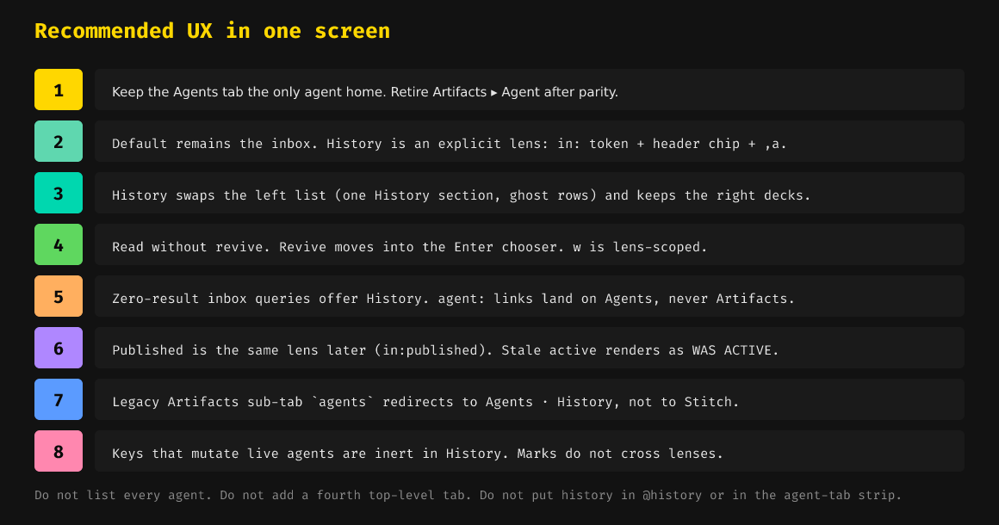

---

## 2. What exists today

The two surfaces were designed as different products (`plan:202608/artifacts_agents_pane.md` §1.1) and they still are. The dialects have converged (`agents_unified_query`, sunset, default on); the *places* have not.

### 2.1 Agents tab — live control room

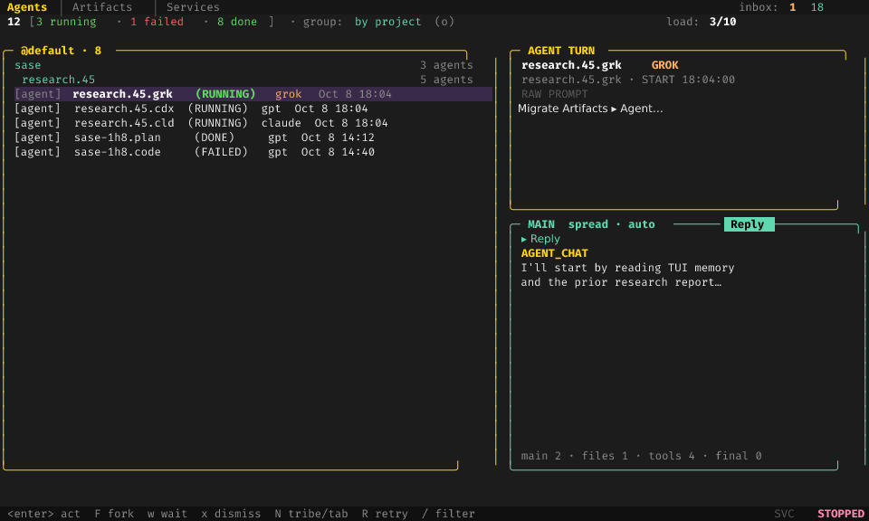

Verified against `docs/ace.md` (Agent Tabs, Navigation, Agent Actions, Grouping Modes), `src/sase/ace/tui/widgets/agents_filter_bar.py`, and visual goldens such as `agents_decks_single_main_reply_120x40.png` and `agents_filter_bar_idle_readout_120x40.png`.

| Property | Today |
| --- | --- |
| Job | Attention, unread, clans, sessions, wait/fork/kill, decks |
| Left | Tribe nav sections (`@default`, `@review`, …); session/clan trees |
| Right | Agent decks: Main (Context / Reply), Files, Tools, FINAL |
| Header | Counts + `filter:` + `group: by project (o)` + `load:` |
| Filter | Editing-only `/` bar; resting readout lives in `AgentInfoPanel` |
| Query | `agents-live` (machine, user tribe, tab, pinned, unread, `text:`) |
| Dismissed rows | Excluded by construction |
| `w` | Wait / unwait |
| `Enter` | Gate / Patch chooser |
| `o` | Grouping picker + Split/Merged/All-tabs ladder |
| `p` | Deck picker (`m`/`f`/`t`/`n`) |
| `I` | Show/hide **non-run inbox** rows (not history) |
| `!R` | Restore modal; **Custom revival search opens Artifacts ▸ Agent** |
| `agent:` miss | Toast: *Agents tab filter hides it — showing Artifacts ▸ Agent* |

This is the good reader. It is an incomplete catalog.

### 2.2 Artifacts ▸ Agent — historical catalog

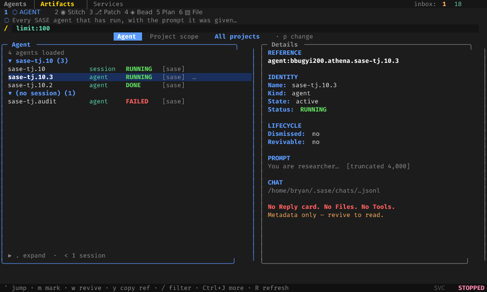

Verified against `docs/ace.md` § Agent Pane, `src/sase/ace/tui/widgets/artifacts/agents_{pane,list,detail,query,revival,options}.py`, and goldens `artifacts_agents_populated_120x40.png` / `artifacts_agents_session_grouped_120x40.png`.

| Property | Today |
| --- | --- |
| Job | Find, inspect metadata, revive, resolve `agent:` refs |
| Strip | Digit `1` · ⬡ Agent (accent `#0062FF`) |
| Left | Flat catalog, grouped Session / State / Project (`o`/`O`) |
| Right | Metadata dump: identity, lifecycle, 4,000-char prompt, **chat path**, hosted page |
| Filter | Persistent `/` bar, `limit:`, project scope `p` |
| Query | `agents` (state, dismissed, revivable, linked, relation, artifact, `limit:`) |
| First paint | 500 rows, then full catalog off-thread |
| `w` | Revive |
| `Enter` | No preview reader (unlike Beads/Files/Stitches) |
| `%` | Copy group `artifacts_agents` (reference, name, prompt, chat, json, …) |
| Relation rail | `.` expand; family / clan / parent / retry / links |
| Sidecar | Detail may show a page URL; the **list is local-only** |

The pane's own brief promises "the work it left behind." The Details panel does not show that work. Reply, diffs, and tool calls live only in the Agents decks, and those decks currently require a live node.

### 2.3 The join is a toast

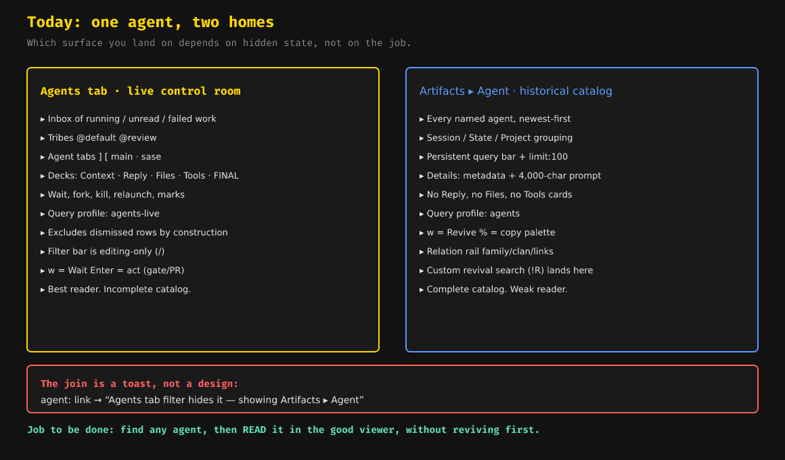

Two concrete seams admit the split:

- `src/sase/ace/tui/actions/_link_follow_toast.py` — `Agents tab filter hides it — showing Artifacts ▸ Agent`
- `src/sase/ace/tui/actions/agents/_revive_flow.py` `_open_custom_revival_search` — switches to the Agent pane and seeds `state:dismissed AND revivable:true`

A user who follows `agent:research.36.grk` or who presses Custom revival search leaves the control room for a weaker viewer. That is the UX defect this migration exists to close.

### 2.4 Key collisions (the real design problem)

The two surfaces already share physical keys with opposite jobs. Merging them without a **lens** would make `w` both Wait and Revive on the same row.

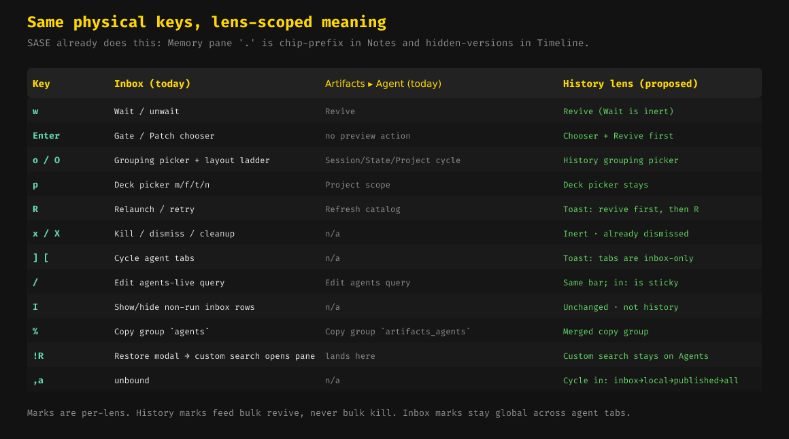

SASE already scopes a physical key by lens: on the Memory pane, `.` is the numbered-chip prefix in Notes and the hidden-versions toggle in the Timeline lens (`docs/configuration.md`, `history_toggle_hidden`). History on the Agents tab should use the same rule.

`,a` is unbound in `leader_mode.keys` today (`src/sase/default_config.yml`). It is the natural cycle for `in:`.

---

## 3. Jobs to be done

These are the pane's jobs, restated as Agents-tab jobs.

| Job | Who | Success looks like |
| --- | --- | --- |
| **Inbox** | Daily operation | Unchanged tribes, tabs, unread, wait/fork/kill |
| **Find an old run** | "What did research.36.grk say?" | Query or `,a` → History list → decks show Reply |
| **Read without revive** | Review, cite, copy | Main/Files/Tools/FINAL hydrate from the dismissed bundle |
| **Revive** | "Put it back" | `w` or Enter chooser; live node reappears in the inbox |
| **Follow `agent:`** | Links, beads, plans | Always land on the Agents tab; `^` restores the previous query |
| **Copy** | Prompt, ref, chat | One `%` palette, full prompt (not a 4,000-char trim) |
| **Browse published** | Later epic | Same lens, `in:published`, read-only, `WAS ACTIVE` never green |

The September report already proved the data shape: inbox is hundreds of rows, local dismissed is thousands, published is tens of thousands. This report takes that as given and designs the chrome around it.

---

## 4. Four ways to put history on Agents

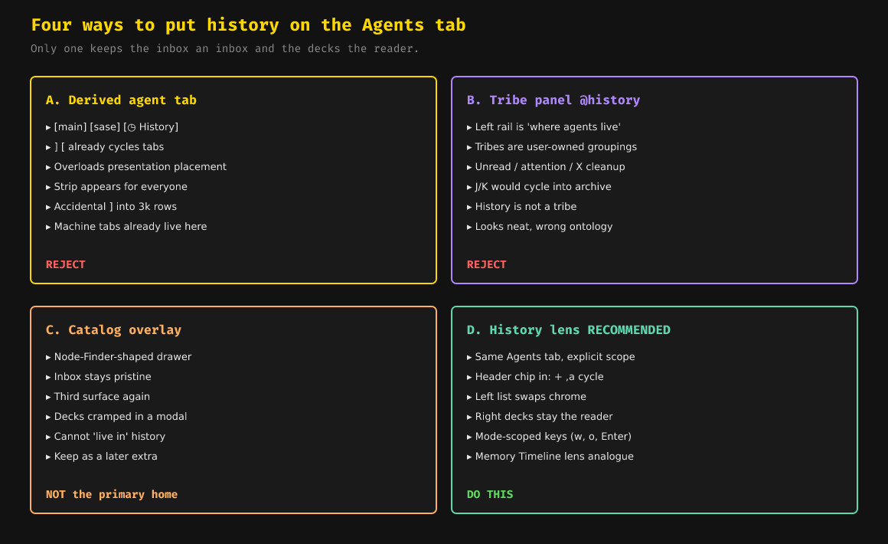

### A. Derived agent tab — reject

A `[◷ History]` chip on the agent-tab strip would reuse `] [`, which people already know. Agent tabs are **presentation-only placements of live roots** (`glossary:agent-tab`). History is a corpus, not a placement. The strip is hidden until two tabs exist; putting History there would make the strip appear for everyone, including people who never use `%tab`. Machine tabs already occupy this strip. Accidental `]` would drop the operator into thousands of ghost rows.

### B. Tribe panel `@history` — reject

The left rail is where agents live, so an `@history` panel looks neat. Tribes are **user-owned live groupings**. History rows have no unread, no wait, no kill. `J`/`K` would cycle into the archive. `X` cleanup on a tribe panel would be a loaded gun pointed at the catalog. Ontology first: history is not a tribe.

### C. Catalog overlay — not the primary home

A Node-Finder-shaped drawer, opened by `!R` custom search or `"`, would keep the inbox pristine. It is also a **third surface**. Decks need height; a modal starves them. You cannot "live in" history for a research session (this swarm is a good example of that session). Keep an overlay in mind as a later extra, not as the destination.

### D. History lens — do this

Same top-level **Agents** tab. An explicit scope (`in:` + header chip + `,a`). The left list swaps chrome (tribes and agent tabs hide; one History nav section appears). The right decks stay the reader. Keys are lens-scoped. This is the Memory pane's Timeline lens, applied to agents.

A mixed inbox+history list with a History banner is useful only as a **zero-result hint** inside the inbox (section 6.9). It is not the main list.

---

## 5. Recommended UX

### 5.1 One tab, two lenses, one reader

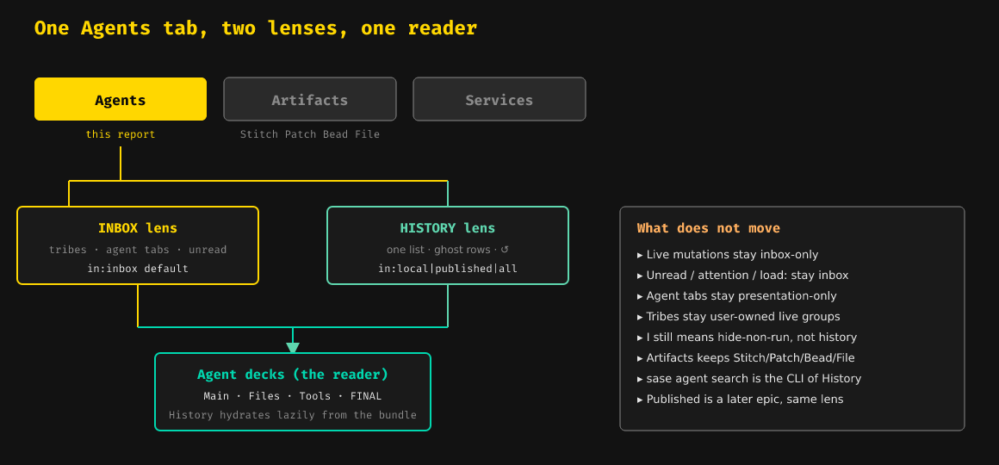

The top-level strip stays `Agents | Artifacts | Services`. Artifacts keeps Stitch, Patch, Bead, File, and provider panes. Agents gains a lens, not a sibling tab.

When History is active, a small marker on the Agents tab (`Agents*`) tells you the inbox is not showing, without inventing a fourth top-level tab.

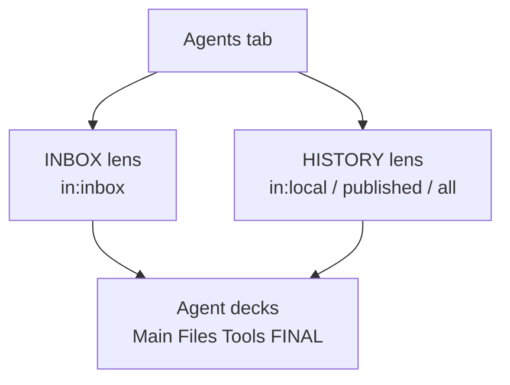

### 5.2 Default inbox stays an inbox

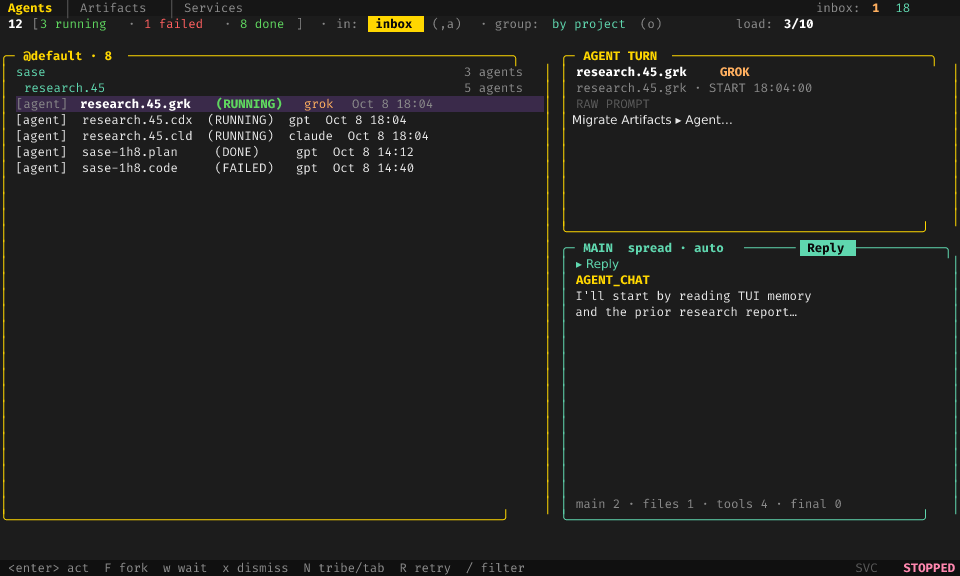

The only visual addition on first paint is a header chip:

```text
12 [3 running · 1 failed · 8 done] · in: inbox (,a) · group: by project (o)
```

Tribes, agent tabs, unread, `load:`, wait, fork, kill, decks, `I`, `N`, `] [` are unchanged. First paint and idle refresh still do no archive-scaled work (the September acceptance criterion).

Clicking `in: inbox` opens a four-row picker. `,a` cycles. `/` edits the same token.

### 5.3 History mode

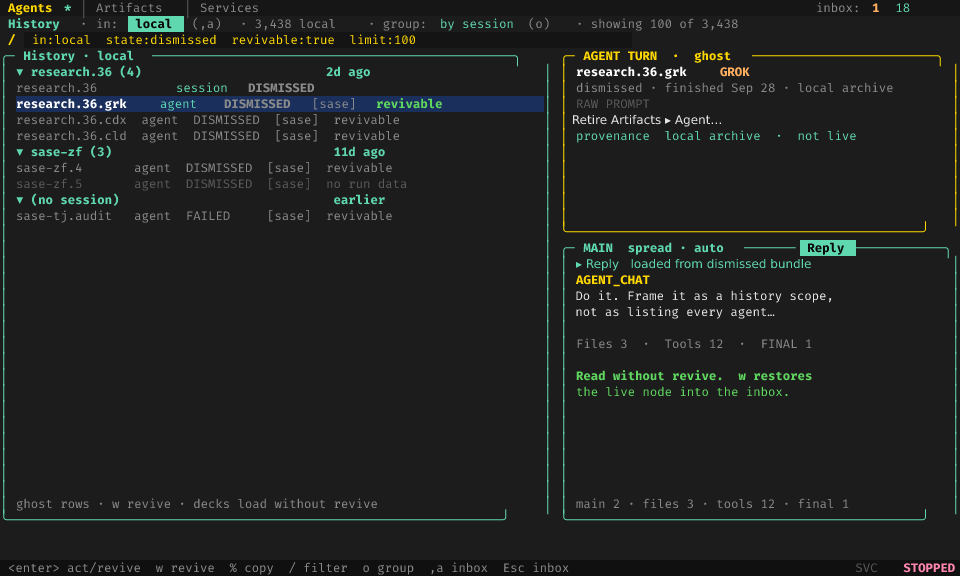

Entering History (`in:local` or wider) changes the chrome like this:

| Chrome | Inbox | History |
| --- | --- | --- |
| Top-level tab | `Agents` | `Agents*` |
| Header | counts + `in: inbox` + group + load | `History · in: local (,a) · 3,438 local · showing 100 of 3,438` |
| Left nav | Tribe panels | One **History** nav section |
| Agent-tab strip | Visible when 2+ tabs | Hidden; `] [` toasts "tabs are inbox-only" |
| Rows | Live session/clan tree | Ghost catalog rows, newest-first |
| Grouping `o` | Project / Date / Status / Machine + layout ladder | Session / State / Project / Date (pane grouping, no tribe ladder) |
| Right | Live decks | **The same decks**, lazily hydrated |
| Footer | wait, fork, dismiss, retry | revive, copy, filter, `,a inbox` |
| Filter bar | Editing-only (today) | Editing-only; `in:` is sticky when other terms change |

The persistent Artifacts-style filter bar is tempting in History because catalog browsing is query-first. Keep the Agents editing-only bar anyway: one chrome family, one `/` muscle memory. The header already shows the committed query, as it does today.

### 5.4 Scope is a chip that writes a query token

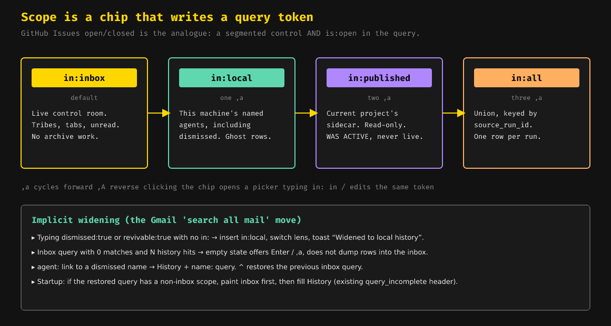

This is the GitHub Issues pattern: a segmented control **and** `is:open` in the query, the same fact.

| Token | Default | What you see |
| --- | --- | --- |
| `in:inbox` | yes (implicit) | Live control room |
| `in:local` | one `,a` | This machine's named agents, including dismissed |
| `in:published` | two `,a` | Current project's sidecar, read-only |
| `in:all` | three `,a` | Union, one row per `source_run_id` |

Pick `in:` over `scope:`. Artifacts already uses "project scope" for a different idea (`p` on a pane). One token, no alias.

**Implicit widening** (the Gmail "search all mail" move):

- Typing `dismissed:true` or `revivable:true` with no `in:` inserts `in:local`, switches the lens, and toasts *Widened to local history*.
- An inbox query with 0 matches and N history hits stays empty and **offers** History (next section). It does not dump those N rows into the inbox.
- Startup with a restored non-inbox query paints the inbox first, then fills History, using the existing `query_incomplete` header.

`sase agent search` gains the same `in:` token (default `local` for CLI compatibility, as the September report recommended). TUI and CLI return the same ordered identities.

### 5.5 Ghost rows

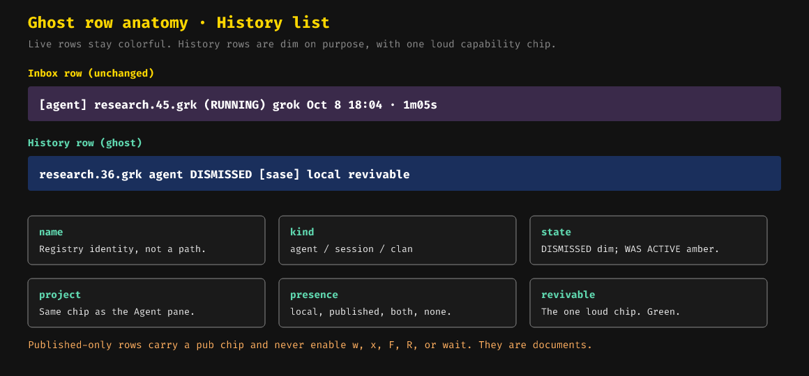

Live rows stay colorful. History rows are dim on purpose. The only loud chip is **revivable**.

A History row shows, in order:

1. **name** — registry identity, the same key `agent:` uses
2. **kind** — agent / session / clan / workflow
3. **state** — `DISMISSED` dim; published `WAS ACTIVE` amber, never green
4. **project**
5. **presence** — `local` / `published` / `both` / `no run data`
6. **revivable** — green, only when `w` will work

Published-only rows carry a `pub` chip and enable none of `w`, `x`, `F`, `R`, or wait. They are documents you can read and link.

History rows never feed unread, attention, `load:`, clans, or bulk kill. Marks are **per-lens**: History marks feed bulk revive; inbox marks stay the global marks they are today.

### 5.6 Read without revive

This is the user-visible win. Selecting a ghost row opens the **real Agents decks**:

- **Main** — full prompt (Context) and the retained chat (Reply), not a 4,000-character trim and a path
- **Files** — retained diffs, one card per file
- **Tools** — LLM Calls, when retained
- **FINAL** — host-owned finalizers, when the run finalized

Hydration is lazy, off the event loop, selection-generation guarded — the same `DetailPanelDebouncer` rule the pane already uses, pointed at deck cards instead of a Static.

A missing bundle shows a card empty-state: *Not retained — `w` revive to restore live files.* Reading still does not create a live node.

The September report's "read without revive" requirement becomes a visible layout, not only a data path.

### 5.7 Enter chooser: revive is optional

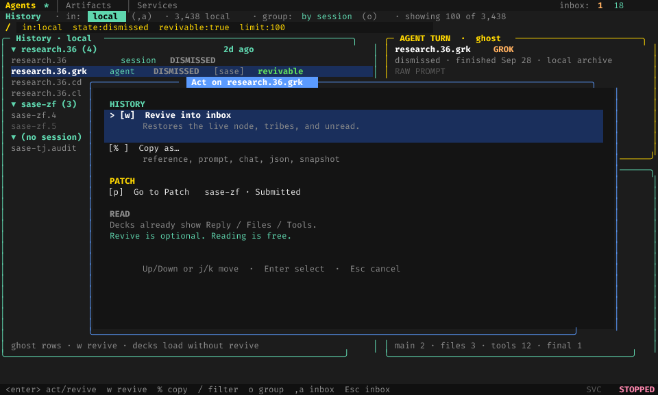

Inbox `Enter` already opens `agent_action_chooser_modal` (gate, Patch, …). History adds a **HISTORY** section at the top of that chooser:

- `[w] Revive into inbox` — restores the live node, tribes, unread
- `[%] Copy as…` — merged copy group
- `[p] Go to Patch` — when a Patch is recorded
- A dim **READ** note: decks already show the run; revive is optional

`w` in History is Revive (lens-scoped). `w` in the inbox stays Wait. Help lists both on one row: `w  Wait (inbox) / Revive (history)`.

`R` (retry/relaunch) in History toasts *Revive first (`w`), then retry.* It does not silently relaunch from the archive in v1.

`x` / `X` in History are inert: *Already dismissed. `w` to revive.*

### 5.8 Three entry paths, one landing

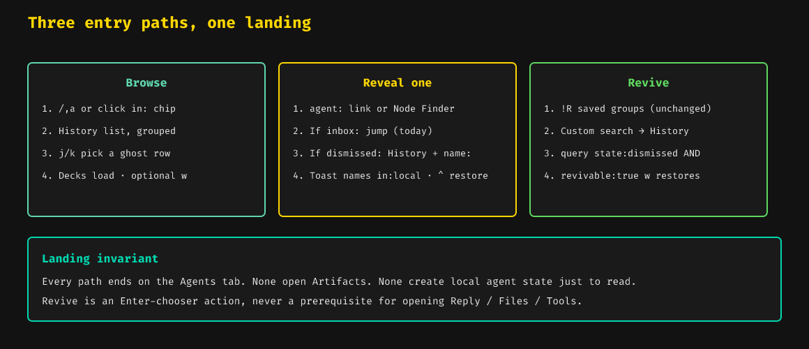

**Browse.** `,a` or click the `in:` chip, or type `in:local` in `/`. History list, `j`/`k`, decks load, optional `w`.

**Reveal one.** `agent:` link, `$` follow, or Node Finder:

- Target is in the inbox → jump (today)
- Target is hidden by the inbox filter → widen or clear the filter on the Agents tab (today's Artifacts fallback goes away)
- Target is dismissed or published → History + `name:<that>`; toast names `in:local`; `^` restores the previous inbox query

**Revive.** `!R` saved groups stay a modal (unchanged). **Custom revival search** stays on the Agents tab, seeded with `in:local state:dismissed AND revivable:true`. It no longer calls `_switch_artifacts_subtab("agents")`.

Landing invariant: every path ends on the Agents tab. None open Artifacts. None create local agent state just to read.

Node Finder (`"`) stays an inbox/hidden-live finder. A dismissed hit in its empty state can offer the same *N in local history · Enter* hint. It does not grow a 3,000-row archive corpus in v1; History `/` is that corpus.

### 5.9 Zero-result hint (Gmail's "search all mail")

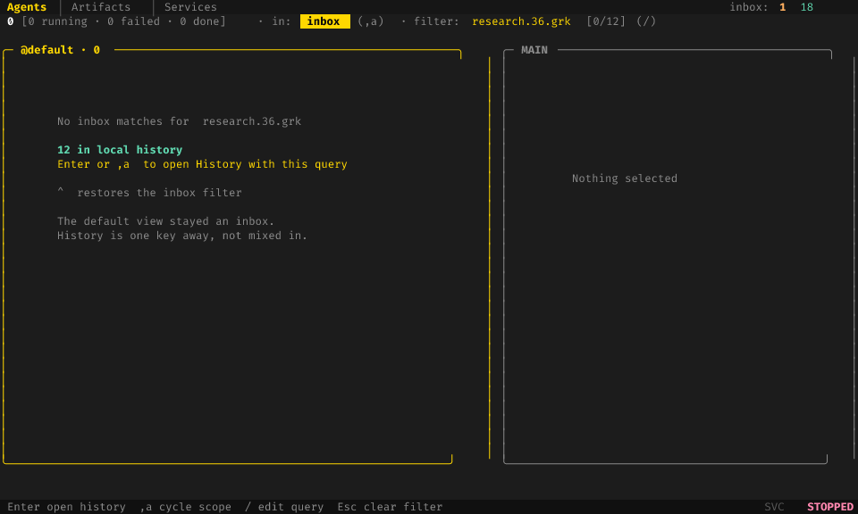

An inbox query that matches nothing and that History would match **N** times keeps the inbox empty and says so:

```text
No inbox matches for  research.36.grk

12 in local history
Enter or ,a  to open History with this query
^  restores the inbox filter
```

This is how operators discover the lens without reading a changelog. The default view stays an inbox.

### 5.10 Artifacts after retirement

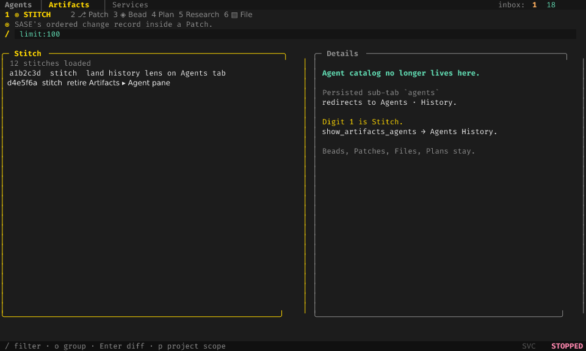

| Today | After |
| --- | --- |
| `1` ⬡ Agent | `1` ◉ Stitch |
| `2` Stitch … `6` File | Stitch, Patch, Bead, providers, File (digits shift down) |
| `show_artifacts_agents` | Agents: show History (`in:local`) |
| Persisted sub-tab `agents` | **Redirect to Agents · History** |
| `!R` custom search | Agents History, seeded query |
| `agent:` fallback toast | Agents History + `name:` |

**Dissent from the September P4 mapping.** Mapping `LEGACY_ARTIFACTS_SUBTABS["agents"]` to `"stitches"` follows the Chats precedent and avoids a crash. It also drops a person who still has `agents` persisted onto Stitch, which is the wrong catalog. Chats had no sibling destination. Agent does: the Agents tab History lens. Redirect there, with a one-time toast: *Agent catalog moved to Agents · History. `,a` to cycle.* Digit `1` is still Stitch for new sessions.

Copy palettes merge: History uses the union of `agents` and `artifacts_agents` (full prompt, not `P` vs `p` split). Saved `agents` queries migrate into the Agents query history under the unified schema.

### 5.11 What does not move

- Live mutations (wait, fork, kill, relaunch, tribe/tab) stay inbox-only
- Unread, attention, `load:` stay inbox-only
- Agent tabs stay presentation-only placements of live roots
- Tribes stay user-owned live groups
- `I` still means hide-non-run **inbox** rows
- Artifacts keeps Stitch / Patch / Bead / File / Plans / Research
- `sase agent search` is the CLI of History
- Published sidecar history is the same lens, a later epic (`in:published`)
- The catalog package stays; the pane widgets go

---

## 6. First-party analogues (why this chrome)

| Analogue | What to steal |
| --- | --- |
| **Memory Timeline lens** (`@`) | Same panel, different left rail, keys re-scoped, `p`/`P` already a scope ring elsewhere |
| **GitHub Issues `is:open`** | Segmented control and query token are the same fact |
| **Gmail search-all-mail empty state** | Zero-result hint, not a mixed inbox |
| **Things 3 Logbook** | Separate list, same inspector (here: same decks) |
| **Agent Restore modal** | Saved groups stay a modal; only custom search retargets |
| **Chats pane retirement** | Digit shift + legacy map; we retarget the map at History |

The Memory pane is the strongest in-app proof that SASE operators already accept "this panel is now history of the same thing."

---

## 7. What changed since 2026-09-28 (so the UX can assume it)

Checked in this workspace on 2026-10-08:

- `AGENT_ARTIFACT_INDEX_SCHEMA_VERSION` is **36**, with `SUPPORTED_AGENT_ARTIFACT_INDEX_SCHEMA_VERSIONS = {33, 34, 35, 36}` in `src/sase/core/agent_scan_wire_records.py`.
- The catalog reader in `src/sase/agents/catalog/_sources.py` still **exact-matches** the current version and returns `{}` on mismatch. The September P0a "accept supported versions / degrade enrichment" fix is not fully in this path. History decks that rely on index enrichment still need that fix, independently of chrome.
- `agents_unified_query` is still a default-on **sunset** flag (`sase-zg`). Finish the sunset before adding `in:` so there is one query path to extend.
- Agent decks, agent tabs, the Enter chooser, and the Restore modal are all in production now; the September report could only point at them. This UX treats them as the destination widgets.

This report does not re-litigate "do it." It specifies how the Agents tab should look and behave once it is the only agent home.

---

## 8. UX landing sequence

Chrome can ship ahead of published sidecar history.

| Phase | UX that becomes true | Notes |
| --- | --- | --- |
| **U0** | Catalog enrichment no longer silently empties on schema drift | Unblocks truthful History rows |
| **U1** | Header `in: inbox` chip + `,a` no-op cycle of one value; help row | Discoverable, zero corpus change |
| **U2** | `in:local` switches the left list to History; decks hydrate from dismissed bundles | Read without revive |
| **U3** | `w` / Enter chooser revive; `!R` custom search retarget; `agent:` fallback retarget; zero-result hint | Pane jobs have a new home |
| **U4** | Copy palette merge; saved-query migration; persisted `agents` sub-tab redirects to History | Muscle-memory bridge |
| **U5** | Behind a sunset flag, delete the pane; Stitch becomes digit `1`; glossary Nav Section/Item | Only after U3+U4 parity tests |
| **U6** | `in:published` / `in:all`, `WAS ACTIVE`, `pub` chip, read-only | Second epic; same lens |

U1 is cheap and teaches the chip before the list changes. U2 is the product. U5 is deletion, not a UX experiment.

---

## 9. Risks the chrome has to absorb

- **`w` Wait vs Revive.** Lens-scoped meaning, help-modal row, footer swap. Getting this wrong is the highest-severity UX bug in the migration.
- **Mixing live and ghost rows.** Never. Reveal is a query, not an insert.
- **Agent-tab strip as History.** Rejected; `] [` in History toasts.
- **`I` as a back door into dismissed rows.** `I` stays hide-non-run. History is `,a` / `in:`.
- **Published `active` looking live.** `WAS ACTIVE` amber, mutations off. The September freshness findings still apply.
- **Startup with a History query.** Paint inbox first (U2 rule), then fill. The inbox is what you quit into.
- **j/k p95.** History uses the pane's bounded option list + `limit:`, not a fully hydrated Agent-object tree. Keep the 16 ms contract; ghost rows are `AgentCatalogRow`, not live `Agent`.

---

## 10. Summary of recommended UX

**The Agents tab becomes the only agent home, by growing a History lens.**

1. **Inbox is the default.** Tribes, agent tabs, unread, wait/fork/kill, and decks stay exactly as they are. A header chip `in: inbox (,a)` is the only new chrome on first paint.

2. **History is a lens, not a place.** `,a` / the chip / typing `in:local` swaps the left list to one History nav section of ghost rows and keeps the right-hand decks. The top-level strip stays three tabs. The agent-tab strip and tribes hide for the duration of the lens.

3. **`in:` is the query token.** `inbox` (implicit) → `local` → `published` → `all`. The chip and the `/` bar write the same token. Archive fields widen the scope. Zero-result inbox queries offer History; they do not mix rows.

4. **Read without revive.** Selecting a ghost row hydrates Main / Files / Tools / FINAL from the dismissed bundle. Revive is `w` and an Enter-chooser action. Reading creates no live node.

5. **Keys are lens-scoped.** `w` Wait in inbox, Revive in History. `o` keeps grouping but drops the tribe layout ladder. `p` stays the deck picker. `R` / `x` / `] [` toast instead of mutating. `,a` is the new chord. Marks do not cross lenses.

6. **Every current pane entry path lands on Agents.** `agent:` links, `!R` custom search, `show_artifacts_agents`, and a persisted Artifacts sub-tab `agents` all open History. None open Artifacts. Legacy redirect goes to History, not to Stitch.

7. **Published is the same lens later.** `in:published`, `pub` chip, `WAS ACTIVE`, read-only. No second tab, no import.

The operator's loop becomes: stay in the inbox while work is live; `,a` when you need the past; read in the decks you already trust; `w` only to bring a run back.


---

## Sources

- Prior research: `research:202609/agent_history_in_agents_tab/agent_history_in_agents_tab.md`
- Plan: `plan:202608/artifacts_agents_pane.md` (§1.1 two products, §2.5 promotion trigger)
- Docs: `docs/ace.md` (Agent Pane, Agent Tabs, Keybindings, Grouping Modes); `docs/configuration.md` (`ace.agent_tabs`, Memory pane Timeline keys); `docs/query_language.md`
- Memory: `tui.md` / `tui_perf.md` / `tui_screenshot.md`; glossary Agent Tab, Agent Data Deck, Nav Item, Nav Section, Agent Node
- Code: `src/sase/ace/tui/widgets/artifacts/agents_*.py`; `agents_filter_bar.py`; `agent_info_panel.py`; `actions/agents/_revive_flow.py`; `actions/_link_follow_toast.py`; `query_profile/profiles/_agents.py` and `_agents_live.py`; `default_config.yml` keymaps; `feature_flags/registry.py` (`agents_unified_query`); `agents/catalog/_sources.py`; `_artifact_tab_model.py` (`FIXED_ARTIFACTS_SUBTAB_ORDER`, `LEGACY_ARTIFACTS_SUBTABS`)
- Visual goldens: `tests/ace/tui/visual/snapshots/png/artifacts_agents_populated_120x40.png`, `artifacts_agents_session_grouped_120x40.png`, `agents_decks_single_main_reply_120x40.png`, `agents_filter_bar_{idle_readout,editing}_120x40.png`, `agent_action_chooser_modal_120x40.png`, `saved_agent_group_revival_normal_120x40.png`, `node_finder_search_160x48.png`
