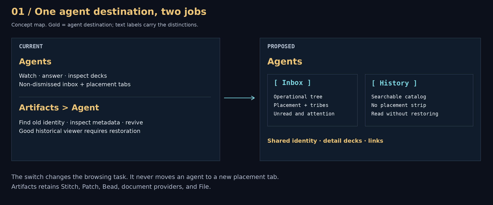
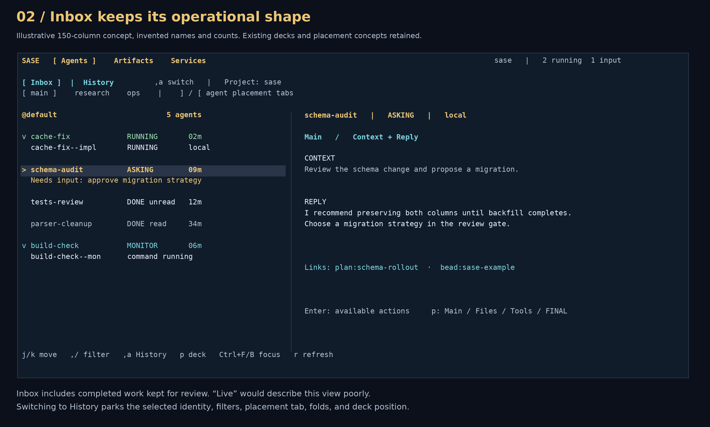
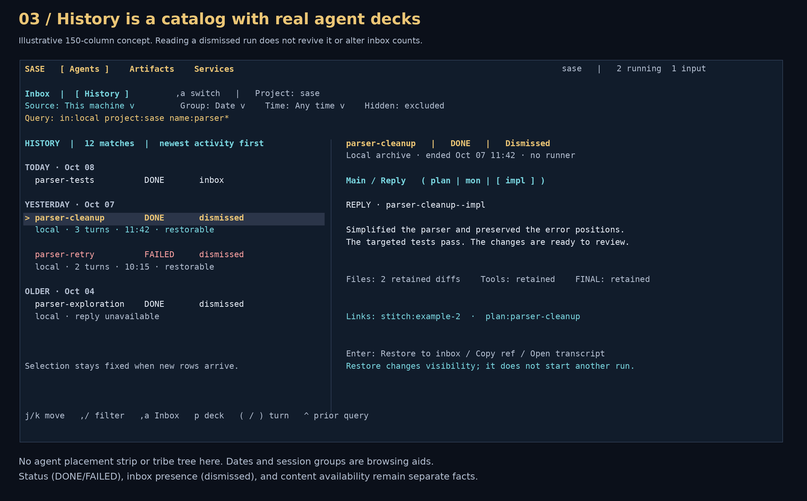
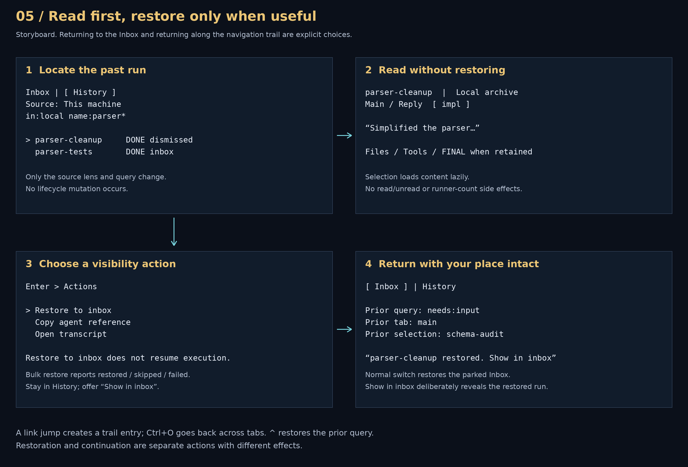
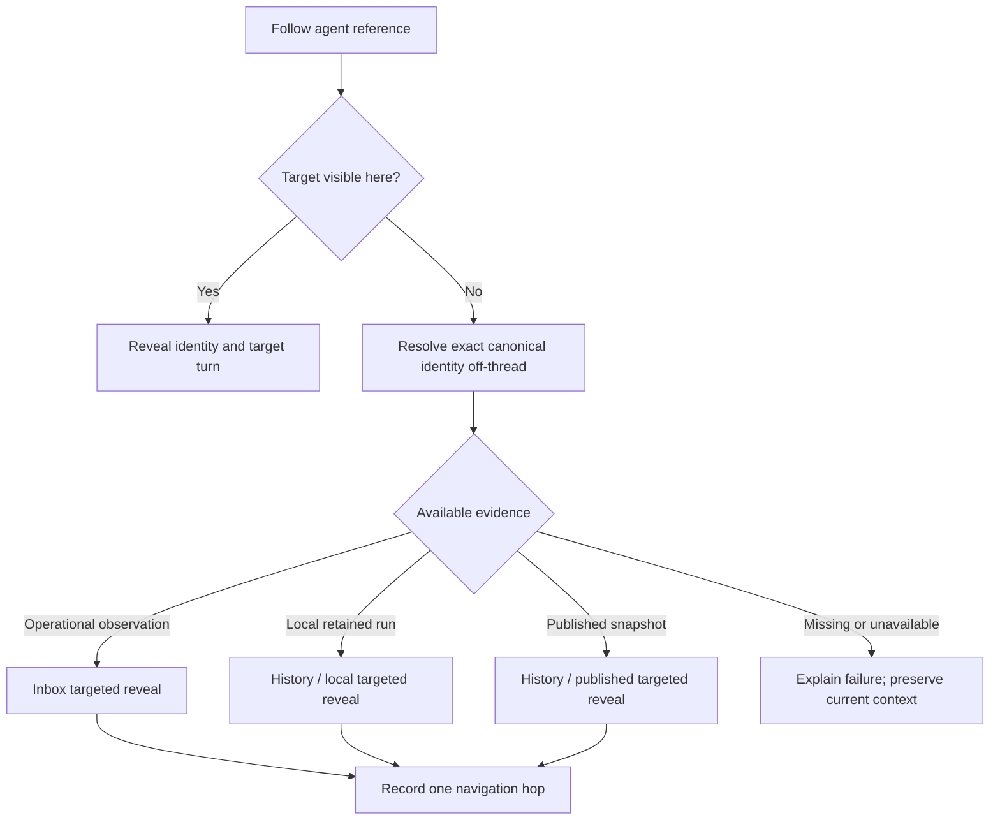
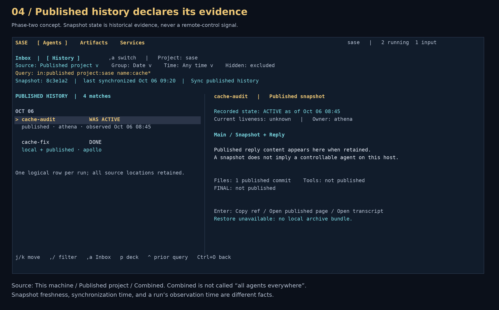
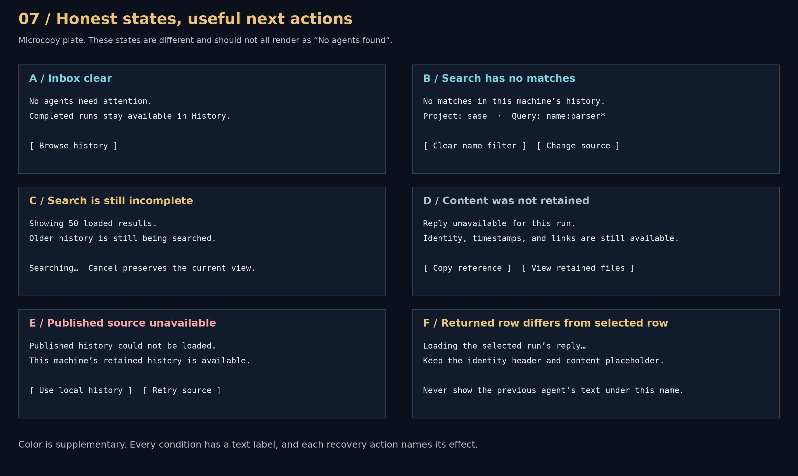

# Agents Inbox and History: an interaction atlas

**Independent researcher:** cdx · **Date:** 2026-10-08 · **Deliverable:** UX research and design recommendation, not an implementation or usability-test result.

Give the top-level **Agents** tab two visible views: **Inbox** for supervising work and **History** for finding and reading retained runs. Keep agent identity, detail decks, references, and navigation shared. The central improvement is being able to read a dismissed agent’s reply and files without restoring it first.

This report builds on the requested [earlier consolidated study](../202609/agent_history_in_agents_tab/agent_history_in_agents_tab.md), then independently checks the current Python/TUI code and relevant external product documentation. I did not consult any reports or findings from the current research.45 swarm. Historical measurements from the earlier study are attributed to that study; I did not remeasure the archive, examine live personal history, or test these proposals with users.

## 1. Visual approach and reading guide

Seven figures show the destination structure, a normal Inbox, local History, published History, the restoration journey, a narrow terminal, and incomplete/error states. They are deliberately **terminal concepts**, with monospaced rows and cell-bounded text, rather than browser dashboard pictures. Names, dates, hashes, counts, replies, and references inside them are invented examples. They are not screenshots of implemented behavior.

Each figure is embedded as PNG for ordinary Markdown rendering, with an editable SVG alongside it. Textual explanations and tables carry the same decisions for readers who cannot view images. The [Pillow generator](agents_inbox_history_interaction_atlas__cdx_assets/generate_figures.py) is included so the visuals can be reproduced. No generative image model was needed: exact navigation labels, readable small text, and consistent geometry matter more here than illustration.



*[Editable destination map](agents_inbox_history_interaction_atlas__cdx_assets/01_destination_map.svg). The new switch chooses a browsing task. It does not assign an agent to a presentation tab.*

## 2. What is established, and what this report adds

The earlier study’s central direction is sound: retire Artifacts ▸ Agent, introduce a history scope, read old runs in the actual Agents decks, and keep published snapshots separate from operational agents. Its September 28 corpus counts and data-quality findings are historical context, not October measurements.

The current checkout still supports the underlying motivation:

| Observation checked in this checkout | UX consequence |
| --- | --- |
| `TAB_ORDER` is Agents, Artifacts, Services; Agents is the default startup tab. | There is already a natural primary home for agents. |
| Artifacts registers its own `agents` pane and assigns it the first digit shortcut. | Removing it affects saved navigation and positional shortcuts, not just layout. |
| `load_agents_snapshot()` loads a bounded 500-row head, tracks completeness, and sorts newest start time first. | A history viewer already has a lightweight catalog foundation; it must distinguish loaded results from complete results. |
| The pane’s detail renderer previews at most 4,000 prompt characters and shows chat/page locations. | Moving only the widget would preserve a weaker historical reading experience. |
| The top-level Agents query editor hides when not being edited; its resting query display belongs to `AgentInfoPanel`. | A persistent source/view label should fit the existing info header instead of adding another permanent input box. |
| The two query schemas still differ. `tribe` is a user-defined tribe in `agents-live`, but a clan category in `agents`. | Saving filters across the migration needs semantic translation. Copying strings alone is unsafe. |
| The custom revival flow still opens Artifacts ▸ Agent, and the link-follow toast still describes falling back there. | Both entry points must land in Agents History before the old pane can disappear. |
| The default bindings use `w` for Agents reword, `p` for decks, `H` for hooks/collapse, and `[`/`]` for agent placement tabs. Leader `,a` is absent. | A new view switch needs its own binding. Reusing archive `w` or placement-tab cycling would be confusing. |

**What I would refine from the earlier recommendation:**

1. Make **Inbox / History** visible and clickable; expose `in:` through normal query completion as well. The query is the canonical state, but the user should not have to discover a special token to learn that history exists.
2. Make `,a` a **two-view toggle**, restoring each view’s parked context. The earlier scope cycle, inbox → local → all, makes a simple return gesture depend on which data source the user last chose.
3. Put local/published/combined choices in a **History source selector**, separate from the two-view switch and from agent placement tabs.
4. Prefer explicit source changes for ordinary search. A link reveal may change scope transparently, but entering an archive-specific filter should not silently transform the screen.
5. Use **Restore to inbox** as the explanatory label for revival. Reading, restoring visibility, and launching another turn are three different interactions.

These are product-design judgments, not measured preferences.

## 3. Alternatives and the decision

| Candidate | What works | Main cost | Verdict |
| --- | --- | --- | --- |
| Add retained agents to the normal tree | One layout everywhere | Dismissal loses its clearing effect; placement, container state, counts, and bulk actions become harder to understand | Reject as the default |
| Add a special `[History]` agent placement tab | Minimal new navigation chrome | A placement tab describes where current agents are presented; history is a cross-placement corpus | Reject |
| Move the current Artifacts pane into Agents unchanged | Small mechanical move | Keeps metadata-only detail, a separate query profile, and revival as the route to useful reading | Transitional scaffold only |
| Expose history only through `in:` queries | Very compact for expert users | Poor discovery and weak visible distinction between supervision and historical inspection | Keep as an expert entry point |
| Visible Inbox / History with shared decks | Clear tasks, readable history, reversible navigation | Requires context preservation and a capability-aware detail adapter | **Recommend** |

“History” describes the task of looking back. It is not equivalent to “dismissed”: a completed run may remain in the Inbox while also being discoverable in History. “Inbox” is preferable to “Live” because the operational view also contains completed and unread work waiting for review.

External precedents support individual pieces, rather than proving this whole design:

- **GitHub Actions** provides a run list leading to a run summary and job/step logs. **Inference for SASE:** keep list navigation and detailed reading together under the entity’s primary destination. [GitHub workflow history documentation](https://docs.github.com/en/actions/how-tos/monitor-workflows/view-workflow-run-history).
- **Temporal Web UI** lists executions with status and time filters and opens an execution’s history, relationships, and metadata. Its saved views can be built through filters or raw queries. **Inference:** query-driven views can have visible controls; the two interfaces should describe one state. [Temporal Web UI documentation](https://docs.temporal.io/web-ui).
- **Temporal’s saved-view introduction** includes Running, Today, and All Workflows as different system views of one corpus. **Inference:** a view is a reusable query, not a new identity or storage lifecycle. This does not imply that SASE should adopt Temporal’s all-workflows default. [Temporal saved views](https://temporal.io/blog/introducing-saved-views-in-temporal-web-ui).

## 4. Recommended information architecture

```text
Agents                         Artifacts                    Services
  Inbox | History                Stitch / Patch / Bead / ...
    Inbox:
      main / named / machine placement tabs
      tribe panels and operational tree
    History:
      source + project + grouping + time controls
      one historical results navigation section
  Shared agent identity header, decks, links, and navigation trail
```

The view switch occupies one persistent header position. On wide terminals it can share the existing metrics row. When space is scarce, the view name and query remain visible while secondary counts move into the existing summary surface. Historical match counts are labeled as search results, never added to running, needs-input, or unread totals.

The switch and the placement strip must look like different levels. Use **Inbox | History** above the placement strip. Show the placement strip only in Inbox, where `[` and `]` retain their existing meaning. In History, grouping and source controls replace that strip. Do not relabel the placement strip itself as Inbox/History or assign old records to a synthetic `%tab:history`.

### 4.1 Inbox



*[Editable Inbox concept](agents_inbox_history_interaction_atlas__cdx_assets/02_inbox.svg). Completed rows stay visible until the user clears them; the History switch does not change that behavior.*

Entering Inbox resumes supervision. Its tree, tribes, placement tabs, attention flow, unread semantics, deck splits, and action availability continue to derive from operational data. Standalone named procs and workflow steps keep their existing operational place; moving the Agent archive pane does not automatically promise a durable archive for every non-agent node type.

### 4.2 History



*[Editable local History concept](agents_inbox_history_interaction_atlas__cdx_assets/03_local_history.svg). Reading the reply requires no restoration. The retained-content labels are examples of capabilities, not promises that every archive has those files.*

Use a compact results list with a persistent source, project, and query summary. First entry defaults to retained history on **This machine**, inherits the current project as a visible filter, and uses **Any time**. “All projects” is available explicitly. Do not add an invisible seven-day or thirty-day cutoff: someone looking for last month’s work should not conclude that it vanished.

The first page can remain bounded, but the query must eventually cover the chosen corpus. A page size or loading limit is not the same thing as a date filter. While reconciliation is incomplete, say **“Showing 50 loaded results; searching older history…”**, not **“50 matches”** or **“No matches.”**

For v1, keep the data-source label literal: **This machine** means locally owned/retained identities; a fleet-only observation remains an Inbox target unless there is local durable evidence or a published snapshot. This is a deliberate refinement of the earlier proposal’s `in:local = Inbox + archive` wording, which would make “This machine” include fleet-only rows. If implementation retains that older union, label it **Inbox + local archive** instead. Source labels and source semantics must agree; do not hide the difference in documentation.

Default sorting should be newest **recorded activity** first, so a session continued yesterday is not buried under its original launch date. This is a proposed enhancement: the current catalog sorts by start time. Specify the new timestamp consistently in the shared backend: latest recorded turn activity where available, otherwise finish time, otherwise start time, with unknown time last and a deterministic identity tie-breaker. Do not infer time from file mtime. Date headings use that same timestamp and local timezone; detail shows the exact timestamp and timezone.

Retain one selectable row per standalone agent or session where the catalog can establish that identity reliably. A session row shows its number of turns and lands on the latest retained reply block. A query matching one member should show **“1 matching turn / 3 turns”** and land on that member, rather than displaying an unrelated final reply. Exact `agent:<session>--<suffix>` targets remain revealable. Containers and their members are not counted twice as unrelated agents. If canonical session grouping is unavailable for v1, show existing catalog rows with Session grouping and clearly labeled row counts; do not deduplicate by string heuristics.

Only the selected row needs its second explanatory line. Unselected rows remain compact. This helps the wide mockup’s generous spacing collapse into a practical dense list:

| Field | Row treatment |
| --- | --- |
| Name | Stable local display name; full canonical name in identity detail and copy action |
| Run status | DONE, FAILED, etc.; words as well as color |
| Inbox presence | `in inbox`, `dismissed`, or `hidden`; separate from run status |
| Source | `local`, `published · machine`, or `local + published` |
| Time | Short relative or local time in row; exact time in detail |
| Content | Selected-row summary such as `reply + 2 diffs retained` or `reply unavailable` |
| Restoration | `restorable` only when backed by a valid local bundle |

Default grouping is Date, with Session, Project, State, and Machine available where supported. Group headings are navigation chrome; collapsed selectable banners follow the existing nav-item convention. They are not live agent nodes and do not acquire aggregate operational state.

## 5. Search and context preservation

### 5.1 One query state, two entry styles

Keep the earlier study’s `in:inbox|local|published|all` spelling as the proposed canonical scope selector. The concrete UI labels should be more explanatory:

| Canonical selector | View | User-facing source |
| --- | --- | --- |
| `in:inbox` or implicit initial default | Inbox | Operational inbox, including observed fleet rows |
| `in:local` | History | This machine; local durable evidence, including retained non-dismissed runs |
| `in:published` | History | Published project; snapshots in the selected project’s locally available sidecar |
| `in:all` | History | Combined; local retained history plus published snapshots for the selected project |

The last label must not imply every project, every machine, or every unpublished run. “All” is an internal union token; **Combined** is the honest product label. Published browsing initially supports one explicitly selected project. If local history is currently on All projects, selecting Published asks for a project in the source picker rather than silently choosing one.

Changing a source or project control rewrites the canonical query through the existing commit/history path. Typing `in:published` updates the same controls. Saved queries include the selector; there is no extra hidden boolean that can disagree with the displayed query. The schema still needs migration before these new tokens are real; all examples here are proposals.

Suggested tasks:

```text
in:local project:sase name:parser*
in:local dismissed:true revivable:true
in:local project:sase relation:implements
in:published project:sase name:cache*
in:all project:sase provider:codex
```

Do not imply that bare words search every historical transcript. Distinguish metadata search from a future indexed full-text search, and name the limitation in completion/help. A source may support identity and metadata while lacking transcript text, live `needs`, placement, or unread fields. Warn about unsupported field/source combinations when committing; do not silently interpret missing fields as known false or silently omit unsearched sources.

For an Inbox query containing an archive-specific term such as `dismissed:true`, I recommend an explicit inline suggestion: **“Dismissed agents are in History. Search local history with these filters.”** Activating it commits `in:local`. Ordinary typed queries do not implicitly switch views. This diverges from the earlier report’s automatic widening recommendation, to make the layout change predictable. A user who deliberately types `in:local` already expressed that intent.

The same principle applies to zero results. Offer **Search local history** while preserving the typed filter. Show an exact alternate-scope count only if a complete indexed count is available; otherwise say **“There may be matches in History”**. Never trigger an archive-wide scan synchronously for the hint.

### 5.2 Park both views independently

`Inbox → History → Inbox` should return to the same selected identity, placement tab, tribe panel, folds, query, focused deck panel, card/block, and scroll position. History separately remembers its source, project, query, grouping, selection, folds, and deck position. Store stable identities, not row indexes.

Changing source within History preserves applicable filters and selected identity if still present. It never destroys the parked Inbox query. If selection is absent after the change, choose a deterministic nearby result and indicate that the previous row is outside this source; do not silently substitute a different agent while keeping its reply on screen.

Keep preference behavior conservative: normal launches still enter Inbox. Reopening an explicitly persisted TUI session may restore History, but paint the History shell and cached/bounded results immediately while loading. Showing Inbox while announcing a History query would momentarily display the wrong task.

Three commands have distinct meanings:

| Gesture | Contract |
| --- | --- |
| `,a` | Switch between parked Inbox and History views |
| `^` | Restore the prior committed query using existing query-history semantics |
| `Ctrl+O` | Go back along the existing navigation trail, including across top-level tabs |

Do not repurpose `Tab`, `H`, `p`, `w`, or `[`/`]` for the view switch. `,a` is an available default in this checkout, but must be added through the keymap registry/config and displayed through configured key names. Source selection also needs clickable and command-palette entry points; its shortcut can remain unbound in v1.

## 6. Reading, restoring, and acting

The selected historical identity opens the normal Main, Files, Tools, and FINAL decks through a history content adapter. Keep the same split and card controls. Content availability determines which cards have data; a missing reply is an informative state, not an invitation to restore and hope for the best.

For sessions, retain the existing Reply block rail and `(`/`)` stepping. Show which turn supplied the current reply, files, and tools. When a filter matched an earlier turn, that match takes precedence over the default newest block. A monitor’s output remains labeled Output. A clan summary remains a summary, not a fabricated single transcript.



*[Editable restoration storyboard](agents_inbox_history_interaction_atlas__cdx_assets/05_restore_storyboard.svg). Panel 3 shows the user deliberately moving to the restore action; restoration should not be the chooser’s preselected default.*

**Enter opens available actions**, consistent with the Agents action model. Select a reading action by default, such as Open transcript when available or Copy reference otherwise. A historical row already previews its reply on selection; Enter should not mutate merely because someone wants to read more.

Call the existing revive capability **Restore to inbox**, with the subtitle **“Shows retained work again; starts no new run.”** A discoverable alias “revive” can remain in help and command search. Retry, resume, and fork retain their own labels and launch semantics. Do not ask for an extra approval solely to restore visibility; use the existing authorized cleanup/revival execution path.

| Selected evidence | Read retained decks | Copy/follow reference | Restore to inbox | Runtime control from History |
| --- | --- | --- | --- | --- |
| Current local Inbox identity | Yes | Yes | Already visible; offer Show in inbox | Route to Inbox before acting |
| Dismissed local bundle | Yes, if retained | Yes | Yes, if bundle capability permits | No |
| Hidden local identity | Yes, if retained | Yes | Offer the applicable reveal/unhide action; do not falsely call it revival | Route to Inbox |
| Local identity plus published snapshot | Prefer current local truth; show both sources | Yes | According to local bundle capability | Route to Inbox |
| Published-only identity | Published content only | Yes | Unavailable; explain absence of local bundle | No |
| Thin identity without run content | Metadata and links | Yes | Only if independently proven | No |

After restoring, **stay in History** and report the result: “parser-cleanup restored to inbox. Show in inbox.” A normal `,a` returns to the previously parked Inbox selection. The explicit Show in inbox action instead reveals the restored identity and records a navigation-trail hop. This avoids both an unexpected view switch during bulk work and a misleading success state in which a restored agent is hidden by the old Inbox filter.

If the History query was `dismissed:true`, a successful restore removes the row from those results. Preserve the viewport and select the next eligible row; do not make the restored row look like it still matches. A `name:parser*` query can keep the row and change its presence label to `in inbox`.

Bulk marks belong to the current historical selection context, separately from operational marks. Display **“Restore 4 selected”** with any skipped entries and their reasons; completion reports restored, skipped, and failed counts. Do not let historical selection enter existing stop/dismiss/kill bulk actions. Refresh capabilities immediately before submitting the operation: retained files or bundles may have changed since the row was loaded.

Browsing History must not clear unread status on a matching Inbox identity. It must not generate attention, occupy runner slots, change clan status, satisfy waits, or create a local agent record for a published snapshot. These are domain rules, not merely different colors on the same live tree.

## 7. References should land where the agent can be read

An `agent:` reference should resolve once to an identity and open the top-level Agents tab. Its storage location selects the narrowest truthful view; it should not decide that “agent artifacts” belong in another top-level tab.



Before changing context, capture the originating tab, selected artifact, query, and deck position. Perform targeted resolution rather than materializing the whole archive merely to open one run. If rewriting a filter is necessary, explain it and preserve one `^` restore. `Ctrl+O` returns to the originating artifact rather than just switching to a generic Inbox.

Reference reveal may intentionally override hidden-row defaults for that identity, but the header should say **Hidden** or **Dismissed**. No automatic restore occurs. An operational target already loaded in History can be read there; Show in inbox is the explicit path to runtime controls.

Retarget Files → agent, relation links, the Node Finder where appropriate, command-palette search, and `!R` custom revival search. The latter seeds History with `in:local dismissed:true revivable:true`; saved-group restoration can remain its existing chooser. The old Artifacts fallback must disappear only after these routes work.

## 8. Published history: same reading place, a different evidence contract



*[Editable published History concept](agents_inbox_history_interaction_atlas__cdx_assets/04_published_history.svg). This screen belongs to a later phase; it is not required to replace the existing local archive pane.*

Published project history should use the same History results and decks, with an explicit source marker on every published-only row. **WAS ACTIVE** is historical state; it cannot produce a running indicator, stop action, or attention signal. Terminal outcomes can be displayed as recorded outcomes with snapshot provenance visible.

Do not call the source selector “local versus remote.” A locally cached published snapshot can describe the same machine, and an observed fleet agent may actually be live. The meaningful distinction is **operational observation / retained local run / published snapshot**.

Show three separate freshness facts when known:

1. **Snapshot revision:** identifies the local sidecar version being read.
2. **Last synchronized time:** says when this clone was updated.
3. **Per-run observation/publication time:** says when that record’s state was captured.

A recent sidecar HEAD or pull does not prove that an older run’s ACTIVE state was refreshed. If observation time is unavailable, say so; do not substitute the sidecar HEAD age. Provide an explicit **Sync published history** command through the existing refresh/proc flow. Until the update completes, keep the last known snapshot and label its age.

Combined results deduplicate by stable run identity, preserving local and published provenance rather than displaying copies. Current operational evidence wins over old snapshots for liveness; local retained content may enrich a published match when it belongs to that exact identity. If sources disagree, display the conflict in detail instead of silently merging fields. The earlier study’s `source_run_id` recommendation and publisher-quality concerns need validation before this phase ships.

Published-only records remain documents. Opening one must not import it into local live state or manufacture a revival bundle. A later “Fork using this prompt” would explicitly create a new agent and should name that effect. It is outside the minimum migration.

## 9. Narrow terminals, loading, and missing content


*[Editable compact-terminal concept](agents_inbox_history_interaction_atlas__cdx_assets/06_compact_terminal.svg). This responsive behavior is proposed, not an assertion about the current TUI.*

The current Agents list has a 60-cell minimum. A 90-cell terminal cannot fit that plus a useful detail deck. Use width budgets rather than squeezing every panel: when there is room for the list plus a readable detail panel, show the normal split; otherwise show one full-width surface and preserve logical list/detail focus. `Ctrl+F` and `Ctrl+B` should continue to move that focus; in compact History this reveals the corresponding surface. The implementation must check existing focus behavior and use keymap labels, not hardcode a second navigation system.

Use a breadcrumb such as **History › parser-cleanup › Reply** in compact detail. Returning to the list retains selection and scroll. Source/project controls can open pickers instead of requiring every chip to fit on one row. Do not let resizing reset the selected block or create empty sticky decks.



*[Editable state plate](agents_inbox_history_interaction_atlas__cdx_assets/07_state_plate.svg). Every state explains its scope and gives a relevant next action.*

Important distinctions:

- **No work in Inbox** can be a success state; offer History without saying no agents exist.
- **No matches** is valid only after the relevant search completes; suggest removing a specific filter or changing source.
- **Incomplete search** keeps cached results usable and visibly avoids claiming completeness.
- **Missing reply** keeps identity and links useful; distinguish not retained, not published, unavailable source, and loading.
- **Unavailable published source** keeps local history reachable and offers retry; do not silently present local-only results as a successful Combined search.
- **New selection loading** shows a placeholder under the new identity header. Never show the previous agent’s reply as though it belongs to the new selection.

Carbon’s guidance distinguishes no-data, user-action, and error empty states and recommends explaining how to proceed. **Inference:** these History states need different messages and actions, not one generic empty list. [Carbon empty-state pattern](https://www.carbondesignsystem.com/building-blocks/core/patterns/empty-states).

Status, selection, and source must remain recognizable in monochrome: text labels, the selection marker, and visible brackets supplement color. This follows W3C’s general guidance that color alone should not convey meaning. I am applying that principle to terminal concepts, not claiming WCAG conformance for Textual. [W3C use-of-color guidance](https://www.w3.org/WAI/WCAG22/Understanding/use-of-color.html). The diagrams use normal readable foreground text for historical content; only secondary metadata is subdued.

## 10. Delivery sequence and implementation boundaries

This is a sequencing recommendation, not a filed plan or request to create implementation tasks.

| Stage | User-visible outcome | Exit condition |
| --- | --- | --- |
| 1. Local History | Visible two-view switch; historical query, selection, grouping; read dismissed content in real decks | Read-without-restore works; Inbox state survives switching; incomplete loading is honest |
| 2. Workflow parity | Reference reveal, copy, relations, restoration and marked restoration, custom revival search, saved-query migration | Every existing pane workflow has an equivalent and stable identity navigation |
| 3. Retire old pane | Artifacts loses its Agent entry; persisted legacy navigation reaches Agents History | No fallback still points at the deleted pane; positional shortcut changes and migration are documented |
| 4. Published sources | Published/Combined History, provenance, freshness, dedup, explicit synchronization | Snapshot quality, identity reconciliation, and action isolation validated |

Keep the shared catalog and CLI. Deleting their old host widget does not make them obsolete. Core scope semantics, identity/dedup, ordering, capability checks, and query behavior belong in `sase-core` under the project boundary; Textual layout and presentation belong here. Update bindings and default configuration together. The earlier report’s source-data problems are prerequisite checks, not claims that those exact defects are still present.

Use the existing cached/background refresh route, query completeness states, detail debouncer, and read-only rendering path. Do not scan archives, load transcripts, parse sidecar JSON, or invoke git on a keystroke or on the event loop/message pump. Historical context stays lightweight until its selected identity needs content. The project’s performance memory sets an existing j/k key-to-paint target of p95 under 16 ms; this report did not measure that target.

Saved-query migration must preserve meaning. In particular, translate the old catalog `tribe:research` to the appropriate clan-category field rather than a user tribe; explicitly prefix old archive filters with `in:local`; keep ordinary Inbox saved filters Inbox-scoped. Map a persisted Artifacts Agent destination to Agents History while mapping the ordinary Artifacts default separately to Stitch. It is reasonable for Stitch to become digit `1`, but old documentation and muscle-memory hints must be updated.

The old pane should remain reachable through the project’s prescribed staged-removal mechanism until these contracts are proven. Do not ship two permanent historical products. This report neither changes nor removes a feature flag.

## 11. Validation that would decide the remaining details

Use representative local fixtures and retained/missing-content cases before relying on the mockups. Test at 90, 132, 150, and 180 columns; those widths are design probes, not measured breakpoints. Include no named placement tabs, several named tabs, machine tabs, long canonical names, sessions, clans, hidden rows, and partial restoration failures.

| Task | What success should demonstrate |
| --- | --- |
| Find yesterday’s dismissed reply | User enters History and reads it without restoring |
| Return to an Inbox gate after browsing | Same query, placement, selected identity, and deck/block are restored |
| Find a session member from a specific reference | Correct turn is revealed, not merely the container’s newest output |
| Search while older results arrive | Highlight does not jump; completeness wording is truthful |
| Restore an agent excluded by the Inbox query | Success message offers a deliberate Show in inbox reveal |
| Follow a bead → archived agent → back | Agent opens in Agents; navigation back returns to the same bead |
| Open an old published ACTIVE snapshot | User understands that current liveness is unknown; no runtime action is offered |
| Read a run whose reply was pruned | Missing content is explained without implying the identity never existed |
| Use Combined while the published source fails | Partial coverage is visible and local results stay usable |

The most useful questions for a short task-based review are: Does Inbox mean what Bryan expects? Can he predict the effect of Restore to inbox? Does he naturally use the source selector? Does a date-grouped list outperform a session-grouped default for his retrieval tasks? Those details can be changed without abandoning the two-view structure. Do not invent usability-test results to justify the recommendation.

## 12. Evidence and source notes

**Requested prior material:** `research:202609/agent_history_in_agents_tab/agent_history_in_agents_tab.md`, read through `sase artifact read`. Its report date is September 28; all corpus-scale numbers and data-quality findings referenced here remain historical evidence from that study.

**Current local code:** primary checkout commit `67df4cfba5cde1da14e269f2f1aa29a3283e38c8`. Files were read in this checkout; the links below are stable source citations, not remotely fetched repository content.

| Source | Evidence used |
| --- | --- |
| [tab_order.py](https://github.com/sase-org/sase/blob/67df4cfba5cde1da14e269f2f1aa29a3283e38c8/src/sase/ace/tui/tab_order.py) | Top-level order and default tab |
| [artifact_tabs.py](https://github.com/sase-org/sase/blob/67df4cfba5cde1da14e269f2f1aa29a3283e38c8/src/sase/ace/tui/artifact_tabs.py) | Separate Agent pane registry |
| [agents_data.py](https://github.com/sase-org/sase/blob/67df4cfba5cde1da14e269f2f1aa29a3283e38c8/src/sase/ace/tui/widgets/artifacts/agents_data.py) | 500-row head, completeness, newest-start sorting |
| [agents_detail.py](https://github.com/sase-org/sase/blob/67df4cfba5cde1da14e269f2f1aa29a3283e38c8/src/sase/ace/tui/widgets/artifacts/agents_detail.py) | 4,000-character prompt preview, chat/page metadata, per-row lazy loading |
| [agents_revival.py](https://github.com/sase-org/sase/blob/67df4cfba5cde1da14e269f2f1aa29a3283e38c8/src/sase/ace/tui/widgets/artifacts/agents_revival.py) | Marked restoration, member expansion, revivable query seed |
| [agents_filter_bar.py](https://github.com/sase-org/sase/blob/67df4cfba5cde1da14e269f2f1aa29a3283e38c8/src/sase/ace/tui/widgets/agents_filter_bar.py) | Editing-only query bar and resting readout ownership |
| [_agents_live.py](https://github.com/sase-org/sase/blob/67df4cfba5cde1da14e269f2f1aa29a3283e38c8/src/sase/ace/query_profile/profiles/_agents_live.py), [_agents.py](https://github.com/sase-org/sase/blob/67df4cfba5cde1da14e269f2f1aa29a3283e38c8/src/sase/ace/query_profile/profiles/_agents.py) | Live/archive query field differences and `tribe` ambiguity |
| [_revive_flow.py](https://github.com/sase-org/sase/blob/67df4cfba5cde1da14e269f2f1aa29a3283e38c8/src/sase/ace/tui/actions/agents/_revive_flow.py), [_link_follow_toast.py](https://github.com/sase-org/sase/blob/67df4cfba5cde1da14e269f2f1aa29a3283e38c8/src/sase/ace/tui/actions/_link_follow_toast.py) | Custom revival and reference fallback still reach Artifacts Agent |
| [default_config.yml](https://github.com/sase-org/sase/blob/67df4cfba5cde1da14e269f2f1aa29a3283e38c8/src/sase/default_config.yml), [_app_layout.py](https://github.com/sase-org/sase/blob/67df4cfba5cde1da14e269f2f1aa29a3283e38c8/src/sase/ace/tui/_app_layout.py) | Binding constraints and current 60-cell list minimum |

**Audited project memory:** artifact rules; TUI entry point and performance guidance; glossary definitions for Agent Tab, Agent Node, Agent Session, Agent Hood, Agent Data Deck, Nav Item, and Nav Section, including their linked definitions. No source code, canonical memory, or implementation tasks were modified for this research.

External documentation is cited beside each claim in sections 3 and 9. Those sources establish analogous interface patterns and guidance; they do not establish SASE user preference. Seven PNG/SVG figure pairs and their generator live alongside this report in the relative asset directory; retaining that directory preserves the report’s visual links.

## 13. Recommended UX summary

**Make Agents the single place to supervise, find, and read agents.** Add a visible **Inbox / History** switch above the existing agent placement strip. Inbox keeps the operational tree and review behavior. History replaces that tree with a compact searchable catalog and opens the selected identity in the same real decks, without restoring it.

Use `,a` to toggle between independently remembered views. Keep source, project, query, and completeness visible. History starts with local retained work and no hidden time cutoff; Published project and Combined become explicit source choices later. Choose source labels that truthfully match the loaded corpus, and never show a published ACTIVE snapshot as a running agent.

Use **Restore to inbox** for deliberate revival, with a clear statement that it starts no new run. Offer **Show in inbox** separately; ordinary return restores the previous Inbox context. Route every `agent:` reference to the appropriate Agents view and target turn, preserving query restore and navigation back.

Ship local reading and workflow parity first, then remove Artifacts ▸ Agent. Add published history once its identity, freshness, and capability contracts hold. The recommended end state is one agent destination, two understandable browsing tasks, and one consistent reading experience.
