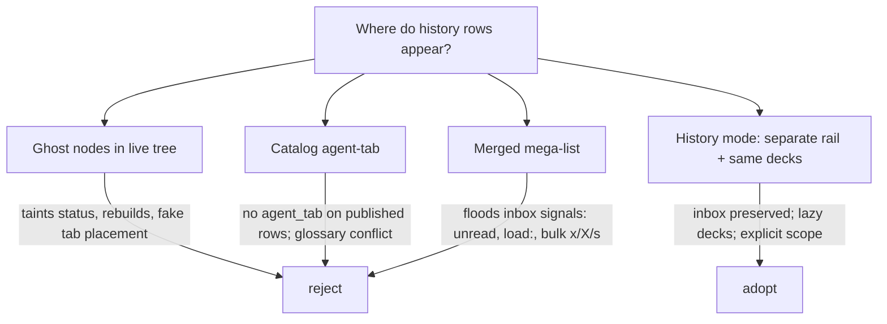
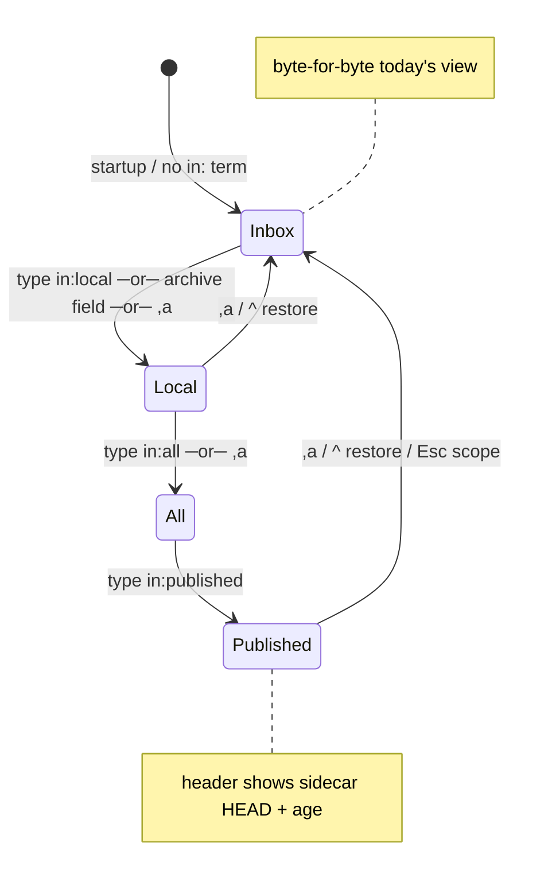
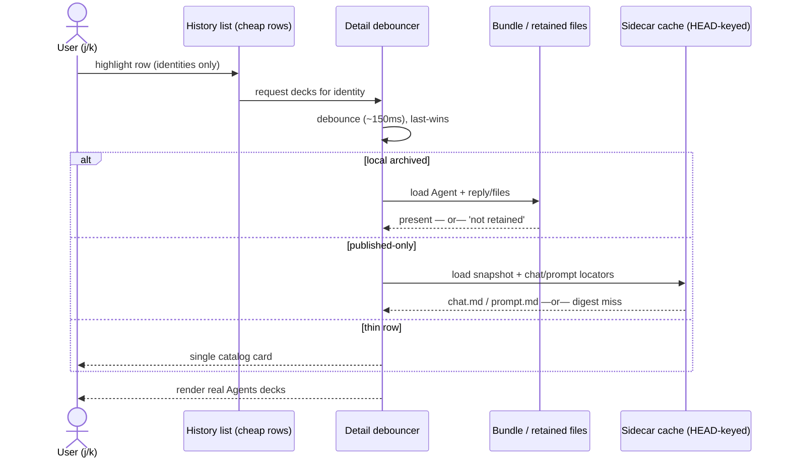

# Migrating Artifacts ▸ Agent to the Agents Tab: UX Research & Recommendation

**Researcher:** mus (`__mus`) · **Date:** 2026-10-08 · **Swarm:** independent UX track
**Context input:** `research:202609/agent_history_in_agents_tab/agent_history_in_agents_tab.md`
(consolidated lead report, Sept 2026) plus direct inspection of the current TUI tree
(`widgets/agents/`, `widgets/artifacts/agents_*.py`, `_artifact_tab_descriptors.py`,
`default_config.yml`).

> This report was written independently for the current swarm. It does not consult
> sibling `__cdx/__cld/__grk/__gem` reports from this round.

## 1. What the user actually wants

The request is deliberately vague: *"migrate the Agents sub-tab of the Artifacts tab
to the top-level Agents tab somehow."* The uncertainty is the point — the owner senses
two homes for one entity and wants one home, but does not know what the surviving home
should look like or do.

Three jobs must survive the move, no matter what the chrome looks like:

1. **Find** any agent that ran here (live, finished, dismissed, hidden) — and
   eventually any run published to the current project's agents sidecar.
2. **Read** it (prompt, reply, diffs, tools, relations, `agent:` links) without
   paying a revive tax when all you wanted was to look.
3. **Act** on it (revive, retry, copy, follow relations, save the query) with keys
   that do not surprise an Agents-tab muscle-memory user.

Everything else — scope tokens, grouping, keymaps, migration flags — is means to
those three ends.

## 2. Where things stand today (verified by inspection)

### 2.1 The two surfaces side by side

| | Agents tab (live control room) | Artifacts ▸ Agent (history catalog) |
|---|---|---|
| Row model | Full `Agent` objects in session/clan tree, folds, tribes, agent-tab strip | Lightweight `AgentCatalogRow` per name-registry entry + index/dismissed-bundle enrichment |
| Query | `agents-live` profile (SQLite pushdown, `query_incomplete` reconcile) | `agents` profile (catalog fields, host-owned `limit:`) |
| Detail | Rich decks: Main / Reply / Files+diffs / Tools / FINAL | Metadata-only: prompt truncated at 4,000 chars, chat path, no reply/diff/tool content |
| Grouping | Clan folds, tribe panels, agent tabs | Session / State / Project grouping banners + relation rail |
| Revive | N/A (rows are alive) | `w` revive; target of `!R` custom revival search |
| Excludes | Dismissed rows by construction | Sidecar rows (local only, no sidecar reader) |
| Scale on test box | ~228 inbox rows | ~1,456 catalog rows; ~3,438 dismissed identities; ~14,734 published runs |

### 2.2 Visual: today (schematic, 100-col terminal)

Figure 1 — Agents tab today (inbox). Tribe panels left, agent list centre, decks right.

```text
┌─ Agents ────────────────────────────────────────────────────────────────┐
│ Filter: [status:active …                    ]  (agents-live)  228 match │
├──────────────┬──────────────────────────────────┬───────────────────────┤
│ TRIBES       │ ● epic/sase-10j (3)              │ MAIN   REPLY  FILES …  │
│  epic (12)   │   ▸ research.45.mus  RUNNING     │ ───────────────────── │
│  chop (5)    │   ▸ research.45.cdx  WAITING     │ prompt, live output,  │
│  research(4) │ ● chop/fix-217 (1)               │ tool calls, diffs     │
│              │   ▸ fix-217          DONE ✉      │                       │
│ TABS         │ ─────────────────────────────── │                       │
│  [Code] [R]  │ j/k move · Enter opens · w=reword│                       │
└──────────────┴──────────────────────────────────┴───────────────────────┘
```

Figure 2 — Artifacts ▸ Agent pane today. Filter bar, flat grouped list, thin detail.

```text
┌─ Artifacts ─────────────────────────────────────────────────────────────┐
│ [1 Agent] [2 Stitch] [3 Files] …   Filter: [revivable:true …] (agents)  │
├──────────────────────────────────┬──────────────────────────────────────┤
│ SESSION research.45 (4)          │ DETAILS (metadata only)              │
│  ✓ research.45.mus   DONE  here  │  name · state · machine · project    │
│  ✓ research.44.grk   DONE  here  │  prompt (first 4000 chars)… [cut]    │
│ STATE dismissed (755)            │  chat path (no reply body)           │
│  ○ old-epic-9        ARCHIVED    │  w revive · % copy · l link          │
└──────────────────────────────────┴──────────────────────────────────────┘
```

The core UX defect is visible in the two boxes: the surface with the **good viewer**
(Agents decks) cannot see old agents, and the surface that **can see** old agents has
a viewer too thin to read them. Reading an old agent today means reviving it first —
a write to do a read.

### 2.3 Why two homes hurt (interaction evidence)

- Link-follow admits the split: when `agent:` cannot find a row it toasts
  *"Agents tab filter hides it — showing Artifacts ▸ Agent."* Hidden state made visible
  as an apology toast.
- `!R` (Custom revival search) on the Agents tab jumps *out* of the tab into the pane.
- The Artifacts strip pays a digit tax: Agent is digit `1`, pushing the default Stitch
  pane to `2`, for a pane few people query (no `agents` namespace in sampled
  `query_history.json` on the measured host).
- Keymaps collide across homes: pane `w` = revive vs. Agents `w` = reword; pane `%`
  copy targets (incl. full prompt) have no Agents-tab twin; Session/State/Project
  grouping and the relation rail (`linked:`/`relation:`/`artifact:`) live only in the
  pane.

## 3. Design principles (what "good" means here)

1. **Inbox stays inbox.** The default Agents view must be byte-for-byte today's live
   room. History is opt-in per query, never a flood. Dismissal must keep meaning
   "leave my inbox".
2. **Read without revive.** The single biggest win: any archived row opens in the real
   decks from the dismissed bundle + retained files. Missing files degrade to an
   explicit "not retained" card, never an empty deck.
3. **No hidden scope.** Whatever narrows or widens the corpus is always visible in the
   header as a chip. No toast-apology navigation.
4. **Lightweight list, heavyweight detail.** History lists render cheap rows (identity,
   status, provenance, grouping banner); only the highlighted row hydrates full decks,
   lazily through the existing detail debouncer.
5. **Capability-shaped actions.** A row offers only what its provenance supports.
   Live rows: stop/retry/answer/move. Archived rows: read/revive/copy. Published-only
   rows: read/copy/link — never mutate, never import.
6. **One query language, one scope token.** Extend the existing language rather than
   inventing a second picker. Scope is part of the committed query so `^` history,
   saved queries, and `sase agent search` all keep working.

## 4. Options considered (and why three lose)

| Option | Sketch | Verdict |
|---|---|---|
| **A. Ghost nodes in the live tree** — dismissed rows interleaved into clan folds + tribe panels | Familiar tree, but taints container status, forces full-tree rebuilds, invents tab placement for rows that have none | Reject for v1 (risk + conceptual lie) |
| **B. `[Catalog]` agent tab in the tab strip** — history as just another tab placement | Cheap strip addition, but glossary defines agent tabs as placements of *top-level live* agents; published rows carry no `agent_tab`; count badge misleads | Reject (wrong primitive) |
| **C. Merged mega-list** — inbox + archive in one scrolling list with dimming | Simplest code, worst UX: unread/attention/`load:`/bulk-action signals all key off the loaded list; inbox-zero dies | Reject (breaks P1) |
| **D. History mode (recommended)** — scoped query swaps the left rail to a History list; right side stays the real decks | Preserves inbox, reuses pane list/grouping code + Agents decks, explicit scope chip, per-scope memory | **Adopt** |

Figure 3 — The four options as a decision map (Mermaid).



## 5. Recommended UX (the part to build)

### 5.1 Scope is a host-owned `in:` token, always visible

Scope picks *which stores load*. It is extracted before dialect parse (like `limit:`):
singular, non-negatable, never inside an `OR`.

| Value | Loads | Default? |
|---|---|---|
| `in:inbox` | Today's set: local non-dismissed + fleet | Yes (implicit when absent) |
| `in:local` | Inbox + local archive (dismissed/hidden catalog rows) | On explicit term or archive-field mention |
| `in:published` | Current-project sidecar snapshots (HEAD-keyed), merged where same run exists locally | Explicit only |
| `in:all` | `local` ∪ `published`, deduped by `source_run_id` | Explicit only |

Rules that keep it predictable:

- **Implicit widening (local only).** A query mentioning an archive-only field
  (`state:`, `dismissed:`, `revivable:`, `durably_revivable:`, `restartable:`,
  `historically_viewable:`) runs as `in:local`. Nothing ever widens implicitly to
  `published` — published is always a deliberate act with a freshness chip.
- **Provenance is a separate facet.** `presence:local|published|fleet` filters *within*
  a scope (e.g. `in:all NOT presence:local` = runs only known from the sidecar).
  Do not reuse `origin:`/`source:` (both taken).
- **Header chip, always.** Outside the inbox the filter bar shows e.g.
  `⌸ local history · 314 matches` or `⇡ published · sase @ a1b2c3 · 2h ago`.
- **Cycle key.** `,a` (currently unbound in leader mode) cycles
  inbox → local → all → inbox by rewriting the committed `in:` term through the
  normal commit path, so `^` query history keeps working. Palette: *Agents: browse
  history*.
- **Per-scope memory.** Leaving history restores the exact inbox query, selection,
  folds, tab, and tribe; re-entering restores the last history query.
- **Zero-result hint.** Inbox query with no hits shows, via an off-thread catalog
  count: `0 in inbox · 7 in local history — press ,a to include`. This is where most
  users will discover the feature.
- **Saved queries migrate with scope baked in.** `agents-live` saves stay inbox;
  Artifacts ▸ Agent saves move into the Agents namespace with `in:local` prepended.

Figure 4 — Scope state machine (Mermaid).



### 5.2 History mode layout (the visual core of this report)

When the effective scope is not `inbox`, the Agents tab swaps its left rail. Tribe
panels + tab strip become one **History** nav section: a newest-first list of cheap
rows with the pane's grouping banners. The right side stays the normal Agents decks.

Figure 5 — History mode (local scope). Compare with Figure 1: left rail replaced,
right decks identical, scope chip in the filter bar.

```text
┌─ Agents ────────────────────────────────────────────────────────────────┐
│ Filter: [in:local since:7d … ]  ⌸ local history · 314 matches            │
├──────────────┬──────────────────────────────────┬───────────────────────┤
│ HISTORY      │ SESSION research.45 (4)          │ MAIN   REPLY  FILES …  │
│ by: Session▾ │  ✓ research.45.mus  DONE  here  │ ───────────────────── │
│ ──────────── │  ✓ research.44.grk  DONE  here  │ Reply body + diffs,   │
│  Session (4) │ STATE dismissed                  │ hydrated lazily from  │
│  Date        │  ○ old-epic-9  ARCHIVED    here  │ dismissed bundle +    │
│  State       │  ○ thin-name   CATALOG-ONLY      │ retained files.       │
│  Project     │ ─────────────────────────────── │ "not retained" when   │
│  Machine*    │ ,a cycles scope · Enter=revive   │ files are gone.       │
└──────────────┴──────────────────────────────────┴───────────────────────┘
   *Machine grouping appears only in in:published / in:all.
```

Figure 6 — Published row (same layout, honest chrome). Never shows a live state.

```text
┌─ Agents ────────────────────────────────────────────────────────────────┐
│ Filter: [in:all name:"research.12*"]  ⇡ all · sase @ a1b2c3 · 2h ago     │
├──────────────┬──────────────────────────────────┬───────────────────────┤
│ HISTORY      │  ◐ research.12.gem  WAS ACTIVE   │ MAIN shows snapshot   │
│ by: Machine▾ │     as of 2h ago · published·ath│ meta + provenance;    │
│ ──────────── │  ✓ research.12.mus  DONE        │ REPLY renders         │
│  here+publ.  │     here + published             │ chat.md; PROMPT from  │
│              │  ✓ research.11.cld  DONE  here  │ prompt.md; TOOLS/FINAL│
│              │                                  │ say "not published".  │
└──────────────┴──────────────────────────────────┴───────────────────────┘
```

Row-chrome rules (keep them few and absolute):

- Terminal status glyph + dim style for every non-inbox row (`✓ DONE`, `✗ FAILED`,
  `○ ARCHIVED`, `◐ WAS ACTIVE · as of <HEAD age>`).
- Provenance chips: `here`, `published · <machine>`, `here + published`, `fleet`.
- `WAS ACTIVE` is the only legal label for a non-terminal published state — never
  `RUNNING`. Published liveness is always stale.
- Thin (registry-only) rows get one catalog card (identity, lineage, references); no
  empty decks.

Figure 7 — Detail hydration flow (Mermaid sequence: highlight → debounce → hydrate).



### 5.3 Actions: capability-shaped, not location-shaped

| Action | Inbox row | Local archived | Published-only |
|---|---|---|---|
| Read in decks | yes | **yes, no revive** | yes, from sidecar files |
| Copy / `agent:` follow | yes | yes | yes |
| Revive | — | **Enter chooser → Revive** (default when `revivable:true`); `m`/`u` marks for bulk | no (read-only document) |
| Stop / retry / answer / kill | when live | no | no |
| Move tab / tribe, bulk `x`/`X`/`s` | yes | no | no |
| Fork as new local run | existing rules | existing rules (bundle fallback) | later feature, new run not revival |

Keymap surgery (all need `default_config.yml` updates per the repo gotcha):

- Pane `w` (revive) **cannot** move over: `w` is `reword` on the Agents tab. Revive
  becomes the default item in the **Enter chooser** for revivable history rows.
- Reserve one History-mode-only binding only after a keymap audit (`H`/`p`/`o` are
  taken; `,a` is free and is the scope cycler).
- `!R` saved-group flow stays, but its Custom revival search now commits
  `in:local state:dismissed revivable:true` on the Agents tab instead of opening the
  pane.
- `%` copy parity moves over whole, including the full-prompt target.

### 5.4 Link-follow and Artifacts-tab aftercare

`agent:` always targets the Agents tab after the move:

1. Row loaded → reveal as today.
2. Else resolve canonical identity against catalog/sidecar projection, commit
   `in:<narrowest scope> name:"<canonical>"`, push prior query onto `^` history.
3. Expand only needed folds, select, toast:
   *"Not in inbox — showing local history · `^` restores your filter."*
4. Delete the `agents_tab_fallback` route and its cross-tab toast; point
   `target_for_ref_kind("agent")` at Agents.

The Artifacts tab gets simpler: delete the Agent pane widget (not the
`sase.agents.catalog` package — CLI, outbox drain, and relation lookups depend on
it), renumber digits so Stitch becomes `1`, add a legacy sub-tab redirect
(`agents → stitches`, following the Chats precedent), and move Agent-pane docs,
goldens, and bindings behind a default-on sunset flag until parity tests pass.

Figure 8 — Before → after tab map (ASCII).

```text
  BEFORE                              AFTER
  ──────                              ─────
  Agents (inbox only)                 Agents (inbox + ⌸/⇡ history modes)
  Artifacts [1 Agent][2 Stitch]…      Artifacts [1 Stitch][2 Files]…
       └─ agent: fallback ──┐              └─ agent: ──▶ Agents tab, scoped reveal
                            │                 (no fallback, no toast-apology)
```

## 6. Edge cases, performance, and staging (UX-relevant only)

- **Empty / missing states.** Each scope needs its own empty card: inbox ("No live
  agents — dismiss to zero, not to delete"), local ("No archived runs match —
  try `,a` / widen dates"), published ("Sidecar missing, stale, dirty, or malformed —
  local history still works; freshness chip explains"). Never hide local history
  behind a sidecar failure.
- **Thin rows.** Registry reservations with no durable evidence stay resolvable by
  exact name/link reveal but are hidden from ordinary history results (alongside
  hidden rows and workflow children) — otherwise real runs lost to enrichment bugs
  read as "never ran".
- **Startup.** A restored non-inbox query must paint the inbox first, then fill
  history in the background (`query_incomplete`-style "loading history…" header).
  No archive- or sidecar-scaled work on first paint, the event loop, or a keystroke
  path; published projection lives in a HEAD-keyed cache off-thread.
- **Stage it.** (1) Local history mode + read-without-revive + `in:` + `,a` +
  link retarget; retire the pane behind a sunset flag once parity tests pass.
  (2) Published history later, read-only, after publisher freshness/identity fixes
  (non-terminal states are stale; some runs are double-published under two owners —
  dedup must key on `source_run_id`). Splitting keeps the pane retirement
  unblocked: the pane never showed sidecar rows.

## 7. Worked examples (copy-paste query shapes)

```text
in:local since:7d project:sase role:code        # what did I dismiss/finish this week?
revivable:true provider:codex status:FAILED     # implicit in:local widening
in:all name:"research.12*"                      # every run of that hood, anywhere
in:published machine:athena after:2026-09-01 kind:session
in:local linked:true relation:implements        # pane relation-rail parity
```

## 8. Summary: recommended UX

**Give the Agents tab an explicit, query-driven History mode; do not merge the
archive into the inbox.**

1. **Scope token.** Host-owned `in:inbox|local|published|all` (implicit `inbox`;
   implicit widen to `local` on archive fields; never implicit to `published`);
   separate `presence:` facet; header chip always shows effective scope + match
   count (+ sidecar HEAD age when published); `,a` cycles; per-scope query memory;
   zero-result hint teaches `,a`; saved queries migrate with scope baked in.
2. **History-mode layout.** Non-inbox scope replaces the left tribe/tab rail with one
   History list (cheap rows + Session/Date/State/Project/Machine grouping banners);
   right side is the unchanged Agents decks, hydrated lazily for the highlighted row
   only (dismissed bundle + retained files; sidecar `chat.md`/`prompt.md`; explicit
   "not retained"/"not published" cards; `WAS ACTIVE · as of <age>` never `RUNNING`).
3. **Actions by capability.** Read/copy/link everywhere; revive via Enter chooser
   (default when `revivable:true`) + bulk marks for local archived rows; no
   stop/retry/move/bulk on history; published-only rows strictly read-only (fork is a
   later, separate "new run" feature, never import).
4. **Navigation.** `agent:` links and `!R` custom search land on the Agents tab with a
   scoped reveal + `^`-restores toast; delete the cross-tab fallback route; Artifacts
   loses the Agent pane (keep the catalog package + CLI), Stitch becomes digit `1`,
   legacy `agents → stitches` redirect, sunset-flagged removal after parity tests.

The end state is one home for agents: the inbox you work in by default, and the same
tab — one keystroke or one query term away — as the archive you read, revive, and
link. Nothing hides, nothing floods, and reading never costs a revive.

## Sources (independently consulted)

- Prior consolidated context: `202609/agent_history_in_agents_tab/`
  (`agent_history_in_agents_tab.md` + its directory).
- Code inspected directly: `src/sase/ace/tui/widgets/artifacts/agents_{pane,list,
  detail,query,revival,data,options}.py`; `src/sase/ace/tui/_artifact_tab_model.py`;
  `src/sase/ace/tui/_artifact_tab_descriptors.py`; `src/sase/ace/tui/widgets/`
  agent-list/deck/header modules; `src/sase/default_config.yml` (Agents, Artifacts,
  leader-mode keymaps).
- No sibling `202610/*__{cdx,cld,grk,gem}.md` report from this swarm was located,
  opened, or consulted; only filenames were listed to avoid overwrite.

