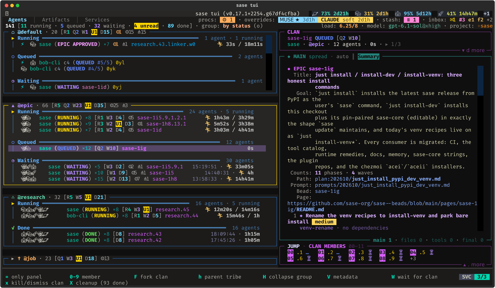
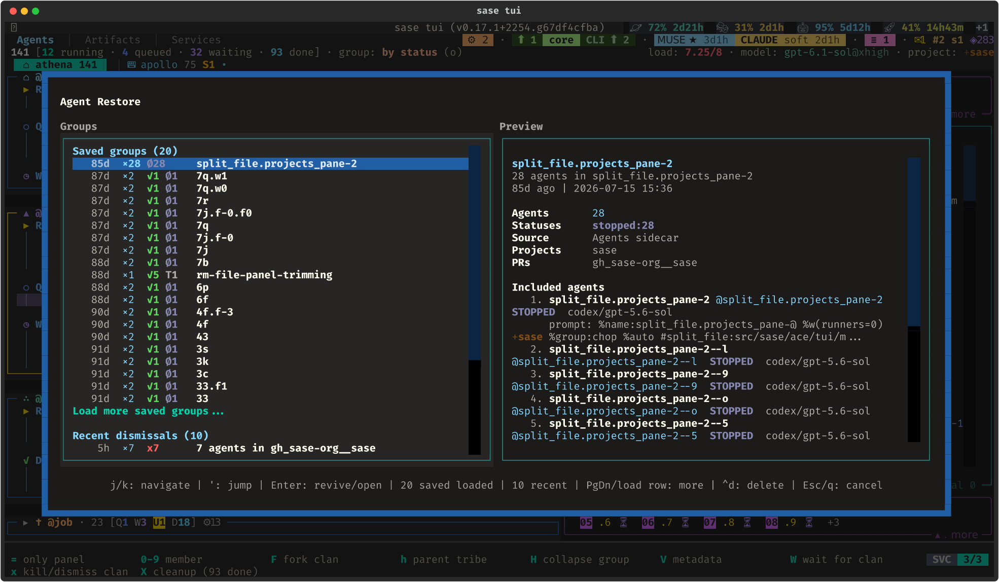
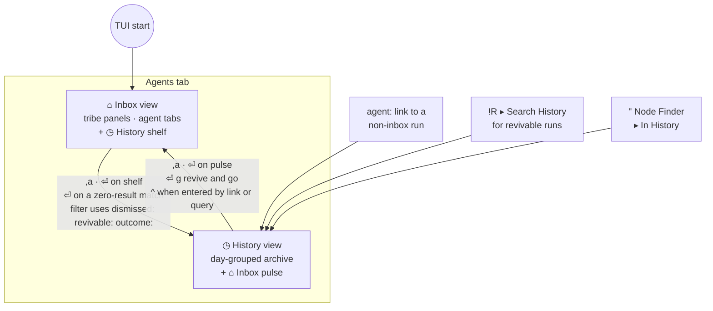
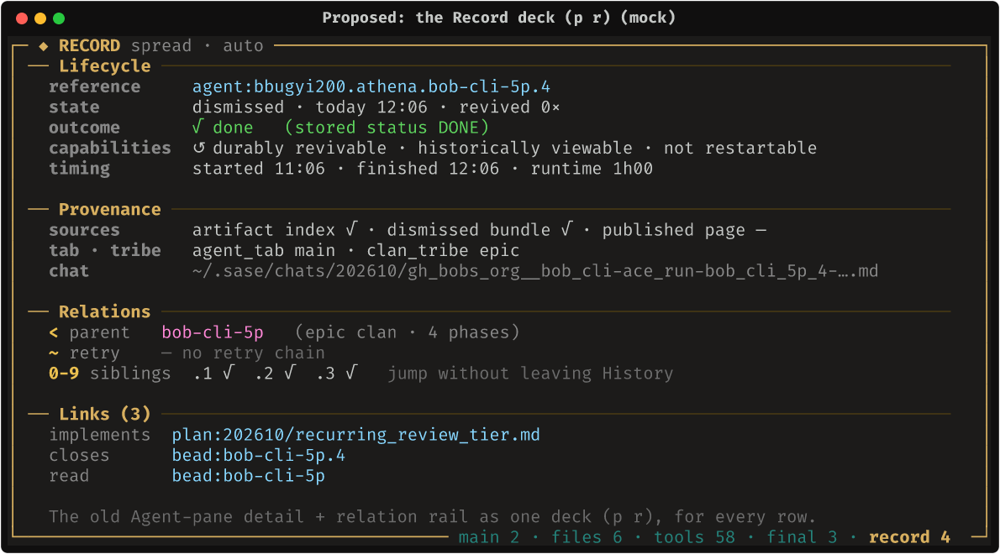
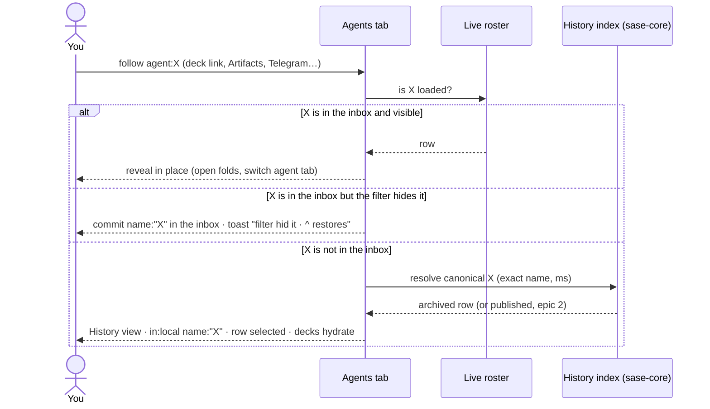
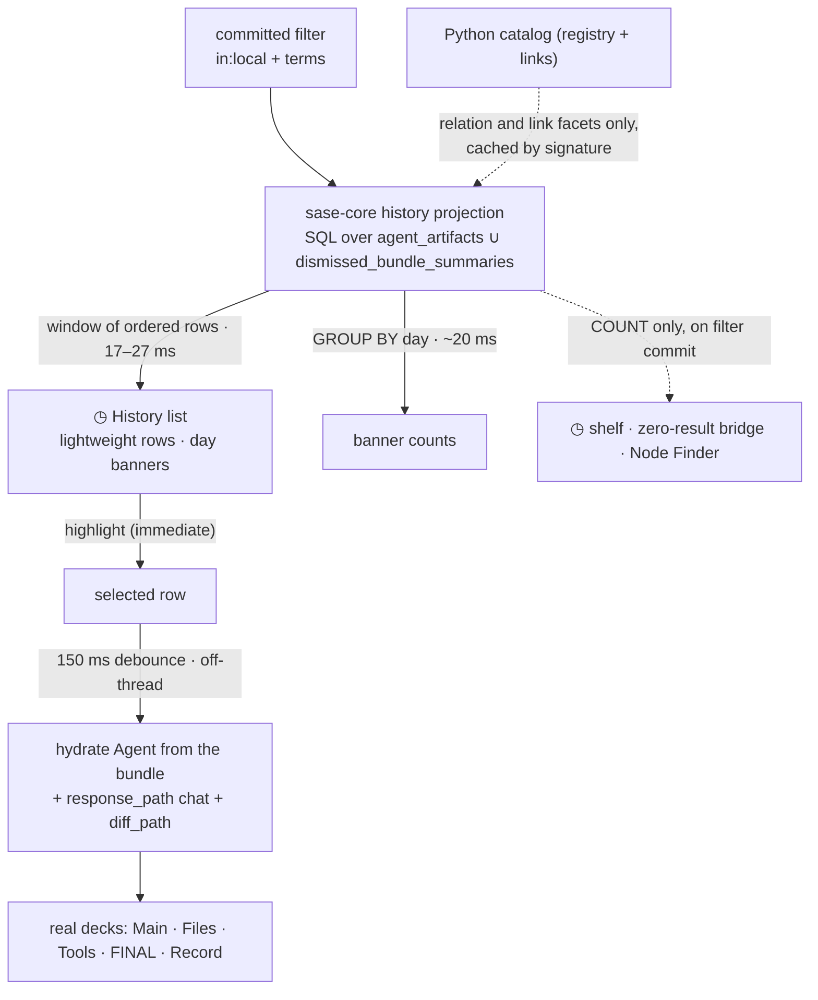
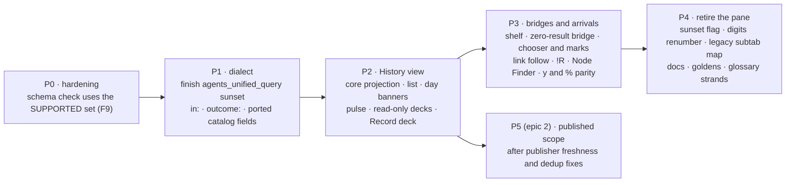

# One home for every agent: the Agents-tab History view, screen by screen

**Researcher:** `research.45.cld` · **Date:** 2026-10-08 · **Measured on:** `athena` (the
primary agent host), sase master `67df4cfba5`

**Builds on:** `research:202609/agent_history_in_agents_tab/agent_history_in_agents_tab.md`
(the consolidated September report). That report settled the *what*: retire
Artifacts ▸ Agent and give the Agents tab an explicit history scope (`in:`) instead of
turning the inbox into an archive. This report fleshes out the *how it looks and
behaves*. It covers every screen, transition, row, key, empty state and arrival path,
using real screenshots of today's TUI and terminal-faithful mockups of the proposal.

**How the visuals were made.**

- **"Today" images** are live `sase screenshot` captures of the real TUI on athena.
- **"Proposed" images** are mockups built with Rich and rasterized by the same renderer
  `sase screenshot` uses (`sase.ace.tui.visual_render`, with the bundled Fira Code
  stack). They use the real palette, real borders and real agent names and data from
  athena, so before and after compare like for like.
- **Flows** are Mermaid diagrams.
- **Measurements** are in one small-multiples figure, backed by data tables.

---

## Contents

1. [TL;DR](#1-tldr)
2. [What is new since the September report](#2-what-is-new-since-the-september-report)
3. [Today, in pictures](#3-today-in-pictures)
4. [Design goals](#4-design-goals)
5. [Four shapes it could take](#5-four-shapes-it-could-take)
6. [The recommended UX, screen by screen](#6-the-recommended-ux-screen-by-screen)
7. [What the UX needs underneath](#7-what-the-ux-needs-underneath)
8. [Where this departs from the September recommendation](#8-where-this-departs-from-the-september-recommendation)
9. [Rollout](#9-rollout)
10. [Open questions](#10-open-questions)
11. [Recommended UX: summary](#11-recommended-ux-summary)

---

## 1. TL;DR

- **Make History a second *view* of the Agents tab, with a one-line bridge on each side.**
  - The inbox gains a **◷ History shelf**: one line at the bottom of the node column
    that counts the archive and, when you filter, the archive matches.
  - The History view gains a **⌂ Inbox pulse**: one line at the top that keeps live
    attention visible (running, unread, needs-you).
  - `,a` toggles between the two views. Either bridge also works with `⏎`.
- **History reuses the real decks.** Selecting an archived run hydrates Main / Files /
  Tools / FINAL straight from its dismissed bundle and retained chat. Nothing is revived
  and nothing is written. A new **Record** deck (`p r`) absorbs the old pane's metadata
  panel and relation rail.
- **History rows read differently from live rows.**
  - Rows are grouped **by day**, newest first.
  - Each row shows a normalized **outcome**: `√ DONE`, `✗ FAILED`, or `◌ WAS RUNNING`.
    The past-tense `WAS …` label matters because **15% of athena's archived runs carry a
    stale non-terminal status**, which the old pane paints in live colors (a green
    `RUNNING`, a yellow `WAITING`).
  - Archived rows are read-only. `⏎` opens a chooser whose default is **Revive**.
- **Every path to an old agent lands in History:**
  - an empty inbox search shows the History matches instead of a dead end;
  - an `agent:` link to a dismissed run opens History with that run selected;
  - `!R` ▸ Custom revival search opens History;
  - on the Artifacts tab, a persisted `agents` sub-tab redirects to Stitch with a
    one-time "moved" toast.
- **The UX only works if History is served from an index.** On athena:
  - the Agent pane takes **12 s to show first rows and 45 s to load fully**, or about
    **90 s** if opened while the TUI is still starting;
  - a SQL window over the existing dismissed-bundle index returns the newest 100
    archived runs in **17 ms**.

  So the History list must come from a `sase-core` projection over the existing indexes,
  not from the Python catalog build.


*Proposed History view (mock). The left column is the archive. The right side is the
same decks the inbox uses. The pulse line at the top keeps the live inbox one keystroke
away.*

---

## 2. What is new since the September report

The September report measured apollo and noted: *"I couldn't check athena, where most
agents run."* This report is measured on athena. The corpus there is far larger, and that
changes several UX conclusions.


| # | Finding (athena, 2026-10-08) | Evidence | UX consequence |
| --- | --- | --- | --- |
| F1 | **The archive is 74× the inbox.** 147 inbox agents; 10,899 archived top-level runs; 36,739 more archived workflow children (47,638 bundles in total). The index also reports 68,627 dismissed identities and 7,636 hidden terminal rows. | `sase agent index status`; `~/.sase/dismissed_bundles/index.sqlite` (`dismissed_bundle_summaries`) | History cannot share the inbox's list or counts. It needs its own view and its own row model. |
| F2 | **The Agent pane is too slow on athena to be a model for the UX.** Measured from pressing `1` on Artifacts: 12 s to first rows and 45 s to full load in a settled TUI; about 90 s when opened during startup. The pane reported "showing 100 of 20,157". `sase agent search -l 0` takes 11.1 s wall (9.9 s user) to build 11,033 catalog rows. | Live `tmux` polling of a `sase screenshot --keep` window; `time sase agent search` | History must not be built from `build_agent_catalog_snapshot()` on the critical path. A full-scan SQL window over `dismissed_bundle_summaries` takes 17 ms, and 27 ms at offset 5,000. |
| F3 | **Local history has the same stale-state problem the September report found in the sidecar.** Of 10,899 archived top-level runs, 1,662 (15.2%) have a non-terminal stored status: 885 `WAITING`, 478 `RUNNING`, 103 `QUEUED`, and 196 others. The catalog shows 4,153 `dismissed` rows whose status is `RUNNING`. | SQL over the bundle index; `sase agent search -l 0 -j` | History rows need an **outcome** vocabulary (`WAS RUNNING`), not stored status. Today the pane prints the stored value verbatim, in live green (`agents_list.py:55`, `status_style.py`). |
| F4 | **36 distinct status strings appear in the archive.** Examples: `TALE DONE`, `EPIC CREATED`, `PYPI OK`, `WAITING FOR v0.17`. | Same | Filtering by stored status is a poor tool. Add a derived `outcome:` field with four values. |
| F5 | **About 110 agents are dismissed per day** (median, Sep 8 – Oct 7; range 40–178). | Same | Day banners give readable groups. The pane's default Session grouping produced the "(no session) (37)" bucket visible in the pane screenshot below. |
| F6 | **Read without revive works on athena.** The bundle for `bob-cli-5p.4` (11 KB) keeps `response_path` (chat present), `diff_path`, `artifacts_dir` (present), **`agent_tab`** and `clan_tribe`. | Bundle JSON | Archived rows can open the real decks. They can also honor `tab:`, which published rows never can. |
| F7 | **The pane is barely used, and only for one thing.** Athena's `~/.sase/query_history.json` has exactly 3 `agents` entries: `limit:100`, `linked:true limit:100` and `linked:true limit:200`. | Query history | This answers September's open question 3. The `linked:` and `relation:` facets are the part people actually use, so they must survive the move. Saved-query migration is trivial. |
| F8 | **Nothing has started yet.** `agents_unified_query` is still a default-on sunset flag, and the legacy `src/sase/ace/agent_query/` parser is still imported. There is no epic bead. | `feature_flags/registry.py`; grep | September's ordering still stands: finish the sunset, then add the scope. |
| F9 | **P0a is working by coincidence.** `_sources.py` still requires `schema_version == AGENT_ARTIFACT_INDEX_SCHEMA_VERSION`. The constant is now 36, the same as the on-disk index, so enrichment works today, but it breaks again at 37. `SUPPORTED_AGENT_ARTIFACT_INDEX_SCHEMA_VERSIONS = {33,34,35,36}` exists, but this check doesn't use it. | `catalog/_sources.py:96`; `agent_scan_wire_records.py:29-31` | A cheap hardening fix is still worth doing before History builds on catalog fields. |

**Data table for panel (b):**

| Path to "history rows visible" | Time |
| --- | ---: |
| Artifacts ▸ Agent, opened during TUI startup (first rows) | ≈ 90 s |
| Artifacts ▸ Agent, settled TUI (fully loaded and queryable) | ≈ 45 s |
| Artifacts ▸ Agent, settled TUI (first 500 rows) | ≈ 12 s |
| `sase agent search -l 0 -j` (full catalog, CLI) | 11.1 s |
| SQL: 100 newest archived top-level runs from `dismissed_bundle_summaries` | 17 ms |

**Data table for panel (c):** daily dismissals, Sep 8 → Oct 7:
78, 100, 148, 93, 75, 91, 100, 77, 88, 65, 98, 40, 101, 126, 127, 140, 178, 142, 135,
133, 99, 118, 133, 137, 125, 126, 80, 87, 119, 124.

---

## 3. Today, in pictures

### 3.1 The Agents tab: a live control room



*Today (live capture). Everything here is live: tribe panels, status grouping,
attention badges (`U1`), decks and the jump panel. Nothing here can show an agent once
it is dismissed.*

### 3.2 Artifacts ▸ Agent: the second home


*Today (live capture, taken after about 60 s of loading). Problems visible here:*

- *The detail panel is metadata only. It has no Reply, Files or Tools; the prompt is
  capped at 4,000 characters and the chat appears only as a path.*
- *The kind column overflows into the status column (`member/workflowRUNNING`).*
- *Stored statuses are shown as if live.*
- *The default Session grouping creates a "(no session)" bucket.*

### 3.3 The dead end


*Today (live capture). `bob-cli-5p.4` finished and was dismissed at 12:06 the same day.
The Agents tab says "0 matches elsewhere" and points nowhere. The only way to read its
reply is to know about Artifacts ▸ Agent, or to revive it.*

### 3.4 `!R` Agent Restore: group revival



*Today (live capture). Restoring groups works well and should stay. Its last entry,
"Custom revival search…", is the one that currently leaves the Agents tab.*

---

## 4. Design goals

1. **The inbox stays an inbox.** With no history scope active, the default view is
   unchanged: same layout, same counts, no archive-sized work.
2. **History is always one line away, never a hidden mode.** Each view shows the other
   as a live one-line bridge, so you never need to remember where you are.
3. **One viewer for every agent.** Archived, live and (later) published runs open in the
   same decks. Reading never requires reviving.
4. **The past is written in the past tense.** Archived rows never show a present-tense
   live verb, a live color or a live action.
5. **Every way of looking for an old agent lands in the same place:** search, link
   follow, `!R`, Node Finder, and muscle memory from the Artifacts tab.
6. **Instant or honest.** History paints within one frame of the keypress, or it says
   what it is loading. It never shows "Loading agents…" for a minute.
7. **Nothing the pane did is lost:**
   - revive, including bulk revive of marks;
   - `linked:` / `relation:` search;
   - relations navigation;
   - the full prompt and the `%` copy targets.

---

## 5. Four shapes it could take


| Criterion | A · Ghost rows inline | B · Strip tab | C · Scope mode (Sept.) | **D · Scope mode + bridges** |
| --- | :---: | :---: | :---: | :---: |
| Default inbox untouched | ✗ | ✓ | ✓ | **✓** |
| Discoverable without docs | ✓ | ✓ | ✗ (`,a` or a token) | **✓ (the shelf is always visible)** |
| Live attention visible while browsing | ✓ | ✗ | ✗ | **✓ (the pulse)** |
| Low risk of mode confusion | ✗ | ~ | ✗ | **✓** |
| No archive-scaled work in live paths | ✗ (rebuilds, counts) | ✓ | ✓ | **✓** |
| Fits the glossary (agent tab = placement of live agents) | ✗ (Agent Node = non-dismissed) | ✗ | ✓ | **✓** |
| Extra build cost over C | — | — | baseline | **two one-line panels and one count query** |

**My choice is D.** It keeps the September design's sound core (an explicit scope, a
separate row model, the real decks) and fixes its two UX weaknesses:

- **Nobody finds the history scope.** In C, the only ways in are `,a` and typing a
  token.
- **The inbox disappears while you browse.** In C, an agent asking a question goes
  unnoticed while you read old runs.

I rejected B even though it is the most discoverable:

- `]` / `[` would cycle into a list of 10,000 rows.
- The strip only appears when two or more tabs exist.
- An agent tab is a *placement* of live agents. History cuts across every tab and
  machine, so it isn't one.

---

## 6. The recommended UX, screen by screen

### 6.1 The inbox, with a History shelf


*Proposed (mock).*

- **The shelf** is a collapsed nav section pinned below the last tribe panel. It looks
  exactly like a collapsed tribe panel (compare `@job` in §3.1), so it needs no new
  visual language. `J` reaches it like any panel, and `⏎` or `l` on it opens History.
  - **With no filter**, it shows the archive size and the dismissals since the last
    visit: `◷ History · 10,902 archived · +3 just now`.
  - **With a committed filter**, it shows the matches in the archive:
    `◷ History · 7 matches for this filter`. It glows amber when the inbox result is
    empty (see §6.6).
  - It holds no rows. It is never counted in tab totals, unread, attention, `load:` or
    bulk actions.
- **The dismiss toast teaches the model.** Every `x` / `X` / `s` dismissal ends with
  "→ ◷ History · `,a` browse". The thing you dismissed has visibly gone somewhere you
  can follow.
- **The footer is unchanged.** Per the footer convention, global keys like `,a` belong
  in `?` help. The shelf is the on-screen affordance.

### 6.2 The History view: anatomy

The hero image at the top of this report shows the full screen. Region by region:

| Region | Inbox view (today) | History view (proposed) |
| --- | --- | --- |
| Info row (line 2) | `147 [10 running · …] · group: by status (o)` | `◷ HISTORY 10,899 runs · filter: [in:local] … · group: by day (o)`. The scope is an amber chip at the start of the filter. |
| Strip row (line 3) | Agent-tab strip `⌂ athena 144 U1 │ ⌨ apollo 74 S1` | **Scope chips:** `◷ local 10.9k │ ⇡ published │ ∪ all`. Published and all are dimmed until epic 2. Also a reminder that history ignores agent tabs, and `,a` back. |
| Node column, top | First tribe panel | **⌂ Inbox pulse**, one line: `▸ ⌂ Inbox · 147 [R10 Q5 W35 U1 D96] · 1 needs you`, with a `,a` badge. |
| Node column, body | Tribe panels of live nodes | **◷ History** nav section: day banners, then archive rows. Its subtitle is the position (`1/10,899`). |
| Identity header | Live identity | Same widget with an **`◷ ARCHIVED · read-only`** title, plus a ribbon: `dismissed today 12:06 · ran 11:06 → 12:06 (1h00) · ↺ revivable`. |
| Deck panel(s) | Main / Files / Tools / FINAL | **The same decks, hydrated from the bundle**, plus **Record** (`p r`). Splits (`\`, `|`), zoom (`Z`) and card keys all work unchanged. |
| Jump panel | Clan members / neighbors | Clan siblings plus a **RELATIONS** line: `<` parent, `~` retry chain, `⇄` links. |
| Footer | Conditional live keys | `<enter> revive…`, `e open chat`, `F fork`, `m mark`, `u clear marks`. |

**The visual language: amber means history.**

- The `◷ HISTORY` chip, the scope chip, the History panel border, the `ARCHIVED` title,
  `↺` and the Record deck all use one warm amber (`#d7af5f`).
- Live yellow (`RUNNING`, unread) and live cyan (decks) stay exactly as they are. A
  glance tells you which world you are in.

### 6.3 Getting in and out



Dismissing from the inbox (`x` / `X` / `s`) moves rows across: the shelf count goes up
by N, and the toast points to History.

**Rules:**

- **Startup always opens the inbox.** History is an exploration state. Its last filter
  is remembered but never restored at launch. This keeps first paint free of archive
  work (`tui_perf` rule 9) and removes the "paint inbox first, then fill history"
  special case.
- **Going wider carries your filter. Coming back restores the inbox exactly.**
  - `,a` from the inbox opens History with the inbox's committed filter, if there is
    one. Otherwise it opens History with History's last filter. This is what makes
    "search, find nothing, press `,a`" work.
  - Terms that cannot apply to archived rows (`unread`, `pinned`, `needs`, `text`
    until a full-text index exists) are dropped and listed in a dim chip: `dropped:
    unread:true`.
  - `,a` back restores the inbox's filter, selection, folds, agent tab and tribe
    exactly as you left them.
- **The scope is visible in the filter.** The committed query really contains
  `in:local`, rendered as a chip. That gives `^` / `_` history, saved slots and
  `sase agent search` parity for free (September §7.1). Typing `in:inbox`, or deleting
  the chip, returns to the inbox. The chip and the view can never disagree.
- **Implicit widening is visible.** A filter that mentions `state:`, `dismissed:`,
  `revivable:`, `outcome:` or a capability field opens History, and a toast says so:
  *"`revivable:` only exists in History — showing ◷ History · `^` undo"*. It never
  widens to `published` on its own.

### 6.4 The History list

#### Rows

```text
  HH:MM  ●|√|✗|◌ OUTCOME    name                  model   runtime  chip
  12:06  √ DONE             bob-cli-5p.4          muse    1h00     ↺
  13:57  ✗ FAILED           research.3x.image     codex   1m35     ↺
  Aug 13 ◌ WAS WAITING      sase-kv.5.w1.w0       opus    —        ↺
  18:22  ● RUNNING          research.45 ×5        mixed   21m      ⌂ inbox
```

- **Time column.** The time the run *ended*: `finished_at`, else `dismissed_at`, else
  `started_at`. History is "what happened, most recent first". The pane sorted by start
  time, so a run that took 26 hours showed up a day early.
- **Outcome.** A normalized, past-tense outcome. Table below.
- **Containers.** Clans and sessions are one row with `×N` (`research.41 ×6`). `l`
  expands their members. Workflow children are hidden, as in `sase agent search`. `I`
  toggles never-ran (`STOPPED`) rows, matching what `I` already means on the inbox.
- **Chips.**
  - `↺` means revivable (`durably_revivable` comes straight from the bundle index).
  - `⌂ inbox` means the run is live. `in:local` is a superset of the inbox, so a search
    in History finds everything.
  - Reviving a row turns its `↺` into `⌂ inbox` in place. Dismissing from the inbox does
    the reverse. The two views are one population seen two ways.

| Stored status, from 36 strings in the archive | History shows | Color | Notes |
| --- | --- | --- | --- |
| `DONE`, `TALE DONE`, `EPIC CREATED`, `PLAN DONE`, `TESTED`, … (8,560 runs) | `√ <status>` | dim green | Keeps the specific word (`TALE DONE`); the glyph carries the outcome |
| `FAILED`, `PLAN FAILED`, `EPIC TIMED OUT`, `LAUNCH REJECTED`, … (677) | `✗ <status>` | dim red | |
| `RUNNING`, `WAITING`, `QUEUED`, `PLAN`, `QUESTION`, … on an archived row (1,662) | `◌ WAS <status>` | `#8787af` (the `STOPPED` violet) | Never green or yellow, never present tense |
| A live inbox row inside History | `● <status>` | live colors | Only rows marked `⌂ inbox` |
| Published, non-terminal (epic 2) | `◌ WAS ACTIVE · as of <HEAD age>` | violet | September §7.2 |

**New query field `outcome:done|failed|interrupted|live`.** It is derived in core with
exactly this mapping, so `outcome:failed since:7d` means what the row shows.

#### Grouping

`o` in History opens a History-specific picker:

- **day** (default)
- **hood**: `<name>.` prefix, the closest thing to the pane's Session grouping
- **project**
- **outcome**
- **tribe** (`clan_tribe`)

Day banners reuse `models/date_subgroups.py` (`day_subgroup_label` gives `Thu Oct 8`)
and add a relative prefix: `Today · Thu Oct 8`, `Yesterday · Wed Oct 7`, then plain
days for the rest of the week, weeks for the rest of the month, then months. Today and
Yesterday open by default; older banners start collapsed and show their counts. A
collapsed banner is a nav item, as the glossary defines.

#### Size

There is no "load more" key. That matters because `Ctrl+J` / `Ctrl+K` already mean
next/previous card on the Agents tab. Instead:

- Banner counts come from one `GROUP BY` (about 20 ms).
- Rows stream into the visible window as you scroll; each window is 17–27 ms of SQL.
- A long open banner shows a `⋮ 116 more` row, and `l` expands it.

### 6.5 Reading without reviving: decks and the Record deck

| Deck / card | Inbox row | Local archived row | Thin row (registry only) | Published row (epic 2) |
| --- | --- | --- | --- | --- |
| **Main ▸ Context** | live | full prompt from the bundle (never cut at 4,000 characters) | — | `prompt.md` if published (59%) |
| **Main ▸ Reply** | live | the chat at `response_path`. If the run was interrupted, the last streamed text marked *(partial)* | — | `chat.md` |
| **Files** | live | `diff_path` and commits. *"not retained"* when missing | — | snapshot commits, if they exist locally |
| **Tools** | live | `tool_calls.jsonl` from `artifacts_dir` if retained | — | *"not published"* |
| **FINAL** | live | the finalizer record from the bundle | — | *"not published"* |
| **Record** *(new, `p r`)* | ✓ | ✓ | ✓ (the only deck) | ✓ |



*Proposed (mock; the link rows are illustrative).*

**The Record deck replaces the pane's Details panel and relation rail, for every row.**

- *Lifecycle*: reference, state, outcome (with the stored status in brackets),
  capabilities, timing.
- *Provenance*: index, bundle and published-page sources, plus `agent_tab` /
  `clan_tribe`.
- *Relations*: digits and `<` / `~` jump without leaving History.
- *Links*: the artifact-link edges behind `linked:` / `relation:`, the one facet athena
  actually uses (F7).

Because it is a deck, it works in splits. For example, Reply on the left and Record on
the right with `|`.

**Hydration rules, from `tui_perf`:**

- The highlight moves immediately.
- The decks hydrate through the existing 150 ms `DetailPanelDebouncer`, off-thread.
- Selection is re-captured after each await.
- A missing file yields a titled *"not retained"* card, never a blank one. Run retention
  is off by default, but it may be turned on.

### 6.6 Search: the zero-result bridge


*Proposed (mock): the same query as the dead end in §3.3.*

- When an inbox filter matches nothing, the empty-state card runs the same filter
  against History, as an off-thread count plus the top 5 rows, and lists the matches.
  - `⏎` opens the highlighted match in History.
  - `,a` carries the whole filter over.
- This replaces "0 matches elsewhere" with the answer, and it is where most people will
  discover History.
- The count is debounced to the filter commit, never to typing. If the filter uses a
  field the index cannot answer, the count shows `?` and the shelf says
  `,a to search`.

**Query fields in History.** Completion lists only fields that apply to the current
scope; anything else gets a warning, not an error.

| Field group | Inbox | History (local) | History (published, epic 2) |
| --- | :---: | :---: | :---: |
| `name session clan project role workflow model provider kind attempt retry min max since until` | ✓ | ✓ | ✓ |
| `status` (stored) | ✓ | ✓ (raw) | ✓ (raw) |
| `outcome` *(new)* | ✓ | ✓ | ✓ |
| `state dismissed revivable durably_revivable historically_viewable restartable` | (implicit widen) | ✓ | partial |
| `linked relation artifact parent clan_tribe` | ✓ (ported) | ✓ | — |
| `tab` | ✓ | ✓ (bundles keep `agent_tab`, F6) | — |
| `machine` | ✓ | always local | ✓ |
| `unread pinned needs source cl` | ✓ | — | — |
| `text` (transcript) | ✓ | after a full-text index (the empty `dismissed_bundle_search_fts` already exists) | — |

**Node Finder (`"`)** gets an *In History* section under live matches. It uses the same
index (a name `LIKE` query takes 15 ms) and shows at most 5 rows. `⏎` on one opens
History with that run selected. It is the fastest path when you know a name.

**Saved queries.** The 3 entries in athena's `agents` namespace (F7) move to the Agents
history with `in:local` prepended. That is all of them.

### 6.7 Acting on archived runs


*Proposed (mock).*

`⏎` on an inbox row already opens the *Act on <name>* chooser (`AgentActionChooserModal`).
History reuses the same modal with archive-specific options:

- **`⏎ ⏎`** (or `⏎ r`) **revives in place.** You stay in History and the row's chip
  flips to `⌂ inbox`. That makes it easy to revive a batch.
- **`⏎ g`** revives the run and jumps to it in the inbox.
- **Containers.** On a clan or session row, the option reads *Revive clan research.41
  (6 members)* and revives the members that can be revived.
- **Marks.** `m` marks rows. With marks, the default becomes *Revive N marked* and lists
  any rows it will skip. This is the pane's `w`-on-marks behavior, without `w`, which is
  already `reword` / wait on the Agents tab.

| Action | Inbox row | Local archived row | Published-only row (epic 2) |
| --- | --- | --- | --- |
| Read the decks | ✓ | **✓, without reviving** | ✓ (sidecar files) |
| Revive (`⏎ r`, `⏎ g`, marks) | — | ✓ if revivable | ✗ (a document, not a local agent) |
| Fork (`F`) | existing rules | ✓ if a chat is retained (the bundle fallback) | later: a *new* run seeded from `prompt.md` |
| Copy (`y`, `%…`) | ✓ | ✓ | ✓ |
| Go to Patch (`⏎ p`) | ✓ | ✓ | if the Patch exists locally |
| Open chat (`e`) | ✓ | ✓ (read-only) | ✓ |
| Kill, retry, answer, wait, name, tribe or tab moves; `x X s w W A R n N` | ✓ | ✗ | ✗ |

**Disabled keys explain themselves.** A live-only key on an archived row raises one
toast: *"`x` acts on live agents — bob-cli-5p.4 is archived · `⏎` to revive"*. The
identity ribbon also lists the inactive keys.

**`y` and `%` now match Artifacts.**

- `y` is free on the Agents tab when the panel is at rest. It copies the `@agent:`
  reference in both views, as it does on every Artifacts pane.
- The Agents `%` palette gains the pane's targets: `l` Markdown link, `j` JSON, `!`
  handoff, and `P` full prompt.
- The `%p` difference stays. On the Agents tab `%p` already means prompt; on the pane it
  meant the artifacts-dir path. The Agents meaning wins, and the path gets its own new
  `%` target.

### 6.8 Arriving from elsewhere: links, `!R`, Artifacts muscle memory




*Proposed (mock; the Reply text is illustrative).*

- **Every `agent:` link ends on the Agents tab.** The `agents_tab_fallback` route and its
  *"Agents tab filter hides it — showing Artifacts ▸ Agent"* line are deleted.
- **The arrival toast keeps the existing link-reveal format**
  (`_link_follow_toast.format_reveal_toast`): title `↪ Agents ▸ History <ref>`, then
  `query …` / `was …`, then `^ restore · ctrl+o back`. It adds one line saying *why*
  the run is in History (*"dismissed Aug 13, 56 days ago"*).
- **`!R` keeps its modal** (saved groups and recent dismissals). Its last entry is
  renamed **Search History for revivable runs…** and commits
  `in:local state:dismissed revivable:true` on the Agents tab.
- **The dead helper goes.** `_show_dismissed_agents_for_custom_search` is test-only
  today and can be deleted.


*Proposed (mock).*

- **On the Artifacts tab, Stitch becomes `1`** (it is already the default sub-tab).
- **Old state is mapped forward.** `LEGACY_ARTIFACTS_SUBTABS["agents"] → "stitches"`,
  following the retired-Chats precedent.
- **A one-time toast** explains the move the first time a persisted `agents` sub-tab is
  mapped forward.

### 6.9 Attention while you are in History

The pulse is a mirror of the inbox, not a decoration:

- **It updates live.** Counts refresh on the same tick as the inbox. Unread (`U1`) and
  needs-you (`1 needs you`, magenta) render exactly as they do on tribe panels.
- **It flashes on new demand.** When a new agent needs input, the pulse flashes, and the
  usual notification toast still appears.
- **`⏎` on the pulse returns to the inbox.** If something needs you, the selection lands
  on it, the way `,j` lands on the next unread run.
- **History never feeds an operational signal.** It never touches unread, attention,
  `load:`, runner slots, prospective clans, auto-dismiss or bulk `x` / `X` / `s`
  (September A6). Marks in History are separate from inbox marks.

### 6.10 Keyboard map

| Key | Inbox view | History view |
| --- | --- | --- |
| `,a` *(free leader key today)* | open History (carries the filter) | back to the inbox (restores it exactly) |
| `⏎` | act on agent (gates, Patch) | archive chooser: revive / revive and go / fork / Patch / copy / chat |
| `j k g G h l z` | as today | as today, over day banners and containers |
| `J K` | next / previous panel | moves between the pulse and the History section |
| `o` | grouping picker | History picker: day · hood · project · outcome · tribe |
| `/ ^ _ * 0N` | query, history, saved slots | the same, with `in:local` shown as a chip |
| `p` then `m f t n` | deck picker | the same, **plus `r` Record** (in both views) |
| `y` | **copy `@agent:` ref** *(new; free at rest today)* | same |
| `%` | copy palette, plus `l j ! P` | same |
| `F` / `e` / `m` / `u` | fork / edit chat / mark / clear | fork / open chat / mark / clear |
| `"` | Node Finder | same, plus an *In History* section |
| `I` | show or hide never-ran rows | same |
| `x X s w W A R n N`, tab and tribe moves | live actions | toast: archived · `⏎` to revive |
| `ctrl+j / ctrl+k` | next / previous card | next / previous card (**not** "load more") |

Per the core gotcha, `,a`, the History `o` picker, `p r` and `y` all need entries in
`src/sase/default_config.yml`. The `?` help modal needs a *History* box that follows its
57-column rule.

### 6.11 Loading, empty, and degraded states

| Situation | What you see |
| --- | --- |
| First `,a` in a session | The list paints from SQL in one frame. Banner counts follow within about 20 ms. No spinner is expected. |
| Index rebuilding or schema stale (e.g. a future 37) | The banner shows `◷ History · rebuilding index…` with the bundle count so far. Rows already indexed still show. The shelf shows `◷ History · indexing`. |
| Bundle unreadable for the selected row | The list row stays. The decks show one card, *"Archive entry unreadable — Record only"*, with the path. |
| Chat or diff deleted by retention | That card says *"not retained (retention)"*. The other cards render. |
| History is empty (new install) | `◷ History · nothing dismissed yet — x moves finished agents here`. |
| Filter matches nothing in History either | `No match in local history` and, once published exists, `· try ∪ all`. |
| Published sidecar missing or stale (epic 2) | The scope chip turns amber or red, as machine tabs already do. Local rows are never hidden because of it. |

### 6.12 Later (epic 2): published history in the same view


*Proposed for later (mock).*

Published sidecar runs slot into the same list once the September report's P0b
publisher fixes land:

- **Scope.** The chip widens to `⇡ published` or `∪ all`.
- **Provenance.** Rows carry a chip: `⌂ here`, `⇡ <machine>`, or `⌂+⇡ both` (deduplicated
  by `source_run_id`).
- **Wording.** Non-terminal published rows say `◌ WAS ACTIVE · as of <HEAD age>`.
- **Actions.** Published rows are documents: read, copy and follow; fork later; never
  revive. No new chrome is needed. The scope row, outcome vocabulary and Record deck
  already handle it.

---

## 7. What the UX needs underneath

The screens above make three promises: History paints in one frame, the shelf counts on
every filter, and decks hydrate per row. The September plan reused the Python catalog
build, which cannot keep those promises on athena (F2). This shape can:



- **The row source is the indexes that already exist.**
  `dismissed_bundle_summaries` (47,638 rows, 45 columns) already holds name, status,
  times, model, provider, workflow, child flag and all three capability flags.
  `agent_artifacts` (16,007 rows) covers the live and done side. A `sase-core`
  projection unions them, applies the outcome mapping and dedup (key: `source_run_id`),
  and serves ordered windows. That is the Rust-core boundary rule applied: the CLI
  `sase agent search in:local …` and the TUI must return the same rows.
- **The Python catalog keeps a narrow job.** It serves the name-registry spine and the
  artifact-link facets (`linked:` / `relation:`), cached by signature as today. It
  should feed those facets into the projection, not sit on the paint path.
- **Every field declares pushdown or a fallback** (`KNOWN_FALLBACK_FIELDS`), so the
  coverage test stays honest. A fallback field marks the result incomplete and shows
  `filtered on partial history…`, as the inbox already does.

---

## 8. Where this departs from the September recommendation

| Topic | September consolidated | This report | Why |
| --- | --- | --- | --- |
| Entry and discoverability | `,a` cycle plus a zero-result hint | **Shelf and pulse bridges**; `,a` *toggles* (inbox ⇄ History) and the scope chips pick local / published / all | The scope needs a visible on-screen affordance, and live attention must stay visible while browsing |
| Startup with a History query persisted | Paint the inbox, then fill History in the background | **Never restore History at startup** | Simpler, and removes a special case from rule 9 |
| Local row status | `ARCHIVED` chip; `WAS ACTIVE` only for published rows | **Outcome vocabulary for local rows too** (`◌ WAS RUNNING`), plus a new `outcome:` field | F3 and F4: 15% of local archived runs are stale-non-terminal, across 36 status strings |
| Default grouping | Session / Date / State / Project / Machine | **Day** (Today / Yesterday / days / weeks / months); hood replaces Session | F5: about 110 per day. Session grouping produced a "(no session)" bucket. |
| Pane metadata and relation rail | "Record card" or relation facets, unspecified | **Record deck (`p r`)** for every row, plus relations in the jump panel | Keeps the pane's only used facet (F7) inside the deck model |
| Local row source | `build_agent_catalog_snapshot()` plus the Rust query index, identities only | **`sase-core` SQL projection** over the existing indexes; the catalog only feeds link facets | F2: 11 s for the CLI and 12–90 s in the TUI, against 17 ms for SQL |
| Inbox rows inside History | Implied by `in:local` ⊇ inbox | **Explicit:** live rows appear with `● status · ⌂ inbox`; revive and dismiss flip the chip in place | One population, two views. Search in History never misses a live run. |
| Filtered-out inbox link target | Commit `in:<narrowest> name:` | **Stay in the inbox** (`name:"X"`, `^` restores); History only for non-inbox runs | Avoids sending someone to History for a run that is live |
| "Load more" | `ctrl+j` (the Artifacts habit) | **Windowed scrolling plus `⋮ N more` rows** | `Ctrl+J` / `Ctrl+K` are card keys on the Agents tab |
| `y` on the Agents tab | Not discussed | **Copy `@agent:` ref** | Free at rest today; matches Artifacts |

Everything else in September's plan stands:

- the host-owned `in:` token;
- requirement adjustments A1–A8;
- the epic split;
- published rows being read-only, with no import;
- the sunset flag for removing the pane;
- the parity tests required before deletion.

---

## 9. Rollout



| Phase | Ships to the user | Visual acceptance (PNG goldens) |
| --- | --- | --- |
| P2 | `,a` opens a History view that paints in under 100 ms on athena-sized data; archived decks open without reviving | History view with today, yesterday and collapsed months; an archived identity header; a Reply card from a bundle; *not retained* cards |
| P3 | Shelf, zero-result bridge, `⏎` chooser, link follow into History, `!R` retarget | The inbox shelf in the lit and plain states; the zero-result bridge; the chooser with and without marks; the link-arrival toast |
| P4 | Artifacts ▸ Agent removed behind a `sunset` flag | Artifacts strip renumbered; the one-time toast |

**Gates that matter for the UX:**

- j/k p95 under 16 ms in History.
- First History paint under 100 ms on athena.
- No archive-scaled work on inbox first paint or idle ticks.
- `sase agent search in:local Q` and the TUI return the same ordered identities.
- No History row ever affects unread, attention or bulk actions.

---

## 10. Open questions

1. **Toggle key.** `,a` is free and was the September pick. `~` is also free as a bare
   key on the Agents tab and is faster for a frequent toggle. Pick one. A
   second alias for the same action is fine.
2. **Name of the view.** "History" collides weakly with query history (`^`) and prompt
   history. "Archive" is the alternative. I prefer History, because the list includes
   live rows (`in:local` ⊇ inbox), and "archive" suggests only dismissed runs.
3. **Shelf with no filter.** Should it show `+N since you last looked`, which needs one
   stored watermark, or only the total? The watermark makes it a gentle "you dismissed
   things" receipt. The total is simpler.
4. **Container revive.** Should reviving a clan row revive every revivable member (my
   proposal, matching `!R` groups) or narrow to the members (the pane's behavior)?

---

## 11. Recommended UX: summary

**Put agent history on the Agents tab as a second view, connected to the inbox by a
one-line bridge on each side. Serve it from an index and read it in the real decks.**

1. **Two views, one tab.**
   - The **Inbox view** is today's Agents tab, unchanged, plus a **◷ History shelf**: one
     line at the bottom of the node column showing the archive count, or the matches for
     the current filter.
   - The **History view** replaces the node column with a day-grouped archive list,
     topped by a live **⌂ Inbox pulse** line (running, unread, needs-you).
   - `,a` toggles between them, and `⏎` on either bridge works too. The scope is a real
     `in:local` chip in the filter, so query history, saved slots and the CLI all agree.
     Startup always opens the inbox.
2. **Going wider keeps your filter; coming back restores the inbox exactly.** An empty
   inbox search lists its History matches on the spot. Fields that only exist in History
   (`dismissed:`, `revivable:`, `outcome:`) open History with a visible "widened" toast.
3. **History rows tell the truth.**
   - Rows are sorted by when the run ended and grouped Today / Yesterday / days / weeks /
     months.
   - Each row shows a past-tense outcome (`√ DONE`, `✗ FAILED`, `◌ WAS RUNNING`) and a
     chip (`↺` revivable or `⌂ inbox`).
   - History has one amber accent, and live colors are reserved for live rows.
   - A new `outcome:` field filters exactly what the rows show.
4. **Read without reviving.**
   - The selected run opens in the real decks: Main, Files, Tools and FINAL, hydrated from
     its dismissed bundle and retained chat.
   - It carries an `ARCHIVED · read-only` identity header, and missing files show
     *not retained*.
   - A new **Record** deck (`p r`), available for every agent, holds what the old pane
     showed: lifecycle, provenance, relations and links.
5. **Act deliberately.**
   - `⏎` opens a chooser: **Revive** (default; you stay in History and the row flips to
     `⌂ inbox`), Revive and go, Fork, Go to Patch, Copy ref, Open chat.
   - Marks plus `⏎` revive in bulk.
   - Live-only keys explain themselves with a toast.
   - `y` copies the `@agent:` ref, and `%` gains link / JSON / handoff / full prompt.
6. **Every road leads here.**
   - `agent:` links to non-inbox runs open History with the run selected and the standard
     reveal toast.
   - `!R` ▸ *Search History for revivable runs…* lands here.
   - Node Finder shows *In History* matches.
   - The dismiss toast points here.
   - Artifacts drops its Agent sub-tab (Stitch becomes `1`) with a one-time "moved"
     toast.
7. **Build it on an index.**
   - The list, banner counts, shelf counts and Node Finder hits come from a `sase-core`
     projection over the existing `dismissed_bundle_summaries` and `agent_artifacts`
     tables (17–27 ms windows on athena), not from the Python catalog build (11 s for
     the CLI; 12–90 s in the pane).
   - The pane is deleted behind a `sunset` flag once revive, copy, relations, saved
     queries and link conformance have parity tests.
   - Published sidecar history arrives later in the same view, as `⇡ published` /
     `∪ all` with provenance chips and `WAS ACTIVE` wording.

---

## Sources

**Prior research.**
`research:202609/agent_history_in_agents_tab/agent_history_in_agents_tab.md`
(read through `sase artifact read`).

**Live captures on athena, 2026-10-08.** All taken with `sase screenshot` (SVG) and
rasterized by `sase.ace.tui.visual_render`:

- the Agents tab;
- the Artifacts ▸ Agent pane, during startup and when settled;
- the Agent Restore modal (`!R`);
- the zero-result query `name:bob-cli-5p.4`.

Pane load timing came from `tmux capture-pane` polling of a `--keep` window. The test
window's filter was cleared and the window closed afterward.

**Measurements.**

- `sase agent index status` (866 visible / 68,627 dismissed identities / 7,636 hidden
  terminal rows; schema 36).
- `sase agent search -l 0 -j`: 11,033 rows, 11.1 s.
- `sase agent search 'linked:true' -l 0 -j`: 4,304 rows.
- Read-only SQL against `~/.sase/dismissed_bundles/index.sqlite`
  (`dismissed_bundle_summaries`, 47,638 rows) and `~/.sase/agent_artifact_index.sqlite`
  (`agent_artifacts`, 16,007 rows).
- `~/.sase/query_history.json` (`agents`: 3 entries).
- One dismissed bundle (`202610/20261008110601.json`) and its chat.

**Code read.**

- *Artifacts ▸ Agent pane:*
  - `src/sase/agents/catalog/_sources.py`
  - `src/sase/core/agent_scan_wire_records.py`
  - `src/sase/ace/tui/widgets/artifacts/{agents_pane,agents_list,agents_detail,agents_options,agents_data}.py`
  - `src/sase/agents/status_style.py`
  - `src/sase/ace/tui/_artifact_tab_model.py`
- *Agents tab and its actions:*
  - `src/sase/ace/tui/_app_layout.py`
  - `src/sase/ace/tui/actions/agents/{_agent_enter_action,_revive_flow,_revive_archive}.py`
  - `src/sase/ace/tui/actions/{link_follow,_link_follow_toast}.py`
  - `src/sase/ace/tui/models/{agent_status,date_subgroups}.py`
  - `src/sase/ace/dismissed_bundle_index/_schema.py`
- *Keymap and flags:*
  - `src/sase/default_config.yml` (keymaps)
  - `src/sase/feature_flags/registry.py`
  - `src/sase/ace/CLAUDE.md` (footer and help conventions)

A read-only Explore pass produced the key and affordance inventory for both surfaces.

**Memory.** `tui.md`, `tui_screenshot.md`, `tui_perf.md`, and the glossary strands
Agent Tab, Agent Node, Nav Section, Nav Item, Node Panel, Deck Panel, Agent Data Deck
and Agent Data Card.

**Mockup and figure generators.** Rich renderables exported to SVG and rasterized with
the project renderer. Glyphs missing from the bundled Fira Code were isolated into
their own runs so fallback fonts don't distort lines. The evidence figure is
hand-written SVG on the reference dark chart palette.
