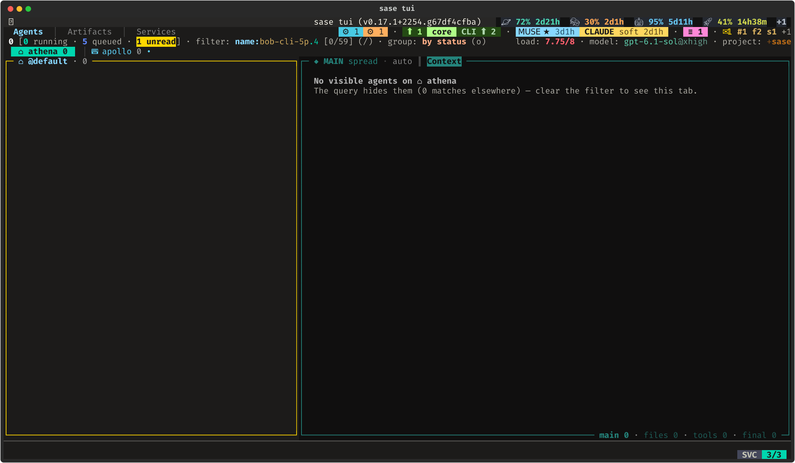
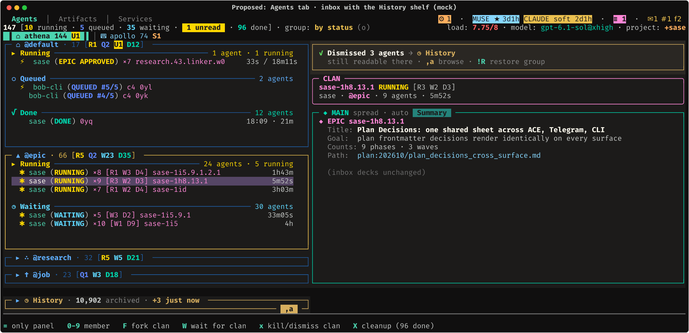
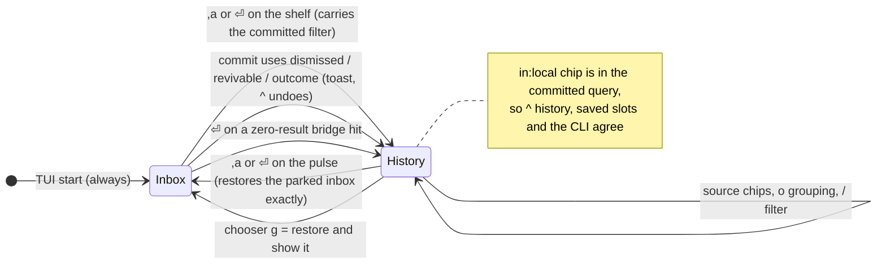
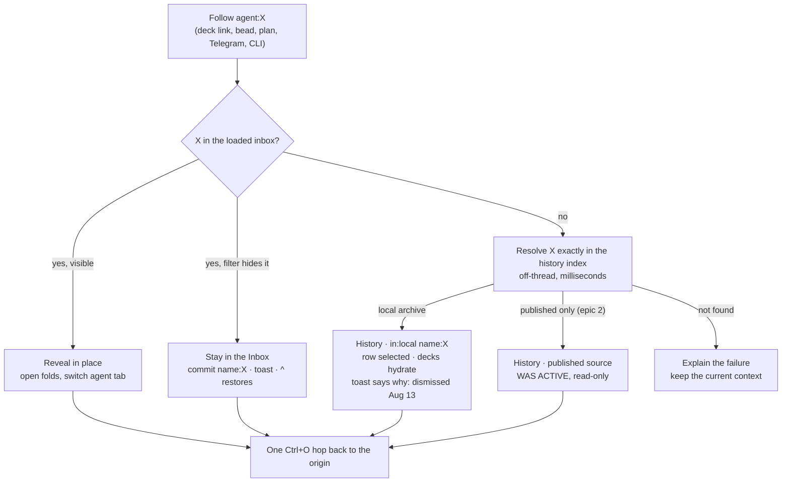
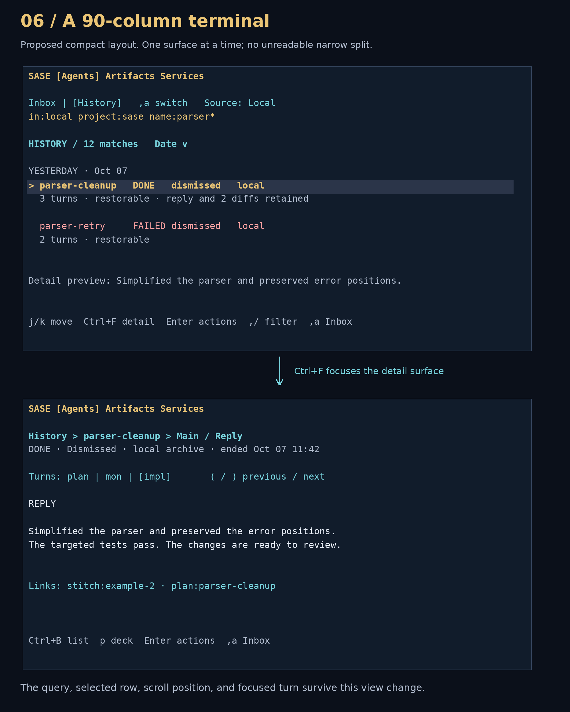
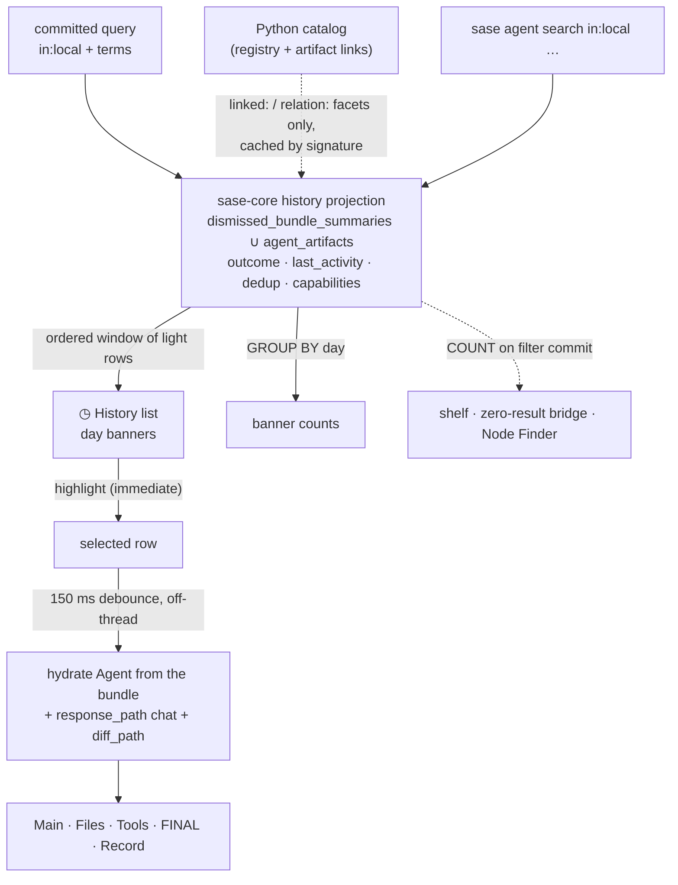
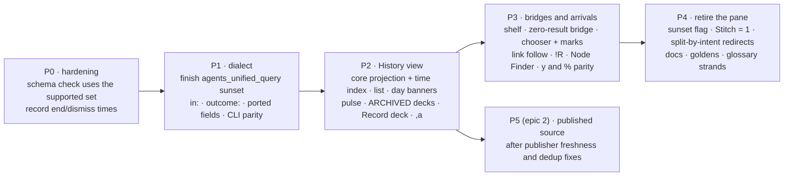

# One agent home: the Agents tab's Inbox and History views

**Consolidated report** · 2026-10-08 · lead researcher · measured on `athena` (sase master
`6f240b3c96`)

**Inputs.** Five independent reports in this directory (`__cdx`, `__cld`, `__grk`,
`__mus`, `__gem`), plus my own checks of the code, the keymap, and athena's archive
indexes. Everything marked **[lead]** is new in this report or corrects one of the five.
The work builds on the September study,
[`agent_history_in_agents_tab.md`](../../202609/agent_history_in_agents_tab/agent_history_in_agents_tab.md).
That study settled *whether* to retire Artifacts ▸ Agent and *what* replaces it: a history
scope on the Agents tab. This report settles **how it looks and behaves**.

**About the visuals.**

- **Today** images are live `sase screenshot` captures by cld.
- **Proposed** screens are terminal-faithful mockups. They are built as character grids
  and rasterized by the project's own renderer (`sase.ace.tui.visual_render`, bundled
  Fira Code), so they compare like for like with the real TUI.
- The five figures new in this report use real row names, counts, and day and month
  totals from athena's archive. Their generator is
  [`generate_figures.py`](agents_tab_inbox_and_history_views__final_assets/generate_figures.py),
  and each PNG has an editable SVG beside it.
- Flows are Mermaid diagrams.
- Figures reused from the five reports are credited in their captions.
- Nothing here has been tested with users. These are design judgments backed by code and
  data checks.

---

## Contents

1. [The recommendation on one page](#1-the-recommendation-on-one-page)
2. [What is true today](#2-what-is-true-today)
3. [Where the researchers disagreed](#3-where-the-researchers-disagreed)
4. [The recommended UX, screen by screen](#4-the-recommended-ux-screen-by-screen)
5. [What the UX needs underneath](#5-what-the-ux-needs-underneath)
6. [Rollout and acceptance](#6-rollout-and-acceptance)
7. [Open questions for Bryan](#7-open-questions-for-bryan)
8. [Recommended UX: summary](#8-recommended-ux-summary)

---

## 1. The recommendation on one page

![Diagram of the recommended design. On the left, the Inbox view: the agent-tab strip, tribe panels, and a one-line History shelf at the bottom reading "History · 10,917 archived · +3 just now" with a ,a badge. On the right, the History view: a HISTORY chip, an in:local filter chip, source chips (This machine, then dimmed Published and Combined), a one-line Inbox pulse ("147 [R10 W35 U1] · 1 needs you"), and a day-grouped list with RUNNING, WAS RUNNING, FAILED and DONE rows. Between them, ,a arrows: going right carries your filter, going left restores the inbox exactly. Along the bottom, the shared reader (Main, Files, Tools, FINAL, plus a new Record deck) and every arrival route, all ending on the Agents tab.](agents_tab_inbox_and_history_views__final_assets/fig_two_views_map.png)

*Recommended design (diagram; new in this report).*

**The Agents tab gets two views: Inbox and History.** Artifacts ▸ Agent goes away. All five
researchers converged on this shape independently, and the September report proposed it
too.

- **Inbox** is today's Agents tab, plus one line at the bottom of the node column: the
  **◷ History shelf**. It shows the archive's size, or the History matches for your
  current filter.
- **History** replaces the tribe panels and agent-tab strip with one day-grouped list of
  past runs. A live **⌂ Inbox pulse** line stays pinned at the top, so an agent that needs
  you never goes unnoticed while you read old runs.
- **`,a` toggles between the views.** Going to History asks the same question of a wider
  set. Coming back restores the inbox exactly as you left it. The shelf and the pulse are
  also clickable with `⏎`.
- **Both views use the same reader:** the real Main / Files / Tools / FINAL decks, plus a
  new **Record** deck. Selecting an archived run hydrates the decks from its dismissed
  bundle and retained chat. **You read without restoring.**
- **Restore is a deliberate action.** `⏎` on an archived row opens the existing Agents
  chooser with a History section. **Restore to inbox** is the default, and you stay in
  History.
- **Every road leads to the Agents tab:** `agent:` links, `!R`, Node Finder, the
  zero-result bridge, the dismiss toast, and legacy Artifacts commands. None of them open
  Artifacts.

What this report adds to the September design:

- the two **bridges** (the shelf and the pulse), so the scope is visible without docs;
- `,a` as a **toggle**, not a cycle through every scope;
- a **past-tense outcome vocabulary** for archived rows;
- the **Record deck**;
- **Restore to inbox** wording;
- a **split-by-intent** redirect for old Artifacts entry points;
- a **`sase-core` SQL projection** behind the list, instead of the Python catalog.

---

## 2. What is true today

### 2.1 Two homes, and the weaker one holds the past


*Today: Artifacts ▸ Agent (live capture by cld, after about 60 s of loading).*



*Today: the dead end. The run finished at 12:06 and was dismissed, and the Agents tab can't
point to it (live capture by cld).*

**Why two homes hurt.** The surface with the good reader (the Agents decks) can't see old
agents. The surface that can see them shows only metadata:

- a prompt cut off at 4,000 characters;
- the chat as a *path*;
- no reply, diff, or tool calls.

Reading an old run in the good reader currently means **restoring it first**.

The code admits the split in two places:

- **Link-follow fallback.** When an `agent:` link can't find a row,
  `_link_follow_toast.py:124` shows *"Agents tab filter hides it — showing Artifacts ▸
  Agent"*.
- **`!R` escape.** The Agents tab's own **Custom revival search…** in the `!R` *Agent
  Restore* modal jumps out of the tab to the pane.

### 2.2 The archive, measured [lead-verified]

cld measured athena this morning; I re-ran the measurements this evening and extended
them. The archive is **74× the inbox**:

- **Inbox:** 147 agents (cld).
- **Archive:** 10,917 top-level runs plus 36,807 workflow children, 47,724 bundles in all
  (`dismissed_bundle_summaries`).
- **Volume:** a median of **110 runs archived per day** over the last 30 days (range
  40–178).
- **Span:** back to 2026-07-06.

The pane is barely used. Athena's `~/.sase/query_history.json` has exactly three `agents`
entries: `limit:100`, `linked:true limit:100`, and `linked:true limit:200` (cld; I
confirmed). The `linked:` facet is the part people use, so it must survive the move.

![Chart titled "What athena's 10,917 archived top-level runs can truthfully say". Three 100% bars. Stored status: 84.6% terminal (done or failed), 15.4% non-terminal on an archived row. Time fields: 69.8% have an end or dismissal time, 30.2% have only a start time. Restorable flag: 100% durably_revivable. Below, three stat tiles for the cost of listing the newest 100 runs: 11.1 s for the Python catalog build, 12–90 s for the Artifacts Agent pane's first rows, and 16–31 ms for one SQL window over the bundle index.](agents_tab_inbox_and_history_views__final_assets/fig_archive_truth.png)

*What the archive's rows can truthfully say (new; read-only SQL against
`~/.sase/dismissed_bundles/index.sqlite`, 2026-10-08).*

| Fact (top-level runs, n = 10,917) | Count | Share | UX consequence |
| --- | ---: | ---: | --- |
| Stored status is terminal (done or failed) | 9,237 | 84.6% | Show as stored, in past-tense styling |
| Stored status is non-terminal (885 `WAITING`, 479 `RUNNING`, 103 `QUEUED`, …) | 1,680 | 15.4% | Show **`○ WAS <status>`**, never a live color (cld's finding, confirmed) |
| Distinct stored status strings | 36 | — | Add a derived `outcome:` field; filtering on raw status is a poor tool |
| End or dismissal time recorded | 7,621 | 69.8% | Sort and group by it |
| **[lead]** Only a start time, in the bundle itself | 3,296 | 30.2% | Mostly legacy (2,063 from August, 49 from October). Fall back to the start time and **mark it**. Don't infer times from file mtimes. |
| **[lead]** `durably_revivable = true` | 10,917 | 100% | A "revivable" chip on every row carries no information. **Badge only the exceptions.** |
| **[lead]** Restores recorded (`times_revived > 0`) | 0 | 0% | Either restores are rare or they aren't recorded here; I couldn't tell which. Reading, not restoring, is the main job. |

| Path to "newest history rows visible" | Time | Source |
| --- | ---: | --- |
| Artifacts ▸ Agent, opened during TUI startup | ≈ 90 s | cld (live) |
| Artifacts ▸ Agent, settled TUI, first 500 rows | ≈ 12 s | cld (live) |
| `sase agent search -l 0 -j` (Python catalog) | 11.1 s | cld |
| One SQL window over `dismissed_bundle_summaries` (no time index; full scan) | 16–31 ms | lead (cld: 17–27 ms) |
| Name `LIKE` count over the same table | 16 ms | lead (cld: 15 ms) |

### 2.3 Code facts the design depends on [lead-verified]

| Fact | Where | Why it matters |
| --- | --- | --- |
| Leader `,a` is unbound (`,A` is the run log, `,r` is revert, `,y` is full-history refresh) | `default_config.yml` `leader_mode` | `,a` is free for the toggle |
| `w` is **reword** on the Agents tab and **revive** on the Agent pane | `bindings.py:18`, app keymap | The pane's `w` can't move over. grk's "lens-scoped `w`" would give one key opposite jobs. |
| `r` is **agents_refresh**; `R` is retry | app keymap | gem's bare `r` = revive collides |
| `y` is bound only to `artifacts_copy_reference` | app keymap | `y` is free on the Agents tab for "copy `@agent` ref" (cld) |
| `~` (sibling/family) is a **no-op on Agents** ("tabs without a relation contract") | `navigation/_tree.py:104` | It is free today, but it is the relation key elsewhere. Don't spend it on the toggle (corrects cld's open question). |
| `<` / `>` are **deck-swap aliases** on Agents | `swap_deck_panel_*` | History relation jumps go through the Jump panel and Record deck, not `<` (corrects cld's mock) |
| Deck picker letters are `m f t n`; reserved `j k q p` | `decks/spec.py`, `titles.py` | `p r` is free for a Record deck |
| `[` / `]` cycle **agent tabs** (placements) on Agents | `next_agents_tab` | gem's "`[`/`]` next deck" is wrong. History hides the agent-tab strip. |
| `Ctrl+J` / `Ctrl+K` are next/previous **deck card** on Agents and load more/unload on Artifacts | app keymap | No "load more" key in History. Use windowed scrolling. |
| Detail debounce is 150 ms | `util/debounce.py:21` | gem's 25 ms is not the project's value |
| The top tab bar shows names only, no badges | `widgets/tab_bar.py` | Nothing outside the Agents tab shows live attention. That justifies the pulse and a `◷` marker on the tab label. |
| `FIXED_ARTIFACTS_SUBTAB_ORDER = (agents, stitches, patches, beads, files)`; `LEGACY_ARTIFACTS_SUBTABS["chats"]` maps to the default | `_artifact_tab_model.py:27,42` | Retiring the pane makes Stitch `1`, with the Chats precedent for persisted state |
| `show_artifacts_agents` is a live action | `_app_action_availability_artifacts.py:146` | It needs a forward route, not just a deletion |
| The catalog's index check is still an exact match against `36` (the supported set `{33…36}` exists but isn't used) | `catalog/_sources.py:94-97` | September's P0a hardening is still open (cld F9, grk §7) |
| Copy palettes: Agents `%` has `c E n p @ r s`; the pane's has `@ ! n l p P c j s` | `copy_mode` | Merge in `!` handoff, `l` link, `j` json. The pane's `p` (path) needs a new letter, because `%p` is prompt on Agents. |

---

## 3. Where the researchers disagreed

All five agree on the core: two views of one tab, the same decks, read without restoring,
no history rows in the live tree, no fourth top-level tab, no `[History]` agent tab, no
`@history` tribe, and published history as a later epic. They split on the details below.

![Grid of sixteen design questions. Columns are the five researchers (cdx, cld, grk, mus, gem), and each cell is marked as matching, partly matching, or differing from the resolution in the last column. Examples: ",a behavior" (cdx and cld toggle; grk, mus and gem cycle; resolution: toggle, with sources as chips); "Chooser default" (cdx a read action, the others revive; resolution: Restore, staying in History); "Old Artifacts entry points" (resolution: persisted state goes to Stitch, explicit commands go to History); "History list data source" (resolution: sase-core SQL projection).](agents_tab_inbox_and_history_views__final_assets/fig_consensus.png)

*Researcher positions and the resolution (new). Cells paraphrase each report.*

| Question | Resolution | Why |
| --- | --- | --- |
| **`,a`: toggle or cycle?** | **Toggle** Inbox ⇄ History. Sources (This machine / Published / Combined) are chips inside History. | A return gesture must be predictable (cdx, cld). A 3- or 4-way cycle makes "go back" depend on how far you went. Published doesn't exist in v1, so a cycle buys nothing now. |
| **How do people find History?** | The **shelf** (Inbox) plus the **zero-result bridge**. The inbox info row stays as it is. | The shelf looks like a collapsed tribe panel (no new visual language), sits in `J`/`K` order, and counts matches for the current filter (cld). grk's header chip and cdx's segmented switch say the same thing with more chrome. |
| **Attention while in History** | The **Inbox pulse**, plus `Agents ◷` on the top tab label | cld's pulse fixes the September design's blind spot. grk's tab marker matters because the tab bar has no badges (§2.3). |
| **Typing an archive-only field in Inbox** | **Widen to `in:local` with a toast; `^` undoes.** Never widen to published. | 4 of 5 agree, as does the September report. cdx wanted a suggestion only, but a visible toast plus a one-key undo is not "silent". |
| **Default grouping** | **Day** (Today / Yesterday / days / last week / months) | About 110 runs a day; Session grouping produced a "(no session)" bucket (cld). |
| **Row time** | **Last activity** (latest end, then dismissal), falling back to start time, **marked** | Sorting by start hid long runs: `sase-1h7.land` started Oct 6 and finished Oct 8 at 01:38. 30% of rows have only a start time (§2.2). |
| **Stale stored status** | **`○ WAS <status>`** in the `STOPPED` violet | 15.4% of rows (cld; confirmed) |
| **Revive entry point** | **The `⏎` chooser only.** No bare key. | `w` = reword and `r` = refresh (§2.3). grk's lens-scoped `w` is, in grk's own words, "the highest-severity UX bug" risk. |
| **Chooser default** | **Restore to inbox**, and you **stay in History** | The decks already show everything on selection, so `⏎` means "act". Restoring is reversible and starts no run. Staying put keeps bulk work in place (cdx). cdx's worry about accidental restores is answered by the label and the toast. |
| **What to call it** | **Restore to inbox** (keep "revive" as a help and palette alias) | Matches the `!R` modal title, *Agent Restore*. Says what happens. Doesn't sound like a relaunch (cdx). |
| **Pane metadata and relations** | A **Record deck** (`p r`), for every agent | Keeps the pane's one used facet (`linked:`/`relation:`) inside the deck model, and it works in splits (cld) |
| **Old Artifacts entry points** | **Split by intent.** Persisted `agents` sub-tab state goes to **Stitch**, with a one-time toast. An explicit `show_artifacts_agents` command, palette entry, or user keymap goes to **Agents ▸ History**. | grk is right that a deliberate "open the agent catalog" belongs in History. cld, mus and gem are right that restoring Artifacts' last sub-tab must not teleport you to another tab (cdx's split). |
| **Startup with a History query** | **Always open the Inbox.** History's last query waits behind `,a`. | No archive work before first paint (`tui_perf` rule 9), and no paint-then-swap special case (cld) |
| **History list data source** | **A `sase-core` SQL projection** over the existing indexes | 16–31 ms vs 11 s (§2.2). The CLI and TUI must return the same rows, which is the Rust-core boundary rule. |
| **Restorable chip** | **Exceptions only**: `⊘ can't restore`, `⌂ inbox`, `hidden` | 100% of top-level rows are restorable today [lead] |
| **Default project scope** | **All projects**, like the Inbox. `project:` is a filter and a grouping. | cdx inherited the current project. The Inbox is cross-project, and switching views shouldn't silently narrow. |

**Corrections to individual reports.**

- **gem** has the most errors:
  - `r` revive collides with refresh, and `,r` is already revert.
  - `[`/`]` are agent tabs, not deck cycling.
  - The debounce is 150 ms, not 25 ms.
  - Its mockup data is invented (a `gemini-3.8-flash` model, a "v0.24" TUI, costs).
  - Its infographic clips text.

  Its structure is sound and matches the consensus, and its FILES / TOOLS / FINAL deck
  mockups and retention notice are useful.
- **grk** says `w` is Wait/unwait on the Agents tab. It is reword (§2.3).
- **mus** quotes September's apollo numbers (228 inbox / 3,438 dismissed) as current. On
  athena the archive is about 3× larger.
- **cld**: `~` is free only as a no-op (see §2.3), and the Jump panel's `<` would collide
  with deck swap.

---

## 4. The recommended UX, screen by screen

### 4.1 Inbox: unchanged, plus a History shelf



*Proposed Inbox with the History shelf and the dismiss toast (mock by cld).*

- **The shelf is a collapsed nav section** pinned below the last tribe panel.
  - It looks like a collapsed tribe panel, and `J`/`K` reach it.
  - `⏎`, `l`, or a click opens History.
  - It holds no rows, and it is never counted in tab totals, unread, attention, `load:`,
    or bulk actions.
- **Its text depends on the filter.**
  - **No filter:** `◷ History · 10,917 archived · +3 just now`.
  - **Committed filter:** `◷ History · 7 matches for this filter`. The count is an
    off-thread SQL count, run on commit and never per keystroke.
  - **Empty inbox result:** the shelf turns amber.
- **The dismiss toast teaches the model.** `x`, `X` and `s` end with "→ ◷ History ·
  `,a` browse", so what you dismissed visibly went somewhere you can follow.
- **Everything else is byte-for-byte today's inbox:** tribes, agent tabs, unread, `load:`,
  the footer, and `I` (which still hides non-run inbox rows).

### 4.2 History: anatomy

![Proposed History view. Top tab label "Agents ◷". Info row: HISTORY chip, "11,061 runs (144 live)", filter chip "in:local", "group: by day", "newest activity first", and on the right "✓ searched all local history · ,a inbox". Source strip: "◷ This machine 11.1k" active, Published and Combined dimmed as epic 2. Left: an Inbox pulse line "⌂ Inbox · 147 [R10 Q5 W35 U1 D96] · 1 needs you", then a History list with "Today · Thu Oct 8 — 33 runs": a live research.45 ×6 RUNNING row marked ⌂ inbox, a 0yn "○ WAS RUNNING" row with an italic start-only time, EPIC CREATED and TALE DONE rows, a "✗ FAILED toobig-7e ×7" container row, the selected bob-cli-5p.4 DONE row, and sase-1h7.land "31h18 from Oct 6". Below, Yesterday and collapsed day, week and month banners with real counts. Right: an "AGENT · ◷ ARCHIVED · read-only" header, the MAIN deck showing the run's Reply and full prompt, deck counts including "record 4", and a JUMP panel with clan members and relations.](agents_tab_inbox_and_history_views__final_assets/fig_history_view.png)

*Proposed History view (mock, new; row names and counts are real athena data, and the reply
text is from cld's mock).*

| Region | Inbox view | History view |
| --- | --- | --- |
| Top tab label | `Agents` | `Agents ◷`: you'll land in History when you come back |
| Info row | `147 [10 running · …] · group: by status (o)` | `◷ HISTORY` chip · run count · filter with an `in:local` chip · `group: by day (o)` · completeness (`✓ searched all local history` or `searching older history…`) |
| Strip row | Agent-tab strip `⌂ athena 144 │ ⌨ apollo 74` | **Source chips**: `◷ This machine` (later `↑ Published`, `∪ Combined`) |
| Node column, top | First tribe panel | **⌂ Inbox pulse** (one line, live) |
| Node column, body | Tribe panels and the live tree | **◷ History** nav section: day banners and run rows |
| Identity header | Live identity | Same widget, titled **`◷ ARCHIVED · read-only`**, with an "ended / ran / dismissed" ribbon |
| Decks | Main · Files · Tools · FINAL | **The same decks**, hydrated from the bundle, plus **Record** (`p r`) |
| Jump panel | Clan members and neighbors | Clan siblings and a relations line (digit keys; no `<` or `~`) |
| Footer | Live keys | `⏎ restore / fork / copy…` · `p r` record · `y` copy ref · `e` open chat · `m`/`u` marks · `,a` inbox · `^` previous filter |

**Visual language: amber means History.** The chip, the panel border, `ARCHIVED`, the
source chip, and the Record deck use one warm amber (`#d7af5f`). Live yellow (`RUNNING`,
unread) and deck cyan stay exactly as they are, so a glance tells you which world you're
in (cld). Every state also has a text label and a glyph, so color is never the only cue
(cdx).

### 4.3 History rows tell the truth

```text
  TIME   OUTCOME            NAME                         MODEL   RUNTIME  CHIP
  19:52  ● RUNNING          research.45 ×6               mixed   1h40     ⌂ inbox
  19:18  ○ WAS RUNNING      0yn                          opus    —                 ← italic time: start only
  12:22  ✗ FAILED           toobig-7e ×7                 muse    —
  12:06  √ DONE             bob-cli-5p.4                 muse    1h00
  01:38  √ DONE             sase-1h7.land                opus    31h18    from Oct 6
```

- **Time** is the run's **last activity**: the latest turn's end, else its dismissal
  time, else its start time.
  - A start-only time renders in dim italics, and the identity header says "started
    19:18 · end not recorded".
  - Day banners group by the same timestamp, in local time. The detail view shows the
    exact time and zone.
  - This should be one derived field in `sase-core` (cdx, cld; the fallback marking is
    [lead]).
- **Outcome** is past tense. The specific word stays; the glyph carries the class:

  | Stored status | Row shows | Style |
  | --- | --- | --- |
  | `DONE`, `TALE DONE`, `EPIC CREATED`, `PLAN DONE`, `TESTED`, … | `√ <status>` | dim green |
  | `FAILED`, `PLAN FAILED`, `EPIC TIMED OUT`, `LAUNCH REJECTED`, … | `✗ <status>` | dim red |
  | Any non-terminal status on an archived row | `○ WAS <status>` | `STOPPED` violet, never green or yellow |
  | A live inbox row inside History | `● <status>` | live colors, plus `⌂ inbox` |
  | Published, non-terminal (epic 2) | `○ WAS ACTIVE · as of <age>` | violet |

  A new derived **`outcome:done|failed|interrupted|live`** field filters exactly what
  the glyph shows (cld).
- **One row per run or container.** Clans and sessions collapse to `name ×N`, and `l`
  expands their members. Workflow children and registry-only "thin" rows stay hidden
  unless they are revealed by exact reference (September A3). A query that matches one
  session member says "1 matching turn / 3 turns" and lands on that turn (cdx).
- **History includes live local runs, marked `⌂ inbox`.** `in:local` ⊇ the local inbox,
  so a History search never misses a run that happens to be alive. Fleet-only rows
  (other machines' live agents) stay in the Inbox, because "This machine" must mean
  this machine (cdx).
- **Chips mark exceptions only:**
  - `⌂ inbox` (live);
  - `hidden` (not dismissed, but hidden);
  - `⊘ can't restore` (no valid bundle).

  A restorable chip on every row would be noise (§2.2). Only the selected row gets a
  second line: "reply + 6 diffs retained" or "reply not retained".
- **Grouping** (`o` in History): day (default), hood (the `<name>.` prefix, which
  replaces Session), project, outcome, and tribe. Today and Yesterday start open; older
  banners start collapsed and show counts from one `GROUP BY`. Collapsed banners are nav
  items, not agent nodes.
- **Size.** There is no "load more" key, because `Ctrl+J`/`Ctrl+K` are deck-card keys
  here. Rows stream into the visible window as you scroll, and a long banner ends in
  `⋮ 129 more · l expands`.

### 4.4 Getting in and out



- **Going wider carries your filter.** `,a` from the Inbox opens History with the inbox's
  committed filter, or with History's own last filter if the inbox has none.
  - Terms History can't answer (`unread`, `pinned`, `needs`, and `text:` until a
    full-text index exists) are dropped and listed in a dim `dropped: unread:true` chip.
  - "Search, find nothing, press `,a`" works (cld).
- **Coming back restores the inbox exactly:** filter, selection by stable identity, folds,
  agent tab, tribe panel, focused deck and card, and scroll. History parks its own source,
  filter, grouping, selection, and deck position separately (cdx).
- **The scope is visible in the query.** The committed query really contains `in:local`,
  rendered as a chip. Deleting the chip or typing `in:inbox` returns to the Inbox. The
  chip and the view can never disagree.
- **Three keys, three meanings:**
  - `,a` switches views;
  - `^` restores the previous committed query;
  - `Ctrl+O` goes back along the navigation trail, including across tabs (cdx).
- **Startup always opens the Inbox.** History is an exploration state.
- **Palette entries:** *Agents: browse History* and *Agents: back to Inbox*. Both bridges
  and the source chips are clickable.

### 4.5 Search: the zero-result bridge, fields, and Node Finder


*The zero-result bridge replaces today's "0 matches elsewhere" dead end (mock by cld; the
mock's `↺` chip is dropped in this design).*

When an inbox filter matches nothing, the empty-state card runs the same filter against
History. It shows an off-thread count plus the top 5 rows:

- `⏎` opens the highlighted match in History.
- `,a` carries the whole filter over.
- If the filter uses a field the index can't answer, the count shows `?` and the card
  says "`,a` to search". It never claims "no matches" before a search completes (cdx).

**Fields by view.** Completion lists only the fields that apply to the current view.
Anything else gets a warning, not an error.

| Field group | Inbox | History (local) | Published (epic 2) |
| --- | :---: | :---: | :---: |
| `name session clan project role workflow model provider kind attempt retry since until` | ✓ | ✓ | ✓ |
| `status` (stored, raw) | ✓ | ✓ | ✓ |
| `outcome` *(new)* | ✓ | ✓ | ✓ |
| `state dismissed revivable durably_revivable historically_viewable restartable` | widens to History | ✓ | partial |
| `linked relation artifact parent clan_tribe` | ✓ (ported) | ✓ | — |
| `tab` | ✓ | ✓ (bundles keep `agent_tab`) | — |
| `unread pinned needs source cl` | ✓ | — | — |
| `text` (transcripts) | ✓ | after a full-text index (`dismissed_bundle_search_fts` exists and is empty) | — |

**Node Finder (`"`)** gains an *In History* section under the live matches: at most 5 rows
from the same index (16 ms). `⏎` opens History with that run selected (cld). It's the
fastest path when you know a name. This is P3 polish, not a v1 blocker.

**Saved queries.** Athena's three `agents` entries move into the Agents history with
`in:local` prepended. The catalog's `tribe:` becomes `clan_tribe:` so it keeps its
meaning (cdx, September).

### 4.6 Reading without restoring: the decks and the Record deck

| Deck / card | Inbox row | Local archived row | Thin row (registry only) | Published row (epic 2) |
| --- | --- | --- | --- | --- |
| **Main ▸ Context** | live | the full prompt from the bundle (never cut at 4,000 chars) | — | `prompt.md` if published |
| **Main ▸ Reply** | live | the chat at `response_path`; partial text marked *(partial)* | — | `chat.md` |
| **Files** | live | `diff_path` and commits, else *not retained* | — | snapshot commits, if local |
| **Tools** | live | `tool_calls.jsonl` if retained | — | *not published* |
| **FINAL** | live | the finalizer record from the bundle | — | *not published* |
| **Record** *(new, `p r`)* | ✓ | ✓ | ✓ (the only deck) | ✓ |


*The Record deck absorbs the pane's Details panel and relation rail (mock by cld). In this
design, relation jumps use the Jump panel's digits, because `<` is deck swap on Agents.*

**Hydration rules.** These come from `tui_perf` and are already used by the pane:

- The highlight moves immediately.
- The decks hydrate through the existing 150 ms `DetailPanelDebouncer`, off-thread, and
  the selection is re-checked after each await.
- A new selection shows a placeholder under the *new* identity header. It never shows the
  previous agent's reply under the new name (cdx).
- A missing file yields a titled *not retained* card, never a blank deck.

Reading never revives, never clears an inbox identity's unread flag, and never creates
local agent state.

### 4.7 Acting on archived runs

![Two-panel mock. Left: the chooser "Act on bob-cli-5p.4 · archived · √ DONE" with a HISTORY section (r Restore to inbox — shows it again · starts no new run, highlighted as default; g Restore and show it; F Fork into a new agent), a READ AND REFER section (e Open chat in $EDITOR; y Copy @agent reference; % More copy targets), the existing PATCH section, and a note "With marks: Restore 4 marked · skips 1 (no bundle) and says why". Right: after restoring, the History list keeps the row in place with its chip flipped to "⌂ inbox", the pulse shows 148 with "+1", and a toast "bob-cli-5p.4 is back in the inbox. No new run started. The inbox filter would hide it: status:RUNNING — g show it in the inbox · ,a back to where you were".](agents_tab_inbox_and_history_views__final_assets/fig_act_and_restore.png)

*Acting on an archived run (mock, new).*

- **`⏎` opens the existing `AgentActionChooserModal`** with a HISTORY section ahead of
  the usual sections.
  - The default is **Restore to inbox** ("shows it again · starts no new run").
  - If the row can't be restored, the default falls to **Open chat**.
- **After a restore you stay in History.** The row's chip flips to `⌂ inbox`, and the
  pulse counts it immediately.
  - The toast offers `g` (show it in the inbox) and warns when the inbox filter would hide
    it.
  - With `dismissed:true` in the filter, the row leaves the results and the highlight
    moves to the next row.
  - `g` is the deliberate jump. It records one `Ctrl+O` hop, and `,a` still returns to the
    parked inbox (cdx).
- **Containers.** On a clan or session row, the action reads *Restore clan research.41 (6
  members)* and restores the members that can be restored.
- **Marks.** `m` marks rows, and with marks the default becomes *Restore N marked*. The
  chooser lists skipped rows with reasons and reports restored / skipped / failed
  counts. Capabilities are re-checked just before submitting. History marks are separate
  from inbox marks.
- **Live-only keys explain themselves.** `x X s w W A R n N` and tab or tribe moves raise
  one toast: *"`x` acts on live agents — bob-cli-5p.4 is archived · `⏎` to restore"*.

| Action | Inbox row | Local archived row | Published-only row (epic 2) |
| --- | --- | --- | --- |
| Read in the decks | ✓ | **✓, without restoring** | ✓ (sidecar files) |
| Restore to inbox (`⏎ r`, `⏎ g`, marks) | — (offer *Show in inbox* if hidden) | ✓ unless `⊘` | ✗ (a document, not a local agent) |
| Fork (`F`, or `⏎ F`) | existing rules | ✓ if a chat is retained | later: a *new* run from `prompt.md`, never an import |
| Copy (`y`, `%`) | ✓ | ✓ | ✓ |
| Open chat (`e`) | ✓ | ✓ (read-only) | ✓ |
| Kill, retry, answer, wait, rename, tribe or tab moves | ✓ | ✗ (toast) | ✗ |

### 4.8 Arriving from elsewhere




*Link-follow arrival in History (mock by cld; "revive" reads "restore" in this design).*

- **Every `agent:` link ends on the Agents tab.** Delete the `agents_tab_fallback` route
  and its toast, and point `target_for_ref_kind("agent")` at Agents.
  - The arrival toast keeps the existing reveal format and adds *why* the run is in
    History.
  - Resolution is a targeted, exact-name lookup. It never loads the whole archive to
    open one run.
- **`!R` keeps its modal** (saved groups and recent dismissals). Its last entry becomes
  **Search History for restorable runs…**. It commits `in:local state:dismissed` on the
  Agents tab instead of switching to Artifacts. The test-only helper
  `_show_dismissed_agents_for_custom_search` can go (cld).
- **Files ▸ agent, relation links, and the command palette** retarget the same way.


*Artifacts after retirement (mock by cld).*

- **On the Artifacts tab, Stitch becomes `1`.** It is already the default sub-tab.
- **Old entry points split by intent:**
  - A **persisted** `agents` sub-tab maps to Stitch (`LEGACY_ARTIFACTS_SUBTABS["agents"]`,
    following the Chats precedent), with the one-time toast above.
  - An **explicit** `show_artifacts_agents` action, palette command, or user keymap opens
    **Agents ▸ History**. That person asked for the agent catalog.

### 4.9 Keyboard map

| Key | Inbox | History | Notes |
| --- | --- | --- | --- |
| `,a` | open History (carries the filter) | back to the Inbox (exactly as left) | Unbound leader key today |
| `⏎` | act on agent (gates, Patch) | chooser: Restore · Restore and show · Fork · Open chat · Copy · Patch | Same modal, plus a HISTORY section |
| `j k g G h l z` | as today | as today, over banners and containers | |
| `J K` | next / previous panel | pulse ⇄ History section | |
| `o` | grouping picker | History picker: day · hood · project · outcome · tribe | |
| `/ ^ _ * 0N` | query, history, saved slots | the same, with an `in:local` chip | |
| `p` then `m f t n` | deck picker | the same, plus **`r` Record** (both views) | `r` is free in the picker |
| `y` | **copy `@agent:` ref** (new) | same | Free on Agents today |
| `%` | copy palette, plus `!` handoff, `l` link, `j` json, and a new path letter | same | `%p` stays prompt |
| `F` / `e` / `m` / `u` | fork / open chat / mark / clear | fork / open chat (read-only) / mark (History-only) / clear | |
| `"` | Node Finder | same, plus *In History* | P3 |
| `I` | show or hide non-run inbox rows | show or hide never-ran rows | Same meaning, narrower set |
| `[` `]` | cycle agent tabs | toast: "agent tabs are inbox-only" | The strip is hidden |
| `x X s w W A R n N`, tab and tribe moves | live actions | toast: archived · `⏎` to restore | |
| `Ctrl+J` / `Ctrl+K` | next / previous card | the same (**not** "load more") | |

Per the repo gotcha, `,a`, the History `o` picker, `p r`, `y`, and the `%` additions all
need entries in `src/sase/default_config.yml`. The `?` help modal needs a *History* box.

### 4.10 Narrow terminals, loading, and missing content



*A 90-column terminal (concept by cdx).*

The Agents list has a 60-cell minimum, so a 90-column terminal can't fit a useful list and
deck side by side.

- **Below about 110 columns,** History shows one full-width surface at a time.
  `Ctrl+F` / `Ctrl+B` move between the list and the detail.
- **The detail surface** carries a breadcrumb (*History › bob-cli-5p.4 › Reply*).
  Selection and scroll survive the switch.
- **Source and project controls** become pickers.

These widths are design probes, not measured breakpoints (cdx).


*States with distinct copy and a next action (by cdx).*

| Situation | What you see |
| --- | --- |
| First `,a` in a session | The list paints from SQL in one frame. No spinner is expected. |
| Index rebuilding, or a future schema bump | `◷ History · rebuilding index…` with the count so far. Indexed rows stay usable. |
| A search is still running | "Showing 50 loaded results; searching older history…", never "50 matches" or "No matches" |
| Bundle unreadable | The row stays. The decks show one card, *Archive entry unreadable — Record only*. |
| Chat or diff deleted by retention | That card says *not retained (retention)*. The other cards render. |
| Empty archive (new install) | `◷ History · nothing archived yet — x moves finished agents here` |
| Published source missing or stale (epic 2) | The source chip turns amber or red. Local rows are never hidden because of it. |

### 4.11 Later (epic 2): published history in the same view


*Published history arrives as source chips in the same view (mock by cld).*

No new chrome is needed. The source chips widen to **Published** or **Combined** (the
honest label for `in:all`). Each row carries a provenance chip: `⌂ here`, `↑ <machine>`,
or `⌂+↑ both`.

- **Liveness.** Non-terminal published runs say `○ WAS ACTIVE · as of <age>`.
- **Freshness.** Show three separate facts: snapshot revision, last sync time, and the
  run's own observation time. A recent sidecar pull doesn't prove an old `ACTIVE` was
  refreshed (cdx).
- **Rows are documents.** You can read, copy, and follow them; fork comes later. They are
  never restored and never imported.

This still waits on the September report's publisher fixes: stale `active` states, and
duplicate `source_run_id`s published under two owners.

---

## 5. What the UX needs underneath

The screens make three promises:

- History paints within one frame of the keypress;
- the shelf and the bridge count on every filter commit;
- the decks hydrate per row.

The Python catalog build (11 s on athena) can't keep the first two. The existing SQLite
indexes can.



- **The row source is the indexes that already exist** (cld).
  - `dismissed_bundle_summaries` has 45 columns, including name, status, times, model,
    provider, workflow, the child flag, and all three capability flags.
  - It already indexes the archive key `(source_username, source_machine,
    source_run_id)`, which is the dedup key.
  - `agent_artifacts` covers the live and done side.
- **A `sase-core` projection** owns the scope semantics, the outcome mapping, the
  last-activity derivation (with its start-only flag), dedup, and capabilities. That is
  the Rust-core boundary rule: `sase agent search in:local Q` and the TUI must return the
  same ordered identities.
- **[lead] Add a time index.** The table has no index on `start_time`, `stop_time`, or
  `dismissed_at`. Today each window, count, and banner query is a 16–31 ms full scan of
  47.7k rows. That's fine once, but not for scroll-driven windows plus counts. Persist a
  `last_activity_at` column and index it with the child flag.
- **The Python catalog keeps a narrow job.** It supplies the registry spine and the
  `linked:`/`relation:` facets, fed into the projection and cached by signature. It stays
  off the paint path.
- **Every field declares pushdown or a fallback** (`KNOWN_FALLBACK_FIELDS`). A fallback
  marks the result incomplete, and the header says so.

**Prerequisites:**

1. **Harden the catalog's schema check.** It is still an exact match against `36`; use the
   supported set (September P0a, cld F9, grk).
2. **Record end and dismissal times** for every new bundle. The legacy gap is shrinking
   (49 rows in October), but the History view must still flag start-only times.
3. **Finish the `agents_unified_query` sunset,** so there is one query path to add `in:`
   to (September P1).

---

## 6. Rollout and acceptance



| Phase | Visible to the user | Visual acceptance (PNG goldens) |
| --- | --- | --- |
| P2 | `,a` opens History, painted in under 100 ms on athena-sized data. Archived decks open without restoring. | History with Today, Yesterday and collapsed months; an ARCHIVED header; a Reply card from a bundle; *not retained* cards; a start-only italic time |
| P3 | Shelf, zero-result bridge, `⏎` chooser and marks, link follow into History, `!R` retarget, `y` | Shelf (plain and lit); bridge; chooser with and without marks; restore toast; link-arrival toast |
| P4 | Artifacts ▸ Agent removed behind a `sunset` flag | Renumbered Artifacts strip; one-time toast; `show_artifacts_agents` landing in History |

**Gates:**

- j/k p95 under 16 ms in History.
- No archive-scaled work on inbox first paint or idle ticks.
- `sase agent search in:local Q` and the TUI return the same ordered identities.
- No History row ever affects unread, attention, `load:`, runner slots, or bulk actions.
- The pane isn't deleted until restore, copy, relations, saved queries, and link
  conformance all have parity tests (September).

**Short task review** (cdx). Once P2 and P3 exist, Bryan does these at real terminal
widths (90, 132, and 180 columns). Each should succeed without explanation:

- find yesterday's dismissed reply and read it without restoring;
- browse History, then return to an inbox gate with the same query, selection, and card;
- follow a bead → archived agent → `Ctrl+O` back to the bead;
- restore a run that the inbox filter hides, and predict what happens;
- open a run whose reply was pruned and understand why it's missing.

---

## 7. Open questions for Bryan

1. **Is `,a` enough on its own?** I recommend `,a` plus the clickable shelf and pulse.
   Bare-key candidates are scarce: `~` and `<` already mean family navigation and deck
   swap, and `H`, `p`, `w`, `r`, and `[`/`]` are taken.
2. **What should the shelf show with no filter?** Options are `+N since you last looked`,
   which needs one stored watermark and reads like a receipt for what you dismissed, or
   only the total, which is simpler. I lean toward the watermark.
3. **Which name?** **History** or **Archive**. I recommend History: the list includes live
   rows, and "archive" suggests only dismissed ones. The only collision is a weak one with
   query history (`^`).
4. **Container restore.** Should restoring a clan row restore every restorable member (my
   proposal, matching `!R` groups), or should it open a member picker?

---

## 8. Recommended UX: summary

**Make the Agents tab the only home for agents, with two views joined by one key and two
one-line bridges, reading every run in the same decks.**

1. **Two views, one tab.**
   - **Inbox** is today's Agents tab, unchanged, plus a **◷ History shelf** at the bottom
     of the node column. The shelf shows the archive size, or the History matches for
     your filter.
   - **History** replaces the tribe panels and agent-tab strip with a day-grouped list of
     past runs, topped by a live **⌂ Inbox pulse**.
   - **`,a` toggles** between them. Going to History carries your filter; coming back
     restores the inbox exactly. The tab label reads `Agents ◷` while History is parked.
   - **Startup always opens the Inbox.**
2. **The scope is real and visible.**
   - History's filter really contains `in:local`, shown as an amber chip, so `^`, saved
     slots, and `sase agent search` agree.
   - Source chips (**This machine**, later **Published** and **Combined**) live inside
     History.
   - Typing an archive-only field in the Inbox opens History with a toast and a `^` undo.
   - An empty inbox search lists its History matches on the spot.
3. **History rows tell the truth.**
   - Rows are sorted and grouped by last activity, with start-only times marked.
   - Outcomes are past tense (`√ DONE`, `✗ FAILED`, `○ WAS RUNNING`), with a matching
     `outcome:` field.
   - Live local runs appear with `⌂ inbox`, so History search never misses one.
   - Chips mark only the exceptions, and amber is the only History accent.
4. **Read without restoring.** The selected run opens in the real decks, hydrated from its
   dismissed bundle and retained chat, under an `ARCHIVED · read-only` header. Missing
   files say *not retained*. A new **Record** deck (`p r`) holds lifecycle, provenance,
   relations, and links for every agent.
5. **Act deliberately.**
   - `⏎` opens the Agents chooser with **Restore to inbox** as the default ("starts no new
     run"); you stay in History and the row flips to `⌂ inbox`.
   - `g` restores and shows the agent in the inbox.
   - Marks restore in bulk.
   - There is no bare revive key. Live-only keys explain themselves. `y` copies the ref.
6. **Every road leads here.**
   - `agent:` links land on the Agents tab: a live target in the Inbox, anything else in
     History, with a toast that says why.
   - `!R` ▸ *Search History for restorable runs…*, Node Finder's *In History*, the dismiss
     toast, and explicit legacy pane commands all land in History.
   - Artifacts loses its Agent sub-tab. Stitch becomes `1`, and a persisted `agents`
     sub-tab maps to Stitch with a one-time "moved" toast.
7. **Built on an index, not the catalog.**
   - A `sase-core` projection over the existing bundle and artifact indexes, with a new
     time index, serves the list, the counts, the bridges, and the CLI: 16–31 ms per
     window instead of 11–90 s.
   - The pane is deleted behind a `sunset` flag once parity tests pass.
   - Published history arrives later in the same view, as read-only documents.

---

## Sources

**Swarm reports (this directory).**

| Report | Main contributions used |
| --- | --- |
| `__cdx` (interaction atlas) | Toggle semantics; parked state per view; Restore to inbox; stay-in-History restore; source labels (This machine / Combined); presence vs status; compact terminals; state plate; split-by-intent legacy routing; validation tasks |
| `__cld` (screen by screen, measured on athena) | Live captures; archive measurements; the shelf and pulse bridges; outcome vocabulary; day grouping; Record deck; zero-result bridge; SQL projection; most reused mocks |
| `__grk` (History lens) | Key-collision framing; the Memory Timeline lens precedent; `Agents*` tab marker; dissent on the legacy redirect; landing sequence |
| `__mus` (migration UX) | Three-jobs framing (find, read, act); capability-shaped actions; the `presence:` facet; thin-row handling; worked queries |
| `__gem` (spec and wireframes) | Deck-level mockups for FILES / TOOLS / FINAL and the retention notice; the two-tier hydration framing (implementation details corrected in §3) |

**Prior research.** `research:202609/agent_history_in_agents_tab/agent_history_in_agents_tab.md`,
read through `sase artifact read`.

**Lead measurements (athena, 2026-10-08, read-only).**

- SQL against `~/.sase/dismissed_bundles/index.sqlite`:
  - `dismissed_bundle_summaries`: 47,724 rows (10,917 top-level). Status distribution,
    time-field coverage, capability flags, `times_revived`, and day and month counts
    (keyed on `coalesce(stop_time, start_time)`).
  - `archive_visibility_projection`: 6,330 rows.
  - The empty `dismissed_bundle_search_fts`.
  - Index list and query timings.
- Spot-check of four bundle JSON files with no end time.
- `~/.sase/query_history.json` (`agents` namespace: 3 entries).

**Code checked by the lead** (sase master `6f240b3c96`).

- **Keymap and bindings.**
  - `src/sase/default_config.yml`: the app keymap; `leader_mode`, `copy_mode`, and deck
    keys.
  - `src/sase/ace/tui/bindings.py`.
- **Action availability and handlers.**
  - `_app_action_availability_{agents,artifacts}.py`.
  - `actions/navigation/_tree.py` (`~` is a no-op on Agents).
  - `actions/hints/_hooks.py` (`F` forks on Agents).
  - `actions/agents/_panel_detail.py` (`e` opens chat).
- **Modals and widgets.**
  - `modals/agent_action_chooser_modal.py`.
  - `modals/saved_agent_group_revival_modal.py` (*Agent Restore*, *Custom revival
    search…*).
  - `widgets/decks/{spec,titles}.py`.
  - `widgets/tab_bar.py`.
- **Other.**
  - `util/debounce.py` (150 ms).
  - `_artifact_tab_model.py`.
  - `actions/_link_follow_toast.py`.
  - `agents/catalog/_sources.py`.
  - `core/agent_scan_wire_records.py`.

**Figures.**

- **New in this report:** `fig_two_views_map`, `fig_history_view`,
  `fig_act_and_restore`, and `fig_consensus` are Rich character grids rasterized with
  `sase.ace.tui.visual_render`. `fig_archive_truth` is a hand-built SVG. Its two-color
  palette passed the dataviz validator (dark mode, all checks).
- **Reused:** `agents_tab_history_view_ux__cld_*.png` (cld) and
  `agents_inbox_history_interaction_atlas__cdx_assets/*.png` (cdx).
