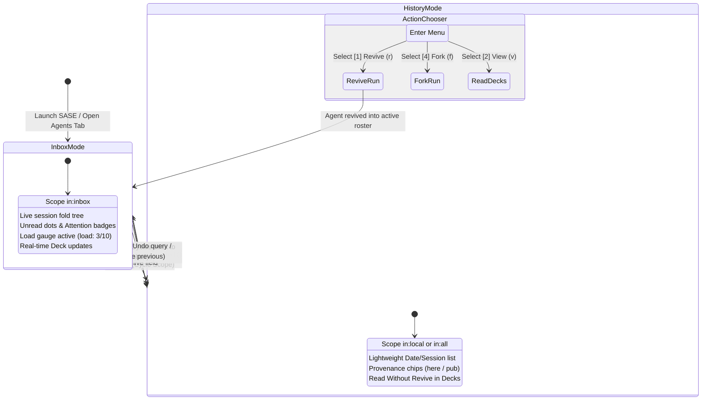
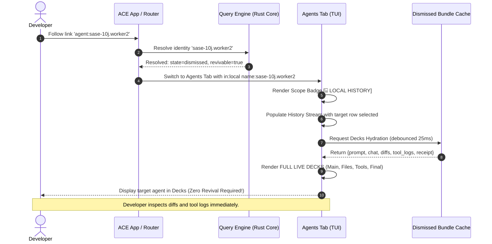

# Migrating Artifacts ▸ Agent to the Top-Level Agents Tab: UX Specification & Interactive Wireframes

**Researcher:** `research.45.gem`  
**Topic:** UX Architecture, Interaction Models, and Visual Design for Agent History in the Agents Tab  
**Date:** October 2026  
**Status:** Independent Swarm Report  
**Context:** Successor to `agent_history_in_agents_tab.md` (September 2026)  
**Target Artifact:** `research:202610/artifacts_agents_subtab_migration_ux/artifacts_agents_subtab_migration_ux__gem.md`

---

## Executive Summary

Today, agent exploration in the SASE Terminal User Interface (TUI) suffers from a sharp architectural bifurcation:

1. **The Top-Level Agents Tab (`Agents`):** The real-time operational cockpit ("flight control"). It provides high-performance live monitoring, session/clan/tribe fold trees, unread indicators, load gauges, and rich multi-deck inspection (`Main`, `Files`, `Tools`, `Final`). However, it is strictly scoped to the active "inbox" (non-dismissed, non-hidden runs).
2. **The Artifacts ▸ Agent Sub-Tab (Pane `1` in `Artifacts`):** The historical catalog. It lists every known historical agent run across the machine, but its detail view is anemic: plain text metadata, a prompt truncated to 4,000 characters, and zero access to agent replies, diffs, tool executions, or finalizer receipts.

This bifurcation creates a severe usability bottleneck: **the Revival Tax**. Whenever a developer needs to inspect the work of an archived agent—to read its explanation, examine its git diff, or verify its tool execution—they cannot do so within the catalog. They are forced to **revive** the agent (`w` in the Artifacts pane). Reviving mutates local state, resurrects the run into the live inbox, and pollutes the active working set. Furthermore, having "Agents" under the Artifacts tab violates core domain ergonomics: agents are active processes and execution actors, not static output artifacts like stitches, patches, beads, or plans.

This specification details the complete UX migration plan to:
- **Retire the `Artifacts ▸ Agent` sub-tab entirely**, renumbering the remaining Artifacts panes so `Stitches` becomes digit `1` (matching its role as the default pane).
- **Elevate agent history directly into the top-level `Agents` tab** via an explicit, query-driven **Scope Architecture** (`in:inbox`, `in:local`, `in:published`, `in:all`).
- **Preserve the Inbox-Zero paradigm by default**: the default Agents tab view remains identical to today's lightning-fast live cockpit.
- **Deliver "Read Without Revive"**: selecting any historical or dismissed agent renders the full, live **Agent Decks** (`Main`, `Files`, `Tools`, `Final`) loaded lazily from the dismissed bundle, allowing instantaneous inspection of prompts, responses, diffs, tool calls, and receipts with zero state mutation.
- **Harmonize keybindings and actions**: eliminate the collision between the pane's `w` revive and the Agents tab's `w` reword via a contextual History Action Chooser on `Enter`, ergonomic leader shortcut `,a` for scope toggling, and progressive disclosure hints.

```
+----------------------------------------------------------------------------------------------------+
|                                    VISUAL INFOGRAPHIC OVERVIEW                                     |
|                                                                                                    |
|  An accompanying visual infographic has been generated and stored alongside this report:           |
|  file:///home/bryan/.local/state/sase/workspaces/sase-org/sase/sase_22/sase/repos/research/        |
|  202610/artifacts_agents_subtab_migration_ux/artifacts_agents_subtab_migration_ux_infographic.png |
+----------------------------------------------------------------------------------------------------+
```

---

## 1. The Core UX Problem: The Dual-Home Penalty

### 1.1 The Fragmented User Journey Today

```
[USER GOAL: Inspect what agent 'sase-10j.2' did yesterday]
                     │
                     ▼
             Is it in the inbox?
             ├── YES ──► Agents Tab ──► Open Decks ──► Read prompt, diffs, tools, replies (Delightful)
             │
             └── NO ──► Artifacts Tab (Digit 2)
                             │
                             ▼
                        Select 'Agents' sub-tab (Digit 1)
                             │
                             ▼
                        Search query / find row
                             │
                             ▼
                        Inspect Details panel:
                        - Text-only metadata
                        - Prompt cut off at 4,000 characters
                        - No reply or output text!
                        - No diff or modified files!
                        - No tool calls or logs!
                             │
                             ▼
                        [THE REVIVAL TAX]
                        Press 'w' to REVIVE agent
                             │
                             ▼
                        Pollutes live working set & unread signals
                             │
                             ▼
                        Switch back to Agents Tab (Digit 1)
                             │
                             ▼
                        Finally read the diffs and chat!
```

This workflow introduces four distinct points of friction:
1. **Mental Mapping Friction:** The user must guess whether an agent was dismissed. If an agent was dismissed 10 minutes ago, navigating to the Agents tab shows nothing. Clicking an `@agent:...` link triggers a jarring fallback toast: *"Agents tab filter hides it — showing Artifacts ▸ Agent"*.
2. **Information Deprivation:** The Artifacts detail renderer (`agents_detail.py`) does not load transcripts or patches. It shows only metadata and a truncated prompt snippet.
3. **Working Set Pollution:** Reviving an agent to read its diff wakes the agent identity, creates loader markers, resets attention signals, and adds noise to the active roster.
4. **Dialect Divergence:** The query language for `agents-live` and `agents` (catalog) developed subtle inconsistencies (such as `tribe` meaning a live user tag in the live tab vs. an epic/chop clan type in the catalog).

### 1.2 Why We Cannot Simply "Show All Agents by Default"

A naive fix might propose: *"Just remove the filter and show all 3,500+ past agents in the live list."*  
This would disastrously break the product:
- **Inbox-Zero Destruction:** SASE users rely on dismissal to clear finished work. If thousands of historical runs populate the main fold tree, operational indicators (`load: 3/10`, unread badges, attention counts, runner queue slots) lose all signal value.
- **Performance Collapse:** Building Textual DOM nodes or rich `Agent` instances for 3,500+ local runs (and up to 14,000+ sidecar runs) takes >2 seconds. Under the `tui_perf` rules, keystroke p95 latency must stay strictly under 16ms, and first paint must never block on archive-scaled I/O.
- **Structural Mismatch:** Historical agents lack live fold/clan memberships and active container processes. Forcing them into the active session tree creates invalid tree states and phantom container statuses.

**Conclusion:** The solution must be **Scope-Driven**. The default view must remain the high-performance **Inbox Mode**, while an explicit **History Mode** unlocks the entire local and federated archive on demand.

---

## 2. Information Architecture & Scope Mental Model

### 2.1 The Host-Owned `in:` Scope Token

The foundation of the unified UX is the host-owned `in:` scope token, extracted prior to Boolean dialect evaluation:

| Scope Token | Effective Working Set | Default Behavior & Activation |
| :--- | :--- | :--- |
| `in:inbox` | Active working set: non-dismissed, non-hidden local agents + fleet runs. | **Default view.** Byte-for-byte identical to today's Agents tab. |
| `in:local` | Inbox + all locally dismissed and archived agents from the catalog. | Explicit `in:local`, leader key `,a`, or auto-widened by historical fields. |
| `in:published` | Project-wide runs validated in the local clone of the agents git sidecar. | Explicit `in:published` or cycling `,a`. Read-only federated history. |
| `in:all` | Deduplicated union of `local` and `published` runs. | Explicit `in:all` or cycling `,a`. Comprehensive project retrospective. |

### 2.2 Progressive Widening & Zero-Result Discovery

Users should never feel trapped by an invisible scope boundary. We specify three progressive disclosure mechanisms:

1. **Implicit Field Widening (Gmail Model):**
   If a user types a query in the inbox that mentions an archive-only field:
   ```text
   revivable:true status:FAILED
   ```
   The engine recognizes `revivable:true` as a catalog-only facet and **implicitly widens** the scope from `in:inbox` to `in:local`. The search input header immediately displays an indicator:
   ```text
   filter: revivable:true status:FAILED [auto-widened to local history]
   ```
2. **Zero-Result Intelligent Hint:**
   When an inbox query returns 0 matches, a fast background query against the local SQLite catalog index checks for historical matches:
   ```text
   Agents: 0 matches in inbox · 14 found in local history — press ,a or <Enter> to widen scope
   ```
   Pressing `,a` or hitting `<Enter>` immediately commits `in:local <query>`, revealing the matching archived runs.
3. **The Scope Cycling Key (`,a`):**
   In SASE, leader mode is prefixed with comma (`,`). Leader `,a` is currently **completely unbound** in `default_config.yml`. We assign `,a` to cycle through the scopes:
   $$\text{in:inbox} \xrightarrow{,a} \text{in:local} \xrightarrow{,a} \text{in:all} \xrightarrow{,a} \text{in:inbox}$$
   Each cycle updates the query bar, pushes the previous state onto the query history ring (`^` to undo), and refits the view.

---

## 3. Terminal UI Visual Mockups & Wireframes

Below are detailed, character-accurate terminal mockups contrasting the current vs. proposed UX and illustrating all key interaction states.

### 3.1 Visual 1: Top Bar & Artifacts Tab Simplification

#### Before Migration:
The Artifacts tab contains an anomalous `Agents` pane as digit `1`, while `Stitches` (the default pane) is digit `2`:
```text
┌─ SASE Control Room ────────────────────────────────────────────────────────────────────────────────────────────────────────┐
│ [Artifacts]   ● AGENTS   Services                                                                        load: 2/10 · 12:44 │
├────────────────────────────────────────────────────────────────────────────────────────────────────────────────────────────┤
│ (When switching to Artifacts):                                                                                             │
│ [1: Agents] [2: Stitches] [3: Patches] [4: Beads] [5: Files] [6: Plans]                                                    │
└────────────────────────────────────────────────────────────────────────────────────────────────────────────────────────────┘
```

#### After Migration:
The `Agents` sub-tab is completely deleted from Artifacts. `Stitches` becomes digit `1`, matching its role as the primary artifact viewer:
```text
┌─ SASE Control Room ────────────────────────────────────────────────────────────────────────────────────────────────────────┐
│ Artifacts   ● AGENTS   Services                                                                          load: 2/10 · 12:44 │
├────────────────────────────────────────────────────────────────────────────────────────────────────────────────────────────┤
│ (When switching to Artifacts):                                                                                             │
│ [1: Stitches] [2: Patches] [3: Beads] [4: Files] [5: Plans]                                                                │
│                                                                                                                            │
│ NOTE: Digit 1 now cleanly opens Stitches (the default pane). Legacy jump references to 'artifacts:agents'                  │
│       automatically redirect to the top-level Agents tab with scope 'in:local'.                                            │
└────────────────────────────────────────────────────────────────────────────────────────────────────────────────────────────┘
```

---

### 3.2 Visual 2: The Agents Tab in Live Mode (`in:inbox`)

This is the unchanged, high-performance operational cockpit. Notice the live load indicator, active fold tree, unread markers, and running jobs:

```text
┌─ SASE TUI v0.24 · Project: sase (apollo) ──────────────────────────────────────────────────────────────────────────────────┐
│ Artifacts   ● AGENTS   Services                                                  load: 3/10 [3 running · 1 queued] · 14:22 │
├────────────────────────────────────────────────────────────────────────────────────────────────────────────────────────────┤
│ 4 agents [3 running · 1 queued · 2 waiting · 1 unread] · filter: status:RUNNING (/) · group: by project (o) · panels: single│
├────────────────────────────────────────────────────────────────────────────────────────────────────────────────────────────┤
│ [1: main (3)] [2: fleet-apollo (1)] [3: custom-bench (0)]                                                                   │
├──────────────────────────────────────────────┬─────────────────────────────────────────────────────────────────────────────┤
│ AGENT ROSTER (Live Fold Tree)                │ DECK AREA: [1: MAIN]  2: FILES  3: TOOLS  4: FINAL               (p to pick)│
├──────────────────────────────────────────────┼─────────────────────────────────────────────────────────────────────────────┤
│ ▼ Session 2026-10-08 (apollo)                │ ╭─ AGENT: research.45.gem ────────────────────────────────────────────────╮ │
│   ▼ Clan: research-swarm-45                  │ │ Status: RUNNING   Duration: 2m 14s   Started: 14:20:10   Model: gemini-3.8│ │
│     ● research.45.gem (RUNNING · 2m 14s) ◄───┼─┤ Session: sess-8912   Clan: research   Tokens: 18.4k (in: 14.1k, out: 4.3k)│ │
│     ○ research.45.cdx (RUNNING · 2m 10s)     │ ╰─────────────────────────────────────────────────────────────────────────╯ │
│     ○ research.45.cld (RUNNING · 1m 55s)     │ ╭─ PROMPT ────────────────────────────────────────────────────────────────╮ │
│     ○ research.45.mus (QUEUED · pos 1)       │ │ Flesh out the UX for migrating the Artifacts Agents sub-tab to the top- │ │
│   ▼ Clan: bugfix-catalog-coupling            │ │ level Agents tab. Create rich visuals and ASCII wireframes...           │ │
│     ✔ sase-10j.worker2 (DONE · 6m 12s)       │ ╰─────────────────────────────────────────────────────────────────────────╯ │
│                                              │ ╭─ LIVE STREAMING REPLY ──────────────────────────────────────────────────╮ │
│                                              │ │ Conducting deep analysis of src/sase/ace/tui/widgets/artifacts/...      │ │
│                                              │ │ [Generating character-accurate TUI wireframes for History mode...]      │ │
│                                              │ ╰─────────────────────────────────────────────────────────────────────────╯ │
├──────────────────────────────────────────────┴─────────────────────────────────────────────────────────────────────────────┤
│ Enter Act on Agent · x Kill · m Mark · s Save · ,a Cycle Scope (inbox) · / Filter · [ / ] Next Deck · ? Help               │
└────────────────────────────────────────────────────────────────────────────────────────────────────────────────────────────┘
```

---

### 3.3 Visual 3: The Agents Tab in History Mode (`in:local` / `in:all`)

When the user enters History mode (via `,a`, search, or link follow), the UI transforms smoothly:
- The live load gauge and agent tabs are replaced by the high-contrast **Scope Chip** (`⌸ SCOPE: LOCAL HISTORY`).
- The fold tree is replaced by the virtualized **History Stream** (lightweight rows grouped by Date/Session/Project).
- The right side features **THE REAL LIVE DECKS** rendering the archived agent's full data with **zero revival required**!

```text
┌─ SASE TUI v0.24 · Project: sase (apollo) ──────────────────────────────────────────────────────────────────────────────────┐
│ Artifacts   ● AGENTS   Services                                                            ARCHIVE SEARCH · Apollo · 14:25 │
├────────────────────────────────────────────────────────────────────────────────────────────────────────────────────────────┤
│ ⌸ SCOPE: LOCAL HISTORY │ filter: in:local project:sase [14/1,456 matches] (/) │ Metrics: 14 matching · 10 revivable · 4 thin│
├──────────────────────────────────────────────┬─────────────────────────────────────────────────────────────────────────────┤
│ HISTORY STREAM (Grouped by Date)             │ DECK AREA: [1: MAIN]  2: FILES  3: TOOLS  4: FINAL               (p to pick)│
├──────────────────────────────────────────────┼─────────────────────────────────────────────────────────────────────────────┤
│ ▼ TODAY (Oct 08, 2026)                       │ ╭─ AGENT: sase-10j.worker2 · [ARCHIVED] ────────────── [✓ READ WITHOUT REV]│ │
│   sase-10j.worker2  [DONE] [here]    4m 12s ◄┼─┤ Status: DONE   Duration: 4m 12s   Finished: 13:09:15   Cost: $0.042       │ │
│   sase-9f.refactor  [FAIL] [here]    1m 45s  │ │ Model: claude-3-7-sonnet   Session: sess-8890   Bead: sase-10j (Closed)  │ │
│                                              │ ╰─────────────────────────────────────────────────────────────────────────╯ │
│ ▼ YESTERDAY (Oct 07, 2026)                   │ ╭─ ORIGINAL PROMPT (Full Transcript Preserved) ───────────────────────────╮ │
│   research.44.cld   [DONE] [here+pub]12m04s  │ │ Fix the catalog schema version coupling in _sources.py where            │ │
│   chop.apollo.88    [DONE] [pub·ath] 2m 10s  │ │ AGENT_ARTIFACT_INDEX_SCHEMA_VERSION was hardcoded to 34 instead of      │ │
│   sase-8a.invest    [WAS ACTIVE]     Stale   │ │ reading the Rust binding version (35). Verify with just check.          │ │
│                                              │ ╰─────────────────────────────────────────────────────────────────────────╯ │
│ ▼ OCTOBER 05, 2026                           │ ╭─ AGENT REPLY / FINAL OUTPUT ────────────────────────────────────────────╮ │
│   chop.apollo.81    [DONE] [here]    5m 20s  │ │ Successfully patched _sources.py to read dynamic schema version from    │ │
│   sase-7x.ui-audit  [DONE] [here]    3m 44s  │ │ sase_core_rs. Ran pytest tests/test_agent_catalog.py (all 14 passed).   │ │
│   sase-7w.docs-sync [DONE] [here]    1m 12s  │ │ Final declaration submitted with commit sha 75e27f9.                     │ │
│                                              │ ╰─────────────────────────────────────────────────────────────────────────╯ │
├──────────────────────────────────────────────┴─────────────────────────────────────────────────────────────────────────────┤
│ Enter Actions (Revive/Fork/View) · r Revive · f Fork · e Diff · %@ Copy Ref · ,a Cycle Scope · [ / ] Deck · ^ Undo Filter  │
└────────────────────────────────────────────────────────────────────────────────────────────────────────────────────────────┘
```

---

### 3.4 Visual 4: Deep Deck Inspection (Read Without Revive)

In the current Artifacts pane, inspecting diffs or tool executions was completely impossible. In the new Agents History mode, cycling decks with `[` and `]` reveals full historical execution details:

#### The `FILES` Deck (Git Diff of Historical Work):
```text
┌─ DECK AREA: 1: MAIN  [2: FILES]  3: TOOLS  4: FINAL ───────────────────────────────────────────────────────────────────────┐
│ Touched Files: 2 modified · 0 added · 0 deleted                                                      Diff mode: Unified (d)│
├────────────────────────────────────────────────────────────────────────────────────────────────────────────────────────────┤
│ ▼ src/sase/agents/catalog/_sources.py (+12, -4)                                                                            │
│ @@ -81,10 +81,18 @@ def _load_index_rows(project_root: Path) -> dict[str, AgentCatalogRow]:                               │
│ -    if index.schema_version != AGENT_ARTIFACT_INDEX_SCHEMA_VERSION:                                                       │
│ -        return {}                                                                                                         │
│ +    expected_version = get_agent_scan_wire_schema_version()                                                               │
│ +    if index.schema_version != expected_version:                                                                          │
│ +        log.warning("Catalog schema version mismatch: %d != %d", index.schema_version, expected_version)                   │
│ +        return {}                                                                                                         │
│ ▼ tests/agents/test_catalog_sources.py (+8, -1)                                                                            │
│ @@ -44,7 +44,14 @@ def test_catalog_accepts_wire_version():                                                                │
│ +    assert build_agent_catalog_snapshot().row_count > 0                                                                    │
└────────────────────────────────────────────────────────────────────────────────────────────────────────────────────────────┘
```

#### The `TOOLS` Deck (Historical Tool Invocations):
```text
┌─ DECK AREA: 1: MAIN  2: FILES  [3: TOOLS]  4: FINAL ───────────────────────────────────────────────────────────────────────┐
│ Tool Calls: 3 executed · 3 successful · 0 failed · Total tool wall time: 14.8s                                              │
├────────────────────────────────────────────────────────────────────────────────────────────────────────────────────────────┤
│ 1. [14:06:12] run_command: git grep "AGENT_ARTIFACT_INDEX_SCHEMA_VERSION" ────────────────────────────── (exited 0 · 180ms)│
│    stdout: src/sase/core/agent_scan_wire_records.py:29: AGENT_ARTIFACT_INDEX_SCHEMA_VERSION = 34                          │
│                                                                                                                            │
│ 2. [14:07:45] replace_file_content: src/sase/agents/catalog/_sources.py ────────────────────────────────── (success · 12ms)│
│    Target lines 81-84 replaced with dynamic binding check.                                                                 │
│                                                                                                                            │
│ 3. [14:08:30] run_command: pytest tests/agents/test_catalog_sources.py ──────────────────────────────── (exited 0 · 2.4s)  │
│    stdout: 14 passed in 2.34s                                                                                             │
└────────────────────────────────────────────────────────────────────────────────────────────────────────────────────────────┘
```

#### The `FINAL` Deck (Finalizer Declaration & Verification Receipts):
```text
┌─ DECK AREA: 1: MAIN  2: FILES  3: TOOLS  [4: FINAL] ───────────────────────────────────────────────────────────────────────┐
│ Host Finalizer Turn Nonce: yR0ErZXA9OyKZQe8AO0ygg · Policy: builtin@commit · Verdict: VERIFIED                             │
├────────────────────────────────────────────────────────────────────────────────────────────────────────────────────────────┤
│ ╭─ DECLARATION MANIFEST ─────────────────────────────────────────────────────────────────────────────────────────────────╮ │
│ │ Action: commit                                                                                                         │ │
│ │ Commit Subject: fix(catalog): bind schema version dynamically from core wire record                                   │ │
│ │ Bead Action: close (sase-10j)                                                                                          │ │
│ │ Repository: sase (SHA: 75e27f9b8c1)                                                                                    │ │
│ ╰────────────────────────────────────────────────────────────────────────────────────────────────────────────────────────╯ │
│ ╭─ VERIFICATION RECEIPT ─────────────────────────────────────────────────────────────────────────────────────────────────╮ │
│ │ Command: just check                                                                                                    │ │
│ │ Result: PASSED (exit code 0 · wall time 38.2s)                                                                         │ │
│ │ Host Evidence Digest: sha256:4f8a91c2...                                                                               │ │
│ ╰────────────────────────────────────────────────────────────────────────────────────────────────────────────────────────╯ │
└────────────────────────────────────────────────────────────────────────────────────────────────────────────────────────────┘
```

#### Graceful Degradation (When Workspace Files Are Pruned):
If an agent ran months ago and its workspace files were reclaimed by retention policies, the decks degrade elegantly rather than displaying blank panes:
```text
┌─ DECK AREA: 1: MAIN  [2: FILES]  3: TOOLS  4: FINAL ───────────────────────────────────────────────────────────────────────┐
│ ╭─ RETENTION NOTICE ─────────────────────────────────────────────────────────────────────────────────────────────────────╮ │
│ │ Workspace diff and scratch files were pruned on 2026-09-15 per retention policy (keep_runs: 30d).                      │ │
│ │ • Prompt and complete chat transcript: PRESERVED (inspect in MAIN deck)                                                │ │
│ │ • Final commit: 75e27f9b8c1 (available in git history / Stitches pane)                                                 │ │
│ │ • Verification receipt: RECORDED (inspect in FINAL deck)                                                               │ │
│ ╰────────────────────────────────────────────────────────────────────────────────────────────────────────────────────────╯ │
└────────────────────────────────────────────────────────────────────────────────────────────────────────────────────────────┘
```

---

### 3.5 Visual 5: Zero-Result Progressive Disclosure

When an inbox search returns no live agents, an intelligent expansion prompt appears in the info row:

```text
┌────────────────────────────────────────────────────────────────────────────────────────────────────────────────────────────┐
│ 0 agents [0 running] · filter: sase-10j (/) ──────────────────────────────────────────────────────────────────────────────│
│ ⚡ No matches in inbox · 3 found in local history — Press ,a or <Enter> to widen to History scope                          │
├────────────────────────────────────────────────────────────────────────────────────────────────────────────────────────────┤
│ (Pressing <Enter> or ,a instantly converts the filter to 'in:local sase-10j' and renders the history stream)               │
└────────────────────────────────────────────────────────────────────────────────────────────────────────────────────────────┘
```

---

### 3.6 Visual 6: The History Action Chooser Modal

In History mode, pressing `<Enter>` on an archived row opens the action chooser:

```text
┌─ History Actions: sase-10j.worker2 ────────────────────────────────────────────────────────────────────────────────────────┐
│                                                                                                                            │
│   [1]  Revive Agent              (r)   Resurrect agent into active inbox with current state                                │
│   [2]  Read Decks                (v)   Focus right-hand decks to inspect prompt, diffs, & tools                            │
│   [3]  Copy Reference            (@)   Copy 'agent:bbugyi200.apollo.sase-10j.worker2' to clipboard                         │
│   [4]  Fork as New Agent         (f)   Open prompt modal pre-filled with this agent's instructions                         │
│   [5]  View Commit in Stitches   (s)   Jump to commit 75e27f9 in Artifacts ▸ Stitches                                      │
│   [6]  Open Diff in Editor       (e)   Open raw patch in $EDITOR                                                           │
│                                                                                                                            │
│   Esc Cancel  ·  Use 1-6 or shortcut key                                                                                  │
└────────────────────────────────────────────────────────────────────────────────────────────────────────────────────────────┘
```

---

## 4. Interaction Design & Keybinding Architecture

### 4.1 Resolving the Revival Key Collision

In `Artifacts ▸ Agent`, revival was mapped to `w`. However, on the top-level `Agents` tab:
- `w` is permanently bound to `reword` (editing active agent task titles).
- Moving `w` to revival would trigger catastrophic muscle-memory errors (users attempting to reword an active agent would accidentally trigger revival or vice versa).

**Resolution:**
1. **Primary Navigation (`Enter`):** Pressing `Enter` on any historical row opens the **History Action Chooser** shown in Visual 6. For rows where `revivable: true`, **Revive** is the highlighted default item (press `Enter` then `Enter`, or `Enter` then `1`).
2. **Dedicated Hotkey (`r`):** In History mode (`in:local` or `in:all`), `r` is directly bound to `revive_agent` (mnemonic: *Revive*). In Live mode, `r` remains unbound or mapped to its normal context.
3. **Leader Revival (`,r`):** Leader `,r` is bound to `revert_agent` in live mode; in history mode it safely triggers revival confirmation.
4. **Custom Revival Search (`!R`):** In the current codebase, pressing `!R` on the Agents tab opens "Custom revival search", which jumps to the Artifacts pane. Under the new UX, `!R` simply commits:
   ```text
   in:local state:dismissed revivable:true
   ```
   keeping the user entirely within the Agents tab!

### 4.2 Comprehensive Keybinding Matrix

| Context / Mode | Key | Action | Behavior & Rationale |
| :--- | :--- | :--- | :--- |
| **Global / App** | `,a` | `cycle_agent_scope` | Cycles `in:inbox` $\rightarrow$ `in:local` $\rightarrow$ `in:all` $\rightarrow$ `in:inbox`. Zero collision in leader mode. |
| **Global / App** | `/` | `edit_query` | Focuses the inline `FilterBar` with full schema completion for `in:` and facets. |
| **Global / App** | `^` | `prev_query` | Restores previous query (e.g. popping back from history to inbox). |
| **History Mode** | `Enter` | `act_on_agent` | Opens the **History Action Chooser** (Revive, Read, Fork, Copy, Diff). |
| **History Mode** | `r` | `revive_agent` | Immediate revival of highlighted archived agent if `revivable:true`. |
| **History Mode** | `f` | `fork_agent` | Launches a new local agent pre-populated with the historical agent's prompt. |
| **History Mode** | `v` | `focus_decks` | Shifts focus from left History Stream to right Deck panels. |
| **History Mode** | `[` / `]` | `cycle_deck` | Switches active deck: `Main` $\leftrightarrow$ `Files` $\leftrightarrow$ `Tools` $\leftrightarrow$ `Final`. |
| **History Mode** | `p` | `pick_deck` | Opens deck picker modal to jump directly to Diff or Tools. |
| **History Mode** | `m` / `u` | `toggle_mark` | Marks/unmarks historical rows for bulk operations (e.g. bulk revival). |
| **History Mode** | `s` | `save_marked` | Bulk revive or batch export of all marked historical rows. |
| **Copy Mode** | `%@` | `copy_ref` | Copies canonical reference (`agent:bbugyi200.apollo.name`). |
| **Copy Mode** | `%p` | `copy_prompt` | Copies full original prompt text to system clipboard. |
| **Copy Mode** | `%c` | `copy_chat` | Copies path to chat transcript file. |
| **Copy Mode** | `%s` | `copy_snapshot`| Copies JSON snapshot of agent execution metadata. |
| **Artifacts Tab** | `1` | `switch_subtab` | Digit `1` now opens `Stitches` (previously opened `Agents`). |
| **Artifacts Tab** | `2`–`5` | `switch_subtab` | Digit `2`=Patches, `3`=Beads, `4`=Files, `5`=Plans. |

### 4.3 Link Follow Behavior (`agent:<identity>`)

When following an agent reference anywhere in SASE (e.g. from an issue bead, commit message, or CLI command `sase artifact open agent:...`):

1. **Resolution Step:** The host resolves `<identity>` against the live roster, local catalog, and sidecar manifest.
2. **Inbox Check:** If the agent is in the live inbox, switch to the Agents tab with `in:inbox`, expand its parent session/clan folds, and select it.
3. **History Fallback:** If the agent is dismissed or archived:
   - Switch to the Agents tab.
   - Set the query to `in:local name:"<canonical_name>"`.
   - Highlight the target row and immediately hydrate its Decks.
   - Display an unobtrusive toast notification:  
     `Revealed in local history · Press ^ to restore previous filter`
4. **Total Deprecation of Fallback Toast:** The confusing legacy message *"Agents tab filter hides it — showing Artifacts ▸ Agent"* is completely eliminated.

---

## 5. Data Flow, Hydration & Performance Guardrails

### 5.1 Adherence to `tui_perf` Rules

The design strictly obeys the core performance laws of SASE:
- **Rule 1 & 2 (Event Loop Hermeticity):** No JSON parsing, SQLite scans, or git subprocesses ever run on Textual's message pump.
- **Rule 9 (Startup & First Paint):** First paint of the Agents tab loads only the active inbox. History is never touched during startup unless a restored query explicitly demanded `in:local`.
- **Rule 11 (Worker Cancellation):** Navigating through history rows cancels in-flight deck hydration workers immediately when the highlight moves.

### 5.2 Two-Tier Hydration Pipeline

```mermaid
flowchart TD
    UserQuery["User Query / Scope Token (e.g. in:local)"] --> QueryEngine["Host Query Evaluator (Rust Core sase-core)"]
    
    subgraph Tier1 ["Tier 1: Lightweight Roster (<5ms)"]
        QueryEngine --> CatalogDB[("Local Catalog SQLite / Index")]
        CatalogDB --> RowTuples["Lightweight Row Tuples (Name, Status, Time, Provenance)"]
        RowTuples --> HistoryStream["History Stream Widget (Virtual OptionList)"]
    end
    
    HistoryStream -->|Row Highlighted (Debounced 25ms)| Tier2
    
    subgraph Tier2 ["Tier 2: Lazy Deck Hydration (<15ms)"]
        Tier2["Highlight Event"] --> BundleReader["Background Bundle Loader"]
        BundleReader --> DiskBundle["Dismissed Bundle / Chats Cache"]
        DiskBundle --> Decks["Hydrate Decks: Main, Files, Tools, Final"]
    end
```

1. **Tier 1 (Roster Stream):**  
   Evaluating `in:local` scans only the compact SQLite index or cached memory table. It returns flat tuples containing solely the fields needed to render the list row: `(canonical_name, display_name, status, started_at, duration, provenance_chip, revivable_flag)`. It **never** constructs full Python `Agent` objects.
2. **Tier 2 (Deck Hydration on Highlight):**  
   Only when the user pauses on a row for >25ms does a background worker read the dismissed bundle (`agent_meta.json`, `prompt.md`, `chat.md`, `diff.patch`). The data is piped directly into the deck widgets. Navigating rapidly with `j`/`k` skips intermediate row reads entirely.

### 5.3 Honest Provenance & Stale State Mitigation

Earlier research discovered that 100% of non-terminal published runs in the sidecar started $\ge 2$ days ago (frozen at `active` or `waiting`). Showing these as `RUNNING` would deceive developers.

Under our UX specification:
- Any published run that was recorded as non-terminal displays the explicit badge:  
  `WAS ACTIVE · as of <sidecar_commit_time>`  
  styled in muted gold (`#FFAF00`) with dim text, never the bright green `#00D7AF` reserved for live running agents.
- Provenance chips clearly identify data origin:
  - `[here]`: Local run only.
  - `[pub · <machine>]`: Published run from remote machine `<machine>` (e.g. `pub · athena`).
  - `[here + pub]`: Local run that was also published to the project sidecar.

---

## 6. Artifacts Tab Clean-Up & Retirement Path

### 6.1 Sub-Tab Reorganization & Digit Shortcuts

In `src/sase/ace/tui/_artifact_tab_model.py`:
- `FIXED_ARTIFACTS_SUBTAB_ORDER` currently equals `("agents", "stitches", "patches", "beads", "files")`.
- We redefine `FIXED_ARTIFACTS_SUBTAB_ORDER` to:
  ```python
  FIXED_ARTIFACTS_SUBTAB_ORDER: tuple[ArtifactsSubTab, ...] = (
      "stitches",
      "patches",
      "beads",
      "files",
  )
  ```
- Sub-tab digit bindings automatically re-index:
  - Digit `1`: **Stitches** (◉) — The default VCS and patch timeline pane.
  - Digit `2`: **Patches** (⎇) — Working tree diffs and stacked changes.
  - Digit `3`: **Beads** (◈) — Git-portable tasks, epics, and issues.
  - Digit `4`: **Files** (▤) — Workspace files and project documents.
  - Digit `5+`: Dynamic document providers (e.g. `@research`, `@plans`).

### 6.2 Backward Compatibility & Sunset Flag

Following SASE's feature flag discipline (`sase_flags.md`):
1. **Sunset Flag:** Introduce `sunset_artifacts_agents_pane` (default: `true`).
   - When `true` (standard): The `ArtifactsAgentsPane` widget is unmounted, digit `1` opens Stitches, and legacy routes redirect.
   - When `false` (emergency escape hatch): Restores the legacy pane during testing.
2. **Legacy Alias Mapping:**  
   Add to `LEGACY_ARTIFACTS_SUBTABS`:
   ```python
   LEGACY_ARTIFACTS_SUBTABS["agents"] = "stitches"
   ```
   Any user script or key sequence attempting to switch to `artifacts:agents` lands safely on `stitches`, with an informative one-time toast:  
   `"Artifacts ▸ Agent has moved to the top-level Agents tab (press ,a for history)."`

---

## 7. System Diagrams & State Transitions

### 7.1 State Transition Diagram: User Navigation Lifecycle



### 7.2 Sequence Diagram: Link Follow & Read Without Revive



---

## 8. Summary of Recommended UX & Phased Rollout Plan

### 8.1 Summary Table of Recommended UX

| Dimension | Legacy Model | Recommended Unified Model |
| :--- | :--- | :--- |
| **Primary Location** | Split across Agents tab (live) and Artifacts ▸ Agent (archive). | **Single unified location:** The top-level **Agents Tab**. |
| **Default View** | Live inbox only. | **Live inbox only (`in:inbox`).** Protects inbox-zero and performance. |
| **Scope Selection** | Hidden by separate tab switching. | **Host-owned `in:` token:** `in:inbox`, `in:local`, `in:published`, `in:all`. |
| **Scope Cycling** | None (manual tab clicks). | **Leader `,a`:** Ergonomic one-key cycle through scopes. |
| **Zero-Result UX** | Empty list; dead end. | **Smart Hint:** Inline suggestion with one-key widening to history. |
| **Reading Old Runs** | Blocked; requires `w` to revive into live roster. | **Read Without Revive:** Full live Decks (`Main`, `Files`, `Tools`, `Final`) on highlight. |
| **Revival Action** | `w` in Artifacts pane (collides with `reword`). | **Enter Action Chooser** + dedicated `r` in History mode. |
| **Artifacts Panes** | `[1: Agents] [2: Stitches] [3: Patches] ...` | **`[1: Stitches] [2: Patches] [3: Beads] [4: Files] [5: Plans]`** |
| **Deep Link Follow** | Fallback toast jumps between tabs. | **Always lands on Agents tab;** widens scope and toasts undo key. |
| **Performance** | Unindexed full scan risks UI stutter. | **Two-Tier Hydration:** Fast SQLite roster + lazy debounced deck load. |

### 8.2 Phased Rollout Plan

To ensure zero downtime and maintain master branch stability, the migration should proceed in five well-bounded phases:

| Phase | Milestone Name | Key Deliverables & Changes | Risk & Verification |
| :---: | :--- | :--- | :--- |
| **P0** | **Schema & Catalog Fix** | Resolve `AGENT_ARTIFACT_INDEX_SCHEMA_VERSION` mismatch between Python and Rust. Ensure catalog returns all 709+ local runs with full metadata. | **Low.** Unit tests in `tests/agents/test_catalog_sources.py`. |
| **P1** | **Dialect Unification** | Merge catalog fields into `agents-live` query schema: `state`, `dismissed`, `revivable`, `linked`, `relation`, `artifact`. Add host-owned `in:` token and implicit widening rules. | **Medium.** Test query parser pushdown and CLI search parity. |
| **P2** | **Local History Mode & Decks** | Implement History Stream option list and lazy Deck hydration in `AgentDetail` for dismissed bundles. Deliver **Read Without Revive**. | **Medium.** Validate p95 latency stays under 16ms across 3,500 rows. |
| **P3** | **Actions & Navigation Parity** | Implement History Action Chooser on `Enter`, hotkey `r`, leader `,a`, and retarget `!R` revival search and `agent:` link reveals. | **Low.** Keymap regression tests against `default_config.yml`. |
| **P4** | **Artifacts Pane Retirement** | Deprecate `ArtifactsAgentsPane` behind `sunset_artifacts_agents_pane`. Renumber Artifacts digits (Stitches becomes `1`). Update docs and memory strands. | **Low.** Verify digit shortcuts 1-5 across all Artifacts panes. |
| **P5** | **Sidecar History Federation** | *(Follow-up epic)* Implement Rust-backed sidecar projection with `source_run_id` deduplication and honest `WAS ACTIVE` badge rendering for `in:published`. | **Medium.** Headless cache tests keyed on sidecar git HEAD. |

---

## 9. Conclusion

Migrating the `Artifacts ▸ Agent` sub-tab to the top-level `Agents` tab resolves one of the longest-standing ergonomic inconsistencies in SASE. By anchoring the design around an explicit **History Scope** rather than an overloaded inbox, we maintain the pristine responsiveness and clarity of the live control room while granting developers effortless, instantaneous inspection of every agent that ever ran. 

Delivering **Read Without Revive** eliminates the artificial revival penalty, transforming historical runs into first-class learning, auditing, and diffing assets. With clean keybinding harmonization, smart progressive widening, and a simplified Artifacts tab, the SASE control room achieves a unified, cohesive developer experience.
