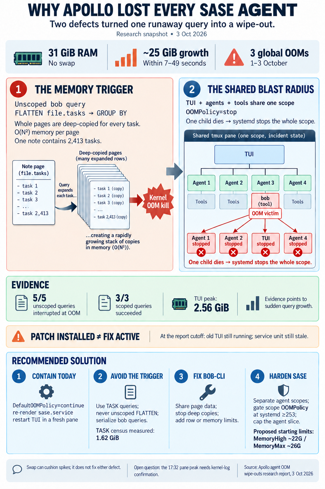

# Apollo's SASE agent wipe-outs: root cause and fix

> **Research query:** apollo keeps killing all of its SASE agents, apparently because of
> OOM errors. What is causing this, and how can it be fixed? End the analysis with a
> recommended solution.



## Bottom line

The deaths are real kernel OOM kills. A wipe-out needs **two defects at once**:

1. **What triggers it is a single runaway `bob query`, not slow growth.** Agents in the
   `bob-cli` project ran whole-vault Dataview queries of the form
   `FLATTEN file.tasks AS t … GROUP BY …` with no `FROM`. bob's native Dataview engine
   deep-copies the whole page once for every task it flattens. That costs O(N²) memory per
   page. The vault has pages with 2,413, 2,012, 819 and 509 tasks, so one query grows by
   about 25 GiB within 7–49 s on a 31 GiB host with no swap. See
   [the trigger in bob-cli](#the-trigger-in-bob-cli).
   - Every unscoped FLATTEN query ever run on apollo (5 of 5) died within about 0.1 s of
     one of the 3 OOMs.
   - Every OOM had one of these queries in flight.
   - The 3 scoped queries all succeeded.
2. **Why every agent dies is a shared cgroup with `OOMPolicy=stop`.** The TUI runs in a
   tmux pane, and each tmux pane is its own `tmux-spawn-<uuid>.scope`. The deployed
   `detach_scope` only gave a launched agent its own scope when the launcher was already a
   `sase-*` unit. So every TUI-launched agent, its provider CLI, and its tools lived in the
   TUI's pane scope. The user manager defaults to `DefaultOOMPolicy=stop`. When the kernel
   kills one process (the `bob query`), systemd stops the whole scope: the TUI and every
   agent get SIGTERM (exit 143), and SIGKILL 90 s later. See
   [why one victim takes down every agent](#why-one-victim-takes-down-the-tui-and-every-agent).

**Fix status (18:15 UTC):** part of defect 2 landed today as `9fe4405683` (18:05 UTC) and
is already installed on apollo. **It is not in effect yet**, and it has a
[version-gate bug](#why-it-is-not-effective-yet). Nobody has addressed defect 1.

**Recommended solution** ([in full below](#recommended-solution)):

- [Today, with no code changes](#contain-the-blast-radius-today):
  - set `DefaultOOMPolicy=continue` for apollo's user manager;
  - re-render `sase.service`;
  - restart the TUI so the landed escape takes effect;
  - [tell agents never to run unscoped FLATTEN queries](#stop-agents-from-firing-the-trigger).
- Then [fix bob-cli's clone-heavy FLATTEN/GROUP BY engine](#fix-the-root-cause-in-bob-cli)
  and add a guardrail.
- Then [fix the sase `OOMPolicy` version gate and put agent scopes into a memory-capped
  slice](#durable-containment-in-sase).
- [Swap and lower agent caps](#optional-host-hardening) are optional hardening. They do
  not fix this.

## Scope and method

**Consolidated report.** Merges five independent researcher reports (`__cdx`, `__cld`,
`__grk`, `__mus`, `__gem` in this directory) with the lead researcher's own checks on
apollo, made 2026-10-03 between 18:00 and 18:20 UTC. All times are UTC. Bryan's local time
is EDT, which is UTC−4. Nothing on apollo was changed during this research. Every
lead-researcher command was read-only.

## What happened

### The three incidents

| OOM (UTC) | Failed unit (TUI pane) | Pane memory peak | Agents killed | In-flight unscoped FLATTEN |
| --- | --- | --- | --- | --- |
| 10-01 21:15:46 | `tmux-spawn-a291e399….scope` (alive since 09-30) | not logged | 6: a 5-agent bob-cli swarm plus 1 sase muse agent | 3 parallel queries from one codex agent, started 21:15:35–39 |
| 10-03 16:24:28 | `tmux-spawn-1a05ddb8….scope` | **29.0G**, 0B swap | 3: bob-cli claude, bob-cli codex, sase codex. Systemd hit its stop timeout, then SIGKILLed `zsh`, `python3`, `claude` at 16:25:58 | started 16:23:44 (`WHERE t.blockId = "ref" GROUP BY t.status`) |
| 10-03 17:32:39 | `tmux-spawn-d263949a….scope` (TUI restarted 16:26) | 4.3G ([anomaly](#open-anomaly)) | 2: `sase-1fs.1--1` (muse), `4r.f1.f0` (codex) | started 17:31:50, interrupted 17:32:39.99 |

Each time Bryan opened a new pane and restarted `sase -p tui` within seconds. That is why
a new `tmux-spawn` scope starts right after each kill. The TUI's agent row count dropping
from 46 to 7 is the visible "everything vanished" moment.

### Global kernel OOMs

**These were global OOMs, not cgroup-limit hits.**

- `/proc/vmstat oom_kill` was 3 for the boot.
  - It now reads 9 because of six researcher probes. The journal confirms them as
    `bob-oom-probe-*` ×4 and `oompolicy-probe-*` ×2, all in capped throwaway scopes.
  - The two later `app.slice` OOM lines (17:49, 17:59) add no kills: the counter equals
    3 incidents plus 6 probes.
- `memory.max` is `max` on `user.slice`, `user-1000.slice` and `user@1000.service`.
  `memory.events` shows `oom 0` and `max 0`.
- `systemd-oomd` is not installed and `earlyoom` is inactive. The kernel OOM killer is the
  actor.

### Sudden spikes

**The spikes are sudden.** apollo's `sar` history (lead-researcher check) shows only
4.0–6.7 GiB used, with 25–28 GiB *available*, at the last 10-minute sample before each OOM:

| Last sample before OOM | Memory used | Memory available | OOM at |
| --- | --- | --- | --- |
| 21:10 | 6.7 GB | 25.2 GB | 21:15:46 |
| 16:20 | 4.5 GB | 27.5 GB | 16:24:28 |
| 17:30 | 4.0 GB | 28.0 GB | 17:32:39 |

The sample that contains each OOM shows direct reclaim (`pgscand/s` 937–2,172) and
8–15 GB of page cache purged. That rules out slow-leak theories. About 25 GiB of
anonymous memory appeared within a few minutes, which matches the
[measured growth rate](#measurements) of the FLATTEN query.

### An earlier separate episode

An earlier OOM episode happened on 09-03, in the previous boot. It produced 13 OOM
messages, including `dbus`, `gpg-agent` and `session.slice`, and ended in a reboot at
17:58. There were no OOMs from that boot (09-03 18:04) until 10-01. The tool-call logs on
apollo have no FLATTEN queries that early, so that episode's trigger is unknown. It is
separate from the current wave.

## The trigger in bob-cli

The trigger is `bob query … FLATTEN file.tasks`, in bob-cli.

### Correlation

The lead researcher re-scanned every `~/.sase/projects/*/artifacts/ace-run/**/tool_calls.jsonl`
on apollo and reproduced cld's table exactly. There are 8 FLATTEN `bob query` calls:

- 3 were scoped with `FROM` (09-30). All succeeded in 0–35 s.
- 5 were unscoped (10-01 ×3, 10-03 ×2). All were `interrupted`, at 21:15:46.65,
  16:24:28.91 and 17:32:39.99. Each time matches the journal's OOM line to within about
  0.1 s.

All 5 came from codex agents in `gh_bobs-org__bob-cli` doing a `^ref` task census or a
task-lane census. That is the standard Obsidian Dataview idiom. It is cheap in real
Dataview, which shares JavaScript object references, but catastrophic in bob's native
engine.

### Mechanism

The lead researcher verified this at bob-cli `b4a5022`, today's HEAD.

- `DataviewValue` in `src/native/dataview/value.rs` holds `Array(Vec<…>)` and
  `Object(BTreeMap<…>)` with no `Rc`/`Arc`. **Every `.clone()` is a deep copy.**
- `NativeRow::page` stores a full `vault.page_value(page)`. That includes `file.tasks`,
  `file.lists` (which repeats the tasks), nested `children`, links and frontmatter.
- `flatten_rows` (`src/native/dataview/vault.rs:245`) runs
  `flattened.push(row.clone().with_field(field, value))` once per task. A page with N
  tasks therefore makes N copies of a value that itself holds N tasks. Total memory is
  roughly Σ N_p² × (about 16 KiB per expanded task).
- `GROUP BY` clones every row twice more: once into the group object and once into
  `variables["rows"]`.
- `NativeRow::context()` clones `variables` on every expression evaluation. After grouping,
  that means one more deep copy of a group per cell or comparison.

### Measurements

cld measured these on apollo, each in a throwaway scope capped with
`systemd-run --user --scope -p MemoryMax=… -p MemorySwapMax=0`:

| Query | Result |
| --- | --- |
| any `bob query` (index baseline) | **2.85 GiB**, about 9 s. Every query pays this. |
| `FROM "done/sase_done"` (509 tasks) `FLATTEN file.tasks` | **6.96 GiB** (+4.1 GiB) |
| same + `GROUP BY t.status` | > 8 GiB, OOM-killed in its cap |
| `FROM "done/gtd_daily_done"` (819 tasks) `FLATTEN` | > 8 GiB, OOM-killed |
| `TASK WHERE blockId = "ref" GROUP BY status` (same census, safe form) | **1.62 GiB**, 8.8 s, correct output |

`inbox_links.md` (2,413 tasks) alone extrapolates to tens of GiB. A whole-vault FLATTEN
cannot finish on a 31 GiB host, and adding swap would not change that.

### Why it started now

The large generated task pages date from June. The engine's FLATTEN code dates from July.
What is new since 09-30 is agents writing whole-vault task censuses. The `bob_query` skill
encourages using `bob query` for vault-wide questions. The deployed
`~/.claude/skills/bob_query/SKILL.md` says nothing about FLATTEN cost, `TASK` queries or
parallel calls (lead-researcher check).

## Why one victim takes down the TUI and every agent

This half of the problem is in sase.

### Agents shared the TUI tmux scope

On Ubuntu 24.04, tmux moves every pane into its own `tmux-spawn-<uuid>.scope`. The
apollo tmux server (PID 2210) lives in `session-2.scope`.

Before `9fe4405683`, `detach_scope()` asked only whether the launcher's unit was SASE-owned
(`sase.service`, `sase-axe*.scope`, `sase-*.scope/.service`). For a launcher in
`tmux-spawn-*.scope` the answer was no, so it returned the original argv. `setsid` /
`start_new_session=True` creates a new session but **does not change the cgroup**.

Two researchers read live cgroups (cdx and cld). Both found the agent runner (PID 3000293)
and its `muse-bin` CLI (PID 3004812) inside the TUI's `tmux-spawn-c5a838fd….scope`.
grk's claim that this runner was outside the TUI cgroup is contradicted by both reads. The
journal shows that **no `sase-agent-*` scope has ever started on apollo**, including since
the fix landed (lead-researcher check).

### One kill becomes a teardown of the whole pane

`OOMPolicy=stop` turns one kill into a teardown of the whole pane.

- `systemctl --user show` reports `DefaultOOMPolicy=stop` (verified). tmux does not set the
  policy, so every pane scope inherits `stop` with `KillMode=control-group`.
- cld reproduced both behaviours on apollo with a capped scope:
  - Under `stop`, the OOM-killed child is followed by SIGTERM to the sibling and wrapper
    (`systemd-run` exits 143). This is the production signature.
  - Under `continue`, only the child dies (exit 137) and the sibling survives.
- gem confirmed that the killed agents' logs show exactly this: `exit code 143` and
  `received SIGTERM`.

### Why the kernel picks the runaway query

Facts verified by the lead researcher:

- `DefaultOOMScoreAdjust=200` for user-manager services, which includes all `sase.service`
  daemons, `gpg-agent` and `dbus`.
- Processes in tmux panes are at adj 0.

On a 31 GiB host, adj 200 is worth about 6.3 GiB of RSS in the kernel's badness score.
The `sase` daemons sit at `oom_score` ≈ 800, and the TUI at about 1.4 GiB scores ≈ 690.
An adj-0 process is only chosen once it exceeds about 6.3 GiB of RSS. Only the runaway
query gets that big, so it is the victim. The TUI and the other agents are collateral
damage from [`OOMPolicy=stop`](#one-kill-becomes-a-teardown-of-the-whole-pane).

The same arithmetic shows a second risk. A *moderate* spike that never produces a 6 GiB
process makes the adj-200 user services the preferred victims. `sase.service` runs with
`OOMPolicy=stop` and `Restart=on-failure`. Losing one of its children would stop the
scheduler, gateway and axe lanes, then bring back an empty control plane (grk's point).
This has not happened yet.

## Claims tested and resolved

| Hypothesis (who proposed it) | Verdict | Deciding evidence |
| --- | --- | --- |
| TUI heap bloat grows the pane to 29 GiB (grk) | **Secondary, not the trigger** | The 43-hour TUI's own `tui_memory_heartbeat` peaked at **2.56 GiB** and read 1.76 GiB about 3 minutes before the 16:24 OOM. `sar` shows 4.5 GB used host-wide at 16:20. The 29G peak is the pane total including the runaway query. The heap issue in `research:202610/tui_freeze_gc_heap_bloat` is real but worth only a few GiB. |
| Heavy `just check` / builds / pytest (cdx, gem, mus) | **Real demand, not these incidents** | Check runs can reach about 6 GiB (cdx, from the ToolRun ledger). But no tool run was active at 21:15 or 16:24, and the only one near 17:32 settled 31 s before the OOM (cdx and cld agree). gem says the 17:32 muse `Bash` call was "project checks"; the tool log records no command for it, so that claim is unverified. |
| Count-based admission / host too small (mus) | **Background condition** | apollo's effective cap is the ACE override `limit: 5`; the default is 10, and cdx's "10" was the config value, not the override. No agent count stops one 25 GiB query. mus's per-process sizes were measured on athena, not apollo. |
| No swap is the cause (gem, mus) | **Amplifier only** | The whole-vault FLATTEN needs more than any sensible swapfile. Swap only cushions legitimate spikes. |
| `sase.service` was the victim | **No** | It was in a different cgroup, never the failed unit, `NRestarts=0`. |
| Enable `systemd-oomd` (grk, as an option) | **Not yet** | oomd kills whole cgroups. With agents still sharing one scope, it would recreate the blast radius. Revisit only after agents run in capped scopes. |

### Open anomaly

In the 17:32 incident, the failed pane reported only a **4.3G** memory peak, yet the host
hit a global OOM. The only process whose start and interrupt times match is the unscoped
`bob query` (17:31:50 → 17:32:39.99), and `sar` shows the spike came from somewhere other
than a steady load. No other scope started between 17:30:49 and 17:32:39, so the query
should have been charged to that pane. Either the logged peak is a reporting artifact, or
the victim and the main consumer were different processes. One bounded kernel-log read
settles it: the OOM report names the victim, its `anon-rss` and its `task_memcg`. Request
it through the reviewed sudo gate (`sase sudo request`, `machine: apollo`):

```text
journalctl --kernel --no-pager --since "2026-10-01 21:10" --until "2026-10-03 17:35" \
  --grep "invoked oom-killer|Out of memory|Killed process|oom-kill:"
```

## What landed today and what is still missing

### What the commit does

**Commit `9fe4405683` ("escape scope via user manager and record kill provenance").** It
was authored by apollo agent `4u`, the work cld saw in progress in `sase_10`. It does
four things:

- escapes into its own `sase-agent-*` scope whenever the user manager is reachable, either
  via a `user@<uid>.service` cgroup ancestor or `$XDG_RUNTIME_DIR/systemd/private`. That
  covers tmux, SSH and terminal launchers;
- adds `--property=OOMPolicy=continue` to every scope it creates;
- adds `OOMPolicy=continue` to the rendered `sase.service` unit;
- records `kill_source` and OOM evidence in `done.json`.

### Why it is not effective yet

apollo runs it already: `sase version` reports `0.17.1+2052.g9fe440568`, an editable
install. It **is not effective yet**:

1. **The live TUI predates it.** PID 2985343 started at 17:33:04, and launches go through
   the TUI process's already-loaded `launch_spawn` / `detach_scope`. Zero `sase-agent-*`
   scopes have started. Every agent it launches still lands in its pane scope.
2. **The service unit has not been re-rendered.** `sase.service` restarted at 18:12:58, but
   `~/.config/systemd/user/sase.service` is dated 09-30, has no `OOMPolicy` line, and the
   live property is `OOMPolicy=stop`. `sase service init -c` reports `needs_attention:
   write …/sase.service`.
3. **The version gate is wrong.** `_OOM_POLICY_MIN_SYSTEMD_VERSION = 243`, but apollo's own
   systemd NEWS puts "Scope units now support OOMPolicy=" under **253**; 243 added it for
   *services*. `launch_spawn` swaps in the `systemd-run` argv with no fallback. On
   systemd 243–252 hosts (Ubuntu 22.04 = 249, Debian 12 = 252), the property would be
   rejected and **every detached launch would fail**. apollo (255) and athena (257)
   are not affected today, but other hosts would be.
4. **There is no memory containment.** The new scopes go into `app.slice` with no
   `MemoryHigh` or `MemoryMax`. After the fix, a runaway query still causes a *global*
   OOM. The kernel should pick the query, and its agent sees exit 137 and carries on. But
   the host still runs out of memory, and in a near-miss the
   [adj-200 services are next in line](#why-the-kernel-picks-the-runaway-query).
5. **Interactive tmux panes still default to `stop`.** Any heavy command Bryan runs by hand
   in a pane still takes that whole pane down.

## Recommended solution

Do the steps in this order. Step 1 stops the wipe-outs. Step 2 stops the trigger. Steps 3
and 4 are the durable fixes.

### Contain the blast radius today

**Step 1 (apollo, no code).** Run these from Bryan's normal apollo login shell.
`sase service init` captures the shell environment, and the check from a probe shell
warned about the SSH-agent identity.

```bash
# a) No more pane-wide teardown for any user-manager unit (new tmux panes and scopes).
#    The user's dotfiles are chezmoi-managed, so put this in the chezmoi source for apollo.
mkdir -p ~/.config/systemd/user.conf.d
printf '[Manager]\nDefaultOOMPolicy=continue\n' > ~/.config/systemd/user.conf.d/oom.conf
systemctl --user daemon-reexec
systemctl --user show -p DefaultOOMPolicy        # expect: continue

# b) Make the landed service-unit change live.
sase service init -d      # review the diff (adds OOMPolicy=continue)
sase service init -y
systemctl --user show sase.service -p OOMPolicy  # expect: continue

# c) Restart the TUI, from a fresh tmux pane, so the landed escape takes effect.
#    Detached runners survive the TUI exiting, but they stay in the old pane scope;
#    restart when the current agents can drain.
sase -p tui
```

Existing scopes keep `stop`: systemd refuses `set-property OOMPolicy=` on a live scope
(cld tested this). Only new panes and scopes pick up the change.

If (c) cannot wait for a code reload, cld's interim alternative also works with the old
code. Launch the TUI inside a `sase-*` scope:
`systemd-run --user --scope -p OOMPolicy=continue --unit="sase-tui-$(date +%s)" sase -p tui`.
The old predicate treats that scope as SASE-owned and escapes every agent.

### Stop agents from firing the trigger

**Step 2 (today).** Add a rule and an example to the `bob_query` skill source, and to
bob-cli's agent docs or memory:

- **never `FLATTEN file.tasks` or `file.lists` without a `FROM` scope;**
- for task censuses, use a `TASK` query, e.g. `TASK WHERE blockId = "ref" GROUP BY status`
  (1.6 GiB, 9 s);
- do not run `bob query` calls in parallel, since each one pays the 2.85 GiB baseline.

### Fix the root cause in bob-cli

**Step 3: make FLATTEN and GROUP BY linear.**

- **Stop deep-copying page values into rows.** Two options:
  - rows hold `page_index` plus a small overlay, and page fields are resolved lazily by
    reference;
  - or `DataviewValue::Array` / `Object` move to `Arc`-backed storage with
    `Arc::make_mut` copy-on-write in `with_field`.

  Either way, `flatten_rows` adds only the one flattened binding per row.
- Build `GROUP BY` `rows` once from shared references. Make `EvalContext` borrow
  `variables` (`&`/`Cow`) instead of cloning per evaluation. Index groups with a `HashMap`
  instead of a linear `find`.
- **Guardrail:** refuse with an actionable error when a FLATTEN would materialise more than
  a row budget, e.g. "would produce N rows; add FROM/WHERE". Alternatively, or as well,
  self-impose a memory ceiling (for example 4 GiB by default) so a bad query fails fast
  instead of taking the host down.
- **Regression test:** a synthetic vault with one 2,000-task note, where
  `TABLE … FLATTEN file.tasks AS t GROUP BY t.status` must stay within a few hundred MiB
  of the baseline.
- Later: trim the 2.85 GiB baseline. `page_rows()` clones every page up front, and the
  index stores each task twice, in `file.tasks` and `file.lists`.

### Durable containment in sase

**Step 4.**

- **Fix the gate to systemd ≥ 253** and add a test at 252. Because `launch_spawn` has no
  fallback, it may be safer to also drop the property when the version is unknown.
- **Cap detached work as a group.** Launch agent, tool, monitor and proc scopes with
  `--slice=sase-agents.slice`, and ship a host-tunable slice. A starting point for apollo is
  `MemoryHigh≈22G` and `MemoryMax≈26G`, leaving room for the TUI, `sase.service` and the
  OS. A runaway then hits a **cgroup** OOM inside the slice instead of a global one. The
  kernel kills the largest process there, and `OOMPolicy=continue` keeps its agent and the
  other agents alive. Keep the TUI and control plane outside the slice. A hard cap on
  today's shared pane would just reproduce the problem in a smaller box. Validate the
  numbers with a small disposable cgroup test, never by stressing the host.
- **Surface the cause.** `kill_source` / OOM evidence now land in `done.json`. Make the TUI
  show something like "OOM-killed child `bob` (N GiB)" instead of a bare `killed`.
- **Longer term, optional:** memory-aware admission, weighted by measured peak RSS per
  agent or tool rather than a flat count. Per the Rust-core boundary this belongs in
  `sase-core` and needs a decision record. It is not needed to stop these incidents.

### Optional host hardening

**Step 5.**

- An 8–16 GiB swapfile, set up through the reviewed sudo gate (apollo has about 51 GiB of
  free disk), to cushion legitimate spikes such as 6 GiB check runs, parallel bob
  baselines, and cold Rust builds.
- Keep the agent cap at 5. Serialise heavy `just check` / Cargo work, e.g.
  `CARGO_BUILD_JOBS` bounded, while the slice cap is not yet in place.
- Neither of these, nor a resize to 64 GiB, would have prevented these wipe-outs.

### Verification

- `systemctl --user show -p DefaultOOMPolicy` and `systemctl --user show sase.service -p
  OOMPolicy` both report `continue`.
- `journalctl --user | grep "Started sase-agent-"` shows scopes. `/proc/<runner>/cgroup` of
  a TUI-launched agent shows `sase-agent-*.scope`, which differs from the TUI's pane, and
  two agents have distinct scopes.
- Re-run the 10-03 census under a cap, e.g.
  `systemd-run --user --scope -p MemoryMax=6G -p MemorySwapMax=0 bob query --query-file q.dql`.
  - Before step 3, only `bob` should die (exit 137).
  - After step 3, it should complete within about 1 GiB of the baseline.
- No new `Failed with result 'oom-kill'` on `tmux-spawn-*` or `sase-tui-*` units. `grep
  oom_kill /proc/vmstat` stays at 9, the current baseline including the
  [researcher probes](#global-kernel-ooms).

## Sources

- The five researcher reports in this directory (`__cdx`, `__cld`, `__grk`, `__mus`,
  `__gem`).
- Lead-researcher checks on apollo (read-only, about 18:00–18:20 UTC):
  - user journal (`journalctl --user`, current and previous boots);
  - `sar -r` / `sar -B` for 10-01 and 10-03;
  - `/proc/vmstat`, `free`, `/proc/swaps`;
  - `systemctl --user show` (`DefaultOOMPolicy`, `DefaultOOMScoreAdjust`, `sase.service`);
  - per-process `oom_score` / `oom_score_adj` / cgroup;
  - `~/.sase/logs/tui_stalls.jsonl` heartbeats;
  - all `tool_calls.jsonl` FLATTEN calls;
  - `sase version`, `sase service init -c`;
  - `/usr/share/doc/systemd/NEWS.gz`.
- Code: sase `src/sase/detach_scope.py`, `src/sase/agent/launch_spawn.py`,
  `src/sase/service/platform_units.py` at `9fe4405683`. bob-cli
  `src/native/dataview/{vault.rs,value.rs}` at `b4a5022`.
- Prior research: `research:202610/tui_freeze_gc_heap_bloat`.
