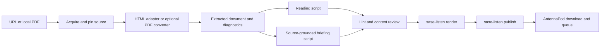

# Articles and research papers as commute audio: extending sase-listen

Researcher: cdx  
Date: 2026-10-03  
Scope: independent research for Bryan; implementation recommendation, not an implementation or a deployment. No other report or researcher finding from this swarm was consulted.

**Recommendation:** retain `sase-listen` as the audio renderer and podcast publisher. Add a small, inspectable import step that prefers article/paper HTML and uses an optional PDF converter when necessary. Offer two clearly labeled outputs: a reading edition for prose articles, and a source-grounded briefing for technical papers. First validate this with a handful of actual walks and a hosted-service comparison; do not build a general web crawler or an autonomous paper-to-podcast platform yet.

The useful product is “send this source to my listening queue, with enough fidelity to know what I heard.” Speech synthesis and RSS are already substantially solved here. Extraction, adaptation, and identifying which information was omitted need the work.

## Evidence and limits

I read the shared [follow-up reading list](../202609/sase_paper_followup_reading_list/sase_paper_followup_reading_list.md) through `sase artifact read`, inspected the linked `sase-listen` checkout at commit `3037d60800299eda8d7d43d1da6fcb4cb208779c`, checked official product/documentation sources, and ran a small extraction/normalization experiment on sources from the list.

Evidence below distinguishes observed code behavior, a live extraction experiment, vendor claims, and proposed requirements. I did not buy a service, generate paid speech, configure hosting, test on Bryan’s phone, or benchmark PDF converters. Hosted-service fidelity, real narrator quality, current account quotas, and offline AntennaPod delivery remain pilot checks. The installed CLI reports `sase-listen 0.0.0`; I reproduced the normalization counts against the inspected checkout by setting its `src` directory on `PYTHONPATH`, rather than assuming the executable’s version identified the checkout.

## Is the idea good?

Yes, for gaining familiarity with a paper, listening to prose arguments, and deciding what merits concentrated reading. The list mixes engineering posts, position papers, and empirical studies, so different editions make sense. The Anthropic harness post is largely prose with illustrative code; the Cursor study’s methods and statistical results depend on notation and tables. A uniform “read the extracted text” policy would handle these unevenly.

Audio provides a useful first pass, but it cannot make visual reasoning disappear. A chart’s caption may describe the topic without conveying the evidence; a table of results may contain the central contribution. A walk is also a poor setting for comparing coefficients or checking a proof. My judgment is to use audio for the argument, evidence overview, and limitations, with explicit pointers to the figures or sections worth revisiting at a desk. This is a proposed use pattern, not a measured claim that audio improves retention.

The largest risks are misleading completeness and turning a reading backlog into an equally large listening backlog. Natural speech can sound authoritative even when a formula, negation, denominator, or uncertainty interval disappeared upstream. A long episode can preserve many words while losing the key evidence. Curate a few sources each week and measure whether listening produces a useful next action, rather than maximizing converted documents.

Terminology adjustment: the task is text-to-speech/narration, with optional adaptation or summarization. “Transcription” usually describes speech-to-text. Keeping these operations separate makes provenance and failure diagnosis clearer.

## What sase-listen already does

The inspected implementation supplies an existing endpoint for an importer: a versioned narration Markdown contract, followed by `render` and `publish`.

| Capability | Existing behavior | Consequence |
| --- | --- | --- |
| Input | Narration Markdown, ordinary Markdown, or audited SASE artifact refs | A URL/PDF importer can produce an ordinary local document or narration script |
| Script conversion | Deterministic `script` command, including a JSON omissions report | Useful for prose, but does not guarantee faithful paper narration |
| Audio | Mono 24 kHz, 64 kb/s MP3, loudness mastering, embedded ID3 chapters | Appropriate existing format for podcast playback |
| Chapters | Each `##` becomes a chapter and synthesis boundary | Preserving and choosing good headings matters |
| Reliability | Chunk cache/resume, retries, pacing/silence checks, final audio/tag checks, manifests | Reuse this machinery rather than create another renderer |
| Delivery | RSS feed, MP3 enclosures, chapter JSON, feed retention, explicit publishing | AntennaPod needs an episode feed, not the original article’s RSS |

Sources: inspected [README](https://github.com/sase-org/sase-listen/blob/3037d60800299eda8d7d43d1da6fcb4cb208779c/README.md), [narration contract](https://github.com/sase-org/sase-listen/blob/3037d60800299eda8d7d43d1da6fcb4cb208779c/docs/narration-scripts.md), [reliability](https://github.com/sase-org/sase-listen/blob/3037d60800299eda8d7d43d1da6fcb4cb208779c/docs/reliability.md), and [feed documentation](https://github.com/sase-org/sase-listen/blob/3037d60800299eda8d7d43d1da6fcb4cb208779c/docs/podcast-feed.md).

There is no implemented HTTP/PDF ingestion path in `load_source`: paths are read as UTF-8 text; non-file `kind:path` strings go through `sase artifact read`. HTTP URLs match the artifact-ref pattern, so passing an article URL directly to `render` is not a web conversion workflow. Passing a binary PDF is also unsuitable. Conversion to a checked intermediate comes first. See [source loading](https://github.com/sase-org/sase-listen/blob/3037d60800299eda8d7d43d1da6fcb4cb208779c/src/sase_listen/pipeline.py).

The normalizer deliberately omits fenced code, math, footnotes, references sections, and large tables. It reads some small tables row by row and uses image alt text when useful. Its `edition: verbatim` describes deterministic conversion; it is not a promise that every original statement or visual survives. The omissions report only knows what the normalizer receives: an image already lost in HTML/PDF extraction will not be reported there. These are reasons to retain diagnostics from both extraction and normalization. See [normalizer](https://github.com/sase-org/sase-listen/blob/3037d60800299eda8d7d43d1da6fcb4cb208779c/src/sase_listen/normalize/normalizer.py).

The existing `full` edition has a 2,400-word budget, roughly 16 minutes at 150 words/minute. It therefore does not mean a full-length research paper. `brief` is about 600 words and `verbatim` has no word budget. Preserve these existing schema meanings and describe the coverage separately in the episode title/description.

One small integration change matters for returning to the paper: the manifest currently records the render input path/ref, and feed source links are generated only for supported ref templates. Putting an external URL in a local script’s frontmatter alone does not provide a general external-source feed link. Preserve the original URL/DOI/arXiv version explicitly through the manifest and feed description when implementing import. See [manifest construction](https://github.com/sase-org/sase-listen/blob/3037d60800299eda8d7d43d1da6fcb4cb208779c/src/sase_listen/pipeline.py) and [feed source URL handling](https://github.com/sase-org/sase-listen/blob/3037d60800299eda8d7d43d1da6fcb4cb208779c/src/sase_listen/feed.py).

## A small test on the actual reading list

I fetched four sources with Trafilatura 2.3.0, using Markdown output, no comments, and retention of links, tables, and images. Three extracted documents were then passed through `sase-listen script --json` and `lint --json`. Counts below are observed output, not a converter benchmark or a completeness score. Duration is script words / 150, before intro/outro and playback speed.

| Source | Extraction | Narration result | Observed concern |
| --- | --- | --- | --- |
| [Anthropic: Effective harnesses](https://www.anthropic.com/engineering/effective-harnesses-for-long-running-agents) | 2,023 whitespace-delimited words; only the newsletter heading survived as Markdown | 1,831 words; one chapter; about 12.2 min; 2 code omissions; lint 1 error / 9 warnings | Chapter title became “Get the developer newsletter”; actual article headings were absent |
| [Coding Benchmarks, v2](https://arxiv.org/html/2606.17799v2) | 5,238 words; paper sections, math and table markup survived | 4,110 words; 8 chapters; about 27.4 min; 16 math omissions and one large table omission; lint 0 errors / 13 warnings | Numeric table results disappeared; a bibliography-derived chapter survived despite a references-section omission |
| [Cursor quality study, v1](https://arxiv.org/html/2511.04427v1) | 10,998 words; many sections and math elements | 9,445 words; 18 chapters; about 63.0 min; 114 math omissions; lint 18 errors / 36 warnings | Equations/variables were removed, bibliography material returned as chapters, and list residue remained |
| [OpenAI: Harness engineering](https://openai.com/index/harness-engineering/) | Fetch returned no HTML in this run | No script | Needs an accessible saved-page/manual fallback; this does not establish that the page always fails |

The Anthropic source DOM contained the real article H2/H3 headings; the extraction lost them. Limiting Trafilatura to `<main>` still produced the newsletter heading, while trying `<article>` produced empty extraction. A naive “prefer the article element” fallback did not solve this particular page.

For the benchmark paper, three example numeric strings present in the extracted Markdown—79.8, 58.0, and 69.9—were all absent from the script. The omission diagnostics showed math-formatted table cells being dropped. A script with zero lint errors could consequently lose a key comparison. Number-fidelity lint checks for numbers introduced by a script; it does not prove that necessary numbers remain or that their comparisons are correct.

The two paper HTML inputs contained 2 and 6 `<figure>` elements respectively; only 1 and 0 Markdown image references were emitted. Those DOM counts do not establish how many essential figures were lost, but they show why image/figure reconciliation belongs before narration.

These results justify three requirements: inspect the extracted outline; inspect the omissions; and verify key claims against the source. “The command succeeded” is not sufficient. They also supply concrete regression cases for an importer/normalizer integration, without requiring a general crawler first.

## Conversion options

### Prefer source HTML, especially for arXiv

Use a publisher’s full article/paper HTML when available. For arXiv, resolve the abstract page to its actual HTML link and pin the paper version; an `/abs/` page is metadata and an abstract, not the whole paper. arXiv officially offers HTML alongside PDFs and warns that conversions are experimental and not universally available. This makes HTML a preferred route with a PDF fallback, not a blanket guarantee. [arXiv HTML documentation](https://info.arxiv.org/about/accessible_HTML.html).

For ordinary article pages, Trafilatura is a reasonable default because it extracts main content and metadata and exports Markdown. Set `include_comments=False` explicitly; keep tables, figures/captions, and links in the extracted record even if the spoken edition later omits them. Metadata should supply a title instead of relying on a URL-derived filename. Validate the outline and fall back to another extraction method or a user-saved readable page when needed. This is my recommended policy, informed by its [extraction pipeline](https://trafilatura.readthedocs.io/en/stable/extraction-overview.html) and [Python API](https://trafilatura.readthedocs.io/en/latest/usage-python.html), plus the live test above.

For paper HTML, use a small paper-specific adapter that preserves sections, reference boundaries, figure captions, table data, and math before serialization. Generic article extraction can be a fallback, but the experiment shows it is not the whole solution. Do not convert every math node directly to speech or strip it before determining whether it contains an essential result.

### Use PDF extraction when HTML is unavailable

A plain text dump is a diagnostic baseline, not my preferred import format for a multi-column technical paper. Reading order, page furniture, footnotes, tables, and formula symbols need attention.

Docling is my provisional optional PDF backend: its documentation describes layout/reading-order understanding, table structure, local execution, OCR, structured JSON and Markdown exports. Retaining structured output provides a better basis for figure/page references and omissions than only keeping plain text. Its quickstart accepts either a PDF path or URL. This is a documented capability assessment, not a claim that I measured its accuracy on the list. [Docling features](https://docling-project.github.io/docling/) and [quickstart](https://docling-project.github.io/docling/getting_started/quickstart/).

PyMuPDF4LLM is a credible lighter alternative to benchmark before locking that choice. Its official documentation describes Markdown/JSON extraction, multiple columns, page chunking, layout analysis, and conditional OCR. Check package/model licensing and deployment dependencies before bundling either stack. Keep PDF support an optional extra or subprocess adapter so the existing renderer does not acquire large model dependencies just to narrate Markdown. [PyMuPDF4LLM documentation](https://pymupdf.readthedocs.io/en/latest/pymupdf4llm/).

Start with digitally generated PDFs. Treat scans or corrupt text layers as an explicit OCR fallback, with review. Initially permit importing Markdown prepared elsewhere rather than promising an automatic repair for every PDF. No PDF extractor guarantees a faithful explanation of a graph or equation.

### Buy instead of build

| Option | What is documented | Fit for this request |
| --- | --- | --- |
| Extend `sase-listen` | Existing inspectable script, MP3, manifest, and feed pipeline | Best control of technical adaptations and integration; extraction maintenance remains yours |
| [Audioread](https://audioread.com/) | URL/PDF/email/RSS ingestion and a personal podcast feed; free preview up to 1,000 characters; paid documents up to 100,000 characters | Closest hosted baseline to try for AntennaPod; verify full-paper extraction, chapters, pricing, and reproducibility |
| [txtpod](https://txtpod.app/) | Articles/PDFs, original-text narration, web app/bookmarklet, personal RSS | Another direct fit; iOS-oriented product, and paid access/account creation from Android need checking |
| [NotebookLM Audio Overviews](https://support.google.com/notebooklm/answer/16212820?hl=en) | Source-based discussion/brief/critique formats, custom instructions, downloaded audio; official warning about inaccuracies | Useful manual briefing comparison; it produces a summary/discussion, not a source reading; export still needs a delivery step |
| [Readwise Reader TTS](https://docs.readwise.io/reader/docs/faqs/text-to-speech) | Article/PDF text-view narration with synchronized text and highlighting; FAQ says TTS needs a connection | Good if reading/highlighting matters more than AntennaPod/offline audio; no documented audio-RSS export was established here |
| [ElevenReader](https://elevenreader.io/) | URL/PDF imports and in-app listening; FAQ distinguishes listening downloads from audio export | Good consumer reader, but its app cannot directly export generated audio; ElevenLabs export tooling is a separate route |

Do not choose based on advertised “humanlike” voices or “word for word” conversion alone. Those are vendor claims; they do not establish preservation of multi-column results tables or correct scientific interpretation. The hosted alternatives were not tested with accounts. Audioread’s pricing page did not expose a readable price table in this session, so I have not carried forward an old subscription price. [Pricing page checked](https://audioread.com/pricing).

My build/buy judgment: if the only requirement were convenient listening to ordinary web prose, trial Audioread before writing code. Bryan already has a renderer/feed tool and wants technical research material, where editable scripts and visible omissions are valuable. That makes a small import layer more attractive than a wholesale tool replacement. A hosted service remains a useful fallback and quality comparator.

## Requirement adjustments I recommend

These are deliberate changes to the original broad idea:

1. **Aim for useful understanding, with explicit coverage.** For articles, default to a source reading with necessary formatting cleanup and disclosed omissions. For papers, default to an approximately 8–12 minute briefing; allow a longer source reading or selected sections when requested. A briefing must identify itself as an adaptation and must not count as having read the full paper.
2. **Make two production modes visible.** “Reading” and “Briefing” describe coverage; they are separate from existing `edition` schema values. Label episode titles accordingly and preserve which producer made the script. Never silently substitute a generated summary when extraction fails.
3. **Make one submitted URL or file the initial unit.** Accept public article URLs, paper HTML/arXiv URLs, local PDFs, and manual Markdown/saved HTML. Exclude batch crawling, automatic ingestion of the whole reading list, arbitrary logged-in scraping, and OCR-for-everything from the first version.
4. **Require easy phone delivery and offline playback.** One subscription should receive explicit publications; AntennaPod downloads before the walk. A URL-only result, browser-only player, or folder of server-side MP3s is incomplete for this workflow.
5. **Preserve source identity and omissions.** Retain source URL, authors, title, date/version, fetched bytes hash, converter version/options, script hash, and significant exclusions. Keep source and extracted content outside the served podcast directory.
6. **Use human review selectively.** Good prose extraction can become a routine one-action workflow after validation. Paper briefings, important numeric losses, bad outlines, or OCR should pause before publication. This is product review during future use, not a new approval requirement for this research task.

A paper briefing should cover the question, study/design or proposed mechanism, the most important evidence, limitations, and why Bryan might care. Separate the authors’ claims from the narrator’s interpretation. Keep key magnitudes with units, denominators, uncertainty, and qualifiers. Explain an equation’s role when it matters; point to the original for the derivation. Describe a figure only from its caption/text or an actually inspected figure, with a source locator. When evidence is missing, say so instead of inventing a tidy explanation.

## Suggested implementation boundary and workflow

The linked tool’s instructions explicitly make `sase-listen` a standalone package, without imports from `sase` or `sase_core_rs`. Put reusable acquisition/conversion in that tool or a small standalone companion; put an agent-authored briefing workflow in the SASE integration layer. Both should emit the existing narration contract. Do not embed a web scraping or LLM summarization framework into the MP3 renderer.



A future `sase-listen ingest` command could fetch/convert into a per-source directory containing source metadata, extracted Markdown, structured extraction data when available, and a diagnostics JSON file. That command name is a proposal, not something implemented today. Keep narration generation and publication separate so users can fix the text without re-fetching or paying for speech again. A convenience workflow can compose the steps once their quality is established.

Use a stable source identity and pinned revision/hash for deduplication. Avoid relying only on temporary filenames, since the renderer’s episode identity currently incorporates its input path/ref. Preserve an intentional new edition as such; repeated processing of unchanged content should not flood the feed. Keep model/prompt versions for generated briefings and use existing chunk caching for speech retries.

Acquisition should have bounded downloads, timeouts, redirect handling, content-type checks, and useful failures. Access-denied pages and abstract-only pages should not become episodes. User-provided saved HTML or Markdown is the initial fallback for logged-in/blocked pages. If an online ingestion service is added later, restrict fetches to permitted public destinations; the first CLI does not require building that service.

### What is usable today

After acquiring and checking `article.md`, existing commands are:

```bash
sase-listen script article.md -o article_narration.md --json
sase-listen lint article_narration.md --source article.md
sase-listen render article_narration.md --dry-run
sase-listen render article_narration.md --no-publish -o article.mp3
sase-listen publish article.mp3
```

Review the JSON omissions and repair the script before rendering. For a technical paper, write an adaptation into the existing frontmatter/`##` chapter contract and lint it against the extracted source; additionally check essential claims against the actual paper. The lint step is helpful but does not establish semantic fidelity. Publishing requires the existing feed to be configured and reachable.

An initial HTML extraction command, once Trafilatura is installed, is:

```bash
trafilatura -u 'https://example.org/article' \
  --markdown --no-comments --links --images > article.md
```

This is an acquisition starting point, not an unattended production command: verify that it returned the body, recover the title/metadata, and check headings/captions. The Anthropic experiment specifically shows why these checks matter. [Trafilatura CLI documentation](https://trafilatura.readthedocs.io/en/latest/usage-cli.html).

## AntennaPod delivery and privacy

AntennaPod accepts a podcast RSS URL; add the existing feed once and configure downloads/queue behavior. A local folder is a simpler pilot alternative: transfer MP3s to a selected phone folder and use “Add local folder.” It avoids hosting setup, at the cost of another transfer/sync step. [AntennaPod subscription documentation](https://antennapod.org/documentation/getting-started/subscribe), [folder setup guidance](https://antennapod.org/documentation/bugs-first-aid/database-error), and [folder permission behavior](https://antennapod.org/documentation/general/app-permissions).

The current `sase-listen` documentation calls its token-path feed private and recommends Tailscale Funnel. The precise distinction is: Funnel exposes a resource to the internet, while Serve restricts it to the tailnet. A high-entropy path is a bearer secret; index-blocking tags do not authenticate a downloader. For personal paper audio, default to Serve if the phone already uses Tailscale reliably, or a local folder for the first pilot. Use Funnel if VPN-independent downloads are worth the tradeoff and the token model is acceptable. Verify range requests/resume and phone download behavior with the chosen server. [Tailscale Funnel/Serve distinction](https://tailscale.com/docs/features/tailscale-funnel) and [existing feed design](https://github.com/sase-org/sase-listen/blob/3037d60800299eda8d7d43d1da6fcb4cb208779c/docs/podcast-feed.md).

This is a serving recommendation, not a conclusion that the deployed feed is already reachable or that a particular phone setup has been tested. Keep full-text adaptations for personal use and preserve attribution; inspect source-specific permissions before broader distribution. AntennaPod offline downloads reduce the need for the server/VPN to work continuously during a commute.

## Cost, rollout, and acceptance

At the current 64 kb/s format, audio is about 0.48 MB per minute: a 10-minute briefing is roughly 4.8 MB, while a 63-minute reading is roughly 30 MB, before small tag/cover overhead. That is an arithmetic estimate, not measured output from this experiment. More source words also mean more synthesis calls, cost, quota pressure, and review time. Script first, review, dry-run, then synthesize.

The tool’s October 1 field notes record a real render stopped by a free-tier Gemini quota, with successful chunks cached for resume. This is historical evidence, not today’s account limit. Do not let a low cost estimate imply sufficient quota, and validate the configured narrator with a short live passage before automating long papers. I have not independently verified the configured model endpoints or current prices. [Existing rollout notes](https://github.com/sase-org/sase-listen/blob/3037d60800299eda8d7d43d1da6fcb4cb208779c/docs/field-notes.md).

Proposed rollout:

1. **Validate the listening habit.** Prepare two prose readings and two paper briefings with current commands. Try one hosted conversion for comparison. Use a local folder or existing feed; record preparation effort, meaningful listening completion, and sections to revisit.
2. **Add the common ingestion paths.** Public HTML, arXiv full-text/version resolution, manually supplied documents, explicit metadata, and diagnostics. Include the observed heading/math/reference failures as regression cases. Add external-source links to the feed.
3. **Add optional PDF conversion.** Compare Docling and PyMuPDF4LLM on two-column papers, tables, and one difficult PDF; choose on observed fidelity and operational cost. Add OCR only when an actual source needs it.
4. **Make capture easy.** A browser bookmarklet/share action or existing SASE entry point should submit a URL and edition preference. Add queue/batch automation only after the single-source workflow proves useful.

My suggested acceptance thresholds are product targets, not results already achieved: a normal article should need about a minute or less of active handling; a paper briefing should require only a few minutes of review, not extensive reconstruction. Each successful source should arrive as one intentional episode, retain a source link/version and meaningful chapter titles, and play offline in AntennaPod with position/resume preserved. If a paper routinely requires substantial manual repair, prefer its briefing, selected sections, or visual reading over spending more time on conversion than understanding.

Test meaningful content outcomes: title and outline preservation; abstract-only/error-page rejection; no newsletter/bibliography chapters; central table magnitudes retained or explicitly excluded; omission reconciliation for math/figures; stable repeat ingestion; interrupted synthesis resume; and phone download/chapter/resume behavior. Sample the beginning, one numeric passage, and the end of initial real episodes. Existing pacing/loudness gates do not detect an incorrectly spoken statistic or omitted sentence.

## Recommended solution

**Implement a modest HTML-first ingestion layer around the existing `sase-listen` narration contract, reuse its renderer and feed, and default to reading editions for prose articles and explicitly labeled source-grounded briefings for research papers.** Keep the extracted source and omissions inspectable, add reliable original-source links, and make PDF conversion optional with Docling as the provisional backend pending a real comparison. Begin with four manually prepared episodes and an Audioread trial; then automate the conversion steps that actually consumed effort. Deliver through the existing RSS feed with offline AntennaPod downloads, or a local folder during the pilot. This meets the commuting goal while preserving the distinction between hearing an argument and studying its full technical evidence.
