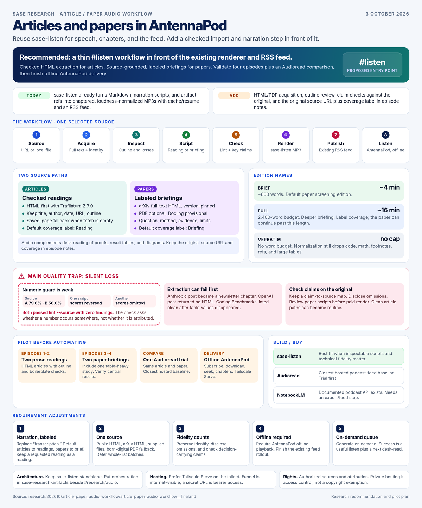
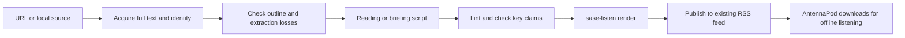

# Articles and papers in AntennaPod: a practical audio workflow

> **Research query:** How can I easily transcribe web articles and research papers, such as those recommended in the research sidecar's `sase_paper_followup_reading_list.md`, into audio for AntennaPod while walking or commuting, using `sase-listen` or a better alternative? Critique the idea, clearly identify justified changes to the requirements, and recommend the best way to implement it.



## Bottom line

**Reuse `sase-listen` for [speech, chapters, and podcast publishing](#what-sase-listen-supports-today). Add a small source-import and narration workflow ahead of it.** Prefer checked source readings for prose articles and explicitly labeled, source-grounded briefings for technical papers. Start with [four manually prepared episodes and one hosted-service comparison](#how-to-phase-implementation) before automating. The deciding problem is preserving meaning through extraction and adaptation, then delivering an episode that actually plays offline in AntennaPod.

This is a good idea for exploring arguments and deciding what deserves a desk read. It is less suitable for checking proofs, comparing detailed result tables, or studying diagrams. Audio should complement those activities. Neither a pleasant voice nor a successful conversion establishes that a paper was faithfully represented.

## Research scope and evidence

Lead researcher synthesis · 2026-10-03 · Research and recommendation, not an implementation or deployment.

I read all three dispatch reports through `sase artifact read`, matched each by its registered dependency and existing suffix, and preserved their bytes when moving them into this folder:

| Dependency | Preserved report | Most useful contribution |
| --- | --- | --- |
| `research.3i.cdx` | [cdx](article_paper_audio_workflow__cdx.md) | Actual extraction/normalization failures, provenance, optional PDF backends, and a fair build/buy comparison |
| `research.3i.grk` | [grk](article_paper_audio_workflow__grk.md) | Reading-list scope, delivery prerequisites, on-demand selection, and an upstream SASE workflow |
| `research.3i.gem` | [gem](article_paper_audio_workflow__gem.md) | Article/paper production paths, spoken technical adaptation, and eventual phone capture |

My additional research inspected `sase-listen` at `3037d60800299eda8d7d43d1da6fcb4cb208779c`, inspected `sase-research-artifacts` at `1ade90f31a3fe43f82f6d97aef4039d8f1ecdd90`, checked current primary documentation, and ran controlled normalization/fidelity probes. I also audited the [actual follow-up list](../../202609/sase_paper_followup_reading_list/sase_paper_followup_reading_list.md) and [October 2 AntennaPod setup report](../sase_listen_antennapod_setup.md). No predecessor chats were consulted. I did not synthesize paid audio, sign up for a service, access the phone, or change hosting. [Researcher experiments below](#where-audio-can-lose-meaning) remain attributed observations; the PDF options have not been benchmarked on this corpus.

The list contains both engineering prose and academic studies. grk counted 48 URLs, including 38 distinct arXiv identifiers and 9 industry/lab HTML URLs; those include companions, not just the ten main picks. Its suggested initial material—OpenAI, Anthropic, METR, and a paper—fits a pilot better than converting the entire list. These genres are helpful defaults, but content matters more than file type: an HTML research note can depend heavily on figures, while a PDF position paper can be mostly prose.

## What sase-listen supports today

**What works today.** `sase-listen` accepts Markdown, its narration-script contract, and audited artifact references. It already provides chunk caching and resume, speech synthesis, loudness mastering, MP3 chapters, manifests, RSS enclosures, and feed retention. A narration script contains frontmatter and `##` chapters. There is no implemented web/PDF acquisition path: `load_source()` reads local inputs as UTF-8 or invokes artifact resolution. HTTP strings can match the artifact-reference pattern; passing an article URL is not a fetch operation. A binary PDF needs conversion first. These are code observations, not inferred limitations. [Source loading and manifest construction](https://github.com/sase-org/sase-listen/blob/3037d60800299eda8d7d43d1da6fcb4cb208779c/src/sase_listen/pipeline.py), [script contract](https://github.com/sase-org/sase-listen/blob/3037d60800299eda8d7d43d1da6fcb4cb208779c/docs/narration-scripts.md).

Existing edition names need careful presentation. `brief` targets about 600 words, roughly 4 minutes at 150 words per minute. `full` has a 2,400-word budget, roughly 16 minutes; it does **not** mean the complete paper. `verbatim` has no word budget, but deterministic normalization still drops material. Keep those schema meanings and [label coverage](#which-requirements-should-change) in episode titles/descriptions: “Reading,” “Briefing,” or “Selected sections.” The supported kinds remain `document` and `research`; external papers should initially use `document` with explicit publication. [Model and budgets](https://github.com/sase-org/sase-listen/blob/3037d60800299eda8d7d43d1da6fcb4cb208779c/src/sase_listen/script/model.py).

## Where audio can lose meaning

### Observed extraction and normalization failures

**The main quality trap is silent loss.** The normalizer omits code fences, math, footnotes, references sections, and large tables; some small tables become row-by-row speech. Extraction can lose figures or headings before the normalizer ever sees them. Retain diagnostics from both stages. cdx observed these outcomes with Trafilatura 2.3.0 and the inspected renderer:

| Actual reading-list source | Observed script outcome | Why it changes the design |
| --- | --- | --- |
| Anthropic, *Effective harnesses* | 1,831 words; one chapter titled “Get the developer newsletter”; lint errors remained | Even prose needs outline and boilerplate checks |
| *Coding Benchmarks*, v2 | 4,110 words; zero lint errors; key table values disappeared | Successful lint does not prove scientific coverage |
| Cursor quality study, v1 | 9,445 words; 114 math omissions; bibliography/residue problems | A full reading can be long and still incomplete |
| OpenAI harness post | Fetch returned no HTML in that run | Provide saved-page/manual fallback; do not publish an error page |

gem separately reported a successful Fowler extraction with meaningful chapters and zero lint errors. That supports Trafilatura as a useful starting point, not an assurance that every article will work. grk's roughly 22,800-word Cursor page count and cdx's roughly 11,000-word cleaned extraction measured different representations; they do not establish competing estimates of the paper's real length.

### What the numeric guard checks

I independently tested the numeric guard using the inspected code. The synthetic source said “Model A achieved 79.8% accuracy. Model B achieved 58.0% accuracy.” One script reversed the scores; another omitted them. **Both passed `lint --source` with zero errors and zero warnings.** A separate small table containing math-wrapped `79.8` and `58.0` normalized to model names without either result, while recording math omissions. These deliberately small probes establish the guard's limits, not a corpus-wide failure rate. Its numeric check asks whether a number occurs somewhere in the source; it does not check attribution, units, negation, comparison direction, or required coverage. [Fidelity implementation](https://github.com/sase-org/sase-listen/blob/3037d60800299eda8d7d43d1da6fcb4cb208779c/src/sase_listen/script/lint.py).

### What a useful paper briefing should preserve

A useful paper briefing should explain the question, method or mechanism, central evidence, limitations, and relevance. Select the few decision-carrying numbers and keep their units, denominators, uncertainty, and conditions. A briefing cannot preserve every statistic within a short budget. Maintain a small claim-to-source map with section, table, figure, or page locators; check those claims against the original, not only the extract. Describe a figure from inspected evidence, and disclose exclusions. Translate an equation's role when useful; do not imply that a conceptual explanation reproduces its derivation. Separate author claims from narrator interpretation. Syntax lint remains valuable alongside this review.

### What listening research establishes

The general premise has some research support, but little basis for promised retention gains. *PaperWave* explored paper podcasts over two months with 11 participants, including its authors, and emphasized listeners' surroundings and interactions. It is an exploratory design study, not proof that briefings outperform reading or that complete paper readings never work. My recommendation is therefore to test the habit, allow selected/full readings when requested, and use briefings as a default rather than a ban. [PaperWave](https://arxiv.org/abs/2410.15023).

## How to acquire articles and papers

### Articles and reviewable extraction

**Acquisition should be HTML-first, with a reviewable intermediate.** For ordinary articles, start with Trafilatura, disable comments, and retain links, tables, and images in the extracted record. Capture title, author, publication date, original URL, and the outline separately. Its documented CLI exports Markdown, while richer element handling can use structured extraction. Check the result rather than assuming Markdown implies completeness. A low word count can flag a problem, but is not sufficient to distinguish a legitimate short article from an abstract or access-denied page. [CLI](https://trafilatura.readthedocs.io/en/latest/usage-cli.html), [Python extraction](https://trafilatura.readthedocs.io/en/latest/usage-python.html).

### arXiv and publisher full text

For arXiv, follow the abstract page's actual full-text HTML link and pin a version. The abstract page itself is not the paper. arXiv documents experimental HTML and incomplete conversion coverage. Preserve paper structure—reference boundaries, captions, tables, and math—instead of depending entirely on a generic article extractor. Use a publisher's accessible full text when available and PDF when necessary. [arXiv accessible HTML](https://info.arxiv.org/about/accessible_HTML.html).

### PDFs and optional conversion

The PDF disagreement resolves to a staged choice. `pdftotext` is a reasonable diagnostic and manual-pilot baseline for a digitally generated PDF whose reading order and important evidence you inspect. An LLM cannot reliably restore missing or interleaved evidence merely because the requested output is short. Do not treat a messy dump as an adequate source by default. For automated PDF ingestion, benchmark an optional structured converter on representative two-column papers, tables, formulas, and a difficult document before choosing it.

**Docling is the provisional structured PDF choice**, because its documented reading-order, table, local-processing, and Markdown/JSON capabilities fit provenance and omission tracking. PyMuPDF4LLM is a credible lighter comparison: current documentation explicitly includes multi-column handling, layout analysis, page chunking, and OCR. This corrects grk's overly broad “fast and shallow” characterization. Neither documentation nor third-party rankings demonstrate accuracy on Bryan's inputs. Keep these dependencies optional, check package/model licenses, and add scanned-PDF OCR only when a real source needs it. [Docling capabilities](https://docling-project.github.io/docling/), [PyMuPDF4LLM](https://pymupdf.readthedocs.io/en/latest/pymupdf4llm/).

### Blocked pages and saved sources

For blocked or logged-in pages, initially accept user-saved HTML, Markdown, or a legally obtained PDF. An optional browser extraction route can come later. Jina/other hosted fetchers would send the URL and content to another service and cannot be assumed equivalent to local acquisition. Bounded downloads, timeouts, content-type checks, and explicit failures are enough for an initial single-source helper; no general crawler is needed.

## Which alternatives are worth comparing

**Buying is a real alternative.** The reports were uneven here: cdx found direct podcast-feed products, whereas grk and gem dismissed commercial options too broadly. The relevant test is whether a service converts the actual sources faithfully and delivers them in AntennaPod with less ongoing effort.

| Approach | Verified/documented fit | Decision |
| --- | --- | --- |
| Existing `sase-listen` plus an import workflow | Editable scripts, chapters, cache/resume, feed, integration already present | Best fit when technical fidelity and inspection matter |
| Audioread | Article/PDF ingestion and personal podcast feeds for podcast players | Closest hosted baseline; trial the same article and paper |
| txtpod | Article/PDF narration, web capture and private RSS; iOS-oriented native app | Secondary candidate; check Android-only onboarding and current terms |
| NotebookLM / Gemini Notebook audio | Customizable source overviews and downloadable audio | Useful briefing comparison; needs an export/feed step |
| Readwise Reader | PDF text-view TTS and synchronized reading; current FAQ requires connectivity for TTS | Good reading/highlighting tool; weaker fit for this offline AntennaPod workflow |
| ElevenReader | Imported text listening; export uses separate ElevenLabs tools | Useful alternate reader; not a direct replacement for the existing feed workflow |

Those are documented capabilities, not account-tested quality rankings. Audioread's pricing page did not expose a usable price table in this session, and preview limits may not cover an entire paper; verify the account offer before purchasing. txtpod's “word for word” claim does not establish figure/table fidelity. [Audioread](https://audioread.com/), [pricing](https://audioread.com/pricing), [txtpod](https://txtpod.app/), [Reader TTS](https://docs.readwise.io/reader/docs/faqs/text-to-speech), [ElevenReader](https://elevenreader.io/).

One important correction: **“NotebookLM has no official API” is now false as a general claim.** Google documents Enterprise audio-overview APIs and a standalone podcast API that takes source context and returns downloadable MP3 audio. The standalone path requires an enabled Cloud project and an IAM role, rather than an Enterprise notebook/license. Consumer documentation also offers a single-speaker Brief and custom instructions, so two-host banter is not mandatory. This makes an automated Google alternative feasible; it does not establish source fidelity, RSS integration, or a better maintenance/cost tradeoff here. [Google podcast API](https://docs.cloud.google.com/gemini/enterprise/notebooklm-enterprise/docs/podcast-api), [Enterprise audio overviews](https://docs.cloud.google.com/gemini/enterprise/notebooklm-enterprise/docs/api-audio-overview), [consumer audio formats and accuracy warning](https://support.google.com/notebooklm/answer/16212820?hl=en).

For ordinary articles alone, I would try Audioread before writing substantial software. For this mixed technical reading list, the existing inspectable renderer makes a small import workflow more attractive. If the [hosted pilot](#how-to-phase-implementation) wins on convenience and fidelity, buying is a valid outcome. There is no evidence here for “unmatched” voice quality, near-zero retention from paper readings, or guaranteed superiority of a custom stack.

## How to deliver episodes to AntennaPod

**Phone delivery needs an end-to-end check.** gem described it as already operational; the audited October 2 setup report instead recorded an unserved feed, a placeholder episode, insufficient narrator quota, and a disclosed feed token needing replacement. That is dated evidence, not a live status check today. Verify and finish that rollout before claiming success. It need not prevent a local-file listening pilot or extraction research.

AntennaPod accepts a podcast URL and supports background download configuration. Subscribe once, download before leaving, and test chapters, seeking, playback position, and offline playback. A local folder with transferred MP3s is a practical pilot fallback, though it adds a transfer step. RSS polling and Android scheduling mean publication does not guarantee immediate appearance; the reports' sub-minute or 60–90-second arrival promises are unsupported. [Subscription](https://antennapod.org/documentation/getting-started/subscribe), [automatic downloads](https://antennapod.org/documentation/automation/automatic-downloads), [local-folder recovery guidance](https://antennapod.org/documentation/bugs-first-aid/database-error).

Prefer **Tailscale Serve** when the phone can fetch through the tailnet. Funnel exposes the resource to the internet; a secret URL is bearer access. Podcast index-blocking tags are not authentication. Downloaded episodes can play without a live VPN connection. Keep third-party source files outside both the served directory and the public research repository; keep private source adaptations local unless publication is appropriate. Private hosting is a technical access decision, not an automatic copyright exemption. Use authorized sources and preserve attribution; broader redistribution needs a separate rights assessment. [Serve](https://tailscale.com/docs/features/tailscale-serve), [Funnel](https://tailscale.com/docs/features/tailscale-funnel).

## Where the workflow should live

The linked tool's instructions require `sase-listen` to remain standalone, without importing `sase` or `sase_core_rs`. Reuse its renderer and contract. Initially put orchestration in `sase-research-artifacts`, next to `#research/audio`, with a small independently testable acquisition helper. The existing macro already writes/reuses scripts, runs the guide and source lint, renders, and delivers audio; it expects a research report, so it needs an external-source entry point. An optional standalone HTML importer in `sase-listen` is a reasonable later convenience, not an architectural violation. Heavy PDF stacks and agent authoring should remain separate from rendering. [Existing macro](https://github.com/sase-org/sase-research-artifacts/blob/1ade90f31a3fe43f82f6d97aef4039d8f1ecdd90/src/sase_research_artifacts/xprompts/research_audio.md).

A proposed `#listen` entry point should submit one URL/file and an optional reading/briefing preference. This name and interface are recommendations, not existing commands. The workflow is:



### Source identity and repeat ingestion

Keep fetched bytes, extracted text, optional structured data, diagnostics, and scripts in a stable per-source directory outside the public research checkout. Record canonical URL/DOI/arXiv version, fetch hash, converter/options, script hash, and model/prompt version for generated adaptations. Deduplicate by source/version plus coverage/script identity, not a temporary filename. Retry should reuse the same script and cached chunks; a deliberate new edition may create a new episode.

### Original source links in episode notes

There is one justified renderer integration change: preserve the **original external source URL and coverage label through the manifest into episode notes**. Current manifests identify the render input, and feed links use templates for supported artifact refs. An external URL in script frontmatter alone does not provide a general original-paper link. This deserves a small explicit change rather than disguising external papers as SASE reports. [Feed URL handling](https://github.com/sase-org/sase-listen/blob/3037d60800299eda8d7d43d1da6fcb4cb208779c/src/sase_listen/feed.py).

## Which requirements should change

These are the deliberate requirement adjustments:

1. **Change “transcription” to narration with explicit coverage.** Default articles to checked readings. Default papers to a `brief` screening edition; offer an 8–12-minute deeper briefing within the `full` budget, or selected/full source readings on request. Never silently substitute a summary for a requested reading.
2. **Start with one selected source.** Support public HTML, arXiv full-text resolution, supplied Markdown/HTML, and born-digital PDFs through a checked fallback. Defer whole-list batches, arbitrary authenticated scraping, universal OCR, and automatic interpretation of every graphic.
3. **Make fidelity and attribution part of success.** Preserve source identity, disclose omissions, and check decision-carrying claims. Review generated paper scripts and suspicious extraction before paid rendering/publication. Established, clean article paths can become routine.
4. **Require offline AntennaPod delivery.** A browser player or server-side MP3 alone does not finish the intended workflow. Phone capture is useful after delivery works; use an explicit listening action rather than interpreting every Telegram URL as a purchase/render request.
5. **Bound the listening queue and active effort.** Generate on demand. Treat useful completion and a clear next reading action as success, rather than the number of converted papers. Aim for at most about a minute of active handling for a clean article and a few minutes of paper review; these are pilot targets, not measured guarantees.

## How to test a manual pilot

For a manual pilot, the existing commands work after acquisition and inspection:

```bash
# Initial HTML extraction; inspect body, title, headings, tables and captions.
uvx --from 'trafilatura==2.3.0' trafilatura -u 'ARTICLE_URL' \
  --markdown --no-comments --links --images > article.md
sase-listen script article.md -o article_narration.md --json
sase-listen lint article_narration.md --source article.md
sase-listen render article_narration.md --dry-run
sase-listen render article_narration.md --no-publish
# Publish the episode returned by render after checking a sample.
sase-listen publish EPISODE_ID
```

For a paper, author the briefing with `sase-listen guide --edition brief`, lint against the extract, and verify central claims against the original. Then use the same render/publish path. Explicit publication avoids accidental release through research auto-publish settings. Keep source link/coverage information with the pilot record until the [feed metadata improvement](#original-source-links-in-episode-notes) lands.

### Audio size and rendering costs

At the current 64 kb/s MP3 format, audio is approximately 0.48 MB per minute: about 4.8 MB for 10 minutes before artwork/tags. Longer readings increase synthesis requests and review work as well as duration. Existing field notes report inexpensive rendering but a real quota interruption; cache/resume helps, while billing and quotas still need validation. Use the configured narrator's dry-run estimate as a dated estimate, check current provider/account rates, and sample real speech. I am not carrying forward the reports' precise monthly budgets or unverified model names as current prices. [Renderer field notes](https://github.com/sase-org/sase-listen/blob/3037d60800299eda8d7d43d1da6fcb4cb208779c/docs/field-notes.md).

## How to phase implementation

The implementation should follow the pilot evidence. First prepare two prose readings and two paper briefings, including a table-heavy study, and compare one hosted conversion. Confirm actual offline phone playback. Then automate HTML/arXiv acquisition, stable storage, source links, and the checked script path. Add the [optional PDF backend](#pdfs-and-optional-conversion) after a small measured comparison. Add mobile capture and a limited queue only after the single-source workflow is useful. Useful checks include abstract/error-page rejection, heading preservation, no newsletter/bibliography chapters, central result attribution, deliberate omissions, repeat-ingestion deduplication, interrupted synthesis resume, and phone download/seek behavior. Success does not require a new player, crawler, or general paper platform.

## Recommended solution

**Recommended solution:** implement a thin [`#listen`](#where-the-workflow-should-live) workflow in front of the existing `sase-listen` renderer and RSS feed, using checked HTML extraction for articles and source-grounded, clearly labeled briefings for papers. Prefer arXiv/publisher HTML, keep PDF conversion optional with Docling provisionally favored pending a corpus test, and preserve original-source links and omission evidence. Validate four episodes and an Audioread comparison first; finish the existing feed rollout and use [offline AntennaPod downloads](#how-to-deliver-episodes-to-antennapod). This offers convenient commute listening while keeping technical uncertainty visible and reserving visual reading for the evidence that needs it.
