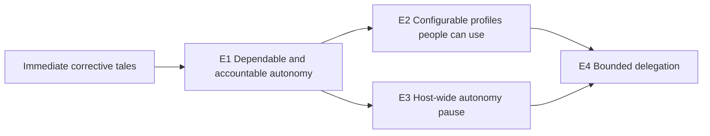

# Verifiable epic boundaries for the `%auto` autonomy redesign

Independent research by **cdx**, 2026-10-08.

**Recommendation:** split the work into **three near-term epics and one later delegation epic**. The near-term outcomes are dependable and accountable existing automation, configurable profiles usable across the current interfaces, and a host-wide autonomy brake. Bounded delegation has a separate completion contract and should follow them. Keep the small immediate fixes as tales; keep friction reducers and hard execution permissions conditional.

The split is practical because each epic can deliver a complete behavior that can be demonstrated and tested on top of its declared dependencies. “Independent” should mean independently releasable and verifiable at that point, rather than executable in any order. It does not require separate policy engines, parallel implementations, or elaborate temporary APIs.

## Scope and evidence

I read the two requested reports through audited artifact reads before reaching my conclusions:

- [Accepted autonomy policy report](auto_directive_autonomy_policy/auto_directive_autonomy_policy.md).
- [Accepted autonomy UX report](auto_autonomy_profiles_ux/auto_autonomy_profiles_ux.md).

Their product recommendations are the baseline. My contribution is to choose delivery boundaries, identify their prerequisites, and make completion observable. I did not locate, read, or consult any other report or researcher from the current epic-decomposition swarm. References within the two supplied consolidated reports are shared input, rather than independently consulted peer reports.

I inspected the current primary checkout at `7e75bbcd8d182b048575b982bd3ccbfb3867dc63`, the opened `sase-core` checkout at `cd73d9687c3813915fc6db610236be9a6fd5eab6`, and `sase-telegram` at `70701a0155bb4c7504ca054bf88dd582812256d0`. I ran a read-only parser probe against this checkout using the installed SASE Python environment. I also reviewed the current memory governing macros, artifact access, CLI conventions, beads, flags, and single-turn gates. No product implementation was changed or implementation test suite run.

The historical usage figures in the supplied reports are useful prioritization evidence, but I did not remeasure them. They report 170 of 234 automatically approved epics coming from phase/land workers, and 224 automatic versus 64 human gate resolutions over the UX report's 30-day window. The division below does not depend on those counts remaining exact.

### Current seams that make the split feasible

| Observation independently checked | Evidence | Delivery implication |
| --- | --- | --- |
| Keyword arguments, extra positionals, and even an unclosed parenthesis can enable automation | Parser probe below; `src/sase/macro/_directive_collect.py` and `_directive_values.py:506` | Launch validation is a small immediately verifiable correction; it should not wait for arbitrary profiles. |
| A live toggle can lose to the launch environment | `src/sase/main/plan_approve_handler.py:92,633`; `axe/run_agent_runner_launch.py:309`; TUI `actions/agents/_approve.py` clears metadata and updates the UI optimistically | One authoritative session record and read-back confirmation belong together in the first epic. A prettier toggle alone would retain the defect. |
| Automatic gate creation is centralized and uses the normal executor | `notification_gates/service.py:create_gate` and `_resolve_auto_gate`; `adapter.py:resolve_auto_selection` | Replace decision selection at an existing seam. Preserve ordinary validation, response locking, and execution rather than building another auto executor. |
| Tale automation depends on presentation defaults today | `plan_gate.py:192` sets `[approve, commit]`; `adapter.py` filters the primary branch using default selection | Explicit effect/option selection is foundational. Changing keyboard defaults must never change automatic publication behavior. |
| Continuation transport is inconsistent | `axe/run_agent_helpers_artifacts.py` copies `approve` but not the full argument; `monitor/continuation_delivery.py:217` reauthors `%auto`; `turns/prompt.py` emits fork/model/effort | Structural inheritance is a real lifecycle deliverable, rather than a parser feature. |
| Epic worker launch policy is still literal | `bead/work_prompt.py:187,226` append `%auto` to phase and land prompts | A fixed safe interim worker rule can precede configurable role profiles. |
| Both Python and Rust already parse launch auto state | Rust `agent_launch/typed_units.rs:400`, `wires.rs`, and `admission.rs:472` | Parser, replay, and editor parity must cross the binding boundary. A Python-only grammar epic would be incomplete. |
| Launch automation is currently expressly unsupported | `agent/launch_request_planning.py:35` accepts only `approval='required'`; launch adapter has `auto_policy='forbidden'` | Delegation can remain manual while all near-term epics ship. It is a clean later extension, not a dependency of profiles. |
| Telegram already has notification and server-side callback plumbing | Plugin `outbound.py`, `pending_actions.py`, `inbound_handlers/`, and `agent_format.py` | Add controls to the current surfaces. A separate bot or policy editor is unnecessary. |

Read-only parser results on the current checkout:

| Authored token | Current result |
| --- | --- |
| `%auto` | Enabled, mode `plan`, no argument. |
| `%auto:off` | Enabled, mode and argument `off`. |
| `%auto(plan=ask, questions=ask)` | Enabled, mode `plan`, no argument: the keywords disappear. |
| `%a(epic=ask)` | Enabled, mode `plan`, no argument. |
| `%auto(standard, unexpected=allow)` | Enabled with opaque argument `standard`; unknown key disappears. |
| `%auto(tale, epic)` | Enabled with argument `tale`; second positional disappears. |
| `%auto(tale` | Enabled as bare auto; `tale` remains in the cleaned prompt. |

Existing tests also document behavior that intentionally changes: `tests/test_directives_flags.py:test_auto_argument_is_retained_for_adapter_validation` accepts opaque `foo`; `tests/test_plan_gates_execution.py` expects tier mismatch to fail at gate creation and verifies that bare tale auto selects `approve` plus `commit`. These need explicit replacement expectations, not removal of coverage.

## Why this split is worth doing

A single epic would mix several different claims of success: eliminating contradictory state, making profiles useful, stopping host-wide automation, authorizing child work, and potentially restricting shell tools. Its land review would have to judge all of them together. Conversely, epics named “Rust backend,” “TUI,” and “Telegram” would produce partial plumbing and put integration risk into a final giant milestone.

The proposed boundaries follow observable outcomes. This is consistent with DORA's guidance to make work independently valuable and testable and to integrate small increments. **My application of that guidance** is to make each epic own its necessary core behavior, host glue, user controls, and acceptance evidence. It does not imply that each epic must be tiny or that each phase can run in parallel. [DORA: Working in small batches](https://dora.dev/capabilities/working-in-small-batches/).

Four boundaries are enough. A separate observability epic would permit new authority before a user could account for it. A separate grammar epic would permit configurable behavior before users could discover or steer it. A separate cleanup epic would make migration someone else's unfinished work. Put those capabilities in the relevant outcome epic.

The brake is the one useful additional split beyond the supplied policy's P1/P2/P3 structure. It has separate durable host state and a different scope from a session profile. It also works with only compatibility profiles, so it can land before the configurable-profile epic. Its control surface ships with its behavior; this preserves the UX report's principle that UX must accompany policy rather than trail it.

## Contracts to settle once, then reuse

Agree on these in the first epic's plan and fixtures. They are implementation details that make the accepted recommendations verifiable, rather than new product requirements or another design epic.

1. **A session owns its mutable effective policy.** Resolve and snapshot config at launch; live changes are explicit revisions of that snapshot. Successor turns use the session identity and current record. Copies in turn metadata are projections, not competing authorities. Later config edits do not silently widen a running session.
2. **A gate samples policy at a defined decision point.** Record the sampled policy revision, request identity/hash, effect selection, source, and later execution outcome. A live edit or pause is not cancellation of an already accepted decision. An existing waiting gate is never swept into execution by enable, resume, or TTL expiry.
3. **No profile ordering by name or numeric level.** The baseline's `min(requested, parent)` is conceptual. `approve` and `archive` have different effects; question strategies and unattended disposition also need explicit compatibility rules. Compare permitted effects and kind-specific restrictions. Reject or park an ungranted combined selection as a whole; do not execute an allowed subset of a disallowed combined request.
4. **Actor identity comes from the host context.** Agent-authored continuations and live commands may narrow; they cannot declare themselves human to widen or resume. A genuinely human-approved child can retain the requested profile, prominently shown in review. This is a cooperative workflow boundary under unrestricted shells, as both supplied reports acknowledge.
5. **Manual is explicit when inheritance exists.** Outside a session, absence of `%auto` is Manual. Within a structural continuation, absence means inherit. `%auto:manual`, alias `off`, must override inheritance. This incorporates the UX report's refinement of the earlier policy report; `off` cannot remain an opaque enabled argument.
6. **Rendering uses effective consequences.** `ask` plus `on_ask: deny` displays a decline. A brake forces ordinary asks to park, while explicit denies remain denies. The same Rust summary feeds CLI, TUI, editor, Telegram, and mobile projections; the shell-coverage sentence stays visible in inspect/control views.

## Dependencies and delivery mechanics

The dependency graph is small:

**Preferred delivery order:** corrective tales → E1 → E3 → E2 → E4. E2 and E3 are logically independent after E1. Delivering the brake first adds protection early. If simultaneous work causes contention in shared summary or mutation code, simply sequence them; parallel agent work is not needed to obtain the benefits of separate epics.

Each epic's core bindings must land before its Python consumers, with the corresponding `sase-core-revision.txt` update. Follow the existing documented wire/version and binding-registration checks. These are normal cross-repository obligations, not a reason to create Rust-only epics.

Use the required sunset flag for legacy metadata/environment compatibility. The new effective record must win whenever present, including when it explicitly says Manual. Compatibility projections cannot become a second authority. Test both flag states, and define a removal condition tied to old runners draining. Removal is part of the lifecycle change's ownership even if its dedicated flag bead remains open until that condition holds. Named profiles and the pause state are durable product settings, not permanent feature flags.

Internal phases may land unused bindings or genuinely incomplete paths behind the project's temporary epic beta mechanism. An epic is complete only when its promised user behavior works with that scaffolding removed. Avoid a second evaluator, a new service, or dual writable policy stores just to let epics advance separately.

### Verification should prove effects, not only JSON

Use a shared acceptance matrix whose cases each name an input, a policy revision, a gate kind, an expected decision, permitted effects, and evidence. Extend it at each epic rather than duplicating test machinery. Core fixtures prove parse/evaluation/summary contracts; host integration cases prove actual gate publication, option execution, prompt replay, and successor behavior. Surface tests prove that controls use the same mutations and read back the result.

The repository already has useful real-lifecycle acceptance seams in `tests/fakey/test_gate_capacity_custom_e2e.py` and `test_gate_capacity_plan_e2e.py`. They show how to test production gate creation/execution against a fake agent runner without purchasing LLM runs. Reuse that approach for a small planner → coder → monitor → gate-follow-up scenario. Do not make the real custom adapter auto-allowable; its use as a test harness does not change its production restriction.

For each epic, require appropriate core/binding checks, host tests, plugin tests for changed transports, and required TUI visual snapshots. Follow current guarded `sase tool run` verification routes and the project's `just check` policy; a full exhaustive suite is not needed merely to research or demonstrate this split. A screenshot alone cannot prove that Manual actually prevents the next auto decision.

## Keeping all accepted recommendations in scope

| Accepted recommendation group | Owner and sequencing |
| --- | --- |
| Fail-closed grammar, observed-behavior docs, truthful toggle, uniform continuation inheritance, nested-epic stopgap | Corrective tales; E1 supplies their durable implementation. |
| Rust policy object, explicit option IDs/effects, awareness, live record, revisions, shared summary, explain/history, named chips, why lines, universal decision records | E1. |
| Quiet receipts, fan-out/refusal announcements, completion line, Telegram formatter/attribution repairs, glyph cleanup | E1; decline announcements become active when E2 introduces decline semantics. |
| Config layers, reserved/default/custom profiles, narrow overrides, roles, recommended question flag, decide/deny, unattended disposition, epic nesting depth | E2. |
| Completion/hover/diagnostics, safe prompt preview, prompt chip, draft picker, live matrix picker, restore-last `A`, bulk results, CLI `set`, Telegram chooser and `/auto`, Admin profile pane, mobile projections, first-use notice | E2; shared revision/mutation primitives start in E1. |
| Host-wide pause, optional TTL, unreadable-store behavior, resume restrictions, no sweep, all pause controls | E3; E1 announcements receive Pause buttons when E3 lands. |
| Config-only armed delegation, cumulative budget, attenuation, child preview, budget display | E4, later. |
| Standing approvals and deterministic-rule-first model review | Conditional follow-on work after evidence, usually separate tales or small epics according to actual scope. |
| Grace windows/`glance`, override editor, save-as-profile, extra receipt loudness | Preserve the supplied UX report's data-gated deferral. |
| Actual sandbox/tool enforcement | Separate later decision and potential epic using the same profile, not a prerequisite for E1–E4. |

The proposed order changes packaging, not these product choices. It adds no requirement for an LLM reviewer, policy DSL, full phone editor, implicit autonomy on fresh launches, new deck, per-decision toast, or delayed-approval default.

### Deferred work does not need premature epic commitments

Do not bundle standing approvals, model review, and grace timers into one “advanced autonomy” epic merely because they were later phases in the input report. They have different evidence and verification needs:

- A standing approval is a scoped, expiring grant with a ceiling and replay rules.
- A reviewer is an optional decision mechanism that must remain behind deterministic authority limits.
- A grace window changes an inline automatic gate into a durable waiting gate and successor turn. It needs timer/human/pause race tests, request-revision handling, cancellation, and no double execution. It is opt-in; it does not provide undo.

Revisit these after roughly a month of decision/control logs, as the UX report recommends. If any is chosen, size it then and give it a specific outcome; it need not wait for unrelated delegation work.

Hard permissions warrant a separate provider-coverage investigation before an implementation epic. Source inspection confirms the existing bypass defaults and provider bypass arguments. The first investigation should establish which supported providers can actually enforce the proposed restrictions under SASE's single-turn harness. E1–E4 continue to state that they cover host checkpoints and leave shells unrestricted. If hard enforcement becomes justified, compile the same profile into verified provider controls or a broker and test actual prohibited effects. Do not add another prompt directive or a reassuring restricted badge ahead of enforcement.

## Sources and limits

The two accepted artifact reports linked above provide the product requirements and historical evidence. Current source paths and revisions in the evidence table provide my independent implementation checks. Their older line references occasionally changed: notification adapters now have a facade in `adapters.py` and implementation in `adapter.py`/`adapter_registry.py`. Plans should use the current modules.

Two external primary sources reinforce concrete acceptance requirements:

- Telegram limits inline `callback_data` to 64 bytes and requires callback acknowledgement to clear the client's waiting indicator. Use a short server-side action key, promptly acknowledge receipt, and distinguish submitted from applied. Stale, duplicate, unreachable-host, and terminal-session cases belong in each new Telegram control's owning epic. [Telegram Bot API: InlineKeyboardButton](https://core.telegram.org/bots/api#inlinekeyboardbutton), [CallbackQuery](https://core.telegram.org/bots/api#callbackquery).
- AWS's idempotent API design couples request identity with mutation and treats reuse of an identity for a different intent as an error. **My inference for delegation:** admission accounting and retry identity must be designed together, because a timeout does not prove that child dispatch failed. A refund is safe only when non-dispatch is established. [AWS Builders' Library: Making retries safe with idempotent APIs](https://aws.amazon.com/builders-library/making-retries-safe-with-idempotent-APIs/).

These sources support implementation contracts rather than a forecast of development time. Phase counts below are planning aids, not effort estimates. Active epic/task status was not inventoried for this research; when turning it into implementation work, check current plans and the existing parser/docs repair tasks cited by the supplied reports before filing duplicates.

## Recommended verifiable epics

### Before the epics: a small corrective batch

Ship the independently small launch-validation correction, live-off/read-back repair, tier-mismatch-to-ask behavior, continuation preservation, question guidance, and docs/receipt/glyph corrections as appropriately sized tales. The supplied report identifies existing parser and documentation tasks; use their current state rather than creating a parallel backlog.

The interim worker protection depends on tier mismatch becoming an ordinary ask first. Replacing worker `%auto` with `%auto:tale` without that change would merely turn nested epic automation into a runtime error. An explicit conservative worker check is another acceptable interim implementation. E1 replaces temporary state plumbing; E2 replaces a fixed role rule with config.

If splitting a corrective tale from E1 would require essentially implementing E1 twice, make it E1's first phase. The goal is fast removal of the defect, not another process layer. Recognize `manual`/`off` explicitly as Manual in the compatibility contract; reject unsupported parentheses until the E2 grammar exists.

### E1 — Dependable and accountable session autonomy

**Outcome:** “I can trust the displayed state, turn existing automation off, follow it across turns, and see exactly what it did.”

**Includes:** the Rust-owned versioned policy and summary wires; compatibility translation for existing spellings plus explicit Manual; one authoritative session record; structural inheritance through in-process, monitor, gate, handoff, retry and dispatch paths; explicit plan/epic/question selection; actor/revision-aware mutation for existing controls; awareness text and its delivered-turn provenance; comprehensive decision records and execution status; `sase autonomy explain/list/log/show`; `agent list/show` and `gate show` projections; TUI named chip, Context section, why lines and truthful `A`; launch-review child-policy display; quiet receipts, epic announcements, completion summaries and matching Telegram/mobile projections. Keep arbitrary profiles and new unattended semantics for E2.

**Release checks:**

1. For bare `%auto`, a tale selects exactly `approve` and `commit`, an epic selects `approve`, and legacy question handling remains explicit. Reordering options, changing primary/default UI choices, or adding an ungranted effect never widens automatic execution. Tier-only forms ask on the other tier.
2. A malformed token is refused before runner launch. After an acknowledged live switch to Manual, the next plan, epic and question gate waits despite a stale inherited auto environment variable. A gate already waiting remains waiting after re-enable.
3. A multi-turn lifecycle preserves policy identity/current revision across every supported continuation path. Turning off in one member stays off in the next. Explicit agent-authored widening is refused; unrelated sessions remain independent. Dispatched launches carry the resolved snapshot rather than recomputing against destination config.
4. Every automatic outcome, including a question with no Plan Decisions, has a durable policy explanation tied to its gate and sampled revision. Explain, the Context view, and Telegram use the same consequence wording. Routine records do not become unread chores; epic launches are announced.
5. Forced persistence failure and competing live edits leave the last confirmed UI state accurate. Inspect views show the coverage line; the awareness fold names the last delivered turn rather than claiming an in-flight model learned a live edit.

**Suggested phases:** (1) core/compatibility contracts and fail-closed validation; (2) canonical session record, revisions, inheritance and migration; (3) runtime evaluation, awareness and durable decision/execution evidence; (4) CLI/TUI/Telegram/mobile rendering and existing-control read-back; (5) acceptance lifecycle, documentation, migration readiness and land.

**Why it stands alone:** existing syntax becomes reliable and observable without custom profile config. It is a complete product improvement even if the user postpones every later epic.

### E2 — Configurable profiles that people can discover and use

**Outcome:** “I can choose attended or unattended behavior, define my own profile, see its consequences before launching, and change it consistently from my desk or phone.”

**Depends on:** E1. It does not require delegation or the brake to evaluate profiles; pause controls appear when E3 is available.

**Includes:** `autonomy:` config, one-level inheritance and builtin/user/project layering with project tightening; `standard`, `attended`, `overnight`, role and compatibility profiles; narrow `%auto` overrides and shared validation; explicit `deny` and `on_ask`; recommended-option schema and decide-with-assumptions guidance; configurable worker roles and epic nesting depth; default/last-profile behavior; shared completion/hover/diagnostics and safe static explain; prompt chip and token-writing draft picker; `,a` matrix picker, bulk `A`, CLI `set`, Telegram chooser and `/auto` selection; coder-policy review row; Admin profile/provenance view; mobile projection updates and first-use notice. Existing manual launch review continues to show requested child autonomy and offers launch-as-Manual.

**Release checks:**

1. A sample configuration produces the accepted matrix: `standard` approves/archives tales, launches epics and chooses recommended answers; `attended` differs on questions; `overnight` declines epics, lets the agent decide questions, and declines unsupported asks rather than parking. Its awareness text and summaries agree with actual outcomes.
2. User config can define a custom profile; a project cannot widen its ceilings. Invalid names, cycles/chains beyond supported inheritance, unknown keys/values, duplicated fields, extra positionals, privileged inline grants and mixed forms all fail consistently in launch, CLI and editor diagnostics.
3. `%auto:manual` and `:off` explicitly override inherited automation. An inherited or role-constrained request cannot escape its ceiling through a profile name, inline override, live command or retry. Config edits leave running snapshots intact until a deliberate permitted reapply.
4. A recommended question chooses the marked option even when it is not first; multiple recommendations/malformed/free-text-only forms never fabricate an answer. `decide` delivers the no-human instruction and records the resulting assumptions through the supported continuation path. Neither answer mechanism grants launch, sudo or publishing authority.
5. Worker roles stop nested epic auto-approval by default. An explicitly configured depth allowance has a tested ancestry origin, survives successor turns, and asks or declines at the boundary according to policy. It counts epic nesting, separately from runner capacity and the later child-launch budget.
6. TUI `A` restores the last session profile, the draft picker edits visible prompt text, and CLI/Telegram/profile picker edits converge through the same revision-aware mutation. A stale phone card refreshes rather than overwriting newer state; duplicates are idempotent; partial bulk failures identify failed targets. Static preview never executes shell substitutions.

**Suggested phases:** (1) configuration/resolution/grammar plus editor parity; (2) new gate/question/unattended behavior and worker roles/depth; (3) prompt discovery and TUI/live CLI steering; (4) Telegram selection, review surfaces, Admin/mobile and failure handling; (5) integrated profile matrix, visual snapshots and land.

**Why it stands alone:** users gain practical expressiveness and a complete selection/steering experience. They can use custom profiles while launch requests remain human-reviewed.

### E3 — Host-wide autonomy pause

**Outcome:** “One action makes future automatic checkpoints wait across this host, including agents that have not launched yet, without killing work or discarding session profiles.”

**Depends on:** E1. It may ship before E2 using compatibility policies. If E2 ships first, E3 also verifies unattended disposition.

**Includes:** Rust-owned durable brake state and evaluation overlay; optional TTL; host-derived actor checks; unreadable-store diagnostics; CLI `pause/resume`; TUI launch-context and row/header state, palette/picker integration where available; Telegram `/auto pause/resume` and announcement Pause buttons; Admin brake controls; shared explain/why projections. “Host-wide” means the owning host, not an implicit fleet-wide stop. Remote controls must report which host confirmed application.

**Release checks:**

1. After pause is acknowledged, newly evaluated eligible automatic gates park on the host. A later-launched worker sees the same brake. Existing running work continues, stored profiles remain intact, and already accepted effects are not presented as canceled.
2. With an unattended profile, pause changes automatic/ordinary-ask outcomes to waiting, not decline. Explicit denies remain denials. Unknown kinds get their ordinary conservative handling with an accurate paused explanation.
3. Resume and TTL expiry permit future evaluations but never execute gates parked earlier. A human may answer those gates normally. Restart preserves indefinite/timed pauses; corrupted or unreadable brake state conservatively disables automation and exposes a repair instruction.
4. An agent can pause but cannot resume or forge a human actor. CLI, TUI and Telegram read back the same state. Duplicate requests, stale callbacks, failed writes and unreachable hosts do not display a false applied result.
5. A controlled pause-versus-gate race records the actual sampled brake/policy revision. The public wording matches that decision boundary; it never promises to revoke an approval that had already been accepted.

**Suggested phases:** (1) host brake persistence/evaluation and race fixtures; (2) CLI/TUI/Telegram controls and shared rendering; (3) restart/TTL/unattended/no-sweep acceptance and land. If E3 lands before E2, the unattended fixture can test the core contract immediately and E2 repeats it through the new real profile route.

**Why it stands alone:** this protects existing bare automation and future workers without defining new profiles or granting new authority. Its distinct host scope justifies a separate epic; per-session Manual is not a substitute.

### E4 — Explicitly armed, bounded delegation

**Outcome:** “A trusted configured profile can authorize limited child work automatically, and neither fan-out nor retries can exceed the grant or broaden child autonomy.”

**Depends on:** E1–E3. Plan this boundary now, but start implementation when a concrete workflow justifies replacing repeated manual launch approval. The supplied reports describe relatively low launch-gate demand; profiles and the brake do not depend on this being built immediately.

**Includes:** config-only launch grants and the explicit Arm confirmation; cumulative, durable, atomically reserved accounting; retry identity and recovery/refund rules; bounded models/scope/child depth; effect-wise parent/child attenuation; typed launch-request policy admission; fully expanded fan-out accounting; requested-versus-effective child-policy previews and remaining-budget displays; human override/review routes. Integrate all supported host child-launch paths participating in a delegated lineage so macros, repeats or nested child epics cannot evade accounting. This is workflow enforcement at host checkpoints, not a claim about arbitrary shell launches.

**Release checks:**

1. Without the armed configured grant, launch approval remains required. Prompt text, project widening, an agent-issued mutation, or a question answer cannot arm it. Human review sees the requested child profile and can launch as Manual.
2. With a cumulative budget of two, two unique child admissions succeed and a third requires the configured manual/refusal route even after the earlier children finish. Concurrent requests for the last allowance cannot both consume it. Runner capacity and `max_slots` do not replenish this authority budget.
3. A multi-unit launch is accounted after supported expansion; repeats and alternative branches cannot smuggle in additional units. Unresolved expansion that prevents bounding remains manual. Every automatically admitted child respects depth, scope, model and child-profile ceilings.
4. Retrying the same request yields the same admission and child identities without an extra charge or launch. The same identity with a changed request is refused. Inject failures before reservation, after reservation, and around dispatch; recovery reconciles persisted launch evidence and refunds only confirmed non-dispatch. An ambiguous timeout does not create fresh allowance.
5. A requested child policy with a disallowed combined effect does not receive partial execution. Child/successor profiles cannot regain parent-forbidden authority. Pause blocks new automatic admission at the documented decision point, and declined/parked requests explain the limit and remaining grant.

**Suggested phases:** (1) grant/lineage/attenuation contracts and human arming; (2) durable accounting, retry identity and dispatch reconciliation; (3) launch admission/fan-out integration plus previews and budget UI; (4) concurrency/crash/pause acceptance and land.

**Why it stands alone:** delegation changes what new work can start without a human. That requires a different proof from deciding an existing plan gate and merits its own epic. Shipping only `launch=allow` and adding limits later would not satisfy this epic.

### Final recommended set

| Epic | Distinct result to demonstrate at completion | Start condition |
| --- | --- | --- |
| **E1: Dependable and accountable session autonomy** | Turn auto off during a live session; all later continuation gates honor it; inspect the exact decisions and reasons. | Corrective tales, or incorporate inseparable corrections as its first phase. |
| **E2: Configurable profiles people can use** | Choose/customize attended or unattended behavior from the prompt/TUI/CLI/phone; the same matrix governs actual gates and displayed consequences. | E1. |
| **E3: Host-wide autonomy pause** | Pause once; future host checkpoints and future workers wait; resume never sweeps parked gates. | E1; preferably deliver before E2. |
| **E4: Armed, bounded delegation** | Admit a configured finite child workload with no over-budget or over-authority execution under concurrent retries and dispatch failure. | E1–E3 plus a concrete delegation use case. |

**Adopt E1–E3 as the near-term program; reserve E4 as the separate later expansion.** Deliver in the practical order **E1 → E3 → E2 → E4**, with the immediate corrective tales first. Each epic has a useful final state and a different observable proof. Keep later friction reducers and hard permissions as evidence-gated decisions instead of adding speculative epics now.
