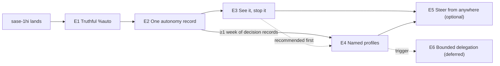

# Splitting the `%auto` Autonomy Redesign Into Verifiable Epics

> **Research query:** The goal is to make `%auto` much more configurable, intuitive, and
> powerful, accepting every recommendation in `auto_directive_autonomy_policy.md` and
> `auto_autonomy_profiles_ux.md`. Should the work be split into multiple epics? Split
> only if each epic can have distinct, verifiable results without jumping through too
> many hoops. End with a recommended set of verifiable epics (high level; phases
> optional), or justify not splitting.

## Bottom line

**Split it into four core epics plus one optional epic, in a diamond-shaped order.**
Further work is deferred behind data gates. Each epic ends in one user-visible claim
that a land agent can check with a test suite or one command. No epic needs a feature
flag that outlives it.

| # | Epic | The verifiable result, in one sentence | Phases | Repos | Absorbs |
| ---: | --- | --- | ---: | --- | --- |
| **E1** | [**Truthful `%auto`**](#e1-truthful-auto) | Every `%auto` spelling does exactly what the docs say or fails at launch. Turning auto off really turns it off. Auto state survives every continuation. No generated epic worker auto-approves a nested epic. | 5 | sase, sase-core | `sase-1hg`, `sase-1hh`, `sase-15s`, `sase-11g` |
| **E2** | [**One autonomy record**](#e2-one-autonomy-record) | One Rust evaluator decides every automatic gate outcome from one persisted record. Every decision is recorded, and `sase autonomy explain` shows what will happen. Behavior does not change. | 5 | sase-core, sase | — |
| **E3** | [**See it, stop it**](#e3-see-it-stop-it) | Every automatic decision can be found, per agent and across agents. Epic launches are announced on the TUI and Telegram. A host-wide brake makes every gate wait for you. | 5 | sase-core, sase, sase-telegram | — |
| **E4** | [**Named profiles**](#e4-named-profiles) | You pick a profile by name with completion, define your own in config, and generated workers get role profiles. Prompts can narrow autonomy but never grant it. | 6 | sase-core, sase | `sase-1i1` (as a decision) |
| E5 | *Optional:* [**Steer from anywhere**](#e5-steer-from-anywhere-optional) | You can retarget any live agent's profile from the TUI, CLI, or Telegram, with read-back and revision checks. | 3 | sase, sase-telegram | — |
| — | *Deferred:* [delegation, grace windows, hard permissions](#deferred-work) | Each one starts only when its trigger fires | — | — | — |

**Order:** E1 → E2 → {E3, E4} → E5. E3 and E4 both depend only on E2, so you can run
them in either order. I recommend E3 first: its brake and announcements are the safety
net for E4's new `overnight`-style declines. Also, E4's defaults should be chosen from
at least a week of the decision records E2 starts writing.

**Why split.** These reasons come from this repo's own history:

1. **Size predicts unfinished landings.** The whole program is roughly 20–25 phases. Among root
   epics created from July through September:
   - Those with **7 or more phases spawned a "Finish…/Complete…" child epic 28.8% of
     the time** (44 of 153). For 1–6 phases the rate was 9.5–18.6%.
   - Among closed August–September roots, **9 or more phases meant a 22.5 h median to
     close and 44% nesting**. For 5–6 phases it was **4.9 h and 12%**.

   ([data](#how-epics-in-this-repo-actually-land))
2. **The closest precedent needed a second epic.** Plan Decisions (`sase-1hi`) had 9
   phases across core, the gate, the TUI, Telegram, and the CLI. Hours after its phases
   closed, it needed a 6-phase landing-repair child epic (`sase-1hi.10`) to "make every
   surface honor the accepted vector". Autonomy has the same cross-surface parity
   problem.
3. **The baselines leave several decisions to data.** These include:
   - whether bare `%auto` should keep launching top-level epics;
   - the `ask` versus `max_depth` default for epic workers;
   - grace windows;
   - collapsing the picker;
   - the Telegram chooser.

   An epic launch preassigns every phase and its land agent at once, and a 5–6-phase
   epic lands in about 5 hours. So an epic cannot pause for a week to collect evidence.
   Data-gated decisions have to sit at epic boundaries.
4. **One plan cannot carry all the decisions.** Plan Decisions caps a plan at five
   decisions (`docs/sdd.md`). The two baselines leave ten decisions open. Split, each
   epic carries the two to five decisions that belong to it, and you answer them inside
   that epic's plan review.
5. **E1 protects the rest of the program.** Today every epic phase and land worker runs
   with a literal `%auto`, so any child epic it proposes launches with no human
   checkpoint. That happened 5 times in October alone, including the 6-phase
   `sase-1hi.10`. If E1 ships first, every later epic in this program lands under the
   new rule.

**The hoops are small.**
- `%wait(<planner>)` now follows the epics a planner launches. A chained prompt
  therefore starts each epic's planner only after the previous epic closes. Each plan
  is then written against code that has actually landed, not against a speculative
  design.
- Each epic needs one core-first phase plus a pin move (`just ratchet-core-revision`).
  sase does that today for every cross-repo feature.

## Scope and method

_Independent research, 2026-10-08, by the `cld` researcher._ I read both accepted
baselines through `sase artifact read`. I then checked their claims against current
code and data:

- **Source.** sase at `7e75bbcd8d` and sase-core at `cd73d968`. I re-ran the `%auto`
  parser probe at HEAD.
- **Bead store.** I exported every epic-tier plan bead (955) and every phase bead, then
  computed nesting, size, and time-to-close statistics.
- **Gate bundles.** I read the `~/.sase/interaction_requests/*` bundles from October
  1–8.
- **Epic machinery.** I read the `bd/land_epic` and `bd/work_phase_bead` macros
  (`default_config.yml`), `bead/work_prompt.py`, the Plan Decisions docs
  (`docs/sdd.md`), and the wait-for-epic docs (`docs/macros.md`).
- **Memory.** I read `sase_beads.md`, `sase_sizes.md`, `sase_flags.md`, `macros.md`, and
  the glossary strands for gate and gate turn.
- **Calibration.** I used one unrelated prior epic-split report
  (`research:202610/memory_built_instruction_migration_epics/memory_built_instruction_migration_epics.md`)
  to check the approach.

Syntax, config, and paths marked **proposed** are design, not existing behavior.

## What changed since the baselines

**Nothing from the baselines' P0 has shipped.** Every defect below is still live at
`7e75bbcd8d`:

| Defect (baseline ID) | Status at HEAD | Evidence |
| --- | --- | --- |
| D1 parenthesized `%auto(...)` fails open | **Live** | Probe: `%auto(plan=ask, questions=ask)` and `%a(epic=ask)` both return `auto_enabled=True, mode=plan, argument=None`. Rust `typed_units.rs` also keeps only the first positional |
| D2 `%auto:off` enables auto | **Live** | Probe: `%auto:off` returns `enabled=True, argument=off` |
| D5 `A` off does not stick | **Live** | `plan_approve_handler.py` still ORs `SASE_AGENT_AUTO_APPROVE` with meta |
| D6 continuations drop auto state | **Live** | `gate_turn/followup.py` and `main/pipe_handler.py` carry no `%auto`. Only `monitor/continuation_delivery.py` re-emits a prefix |
| D7 epic workers hard-code `%auto` | **Live** | `bead/work_prompt.py` appends `%auto` to every phase and land segment |
| Tier mismatch errors mid-run | **Live** | `_plan_gate_metadata.py:73` raises "`%auto:<arg>` conflicts with the authored tier" |

**The baselines missed three existing beads that belong to this program:**

- `sase-15s` (bug, small, READY) is D5 exactly.
- `sase-11g` (bug, large, READY) is D6 for gate and pipe continuations. Its note asks
  the audit to decide the semantics per path. The baseline's R7 already decides it:
  every member of an agent session inherits the policy.
- `sase-1i1` (feature, large, READY): "Decide how memory task beads under `%auto`
  obtain human consent for memory decisions." It was filed by `sase-1hi.land` today.
  This is an autonomy-policy question that neither baseline covers: should a profile
  auto-approve a plan that carries memory decisions? It fits naturally as an E4
  decision ([below](#e4-named-profiles)).

**Plan Decisions changed the plan gate underneath the baselines.** `sase-1hi` made two
changes:
- `%auto` approvals now take each decision's verified default and post one quiet
  receipt.
- Memory decisions clamp to *off* when no human reviewed the plan
  (`sase_memory_write.md`).

Its repair child `sase-1hi.10` has closed all six phases, but its land agent is still
running. Two consequences follow:

- E2's explicit-option-ID evaluator must preserve the take-defaults-and-receipt
  behavior.
- **Any epic in this program that edits memory** (E1's stale `macros.md` row, decision
  records in E2–E4) must be approved by a human. Under `%auto`, its memory consent
  would clamp to off and the memory edit would be deferred again.

**Generated `%auto` is wider than epic workers.** October 1–8 gate bundles show:
- 26 epic plans auto-approved: 3 by land agents (`sase-1hi.land`, two `bob-cli`
  lands), 2 by phase workers (`sase-1hi.1`, `sase-1dr.4`), 4 by agents launched from a
  research workflow (`research.*.linker.w*`), and 17 by other agents.
- 79 tale plans auto-approved, 1 question auto-answered, and 1 custom gate answered by
  a human.

Roles therefore cannot be a special case inside `bead/work_prompt.py`. A role is just a
profile name that any macro or workflow can emit (`%auto:epic_worker`). That puts the
`%auto:<profile>` grammar and roles in the same epic (E4).

**Stale line references.** `notification_gates/adapters.py` was split into a facade
plus `adapter.py`, `adapter_plan.py`, and `adapter_registry.py` (`9aa7ff2485`). The
baselines' line references into `adapters.py` are stale. The design is unaffected.

**In-flight epics that touch the same files.** Land or retire these before the epic
that collides with them:

- `sase-1hi.10` (plan gate, receipts, Telegram) → before E1.
- `sase-18i` ("Approve any tale plan file from the CLI", `plan_approve_handler.py`) →
  before E1.
- `sase-11t` (crash-safe sudo/gate handoff) and `sase-1ab.10` (turn rename,
  `gate_turn/`) → before E1's continuation phase.

## How epics in this repo actually land

`bd/land_epic` tells the land agent to verify that the epic is *truly complete* by
reading notes, source, and commits. If anything remains, it plans the rest: a tale when
one agent can finish it, otherwise a child epic. So "verifiable" has a concrete meaning
here: **a land agent reading the plan cold must be able to decide "done" mechanically.**
When it cannot, the result is a "Finish…" chain. Child-epic titles in the store begin
with "Finish" 83 times, "Complete" 21, "Close" 9, and "Repair" 8. The 98 in-progress
plan beads today include chains six levels deep, such as
`sase-19i.7.3.3.3.3.3` "Land the Node Finder open budget with real margin".

| Root epics (Jul–Sep, n=535) | Spawned a nested child epic |
| --- | --- |
| 1–2 phases | 12.1% (4/33) |
| 3 | 11.6% (11/95) |
| 4 | 18.6% (19/102) |
| 5 | 12.8% (10/78) |
| 6 | 9.5% (7/74) |
| **7+** | **28.8% (44/153)** |
| Phase text mentions sase-core/Rust | 21.5% (65/303) vs 12.9% without |
| Phase text mentions Telegram | **39.1% (9/23)** vs 16.8% without |
| September alone | 32.9% (56/170) |

| Closed roots (Aug–Sep) | n | Median hours to close | Nested |
| --- | ---: | ---: | ---: |
| 1–4 phases | 116 | 4.0 | 19.0% |
| **5–6 phases** | 86 | **4.9** | **11.6%** |
| 7–8 phases | 47 | 7.0 | 25.5% |
| 9+ phases | 45 | 22.5 | 44.4% |

**Phase size matters as much as phase count.** Phases of size `large` and above get
`#plan`, and may author their own epic. Since July:
- `large` phases spawned a child epic **11.4%** of the time (32/280);
- `medium` phases did so **0.04%** of the time (1/2,355), and `small` phases never did.

`sase-1hi.1` is an example. It was a `large` core phase, and it auto-launched its own
epic, "Rust core contracts for Plan Decisions".

These are correlations. Bigger epics also touch more repos. Still, the three signals
point the same way and set the design targets:

- **5–6 phases per epic.**
- **Phases of `medium` or smaller.**
- **At most one non-core linked repo per epic, confined to one phase.**

## Should this be split at all?

**Yes.** For a single epic to be right, three things would all have to hold:

- the scope fits in about 6 medium phases;
- no decision waits on post-landing data;
- the decisions fit within five.

None of them holds:

| Test | One epic | Split as recommended |
| --- | --- | --- |
| Phases | ~20–25 (the baselines estimate P0 5–6 tales, P1+UX-1 7–9, P2+UX-2 7–8; the split below totals 24 with E5) | 5–6 per epic |
| Repos | sase, sase-core, sase-telegram, mobile gateway, all at once | At most one non-core repo per epic |
| Watch points | Three (after E1, after E2's records accrue, after E4's profiles see use), impossible inside one launch | Each one is an epic boundary |
| Plan Decisions | ≥10 open decisions against a cap of 5 | 2–5 per epic |
| Nested-epic exposure | The program's own land agents still auto-approve nested epics | E1 removes it for E2 onward |
| Plan freshness | Phase 18 is designed against code that phases 1–17 have not written yet | Each plan is written after its predecessor lands |

**Alternatives I rejected:**

- **The baselines' literal grouping:** P0 as tales, P1+UX-1 as one epic, P2+UX-2 as one
  epic. Each of those epics has 7–9 phases across 3–4 repos, which is the riskiest
  bucket above. The UX report rightly says UX must ship with its policy phase, "never as
  a trailing epic". I keep that rule but cut *vertically* by capability, not by
  report.
- **Horizontal layers** (core, then Python, then UX). These give no user-visible result
  until the last epic. They also violate the trailing-UX rule.
- **P0 as independent tales.** This is viable, and the policy baseline recommended it.
  I prefer a small epic for three reasons:
  - the five fixes share one verification artifact, the [behavior contract](#the-yardstick);
  - `sase-11g` is `large` and would go through its own planning anyway;
  - the epic-worker stopgap and the tier-mismatch change only work as a pair.

  If you would rather move faster, run E1's phases as tales, with the contract suite
  first and the rest in parallel.

## Principles for drawing the lines

1. **Cut at watch points, not at report sections.** A boundary goes wherever real usage
   has to answer a question before the next step can be designed well.
2. **Every epic lands complete.** No `beta` flag crosses an epic boundary
   (`sase_flags.md` says a beta flag must be removed before its epic lands). New power
   ships with its discovery surface: profiles ship with completion, and the evaluator
   ships with `explain`. The legacy `%auto` meta and env readers live behind one
   `sunset` flag, which is exactly what sunset flags are for.
3. **One claim and a few exit checks per epic.** Separate **exit criteria** (tests,
   fixtures, one command that a land agent runs) from **watch metrics** (read after
   landing). Watch metrics never block a close.
4. **Shape for clean landings.** Use 5–6 phases. Keep phases `medium` or smaller. Put
   one core-first phase per epic, followed by the pin move. Confine Telegram to one
   phase.
5. **Shared contracts belong to the earliest epic that needs them.**
   - The core summary wire is what `explain` prints, and `mutate_autonomy` is what a
     truthful `A` writes. Both therefore belong to E2, not to the later UX epics where
     the UX report placed them.
   - That one move is what makes E3 and E4 independent of each other.
6. **Build the yardstick first.** Every later exit criterion is stated as a change to
   two artifacts: E1's behavior contract and E2's `explain`.

## The yardstick

**The autonomy behavior contract** (proposed) is a table-driven test suite. E1 creates
it, and every later epic extends it.

- **Rows:** a prompt spelling or state, crossed with the context:
  - launch, toggle, in-process coder;
  - monitor, gate, and pipe successors;
  - epic phase and land workers.
- **Columns:** the outcome per gate kind.
- **Parity:** each row also runs through the Rust typed launch extractor and the
  editor diagnostics, so Python, Rust, and the LSP cannot disagree.

**E1's first phase writes the rows as they are today, with `strict` xfail marks on
today's defects.** Each later E1 phase flips its rows to passing. E1's land check is
then a single fact: no xfail rows remain. Target outcomes after E1:

| Prompt or state | Tale plan | Epic plan | Question |
| --- | --- | --- | --- |
| no `%auto` | ask | ask | ask |
| `%auto`, `%a`, `%auto+`, `%auto:plan` | approve + archive | approve + launch clan | first option |
| `%auto:tale` | approve + archive | **ask** (today: mid-run error) | first option |
| `%auto:epic` | **ask** (today: mid-run error) | approve + launch clan | first option |
| `%auto:off`, `%auto:foo` | **launch error** (today: auto on, opaque argument) | ← | ← |
| `%auto(epic=ask)`, `%auto(a, b)`, `%auto:x(...)` | **launch error** (today: full bare-`%auto` automation) | ← | ← |
| bare `%auto`, then `A` off | **ask** (today: approve via the env snapshot) | **ask** | **ask** |
| epic phase or land worker (generated) | approve + archive | **ask** (today: approve + launch) | first option |
| gate follow-up or pipe successor of a `%auto:tale` agent | **approve + archive** (today: ask, state dropped) | ask | first option |
| in-process coder of a `%auto:tale` planner | **`:tale` kept** (today: degraded to bare) | — | — |

**After E2, `sase autonomy explain`** (proposed) is the second yardstick. A property
test asserts that for every contract row,
`sase autonomy explain -p "<prompt>" --json` equals the decision the runtime actually
makes. Later epics state their results as new contract rows plus `explain` output.

## Recommended epics

Each epic lists:

- its **result**;
- **phases** with sizes;
- **exit criteria** for the land agent;
- **watch metrics** to read after landing;
- **Plan Decisions** (each ≤5, with the default in bold) to put in its plan's
  `decisions:` frontmatter, so you answer them during plan review;
- what it **absorbs**.

### E1 Truthful `%auto`

**Result.**
- Every `%auto` spelling either does exactly what the docs say or fails at launch with a
  clear sentence.
- `A` off really turns automation off.
- Auto state survives every session continuation.
- Generated epic workers stop auto-approving nested epics.
- There is no new syntax, and the only deliberate behavior changes are the ones listed
  in the [contract](#the-yardstick).

| Phase | Size | Content |
| --- | --- | --- |
| E1.1 `contract` | medium | The behavior-contract suite, with strict-xfail rows for D1, D2, D5, D6, D7, and the tier mismatch. Includes a Python/Rust/LSP parity harness |
| E1.2 `grammar` | medium | Fail-closed `%auto` grammar in sase-core (`typed_units.rs`, directive metadata, LSP diagnostics) and in Python (`_directive_values.py`). Reject named arguments, extra positionals, mixed forms, and unknown colon values. The error text says "remove `%auto` for manual". The TUI prompt bar shows the same diagnostic. Move the core pin. **Absorbs `sase-1hg`** |
| E1.3 `live` | medium | Readers use agent meta live, and the env snapshot is no longer authoritative (**`sase-15s`**). Gate follow-ups, pipe successors, and the in-process coder carry the session's state (**`sase-11g`**). A tier mismatch resolves to `ask`. `A` toasts state the observed behavior |
| E1.4 `workers_docs` | small | Epic phase and land workers render `%auto:tale`. `/sase_questions` says "put your recommended option first; under `%auto` it is chosen automatically" (D8; follow `generated_skills.md`). `docs/macros.md` and the core `macros.md` row describe the observed behavior: bare `%auto` archives tales, `:tale` auto-answers questions (**`sase-1hh`**; needs a memory decision). Reserve `⚡` for autonomy (U7) |
| E1.5 `acceptance` | xsmall | Live run: `%auto(epic=ask)` fails at launch. A bare-`%auto` agent toggled off parks its next plan. A land agent that proposes a child epic parks it |

- **Exit criteria:**
  - the contract suite has zero xfail rows;
  - the parity harness is green;
  - the rendered epic-worker prompt contains no bare `%auto`;
  - the E1.5 transcript shows the three live outcomes.
- **Watch metrics** (feeding E4): nested-epic gates waiting for you per day, and how
  long they wait. These answer whether `ask` is tolerable or whether a `max_depth`
  budget is needed.
- **Plan Decisions:**
  - `nested_epic`: **ask** | keep auto;
  - `auto_off`: **launch error** | treat as manual now;
  - `tale_questions`: **keep auto-answering, fix docs** | match the old docs (ask);
  - memory consent for the `macros.md` row.
- **Repos:** sase, plus one sase-core phase.
- **Start condition:** after `sase-1hi` closes (`%w(bead=sase-1hi)`).
- **Telegram:** the receipt formatter and attribution fixes (U4/U5) move to E3. That
  keeps E1 free of a third repo, and E3 already owns the Telegram surface.

### E2 One autonomy record

**Result.**
- Every automatic gate outcome comes from one Rust `evaluate()`, applied to one
  persisted `agent_meta.autonomy` record that has a revision.
- Selection uses explicit option IDs, never UI defaults (this fixes D3's root cause).
- Every automatic outcome, including auto-answered questions, leaves a decision record.
- The agent is told its policy.
- `sase autonomy explain`, `list`, `log`, and `show` expose all of it.
- **There is no behavior change.** The compatibility profiles `standard`, `tale`, and
  `epic` reproduce E1's contract exactly.

| Phase | Size | Content |
| --- | --- | --- |
| E2.1 `core_policy` | medium | sase-core: `EffectiveAutonomyPolicy` v1; compatibility translation (bare, `+`, `:plan` → `standard`; `:tale` and `:epic` → reserved profiles; absence → manual); `evaluate(policy, request) → AutonomyDecision{auto, ask, deny; option_ids; rule; reason; digest}`; unknown kinds → `ask`; combined selections all-or-nothing; the binding. Move the pin |
| E2.2 `core_summary` | medium | sase-core: `AutonomySummaryWire` (profile, class, badge, generated sentence, per-kind cells, coverage line, source, revision); `decision_sentence()`; `mutate_autonomy(record, selection, expected_revision, actor)` with tighten-only for agent actors. Move the pin |
| E2.3 `record` | medium | Resolve the policy at launch and persist the record. Every reader goes through it. Structural inheritance for in-process, monitor, gate, pipe, and handoff successors replaces `auto_launch_prefix`. `A` writes the record through `mutate_autonomy`. `%dispatch` ships the record. A **`sunset` flag** (`sase flag new`, tested in both states) keeps the legacy meta triad and env as derived compatibility |
| E2.4 `gates` | medium | Adapters declare capability sets. Plan, epic, and question auto-resolution goes through `evaluate`, using explicit option IDs and preserving Plan Decisions' take-defaults behavior and quiet receipt. A `policy {profile, rule, decision, source, revision, digest}` block goes on every automatic outcome. The agent-awareness block is rendered into the context and labeled as soft |
| E2.5 `cli` | medium | `sase autonomy explain`, `list`, `log`, and `show`, following `cli_rules.md`. `sase agent list` gets an AUTO column plus `--json` fields. `sase agent show` gets an Autonomy section. `sase gate show` gets a policy line. Adds the `explain`-equals-runtime property test and a live check |

- **Exit criteria:**
  - E1's contract passes **with no expectation edits**;
  - `explain` parity holds across every row;
  - **UI-default independence:** a test that reorders `primary_branch` and flips
    `default_selected` on tale and epic gates leaves every automatic outcome unchanged;
  - no production code reads `SASE_AGENT_AUTO_*` outside the sunset branch;
  - every gate the acceptance run auto-resolved carries a `policy` block.
- **Watch metrics** (feeding E3 and E4, readable with `sase autonomy log`):
  - automatic decisions per day, by kind and by creator role (human-typed, epic worker,
    workflow worker);
  - top-level epic auto-launches, which answers the policy baseline's open decision 2;
  - auto-answered questions.
- **Plan Decisions:**
  - `question_default`: **keep `first`** until E4 adds `recommended` | switch now;
  - `awareness_scope`: **every `%auto` agent** | only unattended agents;
  - memory consent for a new decision record, "autonomy is one record evaluated in core,
    never derived from gate UI defaults".
- **Repos:** sase-core (two phases), sase.

### E3 See it, stop it

**Result.**
- Every automatic decision can be found per agent and across agents.
- Epic launches and declines are announced in the TUI's `⚡ Auto` inbox tab and on
  Telegram, with **Manual** and **Pause all** actions.
- Each agent's completion message gains one autonomy line.
- A host-wide **Pause autonomy** brake makes every gate wait for a human without
  stopping work.
- Every surface prints identical words from one core summary.

| Phase | Size | Content |
| --- | --- | --- |
| E3.1 `core_brake_why` | medium | sase-core: the brake as an `evaluate` input. Host-wide, with an optional TTL, it **fails closed**: every allow becomes `ask`, and `on_ask` is forced to `park` once it exists. Also `autonomy_why()` and autonomy fields on the mobile agent projection. Move the pin |
| E3.2 `tui_status` | medium | Row bolt colored by class. Header chip `⚡ <profile>` and the one-line Auto strip. Context-card Autonomy section: rules, provenance, the awareness text verbatim, and this session's decisions. "Why it asked" lines on Plan Review and the question modal. Visual goldens (`tui.md`) |
| E3.3 `announce` | medium | `autonomy.announce`. Inbox rows tagged `autonomy`, `autonomy-epic`, and `autonomy-decline`. The completion line. A Child-autonomy row in Launch Review (`m` launches the child without `%auto`). A read-only Admin Center Autonomy pane |
| E3.4 `brake_surfaces` | small | `sase autonomy pause|resume [-t ttl] [-r reason]`, a context-bar chip, and palette entries. Agents may pause but never resume |
| E3.5 `telegram` | medium | sase-telegram: a real receipt formatter; the epic alert `[📄 Plan] [✋ Manual] [⏸ Pause all]`; `/auto` (list, plus `pause`/`resume`); `auto_resolution` never shown as "you via Telegram"; `pending_actions` callbacks bound to a revision |

- **Exit criteria:**
  - a **one-renderer test** shows the chip, strip, Context section, `log`, and Telegram
    printing identical words for the same record;
  - brake rows are added to the contract: paused means every gate parks, gates parked
    while paused do not auto-resolve on resume, an unreadable store counts as paused,
    and an agent actor cannot resume;
  - goldens pass for every new TUI surface;
  - a test requires the coverage line on every inspect view.
- **Watch metrics:**
  - whether epic alerts are acted on within minutes (the demand signal for grace
    windows);
  - Pause usage;
  - the decline rate;
  - Telegram taps (the UX baseline found zero Telegram gate answers since September).
- **Plan Decisions:**
  - `announce`: **`[epic, decline]`** | `[epic]`;
  - `brake_scope`: **host** | project;
  - `telegram_scope`: **knowing + stopping** | defer Telegram;
  - memory consent for a decision record, "the autonomy brake fails closed". This
    deliberately inverts `hold-pull-fail-open`, so it deserves its own record.
- **Why the brake is here and not with profiles.** The UX baseline placed Pause in UX-2,
  but it needs no profiles. Adding it to compatibility profiles is trivial, and it is
  the only control that stops agents that do not exist yet. That matters today, while
  epics still fan out.

### E4 Named profiles

**Result.**
- **Config:** an `autonomy:` config defines named profiles, layered builtin < user <
  project, with the project layer tighten-only.
- **Selection:** `%auto:<profile>` and `%auto(<profile>, plan|epic|q=…)` select and
  narrow a profile. Unknown or privileged values fail at launch, and prompts can never
  grant `launch` or exceed a role or parent ceiling.
- **Roles:** generated launches select role profiles, which replaces E1's stopgap.
- **Vocabulary:** `deny`, `on_ask: deny`, `question: recommended | decide`, and
  `plan: approve` (no archive).
- **Discovery:** completion, hover, the prompt chip, and the `,a` picker.

| Phase | Size | Content |
| --- | --- | --- |
| E4.1 `core_profiles` | medium | sase-core: config schema v1; layering and single-level `extends`; the id grammar; reserved `manual`/`off` and `plan`/`tale`/`epic`; the selector and override grammar with ceilings; editor metadata (bare-`%auto` completion lists profiles with generated one-liners; hover matrix; diagnostics) for the TUI, LSP, and nvim; `config_parity` fixtures. Move the pin |
| E4.2 `vocabulary` | medium | `deny` and `on_ask: deny` (a typed refusal the agent was warned about). `question: recommended` (a `recommended: true` question-schema flag plus `/sase_questions`) and `decide`. `plan: approve` and `archive`. Optionally `epic: approve(max_depth=N)` from bead ancestry |
| E4.3 `roles` | medium | `autonomy.roles`. `bead/work_prompt.py` emits the role profile. Built-in `standard`, `attended`, `overnight`, and `epic_worker`. Role and parent ceilings at launch. An agent-authored follow-up `%auto` may only narrow |
| E4.4 `compose` | medium | The prompt-bar autonomy chip, using live core parsing and blocking submit on an error. The first-use toast and the one-time notice. The awareness block covers the new values |
| E4.5 `picker` | medium | The `,a` matrix picker: Manual first, digits apply, a coverage line, `p` for pause. Palette entry "Set autonomy…". Goldens |
| E4.6 `docs` | small | `docs/macros.md`, the `macros.md` row (memory consent), and a decision record, "prompts select autonomy; only config grants". Adds profile and layering rows to the contract, plus a live check |

- **Exit criteria:**
  - **contract:**
    - `standard` reproduces E1's bare rows exactly;
    - `attended` and `overnight` rows match their generated one-liners;
    - a project layer that widens a field is clamped and the clamp is shown;
    - `%auto(launch=allow)` is a launch error;
    - a kind the profile does not mention evaluates to `ask`;
  - **parity:** completion and diagnostics agree across the TUI, LSP, and nvim;
  - **roles:** generated epic workers render the role, and a config edit changes their
    behavior with no code change;
  - **explain:** `explain` shows layer provenance.
- **Watch metrics** (feeding E5 and the deferred work): how often each profile is used,
  overrides typed, nested-epic asks under `epic_worker`, and `decide` outcomes.
- **Plan Decisions:**
  - `epic_worker`: **`epic: ask`** | `approve(max_depth=1)` (use E1's watch data);
  - `standard_epics`: **keep auto-launch** | ask (use E2's data);
  - `standard_plans`: **approve + archive** | approve only;
  - `memory_plans` (`sase-1i1`): **ask when a plan carries memory decisions** | take
    defaults;
  - `overnight_name`: **`overnight`** | `away`.
- **Start condition:** at least one week after E2 lands, so the E2 decision log can
  inform the defaults. E3 normally lands during that week.

### E5 Steer from anywhere (optional)

**Result.**
- `A` toggles Manual ↔ the session's last profile and applies to marked agents, with
  per-target results.
- `sase autonomy set SELECTION AGENT...` accepts the exact `%auto` grammar, and agent
  actors may only narrow.
- Telegram agent cards gain a `⚡ <profile> ▾` chooser and `/auto <agent> <profile>`.
- Plan Review gains a `u autonomy` coder row.
- `alt+a` opens the picker in draft mode to edit the token.
- Every change confirms by read-back, and a stale revision is refused.

| Phase | Size | Content |
| --- | --- | --- |
| E5.1 `tui_steer` | medium | `A` targeting the last profile, with marks; the Plan Review coder row; `alt+a` draft mode. Moves `set_prompt_auto_mode` into core `edit_prompt_autonomy`, so this phase starts in sase-core |
| E5.2 `cli_set` | small | `sase autonomy set` with `-n/--dry-run` and `-j/--json`, refused for widening inside agent runs |
| E5.3 `telegram_steer` | medium | The chooser, `/auto <agent> [<profile>]`, idempotent taps, stale-card refresh, and controls that retire with the session |

- **Exit criteria:**
  - revision-race tests: two writers, and the stale one is refused;
  - per-target results when part of a batch fails;
  - Telegram callback tests;
  - contract rows for live mutation by agent actors (narrowing only).
- **Run it only if** E4's watch metrics show at least two non-default profiles in
  regular use, or you find yourself wanting to retarget running agents. If you skip
  it, nothing earlier breaks: `A` stays truthful (Manual ↔ default), and the E4 picker
  already applies profiles.
- **Plan Decisions:**
  - `a_target`: **last profile** | default;
  - `telegram_chooser`: **ship** | skip.

### Deferred work

Each deferred item has a trigger. None is scheduled.

| Item | Trigger | Expected shape |
| --- | --- | --- |
| **E6 Bounded delegation** (baseline P3 + UX-3): config-only `launch: allow(max_children, max_depth, child_profile)`, atomic budget reservation, attenuation, an "Arm this autonomy?" confirmation | Launch gates become a frequent friction point. The baseline counted only 49 in three months | An epic of about 4 phases |
| Grace windows (`after 30m`, a `glance` profile) | E3 shows epic alerts acted on within minutes | Tale, or a small epic |
| Standing approvals, `review(@model)` decision value | Repeated identical asks in the E2 log | Tales |
| In-picker override editor, "save as profile" | Typed overrides appear in E4's watch data | Tale |
| Hard execution permissions (baseline P5) | Friction or incidents at the tool level, not the gate level | **A separate research question first**, then an epic that adds a `sandbox:`/`tools:` section to the same profile object |

## Dependency graph and launch recipe



**Chain E1 → E2 → E3 in one prompt.** `%wait(<agent>)` waits for the planner's
completion *and* for closure of the epics it launched. Each planner therefore starts
only after the previous epic closes. **Leave `%auto` off the planners.** Two reasons:

- each epic plan's Plan Decisions should reach you;
- memory consents clamp to off under `%auto`.

Shape of the prompt (proposed):

```text
+sase %id:auto_e1 %w(bead=sase-1hi) #epic
Plan epic E1 "Truthful %auto" exactly as scoped in
@research:202610/auto_autonomy_epic_split__cld.md, honoring
@research:202610/auto_directive_autonomy_policy/auto_directive_autonomy_policy.md and
@research:202610/auto_autonomy_profiles_ux/auto_autonomy_profiles_ux.md.
Absorb sase-1hg, sase-1hh, sase-15s, sase-11g. Carry the listed Plan Decisions.
---
+sase %id:auto_e2 %w:auto_e1 #epic
Plan epic E2 "One autonomy record" as scoped in ... (same refs)
---
+sase %id:auto_e3 %w:auto_e2 #epic
Plan epic E3 "See it, stop it" as scoped in ... (same refs)
```

**Launch E4 by hand** after reading a week of `sase autonomy log`. Launch E5 only if its
trigger fires.

**Every epic plan should state these cross-cutting constraints**, so a phase worker
reading the plan cold does not have to rediscover them:

- **Core first.** Each epic's first core phase lands the wires, bindings, and tests in
  sase-core. Python consumers follow only after `sase-core-revision.txt` moves past that
  commit. Do not reimplement core logic in Python (`rust_core_backend_boundary`).
- **Phase size.** Phases stay `medium` or smaller unless there is a stated reason. A
  `large` phase plans before implementing and may author its own epic.
- **TUI goldens.** TUI phases update visual goldens in the same phase (`tui.md`).
- **CLI rules.** New CLI follows `cli_rules.md`.
- **Generated skills.** Skill edits (`/sase_questions`) follow `generated_skills.md`.
- **Memory edits.** Memory edits go through `/sase_memory_write` and need an accepted
  memory decision in the plan.
- **Coverage line.** It is mandatory on every inspect surface. Never show a padlock or a
  "restricted" badge while provider shells run with bypass flags.

## Where I depart from the baselines

These changes affect *sequencing and packaging*, not the accepted design:

1. **The core summary wire and `mutate_autonomy` move earlier, into E2.** The UX
   baseline placed them in UX-1 and UX-2. `explain` prints the summary's per-kind cells,
   and a truthful `A` must write the record. Moving them makes E3 and E4 independent.
   You can then choose visibility first or configurability first.
2. **`sase autonomy log` moves to E2.** E2 starts writing the decision records, and you
   want to read them during the week before E4.
3. **The brake moves from UX-2 into E3.** It needs no profiles.
4. **Telegram is one phase per epic, in E3 and E5.** The UX-0 receipt fixes move to E3.
   Epics that mention Telegram spawned nested epics 39% of the time, and the baseline
   found zero Telegram gate answers since September.
5. **Roles ship with `%auto:<profile>`.** Generated `%auto` comes from more than
   `bead/work_prompt.py`, for example research-workflow workers. A role is simply a
   profile name that any generator emits.
6. **Profiles get one new value question: plans that carry memory decisions**
   (`sase-1i1`). Plan Decisions shipped after the policy baseline's vocabulary was
   written.
7. **P0 becomes a small epic, not loose tales.** This is optional; see
   [the alternatives I rejected](#should-this-be-split-at-all).

## If you only want two or three epics

- **Two:** E1 and E2. You get every silent-authority fix, one evaluator, decision
  records, and `explain`. You do not yet get new power or any new TUI.
- **Three:** add E4. You get profiles, roles, completion, and the picker. You give up
  the brake, the announcements, the Context section, and Telegram. That is viable, but
  it leaves the UX baseline's weakest moment ("what did autopilot do?") answered by
  CLI only.

## Risks

| Risk | Mitigation |
| --- | --- |
| E1's own land agent still runs with bare `%auto`, because its worker prompts are rendered at launch | Accepted. The fix protects E2 onward. Watch E1's landing yourself |
| E2's "no behavior change" hides a subtle drift, especially around Plan Decisions defaults | The contract suite plus the UI-default-independence test, and E2 runs only after `sase-1hi` closes |
| Nested-epic `ask` leaves overnight runs stranded | It is an E1 Plan Decision. E1's watch metric feeds E4's `max_depth` option |
| Golden churn across E3, E4, and E5 | Each epic owns distinct surfaces: status (E3), compose and picker (E4), steering (E5) |
| Conflicts with in-flight epics (`sase-18i`, `sase-11t`, `sase-1ab.10`) | Land or retire them before E1.3, or rebase E1.3 onto them |
| The pin moves stall a Python phase | One core-first phase per epic. `just ratchet-core-revision` or the six-hourly ratchet PR |

## Sources

**Accepted baselines** (read through `sase artifact read`):
- `research:202610/auto_directive_autonomy_policy/auto_directive_autonomy_policy.md`:
  defects D1–D8, requirements R1–R11, phases P0–P5, and open decisions.
- `research:202610/auto_autonomy_profiles_ux/auto_autonomy_profiles_ux.md`: phases
  UX-0 to UX-4, the brake, the "four things", and reliability contracts.

**Calibration (unrelated prior research):**
`research:202610/memory_built_instruction_migration_epics/memory_built_instruction_migration_epics.md`.
I took the principles "cut at watch points" and "separate exit criteria from watch
metrics" from it, and recomputed its time-to-close figures independently on the current
store.

**sase source** (`7e75bbcd8d`):
- `src/sase/bead/work_prompt.py`: literal `%auto` in phase and land segments; task
  prompts have none.
- `src/sase/default_config.yml`: `bd/land_epic`, `bd/work_phase_bead`, `epic`, `plan`.
- `src/sase/macro/_directive_values.py` (`resolve_auto_mode`, `resolve_auto_argument`)
  and the parser probe through `sase.macro.directives.extract_prompt_directives`.
- `src/sase/main/plan_approve_handler.py` (env OR meta).
- `src/sase/notification_gates/{adapter,adapter_plan,service}.py`
  (`resolve_auto_selection`, `_resolve_auto_gate`, `spec.auto`).
- `src/sase/gate_turn/followup.py` and `src/sase/main/pipe_handler.py` (no `%auto`
  carry); `src/sase/monitor/continuation_delivery.py:217` (`auto_launch_prefix`).
- `src/sase/_plan_gate_metadata.py:73` (tier-mismatch error).
- `docs/sdd.md` (Plan Decisions, five-decision cap); `docs/macros.md` (wait-for-epic);
  `docs/rust_backend.md` (core revision pin and ratchet).
- About 39 source files and 42 test files reference the legacy `%auto` fields.

**sase-core** (`cd73d968`): `crates/sase_core/src/agent_launch/typed_units.rs` (`"auto"`
keeps only the first positional); `crates/sase_core/src/editor/directive/metadata.rs`
(`auto`: `COLON_BARE_PLUS`, no keywords); `AGENTS.md` (pin and binding recipe).

**Beads:**
- **Related task beads:** `sase-1hg`, `sase-1hh`, `sase-15s`, `sase-11g`, `sase-1i1`.
- **Precedent epics:** `sase-1hi` and `sase-1hi.10`.
- **Statistics:** a full export of epic-tier plan beads (955) and phase beads, computed
  with throwaway scripts outside the repo:
  - nesting by phase count, by repo mention, and by phase size;
  - time to close for August–September roots;
  - child-title prefixes;
  - 98 in-progress plans.

**Gate bundles:** `~/.sase/interaction_requests/*/*/{request,response}.json`, October
1–8. Counts by kind and source; producers of auto-approved epic plans.

**Memory:** `sase_beads.md`, `sase_sizes.md`, `sase_flags.md`, `macros.md`, and the
glossary strands for gate, gate turn, and agent clan.
