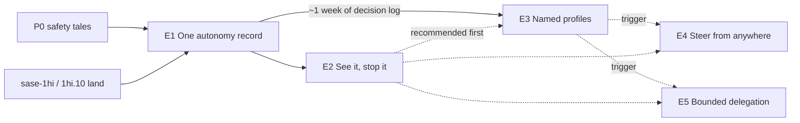

# `%auto` Autonomy: Split Into Verifiable Epics

> **Research query:** I want to make the `%auto` directive much more configurable,
> intuitive, and powerful. I accept every recommendation in
> `auto_directive_autonomy_policy.md` and `auto_autonomy_profiles_ux.md`. Splitting this
> into several epics would likely help, but only if each epic can have distinct,
> verifiable results without too many hoops. What is the best split? End with a
> recommended set of verifiable epics (high level; phases optional), or explain why no
> split is needed.

## Bottom line

**Split it.** The verifiable shape is:

- **a batch of safety tales that ship first;**
- **three committed epics;**
- **one optional epic;**
- **one deferred epic.**

Each epic ends in one sentence a human can demonstrate and a land agent can check
mechanically. No feature flag crosses an epic boundary.

| # | Unit | Distinct result you can check | Size | Repos |
| ---: | --- | --- | --- | --- |
| **P0** | [Safety tales](#before-the-epics-safety-tales) (5; 3 already filed) | No `%auto` spelling silently grants more than it says. Toggling auto off really turns it off. Epic workers park nested epics instead of launching them | 5 tales | sase, sase-core |
| **E1** | [**One autonomy record**](#e1-one-autonomy-record) | One Rust evaluator decides every automatic gate from one live session record. `sase autonomy explain` predicts each decision exactly, every decision is logged, and the state survives every continuation. **No behavior change** | 6 medium phases | sase-core, sase |
| **E2** | [**See it, stop it**](#e2-see-it-stop-it) | Each agent names its profile on every surface. Epic launches ring with **Manual** and **Pause** buttons. One host-wide brake makes every future gate wait, including for workers that have not launched yet | 5 phases | sase-core, sase, sase-telegram |
| **E3** | [**Named profiles**](#e3-named-profiles) | You pick `attended`, `overnight`, or your own profile by name, found through `%auto` completion and the `,a` picker. Generated workers run under config roles. Prompts can narrow autonomy but never grant it | 6 phases | sase-core, sase |
| E4 | *Optional:* [**Steer from anywhere**](#e4-steer-from-anywhere-optional) | Retarget any live agent's profile from the TUI, CLI, or Telegram, with read-back and revision checks | 3 phases | sase(-core), sase-telegram |
| E5 | *Deferred:* [**Bounded delegation**](#deferred-work) | A config-armed profile auto-approves a finite child workload, and neither retries nor fan-out can exceed it | ~4 phases | sase-core, sase |

**Order:** P0 → E1 → E2 → E3 → (E4 if its trigger fires) → (E5 if its trigger fires).
E2 and E3 each depend only on E1, so you can run them in parallel if configurability is
urgent. I recommend E2 first, for two reasons:

- **E2 is the safety net for E3.** Its brake and announcements are what you will want
  when E3's profiles start declining work.
- **E3's defaults deserve data.** E3's plan asks you to choose defaults, and about a week
  of E1's decision log answers those questions better than intuition does.

**Why split rather than one epic.** The work totals about 20 phases across three repos.
I recomputed epic outcomes from this repo's bead store
([details](#evidence-that-shapes-the-cut)):

| Root epics (Aug–Sep, closed) | Median hours to close | Spawned a nested child epic |
| --- | ---: | ---: |
| 5–6 phases | 4.9 h | 11.6% |
| 9+ phases | 22.5 h | 55.6% |

The closest precedent, Plan Decisions (`sase-1hi`, 9 phases across core, CLI, TUI, and
Telegram), needed a 6-phase repair child epic, which is still running.

The program also contains real **decision points**. Several defaults should be chosen
from post-landing data, but an epic launch pre-assigns every phase, so an epic cannot
pause mid-flight to collect it. A plan also caps out at five Plan Decisions, and the
baselines leave about ten open.

**The hoops are small.** Five of them, each already routine:

- one `sunset` flag for the legacy readers;
- one core-first phase per epic (the host writes `sase-core-revision.txt` automatically
  when a turn commits both repos);
- a two-step grammar: P0 rejects `%auto(...)`, and E3 later gives it meaning;
- a two-step worker rule: P0 emits `%auto:tale`, and E3 moves that into config roles,
  with identical behavior;
- one table-driven contract suite that every epic extends.

There are no throwaway adapters, no second evaluator, and no long-lived `beta` flags.

## Scope and method

_Consolidated research, 2026-10-08._

**Inputs.** This report merges five independent reports (`__cdx`, `__cld`, `__grk`,
`__mus`, `__gem`) with my own verification. It takes both accepted baselines as binding
on **what** to build:

- [`auto_directive_autonomy_policy.md`](../auto_directive_autonomy_policy/auto_directive_autonomy_policy.md)
  (defects D1–D8, requirements R1–R11, phases P0–P5);
- [`auto_autonomy_profiles_ux.md`](../auto_autonomy_profiles_ux/auto_autonomy_profiles_ux.md)
  (phases UX-0 to UX-4, the brake, reliability contracts).

This report decides only **how to cut** the work.

**What I verified.**

- **Source:** sase `f92bde8abe` and sase-core `cd73d968`.
- **Parser probe:** run with the workspace interpreter.
- **Bead store:** a full export of the 764 plan beads and 3,887 phase beads created since
  July, with nesting and close-time statistics recomputed using throwaway scripts outside
  the repo.
- **Gate data:** the epic-plan gate bundles under `~/.sase/interaction_requests/` and the
  September–October prompt history.
- **Related beads:** `sase-1hg`, `sase-1hh`, `sase-15s`, `sase-11g`, `sase-1i1`, and the
  in-flight epics.
- **Memory:** `sase_beads.md` and `sase_flags.md`.
- **Docs:** `docs/sdd.md` (Plan Decisions), `docs/macros.md` (`%wait` and epics), and
  `docs/rust_backend.md` (the core pin).

Syntax, config, and phase names marked **proposed** describe a design, not existing
behavior.

## Where the five reports agree

All five agree on the following:

- **Split the work, and fix safety first.** The fail-closed parse (D1/D2) and the
  epic-worker stopgap (D7) must not wait for the policy engine.
- **Neither one mega-epic nor horizontal layers.** A Rust-only epic, then a Python epic,
  then a UI epic produces dead bindings and no user-visible result until the end.
- **The Rust policy record and `evaluate()` come before profiles.** Profiles extend the
  record; they do not replace it.
- **Bounded launch delegation is a separate, later epic.** It is a different risk class.
  The baseline counted only 49 launch gates in three months.
- **Grace windows, standing approvals, `review(@model)`, and hard sandbox permissions
  stay out** of the committed program.

They disagree on **packaging**: whether P0 is tales or an epic, where D5/D6 go, where
the brake goes, whether the record and its UI belong in one epic, whether steering ships
with profiles, and how long to watch logs between epics. Those disagreements are
resolved [below](#where-the-reports-disagreed-and-how-i-resolved-it).

## Evidence that shapes the cut

### Epic size predicts unfinished landings

`bd/land_epic` tells the land agent to verify that the epic is truly complete and to
plan whatever remains, as a tale if one agent can finish it, otherwise as a child epic.
"Verifiable" therefore has a concrete meaning here: a land agent reading the plan cold
must be able to decide "done" mechanically. When it cannot, the result is a
"Finish…" chain. Child-epic titles in the store begin with "Finish" 83 times, "Complete"
21 times, "Close" 9 times, and "Repair" 8 times.

My recomputation (the definitions differ slightly from cld's, but the direction is the
same):

| Root epics, Jul–Sep (n=529) | n | Spawned a nested child epic |
| --- | ---: | ---: |
| 1–6 phases | 376 | **13.8%** |
| 7–8 phases | 87 | 25.3% |
| 9+ phases | 66 | **45.5%** |
| Phase text mentions sase-core/Rust | 305 | 23.9% (vs 13.8% without) |
| Phase text mentions Telegram | 21 | **52.4%** (vs 18.3% without; small n) |

| Phase size (since July) | Phases | Authored their own child epic |
| --- | ---: | ---: |
| `small` / `xsmall` | 882 | 0 |
| `medium` | 2,355 | **1 (0.04%)** |
| `large` | 280 | **32 (11.4%)** |
| `xlarge` | 4 | 4 |

These are correlations; bigger epics also touch more repos. They still set three design
targets:

- **5–6 phases per epic.**
- **Phases sized `medium` or smaller.** A `large` phase gets `#plan` and may author its
  own epic.
- **At most one non-core linked repo per epic, confined to one phase.**

Two corrections to the researchers on this point:

- **`bead.big_epic_phase_threshold: 5` is not a cap** (contrary to grk). It only routes
  epics of five or more phases to the bigger land model (`default_config.yml:2006`).
- **grk's "4-phase" Epic A is effectively bigger than it looks.** Three of its four
  phases are `large`, which is the bucket that spawns sub-epics.

### Mechanics that force decisions onto epic boundaries

- **No pause mid-epic.** An epic launch pre-assigns every phase bead and the land bead
  (`sase_beads.md`), so an epic cannot wait inside itself for a week of data.
- **`beta` flags cannot outlive their epic.** A `beta` flag is epic scaffolding and must
  be removed before its epic lands (`sase_flags.md`).
- **Each epic must therefore land complete.** Any data-gated choice belongs at an epic
  boundary.
- **Five decisions per plan.** Plan Decisions caps a plan at five decisions
  (`docs/sdd.md:566`). Splitting lets each epic carry the two to five decisions that
  belong to it, answered during that epic's plan review.
- **Epics can be chained.** `%wait(<planner>)` waits for the planner and then for closure
  of the epics it launched (`docs/macros.md:2764`). Each planner in a chain therefore
  plans against code that has already landed.

### Current state of the defects and related work

- **D1/D2 is live in both repos.** `%auto(plan=ask, questions=ask)` and `%a(epic=ask)`
  still extract as bare automation. The Rust typed launch extractor also keeps only the
  first positional (`agent_launch/typed_units.rs:400`), so the fail-closed fix is a
  **two-repo** change. `sase-1hg` already scopes Python, Rust, editor, and LSP parity.
  mus's "Epic A is Python-only" is wrong.
- **D7's stopgap needs a tier-mismatch fix.** `%auto:tale` on an epic plan today makes
  **`sase plan propose` exit 1** (`main/plan_propose_handler.py:186`). The same check runs
  in `plan_gate.py:77` and `notification_gates/adapter.py`. So emitting `%auto:tale` from
  epic workers works only together with a change that turns a tier mismatch into `ask`.
  That is a `medium` tale (grk, cdx).
- **`%auto:plan` is not bare `%auto`** (new finding). It parses as argument `plan`,
  which the epic-plan adapter rejects, so today it behaves like `:tale`. The policy
  baseline maps `:plan` to `standard`, which would let it launch epics. Usage is zero:
  all 1,018 `%auto` uses in the September–October prompt history are bare. I recommend
  mapping `:plan` to `tale`, which keeps the baseline's own principle that compatibility
  reproduces observed behavior.
- **Who auto-approves epics now:**

  | Month | Auto-approved epic plans | From epic workers | From top-level agents or workflow workers (e.g. `research.*.linker.w0`) |
  | --- | ---: | ---: | ---: |
  | September | 52 | 21 | 31 |
  | October 1–8 | 26 | 5 (3 land, 2 phase, including `sase-1hi.land` and `sase-1hi.1`) | 21 |

  Two consequences:
  - D7 is still live, but the larger October volume comes from human-typed `%auto`.
    That makes the policy baseline's open decision 2 ("should `standard` keep
    auto-launching top-level epics?") an **E3 Plan Decision best answered from E1's
    log**.
  - Generated `%auto` comes from more than `bead/work_prompt.py`, so **roles must be
    plain profile names that any macro can emit** (cld).
- **Existing beads belong to this program:**

  | Bead | Size | Belongs in |
  | --- | --- | --- |
  | `sase-1hg` (D1/D2) | medium | P0 |
  | `sase-1hh` (D3/D4 memory and docs) | small | P0 |
  | `sase-15s` (D5, the toggle lies) | small | P0 |
  | `sase-11g` (D6, continuation state) | large | E1 (see below) |
  | `sase-1i1` (memory consent under `%auto`) | large | An E3 Plan Decision |

  `sase-11g` covers **both** `%auto` and `%queue` state across gate and pipe
  continuations. E1 should absorb only the `%auto` half and leave the `%queue` half on
  the bead.
- **In-flight epics touch the same files.** Land them before the colliding E1 phase,
  or rebase onto them:
  - `sase-1hi` and `sase-1hi.10` (plan gate, receipts, Telegram);
  - `sase-18i` (`plan_approve_handler.py`);
  - `sase-11t` (gate handoff);
  - `sase-1ab.10` (turn rename);
  - `sase-10h` (gate approval capacity).
- **98 root and child epics are in progress today.** Every additional committed epic adds
  backlog, which argues for committing only E1–E3 and making the rest trigger-based.

### Shared contracts must land early

- **Two pieces belong in E1, not in the UX epics.** The core `AutonomySummaryWire` is
  what `explain` prints, and `mutate_autonomy` is what a truthful `A` writes. Placing
  them in E1 is what lets E2 and E3 proceed independently (cld).
- **The legacy surface is modest.** About 22 source files, 22 test files, and 5 Rust
  files reference the legacy auto fields. The migration fits one record phase plus one
  gates phase, guarded by a `sunset` flag.
- **A cheap lifecycle harness already exists.** `tests/fakey/test_gate_capacity_plan_e2e.py`
  shows how to exercise real gate creation and execution against a fake runner without
  paying for LLM runs. Reuse it for a planner → coder → monitor → gate follow-up
  acceptance scenario (cdx).

## Should this be split at all?

**Yes.** A single epic would be right only if all three of these held:

- the work fits in about six medium phases;
- no decision waits on post-landing data;
- the open decisions fit within five.

None of them holds:

| Test | One epic | Recommended split |
| --- | --- | --- |
| Phases | ~20 (5 + 5 + 6, plus 3 optional) | 5–6 per epic |
| Repos | sase, sase-core, sase-telegram, mobile, all at once | At most one non-core repo per epic |
| Decision points | Three (after E1's log accrues, after E2's alerts get used, after E3's profiles get used): impossible inside one launch | Each is an epic boundary |
| Plan Decisions | About 10 open against a cap of 5 | 3–5 per epic |
| Distinct proofs | "Zero behavior change", "UX parity", "new semantics", and "no over-budget execution" in one land review | One proof kind per epic |
| Plan freshness | Phase 18 designed against code phases 1–17 have not written | Each plan written after its predecessor lands |

## Principles for drawing the lines

1. **Cut where the proof changes kind.** Each epic should be checked one way:
   - E1 proves "nothing changed, now it is explainable";
   - E2 proves "every surface prints the same words, and the brake holds";
   - E3 proves "new semantics, discoverable, never escalating";
   - E5 proves "no over-budget execution under retries".

   Those are four different land reviews.
2. **Every epic lands complete.** New power ships with its discovery surface: profiles
   come with completion and the picker, and the evaluator comes with `explain`. That
   satisfies the UX baseline's rule "ship UX with its policy phase, never as a trailing
   epic". Also: no `beta` flag crosses a boundary, and exactly one `sunset` flag covers
   the legacy readers.
3. **Shared contracts go into the earliest epic that needs them.** The summary wire,
   `mutate_autonomy`, and the decision log all land in E1.
4. **Shape for clean landings.**
   - 5–6 phases per epic.
   - Phases `medium` or smaller.
   - One core-first phase per epic.
   - Telegram confined to one phase per epic, scoped to *knowing and stopping*.
5. **Separate exit criteria from watch metrics.** Exit criteria are tests and commands a
   land agent runs. Watch metrics are read after landing and only decide whether the next
   epic starts; they never block a close.
6. **One yardstick, extended every epic.** The behavior contract suite plus
   `explain`-equals-runtime parity ([below](#the-yardstick)).

## The yardstick

**The autonomy behavior contract** (proposed, from cld). It is a table-driven suite that
**E1's first phase creates** and every later epic extends:

- **Rows** are a prompt spelling or state crossed with a context: launch, toggle,
  in-process coder, monitor/gate/pipe/handoff successors, and epic workers.
- **Columns** are the outcome for each gate kind.
- **Parity:** each row also runs through the Rust typed extractor and the editor
  diagnostics, so Python, Rust, and the LSP cannot disagree.
- **After E1,** a property test asserts that `sase autonomy explain -p "<prompt>" --json`
  equals the decision the runtime actually makes, for every row.

Target behavior once the P0 tales and E1 have landed. **Bold** marks a deliberate change.

| Prompt or state | Tale plan | Epic plan | Question |
| --- | --- | --- | --- |
| no `%auto` | ask | ask | ask |
| `%auto`, `%a`, `%auto+` | approve + archive | approve + launch clan | first option |
| `%auto:tale`, `%auto:plan` | approve + archive | **ask** (today: `plan propose` fails) | first option |
| `%auto:epic` | **ask** (today: error) | approve + launch clan | first option |
| `%auto:manual`, `%auto:off` | **ask** | **ask** | **ask** (today: auto enabled with an opaque argument) |
| `%auto:foo`, `%auto(…)`, `%auto(a, b)`, `%auto:x(…)` | **launch error** (today: bare automation or an opaque argument) | ← | ← |
| bare `%auto`, then `A` off | **ask** (today: the env snapshot still approves) | **ask** | **ask** |
| `%auto:tale` agent, `A` off then on | **restores `:tale`** (E1) | ask | first option |
| epic phase or land worker | approve + archive | **ask** | first option |
| gate follow-up or pipe successor of a `%auto:tale` agent (E1) | **approve + archive** (today: state dropped) | ask | first option |
| in-process coder of a `%auto:tale` planner (E1) | **`:tale` kept** | — | — |

## Recommended epics

### Before the epics: safety tales

Ship these now, as tales, before E1's planner starts. Three are already filed and READY.

| Tale | Bead | Verify |
| --- | --- | --- |
| Fail-closed `%auto` grammar in Python, the Rust typed extractor, editor metadata, and the LSP. Reject named arguments, extra positionals, mixed `%auto:x(...)`, and unknown colon values. Accept `:manual` and `:off` as explicit Manual. The prompt bar shows the same error | `sase-1hg` (medium) | The parser probe matrix raises `DirectiveError` for every rejected form in both extractors. Bare, `+`, `true`, `:tale`, and `:epic` still launch |
| Epic phase and land workers emit `%auto:tale`. A tier mismatch (`:tale` or `:plan` on an epic, `:epic` on a tale) becomes `ask` at all three call sites | **New** (medium) | `sase bead work <epic> --dry-run` shows `%auto:tale` on every phase and land segment. A fixture epic gate with argument `tale` parks. `tests/test_bead/test_work_epic_plan.py` flips its assertion. The changelog names the change |
| Readers use agent meta live, so the env snapshot is no longer authoritative | `sase-15s` (small) | Launch bare `%auto`, press `A` off, and the next plan gate parks |
| `docs/macros.md` and the core `macros.md` row describe observed behavior: bare `%auto` archives tales, launches epics, and answers questions; `:tale` answers questions | `sase-1hh` (small, memory) | `sase memory show macros.md` matches the contract rows |
| `/sase_questions`: "put your recommended option first; under `%auto` it is chosen automatically" (D8) | **New** (small, generated skill) | A unit test on the bundled skill source |

**Why tales and not a small epic (resolving cld and mus):**

- Each item is independently shippable, and each has its own regression test.
- Three of them are already sized and in the TaskTriage queue.
- The urgent one (D7) should not wait for a plan review.

cld's best argument for an epic was a shared verification artifact. That is satisfied by
having E1's first phase *consolidate* these tests into the contract suite.

If you would rather review one plan than five, run cld's 5-phase "Truthful `%auto`" epic
instead; it carries the same content.

**What P0 deliberately leaves to E1:**

- **D6 (structural inheritance, the `%auto` half of `sase-11g`).** Patching the legacy
  triad through gate and pipe follow-ups and then rewriting it around
  `agent_meta.autonomy` would be two source-of-truth migrations, which is the hoop to
  skip (grk). Before E1 lands, a gate or pipe follow-up of a `%auto` agent keeps its
  current behavior: it asks.
- **D5 stays a tale anyway.** Fixing it is a few lines, the lie is user-facing today,
  and E1 only changes *which* record the readers consult.

### E1 One autonomy record

**Result.**

- Every automatic gate outcome comes from one Rust `evaluate()`, applied to one persisted
  `agent_meta.autonomy` record that carries a revision.
- Selection uses explicit option IDs, never `primary_branch` or `default_selected` (the
  root-cause fix for D3).
- Every automatic outcome leaves a decision record, auto-answered questions included.
- The agent is told its policy through the awareness block.
- `sase autonomy explain`, `list`, `log`, and `show` expose all of it.
- `A` writes the record and toggles Manual ↔ *this session's last profile*, so `:tale`
  users are never silently widened to `standard`.
- **No other behavior changes.** The compatibility profiles reproduce the contract
  exactly.

| Phase | Size | Content |
| --- | --- | --- |
| E1.1 `contract` | medium | The behavior contract suite, consolidating the P0 tests. Strict-xfail rows for D6 and the restore-last toggle. The Python/Rust/LSP parity harness. A UI-default-independence test, also xfail: reordering `primary_branch` or flipping `default_selected` must not change any automatic outcome |
| E1.2 `core_policy` | medium | sase-core: `EffectiveAutonomyPolicy` v1; compatibility translation (bare, `+` → `standard`; `:tale`/`:plan` and `:epic` → reserved profiles; `:manual`/`:off` → Manual); `evaluate(policy, request) → {auto\|ask\|deny, option_ids, rule, reason, digest}`; unknown gate kinds evaluate to `ask`; combined selections are all-or-nothing. Binding, then pin |
| E1.3 `core_summary` | medium | sase-core: `AutonomySummaryWire` (profile, class, generated sentence, per-kind cells, coverage line, source, revision); `decision_sentence()`; `mutate_autonomy(record, selection, expected_revision, actor)`, which is tighten-only for agent actors |
| E1.4 `record` | medium | Resolve the policy at launch and persist it. Every reader goes through the record. Structural inheritance for in-process, monitor, gate, pipe, and handoff successors replaces `auto_launch_prefix`. `A` writes through `mutate_autonomy`. `%dispatch` ships the resolved record. A `sunset` flag (`sase flag new`, both states tested) keeps the legacy meta triad and env vars as derived compatibility |
| E1.5 `gates` | medium | Adapters declare capability sets. Plan, epic, and question auto-resolution goes through `evaluate`, preserving Plan Decisions' take-defaults behavior and quiet receipt. A `policy {profile, rule, decision, source, revision, digest}` block on every automatic outcome. The awareness block, labeled as soft |
| E1.6 `cli` | medium | `sase autonomy explain\|list\|log\|show` per `cli_rules.md`. An AUTO column and `--json` fields in `sase agent list`, an Autonomy section in `agent show`, a policy line in `gate show`. The `explain`-equals-runtime property test. A fakey lifecycle e2e: planner → coder → monitor → gate follow-up |

- **Exit criteria:**
  - the contract suite has zero xfail rows, and no expectation edits beyond the D6 and
    restore-last rows;
  - `explain` parity holds on every row;
  - the UI-default-independence test passes;
  - no production code reads `SASE_AGENT_AUTO_*` outside the sunset branch;
  - every gate in the acceptance run carries a `policy` block;
  - turning `A` off in one session member stays off in the next.
- **Demo:**
  - `sase autonomy explain <agent>`;
  - `sase autonomy log --since 1h` lists every automatic tale, epic, and question;
  - press `A` off, and the next follow-up still parks.
- **Watch metrics, feeding E3:**
  - automatic decisions per day, by kind and by creator role (human-typed, epic worker,
    workflow worker);
  - top-level epic auto-launches;
  - parked nested epics and how long they wait.
- **Plan Decisions:**
  - `question_default`: **keep `first`** until E3 ships `recommended` | switch now;
  - `awareness_scope`: **every `%auto` agent** | unattended profiles only;
  - memory consent for a decision record, "autonomy is one record evaluated in core,
    never derived from gate UI defaults".
- **Start condition:** P0 has landed, and `sase-1hi`/`sase-1hi.10` are closed (E1.5 must
  preserve their receipt behavior). `sase-18i`, `sase-11t`, and `sase-1ab.10` must be
  landed or rebased onto before E1.4.

### E2 See it, stop it

**Result.**

- Every agent names its profile on every surface, and every surface prints the same
  words from one core summary.
- Epic launches (and, once E3 exists, declines) are announced in the TUI's `⚡ Auto`
  inbox tab and on Telegram, with **Manual** and **Pause all** actions.
- Each completion message gains one autonomy line.
- A host-wide **Pause autonomy** brake makes every future gate wait for a human without
  stopping any work. It never auto-resolves anything on resume.

| Phase | Size | Content |
| --- | --- | --- |
| E2.1 `core_brake_why` | medium | sase-core: the brake as an `evaluate` input. Host-wide, optional TTL, and it **fails closed**: every allow becomes `ask`, `on_ask` is forced to `park` once it exists, and an explicit `deny` stays a denial. Also `autonomy_why()` and the mobile projection fields. Then the pin |
| E2.2 `tui_status` | medium | Row bolt colored by class. Header chip `⚡ <profile>` and the Auto strip. A Context-card Autonomy section: rules, provenance, the awareness text verbatim, and this session's decisions. "Why it asked" lines. An `A` footer that names its target. Glyph cleanup (U7). Visual goldens |
| E2.3 `announce` | medium | `autonomy.announce` with inbox tags `autonomy`, `autonomy-epic`, and `autonomy-decline`. The completion line. A Child-autonomy row in Launch Review (`m` launches the child as Manual). A read-only Admin Center Autonomy pane |
| E2.4 `brake_surfaces` | small | `sase autonomy pause\|resume [-t TTL] [-r REASON]`, a context-bar chip, palette entries. Agents may pause but never resume |
| E2.5 `telegram` | medium | sase-telegram: a real receipt formatter; the epic alert `[📄 Plan] [✋ Manual] [⏸ Pause all]`; `/auto` (list, pause, resume); `auto_resolution` never shown as "you via Telegram" (U5); revision-bound `pending_actions` callbacks; the contradictory `docs/notifications.md` paragraph fixed (U4) |

- **Exit criteria:**
  - a one-renderer test: chip, strip, Context section, `log`, and Telegram print
    identical words for the same record;
  - brake contract rows:
    - paused means every gate parks;
    - gates parked during a pause stay parked on resume or TTL expiry;
    - an unreadable store counts as paused;
    - an agent actor cannot resume;
    - an `on_ask: deny` fixture policy parks rather than declines;
  - a later-launched worker sees an earlier pause;
  - a test requires the coverage line on every inspect view;
  - goldens pass for every new surface;
  - Telegram tests cover stale, duplicate, and unreachable-host callbacks.
- **Demo:**
  - `sase autonomy pause -t 5m`, and the next plan gate parks; resume, and it stays
    parked;
  - an epic auto-launch rings on the phone with working buttons.
- **Watch metrics:**
  - whether epic alerts are acted on within minutes (the demand signal for grace
    windows);
  - Pause usage;
  - Telegram taps (the UX baseline found zero Telegram gate answers since September).
- **Plan Decisions:**
  - `announce`: **`[epic, decline]`** | `[epic]`;
  - `brake_scope`: **host** | project;
  - `telegram_scope`: **knowing + stopping** | defer Telegram;
  - memory consent for a decision record, "the autonomy brake fails closed". It
    deliberately inverts `hold-pull-fail-open`, so it deserves a record of its own.
- **Why the brake lives here.**
  - Not with profiles (the UX baseline placed it in UX-2; mus put it in Epic C): it needs
    none.
  - Not alone (cdx's E3): it is about two phases, and the announcements' Pause button
    needs it.
  - It is the only control that stops agents that do not exist yet. That is most valuable
    *now*, while epics still fan out.

### E3 Named profiles

**Result.**

- **Config:** an `autonomy:` config defines named profiles, layered builtin < user <
  project, where the project layer may only tighten.
- **Selection:** `%auto:<profile>` and `%auto(<profile>, plan|epic|q=…)` select and
  narrow a profile. Unknown or privileged values fail at launch. A prompt can never grant
  `launch`, or exceed a role or parent ceiling.
- **Roles:** generated launches select role profiles, replacing P0's `%auto:tale`
  literal with identical behavior.
- **Vocabulary:** `deny`, `on_ask: deny`, `question: recommended | decide`, and
  `plan: approve | archive`.
- **Discovery:** completion lists profiles with generated one-liners, plus hover, the
  prompt chip, and the `,a` picker.

| Phase | Size | Content |
| --- | --- | --- |
| E3.1 `core_profiles` | medium | sase-core: config schema v1; layering; single-level `extends`; the profile-id grammar; reserved `manual`/`off`/`plan`/`tale`/`epic`; the selector and override grammar with ceilings; editor metadata (the bare-`%auto` completion lists profiles; hover shows the matrix; diagnostics) for the TUI, LSP, and nvim. Then the pin |
| E3.2 `vocabulary` | medium | `deny` and `on_ask: deny` as typed refusals the agent was warned about. `question: recommended` (a `recommended: true` schema flag plus `/sase_questions`) and `decide`. `plan: approve` and `archive`. `epic: approve(max_depth=N)` only if that Plan Decision says so |
| E3.3 `roles` | medium | `autonomy.roles`. `bead/work_prompt.py` and workflow macros emit role profile names. Built-ins `standard`, `attended`, `overnight`, and `epic_worker`. Role and parent ceilings at launch. An agent-authored follow-up `%auto` may only narrow |
| E3.4 `compose` | medium | A prompt-bar autonomy chip, using live core parsing and blocking submit on an error. The first-use toast and the one-time notice. The awareness block covers the new values |
| E3.5 `picker` | medium | The `,a` matrix picker: Manual first, digits apply, a coverage line, `p` to pause. A palette entry "Set autonomy…". Profile matrix and provenance in the Admin pane. Goldens |
| E3.6 `docs_acceptance` | small | `docs/macros.md`, the `macros.md` row (memory decision), a decision record "prompts select autonomy; only config grants", profile and layering contract rows, and a live check |

- **Exit criteria:**
  - **contract:**
    - `standard` reproduces E1's bare rows exactly;
    - `attended` and `overnight` rows match their generated one-liners;
    - a project layer that widens a field is clamped, and the clamp is shown;
    - `%auto(launch=allow)` is a launch error;
    - an unmentioned gate kind evaluates to `ask`;
    - `recommended` picks the marked option even when it is not first;
    - `decide` never mints launch, sudo, or publishing authority;
  - **parity:** completion and diagnostics agree across the TUI, LSP, and nvim;
  - **roles:** generated workers render their role, and a config edit changes their
    behavior with no code change;
  - **explain:** `explain` shows layer provenance.
- **Demo:**
  - `sase autonomy explain -p '%auto:overnight'`;
  - `sase autonomy explain -p '%auto(attended, epic=deny)'`;
  - `%auto:` completion lists your profiles;
  - `,a` switches a live agent.
- **Plan Decisions (five, the cap):**
  - `epic_worker`: **`epic: ask`** | `approve(max_depth=1)` (use E1's parked-nested-epic
    data);
  - `standard_epics`: **keep auto-launch** | ask (21 of 26 October auto-epics came from
    top-level agents, so this is the high-volume default);
  - `standard_plans`: **approve + archive** | approve only;
  - `memory_plans`: **ask when a plan carries memory decisions** | take the defaults.
    This is option (a) of `sase-1i1`. If you prefer its option (b), a provenance change,
    `sase-1i1` stays a separate bead;
  - `overnight_name`: **`overnight`** | `away`.
- **Start condition:** E1 has landed. Plan it after about a week of E1's log, and
  preferably after E2.

### E4 Steer from anywhere (optional)

**Result.**

- `A` applies to marked agents, with per-target results.
- `sase autonomy set SELECTION AGENT...` accepts the exact `%auto` grammar; agent actors
  may only narrow.
- Telegram agent cards gain a `⚡ <profile> ▾` chooser, and `/auto <agent> <profile>`
  works.
- Plan Review gains a `u autonomy` coder row.
- `alt+a` edits the prompt token through the picker in draft mode.
- Every change confirms by read-back, and a stale revision is refused.

| Phase | Size | Content |
| --- | --- | --- |
| E4.1 `tui_steer` | medium | `A` with marks; the Plan Review coder row; `alt+a` draft mode. Moves `set_prompt_auto_mode` into core `edit_prompt_autonomy`, so this phase starts in sase-core |
| E4.2 `cli_set` | small | `sase autonomy set` with `-n/--dry-run` and `-j/--json`; widening refused inside agent runs |
| E4.3 `telegram_steer` | medium | The chooser, `/auto <agent> [<profile>]`, idempotent taps, stale-card refresh, and controls that retire with the session |

- **Exit criteria:**
  - revision-race tests: of two writers, the stale one is refused;
  - per-target results when part of a batch fails;
  - Telegram callback tests;
  - contract rows for live mutation by agent actors (narrowing only).
- **Trigger:** E3's watch data shows at least two non-default profiles in regular use,
  or you find yourself wanting to retarget running agents from away.
- **If you skip it,** nothing earlier breaks. `A` stays truthful, and the `,a` picker
  already applies profiles to live agents.

### Deferred work

| Item | Trigger | Expected shape |
| --- | --- | --- |
| **E5 Bounded delegation** (P3 + UX-3): config-only `launch: allow(max_children, max_depth, max_model, scope, child_profile)`; cumulative, atomically reserved budget; retry identity and refund only on confirmed non-dispatch; effect-wise attenuation; "Arm this autonomy?" confirmation; child-policy previews | Launch approval becomes a frequent friction point (49 launch gates in three months today) | An epic of about 4 phases. Use cdx's release checks: a budget of two admits exactly two even under concurrent retries; a retry of the same request is not charged twice; an ambiguous timeout creates no fresh allowance; pause blocks new admissions |
| Grace windows (`after 30m`, `glance`) | E2 shows epic alerts acted on within minutes | A tale or a small epic. Needs timer, human, and pause race tests |
| Standing approvals, `review(@model)` | Repeated identical asks in the E1 log | Tales, placed after the deterministic rules |
| In-picker override editor, "save as profile" | Typed overrides appear in E3's watch data | A tale |
| Hard execution permissions (P5) | Friction or incidents at the tool level, not the gate level | **A provider-coverage research question first**: which providers honor deny rules under the bypass flags SASE passes. Then an epic that adds a `sandbox:`/`tools:` section to the same profile object |

## Dependency graph and launch recipe



**How to launch.**

- **Launch the P0 tales from TaskTriage** (`sase-1hg`, `sase-1hh`, `sase-15s`), plus the
  two new tales. File those two through `/sase_new_task`.
- **Chain E1 → E2 in one prompt** with `%wait`, so each planner starts only after the
  previous epic has closed.
- **Leave `%auto` off the planners.** Each plan's Plan Decisions should reach you.
- **Name the memory edits you want in your typed launch prompt.** Auto-approval never
  establishes memory consent, but a `requested:` quote from your human-typed prompt does
  (`docs/sdd.md`). This corrects cld's broader claim that memory consent always clamps
  to off.

```text
+sase %id:auto_e1 %w(bead=sase-1hi) #epic
Plan epic E1 "One autonomy record" exactly as scoped in
@research:202610/auto_autonomy_epic_roadmap/auto_autonomy_epic_roadmap__final.md.
I want the decision record "autonomy is one record evaluated in core" added to memory.
---
+sase %id:auto_e2 %w:auto_e1 #epic
Plan epic E2 "See it, stop it" as scoped in ... (same ref)
```

Launch E3 by hand after reading a week of `sase autonomy log`. Launch E4 and E5 only
when their triggers fire.

**Every epic plan should state these cross-cutting constraints**, so a phase worker
reading the plan cold does not have to rediscover them:

- **Core first.** Do not reimplement core logic in Python (`rust_core_backend_boundary`).
- **Phase size.** Phases stay `medium` or smaller.
- **TUI goldens** are updated in the same phase (`tui.md`).
- **New CLI** follows `cli_rules.md`.
- **Skill edits** follow `generated_skills.md`.
- **Memory edits** go through `/sase_memory_write` with an accepted memory decision.
- **The coverage line** ("host checkpoints only · the agent's shell is not restricted")
  appears on every inspect view. No padlock or "restricted" badge.

## Where the reports disagreed and how I resolved it

| Question | Positions | Resolution |
| --- | --- | --- |
| **P0: tales or an epic?** | Tales: cdx, grk, gem, the policy baseline. A small epic: cld, mus | **Tales.** They are independent, three are already filed, and D7 should not wait for a plan review. cld's shared-contract argument is met by E1.1 consolidating their tests. cld's epic remains an acceptable alternative |
| **D5/D6 placement** | P0: gem, mus, cld (on the legacy triad, migrated later). In the record epic: grk | **D5 → a tale** (small; it fixes a lie now). **D6 → E1**, so there is only one source-of-truth migration. The `%queue` half of `sase-11g` stays on that bead |
| **Record and visibility: one epic or two?** | One: cdx (E1), grk (A), mus (B). Two: cld | **Two.** Combined, they come to 9–10 medium phases (or grk's four phases, three of them `large`), the bucket with a 45–56% nesting rate. The proofs differ in kind ("unchanged and explainable" vs "same words everywhere, brake holds"). E1 still ships its own UX: the CLI, the agent-list column, and a truthful `A` |
| **Where the brake goes** | Its own epic: cdx. With visibility: cld, grk. With profiles: mus, the UX baseline. With the TUI: gem | **With visibility (E2).** It needs no profiles, the Pause button needs it, and it is most valuable now. If E2's plan grows past six phases, cdx's separate brake epic is the fallback |
| **Steering with profiles, or separate?** | With profiles: cdx, grk, mus, gem. Separate and optional: cld | **Separate and optional (E4).** Folding it in makes E3 8–9 phases. Its extras (bulk `A`, `set`, the Telegram chooser) are the UX baseline's own data-gated candidates ("drop the chooser if unused"). The `,a` picker stays in E3 because it is the discovery surface |
| **`A` re-enable target** | Default (cld's E1/E5 split); last profile (UX baseline) | **Last profile, in E1.** It costs nothing once the record exists, and it prevents silently widening `:tale` users |
| **`%auto:off`** | Launch error: cld's default. Manual: the UX baseline, cdx | **Manual (`:manual`, alias `:off`), in P0.** You accepted the UX baseline, and Manual needs an explicit token once inheritance exists |
| **Order of profiles vs visibility** | Visibility first: cdx, cld, grk. Foundation then profiles plus brake: mus. Profiles in Epic 1: gem | **Visibility first, parallel allowed.** E2 and E3 depend only on E1 |
| **Soak between epics** | 2–4 weeks: grk. ≥1 week: cld. None: cdx. One release: mus (before delegation) | **No hard soak.** Plan E3 after about a week of E1's log, because its Plan Decisions are best answered with data. Delegation waits for its trigger |
| **`sase-1i1` (memory consent)** | An E3 decision: cld. A separate bead: grk | **An E3 Plan Decision for option (a).** If you choose option (b), the bead stays separate |
| **gem's surface-aligned split** (core+CLI+profiles → TUI → Telegram → delegation) | gem only | **Rejected.** It ships profiles without completion or the picker, which the UX baseline says will not move the 100%-bare habit. It makes Telegram a 4-phase epic despite zero Telegram gate answers since September. Its brake (fail-open, 2h default TTL) and its profile catalog (`plan_only`, `unattended`, a `coder` role) contradict the accepted baselines |
| **Epic size target** | 4 phases, under a "threshold of 5": grk. 5–6 medium phases: cld | **5–6 medium phases.** The threshold only picks the land model, and phase size matters as much as phase count |

## Alternatives rejected

| Alternative | Why not |
| --- | --- |
| One epic for everything | ~20 phases across three repos, no decision points, about 10 Plan Decisions against a cap of 5. 9+-phase roots took a 22.5 h median to close and nested 46–56% of the time |
| The baselines' literal grouping (P1 + UX-1, then P2 + UX-2) | Each comes to 7–9 phases across 3–4 repos. The cuts here follow the baselines' pairing rule, but are made vertically by capability |
| Horizontal layers (core, then Python, then UI) | Dead bindings until the last epic, Symvision unused-symbol churn, and a UX epic that trails |
| One epic per surface (gem) | The same words drift between surfaces, and profiles ship without discovery |
| A pre-filed chain of every epic | It commits to E4 and E5 before the data exists. File E1 and E2 now, E3 after its log, and the rest on their triggers |
| Hard permissions inside this program | A different decision. Every provider still runs with a bypass flag |

## If you want fewer epics

- **Two committed epics:** E1 plus E3 (profiles), skipping E2. You get every
  silent-authority fix, explainability, and profiles. You give up the brake, the
  announcements, the TUI Context section, and Telegram, so "what did autopilot do?" is
  answered by the CLI only.
- **One merged "record + visibility" epic** (cdx, grk, mus): viable at 9–10 medium
  phases. Expect a repair child at roughly the rates measured above.
- **Do not merge E3 into E1.** Profiles on an unproven evaluator mix "nothing changed"
  with "new semantics" in one land review, which is exactly what makes "done" undecidable.

## Risks

| Risk | Mitigation |
| --- | --- |
| E1's own epic workers still run with a literal `%auto` | Land the D7 tale before E1's planner starts |
| E1's "no behavior change" hides drift around Plan Decisions defaults | The contract suite plus the UI-default-independence test, and E1 starts only after `sase-1hi`/`1hi.10` close |
| A collision with in-flight epics (`sase-18i`, `sase-11t`, `sase-1ab.10`, `sase-10h`) | Land them or rebase onto them before E1.4 and E1.5 |
| The Telegram phase spawns a repair epic (52% nesting for Telegram epics, small n) | One Telegram phase per epic, scoped to knowing and stopping |
| Declines and `on_ask` exist only after E3, yet E2 announces declines | E2 tests the decline and park paths through core fixtures, and E3 re-verifies them through real profiles |
| Golden churn across E2, E3, and E4 | Each epic owns distinct surfaces: status (E2), compose and picker (E3), steering (E4) |
| Epic backlog (98 in progress) | Commit only E1–E3. E4 and E5 are trigger-based |

## What would change this recommendation

- **If D7's mismatch → `ask` change turns out to touch the whole auto-selection path,**
  fold D7 into E1.5 and keep everything else as is. Do not delay `sase-1hg` for it.
- **If you will not read logs between epics,** chain E1 → E2 → E3 in one prompt. Each
  boundary still pays for itself through smaller plans and distinct proofs.
- **If only `standard` plus one profile see use after E3,** skip E4 and collapse the
  picker to Manual, `standard`, and that profile.
- **If tool-level risk shows up in real incidents,** start the hard-permissions research
  ahead of E4 and E5, still as a separate section on the same profile object.

## Sources

**Researcher reports (moved into this directory):**

- `__cdx`: outcome-named epics; the brake as a separate scope; reusing the fakey e2e
  harness; contract principles (sampling revision, actor identity, effect-wise
  comparison); delegation release checks; the parser probe of `%auto(tale` and extra
  positionals.
- `__cld`: epic-size statistics and the "watch points" principle; the behavior contract
  yardstick; the five-decision cap; shared wires in the earliest epic; the existing
  beads (`sase-15s`, `sase-11g`, `sase-1i1`); in-flight collisions; the `%wait` chaining
  recipe; the steer-from-anywhere split.
- `__grk`: soak points as boundaries; P0 as tales; D5/D6 into the record epic; the D7
  stopgap needing mismatch → `ask`; Pause with the announcements; no legend.
- `__mus`: the code seams (creation-time resolution, one launch-record joint, one
  substitution point); the "no hoops" contract; acceptance lists the land agent must
  demonstrate. Its claim that Epic A is Python-only was corrected.
- `__gem`: why horizontal splits fail (dead bindings, Symvision); the `sase-1hi` drag
  narrative; P0 urgency. Its surface-aligned split was not adopted.

**Accepted baselines (via `sase artifact read`):**

- `research:202610/auto_directive_autonomy_policy/auto_directive_autonomy_policy.md`
- `research:202610/auto_autonomy_profiles_ux/auto_autonomy_profiles_ux.md`

**Lead verification:**

- **sase source** (`f92bde8abe`):
  - `src/sase/bead/work_prompt.py:187,226` (the literal `%auto`);
  - `src/sase/main/plan_propose_handler.py:178-196` (a mismatch exits 1);
  - `src/sase/plan_gate.py:77` and `src/sase/_plan_gate_metadata.py:62` (tier
    validation);
  - `src/sase/notification_gates/adapter.py:55-80` (allowed argument sets; `plan` is
    rejected on epic plans);
  - `src/sase/notification_gates/service.py` (creation-time `_resolve_auto_gate`);
  - `src/sase/default_config.yml:2006` (`big_epic_phase_threshold` = land-model routing);
  - `src/sase/monitor/{followup,continuation_delivery}.py` (`auto_launch_prefix`);
  - `tests/fakey/test_gate_capacity_{plan,custom}_e2e.py`;
  - `docs/sdd.md:566` (five decisions) and `:646-656` (memory-consent provenance);
  - `docs/macros.md:2764` (`%wait` follows launched epics);
  - `docs/rust_backend.md:1098-1108` (the automatic pin on dual-repo commits;
    `just ratchet-core-revision`).
- **sase-core** (`cd73d968`):
  - `crates/sase_core/src/agent_launch/typed_units.rs:400` (keeps the first positional);
  - `crates/sase_core/src/editor/directive/metadata.rs:771` (no keywords);
  - no `autonomy` module yet.
- **Parser probe:** `%auto:plan` → argument `plan`; `%auto:manual` → enabled with an
  opaque argument.
- **Beads** (`sase bead read`): `sase-1hg`, `sase-1hh`, `sase-15s`, `sase-11g`
  (`%auto` and `%queue`), `sase-1i1`, `sase-12r`, `sase-1hi`, `sase-1hi.10`, `sase-18i`,
  `sase-11t`, `sase-1ab.10`.
- **Statistics** (computed 2026-10-08 with throwaway scripts outside the repo): from
  `sase bead list -s all -t plan -t phase -S 2026-07-01 -f json` (4,651 beads):
  - nesting by phase count, by Rust or Telegram mention, and by phase size;
  - close times for August–September roots;
  - child-title prefixes;
  - in-progress epics.
- **Gate data:** `~/.sase/interaction_requests/epic_plan/*/{request,response}.json`
  (source and producer by month); `~/.sase/prompt_history/2609.json` and `2610.json`
  (`%auto` spellings).
- **Memory:** `sase_beads.md`, `sase_flags.md`, and the core `rust_core_backend_boundary`
  note.
