# Decomposing the `%auto` Autonomy Policy & UX Redesign into Verifiable Epics

> **Researcher:** `gem` (Researcher in 5-researcher swarm)  
> **Topic:** Optimal epic decomposition strategy for the `%auto` directive redesign, autonomy policy engine, and cross-surface UX  
> **Accepted Baselines:** `auto_directive_autonomy_policy.md` and `auto_autonomy_profiles_ux.md` in the research sidecar repo (`research:202610/`)  
> **Date:** October 2026  

---

## 1. Executive Summary & Core Verdict

### 1.1 The Definitive Verdict: Split into Multiple Epics
**Yes, this work MUST be split into multiple epics.** Attempting to implement the `%auto` redesign as a single monolithic epic would be an anti-pattern in the SASE engineering ecosystem. 

A single monolithic epic encompassing the entire scope—Rust domain schemas, policy evaluation, configuration layering, gate hooks, CLI tools, prompt bar chips, autocomplete, agent table posture indicators, Context card inspectors, matrix pickers, the host Emergency Brake, Telegram bot cards, and multi-agent delegation budgets—would easily balloon to **18 to 22 phases**. As demonstrated by recent SASE epics such as `sase-1hi` (which spanned 9 main phases and required `sase-1hi.10`, an entire child epic of landing repairs due to master drift, Symvision backlogs, and cross-repo test harness churn), long-running monolithic epics impose catastrophic landing drag.

### 1.2 The "No-Hoops" Guarantee
The user's central condition for splitting is that each epic must deliver **distinct, verifiable results without jumping through too many hoops**—meaning the decomposition must not introduce throwaway compatibility scaffolding, mock adapters, or temporary bridges that are discarded in subsequent epics.

We prove that a **surface-aligned vertical decomposition** achieves clean, distinct verification boundaries at every step with **zero throwaway code**:
1. **Epic 1** delivers the **complete headless backend, policy engine, and CLI control plane** (`sase-core` + `sase` core). It establishes the permanent Rust wire format, YAML configuration schema, prompt grammar (`%auto:<profile>`), gate creation evaluator, live prompt awareness injection, and CLI commands (`sase autonomy`). It is 100% verified via automated integration tests and headless CLI runs.
2. **Epic 2** delivers the **ACE TUI desktop operator experience and the host Emergency Brake** (`sase` TUI). It builds directly upon Epic 1's Python APIs and Rust evaluation engine to provide prompt-bar autocomplete, visual posture glyphs, the Context card autonomy inspector, interactive runtime steering (`A`, `,a`), and host-wide pause/resume controls. It is verified via Textual pilot tests and visual regression snapshots.
3. **Epic 3** delivers **Telegram remote governance and mobile alerts** (`sase-telegram`). It builds upon the APIs of Epics 1 and 2 to deliver out-of-band mobile alerts with one-tap action buttons (`[Plan]`, `[Manual]`, `[Pause]`), inline profile choosers, and bot commands. It is verified within the Telegram test harness.
4. **Epic 4** delivers **bounded delegation and swarm launch budgets** (`sase-core` + `sase` orchestration). It extends the policy engine to multi-agent trees with strict attenuation, atomic budget reservations, and recursive depth caps (`max_depth`). It is verified via multi-agent swarm tests.

Each epic delivers immediate, tangible, and permanent value. No epic builds throwaway code for another epic.

---

## 2. Why a Monolithic Epic Fails in SASE

To justify the split, we must examine the specific systemic failure modes that occur when large, multi-surface initiatives in SASE are bundled into a single epic.

### 2.1 The Concrete Cost of Epic Drag (`sase-1hi` as Evidence)
A recent post-mortem of `sase-1hi` (Plan Decisions) provides undeniable empirical evidence:
- **Phase count explosion:** `sase-1hi` attempted to combine Rust core schemas, plan gate parsing, response stamping, CLI tools, ACE TUI sections, Telegram sheets, and memory guards into 9 sequential phases.
- **Master drift & Symvision debt:** Because the epic ran across multiple days, master advanced underneath it. Symvision's private-symbol and unused-public rules flagged dozens of symbols across intermediate phases (e.g., `gate_response_caller`, `prompt_origin_for_launch`).
- **Cross-repo desynchronization:** Changes in `sase-core` required pinning and rebasing, while the Telegram test harness broke due to a stale `sase_core_rs` binding in its virtual environment.
- **Resulting repair child epic:** The epic could not land cleanly and required `sase-1hi.10` (a child epic with 6+ sub-phases) simply to resolve landing defects and test breakages.

The `%auto` redesign is even broader than Plan Decisions: it spans `sase-core`, `sase` backend, `sase` TUI, `sase-telegram`, and multi-agent swarm orchestration. Forcing it into one epic guarantees similar or worse landing drag.

### 2.2 The Risk of Holding Safety Hostage
Today, **73% of auto-approved epics (170 epics) are triggered silently by epic land or phase workers** because bare `%auto` is hardcoded in `src/sase/bead/work_prompt.py:187,226`. Furthermore, directive parsing in `extract_prompt_directives` fails open on invalid syntax. 

If all policy, TUI, Telegram, and delegation features are held in a monolithic epic, this silent-authority safety hazard remains unpatched in production for the entire duration of the project. Splitting allows immediate safety remediation while delivering features iteratively.

---

## 3. Comparative Evaluation of Decomposition Strategies

We evaluated four alternative strategies against three key criteria:
1. **Verification Distinctness:** Can each epic be verified definitively with existing tools and tests?
2. **Zero Throwaway Scaffolding (No Hoops):** Does an epic require temporary shims that are later discarded?
3. **Landing Agility:** Is the phase count per epic kept within the sweet spot (4 to 7 phases)?

| Evaluation Criterion | Strategy A: Monolithic Epic | Strategy B: Pure Horizontal Layers | Strategy C: Two-Epic Split (Core + UI) | Strategy D (Recommended): 4-Epic Surface Progression |
| :--- | :--- | :--- | :--- | :--- |
| **Epic Count** | 1 Epic (20+ phases) | 4 Epics (Rust / Py / TUI / TG) | 2 Epics (Core 10ph, Ext 8ph) | 4 Epics (5ph, 5ph, 4ph, 4ph) |
| **Hoops / Shims** | None, but unlandable | High (dead code in Rust/Py) | Medium (temporary UI stubs) | **Zero (Clean permanent APIs)** |
| **Distinct Verifiability** | Only at very end | Poor in early epics | Moderate | **High (CLI -> TUI -> TG -> Swarm)** |
| **Cross-Repo Isolation** | Terrible (locks 3 repos) | Poor | Poor (sase + TG entangled) | **Excellent (TG separated to Epic 3)** |
| **Landing Risk** | Severe (drift & breakage) | High (Symvision unused) | High (phase fatigue) | **Low (modular, fast cycles)** |

### Why Strategy B (Horizontal Layers) Fails
A naive horizontal split (Epic 1 = Rust `sase-core`; Epic 2 = Python `sase` backend; Epic 3 = TUI frontend; Epic 4 = Telegram) fails the SASE litmus test:
- In SASE, `sase-core` logic is bound by the rule: *"Presentation-only state can stay in this repo. When a change crosses the boundary, update the Rust wire/API, bindings, and tests in the linked `sase-core` checkout, then update the Python callers or adapters here."*
- Landing pure Rust code in `sase-core` without callers in `sase` produces dead code, unreferenced bindings, and cannot be end-to-end verified by any SASE user workflow.
- Symvision in `sase` would reject unused public adapter imports.

### Why Strategy C (Two Epics) Fails
Splitting into "Backend & CLI & TUI" (Epic 1) and "Telegram & Delegation" (Epic 2) still leaves Epic 1 with 10–12 phases. Mixing headless gate logic with Textual CSS, custom widgets, and prompt bar keybindings in a single epic leads to severe phase bloat and mixed test disciplines.

### Why Strategy D (The Recommended 4-Epic Progression) Wins
Strategy D aligns each epic with a **complete vertical slice for a specific operational surface**:
- **Epic 1:** The Headless Policy Core & CLI Surface.
- **Epic 2:** The Desktop Interactive Operator Surface (ACE TUI) & Emergency Brake.
- **Epic 3:** The Mobile & Push Governance Surface (Telegram).
- **Epic 4:** The Distributed Multi-Agent & Swarm Delegation Surface.

Every epic uses the exact APIs delivered by its predecessor, introduces no throwaway shims, and is verifiable with a dedicated, hermetic test suite.

---

## 4. The Prerequisite Safety Baseline: Handling P0

Before or alongside Epic 1, the immediate safety vulnerabilities identified in `auto_directive_autonomy_policy.md` (P0) must be resolved:
- **D7 (Nested Epic Loop):** Epic land and phase workers in `src/sase/bead/work_prompt.py` must stop emitting bare `%auto`. Emitting `%auto:tale` or omitting `%auto` for epic roles forces child epics into human-approval mode (`ask`), immediately terminating the silent recursive loop that caused 170 unintended auto-epics.
- **D1/D2 (Fail-Closed Parsing):** `extract_prompt_directives` must fail closed on malformed `%auto` directives instead of silently ignoring errors.
- **D5 (Live Metadata Reads):** Gate evaluators must read `agent_meta` live rather than trusting an immutable environment snapshot.
- **D6 (Follow-Up Auto State):** Gate follow-ups must carry the parent session's autonomy state.
- **D4/D3 (Documentation Alignment):** Fix obsolete references in `docs/macros.md` and memory regarding `%auto:epic`.

### Strategic Recommendation for P0
P0 should be executed as **independent fast-path task beads / tales** immediately prior to launching Epic 1 (or as Phase 1 of Epic 1). Because D7 only requires modifying `src/sase/bead/work_prompt.py:187,226` to stop emitting bare `%auto`, it should not wait for the multi-week rollout of the full policy engine.

---

## 5. Detailed Breakdown of Recommended Epics

```mermaid
flowchart TD
    P0["P0: Safety Stopgap (Tales)<br/>• Stop nested epic auto-approval<br/>• Fail-closed parsing in extract_prompt_directives"] --> Epic1
    
    subgraph Epic1["Epic 1: Autonomy Policy Core & CLI Control Plane"]
        E1_1["Phase 1: Rust Core Schema & Evaluator (sase-core)"]
        E1_2["Phase 2: YAML Config & Built-in Profiles (sase)"]
        E1_3["Phase 3: Prompt Syntax & Session Resolution (%auto:profile)"]
        E1_4["Phase 4: Gate Creation Hooks & Audited Decision Records"]
        E1_5["Phase 5: CLI Suite (explain, list, log, set, show) & Prompt Awareness"]
        E1_1 --> E1_2 --> E1_3 --> E1_4 --> E1_5
    end

    Epic1 --> Epic2
    Epic1 --> Epic3
    Epic1 --> Epic4

    subgraph Epic2["Epic 2: ACE TUI Autonomy Control Plane & Host Brake"]
        E2_1["Phase 1: Host Emergency Brake (sase autonomy pause/resume)"]
        E2_2["Phase 2: Prompt Bar Autocomplete, Live Chip & alt+a Picker"]
        E2_3["Phase 3: Agent List Posture Glyph (⚡ colors) & Header Chip"]
        E2_4["Phase 4: Context Card Autonomy Section & Live Decision Stream"]
        E2_5["Phase 5: Interactive Runtime Steering (A toggle, ,a matrix picker, Inbox)"]
        E2_1 --> E2_2 --> E2_3 --> E2_4 --> E2_5
    end

    subgraph Epic3["Epic 3: Telegram Remote Governance & Push Controls"]
        E3_1["Phase 1: Telegram Outbound Agent Cards with Autonomy Badge"]
        E3_2["Phase 2: High-Stakes Epic Alerts (Plan, Manual, Pause buttons)"]
        E3_3["Phase 3: Revision-Bound Callbacks & Inbound /auto Command"]
        E3_4["Phase 4: Mobile Decision Receipts & Tighten-Only Remote Tuning"]
        E3_1 --> E3_2 --> E3_3 --> E3_4
    end

    subgraph Epic4["Epic 4: Bounded Delegation & Multi-Agent Launch Budgets"]
        E4_1["Phase 1: Launch Policy Schema & Attenuation Validation"]
        E4_2["Phase 2: Atomic Launch Budget Reservation & Failure Refunds"]
        E4_3["Phase 3: Ancestry Depth Caps (max_depth) & Recursive Safeguards"]
        E4_4["Phase 4: Multi-Agent Staging Previews & Swarm Integration"]
        E4_1 --> E4_2 --> E4_3 --> E4_4
    end
```

---

### Epic 1: Autonomy Policy Core & CLI Control Plane
- **Target Repositories:** `sase-core` (linked crate), `sase` (primary workspace)
- **Primary Objective:** Build the complete, deterministic policy evaluation engine in Rust, bind it to Python via PyO3, integrate it into the SASE gate lifecycle, support named profiles in configuration, and expose full visibility via the CLI.
- **Estimated Scope:** 5 phases

#### Phases
1. **Phase 1: Rust Core Policy Engine (`sase-core`):**
   - Define data models in `crates/sase_core/src/autonomy.rs`: `AutonomyPolicy`, `Profile`, `GateAction` (`Approve`, `ApproveArchive`, `Ask`, `Deny`), `QuestionAction` (`Ask`, `First`, `Recommended`, `Decide`), `PlanPolicy`, `EpicPolicy`, `QuestionPolicy`, `LaunchPolicy`.
   - Implement evaluation logic: Given an `AutonomyPolicy` and a `GateCandidate`, output a typed `PolicyDecision` containing action, selected option IDs, and audit reason string.
   - Implement tightening validation (`is_tightening_or_equal`).
   - Expose bindings via PyO3 in `crates/sase_core_py` (`sase_core_rs.autonomy`).
2. **Phase 2: Configuration & Built-in Profiles (`sase`):**
   - Add `autonomy:` configuration block in `src/sase/default_config.yml` with system defaults:
     - Profiles: `manual`, `standard`, `attended`, `unattended`, `plan_only`, `questions_only`.
     - Roles: `coder` (`attended`), `architect` (`plan_only`), `land_worker` (`attended` with `epic: ask`), `phase_worker` (`attended` with `epic: ask`).
   - Implement hierarchical configuration loader with project tighten-only validation (projects can tighten system profiles, but never loosen).
3. **Phase 3: Prompt Syntax & Session Metadata Resolution (`sase`):**
   - Extend `extract_prompt_directives` in `src/sase/turns/prompt.py` to parse `%auto:<profile>` and `%auto(<profile>, k=v)`.
   - Maintain backward compatibility: bare `%auto` -> `standard`, `%auto:tale` -> `plan_only`, `%auto:epic` -> `standard`, `%auto:none` -> `manual`.
   - Fail closed on unrecognized profiles or invalid parameter syntax.
   - Store effective `AutonomyPolicy` and profile name in `agent_meta` at session creation.
4. **Phase 4: Gate Creation Hooks & Audited Decision Records (`sase`):**
   - Refactor `src/sase/notification_gates/service.py` (`_resolve_auto_gate`) and `src/sase/notification_gates/adapter.py` to evaluate gates through `sase_core_rs.autonomy.evaluate`.
   - Store typed decision records in `interaction_requests/*/response.json` with source `"auto_resolution"`, exact rule provenance, and audit reason.
   - Replace old boolean gate flags with policy outcomes.
5. **Phase 5: CLI Suite & Agent Prompt Awareness (`sase`):**
   - Implement CLI commands under `sase autonomy`:
     - `sase autonomy show [agent]`: Print effective policy, provenance, and active rules.
     - `sase autonomy list`: Pretty-print available profiles and descriptions.
     - `sase autonomy explain "<directive>"`: Dry-run and explain what a directive would evaluate to.
     - `sase autonomy log [agent]`: Audit log of automatic gate resolutions.
     - `sase autonomy set <agent> <profile>`: Runtime profile adjustment (enforcing tighten-only for agent callers).
   - Inject the compiled **Agent Awareness Block** into the system prompt/instructions, informing agents of their exact autonomy boundaries.

#### Distinct Verifiable Result
- **Verification Method:** Headless automated test suite and CLI execution.
- **Concrete Verification Steps:**
  1. `cargo test -p sase_core` passes with 100% coverage of policy evaluation, tightening rules, and syntax parsing.
  2. Running `sase autonomy explain "%auto:attended"` correctly outputs the resolved rule set.
  3. Launching an agent with `%auto:plan_only` automatically approves a `#plan` gate, but parks a `/sase_questions` gate for human response.
  4. Launching an epic worker proves that child epic plans park as `ask` instead of auto-approving.
  5. Running `sase autonomy log <agent>` displays the exact timestamped decision record.
- **Why No Hoops:** All models, schemas, and CLI commands are permanent production code. No mock UI or temporary translation layers exist.

---

### Epic 2: ACE TUI Autonomy Control Plane & Host Emergency Brake
- **Target Repositories:** `sase` (ACE TUI widgets and host orchestration)
- **Primary Objective:** Provide complete visual transparency and real-time interactive control over agent autonomy in the desktop TUI, including prompt autocomplete, visual posture status, Context card inspection, interactive toggling, and a host-wide Emergency Brake.
- **Estimated Scope:** 5 phases

#### Phases
1. **Phase 1: Host Emergency Brake (`sase autonomy pause/resume`):**
   - Implement durable host pause state file under `~/.sase/state/autonomy_pause.json` with TTL (default 2h, max 12h), using the existing fail-open pull evaluation model (`decisions:hold-pull-fail-open`).
   - Wire gate evaluation in `notification_gates/service.py`: when pause is active, all auto-resolutions fail closed (park for human approval) regardless of agent profile.
   - Expose CLI commands: `sase autonomy pause [--ttl 1h]` and `sase autonomy resume`.
2. **Phase 2: Prompt Bar Autocomplete, Live Chip & Shortcut (`sase/ace/tui`):**
   - Integrate `%auto:` into `src/sase/ace/tui/widgets/prompt_input_bar.py` autocomplete dropdown, displaying available profiles and one-line summaries.
   - Render a live profile badge in the prompt input bar (e.g. `[⚡ standard]` in cyan, or red text on parse error).
   - Bind `alt+a` in the prompt input bar to open a quick-select modal for profiles.
3. **Phase 3: Agent Table Posture Glyph & Header Chip (`sase/ace/tui`):**
   - Update agent row rendering in `_agent_list_render_agent_prefix.py`: display a single `⚡` bolt colored by posture class:
     - Autopilot: Cyan (`unattended`)
     - Attended: Green (`standard`, `attended`)
     - Supervised / Plan-only: Amber (`plan_only`, `questions_only`)
     - Paused: Dim Gray
     - Manual: No bolt glyph
   - Add header chip in agent details: `⚡ <profile_name> ●`.
4. **Phase 4: Context Card Autonomy Section (`sase/ace/tui`):**
   - Add an **Autonomy** section to the Agent Context Card widget:
     - Effective rules and configuration source provenance (e.g., `standard (user default)`).
     - Verbatim agent awareness text.
     - Real-time decision stream (list of gates evaluated and resolved for this session).
5. **Phase 5: Interactive Steering & Inbox Filtering (`sase/ace/tui`):**
   - Bind key `A`: truthful toggle between `manual` and the agent's launched profile at the next gate (with read-back confirmation; never retroactively sweeps parked gates).
   - Bind key `,a`: open the comprehensive Autonomy Matrix Picker (Manual first, digit shortcuts, rule coverage summary).
   - Add `⚡ Auto` tab to the ACE Notifications Inbox to isolate automatic decision receipts from human-actionable items.
   - Append a concise autonomy line to the agent completion summary.

#### Distinct Verifiable Result
- **Verification Method:** Textual Pilot tests, visual regression tests, and manual TUI workflows.
- **Concrete Verification Steps:**
  1. Automated Textual pilot test: Typing `%auto:` in the prompt bar triggers dropdown suggestions; pressing `alt+a` pops up the profile selector.
  2. Visual snapshot test: Agent list rows display correctly colored `⚡` bolts based on agent metadata.
  3. Interactive test: Pressing `A` toggles the active profile to Manual; running `sase autonomy pause` immediately reflects the paused state in the TUI header and parks subsequent gates.
  4. Inspection test: Opening the Context card shows the complete Autonomy section with provenance.
- **Why No Hoops:** The TUI directly consumes the Rust bindings and Python data structures built in Epic 1.

---

### Epic 3: Telegram Remote Governance & Push Controls
- **Target Repositories:** `sase-telegram` (linked plugin repository)
- **Primary Objective:** Extend autonomy control to mobile operators via Telegram, providing high-stakes alert cards with immediate intervention buttons (`[Plan]`, `[Manual]`, `[Pause]`), inline profile adjusters, and bot commands.
- **Estimated Scope:** 4 phases

#### Phases
1. **Phase 1: Agent Status Cards with Autonomy Badge (`sase-telegram`):**
   - Update `sase_telegram/agent_format.py` and `formatting.py` to format agent notification cards with an autonomy status line (e.g. `⚡ standard`).
   - Suppress redundant low-stakes auto-resolution messages from chat spam while routing them to silent receipts.
2. **Phase 2: High-Stakes Epic Alerts with Action Keyboard (`sase-telegram`):**
   - Intercept epic plan gate creation in notification dispatch: When an agent creates an epic plan under auto mode, send an immediate high-priority alert card to Telegram.
   - Attach an inline keyboard with three distinct action buttons:
     - `[📋 View Plan]` (opens plan preview or web link)
     - `[✋ Manual]` (immediately switches the agent to Manual mode)
     - `[⏸ Pause Host]` (triggers host-wide Emergency Brake)
3. **Phase 3: Revision-Bound Callbacks & Inbound `/auto` Command (`sase-telegram`):**
   - Implement Telegram inline button callback handler with atomic revision checking (reject double-clicks or stale button taps).
   - Add `/auto` bot command:
     - `/auto`: Show host pause status and running agents' autonomy profiles.
     - `/auto pause [duration]`: Trigger host emergency brake remotely.
     - `/auto resume`: Resume host autonomy.
4. **Phase 4: Remote Profile Chooser & Tighten-Only Validation (`sase-telegram`):**
   - Implement inline `⚡ <profile> ▾` chooser keyboard on agent cards to allow remote posture changes.
   - Enforce tighten-only validation for agent-initiated callbacks.
   - Format clean, concise resolution receipts in the Telegram chat when gates settle.

#### Distinct Verifiable Result
- **Verification Method:** `sase-telegram` pytest suite with Telegram Bot API mocks and live webhook tests.
- **Concrete Verification Steps:**
  1. Triggering an epic plan gate generates an alert message with the 3 action buttons.
  2. Mocking a click on `[⏸ Pause Host]` invokes the host pause handler and verifies that `sase autonomy show` reports paused.
  3. Sending `/auto` returns an accurate status card of running agents.
  4. Re-tapping an expired callback button cleanly reports an error without state corruption.
- **Why No Hoops:** Isolating Telegram to Epic 3 prevents virtual environment and mock harness issues from delaying the core engine and desktop TUI. It cleanly consumes the stable CLI and Python APIs from Epics 1 and 2.

---

### Epic 4: Bounded Delegation & Multi-Agent Launch Budgets
- **Target Repositories:** `sase-core` (linked crate), `sase` (agent launcher & swarm engine)
- **Primary Objective:** Provide safe, bounded multi-agent orchestration by enforcing hierarchical autonomy attenuation, atomic launch token reservations, and recursion depth limits.
- **Estimated Scope:** 4 phases

#### Phases
1. **Phase 1: Launch Policy Schema & Attenuation Validation (`sase-core`):**
   - Add `launch: allow(profile=..., max_children=..., budget=...)` to `AutonomyPolicy` in Rust.
   - Implement attenuation verification in Rust: A parent agent cannot launch a child agent with a profile or budget that exceeds its own permissions.
2. **Phase 2: Atomic Budget Reservation & Failure Refunds (`sase`):**
   - Integrate launch reservations into the multi-prompt launcher (`src/sase/agent/launch_request_planning.py` and `run_agent_runner_launch.py`).
   - Atomically deduct child launch count from the parent's budget ledger before spawn.
   - Implement automatic refund logic if an agent dispatch fails or is cancelled before execution.
3. **Phase 3: Ancestry Depth Caps & Recursive Safeguards (`sase`):**
   - Track agent ancestry depth (`ancestor_depth`) in `agent_meta`.
   - Enforce `max_depth` limits on recursive agent spawning (preventing runaway swarm loops).
   - If an agent reaches `max_depth`, all subsequent sub-launch requests park as manual approval gates.
4. **Phase 4: Launch Preview Staging & Swarm Integration (`sase`):**
   - Render child autonomy profiles in swarm launch previews and staging cards.
   - Test swarm scenarios (`research` swarms, `sase-run` child chains) under budget caps.

#### Distinct Verifiable Result
- **Verification Method:** Multi-agent integration tests and swarm dispatch tests.
- **Concrete Verification Steps:**
  1. A parent agent with `max_children: 2` successfully launches 2 child agents, but a 3rd launch attempt fails with an explicit budget-exhausted error.
  2. Attempting to launch a child with `unattended` from an `attended` parent is rejected with an attenuation error.
  3. Setting `max_depth: 1` prevents a child agent from spawning subagents, parking the request as an approval gate.
  4. Killing a spawned agent before execution cleanly refunds the allocation token to the parent.
- **Why No Hoops:** Delegation is an extension of the core policy engine, not a replacement. Deferring it to Epic 4 allows single-agent workflows to benefit immediately from Epics 1–3.

---

## 6. What Should Be Explicitly Deferred

To maintain velocity and prevent scope creep, the following items should be deferred to post-Epic 4:
1. **P4: Friction Reducers (Grace Windows & Model Reviews):**
   - Features like grace windows (`after <duration>`) and `review(@model)` should only be considered after collecting real-world usage data from Epics 1–3.
2. **P5: Hard OS/Container Sandboxing (bwrap / broker / tool deny):**
   - As noted in `auto_directive_autonomy_policy.md`, tool-level sandboxing (e.g. bwrap or process brokers) is a distinct architectural problem from gate authorization. It should remain a separate strategic initiative.

---

## 7. Synthesis & Strategic Roadmap

### 7.1 Summary of Recommended Epics
1. **Prerequisite:** P0 Safety Fixes (Tales) – Immediate patch for nested epics and fail-closed directive parsing.
2. **Epic 1:** Autonomy Policy Core & CLI Control Plane – Full Rust policy engine, YAML configuration profiles, `%auto:<profile>` syntax, gate hooks, and CLI tools.
3. **Epic 2:** ACE TUI Autonomy Control Plane & Host Emergency Brake – Autocomplete, posture glyphs, Context card inspector, interactive keys (`A`, `,a`), and host-wide pause/resume.
4. **Epic 3:** Telegram Remote Governance & Push Controls – Mobile alert cards with Plan/Manual/Pause buttons, `/auto` bot command, and inline profile adjusters.
5. **Epic 4:** Bounded Delegation & Multi-Agent Launch Budgets – Attenuation rules, atomic budget ledgers, and ancestry recursion limits.

### 7.2 Why This is the Superior Plan
- **Risk Minimization:** Breaking 20+ phases into 4 self-contained epics of 4–5 phases each prevents master drift, reduces merge conflicts, and avoids the landing repair penalties seen in `sase-1hi`.
- **Distinct, Verifiable Milestones:** Each epic has a clear, isolated verification harness (CLI -> Textual TUI -> Telegram -> Multi-agent Swarms).
- **Zero Waste:** Every line of code written in Epic 1 remains in production through Epic 4. No temporary shims, no throwaway adapters.
- **Early Safety:** The critical safety flaw causing 73% of nested epic auto-approvals is fixed on day one.

---

## 8. Sources & References

- **Foundational Research Reports (Sidecar Checkout):**
  - `research:202610/auto_directive_autonomy_policy/auto_directive_autonomy_policy.md` (Read via `sase artifact read`)
  - `research:202610/auto_autonomy_profiles_ux/auto_autonomy_profiles_ux.md` (Read via `sase artifact read`)
- **Codebase Artifacts Inspected:**
  - `src/sase/bead/work_prompt.py` (Lines 187, 226: hardcoded `%auto` in epic workers)
  - `src/sase/notification_gates/service.py` (`_resolve_auto_gate` gate creation hooks)
  - `src/sase/notification_gates/adapter.py` (`auto_policy` validation)
  - `src/sase/default_config.yml` (System configuration schemas)
  - `crates/sase_core` and `crates/sase_core_py` in `sase-core` (Rust core backend boundary)
  - `sase_telegram` in `sase-telegram` (External integration repository)
  - `src/sase/ace/tui/` (Textual UI layout and widgets)
- **Empirical History & SASE Memory:**
  - Bead `sase-1hi` (Plan Decisions epic post-mortem and landing child epic `sase-1hi.10`)
  - Decisions: `decisions:rust-core-required`, `decisions:single-turn-agents`, `decisions:gates-never-block`, `decisions:hold-pull-fail-open`
