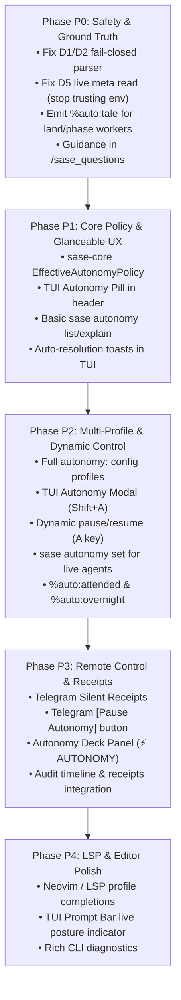

# `%auto` Directive & Autonomy Policy UX Design: A Unified, Reliable, and Beautiful Experience Across TUI, CLI, and Telegram

> **Research query:** SASE is transitioning `%auto` from an opaque boolean switch into a
> typed, config-defined Autonomy Policy engine (as accepted in
> `auto_directive_autonomy_policy.md`). However, that policy research intentionally left
> the user experience largely unspecified. What does the best possible user experience
> look like across ACE (TUI), CLI, Telegram/mobile, and prompt authoring? How can we make
> this system intuitive, reliable, and beautiful?
>
> **Author:** `research.0l.gem` (Independent UX Design Report)  
> **Date:** 2026-10-08  
> **Baseline:** `auto_directive_autonomy_policy.md` (accepted policy core at sase `142636c528`)

---

## 1. Executive Summary & Bottom Line

The policy redesign in `auto_directive_autonomy_policy.md` established that **`%auto` must
not be a freeform permission DSL typed into prompts**, but a **selector for
config-defined, Rust-owned autonomy profiles** (`autonomy:`).

While that backend architecture solves silent-authority loops (e.g. 170 runaway nested
epics) and parser fail-open bugs, **the feature will fail in the hands of users if the UX
treats autonomy as an invisible background engine.**

Today's user experience is broken in three fundamental ways:
1. **Total Invisibility:** Today's `%auto` executes 70% of prompt turns in complete
   silence. When a gate auto-resolves, no notification is published, no TUI card updates,
   and Telegram stays silent. Users either babysit agents out of distrust or return hours
   later baffled by what the agent decided.
2. **Blunt Force Controls:** The only live control in ACE today is the `A` key, which
   attempts a boolean toggle (and fails to stick for live bare-`%auto` runs due to defect
   D5). Users cannot switch from "unattended" to "attended" mid-flight when they sit down
   at their desk.
3. **Semantic Confusion:** The single lightning glyph `⚡` conflates four radically
   different user postures: pair programming, routine background coding, unattended
   overnight runs, and constrained epic workers.

### The Core UX Principles

To make autonomy intuitive, reliable, and beautiful, this design establishes five core
principles:

1. **Posture Over Flags:** Users do not think in gate matrix tables; they think in
   operational postures (**Attended**, **Standard**, **Overnight**, **Supervised**). The
   UX elevates named profiles as primary conceptual objects across every surface.
2. **Glanceable Posture, Observable Decisions:** At any distance, a user must instantly
   know what an agent is allowed to do without their permission (`⚡ std`, `⚡ att`,
   `⚡ night`). When an autonomous decision is made, it leaves a clear, inspectable
   receipt, not a hole in history.
3. **"Take the Wheel" Everywhere:** When a user walks away, they trust the agent. When
   they look back at their screen or check their phone, they can pause or adjust autonomy
   in one keystroke or one tap (`A` in TUI, `sase autonomy set` in CLI, `[ ⏸️ Pause ]` in
   Telegram).
4. **Symmetric Vocabulary Across Surfaces:** The profile names, gate kinds, decision
   verbs (`approve`, `archive`, `ask`, `deny`, `decide`, `recommended`), and visual
   badges are identical in ACE, CLI, Telegram, Neovim, and Android.
5. **Fail-Closed, Zero Surprises:** Any invalid profile, illegal override, or policy
   drift is flagged before launch in the editor/CLI, not discovered after an agent has
   wasted tokens.

---

## 2. The User Mental Model: Operational Postures

Users use `%auto` for fundamentally different reasons depending on their physical presence
and the risk tolerance of the task. Instead of presenting an abstract matrix of gates, the
UX centers around four **Operational Postures**:

| Posture | Profile | Intent | Tale Plan | Epic Plan | Questions | On Ask | TUI Glyph / Badge |
| :--- | :--- | :--- | :--- | :--- | :--- | :--- | :--- |
| **Attended** | `attended` | "I am at my desk pairing with the agent. Let code flow, but ask me questions before making design assumptions." | `approve_archive` | `ask` | `ask` | `park` | `⚡ att` (Gold `#E5C07B`) |
| **Standard** | `standard` | "Routine autonomous work. Approve tale plans, answer questions if recommended, but stop at major epics." | `approve_archive` | `approve` | `recommended` | `park` | `⚡ std` (Cyan `#5FD7FF`) |
| **Overnight** | `overnight` | "I am walking away. Do not park on minor questions or launch runaway epics; keep moving or cleanly report." | `approve_archive` | `ask` (or `deny`) | `decide` | `deny` (or `park`) | `⚡ ngt` (Purple `#AF87FF`) |
| **Supervised** | `manual` | "High-stakes or learning run. A human must review and approve every checkpoint." | `ask` | `ask` | `ask` | `park` | *(none / dim)* |
| **Worker** | `epic_worker`| "Epic phase/land worker. Hard-bounded to current epic scope; nested epics forbidden." | `approve_archive` | `ask` | `recommended` | `park` | `⚡ wrk` (Blue `#61AFEF`) |

### How Users Express Intent

The UX supports three natural interaction tiers:
1. **Zero Effort (Daily Default):** Bare `%auto` selects `standard`. Bare absence selects
   `manual`.
2. **Named Posture (Clear Intent):** `%a:attended` or `%auto:overnight`.
3. **Precision Override (Narrow Tuning):** `%auto(overnight, epic=deny)` or
   `%auto(q=ask)`.

---

## 3. Terminal User Interface (ACE / TUI) Design

The TUI is the primary command center for active SASE engineering. Autonomy UX in ACE
must balance high density with instant readability.

### 3.1 Agent List & Tree Rendering (`_agent_list_render_agent_prefix.py`)

Currently, autonomous rows display a blunt `⚡`, `⚡T`, or `⚡E` in cyan. In the new design,
this prefix is modernized to convey posture without increasing horizontal footprint:

```text
Row Prefix Layout:
[Tree Indent] [Status Glyph] [Autonomy Badge] [Agent Name] ...
```

#### Visual Badge Specifications

- **Standard (`standard`):** `⚡` (cyan `#5FD7FF`). When horizontal space allows (compact
  tree or detail views), rendered as `⚡std`.
- **Attended (`attended`):** `⚡?` or `⚡att` in gold (`#E5C07B`). The `?` immediately
  communicates: *this agent will stop to ask you questions!*
- **Overnight (`overnight`):** `⚡🌙` or `⚡ngt` in lavender/purple (`#AF87FF`). Instantly
  tells the user: *this agent is running unattended.*
- **Phase/Land Worker (`epic_worker`):** `⚡w` in muted blue (`#61AFEF`). Confirms that
  the nested-epic clamp is active.
- **Custom Inline Override:** `⚡*` in bright cyan (`#00FFFF`). Indicates the base
  profile has custom overrides (e.g. `q=ask`).
- **Paused / Manual:** Dim bullet `•` or omitted glyph.

#### Responsive Density Handling
- In narrow columns (<100 cols): Single-character badge (`⚡`, `⚡?`, `⚡🌙`, `⚡w`).
- In wide columns (≥120 cols): 3-character mnemonic pill (`⚡std`, `⚡att`, `⚡ngt`,
  `⚡wrk`).

---

### 3.2 The Interactive Autonomy Pill (`_identity_header_compact.py`)

Row 1 of the Agent Detail header displays identity and runtime state. The crude `⚡ PLAN`
token is replaced by an interactive **Autonomy Pill**:

```text
┌────────────────────────────────────────────────────────────────────────────────────────┐
│ sase-142 · refactor_auth · ⚡ overnight [plan:archive · epic:deny · q:decide] · 3 turns │
└────────────────────────────────────────────────────────────────────────────────────────┘
```

- **Pill Structure:**
  - Prefix icon: `⚡` (colored by profile).
  - Profile name: `bold` profile token (e.g. `overnight`).
  - Compact gate digest in brackets: `[plan:archive · epic:deny · q:decide]`.
- **Interactivity:**
  - Clicking the pill or pressing `Shift+A` (or leader `comma a`) opens the
    **Autonomy Profile Modal**.
  - Tapping the pill in active status updates immediately.

---

### 3.3 Mid-Flight Autonomy Control: The `A` Key & Autonomy Modal

The status quo `A` key suffers from ambiguity: does it toggle bare auto, open an option
menu, or approve a plan?

We preserve fast muscle memory while unlocking full control:

1. **Quick Tap `A` (Toggle Pause/Resume):**
   - If an agent is running under an autonomy profile (`standard`, `overnight`, etc.):
     Pressing `A` toggles **Pause Autonomy** (`manual`).
     - TUI toast: `⏸️ Autonomy paused (was: overnight). Next gate will wait for human review.`
     - Header pill flips to: `⏸ paused (overnight)`.
   - Pressing `A` again restores the previous profile seamlessly:
     - TUI toast: `⚡ Autonomy resumed (overnight).`
2. **Modal Invocation (`Shift+A` or `g a` or Leader `, a`):**
   - Opens the dedicated **Autonomy Profile Modal** (`AutonomyModal`).

```text
╭─────────────────────────────── Autonomy Profile: sase-142 ────────────────────────────────╮
│                                                                                           │
│  Select an operational posture for this agent session:                                    │
│                                                                                           │
│    [1] ⚡ standard    Approve & archive tales, launch epics, answer recommended questions  │
│  > [2] ⚡ attended    Approve plans, but always stop to ask human for questions           │
│    [3] ⚡ overnight   Unattended: approve tales, deny epics, decide questions autonomously │
│    [4]   manual      Pause all automation: human reviews every plan and question         │
│                                                                                           │
│  ───────────────────────────────────────────────────────────────────────────────────────  │
│  Effective Gate Rules for selected posture (attended):                                    │
│    • Tale Plans:      approve_archive  (auto-approve coder and commit to plans sidecar)   │
│    • Epic Plans:      ask              (wait for human approval in ACE/Telegram)          │
│    • Questions:       ask              (wait for human selection)                         │
│    • Launch Gates:    ask              (hard constraint)                                  │
│    • On Ask:          park             (keep agent waiting on human interaction)          │
│                                                                                           │
│  ───────────────────────────────────────────────────────────────────────────────────────  │
│  Quick Toggles:                                                                           │
│    [q] Toggle Questions (currently: ask)       [e] Toggle Epics (currently: ask)          │
│                                                                                           │
│  [Enter] Apply Posture    [Space] Pause/Resume    [Esc] Cancel                            │
╰───────────────────────────────────────────────────────────────────────────────────────────╯
```

#### Reliability & Persistence Wiring
- When the user confirms in the modal or taps `A`, ACE executes
  `_set_agent_autonomy_profile()`.
- Dispatches via `submit_agent_directive()` to write `agent_meta.autonomy` atomically.
- **Fixes D5:** The gate reader reads `agent_meta.autonomy` live on disk; the legacy
  `SASE_AGENT_AUTO_APPROVE` env var is ignored.
- In-memory agent state patches optimistically; reverts with an error toast if disk I/O
  fails.

---

### 3.4 The Autonomy Deck Panel (`⚡ AUTONOMY` Deck View)

Following the precedent of the `⊛ FINAL` deck (`sase/ace/tui/widgets/decks/final/`), we add
an **Autonomy Deck Panel** accessible via the deck cycle (`ctrl+n` / `ctrl+p` or `p a`).

The panel provides two rich cards:

#### Card 1: Active Posture & Provenance Card
Displays the authoritative resolution breakdown:
- **Active Profile:** `overnight`
- **Resolution Source:** `prompt` (with override `epic=deny`)
- **Layer Provenance:**
  - Builtin: `default_config.yml` (version 1)
  - User: `~/.sase/config.yml` (`autonomy.default: standard`)
  - Project: `.sase/config.yml` (tightened `launch: ask`)
  - Prompt: `%auto(overnight, epic=deny)`
- **Injected Context Status:**
  `Verified injected (4 rules rendered in agent prompt at launch)`.

#### Card 2: Autonomy Decision Ledger & Audit Timeline
A live, scrollable ledger of every gate encountered during the session:

```text
╭─ Autonomy Decision Ledger ────────────────────────────────────────────────────────────────╮
│ TIME      GATE KIND   DECISION          REASON / SOURCE                   RECEIPT HASH    │
│ 14:02:11  tale:plan   approve_archive   policy: overnight (gates.plan)    a9f20c1... [📄] │
│ 14:05:44  question    recommended       agent flagged option #1           e41b992... [?]  │
│                       ↳ "Use SQLite for metadata store"                                   │
│ 14:12:30  epic:plan   deny              policy: overnight (gates.epic)    0b84c31... [✗]  │
│                       ↳ Refused: nested epic not permitted in overnight mode              │
╰───────────────────────────────────────────────────────────────────────────────────────────╯
```
- Pressing `Enter` on any ledger row opens the underlying Gate Bundle / Receipt details.
- Pressing `y` copies the receipt SHA.

---

### 3.5 Real-Time Toasts & Quiet Inbox Notifications

When an agent auto-resolves a gate in the background:
- **TUI Toast:** A low-priority, non-stealing toast appears for 3.5 seconds:
  `⚡ Auto-approved Tale Plan for sase-142 (overnight)`
- **SASE Notification Drawer (`i` key):** Auto-resolutions land in the inbox under a
  dedicated, filterable category: `Receipts (Auto)`.
  - Marked read by default so they do not trigger the unread bell count (`!`).
  - Searchable and audit-traceable.

---

## 4. Command Line Interface (CLI) Design (`sase autonomy`)

Following `sase/memory/cli_rules.md`:
- Running bare `sase autonomy` delegates to `sase autonomy list` with the standard
  runtime notice.
- Subcommands and options are strictly sorted alphabetically.
- Every public long option has a short alias.
- Output is rendered using Rich tables with ANSI colors.

```text
usage: sase autonomy [-h] {check,explain,history,list,set,show} ...

Inspect, simulate, audit, and configure SASE agent autonomy policies.

Running `sase autonomy` defaults to `sase autonomy list`.

positional arguments:
  {check,explain,history,list,set,show}
                        Autonomy subcommands
    check (c)           Validate autonomy configuration across user and project layers
    explain (e)         Explain the effective autonomy policy for a prompt, profile, or live agent
    history (h)         Show audit ledger of auto-resolved gates across agents
    list (l)            List all configured autonomy profiles (default)
    set (s)             Change the live autonomy profile or overrides for a running agent
    show                Show detailed definition and provenance for an autonomy profile

options:
  -h, --help            show this help message and exit
```

---

### 4.1 `sase autonomy list` (Default)

Lists available profiles across all layers:

```bash
$ sase autonomy
No subcommand provided for 'sase autonomy'; delegating to 'sase autonomy list'.
╭─ Autonomy Profiles · sase ─────────────────────────────────────────────────────────────╮
│   NAME         LAYER    EXTENDS   TALE PLAN        EPIC PLAN   QUESTIONS   ON ASK      │
│ ★ standard     builtin  -         approve_archive  approve     recommended park        │
│   attended     builtin  standard  approve_archive  ask         ask         park        │
│   overnight    builtin  standard  approve_archive  ask         decide      deny        │
│   epic_worker  builtin  standard  approve_archive  ask         recommended park        │
│   cautious     user     -         ask              ask         ask         park        │
╰────────────────────────────────────────────────────────────────────────────────────────╯
★ Default profile selected by bare %auto. Run 'sase autonomy show <name>' for details.
```

---

### 4.2 `sase autonomy explain`

Provides complete predictive clarity. It can simulate a prompt string, inspect a profile,
or audit a live running agent:

#### Example A: Explaining a Prompt Literal
```bash
$ sase autonomy explain "%auto(overnight, epic=deny, q=ask)"
╭─ Autonomy Simulation: %auto(overnight, epic=deny, q=ask) ──────────────────────────────╮
│ Base Profile: overnight (builtin)                                                      │
│ Overrides:    epic=deny, question=ask                                                  │
│                                                                                        │
│ GATE KIND     DECISION          EFFECT / BEHAVIOR                                      │
│ plan (tale)   approve_archive   Auto-approves coder and commits plan to sidecar        │
│ epic_plan     deny              Rejects epic creation; instructs agent to split tales  │
│ question      ask               Parks agent and waits for human selection in UI/TG     │
│ launch        ask               Requires explicit human approval                       │
│ sudo / custom deny              Refuses custom gates with explanation                  │
│ on_ask        deny              If an unhandled gate triggers, terminate cleanly       │
│                                                                                        │
│ Rendered Agent Awareness Block (injected into system prompt):                          │
│   ┌──────────────────────────────────────────────────────────────────────────────┐     │
│   │ SASE autonomy profile: overnight (overrides: epic=deny, q=ask)               │     │
│   │ - Tale plans: approved and archived automatically. Coder will run.           │     │
│   │ - Epic plans: DENIED. Split tasks into discrete tales.                       │     │
│   │ - Questions: will wait for human input.                                      │     │
│   │ - Launch / Sudo / Custom gates: denied. Skip and report.                     │     │
│   └──────────────────────────────────────────────────────────────────────────────┘     │
╰────────────────────────────────────────────────────────────────────────────────────────╯
```

#### Example B: Explaining a Live Running Agent
```bash
$ sase autonomy explain sase-142
╭─ Live Autonomy Policy: sase-142 ───────────────────────────────────────────────────────╮
│ Agent:      sase-142 (active, turn 2)                                                  │
│ Profile:    overnight                                                                  │
│ Set via:    prompt (%auto:overnight)                                                   │
│ Status:     Active (1 gate auto-resolved, 0 denied)                                    │
│ Digest:     sha256:4f82a1...                                                           │
│                                                                                        │
│ Live Decisions:                                                                        │
│   • plan:       approve_archive                                                        │
│   • epic:       ask                                                                    │
│   • question:   decide                                                                 │
│   • on_ask:     deny                                                                   │
╰────────────────────────────────────────────────────────────────────────────────────────╯
```

---

### 4.3 `sase autonomy set` (Live Mid-Flight Control)

Enables operators to dynamically adjust an agent's autonomy from another terminal:

```bash
# Switch running agent to attended mode
$ sase autonomy set sase-142 attended
✓ Updated sase-142 autonomy to 'attended' (plan: approve_archive, epic: ask, q: ask)

# Pause autonomy completely (take the wheel)
$ sase autonomy set sase-142 manual
✓ Paused autonomy for sase-142 (all gates will require human approval)

# Apply specific override
$ sase autonomy set sase-142 --question ask
✓ Updated sase-142: override question=ask applied to profile 'overnight'
```

---

### 4.4 `sase run` Launch Integration

Launch flags mirror directive syntax:

```bash
# Launch with standard autonomy
sase run -a "Refactor database migrations"

# Launch with overnight posture
sase run --auto overnight "Run comprehensive benchmark suite"

# Launch with posture and overrides
sase run --auto "overnight, q=ask" "Analyze log retention"

# Dry-run simulate autonomy before launch
sase run --auto overnight --autonomy-explain "Task description"
```

---

## 5. Telegram & Mobile Experience Design

Telegram is the user's remote lifeline when away from the keyboard. The status quo of
sending **nothing** when `%auto` is on leaves users anxious and blind. Conversely, buzzing
the phone on every minor auto-step creates alert fatigue.

We resolve this through **Silent Receipts** and the **"Take the Wheel"** action.

---

### 5.1 The Autonomous Decision Receipt (Quiet Feed)

When an agent auto-resolves a gate, Telegram receives a structured, elegant receipt:

```text
⚡ Auto-Approved Plan · sase-142
━━━━━━━━━━━━━━━━━━━━━━━━━━━━━━━━━
Project: sase-core   Branch: auth-fix
Tale: Refactor JWT Session Validator
Action: approve + archive (coder launched)
Policy: overnight (plan=approve_archive)

Summary:
- Replace HMAC-SHA256 with Ed25519 token signatures
- Add session rotation test harness
━━━━━━━━━━━━━━━━━━━━━━━━━━━━━━━━━
[ ⏸️ Pause Autonomy ]    [ 📄 Read Plan (PDF) ]
```

#### Key Technical Attributes
1. **Silent Delivery (`disable_notification=True`):**
   - The message arrives quietly in the Telegram chat without audible ring or vibration.
   - The phone does not buzz in the user's pocket while sleeping.
2. **Visual Distinction:**
   - Header begins with `⚡ Auto-Approved Plan` or `⚡ Auto-Answered Question`.
   - Distinct from interactive gate cards which begin with `🚨 Gate Approval Required`.
3. **The `[ ⏸️ Pause Autonomy ]` Button:**
   - Powered by Telegram inline callback: `cb:auto_pause:<agent_id>`.
   - When tapped by the user on mobile:
     1. Telegram bot immediately invokes `submit_agent_directive(meta_set={"autonomy": {"profile": "manual"}})` on the host.
     2. Edits the Telegram message in-place:
        ```text
        ⏸️ Autonomy Paused · sase-142
        ━━━━━━━━━━━━━━━━━━━━━━━━━━━━━━━━━
        You paused autonomy from Telegram.
        Future gates will notify and wait for your manual approval.
        [ ▶️ Resume (overnight) ]   [ 📄 Read Plan ]
        ```
     3. An alert toast is sent back to Telegram: `Autonomy paused for sase-142`.

---

### 5.2 Auto-Answered Questions in Telegram

When an agent auto-answers a question (via `recommended` or `decide`), Telegram receives a
compact receipt showing the choice and stated assumptions:

```text
⚡ Question Auto-Decided · sase-142
━━━━━━━━━━━━━━━━━━━━━━━━━━━━━━━━━
Question: Which storage backend should be used for cache?
Chosen:   Option 1: Redis (Recommended)
Policy:   overnight [q=decide]

Agent Assumption:
"Redis is configured in default_config.yml and has active healthcheck."
━━━━━━━━━━━━━━━━━━━━━━━━━━━━━━━━━
[ ⏸️ Pause Autonomy ]
```

If the agent was running in `attended` mode (`q=ask`), Telegram instead sends the standard
interactive question keyboard with push notification enabled!

---

### 5.3 Telegram Bot Commands

Users can query and manage autonomy from anywhere via chat:

- `/auto`: Lists active agents and their autonomy postures.
- `/auto <agent>`: Shows effective policy and recent auto-decisions.
- `/auto <agent> pause`: Pauses autonomy immediately.
- `/auto <agent> resume`: Resumes previous profile.
- `/auto <agent> <profile>`: Switches profile (e.g. `/auto sase-142 attended`).

---

## 6. Prompt Authoring, Neovim/LSP, and Agent Awareness

### 6.1 Directive Syntax & Grammar

The directive grammar is clean, predictable, and shares parsing conventions with `%queue`
and `%hold`:

```text
%auto                          # Selects autonomy.default (standard)
%a                             # Short alias
%auto:attended                 # Colon syntax selects profile
%a:overnight                   # Short alias with profile
%auto(q=ask)                   # Default profile with inline override
%auto(overnight, epic=deny)    # Profile + positional/keyword override
%auto(attended, q=ask, e=deny) # Canonical aliases (q=question, e=epic, p=plan)
```

#### Fail-Closed Launch Validation
- Unknown profile name (e.g. `%auto:nighttime`) → Launch error:
  `Unknown autonomy profile 'nighttime'. Valid profiles: standard, attended, overnight, epic_worker.`
- Illegal privilege escalation (e.g. `%auto(launch=allow)`) → Launch error:
  `Privileged gate 'launch' cannot be auto-allowed via prompt. Must be configured in config profile.`
- Malformed syntax (e.g. `%auto(foo=bar)`) → Launch error:
  `Unknown autonomy override key 'foo'. Valid keys: plan, epic, question, on_ask.`

---

### 6.2 Editor Integration (Neovim & LSP)

Through the `sase-nvim` plugin and macro LSP:
1. **Autocomplete:**
   - Typing `%auto:` triggers a popup menu listing all configured profiles with their
     descriptions:
     ```text
     standard     Default: approve tales, launch epics, answer recommended
     attended     Pairing: approve plans, ask all questions
     overnight    Unattended: approve tales, deny epics, decide questions
     epic_worker  Scoped: approve tales, deny nested epics
     ```
   - Typing `%auto(` triggers parameter completions: `q=`, `question=`, `epic=`, `plan=`.
2. **Hover Documentation:**
   - Hovering over `%auto:overnight` displays the full gate matrix and on_ask behavior in a
     floating window.
3. **LSP Diagnostics:**
   - Illegal syntax or unknown profiles are underlined with red squiggly lines before the
     prompt is even submitted.

---

### 6.3 Agent Awareness Context Injection

Per requirement R8 of the policy baseline, the agent must be told its exact autonomy
posture. Rust core compiles this into an authoritative, 5-line instruction block injected
into the agent's turn prompt:

```markdown
<!-- SASE AUTONOMY POLICY: overnight -->
SASE autonomy active: profile 'overnight'. No human will monitor this turn.
- Tale plans: automatically approved and archived. Coder will execute immediately.
- Epic plans: DENIED. You must split work into discrete tales; do not create epic plans.
- Questions: not delivered to a human. Mark your best choice with `recommended: true`;
  record your reasoning in your final reply.
- Launch / Sudo / Custom gates: DENIED without prompt. Do not attempt.
- Pre-authorized: rebasing and pushing to your workspace branch.
```

#### Why This Is Transformative for Agent UX
- Agents stop asking rhetorical questions that stall execution.
- Agents stop proposing giant epics when the host will refuse to run them.
- Agents understand what is pre-authorized, eliminating hesitation.

---

## 7. Reliability, Concurrency & State Management

A beautiful UX that glitches under concurrency creates distrust. The autonomy UX is
engineered with four strict reliability contracts:

### 7.1 The Single Source of Truth
- `agent_meta.autonomy` (persisted in the agent's workspace directory) is the **sole
  authority** for effective autonomy policy.
- The environment variable snapshot `SASE_AGENT_AUTO_APPROVE` is deprecated and treated
  only as a backward-compatibility input for legacy child runners behind a `sunset` flag.
- Gate handlers read `agent_meta.autonomy` live on disk at the exact moment a gate is
  evaluated.

### 7.2 Race-Free Mid-Flight Toggles
Consider the race condition: an agent triggers a plan gate at 14:00:00.100, while the user
presses `A` in ACE or taps `[ Pause ]` in Telegram at 14:00:00.105.

1. **Atomic Directive Commits:** Modifying autonomy writes to a temporary file and uses
   atomic `rename()` over `agent_meta.json`.
2. **Generation Tokens:** Every autonomy mutation bumps an internal `policy_generation`
   counter.
3. **Gate Resolution Verification:** Before executing an auto-resolution, the gate adapter
   verifies that the policy generation has not changed since gate inception. If it has,
   the gate re-evaluates under the newly committed policy. If the new policy is `manual`,
   the auto-resolution aborts and the gate cleanly converts into an interactive gate.

### 7.3 Auditable Verdict Receipts
Every gate resolution (whether human or automatic) generates an immutable verdict receipt
stored in `.sase/receipts/`:
- `source`: `"auto_resolution"`
- `policy_profile`: `"overnight"`
- `policy_digest`: SHA256 of the frozen policy record
- `matched_rule`: `"gates.plan=approve_archive"`
- `selected_options`: `["approve", "commit"]`
- `timestamp`: ISO-8601 UTC

This ensures that months later, an audit can definitively prove *which profile approved a
commit and why*.

---

## 8. Visual Design System Specifications

### 8.1 Palette & Typography

| Semantic Token | Hex Code | Terminal ANSI | Usage |
| :--- | :--- | :--- | :--- |
| `autonomy.standard` | `#5FD7FF` | `bold cyan` | Default automation, standard profile, active lightning |
| `autonomy.attended` | `#E5C07B` | `bold yellow` | Attended posture, question-asking mode, caution |
| `autonomy.overnight` | `#AF87FF` | `bold magenta` | Overnight posture, dark-mode purple, quiet receipts |
| `autonomy.worker` | `#61AFEF` | `bold blue` | Epic phase and land workers |
| `autonomy.custom` | `#00FFFF` | `bright cyan` | Custom inline overrides applied |
| `autonomy.paused` | `#6B7280` | `dim grey` | Paused autonomy, manual oversight |
| `autonomy.denied` | `#E06C75` | `bold red` | Denied gates, refused capabilities |

### 8.2 Standard Glyphs

- `⚡` (`U+26A1`): Universal SASE Autonomy indicator.
- `⚡?`: Attended autonomy (questions enabled).
- `⚡🌙`: Overnight / unattended autonomy.
- `⏸️` (`U+23F8`): Paused autonomy / human in the loop.
- `★` (`U+2605`): Default profile indicator in CLI and TUI lists.
- `●` (`U+25CF`): Changed / overridden policy value (gold).
- `📄` (`U+1F4C4`): Plan artifact receipt pointer.

---

## 9. Phased Rollout Plan for UX

The UX rollout maps directly to the policy engine phases defined in
`auto_directive_autonomy_policy.md`:



| Phase | Milestone | UX Deliverables | Size |
| :--- | :--- | :--- | :--- |
| **P0** | **Truth & Safety** | Clean error messages on malformed `%auto(...)`; stop trusting `SASE_AGENT_AUTO_APPROVE` env var; update `/sase_questions` docs. | Small |
| **P1** | **Glanceable UI** | TUI header Autonomy Pill (`⚡ standard`); basic `sase autonomy list` and `sase autonomy explain`; subtle TUI auto-resolution toasts. | Medium |
| **P2** | **Dynamic Control** | TUI Autonomy Modal (`Shift+A`); fast pause/resume (`A`); `sase autonomy set`; Neovim `%auto:<profile>` completion; agent context injection. | Large |
| **P3** | **Remote Control** | Telegram Silent Decision Receipts; Telegram `[ ⏸️ Pause Autonomy ]` interactive button; `⚡ AUTONOMY` deck panel. | Medium |
| **P4** | **Polish & LSP** | TUI Prompt Bar posture preview; full `sase autonomy history` ledger; advanced LSP diagnostics and hover info. | Medium |

---

## 10. Conclusion & Recommended Verdict

Building a "more powerful `%auto` directive" by packing more arbitrary keyword syntax into
the prompt would repeat the very mistakes that created today's silent-authority defects.

The winning design is **Symmetric Autonomy UX**:
- **In Config:** Named, typed, layered profiles representing true operational postures
  (`standard`, `attended`, `overnight`).
- **In Prompts:** Clean, terse selection (`%auto:overnight`, `%a:attended`) with narrow,
  fail-closed overrides.
- **In ACE (TUI):** A glanceable posture pill, a frictionless `A` pause/resume toggle, a
  rich `Shift+A` modal, and an auditable ledger deck.
- **In CLI:** A first-class `sase autonomy` subcommand suite adhering to all CLI rules.
- **In Telegram:** Silent, non-intrusive decision receipts with an instant "Take the
  Wheel" pause button.

This transforms autonomy from an opaque, anxiety-inducing gamble into a predictable,
controllable, and beautiful pairing partner.
