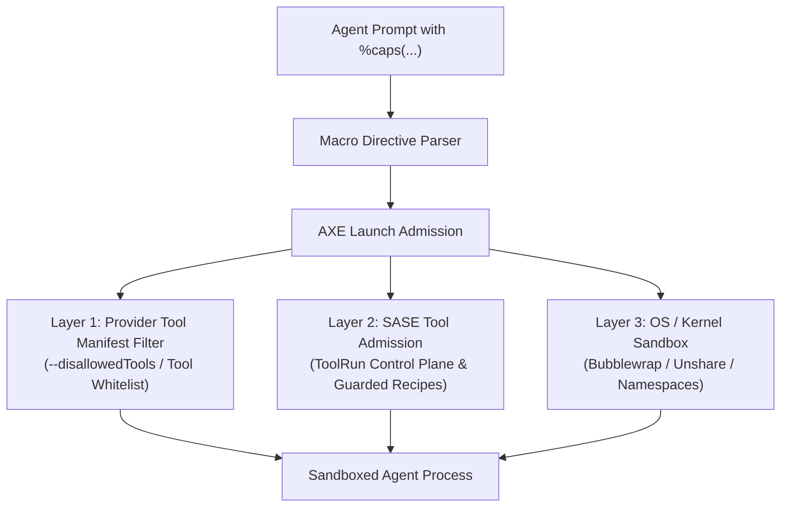
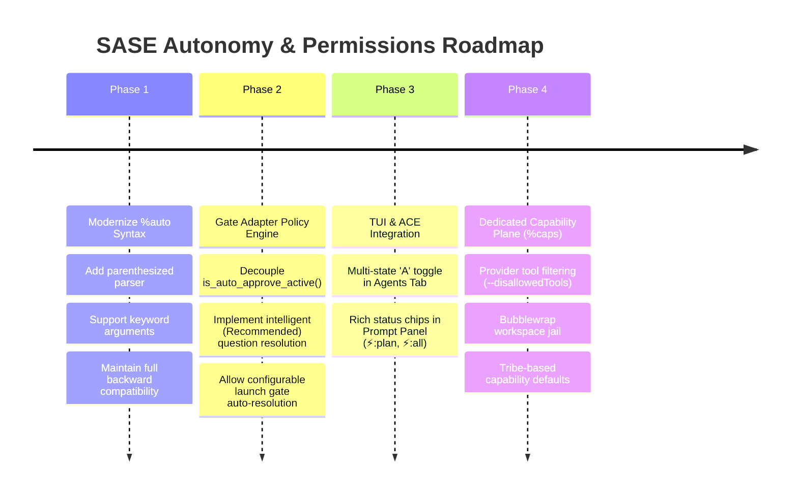

# Architectural Research: Evolving the `%auto` Directive and Designing Real Agent Permissions in SASE

**Author:** Researcher gem (`research.41.gem`)  
**Date:** October 2026  
**Target Repository:** `sase` / `sase-core`  
**Artifact ID:** `research:202610/auto_directive_and_agent_permissions_architecture__gem.md`

---

## 1. Executive Summary

In Structured Agentic Software Engineering (SASE), the prompt directive `%auto` (and its short alias `%a`) serves as the primary mechanism for bypassing human checkpoints during agent execution. Today, developers frequently describe `%auto` as "the main way to tune permissions" for SASE agents. However, `%auto` is rigid, lacks fine-grained configurability, exhibits surprising side effects, and conflates two fundamentally distinct concepts: **Gate Autonomy** (deciding when human notification gates are automatically resolved) and **Security Permissions / Sandboxing** (mechanically restricting what tools, files, networks, and commands an agent can touch).

This report investigates the architecture of `%auto` and evaluates the proposal to "make `%auto` much more powerful to tune permissions."

### Key Findings & High-Level Critique

1. **A Fundamental Category Error:** Treating `%auto` as a permissions system is an architectural misnomer. SASE agents currently run with provider-level CLI permission prompts completely bypassed (`--dangerously-skip-permissions`, `--dangerously-bypass-approvals-and-sandbox`, `--yolo`, `--always-approve`). Because provider prompts are suppressed to honor SASE's single-turn execution contract, **Notification Gates** (`plan`, `question`, `launch`, `sudo`, `hitl`) are the *only* checkpoints that halt an agent for human authorization. Consequently, developers perceive `%auto` as a "permission" switch, when it is actually an **autonomy and notification-gating switch**.
2. **Current Ergonomic and Semantic Flaws in `%auto`:**
   - **The Blind Question Trap:** Bare `%auto` auto-approves plan gates *and* silently auto-resolves interactive questions by naively choosing option index `0` via `automatic_question_response()`. Developers wanting plan auto-approval often inadvertently silence crucial architectural design questions.
   - **Leaky Argument State:** In `src/sase/main/plan_approve_handler.py`, `is_auto_approve_active()` treats any non-empty `auto_approve_argument` (including `%auto:epic`) as active global auto-approval, causing question gates to auto-resolve even when the author only specified epic plan handling.
   - **Inflexible All-or-Nothing Model:** Adapters for `launch` (spawning child agents) and `sudo` unconditionally forbid automatic resolution (`auto_policy="forbidden"`), leaving no escape hatch for trusted multi-agent swarms or scheduled pipelines.
   - **Primitive Syntax:** While modern directives like `%queue(capacity=..., priority=...)` and `%hold(hood=..., ttl=...)` have evolved into structured, parenthesized forms, `%auto` remains trapped in colon-delimited string parsing (`%auto:epic`).
3. **Overloading `%auto` to Enforce Hard Permissions is Inadvisable:**
   Attempting to turn `%auto` into a kitchen-sink permissions directive (e.g. `%auto(write=false, net=deny)`) would create an unmaintainable syntactic hybrid, muddying the clean separation between human workflow gating and kernel/tool-level sandboxing.

### Recommended Solution

We recommend a **two-pronged, decoupled architecture**:

1. **Phase 1: Modernize `%auto` into a Structured Gate Autonomy Directive.**
   - Retain 100% backward compatibility for `%auto`, `%a`, `%auto:plan`, `%auto:tale`, and `%auto:epic`.
   - Upgrade `%auto` to support parenthesized, keyword-based configuration:
     ```text
     %auto(plan=approve, question=ask, launch=deny)
     ```
   - Provide intuitive presets (`%auto(plans)`, `%auto(questions)`, `%auto(all)`, `%auto(none)`).
   - Change the default behavior of bare `%auto` so that plans are auto-approved, but question gates remain interactive unless explicitly requested (`question=first` or `question=recommended`).
   - Allow trusted workflows to auto-approve `launch` gates for specific tribes.
2. **Phase 2: Introduce an Orthogonal Capability & Sandboxing Plane (`%caps` / `%sandbox`).**
   - Address true permissions (read-only filesystem, network egress restrictions, bash command filtering) via a dedicated capability system that operates at the provider harness and OS isolation boundaries (`bwrap`, containerization, provider `--disallowedTools`, and SASE `ToolRun` admission guards).

---

## 2. Status Quo: The Anatomy of `%auto` and "Permissions" in SASE

To evaluate why `%auto` is viewed as a permission tuning mechanism, we must trace how SASE executes agents, how directives are processed, and how human interaction is gated.

### 2.1 How `%auto` Works Today

The `%auto` directive is parsed during prompt preprocessing in `src/sase/macro/_directive_extract.py` and `src/sase/macro/_directive_values.py`:

```python
def resolve_auto_mode(expanded_args: dict[str, str]) -> str | None:
    if "auto" not in expanded_args:
        return None
    raw_auto_mode = expanded_args["auto"] or "plan"
    if raw_auto_mode == "true":
        raw_auto_mode = "plan"
    return raw_auto_mode

def resolve_auto_argument(expanded_args: dict[str, str]) -> tuple[bool, str | None]:
    if "auto" not in expanded_args:
        return False, None
    raw = expanded_args["auto"]
    if raw in {"", "true"}:
        return True, None
    return True, raw
```

This populates `PromptDirectives`:
- `auto_enabled`: Boolean flag indicating presence.
- `auto_mode`: String identifier (`"plan"`, `"tale"`, `"epic"`, or raw argument).
- `auto_argument`: Raw string passed after the colon (`%auto:<arg>`).

When AXE launches an agent (`src/sase/axe/run_agent_directives_extract.py`), this metadata translates into agent runtime state:
- If `auto_mode == "plan"`: `AgentInfo.approve = True` and `agent_meta["approve"] = True`.
- If `auto_mode in {"epic", "tale"}`: `AgentInfo.plan = True` and `agent_meta["auto_approve_plan_action"] = auto_mode`.
- If `auto_argument` is present: `agent_meta["auto_approve_argument"] = auto_argument`.

### 2.2 Gate Interactions Under `%auto`

SASE is built on the invariant that **A Gate Never Blocks An Agent** (`decisions:gates-never-block`) and **Agents Are Single-Turn** (`decisions:single-turn-agents`). When an agent needs external input or approval, it does not sleep or block; it creates a **Notification Gate** and terminates its turn.

`%auto` modifies this behavior across gate adapters (`src/sase/notification_gates/adapters.py`):

| Gate Kind | `auto_policy` | Current Accepted Arguments | Behavior Under `%auto` |
| :--- | :--- | :--- | :--- |
| **`plan`** | `approval` | `None`, `""`, `"plan"`, `"tale"` | Bypasses human review; immediately approves the plan and dispatches the coder agent (or commits to SDD tale). |
| **`epic_plan`** | `approval` | `None`, `""`, `"epic"`, `"epic_plan"` | Immediately approves and commits the epic SDD plan and dispatches the epic runner. |
| **`question`** | `first` | `None`, `""`, `"first"` | Short-circuits in-process; executes `automatic_question_response()` which selects `options[0]` for every question and continues execution without pausing. |
| **`launch`** | `forbidden` | None | Rejects automatic resolution; requires explicit human review (`GateError: auto_not_supported`). |
| **`sudo`** | `forbidden` | None | Rejects automatic resolution; requires explicit terminal confirmation. |
| **`hitl`** | `forbidden` | None | Rejects automatic resolution. |
| **`task_triage`** | `forbidden` | None | Rejects automatic resolution. |

### 2.3 The Reality of "Permissions" in SASE

Why did the user assert that:
> *"The `%auto` directive is the main way that we are able to tune permissions (the ones that are used in practice at least since real sase agents don't have hard permissions yet) for a sase agent..."*

The answer lies in the provider harness implementations:

1. **Provider Approval Prompts are Uniformly Bypassed:**
   In `src/sase/llm_provider/claude.py`, `agy.py`, `codex.py`, `grok.py`, `muse_provider.py`, and `qwen.py`, SASE invokes external agent CLIs with aggressive bypass arguments:
   - Claude: `--dangerously-skip-permissions`
   - Gemini / AGY: `--dangerously-skip-permissions`
   - Codex: `--dangerously-bypass-approvals-and-sandbox`
   - Grok: `--permission-mode bypassPermissions`
   - Muse / Qwen: `--yolo`
   
   If SASE did not pass these flags, the underlying CLI would pause and prompt on stdin: *"Allow command `git status`? [y/n]"*. Because SASE agents run non-interactively in headless tmux sessions, stdin prompts would deadlock the agent.
2. **Notification Gates are the Sole Human Checkpoint:**
   With CLI-level tool prompts bypassed, the **only** points where a human is consulted are Notification Gates.
   - If an agent generates a plan via `/sase_plan`, it creates a `plan` gate.
   - If an agent asks clarifying questions via `ask_question`, it creates a `question` gate.
3. **The Practical Experience:**
   - Without `%auto`: The agent is forced to stop at plans and questions, requiring the user to press `A` or approve in the TUI/mobile before code is modified.
   - With `%auto`: The agent runs autonomously from prompt to final declaration without pausing.

Thus, to a developer using SASE daily, `%auto` *feels* like a permission grant: "without `%auto`, the agent has restricted permission (must ask before acting); with `%auto`, the agent has full permission (acts autonomously)."

However, this is **interaction gating, not security sandboxing**.

---

## 3. Critical Critique of the Plan

The user's prompt suggests:
> *"I would like to fix this and make this directive much more powerful. Can you do some research with the goal of helping me decide the best way to implement this? Also, critique this plan in general. Is this a good idea? Would you take a different approach?"*

Here is our critical evaluation.

### 3.1 Critique 1: The Category Error (Autonomy vs. Authority)

The proposal to expand `%auto` into a comprehensive permissions tuning tool commits a classic systems architecture category error: **conflating Autonomy with Authority**.

- **Autonomy (When to Ask):** Governs whether the agent pauses to consult a human operator when faced with ambiguity, planning milestones, or decision branches.
- **Authority / Capabilities (What is Permitted):** Governs what tools, APIs, files, network sockets, and OS system calls the agent is permitted to execute, regardless of whether a human is watching.

#### Why Conflating Them Breaks the System
Consider what happens if we overload `%auto` to govern both concepts:
```text
%auto(plan, write_files=false, allow_network=true, questions=first)
```
- If an agent runs with `%auto(write_files=false)`, what does `%auto` mean here? The word "auto" implies *automation / auto-approval*, yet here it is specifying *restrictions / denial of capability*.
- What does bare `%auto` mean? If `%auto` is a permission directive, does bare `%auto` mean "grant root permissions to everything"? That would be catastrophic.
- If a user omits `%auto`, does that mean the agent has *no* permission to read files, or does it mean the agent simply pauses for plan approval?

**Verdict:** Forcing hard permissions into `%auto` perverts the clear English meaning of "auto" (short for *automatic resolution*), produces cognitive dissonance for users, and entangles two orthogonal dimensions of agent governance.

### 3.2 Critique 2: Concrete Defects in the Existing `%auto` Directive

Even within its proper domain of Gate Autonomy, the current `%auto` implementation suffers from several serious design flaws:

#### 1. The "Blind First-Choice" Question Trap
When bare `%auto` is specified, `src/sase/axe/run_agent_exec_questions.py` invokes:
```python
creation = create_question_gate_turn(
    ...,
    auto=is_auto_approve_active(),
    ...
)
```
When `auto=True`, `src/sase/user_question_actions.py:automatic_question_response()` automatically selects `options[0]` for every question asked by the agent:
```python
for question in questions:
    options = question.get("options", [])
    selected = [str(options[0]["label"])] if options else []
    answers.append({"question": question["question"], "selected": selected, ...})
```
This is dangerous. A user who specifies `%auto` almost always intends: *"Auto-approve the plan and get straight to coding."* They do **not** intend: *"If the agent asks whether to delete database table A or table B, blindly pick the first option and destroy production data."*

#### 2. The Leaky `is_auto_approve_active()` Implementation
In `src/sase/main/plan_approve_handler.py`:
```python
def is_auto_approve_active() -> bool:
    _argument, has_argument = _raw_auto_plan_argument()
    return bool(
        has_argument
        or os.environ.get("SASE_AGENT_AUTO_APPROVE")
        or _read_agent_meta().get("approve")
    )
```
Notice that `has_argument` is `True` whenever `auto_approve_argument` exists in `agent_meta.json`.
When a user launches an agent with `%auto:epic`:
- `directives.auto_argument` is `"epic"`.
- `agent_meta["auto_approve_argument"] = "epic"`.
- `_raw_auto_plan_argument()` returns `("epic", True)`.
- `is_auto_approve_active()` returns `True`!
- Consequently, `%auto:epic` triggers question auto-resolution, directly contradicting the documentation in `docs/macros.md:3204` (*"Unlike bare %auto, %auto:epic is plan-specific and does not auto-answer questions"*).

#### 3. Inflexible Gate Policies (`forbidden` Without Escape Hatches)
In `src/sase/notification_gates/adapters.py`, the `launch` gate (used when an agent proposes launching subagents or dispatching a swarm) has `auto_policy="forbidden"`.
In autonomous multi-agent pipelines (such as a triage agent that inspects an issue and launches a bugfix agent), the orchestrator cannot auto-approve the launch gate, even if the user trustingly launched the orchestrator with `%auto`. The gate adapter immediately throws `GateError("auto_not_supported")`.

#### 4. Outdated String-Colon Syntax
Every other modern directive in SASE has moved to structured parenthesized keywords:
- `%queue(capacity=2, priority=10, weight=0.5)`
- `%hold(hood=sase-s7, ttl=4h)`
- `%clan(core, tribe=quality, summary=...)`
- `%wait(dep, time=10m)`

In contrast, `%auto` is still limited to colon strings: `%auto:plan`, `%auto:tale`, `%auto:epic`. It cannot express combinations such as *"auto-approve plans, but prompt me for questions"*.

### 3.3 Critique 3: The Myth of "Soft Permissions"

The user prompt notes:
> *"...the ones that are used in practice at least since real sase agents don't have hard permissions yet..."*

It is important to be realistic about security in agentic engineering. A "permission" that relies solely on prompt instructions (e.g. telling an LLM *"You are not permitted to edit files outside src/"*) is fundamentally unreliable. LLMs suffer from prompt injection, context drift, hallucinations, and jailbreaks.

If SASE wants real permissions, it must enforce them **mechanically** at the execution boundary:
1. **OS Sandboxing:** Filesystem namespaces (`bubblewrap`, Docker, or macOS `sandbox-exec`) preventing writes outside the designated workspace.
2. **Provider Tool Disallowance:** Using native CLI flags like Claude's `--disallowedTools` or Antigravity's tool manifests to eliminate write tools entirely for read-only agents.
3. **Control Plane Interception:** Routing all commands through `sase tool run` with strict admission control.

Attempting to solve this problem by expanding `%auto` into a pseudo-permission prompt directive is security theater.

---

## 4. Adjustments to Requirements

Based on this critique, we propose adjusting the project requirements as follows:

| Initial Assumption / Requirement | Adjusted Requirement | Rationale |
| :--- | :--- | :--- |
| **Make `%auto` tune permissions.** | **Keep `%auto` focused on Gate Autonomy; create a separate capability architecture for hard permissions.** | Avoids category error; keeps directive syntax clean, intuitive, and semantically cohesive. |
| **`%auto` controls all-or-nothing gating.** | **Make `%auto` granular and gate-specific via parenthesized syntax.** | Enables developers to selectively automate plans while keeping questions interactive, or vice versa. |
| **Bare `%auto` auto-resolves questions to `options[0]`.** | **Bare `%auto` auto-approves plans by default, but leaves questions interactive unless explicitly requested.** | Eliminates the dangerous "blind first-choice" defect where agents silently make irreversible architectural decisions. |
| **Gates like `launch` are unconditionally forbidden.** | **Allow configurable auto-resolution for `launch` gates under explicit policy.** | Unblocks autonomous orchestrator and swarm workflows while keeping dangerous gates (like `sudo`) strictly forbidden. |

---

## 5. Recommended Solution: Modernizing the `%auto` Directive

We propose a complete redesign of the `%auto` directive that makes it expressive, granular, and intuitive, while maintaining backwards compatibility.

### 5.1 Directive Syntax Specification

#### 1. Backward-Compatible Forms
Existing workflows, scripts, and tests continue to work without modification:
- `%auto` / `%a`: Standard default auto-resolution (auto-approves plans; questions remain interactive by default).
- `%auto+`: Alias for standard default auto-resolution.
- `%auto:plan`: Explicitly auto-approves normal plans only.
- `%auto:tale`: Auto-approves and commits plans as SDD tales (`~/.sase/plans/<YYYYMM>/...`), then launches coder.
- `%auto:epic`: Auto-approves and commits plans as SDD epics, then launches epic runner.

#### 2. New Structured Form: `%auto(...)`
The parenthesized form supports granular keyword arguments mapped to specific notification gate kinds:

```text
%auto([target], [plan=<mode>], [question=<mode>], [launch=<mode>], [hitl=<mode>])
```

##### Supported Keyword Parameters

1. **`plan=` (or `p=`):**
   - `approve` (default when bare `%auto` is used): Auto-approves standard plans; launches coder agent.
   - `tale`: Auto-commits as SDD tale; launches coder agent.
   - `epic`: Auto-commits as SDD epic; launches epic runner.
   - `ask` / `manual`: Do not auto-approve plans; pause for human review.
   - `reject`: Auto-rejects plans (useful for testing or read-only exploratory agents).
2. **`question=` (or `q=`):**
   - `ask` (new safe default): Never auto-answer questions; always pause for human response.
   - `first`: Legacy behavior; automatically select `options[0]` for every question.
   - `recommended`: Automatically select the option labeled with `(Recommended)` if present; if no recommended option exists, pause for human response.
   - `deny` / `cancel`: Auto-cancel the question gate.
3. **`launch=` (or `l=`):**
   - `ask` (default): Always require human approval before child agents or swarms are admitted.
   - `approve`: Automatically approve child agent launch requests.
   - `tribe:<name>`: Automatically approve launch requests only if all target agents belong to the specified tribe (e.g. `launch=tribe:research`).
4. **`hitl=`:**
   - `ask` (default): Pause for human input on HITL checkpoints.
   - `accept`: Automatically accept HITL checkpoints where a default accept action is registered.
5. **`sudo=`:**
   - **Hardcoded Invariant:** `sudo` requests can **never** be auto-resolved via `%auto`. Specifying `sudo=approve` raises a `DirectiveError("sudo gates cannot be auto-resolved")`.

##### Convenient Shorthand Presets
To prevent verbosity in common scenarios, positional presets are supported:
- `%auto(all)`: Auto-approve plans AND auto-answer questions (using `recommended` or `first`).
- `%auto(plans)` or `%auto(plan)`: Auto-approve plans only; questions remain interactive.
- `%auto(questions)` or `%auto(question)`: Auto-answer questions only; plans remain interactive.
- `%auto(none)`: Explicitly disable all auto-resolution (useful for overriding a macro that included `%auto`).
- Composable keyword mixes:
  ```text
  %auto(plan=tale, question=ask)
  %auto(plan=epic, launch=approve)
  %auto(all, question=ask)
  ```

### 5.2 Implementation Blueprint in the SASE Codebase

#### Step 1: Update `PromptDirectives` (`src/sase/macro/_directive_types.py`)
Replace the simplistic `auto_mode: str | None` with a structured `AutoDirectiveSpec`:

```python
@dataclass(frozen=True, slots=True)
class AutoGatePolicies:
    plan: str | None = None          # "approve", "tale", "epic", "ask"
    question: str | None = None      # "ask", "first", "recommended", "deny"
    launch: str | None = None        # "ask", "approve", "tribe:<name>"
    hitl: str | None = None          # "ask", "accept"

@dataclass
class PromptDirectives:
    # Existing fields maintained for compatibility...
    auto_mode: str | None = None
    auto_enabled: bool = False
    auto_argument: str | None = None
    
    # New structured policies
    auto_policies: AutoGatePolicies = field(default_factory=AutoGatePolicies)
```

#### Step 2: Implement `_collect_auto_paren_args` (`src/sase/macro/_directive_collect.py`)
Add a dedicated paren collector for `%auto(...)` modeled after `_collect_clan_paren_args` and `_collect_queue_paren_args`:

```python
def _collect_auto_paren_args(
    collected: _CollectedDirectives,
    positional_args: list[str],
    named_args: dict[str, str],
) -> None:
    supported_keys = {"plan", "p", "question", "q", "launch", "l", "hitl"}
    unknown_keys = sorted(k for k in named_args if k not in supported_keys)
    if unknown_keys:
        raise DirectiveError(
            f"Unsupported keyword on %auto: {', '.join(unknown_keys)}. "
            f"Supported: plan=, question=, launch=, hitl="
        )
    # Parse positional presets ("all", "plans", "questions", "none")
    # Validate mutually exclusive or invalid combinations
    # Store into collected.auto_policies
```

#### Step 3: Refactor Gate Adapters (`src/sase/notification_gates/adapters.py`)
Enhance `GateAdapter.resolve_auto_selection` to accept the structured policy rather than an opaque string:

```python
class GateAdapter:
    ...
    def resolve_auto_selection(
        self, spec: GateSpec, policy: str | None
    ) -> tuple[str, ...]:
        if self.auto_policy == "forbidden":
            raise GateError(
                "auto_not_supported",
                "auto",
                f"automatic resolution is not supported for {self.kind} gates",
            )
        if self.kind == "question":
            if policy in (None, "ask"):
                raise GateError("auto_disabled", "auto", "question gate requires human answer")
            if policy == "first":
                return _default_branch_selection(spec.primary_branch, by_id)
            if policy == "recommended":
                return _recommended_branch_selection(spec, by_id)
        ...
```

#### Step 4: Fix Leaky Question Auto-Approval (`src/sase/main/plan_approve_handler.py`)
Decouple `is_auto_approve_active()` for plans from questions:
```python
def is_question_auto_resolve_active() -> str | None:
    """Return the active question auto policy ('first', 'recommended', or None)."""
    meta = _read_agent_meta()
    policy = meta.get("auto_policies", {}).get("question")
    if policy in ("first", "recommended"):
        return policy
    # Legacy fallback: bare %auto enabled legacy first-option answering
    # ONLY when explicitly configured, not for %auto:epic or %auto:tale!
    if meta.get("approve") is True and not meta.get("auto_approve_plan_action"):
        if os.environ.get("SASE_LEGACY_AUTO_QUESTIONS") == "1":
            return "first"
    return None
```

#### Step 5: Upgrade Question Auto-Resolution (`src/sase/user_question_actions.py`)
Enhance `automatic_question_response()` to intelligently prefer recommended choices:

```python
def automatic_question_response(
    payload: Mapping[str, Any], *, mode: str = "first"
) -> dict[str, Any]:
    questions = validate_user_questions(payload.get("questions"))
    answers = []
    for question in questions:
        options = question.get("options", [])
        chosen = None
        if mode == "recommended":
            # Search for option with "(Recommended)" label prefix
            for opt in options:
                label = str(opt.get("label", ""))
                if label.strip().lower().startswith("(recommended)"):
                    chosen = label
                    break
        if chosen is None and options:
            chosen = str(options[0]["label"])
        
        answers.append({
            "question": question["question"],
            "selected": [chosen] if chosen else [],
            "custom_feedback": None,
        })
    return _normalize_user_question_response(
        questions, {"answers": answers, "global_note": "Resolved via %auto"}
    )
```

---

## 6. The Parallel Path: Designing Real Agent Capabilities & Sandboxing

Having clarified that `%auto` should govern **Gate Autonomy**, we now address the user's underlying desire: **how to actually tune real agent permissions in SASE**.

Real agent security cannot be achieved by fiddling with gate auto-resolutions. It requires a dedicated **Agent Capability & Sandboxing Plane**.

### 6.1 Proposed Architecture: The `%caps` (or `%sandbox`) Directive

We propose introducing a dedicated directive—tentatively named `%caps` (short for *capabilities*) or `%sandbox`:

```text
%caps(fs=workspace_only, net=deny, tools=readonly)
```

### 6.2 The Three Enforcement Layers

To ensure security is genuine rather than advisory, capabilities must be enforced across three mechanical layers:



#### Layer 1: Provider Tool Masking
Every major provider CLI supports restricting tool sets before the model ever runs:
- Claude CLI: `--disallowedTools Bash,Edit,Write`
- Antigravity: Omits tools from the tool declaration schema in `run_turn`
- Codex: Disallows sandbox-breaking commands

When an agent is launched with `%caps(tools=readonly)`, SASE's provider harness strips file-modifying tools from the CLI invocation arguments. The model *cannot* call `write_to_file` or `replace_file_content` because the tools are not presented in its API context.

#### Layer 2: SASE Tool Admission Control Plane
SASE already contains a dedicated tool control plane (`sase tool run` and `src/sase/tool/`). Per decision [[decisions/guarded-recipes]], guarded recipes refuse raw agent runs unless admitted.
Under `%caps`:
- Destructive recipes (e.g. `just clean`, `git reset --hard`) are denied admission.
- Commands matching forbidden patterns (e.g. `rm -rf`, `curl | sh`, `ssh`) are intercepted and rejected by the runner wrapper before execution.

#### Layer 3: OS-Level Workspace Jailing (Kernel Namespaces)
SASE already runs agents in isolated workspace directories (`~/.local/state/sase/workspaces/.../sase_<N>`).
However, currently, an agent process has full access to the user's entire home directory and network interfaces.
Using Linux `bwrap` (Bubblewrap) or `unshare`:
- The workspace `sase_<N>` is mounted read-write.
- The project repo and system libraries (`/usr`, `/lib`) are mounted read-only.
- `~/.ssh`, `~/.aws`, `~/.config/gcloud`, and credential stores are masked with empty tmpfs mounts.
- When `net=deny`, the network namespace is unshared (`--unshare-net`), rendering external exfiltration impossible.

### 6.3 Tribe and Project Default Capabilities

Rather than forcing developers to type `%caps(...)` on every prompt, capabilities should be configured in `sase.yml` by agent **tribe**:

```yaml
# ~/.config/sase/sase.yml or project sase.yml
tribes:
  research:
    caps:
      fs: readonly
      net: allow
      tools: [view_file, search_web, read_url_content]
  code:
    caps:
      fs: workspace_only
      net: deny
      tools: all
  review:
    caps:
      fs: readonly
      net: deny
      tools: [view_file, run_command(read_only)]
```

When an agent is launched with `%id(tribe=research)`, AXE automatically attaches the `research` capability profile, ensuring least-privilege execution by default.

---

## 7. Comparison Matrix: `%auto` Overload vs. Decoupled Architecture

| Dimension | Proposal A: Overload `%auto` for Permissions | Proposal B (Recommended): Decouple `%auto` and `%caps` |
| :--- | :--- | :--- |
| **Conceptual Clarity** | ❌ Confusing. Overloads "auto" (automation) to mean "restriction" (permissions). | ✅ Crystal clear. `%auto` governs gate automation; `%caps` governs security boundaries. |
| **Ergonomics** | ❌ Messy syntax (`%auto:plan,readonly,nonet`). | ✅ Clean, structured syntax for both directives (`%auto(plan=approve, q=ask)` and `%caps(fs=ro)`). |
| **Backward Compatibility** | ⚠️ Fragile. Risk of breaking existing `%auto:plan` / `%auto:epic` parsing. | ✅ 100% backward compatible. Existing spellings continue to function identically. |
| **Security Rigor** | ❌ Security theater. Relies on prompt-level instructions or ad-hoc gating. | ✅ True defense-in-depth via provider tool masking, tool control plane, and OS sandboxing. |
| **Question Gate Safety** | ❌ Perpetuates blind first-choice question answering. | ✅ Fixes question leakage; defaults to asking the user while supporting `recommended` choices. |
| **Swarm / Multi-Agent Support** | ❌ Inflexible. `launch` gate remains hardcoded to `forbidden`. | ✅ Enables policy-driven auto-approval for child launches (`launch=tribe:research`). |

---

## 8. Implementation Roadmap and Phasing

We recommend delivering this evolution across four focused development phases:



### Phase 1: Modernize `%auto` Syntax (Macro Engine)
- Update `src/sase/macro/_directive_types.py` to add `AutoGatePolicies` to `PromptDirectives`.
- Update `src/sase/macro/_directive_collect.py` to parse `%auto(...)` parenthesized tokens.
- Add comprehensive test matrix in `tests/test_directives_flags.py` verifying all combinations of `%auto(...)`, aliases `%a(...)`, shorthand presets (`all`, `plans`, `questions`, `none`), and conflict detection.

### Phase 2: Gate Adapter & Resolution Engine Refactoring
- Refactor `GateAdapter.resolve_auto_selection()` in `src/sase/notification_gates/adapters.py` to evaluate granular policies.
- Fix the leak in `src/sase/main/plan_approve_handler.py:is_auto_approve_active()` so plan arguments like `epic` do not inadvertently activate question auto-resolution.
- Update `automatic_question_response()` in `src/sase/user_question_actions.py` to support `mode="recommended"` alongside `mode="first"`.
- Relax `auto_policy="forbidden"` on the `launch` gate to permit explicit auto-approval when authored via `%auto(launch=approve)` or `%auto(launch=tribe:...)`.

### Phase 3: TUI and ACE Surface Enhancements
- Update the `A` keybinding in the ACE Agents tab (`src/sase/ace/tui/actions/agents/_approve.py`):
  - Instead of a binary toggle between None and bare `%auto`, pressing `A` opens a lightweight quick-picker modal allowing the operator to toggle Plan Auto-Approve, Question Auto-Answer, or Full Autonomy.
- Enhance the header chip in `src/sase/ace/tui/widgets/prompt_panel/_identity_header_compact.py`:
  - Display `⚡:plan` when only plans are auto-approved.
  - Display `⚡:all` when all gates are autonomous.

### Phase 4: The Capability Plane (`%caps` RFC)
- Author an RFC for `%caps(...)` and tribe capability profiles.
- Integrate provider tool stripping into `src/sase/llm_provider/` adapters (`claude.py`, `agy.py`, `codex.py`).
- Implement optional Bubblewrap (`bwrap`) containment for Linux runners in `src/sase/axe/`.

---

## 9. Conclusion and Final Recommendation

The user's intuition that agent permissions are difficult to configure in SASE today is spot on. However, identifying `%auto` as the place to solve general permissions is an understandable confusion caused by SASE's suppression of interactive CLI prompts.

**Our final recommendations are:**
1. **Do not overload `%auto` into a permissions directive.** Keep `%auto` strictly dedicated to **Gate Autonomy** (controlling when human notification gates are bypassed).
2. **Make `%auto` significantly more powerful** by upgrading it to a structured, parenthesized directive `%auto(...)` that supports granular policies for plans, questions, and launches, while fixing the dangerous blind first-choice bug in question gates.
3. **Solve real permissions where they belong:** in a dedicated Capability and Sandboxing Plane (`%caps`), backed by provider tool masking, SASE tool execution guards, and OS kernel namespaces.

This architecture preserves the clean separation of concerns, eliminates user surprises, and provides a rock-solid foundation for both autonomous agent swarms and enterprise-grade security containment.
