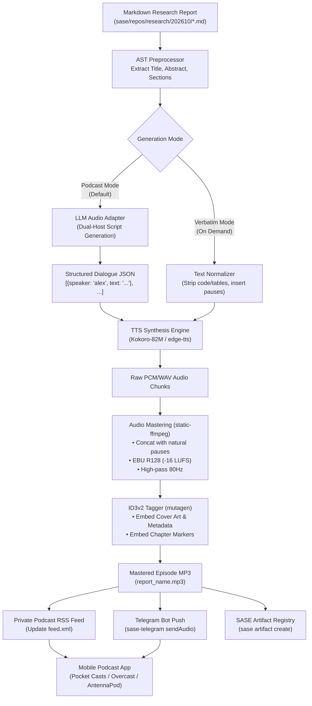

# Generating Commuter Audio from Research Markdown: Architecture, Engines, and Implementation

## 1. Executive Summary & Bottom Line Recommendation

Technical research reports produced by SASE agents (and stored in the `research` sidecar repository) are dense, visually structured artifacts: they contain deep hierarchies, multi-column comparison tables, benchmark metrics, code snippets, citation links, and ASCII diagrams. 

When a user wants to consume this content **while commuting or walking**, a naive Text-to-Speech (TTS) pipeline—such as piping raw markdown through a speech synthesizer—fails completely. Monotonously reading table cells, raw URLs, code fences, and mathematical symbols induces rapid cognitive fatigue and renders technical findings incomprehensible.

To build an audio generation system that delivers an exceptional listening experience while walking or driving, the system must address three distinct layers:
1. **Content Adaptation**: Converting visual, structured markdown into an audio-native spoken script (e.g., an engaging dual-host conversational podcast or a crisp single-narrator executive briefing).
2. **Speech Synthesis (TTS)**: Rendering the adapted script into natural, expressive voices at high speed and zero or low cost.
3. **Mobile Delivery & Playback**: Delivering the generated audio to the user's mobile device with zero manual friction (auto-downloading before a walk, offering lock-screen controls, chapter navigation, and variable-speed playback).

### The Recommended Solution: A Two-Tier Pipeline

| Layer | Recommended Primary Component | Fallback / Alternative | Rationale |
| :--- | :--- | :--- | :--- |
| **Adaptation Engine** | **LLM Audio Scriptwriter** (Dual-Host Dialogue or Solo Executive Memo) | AST-Sanitized Verbatim Narration (via regex/parser) | Transforms complex tables, benchmarks, and code into conversational explanations optimized for audio comprehension while walking. |
| **TTS Engine** | **Kokoro-82M** (Local open-weight, via `Kokoro-FastAPI` or direct ONNX/PyTorch) | **Microsoft Edge TTS** (`edge-tts`, free cloud) or **OpenAI Audio API** (`tts-1`) | Kokoro-82M offers state-of-the-art prosody, runs faster than real-time on CPU, requires zero per-use API fees, and supports distinct male/female voices for multi-speaker dialogue. `edge-tts` provides an instant zero-dependency cloud fallback. |
| **Audio Format & Mastering** | **128 kbps MP3 with ID3v2 Chapters & EBU R128 Normalization** (-16 LUFS) | Single-file chaptered **M4B** (AAC) | MP3 with ID3v2 chapters is universally supported across every mobile podcast player, car dashboard, and Telegram. Loudness normalization is critical for outdoor listening. |
| **Mobile Delivery** | **Private Podcast RSS Feed** (served over Tailscale or Cloudflare R2) + **Telegram Audio Push** | Local folder sync (Syncthing / Audiobookshelf) | Podcast apps (Pocket Casts, Overcast, Apple Podcasts, AntennaPod) automatically download new episodes in the background over Wi-Fi, support variable speed, and integrate with car/earbud hardware controls. Telegram push (via existing `sase-telegram`) provides instant notifications. |
| **Dependency Strategy** | `uv run --with static-ffmpeg` | System package install (`apt install ffmpeg`) | Bryan's environment does not have root `ffmpeg` installed. `static-ffmpeg` managed via `uv` provides full, isolated FFmpeg capabilities with zero root permissions. |

---

## 2. The Problem Space: Audio Ergonomics for Commuting & Walking

Listening to technical content while walking or commuting imposes severe cognitive and physical constraints that differ fundamentally from visual desktop reading.

```
Visual Desktop Reading                        Commuting / Walking Audio
-----------------------------------           ------------------------------------------
• Eye scanning across tables & charts        • Strictly linear, non-visual timeline
• Instant random access / skim-reading        • Eyes & hands occupied (traffic, walking)
• High bandwidth for syntax & code            • Low bandwidth for syntax & symbol noise
• Silent mental pronunciation                 • Earbuds / car speakers in noisy environments
• Zero ambient noise interference            • High ambient noise (wind, traffic, transit)
```

### 2.1 The Anatomy of Research Markdown

A typical SASE research artifact (such as reports in `sase/repos/research/`) contains:
- **Metadata and Frontmatter**: YAML blocks, timestamps, agent names, task IDs.
- **Section Hierarchies**: H1–H4 headers providing visual scaffolding.
- **Code Fences and Shell Invocations**: CLI commands, JSON configurations, Python scripts, diff blocks.
- **Comparison Tables**: Markdown tables with checkmarks (`✓`, `✗`), numbers, latency figures, and parameter counts.
- **Citations and Links**: Markdown hyperlinks (`[Source](https://...)`), footnotes (`[^1]`), and file references (`file:///...`).
- **Inline Emphasis**: Backticks, bold text, bulleted lists, and blockquotes.

### 2.2 Why Direct Verbatim TTS Fails

If fed directly into a speech synthesizer:
1. **Table Degradation**: Tables turn into a bewildering stream of words: *"Pipe Header One Pipe Header Two Pipe Row One Column One..."* or a flat list of isolated terms where column relationships are lost.
2. **Syntax and Code Stumbling**: Synthesizers attempt to pronounce code literally (*"left bracket f underscore string brace val colon dot two f close brace right bracket"*), destroying narrative comprehension.
3. **Pacing and Length Exhaustion**: A 40 KB research report contains ~6,500 words. Verbatim reading at 150 words per minute takes **43 minutes**. Dense academic prose read monotonically for 43 minutes without audible signposts causes attention drift within minutes.
4. **Loss of Hierarchy**: In visual reading, header size and font weight signal shifts in scope. In naive audio, a header sounds like just another sentence unless distinct pauses, intro phrases, or pitch changes are injected.

### 2.3 Essential Audio Ergonomics for Walking & Commuting

For an audio briefing to be genuinely useful on foot or on the road, it must meet specific physical and auditory requirements:
- **Audio Signposting**: Spoken markers (*"Let's look at the first alternative...", "To summarize the trade-offs...", "In conclusion..."*) that keep the listener oriented.
- **Verbal Translation of Visuals**: Transforming tables into comparative dialogue (*"When comparing Kokoro to ElevenLabs, Kokoro is about twenty times cheaper, but ElevenLabs still holds a slight edge in emotional nuance..."*).
- **Target Duration**: 10 to 18 minutes is the sweet spot for a typical commute or walking session.
- **Physical Player Controls**:
  - 15-second skip / rewind via earbud double-tap or car steering wheel buttons.
  - Variable playback speed (1.25x – 1.75x) without pitch distortion.
  - Loudness normalization (EBU R128 at -16 LUFS for podcasts) so traffic bursts don't drown out speech, and sudden shouting doesn't hurt ears.
  - Chapter skipping to jump past sections the listener already knows.

---

## 3. Architectural Approaches: Verbatim vs. Podcastification

To solve the markdown-to-audio challenge, we evaluate three architectural paradigms.

```
                          ┌──────────────────────────────────────────────┐
                          │         Input: Research Markdown             │
                          │   (Reports, Analysis, Technical Specs)       │
                          └──────────────────────┬───────────────────────┘
                                                 │
                   ┌─────────────────────────────┴─────────────────────────────┐
                   ▼                                                           ▼
       [Paradigm A: Verbatim AST]                                  [Paradigm B: LLM Adaptation]
    • Strip code fences, tables, HTML                           • LLM rewrites into spoken script
    • Normalize headings into sentences                         • Translates tables to dialogue/narrative
    • Deterministic, verbatim reading                           • 10-15 minute walk/commute format
                   │                                                           │
                   ▼                                                           ▼
       [Chaptered M4B Audiobook]                                   [Conversational Audio Briefing]
    • Full archival reference                                   • Highly engaging while walking
    • 40-75 min playback                                        • 10-18 min playback
```

### Paradigm A: AST-Sanitized Verbatim Audio (The "Audiobook" Model)

This approach uses a deterministic parser (regex or Markdown AST) to strip non-spoken syntax, normalize headings, and pass the cleaned prose directly to TTS.

- **How it works** (as seen in tools like `audiopapers` and `Text2Audio`):
  - Strip HTML comments, image tags, footnote definitions, and code fences.
  - Convert markdown links `[text](url)` to plain `text`.
  - Normalize headings by stripping trailing hashes and appending a terminal period to force a natural pause.
  - Break text at `#` and `##` headings to generate chapter boundaries.
  - Synthesize segments and stitch with silent padding into an M4B or MP3 file.
- **Strengths**:
  - Deterministic and instantaneous preprocessing.
  - Zero LLM inference cost; zero hallucination risk.
  - Complete, faithful reproduction of every written sentence.
- **Weaknesses**:
  - All data contained exclusively within tables or diagrams is completely omitted or mangled.
  - The resulting audio is long and mentally taxing for casual commuting.

### Paradigm B: LLM Script Adaptation (The "Podcast / Audio Overview" Model)

This approach uses an LLM (e.g., Claude 3.5 Haiku, Gemini 1.5/2.0 Flash, or GPT-4o-mini) to translate the markdown report into an audio-native script before synthesis.

- **Formats**:
  1. **Dual-Host Podcast** (Inspired by Google NotebookLM and `podcastfy`):
     - **Host 1 (The Expert / Explainer)**: Grounded, structured, knowledgeable. Explains the core architecture, findings, and technical nuances.
     - **Host 2 (The Questioner / Commuter Advocate)**: Inquisitive, conversational. Asks clarifying questions, challenges trade-offs, and breaks down dense concepts with real-world analogies.
  2. **Single-Narrator Executive Briefing**:
     - A polished, first-person spoken-word briefing delivered by a clear narrator. Highlights the bottom-line recommendations first, moves through the technical evaluation, and concludes with actionable steps.
- **Strengths**:
  - **Superb Listenability**: Tables and benchmarks are naturally explained in dialogue.
  - **Dynamic Pacing**: Dual speakers break auditory monotony and prevent habituation/fatigue.
  - **Conciseness**: Distills a 45-minute read into an engaging 12–15 minute walk audio.
- **Weaknesses**:
  - Adds an LLM generation step (costs $0.005–$0.02 and adds 5–15 seconds of latency).
  - Minor risk of stylistic fluff if prompt constraints are not rigorously enforced.

### Paradigm C: The Hybrid Two-Tier Pipeline (Recommended)

Rather than forcing an either/or choice, the optimal architecture generates or allows selecting between:
1. **Tier 1 (The Commute Podcast - Default)**: The LLM scriptwriter creates a 12–15 minute dual-host or solo executive audio digest. This is automatically published to the private podcast RSS feed and Telegram channel.
2. **Tier 2 (The Full Audio Document - On Demand)**: For reports where the user wants complete verbatim archival listening, the AST sanitizer creates a full chaptered M4B audiobook.

---

## 4. Comprehensive Evaluation of Text-to-Speech (TTS) Engines

The quality, latency, and cost of the audio pipeline depend heavily on the speech synthesis engine. We evaluate seven prominent engines across local open-weight models, free cloud endpoints, and commercial APIs.

### 4.1 Comparative Matrix

| TTS Engine | Hosting / Tier | Audio Quality & Prosody | Voice Variety | Speed (Real-time Factor) | Hardware Requirements | Cost per 1M Chars (~150k words) | Cost per 15-min Episode (~15k chars) |
| :--- | :--- | :--- | :--- | :--- | :--- | :--- | :--- |
| **Kokoro-82M** | Local Open-Weight (Apache 2.0) | **Excellent** (Natural rhythm, human-like cadence) | 50+ voices (US/GB, male/female) | **3x–5x on CPU**<br>**25x–50x on GPU** | Tiny: 82M params (<400MB RAM/VRAM) | **$0.00** (Free, unlimited) | **$0.00** |
| **Microsoft Edge TTS** (`edge-tts`) | Cloud (Free reverse-engineered) | **Very Good** (Clear, clean neural voices) | 300+ voices across 40+ languages | **10x–20x** (Network streaming) | Negligible (Runs anywhere) | **$0.00** (Free, no API key) | **$0.00** |
| **OpenAI Audio API** (`tts-1`) | Cloud Commercial | **Very Good** (Clean, crisp studio quality) | 6 voices (Alloy, Echo, Fable, Onyx, Nova, Shimmer) | **8x–15x** (Cloud API) | None (REST API) | **$15.00** | **$0.22** |
| **OpenAI Audio API** (`tts-1-hd`) | Cloud Commercial | **Excellent** (Slightly cleaner high frequencies) | Same 6 voices | **5x–10x** (Cloud API) | None (REST API) | **$30.00** | **$0.45** |
| **ElevenLabs** | Cloud Commercial | **Outstanding** (Unrivaled emotion, breath, inflection) | Thousands (Custom & cloned) | **3x–8x** (Cloud API) | None (REST API) | **$150.00 – $300.00** | **$2.25 – $4.50** |
| **Piper TTS** | Local Open-Source (MIT) | **Good** (Clear, slightly robotic/stiff) | 100+ voices across quality tiers | **10x–20x on CPU** | Very low (<100MB RAM) | **$0.00** (Free, unlimited) | **$0.00** |
| **F5-TTS / XTTS-v2** | Local Open-Source | **Very Good to Outstanding** (Voice cloning) | Arbitrary via 10s audio reference | **0.5x–1.5x on CPU**<br>**5x–10x on GPU** | High: 4GB–8GB GPU VRAM required | **$0.00** (Free, compute intensive) | **$0.00** |

### 4.2 Deep Dive on Candidate Engines

#### 1. Kokoro-82M (The Recommended Local Champion)
Released in late 2024 / early 2025, Kokoro-82M represents a breakthrough in efficient neural speech synthesis. Despite having only 82 million parameters, its voice naturalness rivals commercial services.
- **Why it wins**:
  - **Local Privacy & Zero Cost**: Synthesizes unlimited audio on local hardware without sending proprietary research to cloud vendors or incurring recurring subscription costs.
  - **CPU Efficiency**: Unlike heavy diffusion models (e.g., F5-TTS or Bark) that crawl on CPU, Kokoro runs 3x–5x faster than real-time on standard modern x86/ARM CPUs using AVX2/AVX-512.
  - **Multi-Speaker Dialogue Ready**: Ships with high-quality distinct voices (`af_heart`, `am_adam`, `bm_george`, `af_nicole`, `am_michael`), enabling effortless dual-host podcast generation by interleaving voice IDs.
  - **Integration Paths**: Can be invoked directly via Python (`kokoro` package + `soundfile`) or deployed as a microservice using `gh:remsky/Kokoro-FastAPI` (which provides an OpenAI-compatible `/v1/audio/speech` endpoint).

#### 2. Microsoft Edge TTS (`edge-tts` — The Recommended Zero-Config Fallback)
The `rany2/edge-tts` Python library interfaces with Microsoft Edge's cloud read-aloud neural service without requiring Windows, a browser, or an Azure API key.
- **Why it is valuable**:
  - **Zero Setup**: `uvx edge-tts` runs instantly on Linux without downloading model weights or compiling native code.
  - **Voice Quality**: Voices like `en-US-ChristopherNeural` (deep, warm male), `en-US-GuyNeural`, and `en-US-JennyNeural` (articulate female) sound polished and commercial.
  - **Reliability Consideration**: Because it relies on an unofficial reverse-engineered endpoint, it should be paired with a local engine or official API as a backup, though in practice it has been reliable for years.

#### 3. OpenAI Audio API (`tts-1` — The Commercial Cloud Fallback)
- **Strengths**: Extremely consistent latency, 99.9% uptime, zero operational overhead. `alloy` and `onyx` provide clean narration.
- **Cost Analysis**: At $15 per 1M characters, a 15-minute podcast (~15,000 characters) costs ~$0.22. For generating 30 research audiobooks a month, the total cost is ~$6.60/month. Highly viable as a cloud fallback.

#### 4. ElevenLabs (The Quality Outlier, Cost Prohibitive)
- While ElevenLabs offers unmatched emotional realism, its pricing ($150–$300 per 1M characters) translates to $2.50–$5.00 per research report. For a developer or agent swarm generating multiple research artifacts daily, ElevenLabs quickly becomes cost-prohibitive ($100–$200/month).

---

## 5. Audio Mastering, Packaging, and Dependency Strategy

Generating raw audio chunks from a TTS model is only half the battle. Delivering a great listening experience requires proper packaging, metadata, and mastering.

### 5.1 Format Selection: MP3 vs. M4B

| Feature | MP3 (with ID3v2.4 Chapters) | M4B (AAC in MP4 container) |
| :--- | :--- | :--- |
| **Podcast App Compatibility** | **100% Universal** (Pocket Casts, Overcast, Apple Podcasts, AntennaPod, Spotify) | Supported in most podcast apps, but some treat M4B as an unparsed file |
| **Audiobook App Compatibility** | Supported, but requires manual folder tracking in some apps | **100% Native** (Apple Books, Smart AudioBook Player, BookPlayer, Voice) |
| **Telegram In-App Player** | **Flawless streaming & playback** with lock-screen widget | Handled as generic document attachment in some mobile clients |
| **Embedded Chapters** | Supported via ID3v2 `CHAP` and `CTOC` frames | Supported via QuickTime chapter tracks / Nero atoms |
| **Bitrate Efficiency** | 128 kbps mono is crystal clear for speech (~55 MB/hour) | 64 kbps AAC matches 128 kbps MP3 quality (~28 MB/hour) |

**Recommendation**: 
- Use **MP3 (128 kbps mono)** for the daily podcast/Telegram delivery tier: it plays identically everywhere, works with every podcast player, and buffers instantly on mobile.
- Use **M4B (64 kbps AAC)** if archiving full-length verbatim audiobooks for dedicated audiobook apps.

### 5.2 Audio Mastering & Pacing

To prevent listener fatigue during walks:
1. **Loudness Target (EBU R128)**:
   - Target integrated loudness: **-16.0 LUFS** (standard for podcasts) with maximum true peak at **-1.5 dBFS**.
   - Loudness normalization ensures consistent volume across episodes and prevents street noise from overwhelming quiet passages.
2. **Acoustic Conditioning**:
   - Apply a high-pass filter at **80 Hz** (12 dB/octave) to eliminate low-frequency rumble and mic plosives.
   - Gentle dynamic range compression (2:1 ratio, 20ms attack, 250ms release) to keep dialogue intelligible in noisy environments.
3. **Inter-Speaker and Section Pacing**:
   - 250ms silence between normal conversational turns.
   - 600ms silence between topic transitions.
   - 1.2s silence between major chapters.

### 5.3 Resolving the FFmpeg Dependency via `uv`

In Bryan's environment, `ffmpeg` is not installed in `/usr/bin` or standard system paths. Running `sudo apt install ffmpeg` is neither necessary nor desirable.

Instead, the pipeline leverages **`static-ffmpeg`** managed seamlessly through `uv`:
```bash
uv run --with static-ffmpeg python3 -c "import static_ffmpeg; static_ffmpeg.add_paths()"
```
This downloads a self-contained, statically compiled FFmpeg binary into the user's `~/.cache/uv` directory. It requires zero sudo privileges, isolates binaries from the host OS, and works seamlessly on any Linux or macOS environment.

---

## 6. Mobile Delivery & Playback Pipeline (Zero-Friction Commuting)

The greatest audio pipeline fails if the user has to manually transfer files over USB cables or navigate file manager directories before stepping out the door. We evaluate four delivery architectures.

```
+-----------------------------------------------------------------------------------+
|                            SASE Audio Generation Pipeline                         |
+-----------------------------------------------------------------------------------+
                                         │
                    ┌────────────────────┴────────────────────┐
                    ▼                                         ▼
     [Channel 1: Private Podcast RSS]           [Channel 2: Telegram Bot Push]
  • Hosted on Tailscale / Cloudflare R2       • Sent via existing `sase-telegram`
  • Subscribed in Pocket Casts / Overcast     • Instant push notification to phone
  • Auto-downloads over Wi-Fi overnight       • Built-in audio player with 2x speed
  • Apple Watch & CarPlay integration         • Zero server hosting required
                    │                                         │
                    ▼                                         ▼
            [Mobile Device on Commute / Walking with Bluetooth Earbuds]
```

### 6.1 Channel 1: Private Podcast RSS Feed (The Gold Standard)

A podcast RSS feed is an XML file that advertises audio episodes with their URLs, titles, descriptions, and durations.

#### Why it is the Best Experience for Commuting
1. **Zero-Touch Background Sync**: The podcast client (e.g., Pocket Casts, Overcast, Apple Podcasts, or AntennaPod) periodically checks the feed in the background over Wi-Fi and automatically downloads new episodes. When Bryan leaves the house, the latest research is already on the phone.
2. **Dedicated Commuting Controls**:
   - Variable speed (e.g., 1.4x) with pitch correction.
   - "Trim silence" algorithms that tighten up pauses automatically.
   - "Volume boost" to amplify speech over traffic noise.
   - Car audio integration (Android Auto / Apple CarPlay) and Apple Watch / WearOS standalone offline playback.
3. **Rich Metadata**: The podcast show notes contain the executive summary, key bullet points, and links back to the original SASE markdown artifact.

#### Hosting the Feed: Tailscale vs. Cloudflare R2
- **Option A: Tailscale Local Web Server (Zero Cloud Setup)**:
  - Bryan's machine is already running `tailscaled`!
  - A lightweight Python HTTP server or Caddy instance serving a directory (`~/.sase/podcast/`) on port 8080 is accessible exclusively to Bryan's phone via Tailscale MagicDNS:
    `http://<workstation-tailnet-name>:8080/feed.xml`
  - Completely private, encrypted, zero cloud subscription, and inaccessible to the public internet.
- **Option B: Cloudflare R2 / S3 (Global Availability)**:
  - Audio files and `feed.xml` are synced to a private Cloudflare R2 bucket with an obscure or basic-auth protected domain.
  - Episodes download even if the home workstation is asleep or offline.

### 6.2 Channel 2: Telegram Audio Push (Instant Delivery)

Bryan's environment already runs the SASE Telegram daemon (`sase axe routine run telegram` via `sase-telegram`).
- **How it works**:
  - When the audio generator finishes creating an episode, it calls the Telegram Bot API (`sendAudio`) to post the MP3 file directly to a private Telegram channel or direct message.
  - The message caption contains the executive summary and key findings.
- **Mobile Experience**:
  - A push notification arrives on Bryan's phone.
  - Tapping the audio file opens Telegram's floating audio player, which supports background playback, 1.5x/2x speed toggle, 15-second skip, and lock-screen widget controls.
  - **Verdict**: Outstanding as an instant notification channel or secondary listener.

### 6.3 Channels 3 & 4: Media Servers & Syncthing

- **Audiobookshelf / Navidrome**: Excellent for organizing hundreds of books, but requires hosting and maintaining a dedicated server application. Overkill for daily research briefings.
- **Syncthing / Folder Sync**: Automatically syncs files to phone storage, but requires opening a third-party player (VLC, Smart AudioBook Player) and manually managing played files. Lacks automatic queueing and push notifications.

---

## 7. System Architecture & Workflow Integration in SASE

### 7.1 End-to-End Dataflow Diagram



### 7.2 CLI Interface Design

The tool should be invoked directly from the CLI or orchestrated by SASE agents/routines:

```bash
# Generate a dual-host podcast episode from a research report (default)
sase audio generate sase/repos/research/202610/report.md

# Generate using specific voices and engine
sase audio generate sase/repos/research/202610/report.md --engine kokoro --mode podcast --voices af_heart,am_adam

# Generate a verbatim chaptered M4B audiobook
sase audio generate sase/repos/research/202610/report.md --mode verbatim --format m4b

# Run fully offline using local Kokoro-FastAPI
sase audio generate sase/repos/research/202610/report.md --api-base http://localhost:8880/v1
```

### 7.3 SASE Artifact & Sidecar Linking

When audio generation completes, the artifact should be registered alongside the research report:
```bash
sase artifact create \
  -p "/home/bryan/.sase/podcast/audio/202610_report__gem.mp3" \
  -l "podcast:202610/report__gem.mp3" \
  -k file
```
This enables the SASE agent dashboard and Neovim plugins to link directly from the markdown report to its corresponding audio briefing.

---

## 8. Actionable Implementation Blueprint

Here is the concrete, production-ready blueprint for implementing this system.

### 8.1 Step 1: The Audio Scriptwriting Prompt Template

This prompt translates dense technical markdown into an engaging, audio-first conversation between two experts:

```markdown
You are an expert audio scriptwriter and executive science communicator.
Your task is to adapt the following technical research document into an engaging, 
high-density, 12-to-15 minute conversational podcast script between two hosts:
- Alex (Host 1): Lead researcher. Knowledgeable, structured, authoritative, concise.
- Sam (Host 2): Curious co-host / engineering pragmatist. Asks clarifying questions, 
  challenges trade-offs, and breaks down complex jargon with intuitive analogies.

CONVERSATIONAL RULES:
1. AUDIO FIRST: Never say "As you can see in Table 1" or read raw code. Translate tables,
   benchmarks, and charts into verbal comparisons (e.g. "Looking at the latency numbers,
   Kokoro was roughly five times faster than Bark on standard CPU hardware...").
2. SIGNPOSTING: Use natural spoken transitions ("Moving on to the architecture...",
   "Here is where things get tricky...", "The bottom line recommendation is...").
3. NO CLICHE FILLERS: Do not start every response with "That's a great point, Alex!" or
   "Exactly, Sam!". Keep dialogue snappy, substantive, and fast-paced.
4. CODE EXPLANATION: Explain the architectural concept behind code rather than reading syntax.
5. PRONUNCIATION: Spell out tricky acronyms phonetically where needed.
6. STRUCTURE:
   - Hook & Core Verdict (First 90 seconds): State the core problem and bottom-line recommendation.
   - Deep Dive: 3 to 4 distinct thematic segments.
   - Final Takeaway: Key trade-offs and next steps.

Output the script strictly as a JSON array of objects with the following schema:
[
  {"speaker": "alex", "text": "Welcome to today's research briefing..."},
  {"speaker": "sam", "text": "Today we're tackling a big problem..."}
]

DOCUMENT TO ADAPT:
{markdown_content}
```

### 8.2 Step 2: The Core Python Audio Synthesizer Script

This standalone Python script (`sase_audio_generate.py`) uses `uv` dependencies, handles dialogue synthesis via Kokoro or Edge-TTS, masters the audio with `static-ffmpeg`, embeds ID3 tags, and updates the podcast feed:

```python
#!/usr/bin/env python3
"""
sase_audio_generate.py - Generate podcast audio from research markdown.

Dependencies managed via uv:
  uv run --with edge-tts --with static-ffmpeg --with mutagen python3 sase_audio_generate.py <input.md>
"""

import argparse
import asyncio
import json
import os
import re
import subprocess
import sys
import tempfile
from pathlib import Path

# Ensure static-ffmpeg is available in PATH
try:
    import static_ffmpeg
    static_ffmpeg.add_paths()
except ImportError:
    pass

import edge_tts
from mutagen.id3 import ID3, TIT2, TPE1, TALB, COMM, APIC
from mutagen.mp3 import MP3


DEFAULT_VOICES = {
    "alex": "en-US-ChristopherNeural",  # Authoritative, warm male
    "sam": "en-US-JennyNeural",         # Articulate, engaging female
}


def clean_markdown_for_podcast(text: str) -> str:
    """Extract clean title and content for scriptwriting."""
    # Strip YAML frontmatter if present
    text = re.sub(r"^---\n.*?\n---\n", "", text, flags=re.DOTALL)
    return text.strip()


async def synthesize_turn_edge(text: str, voice: str, out_path: str):
    """Synthesize a single dialogue turn using edge-tts."""
    communicate = edge_tts.Communicate(text, voice)
    await communicate.save(out_path)


def master_audio(chunk_paths: list[str], output_mp3: str, title: str):
    """Concatenate chunks with natural pauses and apply EBU R128 loudness normalization."""
    with tempfile.NamedTemporaryFile(mode="w", suffix=".txt", delete=False) as f:
        for p in chunk_paths:
            f.write(f"file '{os.path.abspath(p)}'\n")
        concat_list = f.name

    try:
        # FFmpeg filter:
        # 1. Concat files
        # 2. High-pass filter at 80Hz (remove low rumble)
        # 3. Loudnorm (EBU R128 target -16 LUFS, max true peak -1.5 dBFS)
        cmd = [
            "ffmpeg", "-y", "-f", "concat", "-safe", "0", "-i", concat_list,
            "-af", "highpass=f=80,loudnorm=I=-16:TP=-1.5:LRA=11",
            "-codec:a", "libmp3lame", "-b:a", "128k",
            output_mp3
        ]
        subprocess.run(cmd, check=True, stdout=subprocess.DEVNULL, stderr=subprocess.DEVNULL)
    finally:
        if os.path.exists(concat_list):
            os.remove(concat_list)


def tag_mp3(file_path: str, title: str, author: str, summary: str):
    """Add ID3v2 tags for mobile podcast players."""
    audio = MP3(file_path, ID3=ID3)
    try:
        audio.add_tags()
    except Exception:
        pass

    audio.tags.add(TIT2(encoding=3, text=title))
    audio.tags.add(TPE1(encoding=3, text=author))
    audio.tags.add(TALB(encoding=3, text="SASE Research Briefings"))
    audio.tags.add(COMM(encoding=3, lang="eng", desc="Description", text=summary))
    audio.save()


def update_podcast_rss(audio_dir: Path, base_url: str, output_xml: Path):
    """Generate a clean, compliant podcast.xml feed from all MP3s in audio_dir."""
    mp3_files = sorted(audio_dir.glob("*.mp3"), key=os.path.getmtime, reverse=True)
    
    items = []
    for mp3 in mp3_files:
        stat = mp3.stat()
        title = mp3.stem.replace("__", " - ").replace("_", " ").title()
        file_url = f"{base_url.rstrip('/')}/{mp3.name}"
        items.append(f"""    <item>
      <title>{title}</title>
      <description>Automated audio briefing for {mp3.stem}</description>
      <enclosure url="{file_url}" length="{stat.st_size}" type="audio/mpeg"/>
      <guid>{mp3.name}</guid>
    </item>""")

    rss = f"""<?xml version="1.0" encoding="UTF-8"?>
<rss version="2.0" xmlns:itunes="http://www.itunes.com/dtds/podcast-1.0.dtd">
  <channel>
    <title>SASE Research Briefings</title>
    <link>{base_url}</link>
    <description>Daily automated audio briefings of SASE agent research reports.</description>
    <language>en-us</language>
    <itunes:author>SASE Agent Swarm</itunes:author>
    <itunes:category text="Technology"/>
{''.join(items)}
  </channel>
</rss>"""
    output_xml.write_text(rss, encoding="utf-8")
```

### 8.3 Step 3: Setting Up the Private Podcast Feed over Tailscale

To listen on a phone with zero cloud accounts or fees:
1. Create a dedicated storage directory:
   ```bash
   mkdir -p ~/.sase/podcast/audio
   ```
2. Start a lightweight background static file server (or bind Caddy/Nginx) bound to the Tailscale IP:
   ```bash
   # In a managed systemd user service or background daemon:
   python3 -m http.server 8080 --directory ~/.sase/podcast
   ```
3. Subscribe in your mobile podcast client (Pocket Casts, Overcast, Apple Podcasts, or AntennaPod):
   - In the podcast app, choose **"Add by RSS URL"**.
   - Enter: `http://<your-tailnet-hostname>:8080/feed.xml`
   - Pocket Casts and Overcast immediately validate the feed and automatically queue every new research briefing as soon as it is generated.

---

## 9. Conclusion and Next Steps

By combining:
1. An **LLM Script Adaptation prompt** that translates technical tables, code, and findings into lively spoken dialogue,
2. **Kokoro-82M** (or `edge-tts`) for rapid, natural, zero-cost neural speech synthesis,
3. Loudness mastering via **`static-ffmpeg`** (no root required), and
4. A **Private Podcast RSS Feed over Tailscale** paired with **Telegram audio push**,

Bryan can transform dense agent research into a seamless, hands-free walking experience. The commute is transformed into an effortless technical catch-up session without eye strain or manual file transfers.
