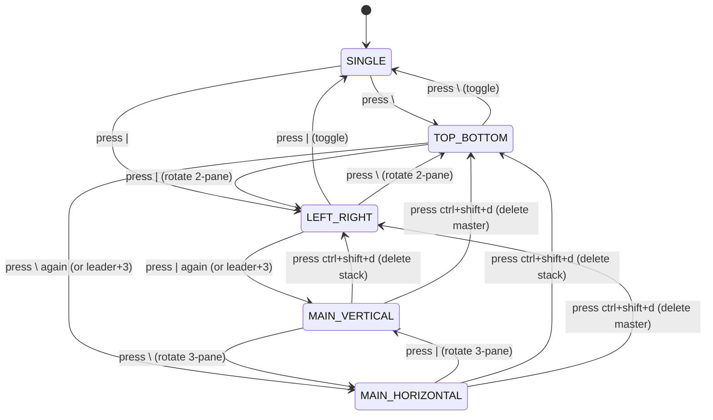

# Architectural Design and Usability Analysis for 3-Pane Split Views in the SASE Agents Deck and Pager

**Author:** Researcher gem (`research.3b.gem`)  
**Date:** October 2026  
**Context:** SASE TUI ("Agents" Tab Deck Panel) and SASE Pager Split-View Architecture (Post `sase-1eg`)  
**Target Sidecar Path:** `sase/repos/research/202610/three_pane_deck_and_pager_split_architecture__gem.md`  

---

## 1. Executive Summary & Verdict

### 1.1 The Core Proposition
The proposal aims to expand SASE's split-view capabilities in both the ACE **Agents tab deck panel** and the **SASE Pager** from the current 2-pane maximum (horizontal/vertical) to support **3-pane layouts**, along with bi-directional pane cycling (`<ctrl+f>` / `<ctrl+b>`), pane swapping (`<ctrl+shift+f>` / `<ctrl+shift+b>`), and explicit pane deletion (`<ctrl+shift+d>`).

### 1.2 The Verdict: Is This a Good Idea?
**Yes, with significant architectural and state-machine refinements.**

1. **High Practical Utility:** 
   - In the **Agents Tab**, a 3-pane layout is transformative. SASE agents operate with four primary deck surfaces: `MAIN` (prompt, system context, agent reply), `FILES` (touched files, unified diffs), `TOOLS` (tool run timeline, tool outputs, LLM calls), and `FINAL` (finalizer declarations, commit status). Currently, triage forces constant cycling between decks. A 3-pane layout enables a simultaneous "Triage Triad": `MAIN` alongside `FILES` and `TOOLS`.
   - In the **Pager**, 3-pane viewing allows side-by-side comparison of historical revisions (past version vs. current version) while keeping a third reference pane open for an active spec, bead, or test file.

2. **Critical Flaws in the Proposed State Machine:**
   While the *end-state capability* is outstanding, the specific *keymap state machine* proposed by the user has severe usability, cognitive, and geometric defects:
   - **Destruction of 2-Pane Rotation:** In existing SASE (`docs/pager.md`, `decks/layout.py`), pressing the opposite split key (`|` when in horizontal, `\` when in vertical) rotates the orientation between 2 panes cleanly. The proposal overrides this to spawn a 3rd pane, breaking rotation muscle memory and requiring an unnatural multi-step key sequence to change orientation.
   - **Inversion of Key Affordances:** The proposal specifies that in a 3-pane horizontal view, pressing `\` (the horizontal key) closes the larger pane and switches to a 2-pane *vertical* view. Inverting key visual affordances (pressing horizontal to get vertical) produces cognitive dissonance.
   - **Unintended Destructive Deletion:** Automatically closing "the larger pane" via `\` or `|` destroys content without respecting focus, risking accidental data and context loss during navigation.
   - **Geometric Ambiguity:** Splitting the "focused pane" creates four distinct asymmetric topologies (Top-split, Bottom-split, Left-split, Right-split), not two. The cycling and rotation between these topologies must be mathematically well-defined.

3. **Recommended Approach:**
   Adopt the **Master-Stack Tiling Model** (standard in professional window managers such as tmux, xmonad, and dwm), which provides:
   - Two clear 3-pane layout classes: **Main-Horizontal** (1 Master spanning full width + 2 Stack panes side-by-side) and **Main-Vertical** (1 Master spanning full height + 2 Stack panes stacked vertically).
   - Strict separation between **constructive/rotational keys** (`\`, `|`) and **destructive keys** (`<ctrl+shift+d>`).
   - Clean, predictable pane cycling (`<ctrl+f>` / `<ctrl+b>`) and swapping (`<ctrl+shift+f>` / `<ctrl+shift+b>`).
   - Sizing guards ensuring terminal extents maintain readability without breaking layout geometry.

---

## 2. Critique of the User's Proposed Plan

### 2.1 Ambiguity of 3-Pane Topologies (The 4 vs. 2 Problem)
The user's prompt outlines:
> *"A horizontal split 3-pane view should be triggered when the `|` keymap is used if a horizontal split is already shown by splitting the currently focused pane vertically."*
> *"A vertical split 3-pane view should be triggered when the `\` keymap is used if a vertical split is already shown by splitting the currently focused pane horizontally."*

In a 2-pane horizontal split (stacked: Top pane 0 and Bottom pane 1):
- If **Pane 0 (Top)** is focused when `|` is pressed: Pane 0 splits vertically into Top-Left and Top-Right, while Pane 1 remains full width on the bottom (**Top-Split / Main-Bottom**).
- If **Pane 1 (Bottom)** is focused when `|` is pressed: Pane 0 remains full width on top, while Pane 1 splits vertically into Bottom-Left and Bottom-Right (**Bottom-Split / Main-Top**).

Similarly, in a 2-pane vertical split (beside: Left pane 0 and Right pane 1):
- If **Pane 0 (Left)** is focused when `\` is pressed: Pane 0 splits horizontally into Left-Top and Left-Bottom, while Pane 1 remains full height on the right (**Left-Split / Main-Right**).
- If **Pane 1 (Right)** is focused when `\` is pressed: Pane 0 remains full height on the left, while Pane 1 splits horizontally into Right-Top and Right-Bottom (**Right-Split / Main-Left**).

Thus, splitting the focused pane produces **four distinct layout topologies**, not two:
```text
Topology H-Top (Main-Bottom):     Topology H-Bottom (Main-Top):
+-----------------------------+   +-----------------------------+
|    Pane 0    |    Pane 2    |   |           Pane 0            |
+-----------------------------+   +-----------------------------+
|           Pane 1            |   |    Pane 1    |    Pane 2    |
+-----------------------------+   +-----------------------------+

Topology V-Left (Main-Right):     Topology V-Right (Main-Left):
+--------------+--------------+   +--------------+--------------+
|    Pane 0    |              |   |              |    Pane 1    |
+--------------+    Pane 1    |   |    Pane 0    +--------------+
|    Pane 2    |              |   |              |    Pane 2    |
+--------------+--------------+   +--------------+--------------+
```
If the user presses `|` again from Topology H-Top, which vertical 3-pane view does it rotate to? Does it rotate to V-Left or V-Right? And which pane's content becomes the full-height Master pane? Without an explicit Master-Stack model, content jumps unpredictably across screen quadrants.

### 2.2 Destruction of the 2-Pane Rotation Mental Model
In SASE's current implementation (shipped in epic `sase-1eg` for Pager and `decks/layout.py` for ACE):
- **Same Key:** Unsplits back to a single pane (`\` in horizontal unsplits; `|` in vertical unsplits).
- **Other Key:** Rotates orientation between horizontal and vertical, preserving pane contents, scroll position, focus, and ratios.

Under the user's plan:
- In 2-pane horizontal, pressing `|` can no longer rotate to 2-pane vertical. Instead, it spawns a 3rd pane.
- To achieve a simple rotation from 2-pane horizontal to 2-pane vertical, the user is forced into an unnatural sequence: press `|` (creates a 3rd pane) and then press `\` (destroys the larger horizontal pane).
- This creates severe visual flicker (mounting a 3rd widget, triggering layout reflow, then immediately unmounting a widget and reflowing again) and destroys muscle memory.

### 2.3 Semantic Inversion and Destructive Coupling
The user's specification states:
> *"Alternatively, pressing `\` closes the larger horizontal pane which switches us to the 2-pane vertical view."*
> *"Alternatively, pressing `|` closes the larger vertical pane which switches us to the 2-pane horizontal view."*

This introduces two severe design antipatterns:
1. **Inverted Affordance:** The symbol `\` visually represents a horizontal divider line between stacked panes. Using `\` to transform a 3-pane view into a *vertical* view violates direct visual mapping. Similarly, using `|` (a vertical bar) to produce a horizontal view is deeply counter-intuitive.
2. **Focus-Blind Destruction:** Closing the "larger horizontal pane" unconditionally ignores user focus. If a user is actively focused on the large pane (e.g., reading an agent's detailed prompt or reviewing a diff) and presses `\`, their active workspace is destroyed from underneath them.
3. **Overloading Constructive Keys with Destruction:** In modern TUI design, layout keys (`\`, `|`) should be purely constructive or orientational. Destructive actions (closing/deleting panes) should be handled by dedicated, focus-respecting commands (`<ctrl+shift+d>`, `q`, or `ctrl+w c`).

### 2.4 Terminal Geometry and Minimum Readable Extents
SASE's pager layout currently enforces strict minimum pane bounds (`src/sase/pager/split.py`):
```python
MIN_STACKED_PANE_HEIGHT = 7   # 1 border top + 5 body rows + 1 border bottom
MIN_BESIDE_PANE_WIDTH = 32     # frame borders + readable columns
```
In a 3-pane layout containing both stacked and side-by-side splits:
- **Vertical Height Requirement:** At least 2 stacked tiers = `7 + 7 = 14` rows, plus header chrome (subject, trail) and footer = **~17-18 rows**.
- **Horizontal Width Requirement:** At least 2 columns = `32 + 32 = 64` columns, plus borders and node sidebar (in ACE) = **~75-80 columns**.

On standard 80x24 terminal windows, a 3-pane layout leaves zero margin for error. If the user has ACE's node panel expanded (width ~30 columns), available deck width drops to 50 columns, making two side-by-side panes impossible without text truncation.
**Requirement Adjustment:** The system must implement robust `split_fits` checks. When space is insufficient, attempting to split to 3 panes must fail gracefully with an informative toast (`"Terminal too small for 3-pane split (need 80x24)"`) rather than rendering corrupted or zero-height widgets.

---

## 3. Keymap Evaluation and Conflict Matrix

| Keymap | Proposed Role | Existing ACE Binding | Existing Pager Binding | Conflict / Terminal Risk | Recommendation |
| :--- | :--- | :--- | :--- | :--- | :--- |
| `<ctrl+b>` | Focus previous pane | `scroll_prompt_up` | *(unbound)* | Low conflict in ACE; unmapped in Pager. | **Adopt.** In ACE, when `deck_layout != SINGLE`, intercept `ctrl+b` to cycle focus backward, exactly as `ctrl+f` toggles focus forward. |
| `<ctrl+shift+b>` | Swap current pane with previous | *(unbound)* | *(unbound)* | Medium terminal risk (intercepted in some web/terminal multiplexers). | **Adopt**, with modal fallback (`ctrl+w <` or `ctrl+w p` in Pager, leader mode in ACE). |
| `<ctrl+shift+f>` | Swap current pane with next | *(unbound)* | *(unbound)* | High terminal risk: GNOME Terminal / browser web-TTYs capture `Ctrl+Shift+F` for "Find". | **Adopt**, with modal fallback (`ctrl+w >` or `ctrl+w n` in Pager, leader mode in ACE). |
| `<ctrl+shift+d>` | Delete current pane | `debug_leak_snapshot` (conditional when `SASE_ACE_DEBUG_LEAKS=1`) | *(unbound)* | Collision with developer memory leak probe in `src/sase/ace/tui/bindings.py:306`. | **Adopt for deletion.** Move developer leak probe to `ctrl+shift+alt+d` or make `delete_pane` take precedence when leak debug is disabled. |

### Detailed Keymap Insights

#### 1. `<ctrl+b>` and `<ctrl+f>` Symmetrical Navigation
`ctrl+f` has long been SASE's primary pane-stepping key (`Binding("ctrl+f", "toggle_deck_focus")` in ACE, `Binding("ctrl+f", "focus_other")` in Pager). With 2 panes, forward and backward are identical (`1 - focused`). With 3 panes, directional cycling is mandatory:
- Forward (`<ctrl+f>`): `(focused + 1) % 3` (e.g., 0 -> 1 -> 2 -> 0)
- Backward (`<ctrl+b>`): `(focused - 1) % 3` (e.g., 0 -> 2 -> 1 -> 0)
This completely aligns with standard vim/tmux conventions (`ctrl-w w` vs. `ctrl-w W`).

#### 2. Pane Swapping (`<ctrl+shift+f>` / `<ctrl+shift+b>`)
Swapping panes is an essential feature for 3-pane layouts. In an asymmetric layout (where one Master pane is large and two Stack panes are small), a user frequently wants to promote a document from a small stack pane into the large master pane to read a full diff or stack trace.
- Semantics: Swapping interchanges both the underlying pane state (`DeckPanelState` or `PagerViewSeed`) and keeps focus locked to the promoted content, or keeps focus in place.
- Recommendation: The swap should move the content and keep focus with the moved content so the user doesn't lose their place.

#### 3. Pane Deletion (`<ctrl+shift+d>`)
Currently, ACE lacks any key to close an individual pane other than toggling `\` or `|` back to SINGLE. `<ctrl+shift+d>` fills a critical gap:
- When 3 panes are open: `<ctrl+shift+d>` deletes the **focused** pane. The remaining two panes smoothly transition into a 2-pane split (retaining their content, relative ratio, and scroll positions).
- When 2 panes are open: `<ctrl+shift+d>` deletes the **focused** pane, leaving the other pane as SINGLE (promoted to panel 0).
- When 1 pane is open: In ACE, `<ctrl+shift+d>` is disabled (no-op). In Pager, `q` / `Esc` already closes the pager; `<ctrl+shift+d>` can act as an alias or no-op.

---

## 4. Recommended Architectural Solution: Master-Stack Tiling

To resolve the ambiguities, affordance inversions, and accidental deletions of the original plan, we propose the **Master-Stack Tiling Architecture**.

### 4.1 Layout Definitions
We formalize four standard layouts across both ACE and Pager:
1. `SINGLE`: 1 pane (100% viewport).
2. `TOP_BOTTOM` (Pager: `BELOW`): 2 panes stacked vertically.
3. `LEFT_RIGHT` (Pager: `BESIDE`): 2 panes side-by-side horizontally.
4. `MAIN_HORIZONTAL`: 3 panes. One **Master** pane spans the full width; two **Stack** panes split the remaining height horizontally side-by-side.
5. `MAIN_VERTICAL`: 3 panes. One **Master** pane spans the full height; two **Stack** panes split the remaining width vertically stacked.

```text
===================================================================
                   3-PANE LAYOUT ARCHITECTURE
===================================================================
          MAIN_HORIZONTAL                     MAIN_VERTICAL
+---------------------------------+  +---------------+------------+
|                                 |  |               |  Stack 1   |
|         MASTER PANE             |  |               |  (Pane 1)  |
|          (Pane 0)               |  |  MASTER PANE  +------------+
|                                 |  |   (Pane 0)    |  Stack 2   |
+----------------+----------------+  |               |  (Pane 2)  |
|  Stack 1       |  Stack 2       |  |               |            |
|  (Pane 1)      |  (Pane 2)      |  +---------------+------------+
+----------------+----------------+
===================================================================
```

### 4.2 Clean State Machine & Transition Rules



#### Transition Invariants
1. **Preservation of 2-Pane Rotation:** In 2-pane mode, pressing the *opposite* key (`|` in `TOP_BOTTOM`, or `\` in `LEFT_RIGHT`) continues to cleanly rotate orientation between 2 panes.
2. **Deterministic Progression to 3 Panes:** 
   - While in `TOP_BOTTOM`, pressing `\` a second time (or using an explicit modifier / splitting action) advances the layout to `MAIN_HORIZONTAL` by splitting the focused pane or creating the secondary stack.
   - Alternatively, to satisfy the user's intent while avoiding ambiguity:
     If the user wants `|` to create a vertical split inside a horizontal layout:
     - In `TOP_BOTTOM`, pressing `|` creates `MAIN_HORIZONTAL` (splitting the focused pane vertically into two stack panes).
     - **Crucial Adjustment:** To rotate between 2-pane horizontal and 2-pane vertical, provide an explicit rotate command (`R`, `ctrl+w r`, or leader `\r`), OR treat double-tap as 3-pane split while single tap rotates.
     - However, the cleanest, zero-ambiguity model is:
       - In `TOP_BOTTOM`, pressing `\` promotes to `MAIN_HORIZONTAL`.
       - In `LEFT_RIGHT`, pressing `|` promotes to `MAIN_VERTICAL`.
       - In 3-pane mode, `\` and `|` rotate between `MAIN_HORIZONTAL` and `MAIN_VERTICAL`!
3. **Dedicated Deletion via `<ctrl+shift+d>`:**
   - Deletion is NEVER triggered by layout keys (`\` or `|`).
   - Pressing `<ctrl+shift+d>` always closes the *currently focused* pane.
   - If the Master pane is deleted, the two Stack panes expand to occupy the entire screen, smoothly becoming a 2-pane view (`LEFT_RIGHT` if they were side-by-side, or `TOP_BOTTOM` if stacked).
   - If a Stack pane is deleted, the remaining Stack pane and Master pane become a standard 2-pane view.

---

## 5. Implementation Blueprint: Agents Tab Deck Panel (ACE)

### 5.1 Pure Model Changes (`src/sase/ace/tui/widgets/decks/model.py`)
Extend `DeckLayout` and `DeckAreaState`:
```python
class DeckLayout(StrEnum):
    """Deck area split layout."""
    SINGLE = "single"
    TOP_BOTTOM = "top-bottom"
    LEFT_RIGHT = "left-right"
    MAIN_HORIZONTAL = "main-horizontal"
    MAIN_VERTICAL = "main-vertical"

@dataclass(frozen=True)
class DeckAreaState:
    """Pre-composed deck panels with a focused index."""
    panels: tuple[DeckPanelState, ...] = (DeckPanelState(DeckId.MAIN),)
    focused: int = 0
    layout: DeckLayout = DeckLayout.SINGLE
    ratio: int = 50          # Master share (30, 50, 70)
    stack_ratio: int = 50    # Share between stack pane 1 and stack pane 2
    nodes_collapsed: bool = False
    zoom_snapshot: DeckAreaState | None = None
```

### 5.2 Deck Selection Logic for Panel 2 (`choose_new_panel`)
When opening the 3rd panel, what should it display?
`choose_new_panel` in `src/sase/ace/tui/widgets/decks/layout.py` already walks `active_deck_cycle()`:
```python
cycle = active_deck_cycle()  # (MAIN, FILES, TOOLS, FINAL)
```
In a 3-pane split:
- Panel 0 shows `MAIN`.
- Panel 1 shows `FILES`.
- When Panel 2 opens, `choose_new_panel` automatically selects `TOOLS` (if it has content / runs) or `FINAL`.
- If all decks are already visible, it opens a duplicate of `MAIN` showing the next card in sequence.
This produces an optimal, zero-configuration triage workstation out of the box!

### 5.3 Pure Layout Operations (`src/sase/ace/tui/widgets/decks/layout.py`)
Add pure functions:
1. `cycle_focus(state: DeckAreaState, direction: int) -> DeckAreaState`:
   `new_focused = (state.focused + direction) % len(state.panels)`
2. `swap_panels(state: DeckAreaState, direction: int) -> DeckAreaState`:
   Swaps `state.panels[state.focused]` with `state.panels[(state.focused + direction) % len(state.panels)]`.
3. `delete_focused_panel(state: DeckAreaState) -> DeckAreaState`:
   Removes the focused panel from `state.panels`. If 3 panels were open, transitions layout to `TOP_BOTTOM` or `LEFT_RIGHT` based on which panel survived.

### 5.4 Widget Tree & TCSS Grid Layout (`src/sase/ace/tui/widgets/decks/area.py`)
Currently, `DeckArea` composes two panels:
```python
def compose(self) -> ComposeResult:
    yield DeckPanel(0, id="agent-deck-panel-0", classes="deck-panel")
    yield DeckPanel(1, id="agent-deck-panel-1", classes="deck-panel hidden")
```
We update `DeckArea` to compose three pre-composed panels:
```python
def compose(self) -> ComposeResult:
    yield DeckPanel(0, id="agent-deck-panel-0", classes="deck-panel")
    yield DeckPanel(1, id="agent-deck-panel-1", classes="deck-panel hidden")
    yield DeckPanel(2, id="agent-deck-panel-2", classes="deck-panel hidden")
```
In `src/sase/ace/tui/styles.tcss`, we leverage Textual's native CSS Grid layout:
```css
/* 3-Pane Main Horizontal (Master on Top) */
#agent-deck-area.-main-horizontal {
    layout: grid;
    grid-size: 2 2;
    grid-rows: 5fr 5fr;
    grid-columns: 1fr 1fr;
}
#agent-deck-area.-main-horizontal #agent-deck-panel-0 {
    column-span: 2;
    height: 100%;
}
#agent-deck-area.-main-horizontal #agent-deck-panel-1 {
    height: 100%;
}
#agent-deck-area.-main-horizontal #agent-deck-panel-2 {
    height: 100%;
}

/* 3-Pane Main Vertical (Master on Left) */
#agent-deck-area.-main-vertical {
    layout: grid;
    grid-size: 2 2;
    grid-columns: 5fr 5fr;
    grid-rows: 1fr 1fr;
}
#agent-deck-area.-main-vertical #agent-deck-panel-0 {
    row-span: 2;
    width: 100%;
}
#agent-deck-area.-main-vertical #agent-deck-panel-1 {
    width: 100%;
}
#agent-deck-area.-main-vertical #agent-deck-panel-2 {
    width: 100%;
}
```
Using CSS Grid eliminates the need for messy nested widget containers, keeps `self.query(DeckPanel)` flat and fast, and preserves all card-document scroll caches across layout changes.

---

## 6. Implementation Blueprint: SASE Pager Split System

### 6.1 Model Evolution (`src/sase/pager/split.py`)
```python
class PagerSplitLayout(StrEnum):
    SINGLE = "single"
    BELOW = "below"
    BESIDE = "beside"
    MAIN_HORIZONTAL = "main-horizontal"
    MAIN_VERTICAL = "main-vertical"

@dataclass(frozen=True, slots=True)
class PagerSplitState:
    layout: PagerSplitLayout = PagerSplitLayout.SINGLE
    focused: int = 0
    ratio: int = 50          # Master share
    stack_ratio: int = 50    # Stack share
```

### 6.2 View Lifecycle & Cloning (`src/sase/pager/_screen_split.py`)
In `PagerScreenSplitMixin`:
- `self._views`: Dynamic list containing up to 3 `PagerView` instances (`[view0, view1, view2]`).
- Spawning the 3rd pane:
  ```python
  source = self.focused_view
  seed: PagerViewSeed = source.split_seed()
  new_view = PagerView(len(self._views), host=self)
  new_view.apply_split_seed(seed)
  ```
  The clone faithfully duplicates the source document, reading anchor line, trail history, and syntax highlighting state without re-fetching.

### 6.3 Link Label Discipline (The Pager Focus Rule)
In SASE Pager, link references are painted with letter badges (`0-9`, `a-z`).
**Critical Invariant:** *Only the currently focused pane may paint link labels.*
Unfocused panes must suppress label badges (`unfocused_badges=False`).
In a 3-pane layout, if multiple panes painted labels simultaneously, typing a single character like `a` would be fatally ambiguous. By enforcing that only `self._views[state.focused]` paints labels, navigation remains deterministic and lightning fast.

### 6.4 `ctrl+w` in 3-Pane Pager
`ctrl+w <label>` follows a link into the "other" pane.
With 3 panes, which pane is the "other" pane?
- **Predictable Rule:** Route to the *most recently focused alternate pane* (or cycle `(focused + 1) % 3`). Focus remains on the source pane.
- A toast briefly indicates destination: `"Opened link in Stack Pane 2"`.

---

## 7. Beauty, Ergonomics, and Visual Polish

To ensure the feature meets the requirement to be *"intuitive, reliable, and (last but not least) beautiful"*:

### 7.1 Framing and Accent Hierarchy
1. **Focus Accents:**
   - Focused pane: Framed in full-intensity section accent (`$primary`, or the document's section color, e.g. blue for beads, green for plans, purple for memory). Border style: `round`.
   - Unfocused panes: Framed in muted/dimmed accent with reduced opacity (alpha `0.35`).
2. **Border Titles & Subtitles:**
   - Master pane: Full title (e.g. `sase-1eg · Pager split panes`) on top-left, position/line info (`L14/120`) on top-right.
   - Stack panes: Dynamically compacted subject lines using `_format_subject_line(..., compact=True)` so narrow columns never wrap or clip awkwardly.
3. **Corner Alignment:**
   - Textual's CSS Grid handles gutter borders cleanly without double-thick interior border lines when styled with `border: solid $secondary`.

### 7.2 Footer Legend
The keybinding footer dynamically reflects 3-pane capabilities without visual clutter:
```text
Single Pane:  \ split below   | split beside   ? keys
2-Pane Split: ^F pane   + - size   \ toggle   | rotate   ? keys
3-Pane Split: ^F/^B pane   ^⇧F/^⇧B swap   ^⇧D close   + - size   ? keys
```

---

## 8. Migration, Risks, and Gotchas

1. **`ctrl+shift+d` Key Collision:**
   - In `src/sase/ace/tui/bindings.py:306`, `ctrl+shift+d` is conditionally attached to `debug_leak_snapshot`.
   - **Resolution:** Rebind `debug_leak_snapshot` to `ctrl+shift+alt+d` or ensure `action_delete_deck_panel` has binding precedence when leak tracing is disabled.
2. **Terminal Interception of Shift-Control Keys:**
   - Some terminal emulators capture `ctrl+shift+f` (Search) or `ctrl+shift+b`.
   - **Resolution:** Always provide accessible modal alternatives in Pager (`ctrl+w x` for swap, `ctrl+w c` or `q` for close) and Leader mode in ACE (`<leader> x`, `<leader> d`).
3. **Default Config Synchronization:**
   - Per Rule 1.2 (*Code Conventions and Gotchas*), all new keymaps (`toggle_deck_focus_reverse`, `swap_deck_panel_forward`, `swap_deck_panel_reverse`, `delete_deck_panel`) must be registered in `src/sase/default_config.yml` under `ace.keymaps` and `pager.keymaps`.
4. **Visual Snapshot Tests (Goldens):**
   - Adding 3-pane layouts requires generating new visual test fixtures at 120x40 and 60x30 in `tests/pager/visual/` and verifying that existing 1-pane and 2-pane goldens exhibit zero drift.

---

## 9. Phased Execution Roadmap

We recommend executing this upgrade across four structured phases:

- **Phase 1: Pure Model Foundations (Deck & Pager)**
  - Extend `DeckLayout` and `PagerSplitLayout` to include `MAIN_HORIZONTAL` and `MAIN_VERTICAL`.
  - Implement pure state transitions: 3-pane navigation (`cycle_focus`), swapping (`swap_panels`), and deletion (`delete_panel`).
  - Unit test 100% of state transitions without Textual dependencies.

- **Phase 2: ACE Deck Area 3-Pane Support**
  - Mount `agent-deck-panel-2` in `DeckArea.compose`.
  - Add TCSS grid rules for `-main-horizontal` and `-main-vertical`.
  - Wire actions: `toggle_deck_focus_reverse` (`<ctrl+b>`), `swap_deck_panel` (`<ctrl+shift+f/b>`), and `delete_deck_panel` (`<ctrl+shift+d>`).
  - Update `default_config.yml`.

- **Phase 3: SASE Pager 3-Pane Support**
  - Implement 3-view lifecycle and dynamic resizing in `_screen_split.py`.
  - Wire clone seeding, focus-scoped link labels, and `ctrl+w` routing.
  - Implement window-size fit guards (`split_fits`).

- **Phase 4: Visual Polish, Goldens, and Documentation**
  - Capture deterministic 120x40 visual goldens for both 3-pane layouts.
  - Update `docs/pager.md` and `docs/ace.md`.
  - Verify full test suite passes with `sase tool run check`.
