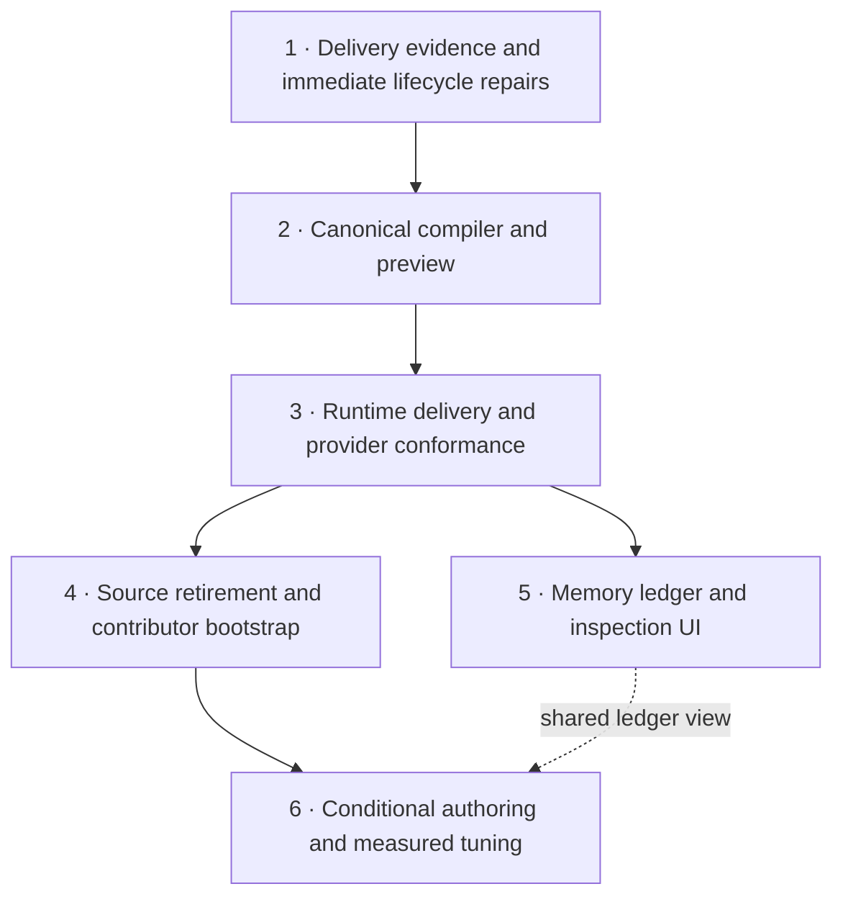

# Dynamic agent instructions: epic boundaries, migration gates, and proof of completion

**Researcher:** cdx  
**Date:** 2026-10-05  
**Primary checkout examined:** sase `235e9ba0c9ccc85e462ac8553d88ac14e84a8d89`  
**Related checkouts examined:** sase-core `c57b662c7e95794520fdb025acd4cb76c90ebc90`; chezmoi `e48f04f6f588f96741232e5a556efedf057d37ee`.

**Recommendation:** split the work into **six outcome-based epics**, with a clear completion boundary after the first four. Those four make instruction delivery dynamic and retire the old delivery system. The fifth delivers the memory ledger UI; the sixth delivers richer conditional authoring and measured audience tuning. Put emergency repairs inside the first epic and provider implementations inside the third as phases. Do not make an epic for every provider, repository, or individual report phase.

I agree with the supplied reports' central architecture: memory remains the content store; the host renders frozen instruction bundles at the effective provider boundary; adapters deliver them; native helpers get a different lifecycle overlay; and fresh clones retain a small contributor-facing stub. The most important changes to the previous recommendations are about **sequencing, ownership, truthful evidence, and explicit stopping points**.

This document recommends work; it does not create epics, change memory, deploy provider configuration, or implement the migration.

## Inputs and independence

I read these three supplied reports through audited `sase artifact read` calls:

- [SASE.md and Per-Invocation Instruction Delivery](sase_md_instruction_delivery/sase_md_instruction_delivery.md).
- [Memory-Built Agent Instructions: Provider Parity and Memory Ledger](instruction_bundles_provider_parity_and_memory_ledger.md).
- [Fresh-Clone Bootstrap and Native-Subagent Instructions](fresh_clone_bootstrap_and_native_subagent_instructions/fresh_clone_bootstrap_and_native_subagent_instructions.md).

I inspected the current primary source, opened sase-core and chezmoi through `sase repo open`, consulted official provider documentation, and ran an offline Codex prompt-input probe. I did not read another researcher's report or chat from this swarm. Historical provider usage and misfire counts below are supplied-report evidence, not independently recounted in this turn. No paid model or native-subagent experiments were launched.

CLI commands introduced in this report, such as `sase instructions show`, are proposed interfaces inherited from the supplied designs; they are not claims that the commands already exist.

## Why splitting is advisable

This migration changes four different contracts:

1. **Content:** which memory, conventions, runtime rules, and reference triggers apply.
2. **Execution:** how a root invocation, native helper, retry, or recovery actually receives that content.
3. **Repository lifecycle:** which files are committed, generated locally, ignored, synchronized, and preserved for outside contributors.
4. **Evidence and presentation:** what the host can prove was delivered and how the user inspects it.

A single epic would combine source migration, provider-specific experiments, Rust bindings, home configuration deployment, fresh-clone support, and a sizeable TUI feature. Its exit criterion would become “everything is done,” which makes intermediate progress difficult to verify and failures difficult to attribute.

Splitting by those contracts gives meaningful stopping points. An evidence epic can reveal existing failures. A compiler epic can demonstrate exactly what a hypothetical agent would receive without changing live delivery. A runtime epic can remove duplication for providers with usable suppression channels. A repository migration epic can eliminate churn while preserving interactive use. The ledger and tuning epics can then improve the experience without holding the basic migration open.

There is one seam that cannot be separated completely: **explicit delivery and retirement of native full files must happen atomically for providers that cannot suppress those files**. Prepare their adapters in the runtime epic, but activate them in the same release or project migration transaction that replaces the full files with the export stub. An epic boundary must acknowledge that dependency rather than pretending every provider can switch first.

A smaller alternative is credible: stop after the first four epics. You would have dynamic, inspectable instructions with basic provider and actor specialization. That satisfies the stated migration goal even without a new MEMORY deck, a `SASE.md` DSL, or custom traits.

## What the current code establishes

| Finding independently checked | Evidence | Implication for the split |
| --- | --- | --- |
| The primary repo tracks 20 instruction files: five names at the root and at three nested scopes. | `git ls-files`; `amd/constants.py`, lines 5–19. | Removing four root shims does not complete the content migration. Nested scopes and generator expectations need an explicit inventory. |
| Ordinary invocation and two finalizer recovery paths call the provider separately. | `llm_provider/_invoke.py:436`; `finalizers/declaration_recovery.py:83`; `finalizers/commit_repair_conflict.py:409`. | A renderer added only to the ordinary runner will miss real root turns. |
| Claude can launch multiple CLI sessions or resume inside its adapter loop. | `llm_provider/claude.py:419–441`, and its continuation branches. | Define logical invocation, provider attempt, and resumed session separately before writing receipts. |
| The provider interface and Pluggy hook currently pass prompt, model, and effort options; no instruction-bundle contract is present there. | `llm_provider/base.py:17–43`; `_hookspec.py:40–47`; `_plugin_manager.py:22–40`. | The migration needs a deliberate host/adapter boundary, including plugin compatibility. |
| Launch snapshots capture candidate files from disk. | `axe/launch_evidence.py:166–201`. | They are evidence of availability, not proof of model-visible delivery. Preserve that distinction for old runs. |
| Codex shadow homes symlink nearly every existing real-home entry. | `llm_provider/codex.py:207–244`. | Do not write a bundle through an inherited instruction symlink or let a copied override take precedence. |
| Flat memory reads and authored link resolution prefer project memory over home memory. | `memory/_read_log_paths.py:45–53,73–96`; `memory/selector.py:161–175`. | Composition and audited lookup must agree about shadowing and subject identity. |
| Current memory validation treats ignored/untracked managed instruction files as errors. | `main/init_memory/tracking.py:255–297`. | Deleting or ignoring projections without changing the producer and validator will be undone or rejected. |
| CI initializes memory before checks, including on the fast master gate. | `.github/workflows/ci.yml:57`; `master-gate.yml:133–136`. | Replace this behavior deliberately; add a drift check before any operation that could repair the very drift being tested. |
| The interactive tmux launcher runs `entry.argv` and `entry.env`. | `tmux_agent/launch.py:93–103`. | It needs interactive delivery integration; it does not automatically benefit from `invoke_agent`. |
| The home instruction source includes a hostname switch and a final-declaration requirement. | chezmoi `home/AGENTS.md.tmpl:1,55–63`. | Home cutover is a deployment milestone, not merely a source commit in sase. |
| Memory read events already carry scope origin and blob identifiers. | `memory/_read_log_models.py:53–87`. | Reuse these for a ledger; do not infer memory use from instruction delivery. |

I also checked the installed versions: **codex-cli 0.160.0** and **Claude Code 2.1.289**, matching the supplied reports.

### Independent offline Codex check

I created a temporary, isolated Codex home under the primary checkout's ignored `.sase/` directory, containing one global instruction marker. I ran `codex debug prompt-input` twice in the same primary checkout, with no model call, and removed the temporary directory afterward.

| Case | Global marker copies | Project core marker copies | Project final-declaration heading copies |
| --- | ---: | ---: | ---: |
| Default project discovery | 1 | 1 | 1 |
| `-c project_doc_max_bytes=0` | 1 | 0 | 0 |

This independently supports the bootstrap report's correction of the first two reports: **zero suppresses project instruction files while preserving global instructions in this installed version**. The public configuration reference describes the byte limit but does not guarantee this particular zero/global split. Keep an executable compatibility probe rather than treating it as an eternal contract. [Official AGENTS.md guide](https://learn.chatgpt.com/docs/agent-configuration/agents-md), [official configuration reference](https://learn.chatgpt.com/docs/config-file/config-reference).

## Issues to resolve in the prior recommendations

### 1. Define “exactly once” at the section and actor level

The first report requires one bundle and no SASE-owned native files. The fresh-clone report intentionally permits Muse and agy to load the small stub in addition to the bundle. Both cannot be literal universal acceptance criteria.

Use these invariants instead:

- One authoritative **full render for the applicable actor** per new provider session or attempt.
- No accidental second full SASE projection.
- A declared native export stub is allowed; its duplicated section cost is measured.
- Foreign instructions remain visible as a separate source category.
- A resumed session can inherit a previously delivered render; its receipt must identify that render.
- A helper is evaluated against the helper contract, even if its harness also exposes inherited root history.

A sentinel telling the model to skip a stub's bootstrap clause prevents redundant action; it does **not** remove tokens or prove non-duplication. Similarly, counting a hash marker once does not prove that every section arrived intact or that an unmarked legacy copy was absent.

Conformance should compare section content or normalized provider-visible slices and preserve the raw observation. A provider that cannot expose its prompt remains “delivery attempted; observation unavailable,” rather than receiving a green check.

### 2. “All existing instruction files” needs a bounded ownership inventory

The 20 files in sase are only one cohort. Home templates, provider config imports, other managed projects, linked repos, and manually authored nested files are additional surfaces.

For example, chezmoi's OpenCode configuration explicitly points to `~/AGENTS.md`. Removing `OPENCODE.md` therefore does not determine everything OpenCode loads. The migration must inventory configuration-based instruction discovery as well as recognized filenames.

Define the initial inventory from configured projects, configured repositories, home configuration, and deployed provider surfaces. Use the relevant SASE project/repo skills when gathering it; do not crawl arbitrary disk trees or silently migrate unrelated repositories.

Each surface should end in one of four states: **migrated memory source**, **generated export/interactive projection**, **intentional foreign native content**, or **explicitly deferred with a reason**. A filename or a “Core Memory” heading alone is too weak an ownership test for destructive deletion or broad suppression.

### 3. Codex suppression is broader than ownership

The byte-limit switch suppresses project discovery generally. It cannot distinguish a SASE-generated root file from a handwritten nested rule or an upstream instruction file.

Use it only when the project cohort's applicable native rules have been inventoried and replaced or intentionally retained through another channel. In foreign repositories, preserve native discovery. In mixed managed repositories, either migrate the relevant scope first or record a compatibility strategy that preserves its content.

Also replace the shadow-home instruction entries **by creating private regular files**, while excluding both inherited `AGENTS.md` and `AGENTS.override.md` symlinks from that construction. Otherwise a real override can beat the new bundle, or writing the new bundle can mutate the user's real global instructions. The source proves these are implementation hazards; I did not reproduce a destructive write.

### 4. Separate actor identity from task purpose

The proposed `role` values mix `root` and `subagent` with `monitor`, `gate`, `code`, and `plan`. A monitor successor is a SASE root; a helper may perform code work. Those are independent facts.

Start with at least:

- `actor = sase_root | native_helper | interactive`;
- `purpose = ordinary | monitor | gate | declaration_recovery | conflict_repair | …`;
- `mode = runtime | interactive | export`;
- effective provider, project/source scope, execution host, and delivery capabilities.

Actor and completion ownership are host-owned. Project selectors cannot promote a native helper into a root. Model, tribe, macro names, and optional future labels can remain descriptive facts. Record unknown/unavailable facts explicitly; do not turn “not known” into a false match.

This small schema belongs in the compiler epic. It cannot wait until a later audience epic because root/helper separation and provenance already depend on it.

### 5. Respect the Rust boundary from the first compiler

The first report recommends Rust parsing/evaluation but Python Markdown composition because the current renderer is Python. Existing location is not an exemption from the project's stated boundary.

The deterministic **new** section selection, ordering, ownership, deduplication, budget decisions, and canonical bundle serialization should be Rust-owned and bound to Python. Filesystem discovery, reading source bytes, subprocess flags, and storing evidence stay in Python host adapters. Existing Python memory parsing/rendering can be reused as input preparation where necessary, without implementing a second instruction compiler.

Do not build a Python compiler in one epic and announce a Rust replacement in another. That produces incompatible preview and runtime paths and turns the second epic into a rewrite. Coordinate the core change, binding registration, sase CI pin, and distributable dependency compatibility at the same boundary. The sase-core instructions explicitly require binding round-trip tests and pin movement.

### 6. Make the runtime boundary cover attempts, not three hand-maintained call sites

The current call sites are useful evidence, but adding a render call to each is fragile. A future recovery path or adapter retry can bypass them.

Create one prepared-invocation boundary carrying facts, frozen source inputs, root/helper renders, and evidence identity. Make root callers and adapter attempts use it. Record a logical invocation id plus an attempt/session id.

On a fresh fallback to another provider, recompute provider-dependent sections and channels. On a resumed Claude session, report what actually remains effective; do not claim fresh instructions merely because the compiler ran. The supplied ledger report notes system-prompt snapshot reuse. Verify that with the installed adapter before promising refresh.

Native helpers use the parent's frozen source set with the helper overlay. Audited memory reads during the turn may legitimately retrieve a newer note; record that as a subsequent read version, not as a retroactive change to the launch bundle.

### 7. The helper guard reduces accidents; it is not caller authentication

The supplied bootstrap report's two accepted Claude helper declarations are sufficient reason for an early fix. Do not wait for the general compiler.

Claude officially documents a subagent append channel, including nested non-fork helpers; forks reuse the parent's prompt. Its hook inputs also document `agent_id` for subagent tool calls. Those support an actor-qualified overlay and an identified-helper tool guard. [Official subagent documentation](https://code.claude.com/docs/en/sub-agents), [official hook reference](https://code.claude.com/docs/en/hooks).

But a Bash/Skill command guard is not a proof that arbitrary Python, a wrapper command, or every fork is a root. Shared environment variables also do not establish caller identity. Scope the promise to tested harness routes and log attempts. Do not turn this migration into a complete security redesign.

Use **zero accepted helper finalizations** as a hard correctness criterion for the covered routes. “Zero helper tool calls” is a useful operating metric, but the test suite will deliberately make denied attempts. Do not confuse denied attempts with failures of enforcement.

### 8. Retire producers and validators with the files

The old system does more than write `AGENTS.md`. Memory init also creates generated notes, updates web descriptors/rosters and README material, validates tracking, and deploys shims. The memory-write skill currently tells agents to regenerate the old projections.

Preserve maintenance of generated memory that remains necessary. Replace only the obsolete projection responsibilities, and update validators, CI, skill templates, provider metadata, instruction history/inventory presentation, and documentation together.

In particular, do not switch `sase memory init` off wholesale or leave it able to resurrect retired full files. Add an idempotence check: after migration, running supported initialization and memory-maintenance commands twice must not recreate old shims or change the tracked tree unexpectedly.

Generated skill deployment must follow the existing landed-source rule: update source templates, land them, then deploy from the canonical clean revision. Home cutover likewise needs a verified chezmoi application and deployed-runtime compatibility; a PR alone is not the exit result.

### 9. Source retirement and rollout rollback are different operations

A per-provider flag can roll delivery back while the old full files still exist. After those files are removed, “turn the flag off” may leave that provider with only a contributor stub.

Before retiring a cohort, provide a tested rollback to the previous compatible adapter/render version or a run-local legacy delivery path. Do not rely on recommitting the old 20-file system.

Older workspaces and queued launches also need treatment. A new launcher can read an old project revision and recognize legacy generated content, but an old installed launcher may not understand the new source layout. Record the minimum supported runtime, upgrade active execution hosts first, and defer the home/source cutover if that deployment condition is unmet.

### 10. Budget changes and path-rule changes need separate evidence

The delivery migration should preserve the applicable instruction set first. The previous reports measure a project render around 4.4k tokens but propose a 1.6k project budget. That requires content/router changes; it does not fall out of deduplication.

Capture a baseline, prevent silent truncation, and ratchet down after measuring. Keep the export budget separate from the full runtime budget and report effective cost including any native stub. Do not claim a tokenizer-exact number when using estimates.

Replacing Claude's automatic nested-rule loading with one-line path triggers is also a behavioral change, not just transport. Preserve each scoped rule in memory and prove that an agent editing in that scope performs the audited read. If that fails, keep the native scoped rule temporarily and show the exception. This conversion belongs before deleting the nested files.

Finally, the example `when: not { tribe: [research] }` should not suppress required lint or TUI triggers. A research agent can edit tracked code; this request itself is a reminder that task names do not establish capabilities or future actions. Keep baseline triggers, vary optional explanatory density.

### 11. Build receipts first, not the whole ledger first

The ledger report proposes an observed-mode chip and Receipt card in Phase 0. That mixes urgent provider repair with TUI registry changes, history pins, visual tests, and performance work.

Keep its architectural idea but narrow the initial deliverable: immutable intended/observed records, a CLI view, legacy status, and targeted provider diagnostics. Add the full TUI deck and reverse lookup in their own epic after the producer contract stabilizes.

The future reverse index must be derived and repairable; immutable receipts are authoritative. A crash between receipt storage and index update must not erase the only evidence of delivery. Avoid constructing a second competing artifact store without first assessing the existing snapshot/artifact infrastructure.

Also describe “read” as an audited lookup, not proof of comprehension or influence on behavior. Unobserved helper attribution must not be silently reported as a root read.

## A common contract that keeps the epics compatible

Freeze a small v1 contract during the first two epics:

- **Source identity:** repository/scope, logical note or package section id, exact source bytes/digest, and revision/blob when available. Dirty source content needs a digest and stored bytes; HEAD alone is insufficient.
- **Bundle identity:** compiler/schema version, ordered sections, required/optional classification, source manifest, exact rendered bytes, digest, and effective facts.
- **Delivery identity:** actor, parent if any, invocation/attempt/session ids, provider CLI version, explicit channel, native ownership classification, suppression decision, and capabilities.
- **Observation:** full/partial/unavailable evidence; delivered, inherited, duplicated, missing, or incompatible status; raw observation reference and normalization version.
- **Fallback:** compatibility key includes actor, project/scope, execution host and provider/runtime requirements. Never substitute a last-known-good render from another actor or project. With no compatible render and a failed required compilation, refuse the launch with an attributed error.
- **Ledger:** joins by scoped subject and version; preserves excluded, shadowed, foreign, and legacy states. The read log and launch receipt remain distinct evidence.

The first version needs fixed package/home/project ordering and built-in actor/provider decisions. It does not need an expressive `SASE.md` syntax, traits, arbitrary templating, a task classifier, or model-specific variants.

Remote dispatch should render against the **target's** source snapshot and execution facts at its provider boundary. Preserve the existing remote launch/idempotency contract; do not add a second dispatch mechanism. An incompatible bundle/renderer protocol is a typed preflight failure or declared legacy mode, not an implicit local-machine render sent to the target.

## Verification strategy and user review

Every epic should leave a short, durable acceptance record: source revisions, supported CLI versions, commands/fixtures exercised, resulting bundle/receipt identities, expected versus observed results, and declared gaps. A user should be able to open that record and repeat one small demonstration.

Separate three levels:

| Level | What it establishes | What it does not establish |
| --- | --- | --- |
| Compiler/adapter fixtures | Deterministic content selection, wire compatibility, argv/settings preparation, lifecycle coverage, failure paths. | Whether an installed vendor CLI honors its flags. |
| Installed-CLI conformance probes | Effective prompt content or explicit limits of observation for a pinned CLI version. | Long-term model compliance or future-version compatibility. |
| Small behavioral tasks and operating metrics | Whether required reads, helper handback, and root completion happen in practice. | Causal proof from an uncontrolled historical before/after comparison. |

Do not make a 30-day observational window the only way to close an epic. Use finite acceptance scenarios for completion, and keep production monitoring as continuing evidence. The historical Grok completion rate and Claude helper misfires motivate work; raw percentage recovery alone should not gate landing.

A shared acceptance matrix should cover: ordinary root; declaration recovery; conflict repair; fresh provider retry/fallback; resumed session; native helper and fork where supported; reused workspace; foreign repository; handwritten override; empty home; fresh public clone; missing optional source; invalid required source; compatible and incompatible fallback; and target-host/version skew. Classify unavailable cells explicitly rather than counting them as passes.

Checks for each implementation follow the existing project verification policy. Use the authorized guarded `just check` path, relevant Rust binding checks, and visual/performance checks when the TUI epic lands. Do not make `just check-full` a new default agent requirement.

## Source references

The code findings above were read locally. Useful durable links to the examined primary revision include:

- [Provider invocation and effective routing](https://github.com/sase-org/sase/blob/235e9ba0c9ccc85e462ac8553d88ac14e84a8d89/src/sase/llm_provider/_invoke.py#L334).
- [Codex shadow home](https://github.com/sase-org/sase/blob/235e9ba0c9ccc85e462ac8553d88ac14e84a8d89/src/sase/llm_provider/codex.py#L207).
- [Claude session/continuation loop](https://github.com/sase-org/sase/blob/235e9ba0c9ccc85e462ac8553d88ac14e84a8d89/src/sase/llm_provider/claude.py#L419).
- [Instruction snapshot semantics](https://github.com/sase-org/sase/blob/235e9ba0c9ccc85e462ac8553d88ac14e84a8d89/src/sase/axe/launch_evidence.py#L166).
- [Managed-file tracking requirements](https://github.com/sase-org/sase/blob/235e9ba0c9ccc85e462ac8553d88ac14e84a8d89/src/sase/main/init_memory/tracking.py#L255).
- [Memory-write skill source](https://github.com/sase-org/sase/blob/235e9ba0c9ccc85e462ac8553d88ac14e84a8d89/src/sase/macros/skills/sase_memory_write.md#L42).
- [Interactive tmux launch](https://github.com/sase-org/sase/blob/235e9ba0c9ccc85e462ac8553d88ac14e84a8d89/src/sase/tmux_agent/launch.py#L93).

Project decisions consulted through audited memory reads: **Adapters Normalize Harnesses**, **Agents Are Single-Turn**, and **The Rust Core Is Required**. I also read the artifact, generated-skill, macro, remote-dispatch, and TUI reference memories. Future implementation must use the memory-write procedure for the relevant note/template migrations and the CLI/flag instructions when introducing those interfaces.

## Recommended epics, in implementation order

The names below are outcome-oriented proposals. Keep one owner for the shared source/bundle/receipt contract across the epics. Provider and project migrations are phases of the relevant epic, rather than separate epics with competing contracts.

Epics 5 and 6 can proceed independently once their required contracts exist; neither blocks completion of the first four. The diagram's final dotted edge is coordination, not a hard dependency.

### Epic 1 — Make instruction delivery observable and stop known lifecycle mistakes

**Outcome:** the host can distinguish availability, intended delivery, and observed context, and the urgent Grok-root/Claude-helper failures have focused repairs.

**Dependencies:** none beyond the existing launch system.

**Scope:**

- Establish the initial ownership/cohort inventory and provider capability matrix.
- Define the v1 evidence envelope and invocation/attempt/actor vocabulary.
- Add a bounded CLI inspection/doctor view for current native-file runs, marked legacy or observed-only.
- Restore Grok root instructions through a verified explicit channel without granting workspace trust.
- Add the Claude helper overlay, root-only tool guard on identified routes, and actor-qualified lifecycle wording through the canonical template/memory workflow.
- Preserve existing instruction files while these repairs are validated.

**Completion/exit criteria:**

1. A CLI acceptance fixture distinguishes missing context, duplicated legacy content, disk-only availability, and unavailable observations without false green states.
2. A pinned Grok root probe demonstrates package/project/home coverage available to that run, while native SASE full-file loads are absent or explicitly explained.
3. Claude Explore and general-purpose helper probes receive the helper rules; covered helper attempts to finalize are denied, while the root can finalize.
4. Fork and other-provider helper limitations are listed by capability and evidence, not hidden.
5. Every current inventory entry has an owner and migration disposition. Existing production launch paths still work.

**Easy user confirmation:** inspect the provider matrix and one Grok receipt, then run a short Claude delegation task and see a helper result returned to the root. Open the guard test evidence showing a denied helper submit and a permitted root submit.

**Rollback:** remove the targeted delivery overlay/guard through its supported rollout control; legacy instruction files still exist. A CLI conformance check continues to show the reverted state.

**Boundary:** no complete compiler, MEMORY deck, general condition language, or instruction-file deletion.

### Epic 2 — Compile canonical instruction bundles from memory and preview them

**Outcome:** given frozen memory sources and host facts, one deterministic compiler produces the exact root, helper, interactive, or export render and its source manifest.

**Dependencies:** Epic 1's actor/evidence contract.

**Scope:**

- Introduce Rust-owned selection/composition semantics, bindings, and the required sase core pin/dependency coordination.
- Build the lifecycle-neutral core plus actor-specific overlays and provider adapter sections.
- Preserve core/reference/web behavior, source shadowing, required triggers, and explicit provenance.
- Add read-only render/preview/check interfaces and fixed v1 budgets with clear estimate labels.
- Store immutable rendered bytes using an assessed existing storage mechanism or a justified new one.
- Recognize legacy generated contract notes as superseded compiler input, while leaving legacy file production available during migration.

**Completion/exit criteria:**

1. Identical source snapshots and facts yield byte-identical renders and digests across repeated calls, with stable ordering.
2. Root/helper/interactive/export fixtures have the correct lifecycle obligations; neither project text nor labels can change completion ownership.
3. Home/project same-name fixtures resolve the same effective subjects as audited memory lookup.
4. The source manifest explains every included, shadowed, and excluded section, and captures dirty-source bytes accurately.
5. Missing optional sources are explicit; invalid required sources fail before launch. Compatible fallback cannot cross actors/projects/providers incorrectly.
6. CLI previews and bound Rust results agree; registered binding round trips and the CI pin checks pass.
7. Previewing does not alter tracked files or change live default delivery.

**Easy user confirmation:** render the same project as root, helper, and interactive; diff them and observe that only the root owns SASE completion. Change a fixture note, rerender, and see that the output and source digest change without regenerating root instruction files.

**Rollback:** previews/compiler selection can be disabled while the legacy generator remains supported.

**Boundary:** fixed actor/provider specialization is required; custom `when:`, project composition syntax, traits, and budget reductions are reserved for Epic 6.

### Epic 3 — Deliver bundles through every runtime route and prove provider behavior

**Outcome:** the runtime prepares one instruction contract for each effective provider attempt, and capable providers use explicit delivery with correctly scoped native suppression.

**Dependencies:** Epic 2; installed-runtime capabilities verified in Epic 1.

**Scope:**

- Add the central prepared-invocation boundary for ordinary turns, recovery, retries/fallbacks, and adapter-created sessions.
- Implement root/helper delivery plans and plugin defaults with declared capability status.
- Integrate frozen parent inputs for helpers and inherited-render records for resumed sessions.
- Replace old adapter directive injection only when its bundle section is delivered.
- Ensure private Codex shadow instruction files, suppression ownership checks, and preservation of foreign/global configuration.
- Integrate target-side facts and remote protocol compatibility.
- Produce receipts and conformance observations for every covered route.

**Completion/exit criteria:**

1. The lifecycle matrix has no uninstrumented provider attempt on the enumerated root routes.
2. Claude, Codex, and Grok can be enabled in a managed cohort without a second full SASE render; home coverage is explicit.
3. Foreign-repo and handwritten-override tests preserve intended native instructions. Global instruction files remain byte-identical after the run.
4. Fresh fallback uses the effective provider's sections and delivery channel; resumed sessions identify their actual inherited or refreshed render.
5. Claude covered helper routes deliver the helper contract and reject finalization. Other providers declare inherited/best-effort/unsupported helper behavior accurately.
6. All configured adapters pass preparation tests and their feasible installed-CLI probes.
7. Providers that cannot suppress full native files are explicitly **ready for cohort cutover**, with their stub-based path verified in fixtures, but remain on their safe legacy mode until Epic 4. This is an intentional exit state, not an assertion that all production providers already switched.
8. Rollback restores a compatible delivery path, and workspace instruction generation does not dirty the tracked tree.

**Easy user confirmation:** compare equivalent Claude/Codex/Grok receipts and inspect the common section digest. Repeat a forced fallback and a reused-workspace fixture; each records the expected provider, actor, source version, and channel.

**Rollback:** per-provider/cohort controls before retirement; after retirement, use the compatible previous explicit-delivery version or the run-local legacy path. Verify both paths before declaring the rollout ready.

**Boundary:** adapter work is grouped into phases under one epic. Do not expand rare native-helper channels solely to turn every status green; retain declared limitations and require a real usage case for additional spikes.

### Epic 4 — Retire full instruction projections and preserve contributor workflows

**Outcome:** all in-scope owned instruction surfaces derive from memory; SASE launches no longer depend on stale committed full files; fresh clones and raw interactive sessions retain usable, correct guidance.

**Dependencies:** Epic 3's delivery/cutover readiness, plus deployed-runtime compatibility. This is the **migration-complete milestone**.

**Scope:**

- Migrate nested instructions into source memory with scoped triggers and demonstrated audited lookup.
- Replace full committed files with the generated budgeted export `AGENTS.md` and small Claude import shim.
- Implement conservative interactive sync into SASE-owned ignored paths, including Codex override collision protection.
- Route `sase tmux-agent` through interactive delivery.
- Change memory-init producers/validators, source templates, CI drift checks, instruction inventory/history views, and generated skills so retired files stay retired.
- Convert home instruction templates to interactive mode and verify the chezmoi deployment after canonical source landing.
- Sweep the inventoried managed-project cohorts, preserving foreign/manual content.
- Activate unsuppressible-provider explicit delivery atomically with each cohort's stub replacement.

**Completion/exit criteria:**

1. Every inventory entry is reconciled to a migrated source, intended projection, foreign/manual surface, or explicit accepted deferral; no unknown full SASE copy remains in the declared migration scope.
2. The initial 20-file sase cohort is replaced as designed. Relevant nested rules still exist in memory and an edit-under-scope acceptance task performs their audited reads.
3. Fresh clone with no SASE home/skills/state gets usable build/test guidance and no turn-finalization obligations.
4. After supported setup/sync, Claude and Codex load interactive guidance; an occupied user override is preserved and produces an actionable collision result.
5. Sync is idempotent, noninteractive, refuses SASE workspaces, and writes only owned ignored projections. Reuse cleanup removes only positively owned stale projections.
6. Supported init, memory maintenance, and skill workflows do not recreate retired full files. CI detects deliberate export drift before any regeneration can repair it.
7. A reference-note-only edit changes the next runtime bundle where applicable without changing the committed export stub. An export-relevant convention edit produces only the intended export update.
8. All deployed execution hosts in scope support the new contract before global home cutover. The applied home files and interactive tmux sessions are verified, not merely their source changes.
9. Every enabled root provider uses the dynamic path or has an explicitly accepted limitation; allowed stub loads and helper gaps are visible in receipts.

**Easy user confirmation:** use a fresh-clone acceptance environment, run setup/sync twice, and check that `git status` stays clean. Change a fixture reference note and launch again: the bundle reflects it while the stub does not churn. Open the final ownership inventory and deployment evidence.

**Rollback:** restore the prior compatible renderer/delivery implementation while keeping the short committed surface, or use the tested run-local legacy channel. Rolling back a flag alone is insufficient after this epic.

**Boundary:** optional SessionStart/git refresh hooks are conveniences, not completion prerequisites if setup, explicit launcher delivery, and the generate-then-read fallback already work.

### Epic 5 — Expose a versioned memory ledger in the CLI and TUI

**Outcome:** the user can inspect intended instructions, observable provider context, and audited memory reads for an agent without confusing those evidence types.

**Dependencies:** stable Epic 2/3 receipts and real runtime data. Can proceed alongside Epic 4.

**Scope:**

- Add a Rust-owned ledger view shared by CLI and TUI.
- Implement the quiet header chip, upgraded Context MEMORY lane, Receipt/Ledger/Bundle deck, and pinned history navigation.
- Add the repairable reverse index and Memory pane “Seen by” lookup.
- Preserve old disk snapshots with explicit legacy/availability labels.
- Add bounded background loading and cache invalidation; keep filesystem/history scans off selection/render hot paths.

**Completion/exit criteria:**

1. One fixture covers inlined, offered, audited-read, unlisted-read, excluded/shadowed, foreign, duplicate, changed-version, inherited, and unavailable-observation states.
2. CLI and TUI agree on those states and totals for the same receipt/read inputs.
3. A selected row opens the exact historical bytes, even after the current source changes.
4. A missing/corrupt/stale reverse index is rebuildable without altering receipts or fabricating observations.
5. Old runs remain inspectable and are never presented as proven deliveries.
6. Visual/navigation checks pass; an agreed realistic corpus demonstrates bounded selection latency and no synchronous history scan.

**Easy user confirmation:** open one agent's MEMORY deck, follow a pinned note version, compare it with the current note, and use “Seen by” to return to the agent. Select an unverifiable-provider example and confirm its status remains visibly uncertain.

**Rollback:** disable the new presentation/read model while retaining the durable receipts. No runtime instruction behavior depends on the deck.

**Boundary:** no claim that a read proves comprehension; no requirement to backfill intended bundles for historical runs that never recorded them.

### Epic 6 — Add conditional authoring and reduce context with measured audiences

**Outcome:** authors can express a small set of useful audience differences with the same compiler used by launch and preview, and demonstrate a cost reduction without removing required guidance.

**Dependencies:** Epic 3 for runtime specialization; Epic 4 for stable source ownership. Epic 5's UI is useful but not a hard dependency because CLI evidence already exists.

**Scope:**

- Add the optional layered `SASE.md` composition spec and declarative `when:` frontmatter with one Rust parser/evaluator.
- Validate unknown keys, registry-based provider identities, unavailable facts, and protected required sections.
- Add matrix preview/check and editor diagnostics.
- Ship a bounded first set of conditionals: monitor/gate density, the phase-worker task-recording rule, and commit-method explanatory text.
- Ratchet runtime/project budgets from measured baselines. Retain required reads for researchers who may edit code.
- Defer traits and a prompt escape hatch until an actual section cannot be expressed through host facts.

**Completion/exit criteria:**

1. Launch, CLI preview, and editor validation agree for the same spec/facts.
2. The finite supported audience matrix contains the applicable hard lifecycle rules and baseline read triggers in every render.
3. Invalid selectors have attributed line-level errors; project content cannot remove protected obligations or grant helper ownership.
4. The shipped audiences reduce measured optional instruction cost against the recorded baseline, with fixed task scenarios showing correct required reads and completion.
5. Effective cost includes provider overlays and any unavoidable stub, and no channel silently truncates the render.
6. An audience spec rollback returns the fixed Epic 2/3 render without reverting the source migration.
7. No free-form labels ship merely because the syntax is easy to add.

**Easy user confirmation:** run the matrix preview, compare ordinary/monitor/phase-worker renders, and inspect the inclusion reasons and budget results. Run the short acceptance tasks and see required audited reads and actor-appropriate completion.

**Rollback:** disable custom selectors/spec overrides or restore the previous compatible spec, preserving the default package contract and dynamic delivery.

**Boundary:** task classifiers, broad model-tier variation, a general expression language, and custom trait infrastructure remain outside this epic unless separately justified.

**Recommended stopping decision:** approve Epics **1–4** as the finite migration program, with the end of Epic 4 as the explicit “all inventoried instruction surfaces migrated” review. Approve Epic **5** as the separate inspection experience and Epic **6** as measured audience work. If prioritization requires a smaller program, complete 1–4 and stop there; do not leave native-file retirement or contributor bootstrap as optional cleanup after declaring the migration complete.
